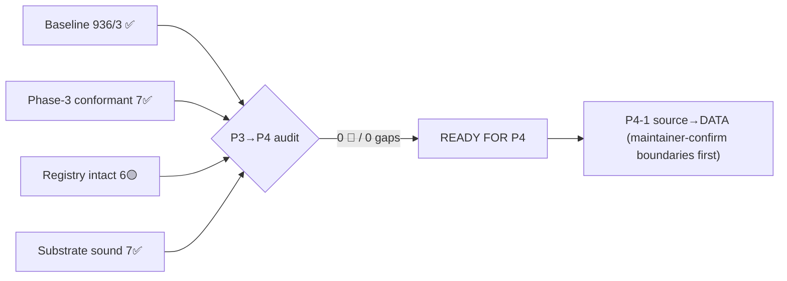

# Impl-Adherence Review — P3→P4 boundary (2026-06-24)

**Type**: decision/analysis record (immutable history; forward-annotate if superseded).
**Playbook**: `implementation-review-handoff.md` (read-only, code-grounded, parallel lenses →
adversarial verify → 4-state classify). **Trigger**: mandatory first action of
`P4-handoff-sharing-core.md` §1 before any P4 code.
**Branch**: `feat/vault/decentralized-config` (commits local; maintainer pushes from Mac).
**Baseline**: **936 passed / 3 failed / 939 total** with `CCO_ALLOW_HOST_RESOLVE=1 ./bin/test`.
**Method**: 4 parallel read-only lenses (A Phase-3 conformance · B Transitional-Registry intactness ·
C taxonomy/coordinate/invariants · D P4-readiness call-site map), each blind to the others, then a
main-session adversarial-verification grep pass on the load-bearing claims.

## Verdict

**READY FOR P4. 0 🔴 / 0 blockers / 0 genuine HITL / 0 design gaps.** The four mandatory confirmations
of P4-handoff §1 all hold:

1. **Baseline = 936/3** — confirmed by direct run; the 3 are exactly the P4–P5 set.
2. **Phase 3 conformant** — Lens A: 7/7 ✅.
3. **Transitional Registry §4 intact** — Lens B: 6/6 present-but-legacy (🟡), 0 prematurely cleaned.
4. **Registry refresh** — nothing landed since P3 close (vault / T4-tags / T5 base-meta already retired);
   registry is current, no edit needed until P4 lands.

One adversarial correction to a lens estimate (nomenclature scope, below) — refines P4-4, changes no verdict.

## 1. Baseline (handoff §1.1) — ✅

`CCO_ALLOW_HOST_RESOLVE=1 ./bin/test` → **936/3/939**. The 3 failures, confirmed by direct
`--file` runs, are the documented P4–P5 set (no 4th = no regression):

| Test | File | Phase | Reason |
|---|---|---|---|
| `test_resolve_name_from_full_variant_url` | `tests/test_llms.sh` | P4–P5 | stale llms name-derivation |
| `test_publish_ignore_path_patterns` | `tests/test_publish_install_sync.sh` | P4 | publish-ignore pattern |
| `test_project_internalize_updates_base` | `tests/test_publish_install_sync.sh` | P4 | `.cco/base/` assertions (source→DATA) |

(Without the `CCO_ALLOW_HOST_RESOLVE=1` hatch, 3–4 pure path-resolver unit tests additionally fail on
the H4 guard *by design* — not regressions; the hatch is mandatory in this dev container.)

## 2. Phase-3 conformance (handoff §1.2) — Lens A: 7✅ / 0❌ / 0🟡 / 0🔴

| # | Check | State | Evidence |
|---|---|---|---|
| 1 | Decentralized `cco start` reads `<repo>/.cco/` | ✅ | `lib/cmd-start.sh` `_start_resolve_project` cwd-first via `_resolve_find_unit_dir`; `project_dir="$unit_dir/.cco"`; mounts `${claude_src}:/workspace/.claude` where `claude_src="$project_dir/claude"` |
| 2 | Vault/profile world gone | ✅ | `lib/cmd-vault.sh` absent; no `vault)` arm in `bin/cco`; no profile/switch/shadow |
| 3 | `cco tag` / `cco list --tag` over DATA `tags.yml` | ✅ | `lib/tags.sh` (`_tags_*` API, file = `$(_cco_data_dir)/tags.yml`); `cmd_tag`/`cmd_list`; sourced `bin/cco` |
| 4 | `cco config save/push/pull` | ✅ | `lib/cmd-config.sh` allowlist explicit staging (never `git add -A`), 2-pass secret-scan `.example`-exempt, `--ff-only` pull |
| 5 | `cco init` scaffold + global-ensure + `migration-state` marker gate; no manifest | ✅ | `lib/cmd-init.sh` idempotent global-ensure + per-repo scaffold + index-register, "Emits NO manifest.yml (ADR-0012)" (`:114`); `lib/migrate.sh` `_cco_migrate_global` gates on `<state>/cco/migration-state` marker |
| 6 | config-editor built-in | ✅ | `internal/config-editor/.claude/` exists; no committed `project.yml` (runtime-generated); ADR-0027 |
| 7 | `_archive/` move done | ✅ | `docs/maintainer/configuration/_archive/{vault,sharing,resource-lifecycle}/` present |

## 3. Transitional Registry intactness (handoff §1.3) — Lens B: 6 present(🟡) / 0 missing(🔴)

All six items P4 retires are still **present-but-legacy** (correct — a missing one would have meant
premature cleanup breaking delta-green). Adversarially re-confirmed in the main session.

| # | Item | State | Evidence (file:line) |
|---|---|---|---|
| 1 | `@local` sanitize/extract/restore + `local-paths.yml` plumbing | 🟡 | `lib/local-paths.sh` `_sanitize_project_paths()` :257, `_extract_local_paths()` :702, `_restore_local_paths()` :774. **KEEP-forever helper `_project_effective_paths()` :1236** (consumed by cmd-start) |
| 2 | Per-section schema bridge | 🟡 | `lib/local-paths.sh` `_effective_repo_mounts()` :1101, `_effective_extra_mounts()` :1132 (legacy `path:`/`source:` ⇒ legacy chain; empty ⇒ coord parsers + index) |
| 3 | Tier-2 legacy verbs | 🟡 | `bin/cco` arms: delete :209, install :210, publish :212, add-pack :215, remove-pack :216, resolve :217, validate :220 → impls in `lib/cmd-project-{query,pack-ops,delete}.sh` |
| 4 | `lib/manifest.sh` + `cco manifest` | 🟡 | file present; `manifest)` arm `bin/cco:265`; `manifest_init`/`manifest_refresh` called from cmd-pack / cmd-project-install / cmd-project-publish / remote.sh |
| 5 | Harness dual-seed + legacy `CCO_*_DIR` | 🟡 | `tests/helpers.sh` `setup_global_from_defaults` seeds legacy `$CCO_GLOBAL_DIR` (:108) **and** `~/.cco/global` (:114); `CCO_{USER_CONFIG,GLOBAL,PROJECTS,PACKS,TEMPLATES,LLMS}_DIR` defined in `setup_cco_env` |
| 6 | `source` provenance read **in place** | 🟡 | `lib/paths.sh` `_cco_pack_source()` :137, `_cco_project_source()` :152 → read `<…>/.cco/source`; old keys `source:`/`path:`/`commit:` parsed in `lib/update-remote.sh`; `publish_target` stored/read `lib/cmd-pack.sh` ~:1062 |

**Already-retired, correctly absent** (do NOT re-add): `cco vault *` world · `cco project create` ·
T5 base/meta at old `.cco/` location · T4-tags at old path. All confirmed gone.

## 4. Taxonomy / coordinate / invariant adherence (Lens C) — 7✅ / 0🔴 (+1 🟡-known)

Substrate P4 builds on is sound:

- **4-bucket taxonomy** `lib/paths.sh` `_cco_{config,data,state,cache}_dir` honoring `CCO_*_HOME`+XDG;
  no internal datum in a committed CONFIG bucket. (`source` still in `.cco/source` = the known 🟡 P4-1 item.)
- **AD3/G8** `project.yml` carries logical names + url/ref only; STATE index `lib/index.sh` maps name→path;
  `cco start`/`cco init` never write a real host path into committed config.
- **Index** atomic `mktemp`+`mv`, no lock, global-flat (H7).
- **H4** host-side resolver guard intact (`_cco_resolver_guard`, all 4 resolvers call it).
- **compose↔entrypoint** container paths fixed; host-source changes only.
- **P14/P15** resolve/start warn-and-exclude an unresolved member, never hard-die.
- **M3 remotes split** DATA `remotes` (url) + STATE `remotes-token` (0600).

## 5. P4-readiness call-site map (Lens D, adversarially corrected)

Current, code-grounded map for the build (re-grep before editing — line numbers drift). Per work-item:

- **P4-1 source→DATA**: `lib/paths.sh` `_cco_pack_source` :137, `_cco_project_source` :152 —
  **`_cco_template_source` does NOT exist → must CREATE**. Consumers: `cmd-pack.sh`
  install/conflict/update/internalize/publish/`_resolve_publish_remote`, `cmd-project-{install,publish,update}.sh`,
  `update-remote.sh` (`source:`/`ref:`/`path:`/`commit:` parse), `update.sh` defaults-resolver,
  `cmd-remote.sh` remove-warn. `publish_target` stored `cmd-pack.sh` ~:1062 (→ F4 re-derive). Test surface
  ≈ 90+ hardcoded `.cco/source` assertions across `test_publish_install_sync` / `test_pack_install` /
  `test_pack_publish` / `test_project_publish` / `test_pack_internalize`.
- **P4-2 discovery**: `lib/manifest.sh` `manifest_init` :13 / `manifest_refresh` :35; callers in
  `cmd-pack.sh` (install/publish), `cmd-project-install.sh` (~:223 + the "no manifest.yml" die :110),
  `cmd-project-publish.sh` (~:300), `remote.sh` `_clone_for_publish` empty-repo seed. Generalize
  `cmd_pack_install`'s single-pack `pack.yml`-at-root fallback.
- **P4-3 sync-before-publish**: defect publish path via `_clone_for_publish` `cmd-pack.sh:934` (clone HEAD →
  rm -rf → cp -R → push — re-grep exact lines). Reuse `lib/update-merge.sh` (`_merge_file`/`_resolve_with_merge`/
  `_collect_file_changes`) + pack-scoped STATE base `_cco_pack_base_dir` `lib/paths.sh:148` (exists, P2-created).
- **P4-4 2×2**: `bin/cco` REMOVE project `install`:210/`publish`:212; REFACTOR `cmd-pack.sh` publish/install
  (export :252 exists); **BUILD-NEW** = pack `import` (no `cmd_pack_import`/`import)` arm), project `export`+`import`
  (no `lib/cmd-project-{export,import}.sh`), template `publish`/`install`/`export`/`import` (`cmd-template.sh`
  has only list/show/create/remove). projects-don't-publish guard (P13).
- **P4-5 teardown**: delete tier-2 verbs (§3 above) with consumers; `@local` sanitize block invoked by
  publish/install; **KEEP `_project_effective_paths`** (`lib/local-paths.sh:1236`, cmd-start consumer);
  remove harness dual-seed + legacy `CCO_*_DIR` once update/build/clean read only `~/.cco`.

### Adversarial correction — nomenclature scope (refines P4-4, not the verdict)

Lens D estimated the "config repo" → "sharing repo" code migration as "~2 strings (very lightweight)".
**Direct grep: 32 occurrences across `lib/` + `bin/`** (`cmd-update.sh:85`, `cmd-project-publish.sh`,
`cmd-project-install.sh`, `cmd-remote.sh:236/255`, …). Most live in `cmd-project-{publish,install}.sh`,
which P4-4 **deletes** (strings vanish with the files); the residue (`cmd-update.sh`, `cmd-remote.sh`,
`remote.sh`) is what actually needs rewording. Scope is "modest, mostly absorbed by the file deletions",
not "2 strings". Recorded so P4-4 doesn't under-scope the sweep.

## 6. Registry refresh (handoff §1.4)

No phase has landed since Phase 3 closed → no item moves ❌→✅ or out. The §4 Transitional Registry in
`implementation-review-handoff.md` is **accurate as-is**; it will be refreshed item-by-item as P4-1…P4-5 land.

## 7. HITL / design gaps

**None.** No 🔴, no ambiguous transitional state, no design/ADR contradiction surfaced by the code. The
audit confirms readiness; it re-opens no settled design. The build-sequence commit boundaries
(P4-1…P4-doc) remain a maintainer-confirm item per handoff §3 before coding starts.

