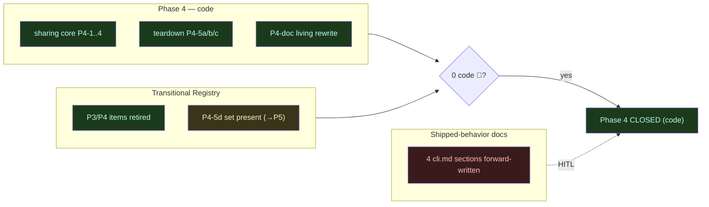

# P4 → P5 Implementation-Adherence Review (boundary audit)

**Date:** 2026-06-24 · **Branch:** `feat/vault/decentralized-config` · **HEAD:** `add4554`
**Baseline:** **827 passed / 1 failed / 828 total** (`CCO_ALLOW_HOST_RESOLVE=1 ./bin/test`).
The 1 = `test_resolve_name_from_full_variant_url` (the P5 llms straddler — expects `react`,
derives `example-react`; llms name-derivation rewrite is owned by P5). **No 2nd regression.**

Read-only, code-grounded audit run per `implementation-review-handoff.md` at the **Phase-4 →
Phase-5 boundary**, before building P5. Method: 4 parallel blind lenses (A Phase-4 conformance ·
B Transitional-Registry refresh + no-premature-cleanup · C taxonomy/coordinate/invariants ·
D doc-coherence) → main-session adversarial verification (every doc claim re-grepped against the
live code) → 4-state classify (✅ conformant / ❌ missing / 🟡 hybrid-intentional / 🔴 hybrid-error).

---

## 0. Verdict

**Phase-4 *code* is fully conformant. 0 code 🔴 · 0 blockers · 0 design gaps.** The sharing-core
build (P4-1…P4-5c) + P4-doc match design §6.2/§7/§9-P4 and ADRs 0012/0018/0019/0022/0023; the
schema bridge is collapsed to index-only; the Transitional Registry is intact (every P3/P4 item
correctly retired; the P4-5d set correctly still present and sanctioned for P5).

**One finding cluster, doc-only (🔴 doc-coherence) — RESOLVED this session.** Shipped-behavior docs
documented **P5-not-yet-built** commands as if they ship, while the code rejects each with "ships in a
later release": `cli.md` §3.4b `cco forget`, §3.16 `cco update --check`, §3.21 `cco config validate`,
§3.25 `cco project coords`; plus `configuration-management.md` rows for `cco update --check`,
`cco config validate`, **`cco template update`**, and the **`cco template internalize`** half. This
violates the documentation-lifecycle rule (shipped-behavior docs must not run ahead of the code) and was
**inconsistent within the docs themselves** (the same commands were correctly marked 🚧 elsewhere). It is
**not a code defect** and does **not** block Phase-4 closure. **Maintainer chose Option A (fix now,
doc-only); applied** — 🚧 markers added to all sites, matching the §3.14 precedent (delta-green-safe,
827/1 unchanged). See §5.

---

## 1. Lens A — Phase-4 sharing-core conformance ✅

Every Phase-4 deliverable verified built, in final form, file:line-grounded.

| Deliverable | ADR / design | State | Evidence |
|---|---|---|---|
| `source` → DATA + field rename (`source→url`, `path→resource`, `ref` kept) | 0022 D1 / §9-P4 | ✅ | `lib/paths.sh` `_cco_{pack,project,template}_source` → `<data>/cco/…/source` (no in-tree fallback); `_cco_template_source` new |
| machine-local bookkeeping → STATE meta; `publish_target` dropped + re-derived | 0022 D1 (F4) | ✅ | `_meta_record_provenance`/`_meta_installed_commit` (`update-meta.sh`); `_resolve_publish_remote`+`remote_get_name_for_url` (`cmd-pack.sh`); idempotent `_relocate_legacy_pack_sources` in `cco update` |
| llms `source` **not** relocated (already CACHE/coord-split) | 0016 D2/D7 | ✅ | unchanged; migrate backfill still reads legacy `source:` from BACKUP |
| manifest removal → structure-based discovery | 0012 / 0018 D3 | ✅ | `lib/manifest.sh` deleted; `cco manifest` arm → removed-stub die; `_discover_resources` in `remote.sh`; `_clone_for_publish` empty-repo seed = `git commit --allow-empty`; `cco init` emits no manifest |
| sync-before-publish (3-way, abort-on-conflict, `--force` escape) | 0022 D5 / §6.2 | ✅ | `_pack_sync_merge` (whole-file, returns 1 on conflict); `_record_tree_as_base`/`_record_pack_base` write STATE `base/` on install+publish; `cmd_pack_publish` rewritten — no blind clone-then-overwrite |
| 2×2 verbs (packs/templates publish/install/export/import; projects export/import only) | 0023 D4 / §7 | ✅ | `cmd_pack_import`, `lib/cmd-project-export-import.sh`, template 2×2 in `cmd-template.sh`; project publish/install/update/internalize **deleted** → AD12 explicit rejections; `cco init --template` |
| P13 projects-don't-publish guard | 0018 D2 | ✅ | `bin/cco` project dispatch → die for publish/install/update |
| nomenclature "config repo" → "sharing repo" | 0018 D1 | ✅ | swept across surviving `lib/`+`bin/`; no residual "config repo" in live code |
| P4-doc living-rewrites | doc-lifecycle | ✅ | `architecture/coding-conventions.md` full rewrite + `security.md`; `browser-mcp/design.md` `cco project create→init`; `auth/design.md` correctly unchanged |

**Lens-A verdict:** sharing-core conformant; 0 findings.

## 2. Lens B — Transitional Registry refresh ✅ (0 🔴)

**All P3/P4 items correctly RETIRED (verified absent):** `lib/cmd-vault.sh` + `cco vault` +
profile/switch/shadow + memory-auto-commit (D33) + `.gitkeep` (D32); `cco project create` +
`lib/cmd-project-create.sh`; `lib/manifest.sh` + `cco manifest` + manifest writers;
tier-2 verbs (`project resolve`/`validate <name>`/`add-pack`/`remove-pack`/`delete`); the `@local`
sanitize/extract/restore family in `local-paths.sh`; the per-section schema-bridge legacy arm
(collapsed index-only, P4-5c-2); legacy parsers `yml_get_repos`/`yml_get_extra_mounts` (P4-5c-3);
`lib/cmd-project-{install,publish,update}.sh` (P4-4e).

**P4-5d set correctly PRESENT & sanctioned (🟡, retires in P5) — the next-phase work-list:**

| Item | Where | Note |
|---|---|---|
| harness dual-seed | `tests/helpers.sh` (`setup_global_from_defaults` legacy GLOBAL_DIR + `~/.cco/global`; `create_project` central seed) | drop once last central consumer cuts over |
| legacy `CCO_*_DIR` / `$GLOBAL_DIR` default | `bin/cco` resolution + harness export | `$GLOBAL_DIR` already `~/.cco/global` (P3-3b); `CCO_*_DIR` fallback remains |
| central `$PROJECTS_DIR/*/` enumeration | **11 call-sites** (below) | migrate to STATE-index enumeration (`_index_list_projects`/`_index_get_path`) |

**`$PROJECTS_DIR` call-site map (P5 P4-5d input):** `cmd-update.sh:139,209,225` · `cmd-llms.sh:539,734,770` ·
`cmd-pack.sh:232-290` · `cmd-clean.sh:87,115` · `cmd-project-query.sh:20,114` · `cmd-start.sh:1155`
(`_collect_claimed_browser_ports`) · `cmd-stop.sh:26,58` · `cmd-chrome.sh:65,76` · `cmd-template.sh:273-274`.

**KEEP-forever (do NOT flag):** `_project_effective_paths` (cmd-start consumer), `_local_paths_get`/
`_get_section` (migrate reads legacy `local-paths.yml` from BACKUP, `migrate.sh:492`),
`_resolve_entry_index`, `_prompt_for_path`.

**No 🔴:** no missed cleanup (no retired-phase item lingering), no premature cleanup of a P5 dependency,
no unsanctioned hybrid / dual-read.

## 3. Lens C — taxonomy + coordinate model + invariants ✅

- **4-bucket taxonomy (0007/0015/0016):** ✅. DATA `source` = coordinate-only; `commit`/`installed`/
  `updated` in STATE `/update` meta (no bookkeeping leaked into the DATA source file). Secrets/token →
  STATE (`remotes-token` 0600). Regenerables → CACHE. install-provenance → DATA.
- **Coordinate model + index (AD3/G8, 0022 D2):** ✅. `project.yml`/`pack.yml` carry logical names +
  coordinates only; base template coordinate-only; STATE index is the sole name→path map; atomic
  `mktemp`+`mv`, global-flat. No code path writes a real host path into committed config.
- **Invariants:** ✅ H4 host-side resolver guard (+`CCO_ALLOW_HOST_RESOLVE=1` hatch) · P13 project-publish
  guard · P14 reachability layered/never-hard-block (conscious-skip warn+exclude, never silent-empty) ·
  compose↔entrypoint container-path contract (host-source flips only).
- **P15 / three-layer pack resolution + cache-iff-coordinate (0019 / 0022 D4):** **❌ not built — owned by
  P5** (design §9-P5 "three-layer pack resolution"). `_generate_pack_mounts` (`packs.sh`) mounts from
  `~/.cco/packs` by name and does not yet read per-project `packs:` coordinates / local-first→url→cache
  layering or the same-name authored-vs-global ERROR. **This is a deferred FEATURE, not a P4 regression**
  (classified 🟡-deferred, the registry/design both schedule it for P5).

## 4. Lens D — doc coherence 🔴 (the only finding cluster, doc-only)

**Living docs (design/requirements/ADRs/architecture):** ✅ coherent with the post-P4 code; ADRs
0022/0023 forward-annotated into design; no stale-banner accumulation.

**Shipped-behavior docs — 4 forward-written `cli.md` sections (🔴).** Each documents a command as
shipped that the code rejects. Code ground truth re-verified this session:

| Command | `cli.md` (documents as working) | Code today | Class |
|---|---|---|---|
| `cco forget <project>` | **§3.4b** (`cli.md:328`) full Usage/Examples, **no marker** | `bin/cco:203` die ("…ships in a later release.") — no dispatch | 🔴 |
| `cco update --check` | **§3.16** (`cli.md:816,845,859-871`) full flow, exit codes | `cmd-update.sh`/`update*.sh` **do not handle `--check`** (grep empty) | 🔴 |
| `cco config validate [--dry-run\|--fix]` | **§3.21** (`cli.md:1083-1100`) full Usage/Examples | `cmd-config.sh:172` die ("…not available yet — ships in a later release.") | 🔴 |
| `cco project coords --diff [--sync --from]` | **§3.25** (`cli.md:1230-1241`) | no dispatch in `bin/cco` (only `cco project add` half of §3.25 is real, built P1) | 🔴 |

**Inconsistency proves these are mis-marks, not intentional:** the same commands are **correctly**
marked elsewhere — `cco project validate` carries `> 🚧 Planned — ships in a later release.`
(`cli.md:681`), and `configuration-management.md:528,530` mark `cco forget` and `cco project validate`
🚧 planned. The P3-5 doc sweep (`141e24e`) + P4-doc (`5c7fc96`) applied the 🚧 marker **inconsistently**;
these four were missed. `configuration-management.md` additionally documents `cco update --check`
(rows 30,308,343,458,502) and `cco config validate` (484,106) **without** the marker — same defect,
same fix.

**Two more found while fixing (lens D missed them; same class, same fix):**
`configuration-management.md` documents `cco template update` (row 507) and `cco template internalize`
(row 520, the template half) as shipped — but `cmd_template` dispatches only
list/show/create/remove/publish/install/export/import (`cmd-template.sh:59-66`); there is **no
`cmd_template_update` / template-internalize arm**. (`cco pack update` and `cco pack internalize`
**do** exist — `cmd-pack.sh:511,800` — so those halves are real.)

**Nit (not forward-written):** `cco config protect` is documented in design §5 / inventory as docs-only
v1 but absent from `cli.md` — correct to be absent; an optional forward-pointer would aid discovery.
Low/no action.

**Removed features correctly absent / shown-removed (✅):** vault, `cco project create`, `cco manifest`,
`cco project install/publish`, `@local`/`local-paths.yml`, `add-pack` alias.

---

## 5. HITL — the one decision to surface

Per the audit's read-only mandate and the HITL policy ("any resolution that affects how the toolkit
is used"), the doc-coherence cluster is surfaced, not auto-resolved:

**Decision:** mark the 4 forward-written commands consistently, or defer to P5?
- **Option A — fix markers now (recommended).** Add `> 🚧 Planned — ships in a later release.` to
  `cli.md` §3.4b / §3.16 (`--check`) / §3.21 (`config validate`) / §3.25 (`coords`), and the two
  unmarked `configuration-management.md` rows. **Doc-only, delta-green-safe** (827/1 unchanged), follows
  the project's own §3.14 precedent, makes `cli.md` truthful today, trivially reversible as each command
  ships in P5. Closes a real doc-lifecycle violation the audit exists to catch.
- **Option B — defer to P5.** Leave forward-written; each marker is removed when its command lands. Risk:
  `cli.md` keeps lying for the duration of P5; a user who runs `cco forget` today hits a die that the docs
  said was a working command.

**Recommendation: Option A.** It is the smaller, truthful, convention-aligned change and removes the
only blemish at the boundary.

**RESOLUTION (maintainer-confirmed, applied this session — Option A):** 🚧 markers added to
`cli.md` §3.4b / §3.16 (`--check`, in-fence `[planned]` + blockquote) / §3.21 / §3.25, and to
`configuration-management.md` rows 484/502/507/520 + the inline walkthrough examples (106/308/343/458).
Docs-only; suite remains 827/1. Each marker is removed as its command ships in P5.

---

## 6. Closing the loop

- **Gate:** 0 code 🔴 / 0 blockers ⇒ **Phase-4 code is CLOSED-READY.** The doc-coherence 🔴 is doc-only
  and resolved by §5; it does not gate the code.
- **Registry:** refresh `implementation-review-handoff.md` §4 — retire the landed P4 items; the live
  Transitional set is now exactly the **P4-5d** group + the 1 P5 llms straddler (the §2 call-site map is
  the P4-5d work-list).
- **Roadmaps:** reconcile global `docs/maintainer/decisions/roadmap.md` + `analysis-roadmap.md` from
  "through P4-4" to **Phase-4 complete** (pending the maintainer's phase-closure confirmation, per
  "never auto-advance a phase").
- **P5 scope (unchanged, on the P4 substrate):** `cco project validate` (share-readiness) ·
  `cco forget` + delete-cascade + `cco config validate [--fix]` · `cco update --check` · three-layer
  pack resolution + `internalize` + `export --bundle-packs` · `cco project coords` · `cco config protect`
  helper · **P4-5d** central-layout→index teardown (the §2 call-site map) + dual-seed/`CCO_*_DIR` drop ·
  index namespacing (confirm v1/post-v1) · T state-sync (post-v1).
- **Pre-merge gate (unchanged):** dogfooding e2e on the Mac (`P2-dogfooding-validation.md` §3) before
  develop/main; never accept the legacy-vault offer-to-remove until merged + validated.

> Next free ADR = **0028**. Prior boundary audit = `24-06-2026-impl-adherence-review.md` (P3→P4).
