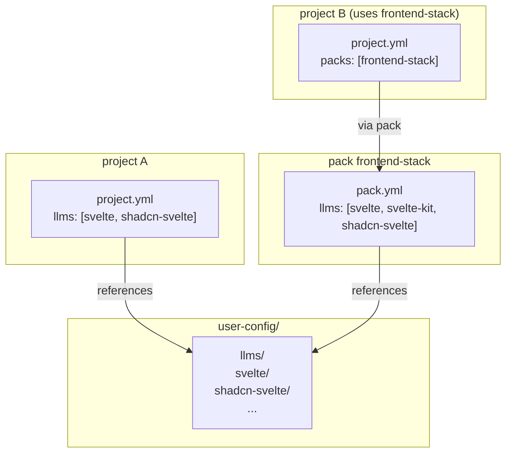
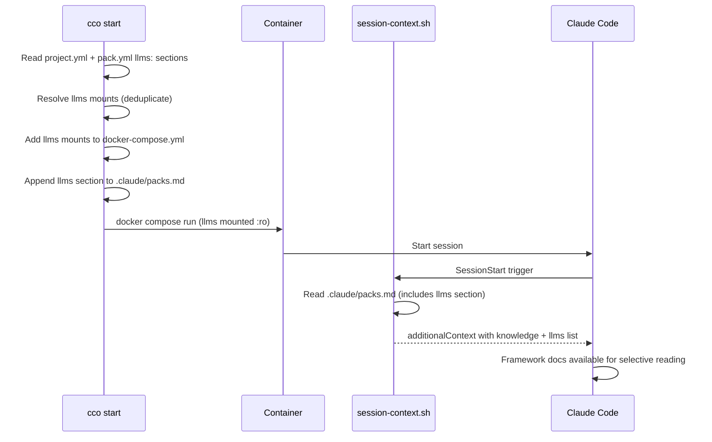

# Design: llms.txt Integration

> Status: Draft
> Date: 2026-03-24
> Analysis: [analysis.md](analysis.md)
> Related: [Packs design](../packs/design.md) | [project-yaml.md](../../../reference/project-yaml.md)

---

## 1. Overview

This feature adds first-class support for the llms.txt standard in
claude-orchestrator. It enables users to install, manage, and serve official
framework documentation to coding agents during sessions, ensuring they write
code against up-to-date APIs and patterns.



### Design Principles

1. **Zero runtime network dependency** — docs are pre-downloaded, served locally
2. **Shared storage** — one copy of each llms.txt serves all packs/projects
3. **Separate concept from knowledge** — different lifecycle, ownership, and semantics
4. **Convention-aligned** — respects the llms.txt spec (variants, naming, format)
5. **Minimal surface area** — simple CLI, simple YAML schema, reuse existing mount/injection infrastructure

---

## 2. Directory Structure

### 2.1 Storage Layout

```
user-config/llms/
├── svelte/
│   ├── llms-full.txt           # Primary doc file (downloaded)
│   ├── llms.txt                # Index file (optional, if available)
│   └── .cco/
│       └── source              # Source metadata (URL, variant, date)
├── svelte-kit/
│   ├── llms-full.txt
│   └── .cco/
│       └── source
├── shadcn-svelte/
│   ├── llms.txt                # Index-only (no full variant available)
│   └── .cco/
│       └── source
└── claude-code/
    ├── llms.txt
    └── .cco/
        └── source
```

### 2.2 Source Metadata (`.cco/source`)

```yaml
url: "https://svelte.dev/docs/svelte/llms.txt"
variant: full                    # full | medium | small | index
downloaded: "2026-03-24T14:30:00Z"
resolved_url: "https://svelte.dev/docs/svelte/llms-full.txt"  # actual file fetched
etag: "abc123"                   # for change detection (if server provides)
```

### 2.3 Primary File Resolution

When the system needs to determine which file to serve for an llms entry, it
follows this priority order:

1. `llms-full.txt` (if exists)
2. `llms-medium.txt` (if exists)
3. `llms-small.txt` (if exists)
4. `llms.txt` (fallback — index or single-file)

This resolution is used by mount generation and context injection. The user can
override by specifying `variant:` in the YAML reference.

---

## 3. YAML Schema

### 3.1 Pack Reference (`pack.yml`)

```yaml
name: frontend-stack
description: "Stack-specific conventions for SvelteKit web applications"

knowledge:
  files:
    - path: frontend-coding-conventions.md
      description: "Read when writing frontend code"

# NEW: llms.txt references
llms:
  - svelte
  - svelte-kit
  - name: shadcn-svelte
    description: "Component index — read index, then WebFetch specific component pages"

rules:
  - frontend-rules.md
```

**Short form**: `- svelte` — references `user-config/llms/svelte/`, uses default
variant resolution and auto-generated description.

**Long form**: `- name: shadcn-svelte` with optional `description:` and
`variant:` overrides.

### 3.2 Project Reference (`project.yml`)

```yaml
name: my-svelte-app
repos:
  - path: ~/projects/my-app
    name: my-app

packs:
  - frontend-stack

# NEW: project-level llms (in addition to pack llms)
llms:
  - drizzle-orm
  - name: tailwind
    variant: medium
```

Same syntax as pack references. Project llms are merged with pack llms
(deduplicated by name, project takes precedence for variant/description
overrides).

### 3.3 Full Long-Form Schema

```yaml
llms:
  - name: svelte              # Required: matches directory in user-config/llms/
    description: "..."        # Optional: override for packs.md (default: auto from file H1)
    variant: full             # Optional: force specific variant (default: auto-resolve)
```

---

## 4. CLI Commands

### 4.1 `cco llms install <url> [--name <name>] [--variant <v>] [--pack <pack>] [--project <project>]`

Downloads an llms.txt file and saves it to `user-config/llms/<name>/`.

**Behavior**:

1. Parse URL to determine framework name (last path segment before `/llms.txt`,
   or `--name` override). Example: `https://svelte.dev/docs/svelte/llms.txt` →
   name `svelte`.

2. Detect available variants by probing sibling URLs:
   - Given `https://example.com/docs/llms.txt`, check for:
     - `https://example.com/docs/llms-full.txt`
     - `https://example.com/docs/llms-medium.txt`
     - `https://example.com/docs/llms-small.txt`
   - Given `https://example.com/llms-full.txt`, check for base `llms.txt`

3. Download the selected variant (default: `full` if available, else the
   provided URL). Always download the index `llms.txt` too if available
   (lightweight, useful as catalog).

4. Save to `user-config/llms/<name>/` with source metadata in `.cco/source`.

5. If `--pack <pack>` is specified, add the name to `pack.yml`'s `llms:` list.
   If `--project <project>` is specified, add to `project.yml`'s `llms:` list.

**Examples**:

```bash
cco llms install https://svelte.dev/docs/svelte/llms.txt
# → Downloads llms-full.txt (detected), saves to user-config/llms/svelte/

cco llms install https://shadcn-svelte.com/llms.txt --name shadcn-svelte
# → Downloads llms.txt (no full variant), saves to user-config/llms/shadcn-svelte/

cco llms install https://svelte.dev/docs/svelte/llms.txt --variant medium --pack frontend-stack
# → Downloads llms-medium.txt, adds "svelte" to frontend-stack pack.yml llms: list
```

**Output**:

```
Detecting variants for svelte...
  llms.txt        ✓ (index, 42 lines)
  llms-full.txt   ✓ (17140 lines)
  llms-medium.txt ✓ (8420 lines)
  llms-small.txt  ✓ (3210 lines)
Downloading llms-full.txt (default)...
Saved to user-config/llms/svelte/
  llms.txt      (index)
  llms-full.txt (primary — 17140 lines)
```

### 4.2 `cco llms list`

Lists all installed llms entries with metadata.

```
Name             Variant   Lines   Downloaded    Source URL
svelte           full      17140   2026-03-24    svelte.dev/docs/svelte/llms.txt
svelte-kit       full      16210   2026-03-24    svelte.dev/docs/kit/llms.txt
shadcn-svelte    index     117     2026-03-24    shadcn-svelte.com/llms.txt
claude-code      index     60      2026-03-20    code.claude.com/docs/en/llms.txt

Used by:
  svelte         → frontend-stack (pack), my-svelte-app (project)
  svelte-kit     → frontend-stack (pack)
  shadcn-svelte  → frontend-stack (pack)
  claude-code    → (unused)
```

### 4.3 `cco llms update [<name>] [--all]`

Re-downloads llms files from their source URLs.

**Behavior**:

1. Read `.cco/source` for URL and current variant.
2. Fetch remote file. If server provides ETag/Last-Modified, compare with stored
   value to detect changes.
3. If changed: download new version, update `.cco/source` timestamp.
4. If unchanged: report "already up to date".

```bash
cco llms update svelte          # Update one
cco llms update --all           # Update all installed
```

**Output**:

```
Checking svelte... updated (17140 → 17382 lines)
Checking svelte-kit... already up to date
Checking shadcn-svelte... updated (117 → 123 lines)
```

**Integration with `cco update`**: The main `cco update` command includes llms
freshness checks in its discovery output:

```
llms.txt updates available:
  svelte         last downloaded 45 days ago (check with: cco llms update svelte)
  shadcn-svelte  last downloaded 45 days ago
Run 'cco llms update --all' to refresh.
```

The threshold for staleness warnings is 30 days (configurable).

### 4.4 `cco llms remove <name>`

Removes an llms entry. Warns if referenced by any pack or project.

```bash
cco llms remove svelte
# Warning: 'svelte' is referenced by pack 'frontend-stack' and project 'my-svelte-app'.
# Remove anyway? [y/N]
```

### 4.5 `cco llms show <name>`

Shows detailed information about an installed llms entry.

```bash
cco llms show svelte
# Name:       svelte
# Source:     https://svelte.dev/docs/svelte/llms.txt
# Variant:    full (llms-full.txt)
# Lines:      17140
# Downloaded: 2026-03-24
# Files:
#   llms.txt      (42 lines, index)
#   llms-full.txt (17140 lines, primary)
# Used by:
#   pack frontend-stack
#   project my-svelte-app
```

---

## 5. Mount Strategy

### 5.1 Mount Generation

At `cco start`, llms directories are mounted read-only, similar to pack
knowledge:

```yaml
# In generated docker-compose.yml
volumes:
  # Pack knowledge (existing)
  - /path/to/packs/frontend-stack/knowledge:/workspace/.claude/packs/frontend-stack:ro
  # LLMs docs (NEW)
  - /path/to/llms/svelte:/workspace/.claude/llms/svelte:ro
  - /path/to/llms/svelte-kit:/workspace/.claude/llms/svelte-kit:ro
  - /path/to/llms/shadcn-svelte:/workspace/.claude/llms/shadcn-svelte:ro
```

**Mount path**: `/workspace/.claude/llms/<name>/` — parallel to
`/workspace/.claude/packs/<name>/` for knowledge.

**Deduplication**: If both a pack and a project reference the same llms name,
only one mount is generated (same source directory).

### 5.2 Resolution Logic

```
_resolve_llms_mounts():
  1. Collect llms names from project.yml (direct)
  2. Collect llms names from each active pack's pack.yml
  3. Deduplicate (project overrides take precedence for variant)
  4. For each unique name:
     a. Resolve primary file (variant priority: full > medium > small > index)
     b. Verify directory exists in user-config/llms/<name>/
     c. Generate mount line
```

Implementation lives in a new `lib/llms.sh` module, called from
`_start_generate_compose()` alongside `_generate_pack_mounts()`.

---

## 6. Context Injection

### 6.1 Enhanced `packs.md` Generation

The generated `.claude/packs.md` file gains a new section for llms docs:

```markdown
<!-- Auto-generated by cco start — do not edit manually -->
The following knowledge files provide project-specific conventions and context.
Read the relevant files BEFORE starting any implementation, review, or design task.
Do not ask the user for context that is covered by these files.

- /workspace/.claude/packs/frontend-stack/frontend-coding-conventions.md — Read when writing frontend code
- /workspace/.claude/packs/frontend-stack/backend-coding-conventions.md — Read when writing backend code

## Official Framework Documentation (llms.txt)

The following official framework documentation files are installed.
Consult them BEFORE writing code that uses these frameworks — do not rely solely on training data.
For large files, read selectively using offset/limit. For index files, WebFetch specific pages as needed.

- /workspace/.claude/llms/svelte/llms-full.txt — Official Svelte 5 documentation (17140 lines)
- /workspace/.claude/llms/svelte-kit/llms-full.txt — Official SvelteKit documentation (16210 lines)
- /workspace/.claude/llms/shadcn-svelte/llms.txt — shadcn-svelte component index (117 lines, WebFetch for details)
```

**Description resolution**: If the YAML reference provides a `description:`, use
it. Otherwise, auto-generate from the llms.txt H1 heading + line count + type
hint (index vs full).

### 6.2 Injection Flow

No changes to `session-context.sh` — it already injects the full `packs.md`
content into `additionalContext`. The llms section is appended to `packs.md`
automatically.



---

## 7. Managed Rule

### 7.1 Rule File

New managed rule at `defaults/managed/.claude/rules/use-official-docs.md`:

```markdown
# Use Official Framework Documentation

When official framework documentation (llms.txt) is listed in the session
context:

1. **Consult before writing**: Read the relevant llms.txt documentation BEFORE
   writing code that uses that framework. Do not rely solely on training data —
   APIs change between versions.

2. **Read selectively**: Large documentation files (10K+ lines) should be read
   with offset/limit targeting the relevant section. Do not read the entire file.

3. **Index files**: When a documentation file is an index (contains URLs to
   component/API pages), read the index first to locate the relevant page, then
   use WebFetch to retrieve the specific page content.

4. **Priority**: Official documentation takes precedence over training data when
   there is a conflict in API signatures, component props, or usage patterns.
```

This rule is **managed** (baked into the Docker image at `/etc/claude-code/`),
not opinionated. It defines framework behavior: if llms docs are installed, the
agent must use them. It is only actionable when llms files are actually present
in the session context.

### 7.2 Conditional Activation

The rule is always loaded (managed level), but its instructions are naturally
conditional: "When official framework documentation is listed in the session
context." If no llms files are installed, the rule has no effect.

---

## 8. YAML Parser Extensions

### 8.1 New Functions in `lib/yaml.sh`

```bash
# Parse llms list from project.yml or pack.yml
# Outputs one entry per line as: "<name>\t<description>\t<variant>"
# Short form "- svelte" outputs: "svelte\t\t"
# Long form outputs all fields.
yml_get_llms()

# Parse llms names only (for deduplication/validation)
# Outputs one name per line.
yml_get_llms_names()
```

### 8.2 Updated Validation

`_validate_single_pack()` in `lib/packs.sh` gains llms validation:
- Each referenced llms name must exist in `user-config/llms/<name>/`
- At least one doc file must be present (llms-full.txt or llms.txt)

New `_validate_project_llms()` for project.yml validation (same checks).

The top-level key regex in pack validation gains `llms`:
```bash
grep -qE '^(name|knowledge|llms|skills|agents|rules):' "$pack_yml"
```

---

## 9. CLI Module

### 9.1 New `lib/cmd-llms.sh`

Following the existing pattern (`lib/cmd-pack.sh`), a new module handles all
`cco llms` subcommands:

```bash
# lib/cmd-llms.sh — LLMs.txt management: install, list, update, show, remove
#
# Provides: cmd_llms()
# Dependencies: colors.sh, utils.sh, paths.sh
# Globals: LLMS_DIR (user-config/llms)

cmd_llms() {
    local subcmd="${1:-}"
    shift || true
    case "$subcmd" in
        install)  _llms_install "$@" ;;
        list)     _llms_list "$@" ;;
        update)   _llms_update "$@" ;;
        show)     _llms_show "$@" ;;
        remove)   _llms_remove "$@" ;;
        *)        _llms_usage ;;
    esac
}
```

### 9.2 URL Parsing and Variant Detection

```bash
_llms_detect_variants() {
    local base_url="$1"
    # Given https://example.com/docs/llms.txt or https://example.com/docs/llms-full.txt
    # Derive the base path and probe for all variants.
    # Uses HEAD requests (curl -I) to minimize bandwidth.
    # Returns available variants as space-separated list.
}

_llms_resolve_name() {
    local url="$1"
    # Extract framework name from URL path.
    # https://svelte.dev/docs/svelte/llms.txt → svelte
    # https://shadcn-svelte.com/llms.txt → shadcn-svelte
    # Heuristic: use the path segment before /llms*.txt, or the domain name.
}
```

### 9.3 Download Implementation

Downloads use `curl` (available in the Docker image and on host). The install
command runs on the host (part of `cco` CLI), not inside the container.

---

## 10. Integration with `cco update`

### 10.1 Staleness Check

`cco update` includes an llms freshness check in its discovery phase:

```bash
_update_check_llms_freshness() {
    local threshold_days=30
    for dir in "$LLMS_DIR"/*/; do
        [[ ! -d "$dir" ]] && continue
        local source_file="$dir/.cco/source"
        [[ ! -f "$source_file" ]] && continue
        local downloaded
        downloaded=$(yml_get "$source_file" "downloaded")
        # Compare with current date, warn if older than threshold
    done
}
```

This is informational only — `cco update` does not auto-download. It suggests
`cco llms update --all`.

### 10.2 No Migration Required

llms.txt is a purely additive feature:
- New `llms:` key in pack.yml/project.yml — ignored by existing parsers
- New `user-config/llms/` directory — does not affect existing installations
- New managed rule — added on next `cco build`
- Existing packs and projects continue to work unchanged

A `changelog.yml` entry is required to notify users of the new feature.

---

## 11. Implementation Plan

### Phase 1: Core Infrastructure

1. **`lib/llms.sh`** — shared helpers: path resolution, primary file detection,
   mount generation, validation
2. **`lib/yaml.sh`** — `yml_get_llms()`, `yml_get_llms_names()` parsers
3. **`lib/cmd-start.sh`** — integrate llms mount generation and packs.md
   enhancement
4. **`lib/packs.sh`** — extend `_validate_single_pack()` for llms references,
   update top-level key regex

### Phase 2: CLI Commands

5. **`lib/cmd-llms.sh`** — `install`, `list`, `show`, `update`, `remove`
6. **`bin/cco`** — register `llms` subcommand in dispatcher

### Phase 3: Agent Guidance

7. **`defaults/managed/.claude/rules/use-official-docs.md`** — managed rule
8. **`lib/cmd-start.sh`** — enhanced `packs.md` generation with llms section

### Phase 4: Update Integration

9. **`lib/cmd-update.sh`** — llms freshness check in discovery phase
10. **`changelog.yml`** — additive change entry

### Phase 5: Documentation & Templates

11. **`docs/user-guides/llms-txt.md`** — user guide
12. **`docs/reference/cli.md`** — CLI reference updates
13. **`docs/reference/project-yaml.md`** — schema updates
14. **`templates/project/base/project.yml`** — add commented `llms:` section

---

## 12. Interaction with Other Features

### Pack Inheritance (#9)

When implemented, llms references would be inherited naturally: a child pack
that `extends: base-web` would inherit the parent's `llms:` list. The child
can add or override entries.

### RAG (Sprint 12)

The RAG system could index llms.txt files for semantic search, reducing the
need for full-file reads. The llms directory structure is already RAG-friendly
(one directory per framework, clear file naming).

### Config Repos (Sharing)

llms entries are user-config resources. They can be shared via Config Repos
using the existing manifest system. The `.cco/source` metadata enables
consumers to re-fetch from the original URL if needed.

### Vault

`user-config/llms/` is tracked by the vault like any other user-config
resource. The `.cco/source` files are committed; the actual llms.txt content
files can be gitignored (regenerable from source URL) or committed (for
offline use). Default: committed (offline-first philosophy).

---

## 13. Open Questions

### Resolved

| Question | Decision |
|----------|----------|
| Separate concept from knowledge? | Yes — different lifecycle, ownership, semantics |
| Where to store files? | `user-config/llms/<name>/` (shared) |
| Default variant? | `full` (self-contained, no runtime network) |
| Referenced from packs or projects? | Both |
| Dedicated CLI or extend pack CLI? | Dedicated `cco llms` subcommand |
| MCP vs local files? | Local files (zero runtime dependency) |
| Managed vs opinionated rule? | Managed (framework behavior) |

### Deferred

| Question | Notes |
|----------|-------|
| Auto-discovery of llms.txt for project dependencies? | Future enhancement — parse `package.json` deps, check if llms.txt exists for each. |
| Should `cco llms install` support bulk install from a list file? | Evaluate after initial usage patterns emerge. |
| Should the staleness threshold (30 days) be configurable? | Start with hardcoded, make configurable if users request it. |
