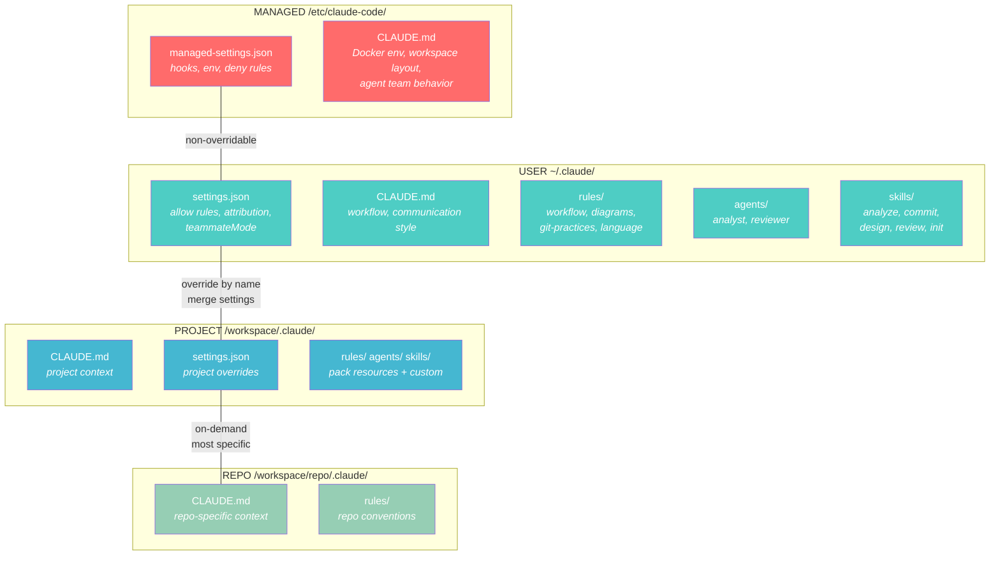

# Analysis: Scope Hierarchy and Configuration

> **Status**: Analysis — exploration and requirements documentation phase
> **Date**: 2026-02-27
> **Scope**: Architecture — reorganization of system/global/project tiers

---

## Table of Contents

1. [Context and Motivation](#1-context-and-motivation)
2. [Native Claude Code Behavior](#2-native-claude-code-behavior)
3. [Current claude-orchestrator Mapping](#3-current-claude-orchestrator-mapping)
4. [Identified Problems](#4-identified-problems)
5. [Requirements](#5-requirements)
6. [Proposed Solutions](#6-proposed-solutions)
7. [Recommendation](#7-recommendation)
8. [Detail: File Classification](#8-detail-file-classification)
9. [Open Questions](#9-open-questions)

---

## 1. Context and Motivation

claude-orchestrator implements a three-tier hierarchy (global → project → repo) that
maps onto Claude Code's native resolution. Currently there is a separation
between `defaults/system/` (always synced) and `defaults/global/` (copied once),
but file categorization is incomplete:

- **Workflow rules** (workflow.md, diagrams.md, git-practices.md) are in "system"
  but represent customizable user preferences.
- **Agents and skills** are in "system" but are examples of extensible workflows.
- **settings.json** contains both critical infrastructure (hooks, env vars) and preferences
  (attribution, cleanupPeriodDays).
- There is no mechanism to prevent the user from overwriting files the framework
  requires to function.

---

## 2. Native Claude Code Behavior

### 2.1 Complete Scope Hierarchy

Claude Code implements **5 levels** of configuration, from highest to lowest:

| # | Level | Location (Linux) | Managed by |
|---|---------|-------------------|-----------------|
| 1 | **Managed** | `/etc/claude-code/` | Admin/Framework |
| 2 | **CLI args** | Command-line arguments | Session |
| 3 | **Local** | `.claude/settings.local.json` | User (gitignored) |
| 4 | **Project** | `.claude/settings.json` | Team (committed) |
| 5 | **User** | `~/.claude/settings.json` | User |

> **Note**: The Managed level is Claude Code's native answer to "how to have
> non-overridable configuration". It is designed for enterprise/organization
> but works on any installation — including our Docker container.

### 2.2 Managed Level Sub-levels

When multiple managed sources are present, only ONE is used:

1. **Server-managed** — via Claude.ai Admin Console (paid Teams/Enterprise feature)
2. **MDM/OS policies** — macOS managed preferences, Windows Group Policy
3. **File-based** — `/etc/claude-code/managed-settings.json` (Linux)
4. **HKCU registry** — Windows only

In our Docker container, we use level 3 (file-based). If the user
has a Teams/Enterprise account with server-managed settings, those will
take precedence — behavior consistent with enterprise intent.

### 2.3 Managed Level Layout on Linux

**Confirmed by Claude Code source code** (analysis of `cli.js`):

```
/etc/claude-code/
├── managed-settings.json        # Settings (highest priority)
├── managed-mcp.json             # Server MCP managed
├── CLAUDE.md                    # Framework instructions (always loaded)
└── .claude/
    ├── rules/                   # Managed rules (*.md)
    ├── skills/                  # Managed skills (*/SKILL.md)
    ├── agents/                  # Managed agents (*.md)
    ├── commands/                # Managed commands
    └── output-styles/           # Managed output styles
```

**Important file names**: The managed settings file is called `managed-settings.json`
(NOT `settings.json`). The managed MCP file is called `managed-mcp.json`.

### 2.4 Resolution Behavior by Resource Type

| Resource | Merge Type | Conflict Behavior |
|---------|---------------|---------------------------|
| `settings.json` | **Merge with priority** | More specific keys override; non-conflicting keys coexist |
| `CLAUDE.md` | **Additive** | All levels loaded in context; most specific prevails in conflict |
| `rules/*.md` | **Additive** | All loaded; project rules have priority over user rules |
| `agents/*.md` | **Override by name** | CLI > Managed > Project > User > Plugin |
| `skills/` | **Override by name** | Managed > User > Project > Plugin (namespaced) |
| `hooks` | **Merge (all executed)** | All matching hooks are executed in parallel |
| MCP servers | **Override by name** | Local > Project > User |
| `permissions` | **Merge with priority** | deny > ask > allow; first matching rule wins |

#### Detail: How CLAUDE.md Files are Discovered

Claude recursively traverses from the current working directory to the root, loading every `CLAUDE.md`
and `CLAUDE.local.md` it finds. Files in subdirectories are discovered
on-demand when Claude accesses files in those directories.

The loading order by increasing priority:
```
/etc/claude-code/CLAUDE.md          (Managed — always loaded)
~/.claude/CLAUDE.md                 (User — always loaded)
~/.claude/rules/*.md                (User rules — always loaded)
/workspace/.claude/CLAUDE.md        (Project — always loaded)
/workspace/.claude/rules/*.md       (Project rules — always loaded)
/workspace/CLAUDE.local.md          (Local — always loaded, gitignored)
/workspace/<repo>/.claude/CLAUDE.md (Repo — on-demand, most specific)
```

All coexist in the context. In case of conflicting instructions, **the most specific
prevails** — but non-conflicting instructions from all levels remain active.

#### Detail: How Agents are Resolved

Override by name with this priority:
```
CLI --agents flag                           (1 — highest)
/etc/claude-code/.claude/agents/ (Managed)  (2)
.claude/agents/          (Project level)    (3)
~/.claude/agents/        (User level)       (4)
Plugin agents/                              (5 — lowest)
```

The managed level supports agents. From source code analysis,
`/etc/claude-code/.claude/agents/` is a valid location. The directory
is read by Claude Code with the same logic as other agent locations.

**Note**: For agents, **Project > User** — an agent at project level overrides
the one with the same name at user level.

#### Detail: How Skills are Resolved

Override by name with this priority:
```
Managed/Enterprise       (1 — highest)
User (~/.claude/skills/) (2)
Project (.claude/skills/)(3)
Plugin (namespaced)      (4 — lowest)
```

Plugin skills use namespace `plugin-name:skill-name` to avoid conflicts.

> **Attention: Skills vs Agents Asymmetry**
>
> For skills, **User > Project** — a skill at user level (`~/.claude/skills/`)
> has priority over the one with the same name at project level (`.claude/skills/`).
> This is the **opposite** of agents, where Project > User.
>
> Implications for claude-orchestrator:
> - **Agents**: A pack at project level CAN override a global agent ✓
> - **Skills**: A pack at project level CANNOT override a global skill ✗
>   (the user/global skill has priority)
>
> This is the native behavior documented by Claude Code. It should be
> considered when deciding where to position default agents and skills.

### 2.5 Managed-Only Settings

These keys work **exclusively** in `managed-settings.json`:

| Key | Effect |
|--------|--------|
| `disableBypassPermissionsMode` | Prevents `--dangerously-skip-permissions` |
| `allowManagedPermissionRulesOnly` | Only managed permission rules apply |
| `allowManagedHooksOnly` | Blocks user/project/plugin hooks; only managed and SDK |
| `allowManagedMcpServersOnly` | Only MCP servers from managed allowlist |
| `allowedMcpServers` | Allowlist for user-configurable MCP servers |
| `deniedMcpServers` | MCP servers blocklist |
| `strictKnownMarketplaces` | Plugin marketplace allowlist |
| `blockedMarketplaces` | Plugin marketplace blocklist |
| `sandbox.network.allowManagedDomainsOnly` | Only managed network domains |
| `forceLoginMethod` | Force login method |
| `allow_remote_sessions` | Control remote sessions |

---

## 3. Current claude-orchestrator Mapping

### 3.1 Current Architecture

```mermaid
graph TB
    subgraph "defaults/system/ (11 files)"
        SS[settings.json<br/>hooks, permissions, env]
        SA[agents/analyst.md<br/>agents/reviewer.md]
        SK[skills/analyze, commit,<br/>design, review, init-workspace]
        SR[rules/workflow.md<br/>rules/diagrams.md<br/>rules/git-practices.md]
    end

    subgraph "defaults/global/ (6 files)"
        GC[CLAUDE.md<br/>Workflow instructions]
        GM[mcp.json<br/>Empty]
        GL[rules/language.md<br/>Template]
        GG[agents/.gitkeep<br/>skills/.gitkeep]
        GS[setup.sh<br/>User setup script]
    end

    subgraph "defaults/_template/ (12+ files)"
        TC[CLAUDE.md, settings.json<br/>rules/language.md]
        TT[project.yml, setup.sh<br/>secrets.env, mcp-packages.txt]
        TD[claude-state/memory/<br/>agents/ skills/ rules/]
    end

    SS -->|"_sync_system_files()<br/>ALWAYS synced"| G["global/.claude/"]
    SA --> G
    SK --> G
    SR --> G
    GC -->|"cco init<br/>copied ONCE"| G
    GM --> G
    GL --> G

    TC -->|"cco project create<br/>scaffolding"| P["projects/<name>/.claude/"]
```



### 3.2 Sync Mechanism

The `_sync_system_files()` function in `bin/cco` (lines 611–670):

1. Reads `defaults/system/system.manifest` (list of 11 paths)
2. For each file: compares with `cmp -s`, copies if different or missing
3. Removes files present in the old manifest but not in the new one (cleanup)
4. Saves the current manifest as `.system-manifest` for the next cycle

Called by: `cmd_init()`, `cmd_start()`, `cmd_new()`.
Also includes a bootstrap migration phase to handle the transition
from pre-system layout (lines 619-626 of `bin/cco`).

**Effect**: Every `cco start` rewrites system files. A user who modifies
`global/.claude/rules/workflow.md` loses the changes on the next startup.

### 3.3 Where Files Go in Container

```
Container mount:
~/.claude/           ← global/.claude/ (User scope Claude Code)
/workspace/.claude/  ← projects/<name>/.claude/ (Project scope Claude Code)
/workspace/<repo>/   ← mounted repo (Repo scope Claude Code, on-demand)
```

**Missing**: Nothing is mounted in `/etc/claude-code/` (Managed scope).

---

## 4. Identified Problems

### P1: Incorrect Semantic Classification

Files that represent **user preferences** are classified as "system" and therefore
rewritten on every `cco start`:

| File | Current Classification | Real Nature |
|------|------------------------|--------------|
| `rules/workflow.md` | System (always synced) | Process preference (team-specific) |
| `rules/diagrams.md` | System (always synced) | Style preference (personal) |
| `rules/git-practices.md` | System (always synced) | VCS preference (team-specific) |
| `agents/analyst.md` | System (always synced) | Example agent (extensible) |
| `agents/reviewer.md` | System (always synced) | Example agent (extensible) |
| `skills/*` (5 skills) | System (always synced) | Example workflow (customizable) |

### P2: Absence of Managed Level

The current architecture uses only User (`~/.claude/`) and Project (`/workspace/.claude/`).
There is no level with higher priority that cannot be overridden.
Consequences:

- If a pack or project defines `agents/analyst.md`, it overrides
  the system one (project > user for agents).
- If the user deletes system rules from `global/.claude/rules/`, they are
  restored at the next `cco start` — but the current session is without them in the meantime.
- There is no way to have hooks or settings **guaranteed to be active**.

### P3: Asymmetry in Overrides

In `~/.claude/`, framework files (sync-always) and user files (user-owned)
coexist without visual distinction. Users don't know which files they can modify and which
will be rewritten at the next `cco start`. Also:

- **Packs** can override system agents at project level ✓
  (project > user for agents)
- **Packs** CANNOT override system skills at project level ✗
  (user > project for skills — native asymmetric behavior)
- Users can modify files in `global/.claude/`, but those in the manifest
  are rewritten at the next startup

### P4: settings.json Mixes Infrastructure and Preferences

The current settings.json in `defaults/system/` contains:

**Framework infrastructure** (MUST always be present):
- `env.CLAUDE_CODE_EXPERIMENTAL_AGENT_TEAMS` — required for agent teams
- `hooks.SessionStart`, `hooks.SubagentStart`, `hooks.PreCompact` — context injection
- `statusLine` — session visual feedback
- `permissions.deny` — protection for sensitive files

**User preferences** (customizable):
- `permissions.allow` — list of allowed commands
- `attribution` — co-author format in commits
- `teammateMode` — tmux vs iTerm2
- `cleanupPeriodDays` — session retention
- `enableAllProjectMcpServers` — auto-enable MCP
- `alwaysThinkingEnabled` — thinking mode

Having everything in a single sync-always file means preferences get overwritten.

### P5: Undocumented Hook ↔ Scope Interaction

The context injection hooks (`session-context.sh`, `subagent-context.sh`)
inject information into the conversation context via `additionalContext`.
This is a parallel channel to the scope hierarchy:

- Does not create rules, agents, or skills — injects read-only context
- Has high priority in conversation context (loaded at session start)
- But cannot enforce behavior binding like a rule in `CLAUDE.md`
- The `session-context.sh` hook also injects the content of
  `/workspace/.claude/packs.md` as a knowledge pack (lines 74-80)

---

## 5. Requirements

### R1: Leverage Native Behavior

> The fundamental rule of claude-orchestrator is to leverage Claude Code's
> native features as much as possible.

Each orchestrator tier must map to a native Claude Code level:

| Orchestrator Tier | Claude Code Level | Mechanism |
|-------------------|-------------------|------------|
| **System** | **Managed** (`/etc/claude-code/`) | Non-overridable, framework infrastructure |
| **Global** | **User** (`~/.claude/`) | Preconfigured defaults, customizable by user |
| **Project** | **Project** (`/workspace/.claude/`) | Per-project, includes pack resources |
| **Repo** | **Nested** (`/workspace/<repo>/.claude/`) | From mounted repo, on-demand |

### R2: System Not Overridable

Files in System scope must have priority over everything. Users cannot
override them in any way. They contain:

- Settings and hooks that make the framework work
- Core instructions on how claude-orchestrator operates
- Universal behavior rules and cross-project conventions

### R3: Global as Preconfigured Templates

Files in Global scope are working examples. Users can:

- Modify them freely (never rewritten after init)
- Extend them with additional files
- Use them as a basis for customizations

### R4: Project Override of Global

At project level, the native override behavior is:

- `agents/` → override by name, **Project > User** (project overrides global) ✓
- `skills/` → override by name, **User > Project** (global has priority over project) ⚠️
- `rules/` → additive (all loaded, project rules have priority in conflict) ✓
- `settings.json` → merge (project extends global, project wins in conflict) ✓

> **Note**: The skills vs agents asymmetry is native to Claude Code. User
> global skills have priority over project-level ones. This means
> packs cannot override global skills, only add new ones.

### R5: System Not Overridable from Project/Global

The managed level has this property natively. Additionally, the
`allowManagedHooksOnly` and `allowManagedPermissionRulesOnly` keys can
**block** modifications from lower levels.

---

## 6. Proposed Solutions

### Solution A: Use `/etc/claude-code/` (Native Managed)

Move framework infrastructure files to Claude Code's native managed level,
served from `/etc/claude-code/` in the container.

#### Implementation

**In Dockerfile** — create the managed structure:
```dockerfile
# Framework managed settings (non-overridable)
RUN mkdir -p /etc/claude-code/.claude/rules \
             /etc/claude-code/.claude/agents \
             /etc/claude-code/.claude/skills
```

**New `defaults/` layout**:
```
defaults/
├── managed/                          # → /etc/claude-code/ (MANAGED level)
│   ├── managed-settings.json         # Hooks, env vars, framework-critical flags
│   ├── CLAUDE.md                     # Core framework instructions
│   └── .claude/
│       ├── rules/                    # Framework rules (if needed)
│       ├── agents/                   # (empty — agents go in global)
│       └── skills/                   # (empty — skills go in global)
│
├── global/                           # → ~/.claude/ (USER level, copied ONCE)
│   └── .claude/
│       ├── CLAUDE.md                 # Workflow instructions (customizable)
│       ├── mcp.json                  # User MCP servers (empty)
│       ├── settings.json             # User preferences (attribution, teammateMode...)
│       ├── rules/
│       │   ├── workflow.md           # Workflow phases (customizable)
│       │   ├── diagrams.md           # Diagram conventions (customizable)
│       │   ├── git-practices.md      # Git conventions (customizable)
│       │   └── language.md           # Language preferences (template)
│       ├── agents/
│       │   ├── analyst.md            # Analyst agent (example, extensible)
│       │   └── reviewer.md           # Reviewer agent (example, extensible)
│       └── skills/
│           ├── analyze/SKILL.md      # Analysis skill (example)
│           ├── commit/SKILL.md       # Commit skill (example)
│           ├── design/SKILL.md       # Design skill (example)
│           ├── review/SKILL.md       # Review skill (example)
│           └── init-workspace/SKILL.md
│
└── _template/                        # → projects/<name>/.claude/ (scaffolding)
    └── .claude/
        ├── CLAUDE.md                 # Project template
        ├── settings.json             # Empty override
        └── rules/language.md         # Language template override
```

**In Dockerfile** — copy managed files:
```dockerfile
COPY defaults/managed/ /etc/claude-code/
RUN chmod -R 755 /etc/claude-code/
```

**Entrypoint** — no modifications needed for managed files. Claude Code
reads them automatically from `/etc/claude-code/` without any intervention.

**`_sync_system_files()`** — removed or reduced. The managed level is in the
Dockerfile (immutable for the session). Global defaults are copied
only by `cmd_init()`.

#### Content of `managed-settings.json`

```json
{
  "$schema": "https://json.schemastore.org/claude-code-settings.json",
  "env": {
    "CLAUDE_CODE_EXPERIMENTAL_AGENT_TEAMS": "1"
  },
  "hooks": {
    "SessionStart": [{
      "hooks": [{
        "type": "command",
        "command": "/usr/local/bin/cco-hooks/session-context.sh",
        "timeout": 10
      }]
    }],
    "SubagentStart": [{
      "hooks": [{
        "type": "command",
        "command": "/usr/local/bin/cco-hooks/subagent-context.sh",
        "timeout": 5
      }]
    }],
    "PreCompact": [{
      "hooks": [{
        "type": "command",
        "command": "/usr/local/bin/cco-hooks/precompact.sh",
        "timeout": 5
      }]
    }]
  },
  "statusLine": {
    "type": "command",
    "command": "/usr/local/bin/cco-hooks/statusline.sh"
  },
  "permissions": {
    "deny": [
      "Read(~/.claude.json)",
      "Read(~/.ssh/*)"
    ]
  }
}
```

#### Content of `/etc/claude-code/CLAUDE.md` (Managed)

Core framework instructions — how claude-orchestrator operates. Universal,
cross-cutting for all projects, non-overridable:

```markdown
# claude-orchestrator Framework

## Docker Environment
- This session runs inside a Docker container managed by claude-orchestrator
- Repos are mounted at /workspace/<repo-name>/
- Docker socket is available — you can run docker and docker compose
- When starting infrastructure, use the project network (cc-<project>)
- Dev servers run inside this container with ports mapped to the host

## Workspace Layout
- /workspace/ is the main working directory
- Each repo is a direct subdirectory of /workspace/
- Files at /workspace/ root are temporary (container-only, lost on exit)
- Persistent work should go in repos and be versioned with git

## Agent Teams
- The lead coordinates and delegates work to teammates
- Each teammate focuses on their specialized domain
- Use the shared task list for coordination
- The lead synthesizes teammate outputs into coherent results
```

#### Pros
- Leverages **Claude Code's native mechanism** (Managed level)
- Non-overridable by user/project/pack — **native guarantee**
- Eliminates the need for `_sync_system_files()` for infrastructure
- Immutable for the session duration (baked into Docker image)
- Compatible with enterprise server-managed settings (correct priority)
- Hooks are guaranteed to be active (managed hooks cannot be disabled by user)
- Clean separation: managed = framework, user = preferences, project = per-project

#### Cons
- Requires `cco build` to update managed files (not updatable at runtime)
- More rigid: if a user has an edge case requiring hook override,
  they cannot do it (by design, but could be limiting)
- The `allowManagedHooksOnly` key would prevent users from adding their own
  hooks — must NOT activate it to maintain flexibility
- Requires verification that Claude Code 2.1.56 actually reads all resource types
  from `/etc/claude-code/.claude/` (confirmed from source code, but needs
  end-to-end practical test)

### Solution B: System as Protected Global (without Managed)

Keep all files in `~/.claude/` (User level) but conceptually separate
"framework-owned" and "user-owned" via the existing sync mechanism.

#### Implementation

- `_sync_system_files()` syncs only `settings.json` (minimal infrastructure)
- Everything else (agents, skills, rules) is copied once as default
- Framework instructions go in global `CLAUDE.md` (additive with project)

#### Pros
- No dependency on managed features (simpler)
- Works with any Claude Code version
- Single tier to manage

#### Cons
- **No guarantee** that framework files are always present
- User can override settings.json at project level (native merge)
- Hooks can be disabled by project-level settings.json
- If a pack overrides `agents/analyst.md` at project level, framework
  loses control over the base agent

### Solution C: Hybrid — Managed for Settings, Global for Rest

Use `/etc/claude-code/` only for `managed-settings.json` and `CLAUDE.md`
(resources whose protection is most critical), and keep agents/skills/rules
in `~/.claude/` as preconfigured defaults.

#### Implementation

```
/etc/claude-code/
├── managed-settings.json    # Hooks, env, deny rules — non-overridable
├── CLAUDE.md                # Framework instructions — non-overridable
└── (nothing else)

~/.claude/
├── settings.json            # User preferences (allow rules, attribution, etc.)
├── CLAUDE.md                # Workflow instructions (customizable)
├── rules/                   # Customizable rules
├── agents/                  # Customizable agents
└── skills/                  # Customizable skills
```

#### Pros
- The most critical part (hooks, framework settings) is protected
- Core framework instructions are in managed CLAUDE.md
- Agents, skills, and rules remain flexible
- Less dependency on managed features for less critical resources

#### Cons
- Complexity: two different locations for "system" files
- Does not protect agents/skills from project-level override (a pack that defines
  `agents/analyst.md` overrides the global one)
- Users do not intuitively know what is managed and what is user-owned

---

## 7. Recommendation

### Recommended Solution: A (Complete Native Managed)

Solution A is most consistent with the project's fundamental principle:
**leverage Claude Code's native features as much as possible**.

The Managed level exists exactly for our use case: configuration
that the "environment provider" (the orchestrator) wants to guarantee as active.

#### Details of Proposed Separation

**Managed (`/etc/claude-code/`)** — Framework, non-overridable:

| Resource | Content | Motivation |
|---------|-----------|-------------|
| `managed-settings.json` | Hooks paths, framework env vars, deny rules, statusLine | Hooks MUST always work |
| `CLAUDE.md` | Docker env, workspace layout, agent team behavior | Claude must know how framework operates |

> **Note**: Do NOT put agents/skills/rules in managed. They are workflow
> extensions, not infrastructure. Users must be able to customize them.

**Global (`~/.claude/`)** — Preconfigured defaults, customizable:

| Resource | Content | Motivation |
|---------|-----------|-------------|
| `settings.json` | Permission allow, attribution, teammateMode, cleanup | User preferences |
| `CLAUDE.md` | Development workflow, communication style | Customizable template |
| `rules/workflow.md` | Structured workflow phases | Team-specific |
| `rules/diagrams.md` | Mermaid conventions | Personal preference |
| `rules/git-practices.md` | Branch strategy, conventional commits | Team-specific |
| `rules/language.md` | Language preferences | Personal |
| `agents/analyst.md` | Analyst agent (haiku, read-only) | Extensible example |
| `agents/reviewer.md` | Reviewer agent (sonnet, read-only) | Extensible example |
| `skills/analyze/` | Structured analysis skill | Workflow example |
| `skills/commit/` | Conventional commit skill | Workflow example |
| `skills/design/` | Structured design skill | Workflow example |
| `skills/review/` | Review skill | Workflow example |
| `skills/init-workspace/` | Initialization skill | Workflow example |

**Project (`/workspace/.claude/`)** — Per-project:

| Resource | Content | Motivation |
|---------|-----------|-------------|
| `CLAUDE.md` | Project context, repos, architecture | Project-specific |
| `settings.json` | Per-project override (merge with global) | Per-project extension |
| `rules/language.md` | Per-project language override | Project may have different language |
| Pack resources | Skills, agents, rules from packs | Specialized knowledge |

#### Resulting Hierarchy



#### Interaction with Context Injection Hooks

Context injection hooks (`session-context.sh`, etc.) are **complementary**
to the scope hierarchy. They operate on a different plane:

| Mechanism | Purpose | Priority | Overridable? |
|-----------|-------|----------|-----------------|
| `managed-settings.json` hooks | Define **when** to execute scripts | Managed (highest) | No — hook paths are in managed |
| `session-context.sh` output | Injects runtime context (repos, skills, MCP) | Conversation context | No — always executed because hook is managed |
| `CLAUDE.md` managed | Permanent behavior binding | Managed (highest) | No |
| `CLAUDE.md` user/project | Customizable behavior binding | User/Project | Yes, per-project |
| `rules/*.md` | Modular rules | Additive | Yes — project rules prevail over user |

**Key point**: With hooks in `managed-settings.json`, they are **guaranteed**
to be active regardless of what users put in `settings.json` at the
user or project level. The native hook merge is additive: managed hooks
combine with user/project hooks, they are not overridden.

#### Impact on Packs and Overrides

With the managed solution:

| Scenario | Behavior | Correct? |
|----------|--------------|-----------|
| Pack defines `agents/analyst.md` in project | Override global analyst for that project | ✓ Native |
| User modifies `~/.claude/rules/workflow.md` | Persistent customization | ✓ No longer rewritten |
| Project defines `rules/custom.md` | Additive — loaded with priority over global | ✓ Native |
| User tries to modify hooks in settings.json | User hooks combine with managed ones | ✓ Cannot remove managed hooks |
| `cco build` with new framework version | Updates managed files in Docker image | ✓ Clean update |

---

## 8. Detail: File Classification

### 8.1 Complete Inventory with Proposed Classification

#### From `defaults/system/` (current) → New destination

| Current File | Classification | New Destination | Motivation |
|-------------|----------------|---------------------|-------------|
| `settings.json` (hooks, env, deny) | Infrastructure | `defaults/managed/managed-settings.json` | Hooks and env MUST always work |
| `settings.json` (allow, attribution) | Preference | `defaults/global/.claude/settings.json` | Customizable |
| `agents/analyst.md` | Workflow example | `defaults/global/.claude/agents/analyst.md` | Extensible/replaceable |
| `agents/reviewer.md` | Workflow example | `defaults/global/.claude/agents/reviewer.md` | Extensible/replaceable |
| `skills/analyze/SKILL.md` | Workflow example | `defaults/global/.claude/skills/analyze/SKILL.md` | Customizable |
| `skills/commit/SKILL.md` | Workflow example | `defaults/global/.claude/skills/commit/SKILL.md` | Customizable |
| `skills/design/SKILL.md` | Workflow example | `defaults/global/.claude/skills/design/SKILL.md` | Customizable |
| `skills/review/SKILL.md` | Workflow example | `defaults/global/.claude/skills/review/SKILL.md` | Customizable |
| `skills/init-workspace/SKILL.md` | Workflow example | `defaults/global/.claude/skills/init-workspace/SKILL.md` | Customizable |
| `rules/workflow.md` | Process preference | `defaults/global/.claude/rules/workflow.md` | Team-specific |
| `rules/diagrams.md` | Style preference | `defaults/global/.claude/rules/diagrams.md` | Personal |
| `rules/git-practices.md` | VCS preference | `defaults/global/.claude/rules/git-practices.md` | Team-specific |

#### New files to create

| File | Destination | Content |
|------|-------------|-----------|
| `CLAUDE.md` (framework) | `defaults/managed/CLAUDE.md` | Docker env, workspace layout, agent teams |
| `managed-settings.json` | `defaults/managed/managed-settings.json` | Hooks, env, deny rules, statusLine |

### 8.2 settings.json Split

The current settings.json must be **split into two files**:

**`defaults/managed/managed-settings.json`** (non-overridable):
```json
{
  "env": {
    "CLAUDE_CODE_EXPERIMENTAL_AGENT_TEAMS": "1"
  },
  "hooks": {
    "SessionStart": [{ "hooks": [{ "type": "command", "command": "/usr/local/bin/cco-hooks/session-context.sh", "timeout": 10 }] }],
    "SubagentStart": [{ "hooks": [{ "type": "command", "command": "/usr/local/bin/cco-hooks/subagent-context.sh", "timeout": 5 }] }],
    "PreCompact": [{ "hooks": [{ "type": "command", "command": "/usr/local/bin/cco-hooks/precompact.sh", "timeout": 5 }] }]
  },
  "statusLine": { "type": "command", "command": "/usr/local/bin/cco-hooks/statusline.sh" },
  "permissions": { "deny": ["Read(~/.claude.json)", "Read(~/.ssh/*)"] }
}
```

**`defaults/global/.claude/settings.json`** (customizable):
```json
{
  "permissions": {
    "allow": [
      "Bash(git *)", "Bash(npm *)", "Bash(npx *)", "Bash(node *)",
      "Bash(docker *)", "Bash(docker compose *)", "Bash(tmux *)",
      "Bash(python3 *)", "Bash(pip *)",
      "Bash(cat *)", "Bash(ls *)", "Bash(find *)", "Bash(grep *)",
      "Bash(rg *)", "Bash(head *)", "Bash(tail *)", "Bash(wc *)",
      "Bash(sort *)", "Bash(mkdir *)", "Bash(cp *)", "Bash(mv *)",
      "Bash(rm *)", "Bash(chmod *)", "Bash(curl *)", "Bash(wget *)",
      "Bash(jq *)",
      "Read", "Edit", "Write", "WebFetch", "WebSearch", "Task"
    ]
  },
  "attribution": {
    "commit": "Co-Authored-By: Claude <noreply@anthropic.com>",
    "pr": "Generated with Claude Code"
  },
  "teammateMode": "tmux",
  "cleanupPeriodDays": 30,
  "enableAllProjectMcpServers": true,
  "alwaysThinkingEnabled": true
}
```

---

## 9. Open Questions

### Q1: End-to-End Test of Managed Level

Claude Code source code confirms that `/etc/claude-code/.claude/agents/`,
`skills/`, and `rules/` are read. However, a **practical test** is needed:
- Create agent/skill/rule in `/etc/claude-code/.claude/`
- Verify that Claude loads them
- Verify that they cannot be overridden from user/project with the same name

### Q2: `allowManagedHooksOnly`

Should we activate `allowManagedHooksOnly: true`?
- **Yes** → user cannot add custom hooks at any level
- **No** → user can add custom hooks, managed hooks are guaranteed anyway via native additive merge

**Recommendation**: Do not activate it. Users might want to add custom hooks
(formatter, linter, notification). Managed hooks are guaranteed anyway by
the native additive merge.

### Q3: Updating Managed Files

Managed files are in the Docker image. To update them requires `cco build`.
Should we implement a notification mechanism that the image is outdated?

### Q4: Migration from Current Configuration

Existing users have `global/.claude/` with synced system files.
Migration must:
1. Move infrastructure files to managed (in Dockerfile)
2. Do NOT delete existing files in `global/.claude/` (they become user-owned)
3. Remove moved files from `system.manifest`
4. Update `_sync_system_files()` to stop syncing migrated files
   (or remove the function entirely)

**Watch out for duplicates**: Files currently synced (e.g.,
`global/.claude/rules/workflow.md`) will remain in `global/.claude/` as
user-owned files, but new defaults from `defaults/global/` will include
identical versions. `cmd_init()` must handle the "file already exists" case:
do not overwrite, or offer a guided merge (`cco merge-defaults`).

### Q5: `system.manifest` — Keep or Remove?

With the managed solution:
- Framework files are in Dockerfile (immutable)
- Global files are copied once by `cmd_init()`
- `_sync_system_files()` is no longer needed

Could eliminate `system.manifest` and `_sync_system_files()` entirely,
replacing them with:
- `COPY` in Dockerfile for managed files
- `cmd_init()` for global defaults (already working)

### Q6: Content of Managed CLAUDE.md — How Much to Include?

The managed CLAUDE.md should contain only **universal and cross-cutting** instructions.
Candidates:
- Docker environment and workspace layout ✓ (always true in container)
- Agent team coordination ✓ (core functionality)
- Container security rules ✓ (framework protection)

NOT candidates (too specific or customizable):
- Development workflow phases ✗ (process preference)
- Communication style ✗ (personal preference)
- Git practices ✗ (team-specific)

---

## Appendix: References

- [Claude Code Settings](https://code.claude.com/docs/en/settings.md)
- [Server-Managed Settings](https://code.claude.com/docs/en/server-managed-settings.md)
- [Memory Management](https://code.claude.com/docs/en/memory.md)
- [Subagents](https://code.claude.com/docs/en/sub-agents.md)
- [Skills](https://code.claude.com/docs/en/skills.md)
- [Hooks Reference](https://code.claude.com/docs/en/hooks.md)
- [Permissions](https://code.claude.com/docs/en/permissions.md)
- [Plugins](https://code.claude.com/docs/en/plugins.md)
- [Plugins Reference](https://code.claude.com/docs/en/plugins-reference.md)
- Claude Code source code: `/usr/local/lib/node_modules/@anthropic-ai/claude-code/cli.js`
