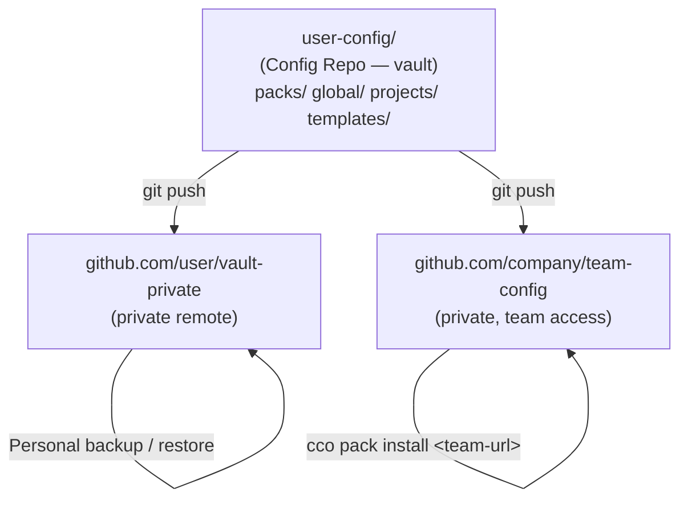

# Design: Config Repo — Versioning & Sharing

> **Status**: Design — approved (updated with review decisions 2026-03-04)
> **Date**: 2026-03-04
> **Scope**: Sprint 6 (Sharing & Import) + Sprint 10 (Config Vault)
> **Analysis**: [analysis.md](./analysis.md)
> **Roadmap**: [roadmap.md](../../decisions/roadmap.md) §Sprint 6, §Sprint 10
> **Enhancements**: Integrated below (§15–§22)

---

## Table of Contents

1. [Architecture Overview](#1-architecture-overview)
2. [Config Repo Structure](#2-config-repo-structure)
3. [Directory Restructuring — user-config/](#3-directory-restructuring--user-config)
4. [Vault Commands — cco vault](#4-vault-commands--cco-vault)
5. [Install Commands — cco pack install / cco project install](#5-install-commands--cco-pack-install--cco-project-install)
6. [Pack Source Metadata](#6-pack-source-metadata)
7. [Template Variable Resolution](#7-template-variable-resolution)
8. [Vault .gitignore Template](#8-vault-gitignore-template)
9. [Access Control Patterns](#9-access-control-patterns)
10. [manifest.yml — Required Sharing Manifest](#10-manifestyml--required-sharing-manifest)
11. [Code Changes Required](#11-code-changes-required)
12. [Migration from Current Structure](#12-migration-from-current-structure)
13. [Future Evolution](#13-future-evolution)

---

## 1. Architecture Overview

A **Config Repo** is a git repository that follows the standard CCO directory convention. It serves as:
- **Vault**: private, versioned backup of all user configuration
- **Shared bundle**: a repo (or remote branch) that other users install from

The vault is the superset. Sharing is done by pointing to a repo (private or public) that follows the same convention.



**Rule**: CCO does not implement access control. Visibility is a git hosting concern.

---

## 2. Config Repo Structure

Any directory that follows this convention is a valid Config Repo (installable by CCO):

```
<config-repo>/
├── .gitignore                    # CCO-generated, excludes secrets + runtime files
│
├── packs/                        # Reusable knowledge packs
│   ├── <pack-name>/
│   │   ├── pack.yml              # Pack manifest (required)
│   │   ├── knowledge/            # Fallback knowledge files (if no knowledge.source)
│   │   ├── skills/
│   │   ├── agents/
│   │   └── rules/
│   └── ...
│
├── templates/                    # Shareable project templates
│   ├── <template-name>/
│   │   ├── project.yml           # May contain {{PLACEHOLDER}} variables
│   │   └── .claude/
│   │       ├── CLAUDE.md
│   │       └── rules/
│   └── ...
│
├── global/                       # Personal .claude/ settings (vault only)
│   └── .claude/
│       ├── CLAUDE.md
│       ├── settings.json
│       ├── mcp.json
│       ├── agents/
│       ├── skills/
│       └── rules/
│
├── projects/                     # Personal project configs (vault only)
│   └── <project-name>/
│       ├── project.yml
│       └── .claude/
│
└── manifest.yml                  # Required: declares available resources (auto-managed by CCO)
```

### Repo type detection

CCO validates and auto-detects the repo type at install time:

| Condition | Interpretation |
|---|---|
| Root has `manifest.yml` | Standard Config Repo — `manifest.yml` is the authoritative resource index |
| Root has `pack.yml` (no `manifest.yml`) | Single-pack repo — install directly (minimal `manifest.yml` generated in memory) |
| Neither `manifest.yml` nor `pack.yml` | **Error**: not a valid CCO Config Repo |

When `manifest.yml` is present, CCO reads it to determine available resources:

| manifest.yml content | Interpretation |
|---|---|
| Has `packs:` entries | Multi-pack repo — list available packs; use `--pick` for one |
| Has `templates:` entries | Repo contains project templates |
| Has `global/` or `projects/` | Full vault — install commands apply only to `packs/` and `templates/` |

---

## 3. Directory Restructuring — user-config/

### Before (current)

```
claude-orchestrator/
├── global/              ← user config + packs (gitignored)
│   ├── .claude/
│   └── packs/           ← packs nested inside global
├── projects/            ← project configs (gitignored)
└── ...tool code...
```

### After

```
claude-orchestrator/
├── user-config/         ← single user data root (gitignored in parent repo)
│   ├── packs/           ← elevated: packs are now top-level
│   ├── templates/       ← new: project templates
│   ├── global/
│   │   └── .claude/
│   └── projects/
└── ...tool code...
```

OR, external directory (same structure, different path):

```
~/.cco/                  ← or any path via CCO_USER_CONFIG_DIR
├── packs/
├── templates/
├── global/
│   └── .claude/
└── projects/
```

### Environment variables

```bash
# Primary: controls where all user data lives
CCO_USER_CONFIG_DIR="${CCO_USER_CONFIG_DIR:-$REPO_ROOT/user-config}"

# Derived: still overridable individually for advanced users
CCO_GLOBAL_DIR="${CCO_GLOBAL_DIR:-$CCO_USER_CONFIG_DIR/global}"
CCO_PROJECTS_DIR="${CCO_PROJECTS_DIR:-$CCO_USER_CONFIG_DIR/projects}"
CCO_PACKS_DIR="${CCO_PACKS_DIR:-$CCO_USER_CONFIG_DIR/packs}"
CCO_TEMPLATES_DIR="${CCO_TEMPLATES_DIR:-$CCO_USER_CONFIG_DIR/templates}"
```

If `CCO_GLOBAL_DIR` or `CCO_PROJECTS_DIR` are set explicitly, they override the derived values. This preserves backward compatibility for users who already use these env vars.

**Deprecation**: `CCO_GLOBAL_DIR` and `CCO_PROJECTS_DIR` are deprecated. When set, CCO prints a boot-time warning:

```
⚠ CCO_GLOBAL_DIR is deprecated. Use CCO_USER_CONFIG_DIR instead.
  Current: CCO_GLOBAL_DIR=/path/to/global
  Suggested: export CCO_USER_CONFIG_DIR=/path/to (parent of global/)
```

The legacy vars will continue to work for at least two major versions, then be removed.

### Choosing a location

| Mode | When to use | Setup |
|---|---|---|
| `user-config/` inside repo | Single machine, tool and config together | Default, no configuration needed |
| External directory (`~/.cco/`) | Multi-machine sync, separate git lifecycle, prefer dotfiles style | Set `CCO_USER_CONFIG_DIR=~/.cco` in shell profile |

---

## 4. Vault Commands — cco vault

The vault wraps git operations on the `user-config/` directory (or `CCO_USER_CONFIG_DIR`).

```bash
cco vault init [<path>]
```
Initializes the Config Repo:
- Creates `user-config/` (or the specified path) if it does not exist
- Runs `git init` inside the directory
- Writes the CCO `.gitignore` template (see §8)
- If path differs from `CCO_USER_CONFIG_DIR`, writes the path to `~/.cco-vault-path` and prints an export instruction

```bash
cco vault sync [<message>] [--yes] [--dry-run]
```
Commits the current state with a mandatory pre-commit summary:

1. Scans changes (`git status`) and groups by category
2. Displays summary:
   ```
   Changes to commit:
     packs:     2 modified, 1 new
     projects:  1 modified
     global:    settings.json modified
     templates: (no changes)

   ⚠ Files excluded by .gitignore: 2 (secrets.env, api.key)
   ```
3. Prompts for confirmation: `Proceed? [Y/n]`
4. On confirm: `git add -A` → `git commit -m "vault: <message>"` (default: `"snapshot $(date +%Y-%m-%d)"`)

Flags:
- `--yes` — skip confirmation prompt (for automation, e.g. auto-sync on `cco stop`)
- `--dry-run` — show summary only, do not commit

```bash
cco vault diff
```
Shows uncommitted changes:
- `git diff` + `git status --short`
- Groups output by category (packs, projects, global settings)

```bash
cco vault log [--limit N]
```
Shows commit history with one-line summaries (default: last 20).

```bash
cco vault restore <ref>
```
Restores config to a previous state:
- Runs `git checkout <ref> -- .` (does not move HEAD)
- Prompts for confirmation: shows affected files
- Excludes `secrets.env` and other sensitive files from restore

```bash
cco vault remote add <name> <url>
cco vault push [<remote>]
cco vault pull [<remote>]
```
Standard git remote operations, delegated directly to git.

```bash
cco vault status
```
Shows:
- Whether vault is initialized (git repo exists)
- Current remote(s) and sync status (ahead/behind)
- Count of uncommitted changes by category

---

## 5. Install Commands — cco pack install / cco project install

### cco pack install

```bash
cco pack install <git-url>                    # all packs from repo
cco pack install <git-url> --pick <name>      # one specific pack by name
cco pack install <git-url>:<subpath>          # explicit subpath (for non-CCO repos)
cco pack install <git-url>@<ref>              # pin to branch/tag/commit
cco pack install <git-url> --token <token>    # explicit auth token (HTTPS)
```

**Install flow:**

```
1. Resolve URL → detect auth method (SSH key / GITHUB_TOKEN / --token)
2. Clone repo to temp dir (see clone strategy below)
3. Validate: repo must contain manifest.yml (see §10)
4. Auto-detect repo type (single-pack / multi-pack / vault)
5. If multi-pack and no --pick:
     List available packs from manifest.yml
     Prompt user to select one or all
6. Copy pack to $CCO_PACKS_DIR/<name>/
7. Write .cco/source metadata (see §6)
8. Cleanup temp dir
9. Print confirmation with resource summary
```

**Clone strategy — sparse-checkout with fallback:**

CCO prefers sparse-checkout for efficiency but falls back to full clone on older git:

```bash
# Primary: sparse-checkout (git 2.25+)
git clone --no-checkout --filter=blob:none <url> /tmp/cco-XXXX
git -C /tmp/cco-XXXX sparse-checkout set <target-path>
git -C /tmp/cco-XXXX checkout

# Fallback: full shallow clone + selective copy (git < 2.25)
git clone --depth 1 <url> /tmp/cco-XXXX
cp -r /tmp/cco-XXXX/<target-path> $CCO_PACKS_DIR/<name>/
```

Detection: `git sparse-checkout set` in a test invocation; if exit code ≠ 0, use fallback. The fallback downloads the entire repo but config repos are small (typically < 1MB), so the overhead is negligible.

**Conflict handling:**
- If a pack with the same name exists locally:
  - If source matches → offer to update
  - If source differs → warn, ask: overwrite / keep / abort
- If pack was created locally (`source: local`) → always ask before overwriting

### cco pack update

```bash
cco pack update <name>      # update one pack from its recorded source
cco pack update --all       # update all packs with a remote source
```

Reads `.cco/source`, re-runs the sparse-checkout with the same ref (or latest if ref was a branch). Does not overwrite local modifications unless `--force`.

### cco project install

```bash
cco project install <git-url>
cco project install <git-url> --pick <template-name>
cco project install <git-url> --as <local-name>     # rename on install
```

Install flow mirrors `cco pack install`. Template `project.yml` may contain `{{PLACEHOLDER}}` variables; CCO prompts for values at install time and resolves them before writing to `projects/<name>/project.yml`.

---

## 6. Pack Source Metadata

Every pack installed from a remote source carries a `.cco/source` file in its directory:

```yaml
# $CCO_PACKS_DIR/<name>/.cco/source

source: https://github.com/team/team-config
path: packs/react-guidelines         # subdirectory within the repo
ref: main                            # branch, tag, or commit SHA
installed: 2026-03-04
updated: 2026-03-04
```

Locally created packs (via `cco pack create`) have:

```yaml
source: local
installed: 2026-03-04
```

The `.cco/source` file is:
- Tracked in the vault (versioning records where each pack came from)
- Excluded from `cco pack export` outputs (source is specific to the installer)

---

## 7. Template Variable Resolution

Project templates (`templates/<name>/project.yml`) may contain `{{PLACEHOLDER}}` variables that are resolved at install time.

### Predefined variables

| Variable | Source | Example value |
|---|---|---|
| `{{PROJECT_NAME}}` | `--as <name>` flag, or prompt | `my-app` |
| `{{REPO_PATH}}` | Prompt (no default) | `~/projects/my-app` |

### Custom variables

Any `{{VARIABLE}}` not in the predefined set triggers an interactive prompt:

```
Template 'acme-service' requires the following values:
  PROJECT_NAME [my-app]: _
  REPO_PATH: ~/projects/my-app
  DB_NAME: _
```

### Implementation

Simple `sed`-based substitution — no template engine:

```bash
# 1. Scan template for variables
vars=$(grep -oP '\{\{\w+\}\}' "$template_file" | sort -u)

# 2. Prompt for each variable (skip predefined if already set)
for var in $vars; do
    name="${var//[\{\}]/}"
    read -p "  $name: " value
    substitutions+=("-e" "s|{{$name}}|$value|g")
done

# 3. Apply substitutions
sed "${substitutions[@]}" "$template_file" > "$target_file"
```

**Design choice**: `sed` is sufficient for the current use case (simple key-value substitution in YAML). If future templates need conditionals or loops, we can evaluate a lightweight template engine then. For Sprint 6, YAGNI applies.

---

## 8. Vault .gitignore Template

Written by `cco vault init` to `<user-config>/.gitignore`:

```gitignore
# Secrets — never committed
secrets.env
*.env
.credentials.json
*.key
*.pem

# Runtime files — generated, not user config
projects/*/.cco/docker-compose.yml
projects/*/.cco/managed/
projects/*/.claude/.cco/pack-manifest
projects/*/.cco/meta
global/.claude/.cco/meta
.cco/remotes

# Session state — transient, large, personal
projects/*/.cco/claude-state/
projects/*/rag-data/

# Pack install temporary files
packs/*/.cco/install-tmp/
```

The template is conservative. Users may remove entries that do not apply to their setup, but CCO emits a warning if `secrets.env` is ever staged for commit.

---

## 9. Access Control Patterns

### Pattern 1: Personal vault only

```
github.com/alice/cco-vault (private)
└── packs/ global/ projects/ templates/
```

All config in one private repo. Backup via `cco vault push`. No sharing.

### Pattern 2: Vault + public packs

```
github.com/alice/cco-vault (private)   ← full personal config
github.com/alice/cco-packs (public)    ← curated subset for sharing
```

Alice maintains both repos. When she wants to make a pack public:
1. Copy or develop the pack in `cco-packs/packs/<name>/`
2. Or: `git subtree push` from the vault to the public repo (future command: `cco pack publish`)

Others install with `cco pack install https://github.com/alice/cco-packs`.

### Pattern 3: Team config

```
github.com/acme/cco-config (private, org members only)
└── packs/
    ├── acme-conventions/
    └── acme-deploy/
```

Team members install with `cco pack install git@github.com:acme/cco-config`. Auth via SSH key or `GITHUB_TOKEN` (already configured for `gh` CLI).

### Pattern 4: Mixed access (two repos)

```
github.com/alice/cco-vault    (private) ← personal vault
github.com/acme/cco-config    (private, team) ← team packs
github.com/alice/cco-open     (public) ← open-source packs
```

Alice installs from all three. Each has its own auth level. CCO treats them the same — just different git URLs.

---

## 10. manifest.yml — Required Sharing Manifest

Every Config Repo **must** contain a `manifest.yml` at the root. CCO refuses to install from repos without one. This ensures every repo is self-documenting and machine-readable.

### Format

```yaml
# manifest.yml

name: "acme-team-config"
description: "Engineering configuration bundle for ACME Corp"
author: "ACME Platform Team"
homepage: https://github.com/acme/cco-config

packs:
  - name: acme-conventions
    description: "Code style, commit conventions, and review standards"
    tags: [conventions, style, team]
  - name: acme-deploy
    description: "Deployment scripts and infrastructure patterns"
    tags: [deploy, infra, aws]

templates:
  - name: acme-service
    description: "Microservice template with standard ACME setup"
    tags: [microservice, fastapi, postgres]
```

### Auto-management by CCO

CCO generates and maintains `manifest.yml` automatically. Users never need to write it by hand:

| Command | Effect on manifest.yml |
|---|---|
| `cco pack create <name>` | Adds entry under `packs:` |
| `cco pack remove <name>` | Removes entry from `packs:` |
| `cco project create --template <name>` | Adds entry under `templates:` (if inside a Config Repo) |
| `cco manifest refresh` | Regenerates `manifest.yml` by scanning `packs/` and `templates/` directories |

### Validation

`cco pack install <url>` validates after clone:
1. Check `manifest.yml` exists → if missing, abort with: `Error: no manifest.yml found. This is not a valid CCO Config Repo.`
2. If `--pick <name>` is used, verify the named resource exists in `manifest.yml`
3. Cross-check: warn if `manifest.yml` lists resources that don't exist on disk (stale manifest)

### Single-pack repos (exception)

A repo with `pack.yml` at root (single-pack repo, not inside `packs/`) is also valid. In this case, CCO generates a minimal `manifest.yml` in memory for validation purposes — the user is not required to maintain one for this simple case.

### Future: registry

A public registry would index `manifest.yml` files from user-submitted repos. `cco manifest list` reads `manifest.yml` from all registered remote sources.

---

## 11. Code Changes Required

### 11.1 New environment variables (bin/cco)

```bash
# Add after existing GLOBAL_DIR / PROJECTS_DIR:
USER_CONFIG_DIR="${CCO_USER_CONFIG_DIR:-$REPO_ROOT/user-config}"

# Override derived vars only if not explicitly set
GLOBAL_DIR="${CCO_GLOBAL_DIR:-$USER_CONFIG_DIR/global}"
PROJECTS_DIR="${CCO_PROJECTS_DIR:-$USER_CONFIG_DIR/projects}"
PACKS_DIR="${CCO_PACKS_DIR:-$USER_CONFIG_DIR/packs}"
TEMPLATES_DIR="${CCO_TEMPLATES_DIR:-$USER_CONFIG_DIR/templates}"
```

### 11.2 lib/packs.sh

Change all references from `$GLOBAL_DIR/packs` to `$PACKS_DIR`.

### 11.3 cmd-pack.sh

- `cco pack install` — new command (lib/cmd-pack.sh, new `cmd_pack_install` function)
- `cco pack update` — new command
- `cco pack export` — new command (archive for manual sharing)
- Existing commands: no changes to logic, only path references

### 11.4 New lib/cmd-vault.sh

Implements all `cco vault` subcommands. Thin wrappers around git with CCO-specific defaults (`.gitignore` template, secret detection, categorized output).

### 11.5 lib/manifest.sh (new)

Manages `manifest.yml` lifecycle:
- `manifest_add_entry(type, name, description)` — adds pack or template entry
- `manifest_remove_entry(type, name)` — removes entry
- `manifest_refresh(config_dir)` — scans `packs/` and `templates/`, regenerates `manifest.yml`
- `manifest_validate(config_dir)` — cross-checks `manifest.yml` vs. disk (warns on stale entries)

Called by `cmd_pack_create`, `cmd_pack_remove`, and the new `cco manifest refresh` command.

### 11.6 lib/cmd-project-install.sh (or extend cmd-project.sh)

`cco project install` — mirrors `cco pack install` for project templates. Template variables resolved via `sed` (see §7).

### 11.7 cco init

Update `cco init` to create `user-config/` instead of separate `global/` + `projects/`. Existing installations handled by migration (see §12).

### 11.8 .gitignore in tool repo

Change:
```
global/
projects/
```
To:
```
user-config/
```

---

## 12. Migration from Current Structure

### For existing users (cco update migration)

Migration script: `migrations/global/004_user-config-dir.sh`

```
Actions:
1. Create user-config/
2. Move global/ → user-config/global/
3. Move global/packs/ → user-config/packs/   (elevated out of global/)
4. Move projects/ → user-config/projects/
5. Create user-config/templates/ (empty)
6. Update .gitignore in tool repo
7. Write migration note: "Run 'cco vault init' to enable versioning"
```

**Idempotent**: checks if `user-config/` already exists before moving.

**CCO_GLOBAL_DIR / CCO_PROJECTS_DIR backward compatibility**: if a user has these set in their shell profile pointing to the old paths, they continue to work (the derived vars are only used when the explicit vars are not set). CCO prints a deprecation warning at boot (see §3) suggesting they switch to `CCO_USER_CONFIG_DIR`.

**Migration is automatic**: `cco update` runs all pending migrations. Users do not need to take any manual action. The migration prints a clear summary:

```
Migrating to user-config/ directory structure...
  ✓ Created user-config/
  ✓ Moved global/ → user-config/global/
  ✓ Elevated global/packs/ → user-config/packs/
  ✓ Moved projects/ → user-config/projects/
  ✓ Created user-config/templates/
  ✓ Updated .gitignore

Run 'cco vault init' to enable versioning for your configuration.
```

### For new users (cco init)

`cco init` directly creates the `user-config/` structure. No migration needed.

---

## 13. Publish-Install Sync (FI-7) — Implemented

The publish/install lifecycle has been completed with bidirectional sync.
See [FI-7 design](./publish-install-sync-design.md) for full details.

**Key additions**:
- `cco project update <name>`: fetch + 3-way merge from publisher
- `cco project internalize <name>`: disconnect from remote
- `cco update`: unified discovery (framework + remote sources)
- `cco update --sync <project> --local`: escape hatch for installed projects
- `cco project publish` safety pipeline: migration check, secret scan (filename + content), diff review, per-file confirmation, `.cco/publish-ignore`

---

## 14. Future Evolution

### Short-term

| Feature | Notes |
|---|---|
| Registry index | A publicly crawled index of `manifest.yml` files — browse and search available packs without knowing specific URLs. No server required from CCO side; the index is a static file hosted on GitHub Pages or similar. |
| `cco pack install acme/conventions` | Short-form install via registry (resolves to full git URL) |
| Lockfile for reproducible project setups | `project.yml` records installed pack version (git ref); `cco project sync` ensures exact versions are installed |

### Invariants to preserve

- Git is the only required transport (no custom protocol, no registry server)
- Auth is always delegated to the system git credential layer (SSH, GITHUB_TOKEN, or `--token`)
- Secrets are never committed (`.gitignore` enforced with warning on `cco vault sync`)
- The Config Repo structure is the same regardless of host (GitHub, GitLab, Gitea, bare server)

---

## Post-Implementation Enhancements

> Sections 15–22 detail the design for enhancements identified after the base
> Config Repo implementation (naming fixes, new commands, enhanced workflows).

---

## 15. Rename: share → manifest

### What changed

| Before | After |
|---|---|
| `cco share refresh` | `cco manifest refresh` |
| `cco share validate` | `cco manifest validate` |
| `cco share show` | `cco manifest show` |
| `share.yml` | `manifest.yml` |
| `lib/share.sh` | `lib/manifest.sh` |
| `tests/test_share.sh` | `tests/test_manifest.sh` |

### Migration

Migration `005_rename_share_to_manifest.sh`:

```bash
migrate() {
    local dir="$1"
    if [[ -f "$dir/share.yml" && ! -f "$dir/manifest.yml" ]]; then
        mv "$dir/share.yml" "$dir/manifest.yml"
    fi
}
```

No backward compatibility for `share.yml` in remote repos. Only `manifest.yml`
is supported.

---

## 16. Remote Management: cco remote

### Storage

Remotes are stored in `$USER_CONFIG_DIR/.cco/remotes` (simple key-value file):

```
alberghi=git@github.com:alberghi-it/cco-config.git
acme=git@github.com:acme-corp/cco-config.git
personal=git@github.com:jdoe/cco-vault.git
```

Format: `<name>=<url>`, one per line. Lines starting with `#` are comments.
File is gitignored by vault (contains no secrets, but is machine-specific).

### Commands

```
cco remote add <name> <url> [--token <token>]
cco remote remove <name>
cco remote list
cco remote set-token <name> <token>
cco remote remove-token <name>
```

### Token resolution

When performing HTTPS operations, the token is resolved in order:

1. `--token` flag (explicit, per-command)
2. Saved token for the remote name (`remote_get_token`)
3. Saved token matched by URL (`remote_resolve_token_for_url`)
4. `GITHUB_TOKEN` environment variable (for `github.com` URLs)

### Vault integration

If vault is initialized, `cco remote add` also adds the remote to the vault's
git config. The `.cco/remotes` file is the source of truth; vault remotes are
kept in sync.

Implementation: `lib/cmd-remote.sh`.

---

## 17. Pack Publish

### Signature

```
cco pack publish <name> [<remote>] [OPTIONS]

Options:
  --message <msg>    Commit message (default: "publish pack <name>")
  --dry-run          Show what would be published, don't push
  --force            Overwrite remote version without confirmation
  --token <token>    Auth token for HTTPS remotes
```

### Argument resolution

The `<remote>` argument is resolved in order:
1. If it matches a registered remote name → use that URL
2. If it contains `:` or `/` → treat as direct URL
3. If omitted → read `publish_target` from `.cco/source`
4. If none of the above → error with suggestion to register a remote

### Flow

```
cco pack publish alberghi-it alberghi
│
├─ 1. Validate pack exists in $PACKS_DIR/alberghi-it/
├─ 2. Resolve remote "alberghi" → git@github.com:alberghi-it/cco-config.git
├─ 3. Clone remote repo to temp dir (_clone_config_repo)
│     If empty repo (first publish): initialize with manifest.yml
├─ 4. Internalize if needed:
│     If pack has knowledge.source in pack.yml:
│       Copy files from source → tmpdir/packs/<name>/knowledge/
│       Remove source: field from tmpdir pack.yml
│       (Local pack unchanged)
├─ 5. Copy pack to tmpdir/packs/<name>/
│     Exclude: .cco/source, .cco/install-tmp
├─ 6. Refresh manifest in tmpdir (manifest_refresh on tmpdir)
├─ 7. Git add + commit in tmpdir
├─ 8. Git push to remote
├─ 9. Update local .cco/source: publish_target: alberghi
├─ 10. Cleanup tmpdir
└─ 11. Print confirmation
```

### .cco/source extension

```yaml
# New field (for published packs):
publish_target: alberghi
```

---

## 18. Project Publish

### Signature

```
cco project publish <name> [<remote>] [OPTIONS]

Options:
  --message <msg>    Commit message
  --dry-run          Show what would be published
  --force            Overwrite without confirmation
  --token <token>    Auth token for HTTPS remotes
  --no-packs         Don't bundle project's packs (default: packs are included)
```

### Reverse-templating

When publishing a project, repo paths are converted to template variables
and repo URLs are captured automatically:

**Input** (local `project.yml`):
```yaml
repos:
  - path: ~/projects/backend-api
    name: backend-api
```

**Output** (published template):
```yaml
repos:
  - path: "{{REPO_BACKEND_API}}"
    name: backend-api
    url: git@github.com:acme-corp/backend-api.git
```

### Reverse-template algorithm

For each repo entry:
1. Generate variable name: `REPO_` + uppercase(name with `-` → `_`)
2. Replace `path:` value with the template variable
3. Infer `url:` from the repo's git remote (`git remote get-url origin`)
4. Keep `name:` unchanged

The local `project.yml` is **never modified**. Reverse-templating happens only
on the copy in the temp directory.

### Pack bundling

If the project declares `packs: [pack-a, pack-b]` and `--include-packs` is true
(default), each declared pack is published alongside the project (including
internalization of source-referencing packs).

### Files excluded from publish

- `.cco/docker-compose.yml` (generated by `cco start`)
- `.cco/managed/` (runtime MCP configs)
- `.claude/.cco/pack-manifest` (legacy pack tracking)
- `.cco/meta` (update system metadata)
- `.cco/claude-state/` (session transcripts, memory)
- `secrets.env` (secrets)

---

## 19. Project add-pack / remove-pack

### Signature

```
cco project add-pack <project> <pack>
cco project remove-pack <project> <pack>
```

### YAML editing strategy

The `packs:` section in `project.yml` is a simple YAML list:

```yaml
packs:
  - pack-a
  - pack-b
```

**add-pack**: append `  - <name>` after the last pack entry (or after `packs:`
if list is empty / `packs: []`).

**remove-pack**: delete the line matching `  - <name>` under `packs:`.

Implementation: `cmd_project_add_pack()` and `cmd_project_remove_pack()` in
`lib/cmd-project-pack-ops.sh`.

---

## 20. Pack Internalize

### Signature

```
cco pack internalize <name>
```

Converts a source-referencing pack to self-contained by copying knowledge files
from the external `source:` directory into the pack's own `knowledge/` directory
and removing the `source:` field from `pack.yml`.

### Flow

1. Read `pack.yml` → extract `knowledge.source` and `knowledge.files`
2. If no `source:` field → message "pack is already self-contained", exit 0
3. Expand source path, validate directory exists
4. For each file in `knowledge.files`: copy from `$source/$file` to `$pack_dir/knowledge/$file`
5. Remove `source:` line from `pack.yml`
6. Print summary: N files internalized

This is a one-way operation. The original `source:` path is lost.

---

## 21. Enhanced Project Install (auto-clone + auto-packs)

### Enhanced flow

```
cco project install <url> [--pick <name>] [--as <name>] [--var K=V]
│
├─ 1. Clone remote Config Repo
├─ 2. Select template (--pick or auto if single)
├─ 3. Copy to $PROJECTS_DIR/<name>/
├─ 4. Resolve template variables (existing behavior)
│
│  ── Repo handling ──
├─ 5. For each repo in template:
│     ├─ Show: "backend-api (git@github.com:acme-corp/backend-api.git)"
│     ├─ Prompt: "Local path [~/repos/backend-api]: "
│     ├─ If path exists → use it
│     ├─ If path doesn't exist AND url available → offer to clone
│     └─ If path doesn't exist AND no url → error
│
│  ── Pack auto-install ──
├─ 6. Read packs: list from installed project.yml
├─ 7. For each pack:
│     ├─ If exists in $PACKS_DIR/ → skip
│     ├─ If exists in cloned Config Repo packs/ → auto-install
│     └─ If not found → warn
└─ 8. Print summary
```

**Default clone path**: `~/repos/<repo-name>`.

**Non-interactive mode**: all repo paths must be provided via `--var`:
```bash
cco project install <url> --pick albit-book \
  --var REPO_BACKEND_API=~/repos/backend-api
```

---

## 22. Manifest Scope and Lifecycle

### Where manifests live

| Location | Purpose | Who creates it | Who reads it |
|---|---|---|---|
| `user-config/manifest.yml` | Index of local packs/templates | `cco manifest refresh` | Rare: only if user shares entire user-config |
| `<shared-repo>/manifest.yml` | Index of shared resources | `cco pack/project publish` (auto) | `cco pack/project install` (consumer) |

### When manifests are refreshed

| Event | Local manifest | Remote manifest |
|---|---|---|
| `cco pack create` | Auto-refresh | N/A |
| `cco pack remove` | Auto-refresh | N/A |
| `cco pack publish` | No change | Auto-refresh in temp clone before push |
| `cco project publish` | No change | Auto-refresh in temp clone before push |
| `cco manifest refresh` | Explicit refresh | N/A (works on local only) |

The `publish` commands handle remote manifest refresh transparently.

---

## Appendix E: Updated manifest.yml format

```yaml
# manifest.yml — auto-generated by cco, do not edit manually
name: "alberghi-it-config"
description: "Packs and project templates for Alberghi IT"

packs:
  - name: alberghi-it
    description: "Knowledge base for alberghi.it development"
    tags: [hospitality, backend, conventions]

templates:
  - name: albit-book
    description: "Booking system project template"
    tags: [booking, fullstack]
    packs: [alberghi-it, alberghi-common]
    repos:
      - name: backend-api
        url: git@github.com:acme-corp/backend-api.git
```

## Appendix F: .cco/source format (extended)

```yaml
# For a pack installed from a remote Config Repo:
source: https://github.com/alberghi-it/cco-config.git
path: packs/alberghi-it
ref: main
installed: 2026-03-05
updated: 2026-03-05
publish_target: alberghi

# For a locally created pack:
source: local
publish_target: alberghi
```

## Appendix G: .cco/remotes format

```
# CCO Config Repo remotes
# Format: name=url  |  name.token=token
team=git@github.com:my-org/cco-config.git
acme=https://github.com/acme-corp/cco-config.git
acme.token=ghp_xxxxxxxxxxxx
personal=git@github.com:jdoe/cco-vault.git
```

## Appendix H: Example end-to-end workflow

### Publisher (Alice)

```bash
# Setup remotes (once)
cco remote add alberghi git@github.com:alberghi-it/cco-config.git

# Create pack and project
cco pack create alberghi-it
cco project create albit-book --repo ~/projects/albit-booking
cco project add-pack albit-book alberghi-it

# Publish
cco pack publish alberghi-it alberghi
cco project publish albit-book alberghi

# Later updates
cco pack publish alberghi-it         # remembers target
```

### Consumer (colleague Marco)

```bash
# Install project (includes pack auto-install + repo clone)
cco project install git@github.com:alberghi-it/cco-config.git --pick albit-book

# Output:
# Installing template 'albit-book'...
# This project requires 1 repository:
#   albit-booking (git@github.com:alberghi-it/albit-booking.git)
#     Local path [~/repos/albit-booking]: ~/dev/albit-booking
#     Clone from git@github.com:...? [Y/n]: Y
# Auto-installing pack 'alberghi-it' from same Config Repo...
# Project 'albit-book' installed.

cco start albit-book
```
