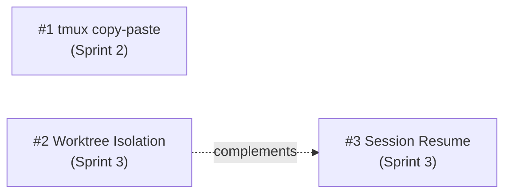

# Implementation Plan: Sprint 2 & Sprint 3

> **Status**: Historical record

> Date: 2026-02-26
> Status: Sprint 2 completed — Sprint 3 pending
> Related: [roadmap.md](../roadmap.md) | [progress review](./26-02-2026-progress-review.md)

---

## Overview

Three features to implement, ordered by priority and dependencies:



Sprint 2 is **independent** (no technical dependencies with Sprint 3). Sprint 3 has two features: worktree first, resume after. Resume complements worktree but has no hard dependencies — can be implemented without worktree.

---

## Feature #1: Fix tmux copy-paste ✅

**Sprint**: 2 (quality of life) — **Completed 2026-02-26**
**Effort**: Low (1 session)
**Risk**: None — config-only, no code logic changes
**Analysis doc**: [`terminal-clipboard-and-mouse.md`](../../integration/agent-teams/analysis.md)

### Problem

The current tmux configuration has 6 gaps that make copy-paste non-intuitive:
1. `default-terminal` uses `screen-256color` (obsolete, lacks italics and key codes)
2. No explicit clipboard capability (relies on `xterm*` heuristic)
3. No `allow-passthrough` (blocks DCS for iTerm2 inline images)
4. No `MouseDragEnd1Pane` binding (user must press `y` after selection — non-obvious UX)
5. No `C-v` for rectangle toggle
6. Bypass key documentation only for iTerm2 and Terminal.app

### Implementation

#### 1. Update `config/tmux.conf`

```tmux
# ── Terminal ─────────────────────────────────────────────────────────
set -g default-terminal "tmux-256color"
set -ga terminal-overrides ",xterm-256color:Tc"

# ── Clipboard ────────────────────────────────────────────────────────
set -g set-clipboard on
set -g allow-passthrough on
# Explicit clipboard capability for terminals where TERM is not xterm*
set -as terminal-features ",xterm-256color:clipboard"

# ── Mouse ────────────────────────────────────────────────────────────
set -g mouse on

# ── Copy mode ────────────────────────────────────────────────────────
setw -g mode-keys vi
bind-key -T copy-mode-vi v send-keys -X begin-selection
bind-key -T copy-mode-vi C-v send-keys -X rectangle-toggle
bind-key -T copy-mode-vi y send-keys -X copy-selection-and-cancel
bind-key -T copy-mode-vi MouseDragEnd1Pane send-keys -X copy-pipe-and-cancel

# Bypass tmux mouse capture for native terminal selection:
#   macOS iTerm2:      hold Option (⌥)
#   macOS Terminal.app: hold fn
#   Linux/Windows:     hold Shift
```

#### 2. Update documentation

- `docs/user-guides/agent-teams.md` — Add "Copy & Paste" section with:
  - Table of bypass keys per terminal
  - iTerm2 setup (enable OSC 52 in preferences)
  - Known limitations (Terminal.app, VTE terminals)

#### 3. Testing

No automated tests needed (visual configuration). Verify manually:
- [ ] Mouse drag → auto-copy (without pressing `y`)
- [ ] `y` in copy-mode → copy to clipboard
- [ ] `C-v` → rectangle selection
- [ ] Paste with Cmd+V works
- [ ] Pane switching with mouse still works

#### 4. Open Questions from analysis (§9)

| Question | Proposal |
|---------|----------|
| `allow-passthrough on`? | Yes — container with `--dangerously-skip-permissions`, risk is acceptable |
| `MouseDragEnd1Pane` with pipe command? | No — only copy-pipe-and-cancel without command. OSC 52 is sufficient |
| Document iTerm2 preference? | Yes — in display-modes guide, not entrypoint |
| `terminal-overrides` for Alacritty/Kitty/Ghostty? | Not yet — covers majority with `xterm-256color`. Advanced users can customize |
| `mouse on` as default? | Yes — benefits (pane switching, scrollback) outweigh cost (bypass key) |

---

## Feature #2: Git Worktree Isolation

**Sprint**: 3 (differentiating feature)
**Effort**: Medium-high (2-3 sessions)
**Risk**: Low — opt-in, default unchanged
**Analysis doc**: [`worktree-isolation.md`](../../integration/worktree/analysis.md)
**Design doc**: [`worktree-design.md`](../../integration/worktree/design.md)

### Prerequisites

- Auth implemented (GITHUB_TOKEN + gh CLI) ✅
- tmux copy-paste fix (Sprint 2) — not strictly necessary but improves experience

### Implementation (from design doc §8)

Tasks are in implementation order. Each step is independently committable.

#### Step 1: CLI — Parsing configuration

**File**: `bin/cco`

- Parse `worktree` and `worktree_branch` from `project.yml` (via `yml_get`)
- Parse `--worktree` flag in `cmd_start()`
- Calculate `worktree_branch`: if `auto` or missing → `cco/<project-name>`
- Logic: `--worktree` flag overrides `project.yml`; both default to `false`

#### Step 2: CLI — Conditional compose generation

**File**: `bin/cco`

When worktree mode is active, change the generated volumes **for git repos**:

```yaml
# Without worktree (unchanged):
volumes:
  - ~/projects/my-repo:/workspace/my-repo

# With worktree (git repo):
volumes:
  - ~/projects/my-repo:/git-repos/my-repo

# With worktree (non-git directory in repos:) — fallback to direct mount:
volumes:
  - ~/projects/shared-assets:/workspace/shared-assets
```

Detection occurs at compose generation time: for each entry in `repos:`, check if `<path>/.git` exists on the host. If yes → `/git-repos/`. If no → `/workspace/` (fallback, same behavior without worktree).

Add environment vars:
```yaml
environment:
  - WORKTREE_ENABLED=true
  - WORKTREE_BRANCH=cco/myproject
```

#### Step 3: Entrypoint — Worktree creation

**File**: `config/entrypoint.sh`

After Docker socket handling, before launching Claude:

```bash
if [ "${WORKTREE_ENABLED:-}" = "true" ]; then
    BRANCH="${WORKTREE_BRANCH:-cco/${PROJECT_NAME}}"
    echo "[entrypoint] Worktree mode: creating worktrees on branch '$BRANCH'" >&2

    for repo_dir in /git-repos/*/; do
        [ -d "${repo_dir}.git" ] || continue
        repo_name=$(basename "$repo_dir")
        wt_target="/workspace/${repo_name}"

        # Prune stale worktree refs from previous container runs
        gosu claude git -C "$repo_dir" worktree prune 2>/dev/null

        # Resume existing branch or create new
        if gosu claude git -C "$repo_dir" rev-parse --verify "$BRANCH" &>/dev/null; then
            gosu claude git -C "$repo_dir" worktree add "$wt_target" "$BRANCH" 2>&1 >&2
            echo "[entrypoint] Worktree: $repo_name → $wt_target (existing branch $BRANCH)" >&2
        else
            gosu claude git -C "$repo_dir" worktree add -b "$BRANCH" "$wt_target" 2>&1 >&2
            echo "[entrypoint] Worktree: $repo_name → $wt_target (new branch $BRANCH)" >&2
        fi
    done
fi
```

This block goes **before** the final `exec gosu claude ...`, but **after** the Docker socket GID fix (which requires root). All git commands use `gosu claude` to prevent worktree files from being created as root.

#### Step 4: Hook fix — `.git` file detection

**File**: `config/hooks/session-context.sh`

Change `[ -d "${dir}.git" ]` to `[ -e "${dir}.git" ]` to support worktree (where `.git` is a file, not a directory).

Backward-compatible: `[ -e ]` is true for both files and directories.

#### Step 5: CLI — Post-session cleanup

**File**: `bin/cco`

After `docker compose run` returns in `cmd_start()`:

```bash
if [[ "$worktree_enabled" == true ]]; then
    info "Cleaning up worktrees..."
    while IFS=: read -r repo_path repo_name; do
        [[ -z "$repo_path" ]] && continue
        repo_path=$(expand_path "$repo_path")
        git -C "$repo_path" worktree prune 2>/dev/null
        local branch="$worktree_branch"
        if git -C "$repo_path" rev-parse --verify "$branch" &>/dev/null; then
            ahead=$(git -C "$repo_path" rev-list --count "origin/main..$branch" 2>/dev/null || echo "?")
            if [[ "$ahead" == "0" ]]; then
                git -C "$repo_path" branch -d "$branch" 2>/dev/null
                info "  ${repo_name}: branch '$branch' merged — deleted"
            else
                warn "  ${repo_name}: branch '$branch' has $ahead unmerged commit(s) — kept"
            fi
        fi
    done <<< "$(yml_get_repos "$project_yml")"
fi
```

#### Step 6: Template update

**File**: `templates/project/base/project.yml`

Add commented fields:

```yaml
# ── Git Worktree Isolation (optional) ──────────────────────────────
# worktree: true            # Create worktrees for git isolation
# worktree_branch: auto     # "auto" = cco/<project-name>; or explicit branch name
```

#### Step 7: Test (dry-run)

**File**: `tests/test_worktree.sh` (new)

Tests for compose generation with worktree:
- [ ] `worktree: true` → repos mounted to `/git-repos/` (not `/workspace/`)
- [ ] `worktree: false` (default) → repos mounted to `/workspace/` (unchanged)
- [ ] `WORKTREE_ENABLED=true` present in compose env vars
- [ ] `WORKTREE_BRANCH=cco/<name>` present in env vars
- [ ] `worktree_branch: custom-name` → `WORKTREE_BRANCH=custom-name`
- [ ] `--worktree` flag overrides `worktree: false` in project.yml
- [ ] Non-git directories in `repos:` mounted to `/workspace/` (fallback, not `/git-repos/`)

Tests for post-session cleanup (mock git):
- [ ] `git worktree prune` called for each repo
- [ ] Branch merged → deleted
- [ ] Branch with unmerged commits → kept with warning

#### Step 8: Documentation

| Document | Update |
|-----------|---------|
| `docs/reference/cli.md` | `--worktree` flag, `worktree`/`worktree_branch` fields in project.yml |
| `docs/user-guides/project-setup.md` | Section "Git Worktree Isolation" with examples |
| `docs/maintainer/docker/design.md` | Compose template variant for worktree |
| `docs/maintainer/future/worktree/design.md` | Status → "Implemented" |
| `docs/maintainer/roadmap.md` | Move #2 to "Completed" section |

#### Edge cases (from design doc §6)

| Case | Handling |
|------|----------|
| Branch exists, worktree does not | Resume: `git worktree add` without `-b` |
| Branch exists AND has active worktree | `git worktree prune` before add |
| Repo with uncommitted changes | Worktree independent, not impacted |
| Two projects on same repo | Branch naming `cco/<project>` avoids collisions |
| Non-git directory in repos | Skip worktree, direct mount to `/workspace/` |
| Subagent worktree inside container worktree | Works natively, no special handling |

---

## Feature #3: Session Resume

**Sprint**: 3 (after worktree)
**Effort**: Low (1 session)
**Risk**: None — new command, no impact on existing

### Problem

There is no way to re-enter a running tmux session after disconnect. User must manually run `docker exec`.

### Implementation

#### 1. New command `cmd_resume()`

**File**: `bin/cco`

```bash
cmd_resume() {
    local name="${1:?Usage: cco resume <project>}"
    local project_dir="$PROJECTS_DIR/$name"
    local project_yml="$project_dir/project.yml"

    [[ -d "$project_dir" ]] || die "Project '$name' not found in $PROJECTS_DIR"
    [[ -f "$project_yml" ]] || die "Missing project.yml for '$name'"

    # Read project name from yml (may differ from directory name)
    local project_name
    project_name=$(yml_get "$project_yml" "name")
    local container="cc-${project_name}"

    if ! docker ps --format '{{.Names}}' 2>/dev/null | grep -q "^${container}$"; then
        die "No running session for project '${project_name}'. Use 'cco start' instead."
    fi

    # Check if tmux is available inside the container
    if docker exec "$container" tmux has-session -t claude 2>/dev/null; then
        info "Reattaching to tmux session '${project_name}'..."
        docker exec -it "$container" tmux attach-session -t claude
    else
        # Non-tmux mode (--teammate-mode auto): attach to main process
        info "Reattaching to session '${project_name}' (non-tmux mode)..."
        docker exec -it "$container" bash
    fi
}
```

Note: the project name is read from `project.yml` (as `cmd_stop()` does) for consistency with container naming. The `tmux has-session` check handles sessions started without tmux.

#### 2. Register command in dispatch

**File**: `bin/cco` (in main `case` statement)

```bash
resume)   shift; cmd_resume "$@" ;;
```

#### 3. Help text

Update `cmd_usage()` with:
```
  resume <project>        Reattach to a running session
```

#### 4. Testing

**File**: `tests/test_resume.sh` (new) or extend `test_stop.sh`

- [ ] `cco resume` without argument → error with usage
- [ ] `cco resume nonexistent` → error "Project not found"
- [ ] `cco resume` with container not running → error "No running session"
- [ ] Project name read from `project.yml` (not directory name)
- [ ] tmux session present → `tmux attach-session`
- [ ] tmux session absent (non-tmux mode) → fallback `bash`

#### 5. Documentation

| Document | Update |
|-----------|---------|
| `docs/reference/cli.md` | New `cco resume` command |
| `docs/maintainer/roadmap.md` | Move #3 to "Completed" section |
| CLAUDE.md (root) | Add `cco resume` to commands table |

---

## Recommended implementation order

```
Session 1 (Sprint 2):
  ├── #1 tmux copy-paste config
  ├── #1 display-modes documentation
  └── commit + manual testing

Session 2 (Sprint 3 — part 1):
  ├── #2 Step 1: CLI parsing worktree config
  ├── #2 Step 2: Conditional compose generation
  ├── #2 Step 4: Hook fix .git detection
  ├── #2 Step 6: Template update
  ├── #2 Step 7: Dry-run tests
  └── commit (worktree CLI ready, testable with --dry-run)

Session 3 (Sprint 3 — part 2):
  ├── #2 Step 3: Entrypoint worktree creation
  ├── #2 Step 5: Post-session cleanup
  ├── #2 Step 8: Documentation
  ├── #3 Session resume (complete)
  ├── Integration testing (cco build + cco start --worktree)
  └── final commit

Post-implementation:
  ├── Update design doc status (auth, environment → Implemented)
  ├── Update roadmap
  └── Consider tag v1.0
```

---

## Risks and mitigations

| Risk | Probability | Impact | Mitigation |
|---------|-------------|---------|-------------|
| `tmux-256color` terminfo unavailable | Low (Bookworm has it) | Low | Fallback: `screen-256color` |
| `git worktree add` fails in entrypoint | Medium | High | Preventive `git worktree prune`; error handling with clear message |
| Post-session cleanup not reached (container kill -9) | Low | Low | Worktree prune on next `cco start --worktree` |
| `[ -e .git ]` doesn't work on all shells | None (POSIX) | — | POSIX standard, supported everywhere |
| Docker exec on stopped container | — | — | Check `docker ps` before exec in `cmd_resume()` |
