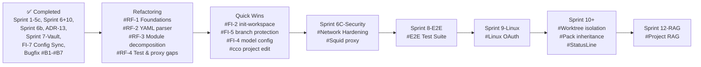

# Roadmap

> Tracks planned features, improvements, and known issues for future iterations.
> Last updated: 2026-03-19 (Added FI-8 PromptSubmit hook + global defaults review).
>
> **Note**: Sprint entries are historical. Path references (e.g., `.cco-meta`, `.cco-source`) in older
> sprints reflect the layout at the time of writing. See Sprint 8 and the `.cco/` consolidation
> design doc for current paths.

---

## Quick Reference

| Status | Items | Section |
|--------|-------|---------|
| ✅ Completed | 19 sprints / features | [→ Completed](#completed) |
| 🐛 Known Bugs | 2 open · 6 fixed | [→ Known Bugs](#known-bugs) |
| 🔜 Planned | Refactoring RF-1→4, Quick Wins, Sprint 6C → 12 | [→ Planned Sprints](#planned-sprints) |
| 🔭 Exploratory | 8 ideas | [→ Long-term / Exploratory](#long-term--exploratory) |
| ❌ Declined | 3 items | [→ Declined / Won't Do](#declined--wont-do) |

---

## Sprint Roadmap

Features are prioritized by impact for third-party users adopting claude-orchestrator.

### Prioritization Notes (updated 2026-03-18)

**Immediate priority**: Codebase refactoring. The comprehensive review (2026-03-18)
identified concrete maintainability improvements across all modules. Addressing these
before adding new features reduces future development cost and regression risk.
The refactoring is split in 4 phases with increasing effort.

**Next**: FI-2 and FI-5 (remaining) are low-effort, high-benefit quick wins that improve
daily usability.

**Then**: Security (Sprint 6C), E2E testing (Sprint 8), Linux OAuth (Sprint 9) are
required for open-source readiness but independent of the refactoring work.

**Later**: Worktree isolation (Sprint 10), pack inheritance (#9), RAG (Sprint 12) are
valuable but not blocking.

| Category | Items | Effort | Benefit |
|----------|-------|--------|---------|
| **Refactoring (priority 1)** | RF-1 to RF-4: utilities, YAML parser, module decomposition, test+proxy gaps | Low → High | Maintainability, testability, reduced duplication |
| **Quick wins (priority 2)** | FI-2 init-workspace, FI-5 remaining (branch protection docs + template ref) | Low | Immediate UX improvement |
| **Security (priority 3)** | Sprint 6C network hardening | Medium-High | Required for production/open-source |
| **Quality (priority 4)** | Sprint 8 E2E tests | Medium | Prerequisite for Linux onboarding |
| **Onboarding (priority 5)** | Sprint 9 Linux OAuth | Medium | Pre-open-source requirement |
| **Architecture (priority 6)** | Sprint 10 worktree, #9 pack inheritance, FI-4 model config | Medium | Valuable but not blocking |
| **Exploratory** | Sprint 12 RAG, hot-reload, notifications, remote sessions, web UI | High | Long-term, evaluate demand |



---

## Planned Sprints

### Bugfix Sprint — #B5, #B6, #B7 ✓

Correzione di tre bug identificati il 2026-03-16 nel sistema di update e vault. Tutti risolti il 2026-03-16.

#### #B5 Changelog markers a 0 su first install ✓ FIXED

**Fixed in**: commit `5f57d60`.

`cco init` inizializzava `last_seen_changelog` e `last_read_changelog` a `0`. Ora inizializzati a `_latest_changelog_id()`.

#### #B6 Nessun vault sync prompt prima delle migrazioni ✓ FIXED

**Fixed in**: commit `10c7ea6`.

Vault sync prompt aggiunto prima di `_run_migrations()` in `_update_global()`, condizionato a: vault inizializzato AND migrazioni pendenti > 0. Evita doppio prompt in `--sync` mode.

#### #B7 Errori di migrazione potenzialmente silenziosi ✓ FIXED

**Fixed in**: commit `5627ce4`.

Tutti i chiamanti di `_run_migrations()` ora controllano il codice di ritorno. `cmd-update.sh` traccia errori per progetto e mostra un summary. Errori propagati con messaggi chiari e istruzioni per ri-tentare.

---

### Sprint 5c-Lifecycle — Resource Lifecycle, Policies & Tutorial Separation

Risolve problemi identificati il 2026-03-16: il sistema di update non rileva modifiche
al CLAUDE.md dei project (policy `user-owned` errata), il tutorial serve due scopi
incompatibili (educazione vs editing config), e manca una strategia unificata per il
lifecycle delle risorse (defaults, templates, publish/install).

**Status**: Implemented (2026-03-17). All 4 phases complete.
**Analysis**: [`docs/maintainer/configuration/resource-lifecycle/analysis.md`](../configuration/resource-lifecycle/analysis.md)

#### Problemi identificati

1. **Project CLAUDE.md invisible agli update**: `PROJECT_FILE_POLICIES` marca
   `.claude/CLAUDE.md` come `user-owned` → nessuna notifica di aggiornamenti
   dal template. Il 75% delle modifiche al tutorial erano invisibili a `cco update`.
2. **Policy `user-owned` troppo aggressiva**: silenzia completamente gli update,
   corretto per file 100% utente (project.yml, secrets.env) ma sbagliato per file
   dove il framework fornisce contenuto evolutivo.
3. **Tutorial = due use case incompatibili**: contenuto educativo (deve essere sempre
   aggiornato) + editor di configurazione (deve essere personalizzabile dall'utente).
4. **Nessun meccanismo di update per publish/install**: FI-7 è in roadmap ma le
   fondamenta (policy, lifecycle model) non erano definite.

#### Task di implementazione

**Phase 1: Bug fix — File policy (priorità immediata)**

| # | Task | Ref |
|---|------|-----|
| 1a | Rename `user-owned` → `untracked` in `lib/update.sh` e variabili derivate | analysis §3.2 |
| 1b | Cambiare `.claude/CLAUDE.md` da `untracked` a `tracked` in `PROJECT_FILE_POLICIES` | analysis §3.4, §7.2 |
| 1c | Verificare che `.cco/base/CLAUDE.md` sia popolato alla creazione del project | analysis §8.1 |
| 1d | Aggiungere opzione **(N)ew-file** a `_interactive_sync()` — salva versione framework come `.new` accanto al file utente | analysis §3.3 |

**Phase 2: Tutorial separation**

| # | Task | Ref |
|---|------|-----|
| 2a | Creare directory `internal/tutorial/` e spostare contenuti da `templates/project/tutorial/` | analysis §4.2 |
| 2b | Aggiornare `cco start` per riconoscere `tutorial` come nome riservato e lanciare da `internal/tutorial/` | analysis §4.2, tutorial design §7 |
| 2c | Gestire session state del tutorial (transcripts) in `user-config/.cco/tutorial-state/` o simile | analysis §10 Q4 |
| 2d | Rimuovere creazione tutorial da `cco init` (era in `cmd-init.sh`) | tutorial design §7 (superseded) |
| 2e | Aggiornare `cco project list` per escludere tutorial | analysis §4.2 |
| 2f | Migration informativa per utenti con `user-config/projects/tutorial/` esistente | analysis §4.4 |

**Phase 3: Config-editor template**

| # | Task | Ref |
|---|------|-----|
| 3a | Creare template `templates/project/config-editor/` con `user-config` come repo (non extra mount) | analysis §4.3 |
| 3b | CLAUDE.md con istruzioni su vault, publish/install, safety rules | analysis §4.3 |
| 3c | Skills: `/setup-project`, `/setup-pack` (migrate da tutorial) | tutorial design §5.2, §5.3 |
| 3d | Rules per config editing (backup, validazione, gestione vault) | analysis §4.3 |
| 3e | Aggiungere template a `cco template list` | — |

**Phase 4: Documentazione**

| # | Task | Ref |
|---|------|-----|
| 4a | Riscrivere `update-system/design.md` con nuova tassonomia (eliminare annotazioni old/new) | analysis §3 |
| 4b | Riscrivere `tutorial/design.md` per riflettere modello internal (eliminare annotazioni old/new) | analysis §4.2 |
| 4c | Aggiornare `reference/cli.md` con `cco start tutorial` e nuovo comportamento | — |
| 4d | Aggiornare `getting-started/first-project.md` con riferimento al tutorial built-in | — |

#### Decisioni prese in questa sessione

1. **Tutorial diventa internal** (Opzione D): non è un template, vive in `internal/tutorial/`,
   `cco start tutorial` lo lancia direttamente. Non installato in user-config, non appare in
   `cco project list`, sempre aggiornato.
2. **`internal/` è la directory corretta**: `defaults/` ha semantica diversa (global = copiato
   su init, managed = baked in Docker). Tutorial non è nessuna delle due.
3. **Config-editor è un template separato**: monta `user-config` come repo (non extra mount ro),
   include istruzioni su vault/publish/install, è user-owned con policy standard.
4. **`user-owned` → `untracked`**: rename per chiarezza semantica.
5. **Project CLAUDE.md → tracked**: il template fornisce struttura, il 3-way merge preserva
   il contenuto utente.
6. **Skip + .new**: nuova opzione sync per file ristrutturati dall'utente, alternativa a merge.
7. **cco-develop usa publish/install**: non è un progetto internal come tutorial. Dimostra che
   il Config Repo model funziona per team reali. Implementazione separata, dopo FI-7.
8. **FI-7 beneficia di questo lavoro**: le fondamenta (policy, lifecycle model, `.cco/source`,
   3-way merge engine) sono ora definite e documentate.

#### Documenti di riferimento per l'implementazione

| Documento | Ruolo |
|-----------|-------|
| `docs/maintainer/configuration/resource-lifecycle/analysis.md` | **Primario**: decisioni, policy, architettura, task list |
| `docs/maintainer/internal/tutorial/design.md` §4-§6 | Contenuto dei file tutorial (CLAUDE.md, skills, rules) — ancora valido |
| `docs/maintainer/configuration/update-system/design.md` | Contesto: come funziona il sistema di update (con note di amendment 2026-03-16) |
| `lib/update.sh` linee 25-75 | Codice: file policies attuali da modificare |
| `lib/update.sh` `_interactive_sync()` | Codice: dove aggiungere opzione Skip+.new |

**Effort**: Medium. Phase 1 è low-effort (bugfix). Phase 2-3 sono medium. Phase 4 è follow-up.

---

### Sprint 6-Security — Sandbox & Network Hardening

Elevato a priorità alta. Tre componenti di sicurezza: Docker socket proxy con filtro granulare, restrizioni mount per sibling container, e controllo dell'accesso internet. Include bugfix al default di `mount_socket`.

**Status**: Phase A & B implemented. Phase C pending.
**Docs**: [analysis](../integration/docker-security/analysis.md) | [design](../integration/docker-security/design.md)

#### Phase A: `mount_socket` Safe Default → `false` (bugfix)

Change default from `true` to `false` in `cmd-start.sh:111`. Migration adds explicit `mount_socket: true` to existing projects. Breaking change — projects relying on implicit socket access must declare it.

#### Phase B: Docker Socket Proxy (Go binary)

Custom Go HTTP proxy (`cco-docker-proxy`) between Claude and Docker socket. Filters requests by:
- **Container policy**: `project_only` (default) / `allowlist` / `denylist` / `unrestricted` — per name prefix and label
- **Mount restrictions**: `none` / `project_only` (default) / `allowlist` / `any` — with implicit deny for sensitive paths
- **Security constraints**: block `--privileged`, drop capabilities, resource limits, max container count
- **Network filtering**: restrict container network membership to project networks

Architecture: proxy listens on `/var/run/docker-proxy.sock`, forwards to real socket. Claude's `DOCKER_HOST` points to proxy. Proxy runs as root (socket access), Claude runs as unprivileged user.

#### Phase C: Network Hardening (Squid sidecar)

Layered defense for internet access control:
- **Layer 1**: Claude Code deny rules (`WebFetch`, `WebSearch`, `curl`, `wget`) for restricted/none modes
- **Layer 2**: Docker network `internal: true` + Squid proxy sidecar with SNI-based domain filtering

Configuration: `network.internet: full | restricted | none` with `allowed_domains` / `blocked_domains`. Squid sidecar bridges internal (project) and external (internet) networks. Created containers inherit the same restriction or can be overridden.

---

---

### Sprint 8-E2E — E2E Integration Test Suite

Anticipato rispetto alla pianificazione originale (era Sprint 9). La suite dry-run copre 482 test ma non verifica il comportamento reale del container. E2E è prerequisito per garantire la qualità prima di Sprint 9-Linux (onboarding di nuovi utenti su Linux).

#### #E2E Integration Test Suite

**Obiettivo**: testare il comportamento reale del container, non solo la generazione dei file di configurazione.

**Scope**:
- Entrypoint: socket GID resolution, MCP merge (`~/.claude/mcp.json` risultante), gosu, tmux session
- Mount verification: repos presenti in `/workspace/`, `~/.claude/` montato correttamente, env var `CCO_*` presenti
- Socket: presente se `mount_socket: true`, assente se `false`
- Auth flow: credenziali copiate correttamente nel container
- Setup.sh: script eseguito come `claude` (non root)
- `cco stop`: container terminato correttamente

**Architettura**:
- Test runner separato (`bin/test-e2e`) che richiede Docker disponibile
- Override dell'entrypoint con script di verifica interna (`tests/e2e/fixtures/verify-entrypoint.sh`) — no Claude interattivo
- Fixture in `tests/e2e/fixtures/`: project.yml minimali, repo Git minimali per test di mount
- CI: opzionale (richiede Docker), documentato come "local-first"
- Non sostituisce la suite bash dry-run — la complementa

---

### Sprint 9-Linux — Linux OAuth Support

**Priorità**: alta, richiesta pre-open-source. Attualmente l'autenticazione OAuth funziona solo su macOS via Keychain. Su Linux l'unica opzione è API key via env var.

#### #L Linux OAuth Alternative

**Contesto**: il flusso OAuth attuale legge le credenziali da macOS Keychain (`security find-generic-password`) e le copia in `~/.claude/.credentials.json`. Su Linux non esiste Keychain.

**Obiettivi**:
- Supportare il flusso OAuth su Linux senza dipendenze esterne (no gnome-keyring, no KDE Wallet)
- Mantenere backward compatibility su macOS
- Sicurezza: credenziali mai in plain text su disco senza protezione adeguata

**Approcci da valutare**:
- **`credentials.json` pre-generato**: l'utente ottiene il token OAuth da un browser su macOS o via `claude auth` standalone, poi lo copia manualmente. `cco init` su Linux skippa il seeding e avverte l'utente.
- **`secret-tool` (Linux keyring)**: alternativa a `security` su sistemi con `libsecret` (GNOME). Non universale (non disponibile su tutti i distro/headless).
- **`pass` (password-store)**: gestore password basato su GPG, disponibile su qualsiasi Linux. Richiede setup GPG.
- **Encrypted file**: credenziali cifrate con una passphrase (derivata da machine ID o inserita dall'utente). Simile al macOS Keychain ma implementato localmente.
- **`CLAUDE_API_KEY` come default su Linux**: se no Keychain detected, default `auth.method: api_key` con prompt guidato.

**Scope**:
- Rilevamento automatico del sistema (macOS vs Linux)
- Implementazione del metodo Linux scelto in `lib/cmd-auth.sh` (o equivalente)
- Documentazione: authentication.md aggiornato con sezione Linux
- Test: coverage per entrambi i path (macOS Keychain + Linux alternative)

---

### Sprint 10-Isolation — Git Worktree

#### #6 Git Worktree Isolation

Opt-in git isolation for container sessions. When enabled, repos are mounted at `/git-repos/` and the entrypoint creates worktrees at `/workspace/` on a dedicated branch (`cco/<project>`). Claude works in the worktrees transparently.

**Why here**: Auth is now implemented, enabling the full PR/merge workflow that makes worktree isolation valuable.

**Activation**: `cco start <project> --worktree` or `worktree: true` in `project.yml`.

**Key design points**:
- Worktrees created inside the container (consistent paths, no `.git` file rewriting)
- Commits persist in host repo via bind-mounted object store
- Post-session cleanup integrated in `cmd_start()` (no `cco stop` needed)
- Multiple merge/PR cycles during a single session via standard `gh pr create`
- Branch `cco/<project>` persists across sessions; next `--worktree` start reuses it

**Docs**: [analysis](../integration/worktree/analysis.md) | [design](../integration/worktree/design.md) | [ADR-10](../architecture/architecture.md)

---

### FI-7 — Publish-Install Sync and Resource Versioning

**Priority**: 1 (immediate). Completes the user-config lifecycle — the framework's core value proposition.

**Status**: Implemented.

**Context**: The resource-lifecycle analysis (Sprint 5c) established file policies, the
lifecycle model, and `.cco/source` tracking. FI-7 builds on these foundations to add
the missing piece: update notification and merge for published/installed resources.

**Key design decisions** (see analysis and design docs for full rationale):

1. **Unified discovery, separated actions** — `cco update` is the single entry point
   for "what's new?" (framework + remotes + changelog). Actions are type-specific:
   `--sync` for framework files, `cco project update` for publisher updates,
   `cco pack update` for pack updates.

2. **Source-aware framework sync** — for installed projects, `cco update --sync`
   applies migrations but skips opinionated files (managed by publisher chain).
   `--local` flag as escape hatch to apply framework defaults directly.

3. **Update chain**: Framework → Publisher → Consumer. The publisher integrates
   framework improvements and publishes curated versions. Consumer receives via
   `cco project update` with 3-way merge preserving local customizations.

4. **Publish safety pipeline** — migration check (blocking), framework alignment
   (warning), secret scan (blocking), `.cco/publish-ignore`, diff review,
   per-file confirmation.

5. **Project internalize** — `cco project internalize <name>` disconnects from
   remote, converting to local project. Analogous to `cco pack internalize`.

**New commands**:
- `cco project update <name> [--force] [--dry-run]` / `--all`
- `cco project internalize <name>`
- `cco update [--offline] [--no-cache]` (new flags)
- `cco update --sync <project> [--local]` (new flag)
- `cco project publish <name> <remote> [--yes]` (enhanced)

**Docs**: [analysis](../configuration/sharing/publish-install-sync-analysis.md) | [design](../configuration/sharing/publish-install-sync-design.md) | [user guide](../../user-guides/config-lifecycle.md) | [FI-7](framework-improvements.md#fi-7-publish-install-sync-and-resource-versioning) | [resource-lifecycle analysis](../configuration/resource-lifecycle/analysis.md)
**Completed**: 2026-03-17 (all 6 phases).

---

### Refactoring — RF-1, RF-2, RF-3, RF-4

**Priority**: 1 (immediately). Improves maintainability before adding new features.

**Origin**: [Comprehensive review 2026-03-18](reviews/18-03-2026-comprehensive-review.md) — full codebase analysis covering architecture, code quality, tests, documentation, proxy, and configuration.

#### RF-1: Foundations (Quick Wins) ✓

**Completed**: 2026-03-18. Branch: `refactor/rf-1/foundations`.

| Item | Status | Details |
|------|--------|---------|
| `_sed_i()`, `_sed_i_raw()` helpers | ✅ | Centralized in `lib/utils.sh`; ~20 inline `sed -i` patterns replaced across 4 modules |
| `_substitute()` helper | ✅ | awk-based (avoids delimiter conflicts with `/` or `\|` in values); replaces `{{PLACEHOLDER}}` patterns |
| `_sed_i_or_append()` helper | ✅ | Moved from `lib/update.sh` to `lib/utils.sh`; used by `cmd-pack.sh` |
| `_cco_resolve_path()` | ✅ | Collapses 11 identical new→old path fallback functions in `lib/paths.sh` |
| Error checks | ✅ | `\|\| die` on `mkdir`/`cp` in `cmd-init.sh`, `cmd-new.sh` |
| Exit traps | ✅ | Cleanup trap for temp dir in `cmd-new.sh` |
| `lib/constants.sh` | Deferred | Low value relative to effort; magic strings are few and localized |

**Result**: 96 lines added, 134 removed (net -38 lines). 801/806 tests pass (5 pre-existing failures).

#### RF-2: YAML Parser Consolidation ✓

**Completed**: 2026-03-18. Branch: `refactor/rf-2/yaml-parser-consolidation`.

Replaced 6 near-identical awk getter functions with a single `_yml_query(file, key_path, mode)` engine that auto-detects depth (1-4 levels) and extraction mode (scalar/list/map). The 6 public functions (`yml_get`, `yml_get_list`, `yml_get_deep`, `yml_get_deep_list`, `yml_get_deep_map`, `yml_get_deep4`) become one-liner wrappers. Specialized parsers (repos, ports, env, extra_mounts, packs, pack_*) unchanged.

**Result**: 200 lines removed, 111 added (net -90 lines). 46/46 YAML parser tests pass.

#### RF-3: Module Decomposition ✓

**Completed**: 2026-03-18. Branch: `refactor/rf-3/module-decomposition`.

| Module | Before | After | Result |
|--------|--------|-------|--------|
| `update.sh` (2,344 LOC, 37 fn) | God module: merge, discovery, migration, changelog, sync, remote | 8 files: `update-hash-io.sh`, `update-merge.sh`, `update-meta.sh`, `update-discovery.sh`, `update-sync.sh`, `update-changelog.sh`, `update-remote.sh` + coordinator | Split by responsibility |
| `cmd-project.sh` (1,899 LOC, 20 fn) | Monolithic with 9 subcommands | 6 files: `cmd-project-create.sh`, `cmd-project-query.sh`, `cmd-project-install.sh`, `cmd-project-pack-ops.sh`, `cmd-project-publish.sh`, `cmd-project-update.sh` | Split by subcommand family |
| `cmd-start.sh` (1,063 LOC) | Monolithic cmd_start() (~687 lines) | 9 focused helpers: `_start_resolve_project`, `_start_load_config`, `_start_check_health`, `_start_prepare_state`, `_start_generate_integrations`, `_start_generate_compose`, `_start_generate_metadata`, `_start_show_summary`, `_start_launch` | Internal decomposition, single file |

**Result**: 5,306 LOC decomposed. 802/807 tests pass (5 pre-existing).

#### RF-4: Test & Proxy Gaps ✓

**Completed**: 2026-03-18. Branch: `refactor/rf-4/test-proxy-gaps`.

**Proxy (Go)** — 27 new tests:
- ✅ `cache_test.go` (13 tests): Refresh, Resolve by ID/shortID/name, Add/Remove, stale updates
- ✅ `proxy_test.go` (14 tests): create allowed/denied, label/readonly injection, container ops, list filtering, always-allowed paths, privileged denied, max containers, sensitive mounts
- ✅ Fixed 2 ignored errors (filepath.Match in containers.go, json.Marshal in proxy.go)
- Deferred: network filter extraction (low priority, inline implementation is functional)

**Tests (bash)** — 20 new tests:
- ✅ Error message validation (7 tests): project create + pack create negative cases
- ✅ secrets.sh coverage (9 tests): KEY=VALUE loading, comments, malformed lines, quotes, special chars
- ✅ workspace.sh coverage (4 tests): repo generation, description seeding, idempotency

**Result**: Go proxy from 89 → 116 tests. Bash from 802 → 822 tests. Total +47 tests.

**Bug found**: workspace.sh description preservation across sessions is broken (pre-existing, file redirect truncates before awk reads). Tracked separately.

---

### Quick Wins — FI-2, FI-5, FI-4, #10

**Priority**: 2 (after refactoring). Low effort, high benefit.

#### FI-2 `/init-workspace` empty workspace handling

When no repos and no `workspace.yml` descriptions exist, the skill should ask the user for a brief project description before generating a nearly empty CLAUDE.md. Discovery-based flow unchanged when repos are present.

**Ref**: [FI-2](framework-improvements.md#fi-2-init-workspace-on-empty-projects)
**Effort**: Low.

#### FI-5 remaining: branch protection docs + template reference

GitHub branch protection configuration for mechanical enforcement of human review.
Update base project template to reference the development-workflow and configuring-rules guides.

**Ref**: [FI-5](framework-improvements.md#fi-5-human-workflow-guide-and-review-best-practices)
**Effort**: Low.

#### FI-4 Per-project model configuration

Add `model:` field to `project.yml`, passed to `claude --model` at launch.

**Ref**: [FI-4](framework-improvements.md#fi-4-per-project-llm-model-configuration)
**Effort**: Medium-Low.

#### #10 `cco project edit <name>` command

Open project.yml in `$EDITOR` and regenerate docker-compose.yml after save.

**Effort**: Low.

---

### Sprint 6C-Security — Network Hardening

**Priority**: 3 (security, required for open-source).

**Status**: Phase A (mount_socket default) + Phase B (Docker socket proxy) implemented. Phase C pending.

#### Phase C: Network Hardening (Squid sidecar)

Layered defense for internet access control:
- **Layer 1**: Claude Code deny rules (`WebFetch`, `WebSearch`, `curl`, `wget`) for restricted/none modes
- **Layer 2**: Docker network `internal: true` + Squid proxy sidecar with SNI-based domain filtering

Configuration: `network.internet: full | restricted | none` with `allowed_domains` / `blocked_domains`. Squid sidecar bridges internal (project) and external (internet) networks. Created containers inherit the same restriction or can be overridden.

**Docs**: [analysis](../integration/docker-security/analysis.md) | [design](../integration/docker-security/design.md)
**Effort**: Medium-High.

---

### Sprint 11-Ecosystem — Pack, Polish & Automation

**Priority**: 3-4 (after security). Previously included FI-7 and quick wins — those are
now elevated to their own priority levels above.

**Remaining items**:

#### FI-1 ✅ Implemented

#### FI-3 ✅ Implemented

#### FI-6 ✅ Implemented

#### #9 Pack Inheritance / Composition

Allow packs to extend other packs:
```yaml
extends: base-client
files:
  - additional-doc.md
```

> Note: `cco pack create` (and the full pack CLI) was implemented in Sprint 6+10. Only inheritance/composition remains.

**Effort**: Medium.

---

#### #10b Status bar improvements

Improve the StatusLine hook (`config/hooks/statusline.sh`) for better usability.

**Issues**:
1. **Cost display not useful for Max subscribers**: the `$cost` field shows cumulative USD spend, which is meaningless for users on Claude Max (flat-rate subscription). They would rather see remaining session/conversation budget as a percentage.
2. **Context % stale after /compact**: the `ctx` percentage does not update immediately after `/compact` or other context-reducing events — it takes an additional prompt before the value refreshes. This is likely a Claude Code limitation in how frequently it calls the StatusLine hook, but we should investigate workarounds.

**Proposed changes**:
- Detect subscription type from session data and show remaining session % instead of cost for Max users (requires investigation of available fields in StatusLine JSON input)
- Investigate whether `Notification` or `Stop` hook events can trigger a StatusLine refresh to fix stale context %
- If Claude Code does not expose subscription/session data, document the limitation and request the feature upstream
- Add configurable status bar format (e.g., `statusline.format` in global settings) so users can customize what is shown

---

### Sprint 12-RAG — Project RAG

Integrated semantic search over project knowledge, providing Claude with relevant context from large codebases and documentation without consuming the full context window.

#### #13 Default RAG MCP Integration

Provide a built-in, opt-in RAG system that indexes project files and serves relevant context to Claude via MCP. Users can already add any RAG MCP server manually (via `mcp-packages.txt` or `mcp.json`), but a default integration adds significant value:
- Lowers the barrier (no research/configuration needed)
- Tested, integrated out-of-the-box experience
- Differentiator for claude-orchestrator adoption
- User can override with their own preferred MCP server

**Activation** (same pattern as browser):
```yaml
# project.yml
rag:
  enabled: false          # true to activate project RAG
  provider: local-rag     # default provider (can be overridden)
  paths: []               # directories to index (default: all repos)
  exclude: []             # glob patterns to exclude from indexing
```

**Provider options evaluated**:

| Provider | Storage | Local | API cost | Code-specific | Complexity |
|---|---|---|---|---|---|
| **mcp-local-rag** (LanceDB) | File-based | 100% | None | No | Low |
| **Qdrant MCP** (official) | Qdrant | Yes | None (FastEmbed) | No | Medium |
| **RagCode MCP** (Qdrant+Ollama) | Qdrant+Ollama | 100% | None | Yes (AST) | High (~8GB) |
| claude-context (Zilliz) | Zilliz Cloud | No | OpenAI | Yes | Medium |

**Recommended default provider**: `mcp-local-rag` — zero external dependencies, file-based LanceDB (no server process), ~90MB embedding model download, single `npx` command. Good balance of simplicity and capability.

**Alternative for power users**: Qdrant MCP with FastEmbed for local embedding — more capable but requires Qdrant instance (can run as sibling container via docker compose).

**Key design points**:
- Auto-generate RAG MCP config at `cco start` (same pattern as `.managed/browser.json` → `.managed/rag.json`)
- Index on first session start; incremental updates on subsequent starts
- Provider-agnostic: `rag.provider` selects which MCP server to configure; custom providers supported
- Respect `.gitignore` and `rag.exclude` patterns
- Indexing runs in background (non-blocking session start)
- Storage in `projects/<name>/rag-data/` (gitignored, persistent across sessions)

**Scope**:
- `project.yml` schema extension (`rag:` section)
- RAG MCP generation in `cmd-start.sh` (parallel to browser MCP)
- Entrypoint merge support (third merge source after global + browser)
- Migration for existing projects
- Documentation and user guide
- Test coverage for RAG enable/disable/provider switching

**Open questions**:
- Should indexing happen at `cco start` time (host-side) or inside the container (entrypoint)?
- Should we support a `cco rag reindex` command for manual re-indexing?
- For Qdrant provider: auto-start Qdrant as sibling container, or require user to manage it?
- Should the index be shared across projects that mount the same repos?

---

## Known Bugs

### #B8 `~/.claude/settings.json` montato read-only — Claude Code non può salvare impostazioni runtime ✓ FIXED

**Reported**: 2026-03-17. **Fixed**: 2026-03-19.

**Symptom**: `/effort high` fallisce con `EROFS: read-only file system`.

**Fix**: Removed `:ro` from `settings.json` mount in `lib/cmd-start.sh`. Other global
files (CLAUDE.md, rules/, agents/, skills/) remain `:ro` as intended — Claude Code
does not write to them. Only `settings.json` needs write access for runtime preferences
(effort level, thinking mode, etc.).

---

### #B4 `cco update --all` does not correctly update files from `defaults/` ✓ RESOLVED BY DESIGN

**Reported**: 2026-03-13 (field testing).
**Resolved**: 2026-03-14 (design revision).

**Original symptom**: `cco update --all` did not propagate changes to `project.yml` or root-level files.

**Resolution**: The post-Sprint-5b design revision resolves this by reclassifying `project.yml` as **user-owned** (not tracked). New `project.yml` fields are **additive** — code handles missing fields with sensible defaults. Schema-breaking changes use **explicit migrations**. There is no longer a need for automatic `project.yml` merge — the user adds new fields when they need the feature, reading the documentation.

The broader `cco update` redesign (migrations + discovery, no automatic file changes) also addresses the root cause: the update system no longer attempts silent file modifications that could miss files or produce unexpected results.

**See also**: `analysis.md` section 4.4, `design.md` section 3.3.

---

### #B2 Claude Code native installer — migration deferred

The `Dockerfile` uses `npm install -g @anthropic-ai/claude-code` which is deprecated upstream in favor of a native installer. The native installer was not adopted because it exhibited bot-detection blocks when downloading from container/CI environments.

**Status**: No action needed now. npm install still works and no removal timeline is known. Revisit when Anthropic announces a deprecation date or ships a CI-friendly native installer.

**Tracked**: add to a future maintenance sprint once the upstream situation is clearer.

---

### #B5 Changelog markers inizializzati a 0 su first install ✓ FIXED

**Reported**: 2026-03-16. **Fixed**: 2026-03-16.

`cco init` impostava `last_seen_changelog: 0` e `last_read_changelog: 0`. Al primo `cco update` tutte le entry del changelog apparivano come nuove. Fix: entrambi i marker inizializzati a `_latest_changelog_id()`.

---

### #B6 Nessun vault sync prima delle migrazioni in `cco update` ✓ FIXED

**Reported**: 2026-03-16. **Fixed**: 2026-03-16.

`cco update` eseguiva migrazioni senza offrire vault snapshot. Il prompt vault sync era solo in `--sync` (ex `--apply`) mode. Fix: prompt aggiunto prima di `_run_migrations()`, condizionato a vault inizializzato AND migrazioni pendenti. Evita doppio prompt in `--sync`.

---

### #B7 Errori di migrazione potenzialmente silenziosi ✓ FIXED

**Reported**: 2026-03-16. **Fixed**: 2026-03-16.

Tutti i chiamanti di `_run_migrations()` ignoravano il codice di ritorno. Una migrazione fallita poteva passare inosservata. Fix: return code controllato in `_update_global`, `_update_project`, `cmd_init`. Summary errori per progetto in `cmd-update.sh`.

---

### #B3 Global `setup.sh` (build-time) not effective at runtime ✓ FIXED

**Fixed in**: `fix/setup/dual-phase-global`

**Root cause**: `global/setup.sh` ran only at build time (Dockerfile). User-level config (dotfiles, tmux keybindings) written during build was overwritten by Docker volume mounts at runtime. The `claude` user didn't exist yet at build time either.

**Fix — Dual-phase setup**: Split global setup into two scripts:
- `user-config/global/setup-build.sh` — heavy installs (apt packages, compilers). Runs at Docker build time as root.
- `user-config/global/setup.sh` — lightweight runtime config (dotfiles, aliases, tmux). Runs at every `cco start` as user `claude`, before project setup.

Migration `005_split_global_setup.sh` renames existing `setup.sh` → `setup-build.sh` for users with build-time content.

---

### #B1 Browser MCP loaded when `browser.enabled: false` ✓ FIXED

**Fixed in**: `refactor/managed-integrations/convention`

**Root causes fixed**:

1. **Stale files on host**: `cmd-start.sh` now explicitly `rm -f .managed/browser.json .managed/.browser-port` when `browser_enabled != "true"`. Files moved to `.managed/` (gitignored).

2. **Additive-only MCP merge**: `entrypoint.sh` now resets `mcpServers = {}` before each session, then re-merges from source files. The entrypoint uses a generic loop over `/workspace/.managed/*.json` — only present when browser is enabled, so disabling browser removes it cleanly.

3. **`.managed/` gitignored**: migration 003 adds `.managed/` to each project's `.gitignore`.

---

## Completed

### Multi-PC Config Sync & Memory Policy (Sprint 7-Vault) ✓

Vault profiles with branch-based isolation for multi-PC scenarios, memory separation from claude-state, and managed memory policy.

**What was implemented**:
- Vault profiles (`cco vault profile create|list|show|switch|rename|delete`): git branch per profile with `.vault-profile` tracking file
- Selective sync: `vault sync/push/pull` operate on profile-scoped paths only (shared resources auto-synced to/from `main`)
- Interactive conflict resolution (L/R/M/D) for shared resource conflicts using `git merge-file`
- Resource movement: `vault profile move project|pack --to <profile|main>`, `vault profile add|remove` shortcuts
- Memory separation: `memory/` moved from `claude-state/memory/` to standalone dir with Docker child bind mount
- Memory policy: managed rule (`defaults/managed/.claude/rules/memory-policy.md`) defining when to use memory vs project docs
- Migration 008: automatic memory separation for existing projects
- Backward compatible: vaults without profiles work unchanged (single branch on `main`)
- Test coverage: 44 new profile tests + existing vault tests updated (698 total, 0 failures)

**Docs**: [analysis](../configuration/vault/analysis.md) | [design](../configuration/vault/design.md)

---

### Defaults Restructuring & Template System (Sprint 5b) ✓

Refactoring of `defaults/` layout, full template system with CLI management, and update engine with migration runner and `.cco-base/` storage.

**What was implemented**:
- `defaults/` reorganized: `managed/`, `global/`, separated from `templates/` (project and pack blueprints)
- `cco project create --template <name>` — template resolution (user templates take priority over native)
- `cco template list|show|create|remove` — full template lifecycle CLI (`lib/cmd-template.sh`, 339 lines)
- `cco template create <name> --from <resource>` — create templates from existing projects/packs
- Update engine (`lib/update.sh`): `.cco-base/` storage, declarative file policies, `git merge-file` for on-demand merge, automatic `.bak` backups
- `cco clean [--all|--project|--dry-run]` — cleanup `.bak` files from updates (`lib/cmd-clean.sh`)
- Migration 007: retroactive `.cco-base/` bootstrap for pre-Sprint-5b installations
- Template variable substitution (`{{VAR}}`) for project and pack templates

**Post-sprint update system redesign** (2026-03-14, implemented):
- `cco update` redesigned: migrations + discovery only (no automatic file changes)
- New CLI modes: `--diff` (inspection), `--sync` (interactive merge with A/M/R/K/S/D prompts), `--news` (changelog)
- `--force`, `--keep`, `--replace` as non-interactive sync modes
- Non-TTY fallback: `--sync` defaults to (S)kip
- Discovery algorithm: 7 status codes (NEW, UPDATE_AVAILABLE, MERGE_AVAILABLE, USER_MODIFIED, NO_UPDATE, REMOVED, BASE_MISSING)
- Template source resolution via `.cco-source` (native, user, remote, fallback to base)
- `cco project create` bootstraps `.cco-meta`, `.cco-base/`, `.cco-source`
- `changelog.yml` + `last_seen_changelog` tracking for additive change notifications
- `cco clean` extended: `--tmp` (dry-run artifacts), `--generated` (docker-compose.yml), `--all`
- Vault I/O redirect fix: `/dev/tty` redirection with non-fatal fallback

**Docs**: [analysis](../configuration/update-system/analysis.md) | [design](../configuration/update-system/design.md)

---

### Interactive Tutorial Project (Sprint 5 + 5c) ✓

Built-in interactive tutorial. Users launch it with `cco start tutorial` for AI-guided onboarding. Since Sprint 5c, the tutorial is an internal framework resource at `internal/tutorial/` (no longer installed in user-config).

**What was implemented (Sprint 5)**:
- Tutorial content: CLAUDE.md with 14-module curriculum, documentation map, and session flow
- 3 skills: `/tutorial` (guided onboarding), `/setup-project` (project creation wizard), `/setup-pack` (pack creation wizard)
- `tutorial-behavior.md` rule: teacher-not-executor constraints, cco-is-host-only awareness
- Structured agentic development guide (`docs/user-guides/structured-agentic-development.md`)
- Default rules aligned with guide; tutorial discovery in user docs

**Sprint 5c changes** (resource lifecycle redesign):
- Tutorial moved to `internal/tutorial/` — always current, no update tracking needed
- `cco start tutorial` launches from internal source (reserved name)
- Config editing use case separated into `config-editor` template
- Migration 010 handles legacy `user-config/projects/tutorial/`
- See Sprint 5c-Lifecycle section for full details

**Docs**: [analysis](../internal/tutorial/analysis.md) | [design](../internal/tutorial/design.md)

---

### Browser MCP Integration (Sprint 4) ✓

Required for frontend testing and debugging. Requires stable scope hierarchy (Sprint 3) for proper MCP configuration placement.

**What was implemented**:
- `browser.enabled` / `browser.mode: host` in `project.yml` + `--chrome` flag override
- `chrome-devtools-mcp` pre-installed in Docker image
- Auto-generated `browser-mcp.json` with privacy flags (`--no-usage-statistics`, `--no-performance-crux`)
- Third MCP merge source in `entrypoint.sh`
- CDP port conflict resolution with auto-assignment and `.browser-port` runtime file
- `cco chrome [start|stop|status]` host-side helper with `--project` port resolution
- `extra_hosts: host.docker.internal:host-gateway` for Linux compatibility
- Support for custom `mcp_args` via `yml_get_list`
- 18 new tests (12 dry-run + 6 chrome command)

**Deferred to future sprint**: container mode (`mode: container` — sibling Chrome + noVNC)

**Docs**: [analysis](../integration/browser-mcp/analysis.md) | [design](../integration/browser-mcp/design.md)

---

### Config Repo: Sharing & Import + Vault (Sprint 6 + Sprint 10) ✓

Unified design implementing both sharing/import and personal vault under the Config Repo model.

**What was implemented**:
- `user-config/` unified directory restructure (migration 003)
- `cco pack install <url> [--pick] [--token] [--force]` — install packs from remote Config Repos (sparse-checkout with shallow fallback)
- `cco pack update <name> [--all] [--force]` — update from recorded `.cco-source`
- `cco pack export <name>` — `.tar.gz` archive for offline distribution
- `cco project install <url> [--pick] [--as] [--var K=V]` — install project templates with variable resolution
- `cco manifest refresh/validate/show` — manifest lifecycle
- `cco vault init/sync/diff/log/status/restore` — git-backed config versioning
- `cco vault remote add/remove/push/pull` — remote backup
- `lib/remote.sh` — sparse-checkout clone helper with auth support
- Secret detection in vault sync (scans for `.env`, `.key`, `.pem`, `.credentials.json`)
- Vault `.gitignore` template (excludes secrets, runtime files, session state)
- Test coverage: 102 tests (pack install 26, project install 17, share 19, vault 40)

**Docs**: [analysis](../configuration/sharing/analysis.md) | [design](../configuration/sharing/design.md)

---

### Sharing Enhancements (Sprint 6b) ✓

Enhancements to the Config Repo sharing system. Addresses naming issues, portability gaps, and missing publish workflow.

**What was implemented**:
- Rename `cco share` → `cco manifest` (and `share.yml` → `manifest.yml`)
- `cco remote add/remove/list` — top-level remote management with per-remote token storage
- `cco pack publish` / `cco project publish` — push to named remote Config Repos
- `cco project add-pack` / `cco project remove-pack` — manage project pack lists
- `cco pack internalize` — convert source-referencing packs to self-contained
- Enhanced `cco project install` — auto-install pack dependencies, template variable resolution

**Docs**: [analysis](../configuration/sharing/analysis.md) §8–§14 | [design](../configuration/sharing/design.md) §15–§22

---

### Security Hardening — Phase 1, 2, 3 (ADR-13) ✓

Full secure-by-default config parsing and validation. Completed in commit `17407a2`.

**What was implemented**:
- `_parse_bool()` helper: whitespace trimming + case-insensitive + YAML variants (`yes/no/on/off/1/0`) + safe fallback with warning
- All boolean fields use `_parse_bool()`: `docker.mount_socket`, `browser.enabled`, `github.enabled`
- `extra_mounts[].readonly` default changed `false` → `true` (secure-by-default, breaking change)
- Validation pass in `cmd_start()`: project name (regex + max 63 chars), `browser.cdp_port` (numeric 1-65535), `auth.method` (enum)
- JSON escaping for `browser.mcp_args` to prevent injection
- Security docs: ADR-13 (architecture.md), NFR-4/5 (spec.md), HIGH-5 (security.md), validation rules (project-yaml.md)
- Test coverage: 44 yaml_parser tests (all passing, 508 total)

**Breaking change note**: Projects with `extra_mounts:` entries that omit `readonly:` now mount read-only by default. Users who need write access must add `readonly: false` explicitly. No migration script needed — the default is managed by the CLI, not stored in user config files.

---

### Scope Hierarchy Refactor (Sprint 3) ✓

Reorganization of the configuration hierarchy to leverage Claude Code's native **Managed** level (`/etc/claude-code/`). Infrastructure files (hooks, env, deny rules) are protected in the Managed level; agents, skills, rules, and preferences moved to the User level where they are customizable and never overwritten.

**What changed**:
- `defaults/system/` removed → replaced by `defaults/managed/` (baked into the Docker image)
- `managed-settings.json` contains only hooks, env vars, statusLine, deny rules (non-overridable)
- Agents, skills, rules, settings.json moved to `defaults/global/.claude/` (user-owned)
- `_sync_system_files()` removed → replaced by `_migrate_to_managed()` (one-time migration)
- `system.manifest` removed (managed files baked into the Docker image via `COPY`)
- Dockerfile updated: `COPY defaults/managed/ /etc/claude-code/`
- Test suite updated: `test_system_sync.sh` → `test_managed_scope.sh` (15 tests)

**Docs**: [analysis](../configuration/scope-hierarchy/analysis.md) | [ADR-3](../architecture/architecture.md) | [ADR-8](../architecture/architecture.md)

---

### Fix tmux copy-paste (Sprint 2) ✓

Improved tmux configuration for clipboard and selection:
- `default-terminal` upgraded from `screen-256color` to `tmux-256color` (full terminfo)
- Explicit `terminal-features` clipboard capability for non-xterm terminals
- `allow-passthrough on` for DCS sequences (iTerm2 inline images, etc.)
- `MouseDragEnd1Pane` auto-copy on mouse release (no need to press `y`)
- `C-v` rectangle selection toggle in copy-mode
- Fixed bypass key documentation (Terminal.app uses `fn`, not `Shift`)
- Full copy-paste user guide in agent-teams.md (setup per terminal, 3 methods, troubleshooting)
- In-container OAuth login section with copy-paste instructions
- Cross-reference from project-setup.md Authentication section

**Analysis**: [terminal-clipboard-and-mouse.md](../integration/agent-teams/analysis.md)

---

### Update System ✓

Intelligent config merge system to update `projects/` and `global/` without losing user customizations.

**What's included**:
- `cco update` command: `--project`, `--all`, `--dry-run`, `--force`, `--keep`, `--backup` flags
- Hybrid checksum + migrations engine (`lib/update.sh`, `lib/cmd-update.sh`)
- `.cco-meta` file: schema versioning, file manifest with hashes, saved language choices
- Migration runner: `migrations/global/` and `migrations/project/` (NNN_name.sh convention)
- Backward compatibility for installations without `.cco-meta`
- `cco init` updated: generates `.cco-meta` with correct hashes on first setup
- `cco start` updated: shows hint if schema_version < latest
- Test suite: `tests/test_update.sh` (14 scenarios)

**Docs**: [design](../configuration/update-system/design.md)

---

### Pack CLI (create, list, show, remove, validate) ✓

Full pack management CLI in `lib/cmd-pack.sh`:
- `cco pack create <name>` — scaffolds directory structure (`knowledge/`, `skills/`, `agents/`, `rules/`) and a commented `pack.yml` template. Validates name (lowercase, hyphens) and checks for duplicates.
- `cco pack list` — tabular view of all packs with resource counts per category
- `cco pack show <name>` — detailed view: knowledge files with descriptions, skills, agents, rules, projects using the pack
- `cco pack remove <name> [--force]` — removes pack with in-use guard (warns if referenced by projects, prompts confirmation)
- `cco pack validate [name]` — validates pack structure for one pack or all packs

---

### Docker Socket Toggle ✓

`docker.mount_socket: false` in project.yml disables Docker socket mount for projects that don't need sibling containers.

---

### Environment Extensibility ✓

Full extensibility story implemented:
- `docker.image` in project.yml — custom Docker image per project
- Per-project `secrets.env` overrides `global/secrets.env`
- `global/setup.sh` — system packages at build time (via `SETUP_SCRIPT_CONTENT` build arg)
- `projects/<name>/setup.sh` — per-project runtime setup (mounted and run by entrypoint)
- `projects/<name>/mcp-packages.txt` — per-project npm MCP packages (installed at startup)

---

### Authentication & Secrets ✓

Unified auth for container sessions: `GITHUB_TOKEN` (fine-grained PAT) as primary mechanism, `gh` CLI in Dockerfile, per-project `secrets.env` with override semantics. `gh auth login --with-token` + `gh auth setup-git` in entrypoint. OAuth credentials seeded from macOS Keychain to `~/.claude/.credentials.json`.

---

### Pack Manifest & Conflict Detection ✓

Name conflicts between packs (same agent/rule/skill name) emit a warning at `cco start`. *(Originally used `.pack-manifest` for copy tracking — superseded by ADR-14: resources are now mounted `:ro`, eliminating the need for copy/cleanup.)*

---

### Review Fixes Sprint 1 ✓

CLI robustness and settings alignment from the 24-02-2026 architecture review:
- Fixed test `test_packs_md_has_auto_generated_header` (assertion mismatch with generated output)
- Added `alwaysThinkingEnabled: true` to global settings (aligning doc and implementation)
- Simplified SessionStart hook to single catch-all matcher (was duplicated for startup + clear)
- Added session lock check — `cco start` now detects already-running containers and exits with a clear message
- Added `secrets.env` format validation — malformed lines are skipped with a warning
- Added `--claude-version` flag and `ARG CLAUDE_CODE_VERSION` for reproducible Docker builds

---

### /init-workspace Skill ✓

Managed project initialization skill at `defaults/managed/.claude/skills/init-workspace/SKILL.md` (baked into the Docker image at `/etc/claude-code/.claude/skills/init-workspace/`). Uses a distinct name to avoid clashing with the built-in `/init` command. Reads `workspace.yml`, explores repositories, generates a structured CLAUDE.md, and writes descriptions back to `workspace.yml`. Non-overridable — updated only via `cco build`.

---

### Knowledge Packs — Full Schema (knowledge + skills + agents + rules) ✓

Packs now support the full expanded schema: `knowledge:` section for document mounts, plus `skills:`, `agents:`, and `rules:` for project-level tooling. *(Originally copied at `cco start` time — superseded by ADR-14: all resources are now mounted `:ro` via Docker volumes.)*

Knowledge files are injected automatically via `session-context.sh` hook (no `@.claude/packs.md` in CLAUDE.md required).

---

### Automated Testing ✓

Pure bash test suite (`bin/test`) covering 154 test cases across 11 test files. Tests run without a Docker container using `--dry-run` and file-system assertions. Zero external dependencies.

**Coverage**: `cco init`, `cco project create`, `cco start --dry-run` (docker-compose generation), knowledge pack generation, workspace.yml generation, YAML parser edge cases, `cco stop`, `cco project list`.

---

## Long-term / Exploratory

### Hot-reload for In-Container Configuration

**Raised**: 2026-03-13.

**Context**: Currently all configuration changes (project.yml, policy.json, resource limits) require a full container restart. Some configuration categories are already live-reloadable because they are mounted as Docker volumes and read on every use; others are baked into the image or applied only at entrypoint time.

**Analysis needed**:

| Config category | Currently live? | Hot-reload feasible? |
|---|---|---|
| `project.yml` (repos, packs, browser) | No — parsed at `cco start` | Partial — volume-mounted but not re-read |
| `project.yml` (security policy, resource limits) | No | Potentially yes with a file watcher |
| `policy.json` (Docker proxy allow/denylist) | No — loaded at proxy start | Yes — proxy can `SIGHUP`-reload |
| `global/.claude/` rules / agents / skills | Yes — mounted `:ro` | Already live |
| `defaults/managed/` (hooks, deny rules) | No — baked in image | No — requires rebuild |
| `secrets.env` | No — loaded at entrypoint | No — requires restart |
| `setup.sh` (runtime) | No — run once at entrypoint | No — requires restart |

**Proposed exploration**:
- **Docker proxy `SIGHUP` reload** (`proxy/policy.json`): the Go proxy watches for `SIGHUP` or polls the file for changes, reloading the allow/denylist without restarting the container. This is the highest-value target since security policy changes currently require a full restart.
- **File watcher on `project.yml`**: a lightweight watcher (e.g., `inotifywait`) in the entrypoint notifies the session of changes to fields that are safe to apply at runtime (e.g., `browser.enabled`, resource soft-limits). Changes to structural fields (repo list, image) still require restart.
- **Explicit `cco reload <project>` command**: rather than automatic detection, expose a host-side command that sends a reload signal to the running container. Simpler, more predictable, no polling overhead.

**Decision criteria**: hot-reload adds complexity (signal handling, partial-state risks). It is only worth implementing if the restart cost is measurably painful for users. Collect feedback before committing to an implementation approach.

---

### FI-4: Per-Project LLM Model Configuration

**Raised**: 2026-03-14.

Add `model:` field to `project.yml`, passed to `claude --model` at launch via entrypoint. Enables choosing different models per project (e.g., haiku for simple projects, opus for complex ones). Per-agent model is already supported natively via agent YAML frontmatter. Per-phase model is not practical (phases are conceptual, not framework-managed). Global default is a simple `CLAUDE_MODEL` env var.

**Ref**: [FI-4](framework-improvements.md#fi-4-per-project-llm-model-configuration)
**Effort**: Medium (project.yml schema, entrypoint integration, documentation).

---

### FI-5: Human Workflow & Review Best Practices Guide ✓ PARTIALLY DONE

**Raised**: 2026-03-14. **Partially completed**: 2026-03-16.

~~Create `docs/user-guides/development-workflow.md`~~ — **Created**. Covers:
- ✅ Context management and clean sessions per phase
- ✅ Multi-pass review pattern (2-3 iterations)
- ✅ Review types: alignment, bug hunting, docs, tests
- ✅ Phase transitions and verification of intermediate artifacts
- ✅ Testing and validation strategy
- ✅ Periodic maintenance reviews (architecture, docs structure)
- ✅ Permission modes per phase (plan mode for analysis/design, skip for impl)
- ✅ Common pitfalls table
- ✅ Session checklist (quick reference)

Also created `docs/user-guides/configuring-rules.md` — companion guide covering:
- ✅ Rules vs Skills vs Agents vs Knowledge (when to use each)
- ✅ Six categories of rules with scope recommendations
- ✅ Grouping principle (correlated rules in same file)
- ✅ Packs as single source of truth for shared resources
- ✅ Per-project configuration guidance

**Remaining**:
- GitHub branch protection configuration for mechanical enforcement
- Update base project template to reference these guides

**Ref**: [FI-5](framework-improvements.md#fi-5-human-workflow-guide-and-review-best-practices)
**Effort**: Remaining work is Low.

---

### FI-8: PromptSubmit Hook + Global Defaults Review

**Raised**: 2026-03-19.

**Problem**: Rules are loaded at session start and always present in context, but in
long sessions or after compaction the agent frequently forgets key behavioral rules —
particularly git practices (working on branches, not committing to main) and commit
discipline (frequent, atomic commits). This is a known limitation of current models:
rules loaded at session start lose effective weight as the conversation grows.

**Proposed solution**: A lightweight `UserPromptSubmit` hook that injects a concise
reminder (5-10 lines) into every prompt. The reminder reinforces only the rules that
are most frequently forgotten — not a repetition of all rules, but a targeted nudge.

Example hook output:
```
⚠️ Reminders:
- Work on feature branches, never commit to main/develop directly
- Commit after each logical unit of work (frequent, atomic commits)
- Follow the approved design — pause if changes are needed
- Check git status before starting work
```

**Scope**: The hook would be a managed hook (in `managed-settings.json`), ensuring all
sessions benefit from it. The reminder content should be reviewed and aligned with the
global defaults shipped by cco.

**Bundled with**: Review and update of `defaults/global/` rules and `defaults/managed/CLAUDE.md`
to align with the user guides developed in FI-5 (development-workflow.md,
configuring-rules.md). The global defaults were written before the guides existed and
may need adjustments to reflect the practices documented there (task decomposition,
branching model, review cycles).

**Tasks**:

| # | Task | Effort |
|---|------|--------|
| 8a | Create `config/hooks/prompt-submit.sh` — concise reminder of key rules | Low |
| 8b | Register `UserPromptSubmit` hook in `managed-settings.json` | Low |
| 8c | Review `defaults/global/.claude/rules/` against user guides — update for consistency | Medium |
| 8d | Review `defaults/global/.claude/CLAUDE.md` against user guides — update for consistency | Medium |
| 8e | Review `defaults/managed/CLAUDE.md` — update if needed | Low |
| 8f | Test: verify hook fires correctly, measure context cost per prompt | Low |

**Effort**: Medium overall. 8a-8b are low effort. 8c-8d require careful review.

**Dependencies**: Ideally done after FI-5 remaining (branch protection docs, template
references) so the guides are finalized before aligning defaults to them.

---

### Session Reattach (`cco attach`)

**Background**: initially scoped as "Session Resume" (Sprint 8). Reassessed 2026-03-11.

Claude Code's native `/resume` command already handles the primary use case: it reads session transcripts from `claude-state/` (mounted Docker volume) to restore conversation context, and works across container rebuilds.

The feature `cco attach <project>` would add: reattach to a *currently running* container's tmux session after the terminal window closes or detaches. This is equivalent to `docker exec -it <container> tmux attach` and could be a simple convenience one-liner rather than a full sprint item.

**Potential future value**: complements worktree isolation (Sprint 10) — after a worktree session, the user might want to reattach to continue on the same branch. Revisit after worktree isolation is implemented.

**Decision**: defer. Implement as a one-liner `cco attach` if user demand emerges post-Sprint 10.

---

### Remote sessions

Mount repos from remote hosts via SSHFS or similar, enabling orchestrator sessions on remote development machines.

---

### Multi-project sessions

A single Claude session with repos from multiple projects, for cross-project refactoring or analysis tasks.

---

### System Notifications for Human-in-the-Loop

**Raised**: 2026-03-16.

**Context**: When the agent needs human intervention (phase transition approval, design
review, error requiring decision), the user may not be watching the terminal. System
notifications (macOS Notification Center, Linux desktop notifications) could alert the
user when attention is needed.

**Inspiration**: Boris Cherny (Claude Code creator) suggested this pattern for improving
human-in-the-loop workflows.

**Possible implementation**:
- Hook-based: a `Notification` hook type that triggers OS notifications
- Via `terminal-notifier` (macOS) or `notify-send` (Linux) called from hooks
- Could also integrate with Slack/Discord via webhook for remote notifications
- Configurable: which events trigger notifications (phase complete, error, review needed)

**Effort**: Low-Medium. Investigate which Claude Code hook events best map to "needs
human attention" signals. Consider both local (OS notification) and remote (webhook)
delivery.

---

### Web UI

Optional lightweight web dashboard for listing projects, starting/stopping sessions, viewing logs, and editing project configurations.

---

## Declined / Won't Do

### PreToolUse safety hook

Proposal from review (§2 gap 3): hook to block `rm -rf /`, `git push --force`, access outside `/workspace`.

**Decision**: Do not implement. Docker is the sandbox (ADR-1). The container operates with limited mount points. Specific commands to block can be added case-by-case in the future if a concrete need emerges.

---

### claude-mem integration

**Evaluated**: 2026-03-03. [github.com/thedotmack/claude-mem](https://github.com/thedotmack/claude-mem) — automatic persistent memory for Claude Code via SQLite + ChromaDB, with AI-powered compression and progressive disclosure.

**Decision**: Do not integrate. Reasons:
- **Heavy dependencies**: Requires Bun, Python (for ChromaDB), SQLite, Node.js — too many runtimes inside an already complex container
- **Overhead per tool call**: Every tool use triggers a hook (timeout up to 120s). With agent teams in tmux, the slowdown multiplies
- **Hidden API costs**: AI compression consumes Anthropic tokens every session, even when the user doesn't search memory
- **Architecture mismatch**: Uses Claude Code's plugin system, not the lifecycle hooks standard. Integration with cco's entrypoint would be fragile
- **License**: AGPL-3.0 (restrictive for commercial use); `ragtime/` directory uses PolyForm Noncommercial
- **Overlap**: claude-orchestrator already provides per-project auto memory isolation (`claude-state/memory/`) and `MEMORY.md` auto-loaded by Claude Code. The native system covers most use cases adequately
- **Value/complexity ratio**: High complexity for incremental benefit over the native memory system

Users who want claude-mem can install it independently as a Claude Code plugin — it doesn't require framework integration.

---

### claude-context (Zilliz) as default RAG

**Evaluated**: 2026-03-03. [github.com/zilliztech/claude-context](https://github.com/zilliztech/claude-context) — semantic code search via Zilliz Cloud (managed Milvus) with hybrid BM25 + dense vector retrieval.

**Decision**: Do not use as default RAG provider. Reasons:
- **Cloud dependency**: Requires Zilliz Cloud — cannot function offline or without external service
- **Requires OpenAI API key**: Additional cost for embeddings (unless using alternative providers)
- **Privacy concern**: Source code is sent to third-party cloud services (Zilliz + OpenAI) — unacceptable for many commercial/proprietary projects
- **Vendor lock-in**: Strongly tied to Zilliz/Milvus ecosystem

However, claude-context could be supported as an **optional provider** in the RAG system (Sprint 12, `rag.provider: claude-context`) for users who accept cloud-based indexing. The default provider should be fully local.
