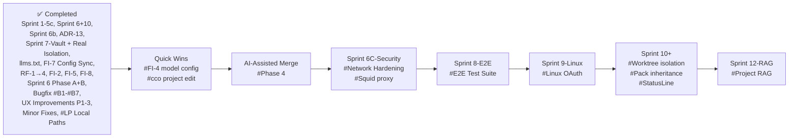
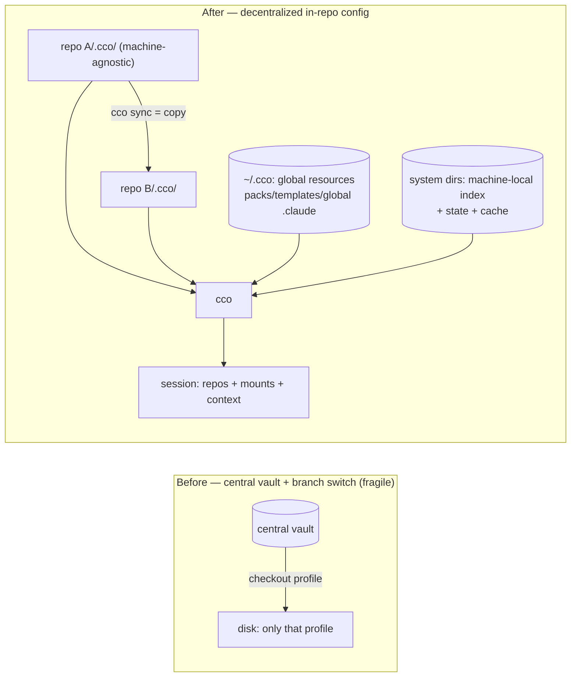

# Roadmap

> Tracks planned features, improvements, and known issues for future iterations.
> Last updated: 2026-06-25 (decentralized-config: **Phases 0–5 ✅ CLOSED — Phase 5 (sharing-ext + lifecycle) BUILD COMPLETE 2026-06-25 (P5-0…P5-6 + P5-doc: P4-5d central-layout teardown · `cco forget`/`config validate`/delete-cascade · three-layer pack resolution+internalize+export--bundle-packs+template-vars · `cco project validate`/`coords` · `cco update --check` 3-state · config-protect governance docs [helper deferred post-v1, ADR-0023 D6] · changelog #15 + migration-check=NONE + browser-mcp reader sweep; suite 894/0). ▶ next = pre-merge gate: review cycle (impl/docs/refactoring/UX) → dogfooding e2e (Mac) → merge/release v1. Phase 4 build+doc ✅ COMPLETE — P4-1…P4-5c (sharing core → legacy teardown → schema-bridge collapse to index-only) + P4-doc all DONE, suite 827/1 delta-green; P4-5d (legacy `$PROJECTS_DIR`/`CCO_*_DIR` central-layout teardown) DEFERRED → P5; P4→P5 adherence audit ✅ DONE 2026-06-24 (`reviews/24-06-2026-p4-p5-adherence-review.md`, 0 code 🔴; one doc-only forward-written-marks cluster FIXED) → **PHASE 4 CLOSED → next = P5**; resume handoff = `P5-final-stretch-handoff.md`**; ALL config **and sharing** analyses resolved — RD-* + R1–R4 + Cat-4 + M + **S**, ADRs 0005–**0023**; 4-bucket taxonomy + coordinate-per-unit + sharing unification [2×2 matrix, pack coordinates, reachability, working-copy lifecycle, permissions delegated-to-git] + principles **P1–P17**; **config + sharing design CLOSED. Impl-readiness review (V) DONE** — `reviews/18-06-2026-impl-readiness-review.md`, 58 findings/37 decisions, being resolved **cluster by cluster**: Cluster 1 RESOLVED → ADR-0021 + ADR-0006/0009/0010; Cluster 2 RESOLVED → impl order re-derived (dependency+reuse+open-closed) into a 6-phase dependency-layer map, design §9/§11 rewritten; Cluster 3 Block A RESOLVED → doc-lifecycle rule + design-intent re-sync; Cluster 4 RESOLVED → ADR-0022 + forward-annot ADR-0016/0017/0018/0019 + design §2.2–§12 + FR-Y-S6; Cluster 5 RESOLVED → **ADR-0023** (D1–D6: `cco config`/`cco project` namespace + `cco project validate` contract + `cco project add <res>`/`--path` + sharing-surface/internalize family + `cco new`/`extra_mounts` + `cco config protect`) + forward-annot ADR-0016/0018/0019/0020/0021. **ALL 5 CLUSTERS RESOLVED → impl-readiness review (V) FULLY CLOSED (2026-06-19). Implementation IN PROGRESS — Phase 0 (T1/T2a/T3/T4-remotes + **Commit A** `c8ae080` + **Commit B** `848cf63` + **T8** `7dcf1e8`, suite 995/2 delta-green) ✅ **CLOSED**; Commit A = repos/mount → STATE index (transitional schema-bridge + keep-transitional @local, die P3/P4); Commit B = session-mount bucket re-point + harness HOME flip (global→CONFIG ~/.cco/global, auth+transcripts+memory→STATE, managed→CACHE; **D1** design §2.2/2.3 over the earlier coarse "→ ~/.cco" mapping, **D2** managed-gen→CACHE; kept legacy CCO_*_DIR + dual-seed); T8 = `.claude` overlays packs.md/workspace.yml → CACHE :ro (ADR-0005 F1/F2/F3; F2 cross-tree collision warn); [internal-artifact relocations re-sequenced OUT of P0: T4-source→P4, T5→P2]; Phase 1 (core local) ✅ CLOSED 2026-06-22 (6 commits `56ca45c`→`e48abdd`, suite 1043/16); **next = Phase 2** (`P2-handoff-migration-bootstrap.md`, migration & bootstrap); method/phase-map = `Y-handoff-implementation.md`; T future**). **Phase-2 preliminary analysis + P1 adherence audit DONE 2026-06-22** — P1 fully conformant (0 🔴/0 HITL, `reviews/22-06-2026-p1-adherence-review.md`); decisions: **`<id>` = project `name`** pinned (design §2.2), dogfooding/legacy-vault-fate plan (`P2-dogfooding-validation.md`); 2 open items for P2 Design (the `.cco/meta` `manifest:` hash-block vs ADR-0012 `manifest.yml`; legacy global/packs/templates migration into `~/.cco`). **`RD-repo-multi-project` ✅ RESOLVED 2026-06-22 → ADR-0024** (maintainer-confirmed): **Option 1** — a repo hosts **one** project config (`<repo>/.cco/`, by `project.yml` `name`) = one dev scope; referenced by N via the index + embedded coordinate (Case A). **No schema change → P2 build-once `project.yml` writer intact.** Also resolved the adjacent fronts: `cco sync` clobber-guard (skip+warn, no override — D2), `cco start` cwd → hosted project (D3), `.claude` scope hierarchy + no cross-project leak (D4), repo↔project observability (D5), **sync-set = whole committed `.cco/` minus `secrets.env`, authored packs only** (D6, refines ADR-0003), Axis-1/2 distributed sharing + future `~/.cco/projects` opt-in (D7), principle **P18**. Propagated to design §2.1/2.4/3/4/9 + guiding-principles + requirements + ADR-0002/0003. **Re-coherence sweep ✅ DONE** (`8e7cc9a`, suite **1044/16**). **P2 Design ✅ DONE 2026-06-22 → ADR-0025** — both §4a open items closed: (1) `.cco/meta` hash `manifest:` block **→ STATE `/update` meta, NOT dropped** (ADR-0013 D3, code-confirmed; only `manifest.yml`/`pack-manifest` removed); (2) **migration ownership** = **eager global via `cco update`** + **lazy per-project via `cco init --migrate`** (prior "global mode of `cco init --migrate`" candidate rejected; `cco migrate` stays dropped; backup any-command; vault removal offered only at `cco update`, default keep). ADRs now **0005–0025**. **Next = P2 implementation** along the maintainer-approved build sequence (P2-handoff §5b: **P2-1** bootstrap+backup · **P2-2** H6 paths→STATE + global-meta decompose [16→8] · **P2-3** `cco update` eager global · **P2-4** `cco init --migrate` lazy + `cco init`/`join` · **P2-5** D-start + D5), clean session, start at **P2-1**. **PHASE 2 ✅ CLOSED 2026-06-22** — 5 commits `c1e0369`→`767de86` (P2-1 J0 bootstrap+raw-tar backup · P2-2 H6 base/meta→STATE keyed-by-`name` + global-meta decompose [16→8] · P2-3 eager global migration via `cco update` · P2-4 `cco init --migrate` lazy + `cco join` + migration 013 + `migrations/{pack,template}/` · P2-5 D5 observability; **D-start re-sequenced P2-5 → P3**, code-grounded: `cco start` still mounts the central layout). **P2→P3 adherence audit ✅ DONE 2026-06-23** (`reviews/23-06-2026-impl-adherence-review.md`, 4 parallel lenses + adversarial verify): P2 fully conformant, **0 🔴 / 0 blockers / 0 genuine HITL**; **T5 (base/meta) RETIRED** from the Transitional Registry; baseline re-stated **16→8** (8 P2-owned tests flipped ❌→✅); one false-alarm cluster (an agent ran without `CCO_ALLOW_HOST_RESOLVE=1`) reproduced + rejected; doc-coherence clean (shipped-behavior docs correctly not rewritten ahead). **Next = Phase 3 (legacy cutover)** — D-start decentralized read-path + delete vault/profiles/`project create`/sanitize + wire `cco tag`/`cco list --tag` + `cco config save/push/pull` + shipped-behavior doc cutover sweep. **PHASE 3 IN PROGRESS (2026-06-23) — P3-1/P3-2/P3-3 ✅ DONE (5 commits, each full-suite delta-green): P3-1a `36660fd` decentralized `cco start` read-path flip + harness-first; P3-1b `365d16f` D-start UX (source-transparency, ⚠ badge, conscious-skip P14); P3-2a `548f2e5` `cco tag`/`cco list` over DATA `tags.yml` (auto-detect kind); P3-2b `f7f41c1` `cco config save/push/pull` (allowlist double-barrier + secret-scan; `cco config validate` deferred → P5); P3-3 `a76e1f6` the VAULT/PROFILE WORLD REMOVED (cmd-vault.sh −3732 + D33/D32, delta-green 8→3).** The decentralized runtime is live and the vault is gone. **Tier-2 legacy project-verbs + the `@local` sanitize block DEFERRED → P4** (build-once with their publish/install/query consumers). **P3-3b ARCHITECTURE DECIDED → ADR-0026** (`60fa04f`; maintainer-proposed, implementer-validated): `cco init` = single project entry verb that idempotently ensures `~/.cco/global` (from defaults if absent) + scaffolds `<repo>/.cco/`; ownership split J0=roots / `cco init`=global-content (fresh) / `cco update`=vault-migration; the migration-idempotency gate moves to a `migration-state` marker (non-destructive `cco update` after init). **P3-3b ✅ DONE 2026-06-23** — §1.5 coherence review CONFIRMED ADR-0026; build **re-sequenced (Option B)** into 2 coordinated delta-green commits because the global retarget wasn't isolable from the still-central update/clean/manifest engines + ~150 global-only `run_cco init` tests: **`9e15924`** (docs) · **`35f5797`** global-home cutover `GLOBAL_DIR`→`~/.cco/global` + `init_global` test helper · **`d9e44a2`** init transform (idempotent global-ensure + per-repo `<repo>/.cco/` scaffold + index-register + §3b marker-gate non-destructive `cco update`; deleted `cco project create`, relocated `_resolve_template_vars`→`cmd-template.sh`; base `project.yml`→coordinate schema). Removed tests for now-gone/deferred behavior (create-time meta/base/source, `--template` instantiation, central project-scoped `update --sync/--diff` → P4). **Next-session resume = `P3cd-handoff-config-editor-and-docs.md`** (P3-4 config-editor rehome → P3-5 shipped-behavior doc cutover sweep; run a P3-3b→P3-4 adherence audit first). ADRs now **0005–0026**; next free = **0027**. Baseline **921/3** on `feat/vault/decentralized-config` (commits local; maintainer pushes from Mac). **P3-3b→P3-4 adherence audit ✅ DONE 2026-06-23** (baseline 921/3 confirmed, `cco init`/global-home conformant to ADR-0026, Transitional Registry intact, `_resolve_template_vars`→`cmd-template.sh`; 0 🔴). **P3-4 DESIGN ✅ DONE 2026-06-23 → ADR-0027** (maintainer-confirmed): config-editor = **built-in** (tutorial model, moves to `internal/config-editor/`, global mode mounts `~/.cco` rw / `--project`\|cwd adds the target `<repo>/.cco` rw); **D2** repeatable `--mount` reference-mount (ro default, rw opt-in) on `cco start`/`cco new`; **D3** agentic edit-protection — a normal `cco start` mounts the committed `<repo>/.cco` + `/workspace/.claude` **`:ro`** (container-only; host IDE free), escape hatch `cco start --enable-config-edit`. ADRs now **0005–0027**; next free = **0028**. **P3-4 ✅ DONE 2026-06-23** — 4 delta-green commits: `531a0f8` (ADR-0027 + design/inventory/roadmap) · `2783ce5` (D2 `--mount` ro-default on start/new) · `f590efe` (D3 narrow edit-protection: `<repo>/.cco` :ro overlay + `--enable-config-edit`; `/workspace/.claude` kept rw after the init-workspace conflict surfaced + maintainer-confirmed) · `871993e` (D1 config-editor built-in → `internal/config-editor/`, global/`--project` modes, content rehomed to `~/.cco`/`cco config`/sharing-repo). Suite **936/3** delta-green. **P3-5 IN PROGRESS (2026-06-24): A/B ✅ `5c6ad29`** (config-editor done P3-4; tutorial A.4 retarget→`~/.cco` ro + content rewrite; base template llms→CACHE/secrets paths; managed `memory-policy.md` vault→STATE [**needs `cco build`** — baked]; `.gitignore`/`.dockerignore`; changelog id 14 breaking) **· C ✅ `141e24e`** (24 user-facing+contract docs via parallel doc agents grounded in design §2/§7 + ADRs 0018/0023/0024/0026: README, cli.md, configuration-management, context-hierarchy, architecture, docker/design, spec FRs, getting-started, project-setup [+ADR-0024 Front A/E], knowledge-packs, mechanical subs, index READMEs, repo CLAUDE.md; "Config Repo"→"sharing repo" context-sensitive; scope-safe [no decentralized-config/ or vault|sharing|resource-lifecycle/ touched]; suite 936/3). **D ✅ DONE 2026-06-24** — D-rehome `56967cf` (file-policy taxonomy + changelog dual-tracker made canonical in `update-system/`; `rules-and-guidelines/` refs re-homed) + D-archive `a3e0618` (`git mv` `configuration/{vault,sharing,resource-lifecycle}/` → `_archive/`, 15 files history-preserved; live refs re-pointed into `_archive/`; whole `resource-lifecycle/` archived since its surviving concepts already live in `update-system/`, maintainer-confirmed; C.6 index assertions now TRUE; one ADR-0001 back-ref accepted-dangling per doc-lifecycle). Review-first pass confirmed baseline 936/3 + P3-4 code conformant (ADR-0027) + A/B/C doc accuracy. **→ PHASE 3 CLOSED. Next = Phase 4 (sharing core), pending maintainer approval — run a P3→P4 adherence audit first.** Deferred to P4 (logged): full rewrite of `architecture/{coding-conventions,security}.md` + `integration/{browser-mcp,auth}/design.md` (document deleted `cmd-vault.sh` + still-present `@local`/tier-2 code — rewrite rides the P4 teardown; only their `vault/` path tokens re-pointed to `_archive/` now). Deferred (user-owned rule, propose): `.claude/rules/update-system.md:20`. Maintainer notes (non-blocking): docker/design `build.context: ../../` now inconsistent; cli.md no `cco template update` subsection; managed `memory-policy.md` needs `cco build`. **PHASE 4 (sharing core) IN PROGRESS (2026-06-24):** P3→P4 adherence audit ✅ (`reviews/24-06-2026-impl-adherence-review.md` — READY FOR P4, 0 blockers; 4 parallel read-only lenses + adversarial verify; baseline 936/3 = exact P4-5 set). **P4-1 ✅** `82b6956` (source→DATA relocation + key rename `source→url`/`path→resource`, ref kept + bookkeeping `commit/installed/updated`→STATE meta + **F4** `publish_target` re-derived via new `remote_get_name_for_url` url→name reverse-lookup [`_update_publish_target` deleted] + idempotent `_relocate_legacy_pack_sources` in `cco update`; llms source excluded; ADR-0022 D1; suite **939/1** — resolved the 2 P4 baseline failures `test_publish_ignore_path_patterns`+`test_project_internalize_updates_base`). **P4-2 ✅** `6b2673f` (structure-based discovery `_discover_resources` over `packs/`/`templates/` [no manifest.yml] + rewrote install discovery readers + dropped all `manifest_refresh`/`manifest_init` writers + **DELETED the manifest subsystem** `lib/manifest.sh`+`cco manifest` arm+`test_manifest.sh`; ADR-0012/0018 D3; suite **915/1**). **Build-boundary reconciliation (documented):** manifest-delete folded P4-3→P4-2 (the subsystem is dead once structure-discovery exists — no reader remains; "delete LAST" = right after discovery) ⇒ **P4-3 is now sync-before-publish ONLY**. **P4-3 ✅** `cf8d03b` (sync-before-publish, ADR-0022 D5/§6.2: whole-file 3-way tree merge `_pack_sync_merge` vs the pack-scoped STATE `base/` recorded on install+publish, abort-on-conflict P16, `--force`=opt-in clobber; corrects the clone-then-overwrite data-loss defect; suite 915/1→920/1). **P4-4 ✅** (2×2 verb wiring, 5 delta-green sub-commits `3f85de7`/`56ac61c`/`ef2ad01`/`fc8f2ee`/`a5d6cca`): pack `import`; project `export`/`import` (new `cmd-project-export-import.sh`, bundle `.cco/`−secrets.env + secret-scan + index-register); template 2×2 (both kinds by marker + sync-before-publish parity); `cco init --template` (instantiation, replaces the removed project-install template path); **REMOVED project publish/install/update/internalize** (ADR-0018 D2; current internalize-semantic retired ADR-0023 D4c, name reserved post-v1; maintainer-confirmed beyond handoff-literal) + nomenclature config→sharing repo + AD12 no-alias rejections; suite 920/1→**883/1** (the drop is intentionally-removed tests for the deleted commands, 0 new fails). **P4-5 ✅ (a/b/c) + P4-doc ✅ — PHASE 4 build+doc COMPLETE (2026-06-24, suite 827/1).** P4-5a `3b0859b` (tier-2 verbs `cco project resolve`/`validate <name>`/`delete`/`add-pack`/`remove-pack` removed, no alias AD12) · P4-5b `34b3429` (orphan `@local` plumbing deleted) · P4-5c-1a `89d18e0`/1b `9e167db`/1b+ `5fc7a54` (bridge-fed fixture migration → logical-name+index seed; +production fixes `workspace.sh` description-awk + the config-editor mount generator the collapse exposed) · P4-5c-2 `105bd9c` (**schema bridge COLLAPSED to index-only**; `_get_repo_url`/`_resolve_entry`/`_update_yml_path`/`_local_paths_set` deleted) · P4-5c-3 `bdc90a0` (legacy `yml_get_repos`/`yml_get_extra_mounts` parsers removed) · P4-doc `91433c5`+`5c7fc96` (living-rewrite coding-conventions/security/browser-mcp; cli/config-management shipped-behavior — add-pack alias dropped, validate/forget 🚧 planned/P5). **P4-5d (legacy `$PROJECTS_DIR`/`CCO_*_DIR` central-layout teardown) DEFERRED → P5** (still load-bearing in ~11 commands). **P4→P5 adherence audit ✅ DONE 2026-06-24** (`reviews/24-06-2026-p4-p5-adherence-review.md`; 4 parallel read-only lenses + adversarial verify): Phase-4 code **fully conformant — 0 code 🔴 / 0 blockers / 0 design gaps**; Transitional Registry refreshed (all P0–P4 items retired; live set = the P4-5d group + the 1 P5 straddler). One doc-only finding cluster (shipped-behavior docs documented P5-not-built verbs `cco forget`/`update --check`/`config validate`/`project coords`/`template update`/`template internalize` as shipped) → **maintainer Option A, FIXED** (🚧 markers in cli.md + configuration-management.md; docs-only, suite 827/1). **⇒ PHASE 4 CLOSED.** **PHASE 5 (sharing-ext + lifecycle) IN PROGRESS (2026-06-24, order maintainer-confirmed):** P5-0 llms-fix → P5-1 P4-5d teardown → P5-2 forget/config-validate → P5-3 pack-resolution/internalize → P5-4 project validate/coords → P5-5 update --check → P5-6 config protect → P5-doc → pre-merge dogfooding (index namespacing = POST-V1, confirmed). **P5-0 ✅** `2f93de8` (`_llms_resolve_name_from_url` — path segment wins over domain; resolved the last straddler → **baseline now 828/0**, delta-green vs ZERO). **P5-1a ✅** `95b7767` (managed runtime state browser/github → CACHE via new `_cco_project_cache_managed`; migrated the 3 readers stop/chrome/start-port central→index+CACHE — fixes a latent bug: they read where `cco start` no longer writes). **PHASE P5-1 (P4-5d central-layout teardown) ✅ COMPLETE (2026-06-25, 4 delta-green commits):** P5-1b-1 `0da6153` (pure project.yml readers project-query/pack/llms/template-from → STATE index), P5-1b-2 `6209bae` (`cco clean` → index + artifacts re-homed: `.bak`/`.tmp`→`<repo>/.cco/`, compose→STATE), P5-1b-3 `7e9d458` (`cco update` project loop → decentralized; `_update_project` reads `<repo>/.cco/claude`; new `_cco_project_seed_update_state` born-at-latest wired into init+migrate), P5-1c `0116679` (teardown `$PROJECTS_DIR`/`CCO_PROJECTS_DIR`, bin/cco legacy-layout branch, harness dual-seed; 10 test files migrated to host `.cco/`+STATE/CACHE/DATA). Central project layout fully gone; suite **828/0**. **P5-2 ✅ DONE (2026-06-25)** — `cco forget` + `cco config validate` + delete-cascade (ADR-0021 Dec.2/3/4/5; `ed2b7ee`/`d706226`/`93542cd`+doc `1ef9814`; new `_tags_forget`/`lib/cmd-forget.sh`/`_config_validate`; shared-repo guard; full-bucket orphan sweep STATE/CACHE-main-confirm + synced-DATA-second-confirm; ADR-0021 §Open resolved; suite 828→843/0). **P5-3 ✅ DONE (2026-06-25)** — three-layer pack resolution + internalize + export--bundle-packs + template-vars (ADR-0019 D3/D5/D7, ADR-0023 D4; `9c5986d`/`4961d87`/`b88bc18`/`44199f9`+doc `f187003`; new `_pack_resolve_dir` mount order `~/.cco/packs`→`<repo>/.cco/packs` cache [start=warn+conscious-skip, NO layer-2 auto-fetch — maintainer-confirmed]; `pack internalize --as` fork + build-new `cco template internalize`; `project export --bundle-packs` closure+import-installs; `init --template` full `{{VAR}}` over project.yml+whole `claude/` tree; suite 843→859/0). **Deferred (surfaced):** D6 interactive internalize-as-cache prompt at `cco resolve` + `cco update` cache refresh; `cco project internalize` (Case-C post-v1). **P5-4 ✅ DONE (2026-06-25)** — `cco project validate` share-readiness (exit 0/1/2 max-severity + ADR-0022 D4 pack-collision ERROR; `lib/cmd-project-validate.sh` `48a44b0`) + `cco project coords` cross-unit (ADR-0016 D3, on-demand/no-persist F45, `--sync --from` in-place writer never-auto-elect F48; `lib/cmd-project-coords.sh` `5f6c506`) + doc de-🚧 `75c1377`; suite 859→885/0. **P5-5 ✅ DONE (2026-06-25)** — `cco update --check` 3-state (ADR-0022 D6; `_update_check` in cmd-update.sh; **packs+templates only** — projects excluded P13, D6 "projects" superseded by P4-4e; DATA-source-driven, STATE-base-gated not-installed-here/comparable/indeterminate, exit-0; `5753513` P5-5a template installed_commit prereq + `13b7573` + doc `b5080fc`); suite 885→894/0. **Next = P5-6** (`cco config protect` **documentation only** — helper deferred post-v1, ADR-0020 D4/ADR-0023 D6) → P5-doc (changelog + migration for the P5 verbs + shipped-doc sweep) → pre-merge dogfooding. Resume handoff = `../configuration/decentralized-config/P5-final-stretch-handoff.md`. Baseline **894/0**. ADRs **0005–0027**; next free **0028**. Commits LOCAL (maintainer pushes from Mac).
>
> **Note**: Sprint entries are historical. Path references (e.g., `.cco-meta`, `.cco-source`) in older
> sprints reflect the layout at the time of writing. See Sprint 8 and the `.cco/` consolidation
> design doc for current paths.

---

## Quick Reference

| Status | Items | Section |
|--------|-------|---------|
| ✅ Completed | 31 sprints / features | [→ Completed](#completed) |
| 🐛 Known Bugs | 3 open · 20 fixed | [→ Known Bugs](#known-bugs) |
| 🔜 Planned | Quick Wins (FI-4, #10), AI-merge, Sprint 6C → 12 | [→ Planned](#planned-sprints) |
| 🔭 Exploratory | 7 ideas | [→ Long-term / Exploratory](#long-term--exploratory) |
| ❌ Declined | 3 items | [→ Declined / Won't Do](#declined--wont-do) |

---

## Sprint Roadmap

Features are prioritized by impact for third-party users adopting claude-orchestrator.

### Prioritization Notes (updated 2026-03-31)

**Completed**: RF-1→4, FI-2, FI-5, FI-7, FI-8, Sprint 5c, Sprint 6 Phase A+B, Bugfix B5-B7, UX Improvements P1-3, Minor Fixes batch, llms.txt, Profile Isolation Review, #LP Local Paths.

**Next**: FI-4 model config, #10 project edit.

**Then**: AI-assisted merge (P4), Security (Sprint 6C), E2E testing (Sprint 8), Linux OAuth (Sprint 9).

**Later**: Worktree isolation (Sprint 10), Pack Inheritance (#9), StatusLine (#10b), RAG (Sprint 12).

| Category | Items | Effort | Benefit |
|----------|-------|--------|---------|
| **Quick wins (priority 1)** | FI-4 model config, #10 project edit | Low-Medium | UX improvement |
| **AI-merge (priority 2)** | Phase 4 AI-assisted merge | Low-Medium | Update UX quality |
| **Security (priority 2)** | Sprint 6C network hardening | Medium-High | Required for production/open-source |
| **Quality (priority 3)** | Sprint 8 E2E tests | Medium | Prerequisite for Linux onboarding |
| **Onboarding (priority 4)** | Sprint 9 Linux OAuth | Medium | Pre-open-source requirement |
| **Architecture (priority 5)** | Sprint 10 worktree, #9 pack inheritance, #10b StatusLine | Medium | Valuable but not blocking |
| **Exploratory** | Sprint 12 RAG, hot-reload, notifications, remote sessions, web UI | High | Long-term, evaluate demand |



---

## Planned Sprints

### Vault Simplification → Decentralized In-Repo Config (DECIDED 2026-06-11; evolved 2026-06-12; model finalized 2026-06-15)

**Status**: Design APPROVED (2026-06-15); **config + sharing design CLOSED**; **impl-readiness review
(V) FULLY RESOLVED — all 5 clusters closed (2026-06-19)**; **design CLOSED → ✅ IMPLEMENTATION IN
PROGRESS (Phase 0 substrate ✅ CLOSED — T1/T2a/T3/T4-remotes + Commit A + Commit B + T8 landed through 2026-06-21, suite 995/2 delta-green; **adherence audit DONE 2026-06-21** → `../configuration/decentralized-config/reviews/21-06-2026-impl-adherence-review.md`: Transitional Registry intact, 0 🔴 code bugs; **HITL-1 (runner masked non-final assertions) RESOLVED + APPLIED** — the `ASSERTION FAILED` sentinel fix un-masked 17 hidden failures (the "995/2" was masked), all stale/legacy test-drift; 3 P0 `test_invariants` spot-fixed; **HITL-2 [low] also resolved** (`test_remote_token_file_is_0600` asserts the `remotes-token` 0600 mode) → **new baseline 982/16** (16 known-failures owned by P2/P3/P4-5); **Phase 1 (core local) ✅ CLOSED 2026-06-22** (suite **1043/16**); **Phase 2 (migration & bootstrap) ✅ CLOSED 2026-06-22** (5 commits `c1e0369`→`767de86`, suite **1087/8**); **Phase 3 (legacy cutover) ✅ CLOSED 2026-06-24** (P3-1…P3-5 incl. vault/profile removal, decentralized `cco start`, `cco tag`/`cco config`, `cco init` scaffold, config-editor built-in, doc cutover sweep + `_archive/`; suite **936/3** — detailed P2/P3 commit log in the section header above); **Phase 4 (sharing core) build+doc ✅ COMPLETE 2026-06-24** — P4-1…P4-4 (source→DATA · structure discovery + manifest removed · sync-before-publish · 2×2 verbs) + P4-5 (a/b/c: tier-2 verbs removed · `@local` plumbing deleted · schema bridge collapsed to index-only · legacy parsers removed) + P4-doc; suite **827/1** delta-green; **P4-5d (central `$PROJECTS_DIR`/`CCO_*_DIR` teardown) deferred → P5**; **P4→P5 adherence audit ✅ DONE 2026-06-24 → PHASE 4 CLOSED** (`reviews/24-06-2026-p4-p5-adherence-review.md`, 0 code 🔴; doc-only forward-written-marks cluster FIXED); **Phase 5 (sharing-ext + lifecycle) ✅ BUILD COMPLETE 2026-06-25 — P5-0…P5-6 + P5-doc all DONE (P4-5d central-layout teardown · `cco forget`+`cco config validate`+delete-cascade · three-layer pack resolution+internalize+export--bundle-packs+template-vars · `cco project validate`+`coords` · `cco update --check` 3-state [packs+templates only, projects excluded P13] · `cco config protect` GOVERNANCE DOCS [helper deferred post-v1, ADR-0023 D6] · P5-doc close-out: changelog #15 + migration-check=NONE-needed + browser-mcp reader sweep; suite 894/0). ▶ next = pre-merge gate (review cycle → dogfooding e2e on Mac → merge/release v1). Post-v1 backlog: see the "Post-v1 backlog" subsection below**)**.
Living `requirements.md` + `design.md` are the single source of truth;
decisions recorded in ADRs **0001–0023** (`../configuration/decentralized-config/decisions/`); the
role-first analyses (R1–R4, Cat-4, M, **S**) are tracked in `analysis-roadmap.md`; analyses + the V
report kept under `.../reviews/`. On `feat/vault/decentralized-config` (commits **local only**, pushed
from the maintainer's Mac). **S DONE (ADR-0018/0019/0020)** — sharing model unified (2×2 matrix, pack
coordinates + reachability, working-copy lifecycle, permissions delegated-to-git; principles P13–P17).
**V DONE (2026-06-18)** — multi-agent ultracode review (10 lenses → adversarial verify → dedup → option
analysis → critic) produced **`reviews/18-06-2026-impl-readiness-review.md`** (58 findings + 5 critic;
37 decisions). Findings are being resolved **cluster by cluster** with the maintainer, persisted into
the ADRs/design before implementation. **Cluster 1 (migration safety) RESOLVED & PERSISTED** → **new
ADR-0021** (resource lifecycle: `cco init --migrate` / `cco forget` / F59 cleanup) + ADR-0006/0009/0010
+ design §7/§9/§11 + requirements FR-M1/M2. **Cluster 2 (phasing & test-plan) RESOLVED & PERSISTED**
(2026-06-18, commit 0e640fb): impl order re-derived from **dependency + reuse + open-closed** (design +
UX unchanged) → the "→ E" workstream is **dissolved** into a **6-phase dependency-layer map** (P0
substrate · P1 core-local · P2 migration · P3 legacy-cutover · P4 sharing-core · P5 sharing-ext); design
§9/§11 rewritten (incl. existing 35-file test-suite teardown) + analysis-roadmap/inventory phase-homes.
**Cluster 3 (doc-resync) Block A RESOLVED & PERSISTED** (2026-06-19): doc-handling **policy** fixed (repo
rule `.claude/rules/documentation-lifecycle.md` — history-vs-living-vs-archived doc classes +
design-intent-now / shipped-behavior-at-cutover timing); design-intent docs re-synced (`requirements.md`,
`design.md §1`, ADR-0002/0014 forward-annotations) and `resource-coherence-inventory.md` completed as the
Phase-3 cutover-sweep driver. Block B (user-facing doc rewrites) is inventoried and rides the cutover.
**Cluster 4 (coordinate model & resolution) RESOLVED & PERSISTED** (2026-06-19): all 15 findings →
**new ADR-0022** (source-relocation/`publish_target` re-derive · global-flat index/H7 · `--scan`
merge-upsert · pack cache-iff-coordinate + one ERROR · pack STATE `base/`/sync-before-publish · `--check`
3-state) + forward-annotations to ADR-0016/0017/0018/0019 + design.md §2.2–§12 re-sync + requirements
FR-Y-S6; phasing re-read onto the Cluster-2 P0–P5 map. **Cluster 5 (command surface & UX) RESOLVED &
PERSISTED** (2026-06-19): all 11 findings → **new ADR-0023** (D1–D6: `cco config`/`cco project` namespace
+ `cco project validate` contract + `cco project add <res>`/`--path` + sharing-surface/internalize family
+ `cco new`/`extra_mounts` + `cco config protect`) + forward-annotations to ADR-0016/0018/0019/0020/0021
+ design §2.4/§3/§4.4/§6.2/§7/§8 re-sync. **ALL 5 CLUSTERS RESOLVED → the review (V) is fully closed.**
**IMPLEMENTATION ✅ BUILD COMPLETE — Phases 0–5 ✅ CLOSED (Phase 5 BUILD COMPLETE 2026-06-25, suite 894/0; full P5 status in the section-header status line above); ▶ next = pre-merge gate (review cycle → dogfooding → merge/release v1)** (the Phase-0 landing log below is historical; the P1–P3 commit log lives in the section-header status line above): landed
`feat/vault/decentralized-config` (commits local) — **T1** resolver+H4+L5 (`ff8278b`), **T2a** index API
(`d913e5c`), **T3** coordinate parsers (`992738d`), **T4-remotes** M3 split (`2bdf80e`), **Commit A**
repos/mount resolution wired to the STATE index (`c8ae080`), **Commit B** session-mount bucket re-point +
harness HOME flip (`848cf63`, 2026-06-20), **T8** `.claude` overlays → CACHE :ro (`7dcf1e8`, 2026-06-21 —
**closes Phase 0**); suite **995/2** delta-green (the 2 are pre-existing baseline drift; +6 index tests from
Commit A, +4 overlay/collision tests from T8). Commit B emits the **final host-absolute mount map** (global
config→CONFIG `~/.cco/global`, secrets/setup→CONFIG `~/.cco` top-level, auth-seeds+transcripts+memory→STATE
keyed-by-id, managed overlays→CACHE; container side of `entrypoint.sh` unchanged) with two maintainer
decisions: **D1** follow design §2.2/§2.3 over the earlier coarse "→ ~/.cco" mapping (auth=STATE; global under
`~/.cco/global`; secrets/setup top-level — frozen spec + build-once) and **D2** managed generation → CACHE
here. **T8** extends that CACHE-overlay model to the generated `packs.md`/`workspace.yml` (ADR-0005 F1:
generate into `<cache>/cco/projects/<id>/.claude/` + child `:ro` overlay onto `/workspace/.claude`, metadata
generated before compose; F2: `_detect_cross_tree_conflicts` warns on committed-config vs pack/llms overlay
collisions, pack `:ro` wins, never hard-block; F3: parent `.claude` stays rw, committed tree never written).
Harness kept legacy `CCO_*_DIR` + dual-seed + HOME flip + hermetic gitconfig. Commit A's two **transitional**
choices stand (keep-transitional @local plumbing + per-section schema bridge; die P3/P4). The two
internal-artifact relocations are re-sequenced OUT of P0 (tests hardcoded in later phases): **T4-source →
P4** (source→DATA/F4) and **T5 → P2** (base/meta→STATE, H6 + global-meta decompose); design §2.2/§9/§11 +
ADR-0022 D1 / ADR-0016 D6 forward-annotations. **Adherence audit DONE 2026-06-21** (`reviews/21-06-2026-impl-adherence-review.md`, first run of the recurring playbook): Transitional Registry **fully intact** (no early cleanup / no unsanctioned dual-read), **0 🔴 code-conformance bugs**; one **test-infra** finding → **HITL-1 RESOLVED + APPLIED** (the runner `( set -e; fn )` masked all non-final assertions — the `[[ … ]] || fail` idiom masks like bare `assert_*`; `bin/test:_run_test` now treats the `ASSERTION FAILED` sentinel as failure). The fix **un-masked 17 hidden failures** — the "995/2 delta-green" was masked — all stale-assertion/legacy test-drift (NOT P0 code regressions); 3 P0-scope `test_invariants` spot-fixed. **HITL-2 (low) RESOLVED** (`test_remote_token_file_is_0600` — portable `stat` 0600 check on `remotes-token`, S8). **New verified baseline 982/16** (16 known-failures = 8 update/P2 + 5 vault-profile/P3 + 3 sharing/P4-5, re-baselined in registry §4 + P1-handoff §4). **Phase 1 (core local) ✅ CLOSED (2026-06-22)** — 6 atomic commits `56ca45c`→`e48abdd` on
`feat/vault/decentralized-config` (local), each full-suite delta-green = the re-baselined 16; suite
**1043/16**: `cco resolve`/`cco path` (index-backed, `--scan` non-destructive upsert, clone-from-`url`),
sync-meta fingerprint (§4.6/F39), the non-blocking reminder aggregator (ADR-0008, H1), `cco sync` (4
forms, copy, never-sync exclusions), `cco start` aggregator+H1 (+ fixed a latent `--dry-run` EXIT-trap
bug), and `cco project add repo|mount|llms|pack` (embed-at-add + one-shot `--path`→index, url-from-origin).
**3 maintainer scope-forks** (deviate from the P1-handoff literal *toward* design §9/§11): legacy
`cco project resolve` / `cco project validate <name>` / `cco project add-pack` kept → **P3**; `cco start`
`--from` / Case-C / divergence notice / source-transparency **RE-SEQ → P2** (coupled to start's
central→decentralized project-finding); `cco project validate` full contract (ADR-0023 D2) → **P5**,
`cco project coords` → **P4/P5**; `cco config save/push/pull` remains **P3**. **Next = Phase 2**
(`P2-handoff-migration-bootstrap.md` — J0 four-root bootstrap, legacy-vault backup, `cco init --migrate`
writing the complete final project.yml in one pass, T5/H6 `.cco/base`+`meta`→STATE + global-meta
decompose, memory relocation, profile→tag prompt; **plus the deferred D-start source-selection**).
Method/phase-map = `Y-handoff-implementation.md`. T (state-sync) is future.
**Priority**: 0 (next major work). **Supersedes**: branch-switch real-isolation
model in `../../configuration/_archive/vault/profile-isolation-design.md` (v2) **and** the
central-vault project store.

> Evolved 2026-06-12 from "single filesystem + tags" to a full **decentralized
> in-repo config** model after design discussion. The motivation (below) is
> unchanged; the target model is broader.

**Decision**: Stop switching the filesystem by `git checkout` of vault profile
branches. All projects coexist on a single working tree at all times.
"Profiles" are demoted to **tags** (display filter + grouping); they no longer
gate which projects exist on disk or which can be started.

**Why**:
- **Recurring bug class**: #B13, #B16–#B23 all live in the same switch /
  `@local`-sanitize / gitignored-shuffle machinery. Each interaction edge
  between (a) checkout-swap, (b) path sanitization, (c) portable-file stashing
  has produced a field bug. The fragility is structural, not incidental.
- **Opaque failures**: `cco vault move` can no-op silently while `cco vault
  diff` reports a clean tree, because the diff deliberately ignores `@local`
  path differences. A diff that hides files makes failures undiagnosable.
- **Hard UX limit**: only one profile's projects are on disk at a time, so you
  cannot run projects from different profiles concurrently on the same machine
  — a frequent, legitimate need (e.g. a work-project session alongside a personal one).
- **bash 3.2 incident (#B23)**: latest regression in the same fragile path.

**Target model** (decentralized in-repo config — finalized 2026-06-15):
- Each project's cco config lives in `<repo>/.cco/`, versioned with the code; the
  central vault is retired. Profiles → tags (the IDE is the project browser).
- **Machine-agnostic committed config**: `project.yml` uses logical names only (no
  real paths) and is identical across a project's repos → a plain `git diff` is
  always truthful. The custom diff/save/sanitize/virtual-diff layer is **removed**.
- **Sync = copy** (no merge engine, no `sync-base`, no commit-time, no peer/root):
  `cco sync` copies a chosen source repo's `.cco/` into target repos on the same
  machine. **Plain git is the only cross-PC transport** (conflicts resolved in the
  IDE). Real paths live in a machine-local index (CLI-managed, never committed).
- No privileged repo: `cco start` uses the invoking repo's config (cwd) or a flag.
- Config/state/cache separated by location: state + cache live in system dirs
  outside the repo; `secrets.env` is the one in-repo (gitignored) exception.
- Two strictly-separated sync domains: personal multi-PC vs team/external sharing.
- The `cco update` 3-way merge engine is **unchanged** (it was never config-sync).
- **Breaking cutover** (ADR-0006): no dual-read / deprecation window (2-user known
  base). First run backs up the legacy vault; **lazy per-project** `cco migrate
  <project>` from the backup. Entry points: `cco init` | `cco join` | `cco migrate`.
- Full requirements + design + ADR: `../configuration/decentralized-config/`.
- Follow-up dedicated analyses (do not block Phase 0). **ALL config analyses RESOLVED**:
  RD-syncmeta (FR-Y-S6/§4.6), RD-claude-mount (ADR-0005), RD-paths (ADR-0007), RD-home (ADR-0008),
  RD-memory (ADR-0009 — auto-memory is machine-local STATE, no sync v1), RD-authoring (ADR-0010 —
  direct `~/.cco` edit + tags-not-profiles). Then the **role-first analyses**: R1 tags-nature
  (ADR-0011), R2 manifest-removed (ADR-0012), R3 internal-metadata-split (ADR-0013), R4
  referenced-resource-coordinates (ADR-0014), **Cat-4** = 4th bucket EXISTS = XDG **DATA** (ADR-0015),
  **M** consolidated 4-bucket taxonomy (ADR-0016) + **M-review refinements** (ADR-0017 — coordinate
  fields, CLI consolidation, J0 4-bucket bootstrap, `~/.cco` always-git + public-remote allow+warn).
  **S** = sharing model unification (ADR-0018/0019/0020 — config-bucket vs sharing-repo, 2×2 command
  matrix, coordinate model extended to packs + unified reachability, working-copy lifecycle +
  sync-before-publish, permissions delegated-to-git; principles P13–P17).
  Key end-state: **config decentralizes** (project→`<repo>/.cco`, personal→`~/.cco`), **internal
  centralizes keyed-by-identity** (DATA/STATE/CACHE), **referenced-resource coordinates embedded
  per-unit in the manifest** (`package.json` model; repos/llms/**packs**), **team-sharing via sharing
  repos** (packs/templates publish/install; projects ride the repo remote). **Status**: **V**
  impl-readiness review DONE (`reviews/18-06-2026-impl-readiness-review.md`); **implementation IN
  PROGRESS** along design §9 P0–P5 — **Phase 0 substrate ✅ CLOSED** (T1/T2a/T3/T4-remotes + Commit A +
  Commit B + T8; suite 995/2 delta-green), **next = Phase 1** (core local commands), preceded by an
  adherence audit (`implementation-review-handoff.md`); later phases cover migration, legacy cutover,
  manifest deletion + structure-based discovery, sync-before-publish, 2×2 wiring, `source`→DATA,
  `cco update --check`, `cco config protect`, S8. **T** (RD-triggers / R-state-sync / DATA-STATE
  sync-engine) and solo-adopter Case C are **post-v1**. **Config + sharing design CLOSED.**
- **Coherence review 2026-06-16** (`reviews/16-06-2026-design-coherence-review.md`):
  architecture coherent, Phase 0 ready. Doc-fixes + phase write-downs applied. New
  follow-up analyses raised: reminder-aggregator cost & scoping, project-config inventory
  (mcp.json/setup.sh/mcp-packages.txt/.cco/managed), merge-engine path remap, index
  concurrency & namespacing, sync-state lifecycle + sync edge-cases, join Case-C flow.



**Superseded / mooted by this decision**:
- **#6b** Worktree-Based Vault Profile Sync — obsolete (no branch-switch left
  to make robust).
- **#6c** Interim sync robustness — obsolete (no profile-branch drift to
  recover).
- **Vault UI/UX item #4** (`list --all` cross-profile) — absorbed into the tag
  filter.

**Related future workstreams (separate, NOT in this refactor)**:
- **cco packaging (R-pkg)** — distribute as npm/npx + publish the image to a registry
  so users need not clone the source (this refactor stays packaging-aware).
- **`cco update` native (R-update-native)** — evolve `cco update`: make cco fully
  agnostic and distribute opinionated packs/project-templates via native
  publish/install (like any user), keeping a `cco update` for installed packs (merge
  local edits vs replace/discard). Recorded so it is not forgotten; designed
  separately (the 3-way merge engine stays unchanged for now).
- **Persistent `/workspace` root (R-workspace)** — optional mount for host-accessible
  session artifacts.

**Next**: ALL config **and sharing** analyses resolved (RD-* + R1–R4 + Cat-4 + M + S, ADRs 0005–0020);
the 4-bucket taxonomy (ADR-0016) + M-review (ADR-0017) close the **config** design; **S (ADR-0018/0019/
0020) closes the sharing design**. **S DONE (2026-06-18)**: config-bucket vs sharing-repo nomenclature;
**2×2 command matrix** (projects ride the repo remote — no publish/install; asymmetry inherent, P13);
**coordinate model extended to packs** + **unified boundary-less reachability** (P14); **a shared
resource's local copy is never its source** (DRY, P15); **working-copy lifecycle + sync-before-publish**
(P16); **internalize-as-cache** (opt-in, last-layer); **permissions delegated to git** (P17, optional
`cco config protect`); S8 no-token-leak; opinionated-defaults-as-sharing-repo designed (migrated
post-impl). Principles **P13–P17** added. **The impl-readiness review (V) is DONE** — a read-only
whole-scope validation gate (parallel perspectives: cross-ADR/principle coherence, design↔ADR↔req sync,
completeness/gaps, ambiguity/impl-readiness, §9 phasing re-validation, code-grounding/feasibility,
doc-sweep readiness, migration/cutover safety) → severity-ranked findings, all 5 clusters resolved into
ADRs 0021–0023 + forward-annotations. Report: `reviews/18-06-2026-impl-readiness-review.md`. **Implementation
IN PROGRESS** per `design.md` §9 P0–P5 — **Phase 0 ✅ CLOSED**, next = Phase 1; later phases cover manifest
deletion + structure-based discovery, sync-before-publish fix, 2×2 wiring, `source`→DATA, `cco update
--check`, `cco config protect`, S8, and the merge-path/remote/index follow-ups (H6/M3/H7). The recurring
**`implementation-review-handoff.md`** runs an adherence/gap audit at each phase boundary. **T** (RD-triggers / R-state-sync / DATA-STATE sync-engine) and
**solo-adopter Case C** are post-v1. The vault/`@local`/profile **bug class #B13–#B23 is mooted** by the
removal.

#### Post-v1 backlog (decentralized-config)

Deferred during the refactor (decided, not unresolved); each rides on the shipped v1 substrate.
Priorities are a **recommendation** — confirm before scheduling. None blocks the v1 merge/release.

**P1 — close gaps in already-shipped surface (user-facing):**
- **`cco template update`** — update installed templates from upstream (3-way merge), the symmetric
  twin of `cco pack update`. Currently 🚧 in `cli.md` / `configuration-management.md`; users expect
  pack/template parity. Reuse the pack-update path.
- **`cco pack update` → 3-way merge** — observed in P4-3: `cco pack update` currently **overwrites**
  the local copy (no 3-way), so the "run `cco pack update` first" remedy after a publish conflict is
  **lossy** for local edits. Make it a 3-way merge like publish (correctness/UX).

**P2 — complete governance & resolution UX (contracts already pinned):**
- **`cco config protect` helper** — scaffold a host-recognized CODEOWNERS (`/.cco/** @org/...`) + print
  per-host ruleset instructions; host-detected from `origin`. Pinned contract: ADR-0020 D4 + ADR-0023 D6.
  Governance **docs** already shipped (v1, configuration-management.md §9); the helper is low-effort.
- **internalize-as-cache interactive prompt** (ADR-0019 D6) — opt-in last-layer cache for a referenced
  pack at `cco resolve` + a `cco update` cache refresh. Completes the reachability/resolve UX.

**P3 — strategic, each needs its own design cycle:**
- **T / R-state-sync** — opt-in **cross-PC / cross-team sync of STATE + DATA** (memory, transcripts,
  tags registry, install provenance). The largest deferred item; v1 keeps STATE machine-local
  (ADR-0009/0015). Scoped as one git engine + a per-store sync-class allowlist; needs RD-triggers +
  a sync-engine design.
- **`cco project internalize` (Case-C) + `~/.cco/projects/` config home** — sever a project's config
  from its code repo (relocate `<repo>/.cco` → `~/.cco/projects/<id>`) for the solo-adopter /
  "don't-ship-the-`.cco`" case. Name reserved, additive-by-construction (ADR-0023 D4 / ADR-0024 D1).
- **Index per-project namespacing** (ADR-0022 D2) — global-flat index is the v1 model; add namespacing
  only when real cross-project name collisions appear.

**P4 — polish / opinionated:**
- **Opinionated official sharing repo** (F-opin, ADR-0020) — ship opinionated defaults via an official
  sharing repo, migrated post-impl.
- **`browser-mcp/design.md` deep layout rewrite** (doc-coherence, not a feature) — align the file
  layout/mount sections to the shipped model (`browser.json` under CACHE `managed/`, whole-dir
  `/workspace/.managed:ro`); the reader snippets were fixed in P5-doc, a current-layout note flags the rest.

---

### Quick Wins — FI-4, #10

**Priority**: 1 (next). Low effort, high benefit.

#### FI-4 Per-project model configuration

Add `model:` field to `project.yml`, passed to `claude --model` at launch.

**Ref**: [FI-4](framework-improvements.md#fi-4-per-project-llm-model-configuration)
**Effort**: Medium-Low.

#### #10 `cco project edit <name>` command

Open project.yml in `$EDITOR` and regenerate docker-compose.yml after save.

**Effort**: Low.

---

### AI-Assisted Merge for Update System (Phase 4)

**Priority**: 2 (natural extension of UX Improvements). Low-Medium effort.

Add an (I) AI-merge option for `.md` files during `cco update --sync` when status is `MERGE_AVAILABLE`. Claude understands document semantics and can intelligently combine user content with framework updates, avoiding the noise of text-based 3-way merge.

**Execution**: fallback chain — `claude` on host PATH → cco Docker image (`docker run --rm`) → option hidden from menu.

**Scope**: new `lib/ai-merge.sh` module. Only for `MERGE_AVAILABLE` (not `USER_RESTRUCTURED`). Only `.md` files. User reviews result before acceptance.

**Docs**: [design](../configuration/update-system/ux-improvements-design.md) §5

---

### Sprint 6C-Security — Network Hardening

**Priority**: 3 (security, required for open-source).

**Status**: Phase A (mount_socket default) + Phase B (Docker socket proxy) implemented. Phase C pending.

#### Phase C: Network Hardening (Squid sidecar)

Layered defense for internet access control:
- **Layer 1**: Claude Code deny rules (`WebFetch`, `WebSearch`, `curl`, `wget`) for restricted/none modes
- **Layer 2**: Docker network `internal: true` + Squid proxy sidecar with SNI-based domain filtering

Configuration: `network.internet: full | restricted | none` with `allowed_domains` / `blocked_domains`. Squid sidecar bridges internal (project) and external (internet) networks. Created containers inherit the same restriction or can be overridden.

**Docs**: [analysis](../integration/docker-security/analysis.md) | [design](../integration/docker-security/design.md)
**Effort**: Medium-High.

---

### Sprint 8-E2E — E2E Integration Test Suite

Anticipato rispetto alla pianificazione originale (era Sprint 9). La suite dry-run copre 482 test ma non verifica il comportamento reale del container. E2E è prerequisito per garantire la qualità prima di Sprint 9-Linux (onboarding di nuovi utenti su Linux).

#### #E2E Integration Test Suite

**Obiettivo**: testare il comportamento reale del container, non solo la generazione dei file di configurazione.

**Scope**:
- Entrypoint: socket GID resolution, MCP merge (`~/.claude/mcp.json` risultante), gosu, tmux session
- Mount verification: repos presenti in `/workspace/`, `~/.claude/` montato correttamente, env var `CCO_*` presenti
- Socket: presente se `mount_socket: true`, assente se `false`
- Auth flow: credenziali copiate correttamente nel container
- Setup.sh: script eseguito come `claude` (non root)
- `cco stop`: container terminato correttamente

**Architettura**:
- Test runner separato (`bin/test-e2e`) che richiede Docker disponibile
- Override dell'entrypoint con script di verifica interna (`tests/e2e/fixtures/verify-entrypoint.sh`) — no Claude interattivo
- Fixture in `tests/e2e/fixtures/`: project.yml minimali, repo Git minimali per test di mount
- CI: opzionale (richiede Docker), documentato come "local-first"
- Non sostituisce la suite bash dry-run — la complementa

---

### Sprint 9-Linux — Linux OAuth Support

**Priorità**: alta, richiesta pre-open-source. Attualmente l'autenticazione OAuth funziona solo su macOS via Keychain. Su Linux l'unica opzione è API key via env var.

#### #L Linux OAuth Alternative

**Contesto**: il flusso OAuth attuale legge le credenziali da macOS Keychain (`security find-generic-password`) e le copia in `~/.claude/.credentials.json`. Su Linux non esiste Keychain.

**Obiettivi**:
- Supportare il flusso OAuth su Linux senza dipendenze esterne (no gnome-keyring, no KDE Wallet)
- Mantenere backward compatibility su macOS
- Sicurezza: credenziali mai in plain text su disco senza protezione adeguata

**Approcci da valutare**:
- **`credentials.json` pre-generato**: l'utente ottiene il token OAuth da un browser su macOS o via `claude auth` standalone, poi lo copia manualmente. `cco init` su Linux skippa il seeding e avverte l'utente.
- **`secret-tool` (Linux keyring)**: alternativa a `security` su sistemi con `libsecret` (GNOME). Non universale (non disponibile su tutti i distro/headless).
- **`pass` (password-store)**: gestore password basato su GPG, disponibile su qualsiasi Linux. Richiede setup GPG.
- **Encrypted file**: credenziali cifrate con una passphrase (derivata da machine ID o inserita dall'utente). Simile al macOS Keychain ma implementato localmente.
- **`CLAUDE_API_KEY` come default su Linux**: se no Keychain detected, default `auth.method: api_key` con prompt guidato.

**Scope**:
- Rilevamento automatico del sistema (macOS vs Linux)
- Implementazione del metodo Linux scelto in `lib/cmd-auth.sh` (o equivalente)
- Documentazione: authentication.md aggiornato con sezione Linux
- Test: coverage per entrambi i path (macOS Keychain + Linux alternative)

---

### Sprint 10-Isolation — Git Worktree

#### #6 Git Worktree Isolation

Opt-in git isolation for container sessions. When enabled, repos are mounted at `/git-repos/` and the entrypoint creates worktrees at `/workspace/` on a dedicated branch (`cco/<project>`). Claude works in the worktrees transparently.

**Why here**: Auth is now implemented, enabling the full PR/merge workflow that makes worktree isolation valuable.

**Activation**: `cco start <project> --worktree` or `worktree: true` in `project.yml`.

**Key design points**:
- Worktrees created inside the container (consistent paths, no `.git` file rewriting)
- Commits persist in host repo via bind-mounted object store
- Post-session cleanup integrated in `cmd_start()` (no `cco stop` needed)
- Multiple merge/PR cycles during a single session via standard `gh pr create`
- Branch `cco/<project>` persists across sessions; next `--worktree` start reuses it

**Docs**: [analysis](../integration/worktree/analysis.md) | [design](../integration/worktree/design.md) | [ADR-10](../architecture/architecture.md)

#### #6b Worktree-Based Vault Profile Sync — ⚠️ SUPERSEDED (2026-06-11)

> Obsolete under the "Single Filesystem + Profiles-as-Tags" decision: with no
> profile-branch checkout, there is no cross-branch sync to make robust.

`vault save` syncs shared resources to profile branches via `git checkout`, which
fails when Docker sessions are active (mounted vault dirs block checkout). Currently
mitigated by detecting active sessions and deferring sync.

A worktree-based approach would create temporary worktrees in `/tmp` for each profile
branch, eliminating the need for checkout and allowing sync even with running sessions.
Should be implemented alongside or after #6 (same worktree infrastructure).

**Current mitigation**: `_check_no_active_sessions_quiet()` in `cmd_vault_save()`
skips sync with user-visible warning when Docker sessions are active.

#### #6c Interim sync robustness (before worktrees) — ⚠️ SUPERSEDED (2026-06-11)

> Obsolete under the "Single Filesystem + Profiles-as-Tags" decision: no
> profile-branch drift to recover once switch-by-checkout is removed.

**Context**: until #6b lands, `vault save` silently skips shared sync when
Docker sessions are active (session containers hold bind mounts on the vault
dir → `git checkout <profile>` fails). The commit succeeds but the profile
branches stay out-of-date until the user saves again with no sessions
running. In multi-profile setups this can accumulate drift that the user
only notices when switching profiles and finding stale shared resources.

This is a design choice to discuss and decide before implementation.
Two preventive strategies, alternatives or complementary:

**Option A — Block `vault save` while sessions are active**

Refuse `vault save` (not just the sync step) whenever any session is
running, with an explicit error pointing to `cco stop`. Since `vault
switch` already requires both a clean tree AND no active sessions, this
guarantees that any save that completes also completes the sync, and
therefore profiles are never out-of-date at switch time.

- **Pros**: trivial to implement (reuse `_check_no_active_sessions`);
  preserves the invariant "save always syncs"; no deferred state to
  track; mirrors the existing `vault switch` constraint.
- **Cons**: limits a legitimate use case — saving configuration changes
  for a project that isn't the one currently in session (e.g. editing
  `global/` rules while a session runs on another project). Forces the
  user to stop a working session to commit unrelated config.
- **Scope**: `lib/cmd-vault.sh` — upgrade `_check_no_active_sessions_quiet`
  call to `_check_no_active_sessions` (hard-fail) before the commit itself.

**Option B — Deferred sync recovery**

Let `vault save` proceed as today (commit always; sync skipped if sessions
active), but record a persistent marker (`.cco/pending-sync`) listing the
commits that still need to propagate. Automatically replay the sync:
- on the next `vault save` with no active sessions, before the new commit;
- on `vault switch` if no active sessions (switch already blocks when
  sessions run).

- **Pros**: save is always allowed; drift is self-healing; handles the
  worktree-active case generically (works for #6b's intermediate states
  too).
- **Cons**: more code and more moving parts (marker file, idempotent
  replay, conflict handling on replay); user sees "catching up sync…"
  on seemingly unrelated commands.
- **Scope**: new helper `_replay_pending_sync`; marker I/O; hooks in
  `cmd_vault_save` (before commit) and `cmd_vault_profile_switch`
  (after clean-tree check).

**Recommendation direction**: evaluate A first — it's smaller and the
"can't save while a session runs" restriction may be acceptable in
practice given that `vault switch` already has the same constraint. Fall
back to B if the use case (saving config while an unrelated session
runs) turns out to be frequent. Either is obsolete once #6 + #6b land.

**Effort**: A — Low (single `_check` upgrade + tests). B — Low-Medium
(marker format, replay helper, integration in two commands).

---

### Vault UI/UX enhancements

**Priority**: 1 (quick wins). Small additive improvements to vault
commands so users can see and interact with multi-profile state without
switching branches. Each item is independent; all are backward-compatible.

1. **`vault status` cross-profile summary**
   Extend the output with an "Other profiles" section listing every
   profile branch with: active-state marker, number of exclusive
   projects/packs, and sync state vs. the default branch
   (`up-to-date` / `N ahead, M behind`). Default view unchanged for
   users without profiles.

2. **`vault diff <file>` — per-file diff**
   Accept an optional positional path (or `--file <path>`). Without
   arguments, output stays as today (list of changed files grouped by
   category). With a path, run `git diff HEAD -- <path>` so the user
   sees actual line-level changes. Optional `--full` to dump all diffs
   at once.

3. **`vault switch` without argument**
   When invoked with no target, print the list of profiles (including
   `main`) with a `*` marker on the current one, plus exclusive
   project/pack counts. Invoking with an argument keeps current behavior.

4. **`project list --all` and `pack list --all`**
   Opt-in flag to include resources from other profiles, grouped by
   profile (`=== main ===`, `=== albit ===`, …) with a `[profile]` tag
   per row. Default (no flag) still shows only the current profile.
   Helpful to answer "where does this resource live?" without switching.

**Effort**: Low (each item ~30–80 lines). No migrations, no schema
changes, no breaking behavior. Can be shipped as separate commits or
bundled.

**Docs update required**: `docs/reference/cli.md`, command `--help`
strings, `changelog.yml` entry per feature (additive).

---

### #9 Pack Inheritance / Composition

Allow packs to extend other packs:
```yaml
extends: base-client
files:
  - additional-doc.md
```

> Note: `cco pack create` (and the full pack CLI) was implemented in Sprint 6+10. Only inheritance/composition remains.

**Effort**: Medium.

---

### #10b Status bar improvements

Improve the StatusLine hook (`config/hooks/statusline.sh`) for better usability.

**Issues**:
1. **Cost display not useful for Max subscribers**: the `$cost` field shows cumulative USD spend, which is meaningless for users on Claude Max (flat-rate subscription). They would rather see remaining session/conversation budget as a percentage.
2. **Context % stale after /compact**: the `ctx` percentage does not update immediately after `/compact` or other context-reducing events — it takes an additional prompt before the value refreshes. This is likely a Claude Code limitation in how frequently it calls the StatusLine hook, but we should investigate workarounds.

**Proposed changes**:
- Detect subscription type from session data and show remaining session % instead of cost for Max users (requires investigation of available fields in StatusLine JSON input)
- Investigate whether `Notification` or `Stop` hook events can trigger a StatusLine refresh to fix stale context %
- If Claude Code does not expose subscription/session data, document the limitation and request the feature upstream
- Add configurable status bar format (e.g., `statusline.format` in global settings) so users can customize what is shown

---

### Sprint 12-RAG — Project RAG

Integrated semantic search over project knowledge, providing Claude with relevant context from large codebases and documentation without consuming the full context window.

#### #13 Default RAG MCP Integration

Provide a built-in, opt-in RAG system that indexes project files and serves relevant context to Claude via MCP. Users can already add any RAG MCP server manually (via `mcp-packages.txt` or `mcp.json`), but a default integration adds significant value:
- Lowers the barrier (no research/configuration needed)
- Tested, integrated out-of-the-box experience
- Differentiator for claude-orchestrator adoption
- User can override with their own preferred MCP server

**Activation** (same pattern as browser):
```yaml
# project.yml
rag:
  enabled: false          # true to activate project RAG
  provider: local-rag     # default provider (can be overridden)
  paths: []               # directories to index (default: all repos)
  exclude: []             # glob patterns to exclude from indexing
```

**Provider options evaluated**:

| Provider | Storage | Local | API cost | Code-specific | Complexity |
|---|---|---|---|---|---|
| **mcp-local-rag** (LanceDB) | File-based | 100% | None | No | Low |
| **Qdrant MCP** (official) | Qdrant | Yes | None (FastEmbed) | No | Medium |
| **RagCode MCP** (Qdrant+Ollama) | Qdrant+Ollama | 100% | None | Yes (AST) | High (~8GB) |
| claude-context (Zilliz) | Zilliz Cloud | No | OpenAI | Yes | Medium |

**Recommended default provider**: `mcp-local-rag` — zero external dependencies, file-based LanceDB (no server process), ~90MB embedding model download, single `npx` command. Good balance of simplicity and capability.

**Alternative for power users**: Qdrant MCP with FastEmbed for local embedding — more capable but requires Qdrant instance (can run as sibling container via docker compose).

**Key design points**:
- Auto-generate RAG MCP config at `cco start` (same pattern as `.managed/browser.json` → `.managed/rag.json`)
- Index on first session start; incremental updates on subsequent starts
- Provider-agnostic: `rag.provider` selects which MCP server to configure; custom providers supported
- Respect `.gitignore` and `rag.exclude` patterns
- Indexing runs in background (non-blocking session start)
- Storage in `projects/<name>/rag-data/` (gitignored, persistent across sessions)

**Scope**:
- `project.yml` schema extension (`rag:` section)
- RAG MCP generation in `cmd-start.sh` (parallel to browser MCP)
- Entrypoint merge support (third merge source after global + browser)
- Migration for existing projects
- Documentation and user guide
- Test coverage for RAG enable/disable/provider switching

**Open questions**:
- Should indexing happen at `cco start` time (host-side) or inside the container (entrypoint)?
- Should we support a `cco rag reindex` command for manual re-indexing?
- For Qdrant provider: auto-start Qdrant as sibling container, or require user to manage it?
- Should the index be shared across projects that mount the same repos?

---

## Known Bugs

### #B12 `test_update_migrations_run_in_order` asserts outdated schema_version ✓ FIXED

**Reported**: 2026-04-22 (noticed during pre-existing failures audit). **Fixed**: Phase 2
(migration rewrite) of the decentralized-config refactor — the test was rewritten to derive
the expected `schema_version` dynamically; baseline now **894/0** (zero failures).

**Symptom**: `bin/test --filter test_update_migrations_run_in_order` fails with
`Expected '…/.cco/meta' to contain: schema_version: 11`. The codebase has 14
global migrations (001–014) and the engine correctly bumps the meta file, but
the test hardcodes `schema_version: 11`.

**Classification**: Test maintenance, not a production bug. The assertion
becomes stale every time a new migration is added.

**Proposed fix**: Make the test derive the expected value dynamically (e.g.,
`ls migrations/global/ | sort -r | head -1 | cut -d_ -f1`) instead of
hardcoding. Alternative: a helper `_latest_migration_id "global"` reused across
tests.

**See also**: `tests/test_update.sh:184`, `lib/update.sh` migration runner.

---

### #B11 `_llms_resolve_name_from_url` returns domain-prefixed segment for variant URLs ✓ FIXED

**Reported**: 2026-04-22 (noticed during pre-existing failures audit). **Fixed**: 2026-06-25,
P5-0 (`2f93de8`) — contract clarified: a meaningful path segment now **wins** over the domain
(`…/react/llms-full.txt` → `react`); the domain is the fallback only when there is no path
segment (`shadcn-svelte.com/llms.txt` → `shadcn-svelte`). Resolved the last test straddler.

**Symptom**: `bin/test --filter test_resolve_name_from_full_variant_url` fails.
For URL `https://example.com/docs/react/llms-full.txt` the helper returns
`example-react` while the test expects `react`.

**Root cause hypothesis**: ambiguous. The helper (in `lib/cmd-llms.sh:643`) is
designed to concatenate `domain-segment` to avoid collisions across sources.
Either the test was written with outdated expectations, or the helper regressed
and the collision-avoidance behavior is a later addition the test didn't track.

**Decision needed**: clarify the contract first (when should the helper return
only the segment vs `domain-segment`?), then either update the test or fix the
helper.

**See also**: `lib/cmd-llms.sh:643`, `tests/test_llms.sh:68`,
`test_resolve_name_from_domain_url` (passing, returns `shadcn-svelte`).

---

### #B23 `cco project resolve` interactive prompt aborts on macOS bash 3.2 (`${label,,}`) ✓ FIXED

**Reported**: 2026-06-11 (field use). **Fixed**: 2026-06-11.

**Symptom**: `cco project resolve <name>` (and any interactive `@local`
resolution, including during `cco start`) printed the path menu and then
died with `lib/local-paths.sh: line 182: (s) Skip this ${label,,}: bad
substitution`. The user could neither specify nor skip a path, so
stale/missing mounts could not be resolved and affected projects stayed
unstartable (`Unresolved @local paths`).

**Root cause**: `${label,,}` (bash 4+ lowercase parameter expansion) in
`_prompt_for_path()`. macOS ships bash 3.2, where this is a fatal "bad
substitution" that aborts the function before `read`. A regression
against the project's documented bash-3.2 compatibility (cf.
`lib/yaml.sh:106`, which carries an explicit "no `${val,,}`" note).

**Fix**: replace with the repo's existing bash-3.2 idiom
`printf '%s' "$label" | tr '[:upper:]' '[:lower:]'`
(`lib/local-paths.sh:182`).

**Impact**: interactive path resolution (clone / specify / skip / exit)
works again on macOS. This was the dominant cause of the 2026-06-11 field
report (broken resolve + unskippable stale mounts blocking `cco start`).

**See also**: `lib/local-paths.sh:_prompt_for_path`.

---

### #B22 `vault save` silently skips profile sync when project has real paths ✓ FIXED

**Reported**: 2026-04-22 (field test, post v0.3.0). **Fixed**: 2026-04-22.

**Symptom**: after `cco vault save` that touched shared resources
(`global/`, `templates/`, `packs/`), the output reported
`⚠ Failed to checkout profile branch '<name>' for sync` for every
profile, even with no Docker sessions active. The success line
`✓ Synced N shared file(s) to N profile(s)` printed regardless. Then
`cco vault switch <profile>` showed the profile had NOT received the
shared change.

**Root cause**: `_restore_local_paths` ran between `git commit` and the
shared sync step. Restore rewrites `projects/*/project.yml` in the
working copy, replacing the committed `@local` markers with real host
paths read from `.cco/local-paths.yml`. The working tree becomes
modified vs. HEAD. `_sync_shared_to_all_profiles` then runs
`git checkout <profile_branch>` to copy shared files onto each
profile — but if that profile's tree differs in `projects/*/project.yml`
(typical for exclusive-project profiles, or when main has projects the
profile doesn't), git refuses the checkout with "Your local changes to
the following files would be overwritten by checkout". The error was
silenced by `2>/dev/null` at the call site; the code saw the non-zero
exit, emitted a generic `Failed to checkout` warn, and continued — so
the sync ran only against profiles whose tree matched exactly, and
`synced_count` still reached the same number as the per-file copy
calls that did succeed on main itself, producing a misleading success
line.

Vaults where all projects had `@local` (never pulled on this PC) or no
path fields were unaffected — `_extract_local_paths` would exit early
and `_restore_local_paths` would have nothing to do. That's why test
suites that use the base template (`repos: []`) never caught this.

**Fix**: move `_restore_local_paths` to AFTER the shared sync. The
working tree matches HEAD during every checkout, so no "local changes"
conflict can arise. The pre-save backup file
(`.cco/project.yml.pre-save`, gitignored) survives the intermediate
branch checkouts, so the final restore reads the correct pre-save
content. Every post-commit exit path explicitly calls the restore
before returning.

Added a regression test
(`test_shared_sync_with_exclusive_project_having_real_paths`) that
seeds a project with a real `repos: path` and a main-only
`extra_mounts` entry before creating two profiles, then saves a
shared change and asserts (a) no "Failed to checkout" warnings, (b)
the shared change lands on every profile, (c) the working copy
retains the real path after save.

Also updated the design doc (`local-path-resolution-design.md` §4.1)
with the new ordering invariant.

**See also**: `lib/cmd-vault.sh:656-717` (cmd_vault_save),
`tests/test_vault_profiles.sh:1089`.

---

### #B21 `cco project resolve` interactive reports file mounts missing, prints "All paths resolved" anyway ✓ FIXED

**Reported**: 2026-04-22 (field test). **Fixed**: 2026-04-22.

**Symptom**: the user ran `cco project resolve <name>` with a working
project.yml where an extra_mount pointed to a single file
(`~/Desktop/…docx`). The command reported `✗ path missing` for the
file even though it existed on disk, then printed `✓ All paths
resolved.` at the end — two contradictions at once.

**Root cause**: when #B18 migrated `cco project resolve --show` to
the canonical `_project_effective_paths` reader (which calls
`_path_exists`, file-or-dir), the interactive branch (L.380-495)
was left with the legacy inline loop that still used `-d`
(directory-only). Additionally, the literal-path "missing" branch
in that loop did not set `any_unresolved=true`, so the final check
would conclude "resolved" even when a path was missing. Two copies
of the same display logic — the exact class #B10 / coding-conventions
§"single source of truth" warns against.

**Fix**: collapse the interactive mode onto
`_project_effective_paths` (same reader used by `--show` and
`_assert_resolved_paths`). The display loop is now single-source;
every `missing` / `unresolved` entry sets the summary flag; file
mounts are detected correctly via `_path_exists`.

**See also**: `lib/cmd-project-query.sh:cmd_project_resolve`.

---

### #B20 Gitignored files still tracked from legacy commits (mktemp leftovers, .bak) ✓ FIXED

**Reported**: 2026-04-22 (field test, after #B19). **Fixed**: 2026-04-22.

**Symptom**: the user ran `cco vault diff` on a healthy vault and
saw deleted-but-tracked ghost files surface:
```
Projects:
   D projects/claude-orchestrator/project.yml.TIG8lP
   D projects/marius/.claude/CLAUDE.md.bak
```
`project.yml.TIG8lP` was a `mktemp` tempfile leftover from an older
cco version whose AWK rewrite crashed before the atomic `mv`, then
got committed via a subsequent `git add -A`. `CLAUDE.md.bak` was an
`*.bak` backup that the canonical `.gitignore` covers — but it had
already been committed before that pattern shipped, and git does
not retroactively ignore tracked files.

**Fix**: three coordinated changes.
1. `_VAULT_GITIGNORE` extended with `projects/*/project.yml.??????`
   and `projects/*/.cco/local-paths.yml.??????` to catch future
   mktemp leftovers (glob `??????` matches the 6-char suffix).
2. `_untrack_stale_pre_save` generalized to
   `_untrack_gitignored_files` — uses `git ls-files -i -c
   --exclude-standard` to enumerate every tracked file that matches
   the `.gitignore` (pre-save, `.bak`, `.new`, tempfiles, anything)
   and `git rm --cached` them in one silent self-heal commit.
3. Defensive `trap '…' RETURN` on the five `mktemp "${target}.XXXXXX"`
   sites in `lib/local-paths.sh` so a failing AWK rewrite no longer
   leaves an orphan tempfile in the working tree.

**See also**: `lib/cmd-vault.sh:_untrack_gitignored_files`,
`lib/local-paths.sh` (5 mktemp trap sites).

---

### #B19 Legacy vaults with real paths committed trap user in divergence loop ✓ FIXED

**Reported**: 2026-04-22 (field test, after runtime invariants shipped).
**Fixed**: 2026-04-22.

**Symptom**: on a vault created before the `@local` feature, the
profile branches (e.g. `projectA`) had `project.yml` committed with real
absolute paths (`~/dev/repo1`). After shipping the
runtime invariants that sanitize working → `@local` for comparison,
every vault operation on those legacy branches produced a persistent
divergence:

- `cco vault diff` showed `M projects/*/project.yml` forever (working
  post-sanitize `@local` ≠ committed real).
- `cco vault save` replied "Nothing to commit — vault is up to date"
  because the pre-extract `raw_status` was empty (working = committed
  = real), so the save early-returned without normalizing.
- `cco vault switch main` failed with "Failed to switch. Working tree
  restored." because `git checkout` refused to overwrite project.yml
  files that were "modified" post-extract.
- The user experienced a feeling of the working-copy `project.yml`
  being "replaced with @local" after every op, because the sanitize
  fired and the restore struggled.

**Root cause**: the `@local` contract requires `committed = @local,
working = real`. Legacy vaults violated the committed side. No path in
the code upgraded that committed state — migrations only touched the
current branch's gitignore, not project.yml content.

**Fix**: new runtime invariant `_normalize_committed_paths` in
`lib/cmd-vault.sh` that, for every `projects/<X>/project.yml` tracked
on HEAD:
1. Reads the committed blob.
2. If it contains any non-`@local` real path, extracts the real paths
   into `.cco/local-paths.yml` (so the PC keeps the mapping).
3. Sanitizes a temp copy of the committed blob (paths → `@local`).
4. Stages the sanitized blob via `git hash-object -w` +
   `git update-index --cacheinfo` — the WORKING TREE is never touched.
5. Commits silently ("vault: normalize committed paths to @local
   (legacy vault)").

Wired into `_check_vault`, `cmd_vault_status`, and
`cmd_vault_profile_switch` post-checkout (so the target branch gets
normalized before `_resolve_all_local_paths` runs). Idempotent.

**User impact**: no manual step required. At the next `cco vault <any>`
on a legacy branch, a single normalization commit appears in the log
and every subsequent op works against the `@local` contract.

**See also**: `lib/cmd-vault.sh:_normalize_committed_paths`,
[coding-conventions](../architecture/coding-conventions.md)
§"Prefer runtime invariants to migrations for cross-branch state".

---

### #B18 `cco project resolve` says `✓ exists` while `cco start` says `Unresolved` ✓ FIXED

**Reported**: 2026-04-22 (post-merge field testing). **Fixed**: 2026-04-22.

**Symptom**: `cco project resolve <name> --show` listed every repo /
mount as `✓ exists`, but `cco start <name>` on the same project failed
with `Unresolved @local paths`. After the user manually commented out
an `extra_mount` that pointed to a missing `.docx` file, `cco start`
passed but the main repo was still not mounted (Docker created an
empty bind). Same class as `#B10`: two commands answering the same
"where is this path?" question via divergent code paths.

**Root cause**: `cmd_project_resolve --show` composed status from
`project.yml` + `.cco/local-paths.yml` with its own loop; `cco start`
invoked `_resolve_entry` which checked `[[ -d "$expanded" ]]` (false
for file mounts like `.docx`, so fell through to non-TTY die).

**Fix**: new canonical reader `_project_effective_paths` in
`lib/local-paths.sh` emits `<kind>\t<key>\t<effective_path>\t<status>`
per entry. `cmd_project_resolve --show` delegates to it (previous
~90-line duplicated loop removed). `cco start` calls
`_assert_resolved_paths` (also built on the same reader) right after
`_resolve_start_paths`. `-d` checks across local-paths.sh + query.sh
migrated to `_path_exists` so file mounts are accepted.

**See also**: `lib/local-paths.sh`, `lib/cmd-project-query.sh`,
`lib/utils.sh:_path_exists`,
[coding-conventions](../architecture/coding-conventions.md)
§"Two sources of truth → single helper".

---

### #B17 `cco start` silently launches with unresolved `@local` repo ✓ FIXED

**Reported**: 2026-04-22 (post-merge field testing). **Fixed**: 2026-04-22.

**Symptom**: `cco start <project>` completed without error, but the
repo was not mounted inside the container. `project.yml` still had
`path: "@local"` and no entry in `local-paths.yml`; Docker silently
created an empty bind-mount at the target path.

**Root cause**: `_start_generate_compose` and
`_proxy_collect_allowed_paths` / `_proxy_collect_pathmap` silently
`continue`d on `@local` / missing paths. `_resolve_start_paths`
correctly handled the interactive case, but once the user was back on
an out-of-sync `project.yml` the compose generator just skipped.

**Fix**: hard guard `_assert_resolved_paths` invoked at the end of
`_start_resolve_paths` dies with a list of concrete problems if any
entry is unresolved or missing. Silent `@local` continues removed
from `_start_generate_compose`, `_proxy_collect_allowed_paths`, and
`_proxy_collect_pathmap` (dead code once the guard is in place).

**See also**: `lib/cmd-start.sh`, `lib/local-paths.sh:_assert_resolved_paths`.

---

### #B16 Profile switch leaves ghost directories of exclusive projects ✓ FIXED

**Reported**: 2026-04-22 (post-merge field testing). **Fixed**: 2026-04-22.

**Symptom**: after `cco vault switch`, `projects/<X>/` directories of
the source profile's exclusive projects survived on the target branch
— with `.cco/claude-state/`, `.cco/meta`, and `memory/` residue inside.
Broke the "real isolation" guarantee of the profile design.

**Root cause**: `git checkout` removes tracked files of departed
projects, but each project's gitignored state keeps the parent
`projects/<name>/` directory alive. The existing cleanup
(`find projects -type d -empty -delete`) handles only truly-empty
dirs, so any gitignored leftover defeats it.

**Fix**: new runtime invariant `_clean_branch_ghost_projects` in
`lib/cmd-vault.sh`. Any `projects/<X>/` with no tracked content on
HEAD gets `rm -rf`; orphan shadow dirs under `.cco/profile-state/<br>/`
whose branch no longer exists get pruned. Wired into
`cmd_vault_profile_switch` as Step 8 (post-checkout, before the
`@local` resolver).

**See also**: `lib/cmd-vault.sh`, `docs/maintainer/configuration/_archive/vault/profile-isolation-design.md` §5.3.

---

### #B15 Pre-existing branch misses `.gitignore` patterns forever ✓ FIXED

**Reported**: 2026-04-22 (post-merge field testing). **Fixed**: 2026-04-22.

**Symptom**: on a vault whose `projectA` profile branch had been created
before migration 013, `.cco/project.yml.pre-save` files created at
every `cco vault save` surfaced as `??` untracked entries that the
"metadata" category then surfaced to the user. Saving committed them;
the next save saw them as new `??` again. Infinite loop.

**Root cause**: migrations that update `.gitignore` only touch the
currently checked-out branch (011/012/013). Branches that pre-date
the migration never receive the pattern and no code path healed them.
`_untrack_stale_pre_save` (existing) untracked but did not restore
missing patterns.

**Fix**: new runtime invariant `_ensure_vault_gitignore` in
`lib/cmd-vault.sh` walks the canonical `_VAULT_GITIGNORE` template and
appends any missing pattern block (preserving header comments). The
helper respects commented patterns (never fights an intentional user
bypass — see `test_vault_save_aborts_on_cco_remotes`). Wired into
`_check_vault` (single gate for save/diff/push/pull/switch/profile/
...), `cmd_vault_status`, and `cmd_vault_profile_switch` post-checkout.

Per-user impact: at next `cco vault <op>` on any stale branch, the
pattern is auto-added and a silent commit is recorded. No migration
015 was created (the invariant is strictly more complete — a migration
would have to either cycle every branch proactively, which is
invasive, or only cover `main`, which would not help).

**See also**: `lib/cmd-vault.sh`, `docs/maintainer/configuration/_archive/vault/file-classification.md` §8.

---

### #B14 `git status --porcelain` parser mishandles rename entries ✓ FIXED

**Reported**: 2026-04-22 (pre-merge review, finding M2). **Fixed**: 2026-04-22.

**Symptom**: `vault save` / `vault diff` / `vault status` parsed git
output with `local file="${line:3}"`. For rename entries (`R  old -> new`,
emitted when git's default rename detection is active) this produced
the literal string `old -> new` as the "path", which the categorizer
could not route to any bucket and the secret scanner could not match.

**Fix**: unified all seven vault callsites on `git status --porcelain
--no-renames`. Also converted `cmd_vault_diff` from `--short` to
`--porcelain` for a consistent contract across the module. The vault
does not need rename detection — each side of a rename still needs to
be categorized independently.

**See also**: `lib/cmd-vault.sh` module header.

---

### #B13 `cmd_vault_profile_switch` leaves `project.yml` with `@local` on stash failure ✓ FIXED

**Reported**: 2026-04-22 (pre-merge review, finding C1). **Fixed**: 2026-04-22.

**Symptom**: if `_stash_gitignored_files` (or any helper between
`_extract_local_paths` and the `git checkout`) failed under `set -e`,
the working-copy `project.yml` was left with `@local` markers instead
of being restored. Manual rollback existed only for the `git checkout`
failure path.

**Root cause**: the save/diff sites set `trap '_restore_local_paths
"$vault_dir"' ERR` before extraction; the profile-switch site had
omitted this trap.

**Fix**: mirror the save/diff pattern — set `trap ... ERR` before
`_extract_local_paths`, clear it with `trap - ERR` immediately before
the `git checkout` where rollback semantics change (stash is consumed;
restoring local paths from the source-branch backup would be wrong
post-checkout). Documented the invariant in the module header of
`lib/cmd-vault.sh`.

**See also**: [coding-conventions](../architecture/coding-conventions.md)
§"Protect atomicity with traps, not discipline".

---

### #B10 `cco vault status` and `cco vault diff` report divergent uncommitted count ✓ FIXED

**Reported**: 2026-04-22. **Fixed**: 2026-04-22 (commits 819f119, 5cdf44e, af2b8a2).

**Symptom**: on a vault with a `project.yml` whose working-copy path was restored
to a real absolute path (post-save on any PC, or post-checkout from a different PC),
`cco vault status` reported `Changes: 1 uncommitted file(s)` while `cco vault diff`
reported `No uncommitted changes` on the same state.

**Root cause**: `cmd_vault_status` (L.906) and both branches of
`cmd_vault_profile_show` (L.2047, L.2160) ran `git status --porcelain` directly
and counted raw lines. `cmd_vault_save` and `cmd_vault_diff` instead normalized
via `_extract_local_paths` + `_untrack_stale_pre_save` before counting (helper:
`_vault_has_real_changes`). The three status-read sites were missed when the
normalization was added.

**Fix**: replaced the three raw counts with `_vault_has_real_changes`, capturing
its stdout for the display. Also extracted `_vault_categorize_file` helper
(DRY refactor) to deduplicate the shared categorization logic between
`cmd_vault_save` and `cmd_vault_diff`. Regression test added in
`tests/test_vault.sh`.

**See also**: `docs/maintainer/configuration/_archive/vault/file-classification.md`,
`docs/maintainer/configuration/_archive/vault/local-path-resolution-design.md`.

---

### #B9 Wrong env var name disables nothing — "Auto-update failed" message shown ✓ FIXED

**Reported**: 2026-03-19. **Fixed**: 2026-03-19.

**Symptom**: Every session shows "Auto-update failed - try claude doctor or npm i -g
@anthropic-ai/claude-code" — confusing for users who can't run those commands inside
the container.

**Root cause**: Dockerfile used `CLAUDE_CODE_DISABLE_AUTOUPDATE=1` — this env var
does not exist. The correct name is `DISABLE_AUTOUPDATER=1`. The auto-updater was
never actually disabled, tried to update (failed because npm global dir is root-owned),
and showed the error message.

**Fix**: Corrected env var to `DISABLE_AUTOUPDATER=1`. Originally added `companyAnnouncements`
in managed-settings.json with update instructions — later removed (2026-03-20) because it
exposed the user's org email via Claude Code's "Message from" UI. Update reminder remains
in managed CLAUDE.md. See [MF-1](minor-fixes-20-03-2026.md#mf-1-remove-companyannouncements-from-managed-settings).

**Long-term**: Migrate from deprecated npm install to native installer with persistent
volume for auto-update support. See roadmap item below.

---

### #B8 `~/.claude/settings.json` montato read-only — Claude Code non può salvare impostazioni runtime ✓ FIXED

**Reported**: 2026-03-17. **Fixed**: 2026-03-19.

**Symptom**: `/effort high` fallisce con `EROFS: read-only file system`.

**Fix**: Removed `:ro` from `settings.json` mount in `lib/cmd-start.sh`. Other global
files (CLAUDE.md, rules/, agents/, skills/) remain `:ro` as intended — Claude Code
does not write to them. Only `settings.json` needs write access for runtime preferences
(effort level, thinking mode, etc.).

---

### #B4 `cco update --all` does not correctly update files from `defaults/` ✓ RESOLVED BY DESIGN

**Reported**: 2026-03-13 (field testing).
**Resolved**: 2026-03-14 (design revision).

**Original symptom**: `cco update --all` did not propagate changes to `project.yml` or root-level files.

**Resolution**: The post-Sprint-5b design revision resolves this by reclassifying `project.yml` as **user-owned** (not tracked). New `project.yml` fields are **additive** — code handles missing fields with sensible defaults. Schema-breaking changes use **explicit migrations**. There is no longer a need for automatic `project.yml` merge — the user adds new fields when they need the feature, reading the documentation.

The broader `cco update` redesign (migrations + discovery, no automatic file changes) also addresses the root cause: the update system no longer attempts silent file modifications that could miss files or produce unexpected results.

**See also**: `analysis.md` section 4.4, `design.md` section 3.3.

---

### #B2 Claude Code native installer — migration deferred

The `Dockerfile` uses `npm install -g @anthropic-ai/claude-code` which is deprecated upstream in favor of a native installer. The native installer was not adopted because it exhibited bot-detection blocks when downloading from container/CI environments.

**Status**: No action needed now. npm install still works and no removal timeline is known. Revisit when Anthropic announces a deprecation date or ships a CI-friendly native installer.

**Tracked**: add to a future maintenance sprint once the upstream situation is clearer.

---

### #B5 Changelog markers inizializzati a 0 su first install ✓ FIXED

**Reported**: 2026-03-16. **Fixed**: 2026-03-16.

`cco init` impostava `last_seen_changelog: 0` e `last_read_changelog: 0`. Al primo `cco update` tutte le entry del changelog apparivano come nuove. Fix: entrambi i marker inizializzati a `_latest_changelog_id()`.

---

### #B6 Nessun vault sync prima delle migrazioni in `cco update` ✓ FIXED

**Reported**: 2026-03-16. **Fixed**: 2026-03-16.

`cco update` eseguiva migrazioni senza offrire vault snapshot. Il prompt vault sync era solo in `--sync` (ex `--apply`) mode. Fix: prompt aggiunto prima di `_run_migrations()`, condizionato a vault inizializzato AND migrazioni pendenti. Evita doppio prompt in `--sync`.

---

### #B7 Errori di migrazione potenzialmente silenziosi ✓ FIXED

**Reported**: 2026-03-16. **Fixed**: 2026-03-16.

Tutti i chiamanti di `_run_migrations()` ignoravano il codice di ritorno. Una migrazione fallita poteva passare inosservata. Fix: return code controllato in `_update_global`, `_update_project`, `cmd_init`. Summary errori per progetto in `cmd-update.sh`.

---

### #B3 Global `setup.sh` (build-time) not effective at runtime ✓ FIXED

**Fixed in**: `fix/setup/dual-phase-global`

**Root cause**: `global/setup.sh` ran only at build time (Dockerfile). User-level config (dotfiles, tmux keybindings) written during build was overwritten by Docker volume mounts at runtime. The `claude` user didn't exist yet at build time either.

**Fix — Dual-phase setup**: Split global setup into two scripts:
- `user-config/global/setup-build.sh` — heavy installs (apt packages, compilers). Runs at Docker build time as root.
- `user-config/global/setup.sh` — lightweight runtime config (dotfiles, aliases, tmux). Runs at every `cco start` as user `claude`, before project setup.

Migration `005_split_global_setup.sh` renames existing `setup.sh` → `setup-build.sh` for users with build-time content.

---

### #B1 Browser MCP loaded when `browser.enabled: false` ✓ FIXED

**Fixed in**: `refactor/managed-integrations/convention`

**Root causes fixed**:

1. **Stale files on host**: `cmd-start.sh` now explicitly `rm -f .managed/browser.json .managed/.browser-port` when `browser_enabled != "true"`. Files moved to `.managed/` (gitignored).

2. **Additive-only MCP merge**: `entrypoint.sh` now resets `mcpServers = {}` before each session, then re-merges from source files. The entrypoint uses a generic loop over `/workspace/.managed/*.json` — only present when browser is enabled, so disabling browser removes it cleanly.

3. **`.managed/` gitignored**: migration 003 adds `.managed/` to each project's `.gitignore`.

---

## Completed

### Pre-merge hardening (2026-04-22) ✓

Pre-release cleanup of `develop` before merging into `main`. A dual
review (design-adherence + code-quality) surfaced one correctness gap,
one parsing fragility, and several DRY/SRP drifts. All resolved on
`fix/vault/pre-merge-hardening`.

**Correctness**

- **#B13 (C1)** `cmd_vault_profile_switch` extracted local paths without
  a `trap ... ERR`, so if `_stash_gitignored_files` failed under `set
  -e` between extraction and the `git checkout`, `project.yml` was left
  with `@local` markers. Fixed by mirroring the save/diff pattern: trap
  before extraction, clear trap before the checkout where rollback
  semantics change. Module header in `lib/cmd-vault.sh` now documents
  the trap/die invariant (`#M1`).
- **#B14 (M2)** `git status --porcelain` parsing used `${line:3}` which
  returns `old -> new` for rename entries when git's rename detection
  is on (default in recent git). Normalized all seven vault callsites
  to `--porcelain --no-renames`; `cmd_vault_diff` also converted from
  `--short` to `--porcelain` (same effect, explicit contract — `#I3`).

**DRY / SRP**

- **#D1** `_start_resolve_paths` and `_resolve_installed_paths`
  implemented the same repos+extra_mounts loop with subtly different
  non-TTY / skip behaviors — exactly the class of drift that caused
  `#B10`. Unified under `_resolve_project_paths_impl <dir> <mode>` in
  `lib/local-paths.sh`; both callers now go through a thin wrapper.
- **#D2** Vault-save and project-publish scanned for secrets with
  independent pattern lists. Canonical
  `_SECRET_FILENAME_PATTERNS` / `_SECRET_CONTENT_PATTERNS` +
  `_secret_match_filename` / `_secret_match_content` now live in
  `lib/secrets.sh`; both gates call the shared helpers.
- **#D3** `local-paths.yml` section parsing had three AWK
  reimplementations (`_local_paths_get` + two inline reads in
  `_resolve_project_paths`). Extracted `_local_paths_get_section`; the
  single-value getter now layers on top.
- **#D4** `.cco/publish-ignore` was read twice with identical loops.
  Extracted `_read_publish_ignore` in `cmd-project-publish.sh`.
- **#I2** `cmd-start.sh` had one callsite that parsed repo paths with
  `yml_get_repos | cut -d: -f1`, inconsistent with the canonical
  `IFS=: read` pattern used elsewhere. Standardized.
- **#S1** `cmd_project_publish` mixed seven responsibilities in ~380
  lines. Safety checks extracted as
  `_publish_check_migrations` / `_publish_check_framework_alignment`
  / `_publish_scan_secrets`; orchestrator is now 249 lines with a
  three-line pipeline summary.
- **#S2** `_generate_socket_policy` mixed YAML collection with JSON
  rendering. Extracted `_proxy_collect_allowed_paths` and
  `_proxy_collect_pathmap` as pure collectors.
- **#m1** Documented the `yml_get_repos` "path:name" flat-format
  contract (paths with embedded colons are not supported; switch to a
  tab separator if that changes).
- **#m3** Annotated migration 012 as superseded (wrong `vault_dir`
  calculation, corrected by 013).

**Docs**

New [coding-conventions](../architecture/coding-conventions.md) doc
lists canonical shared services and encodes the rules future code must
follow to avoid re-introducing the drift class that caused `#B10` /
`#B13` / `#D1`. Module header in `lib/cmd-vault.sh` documents the
trap-and-die invariant.

---

### #LP Local Path Resolution (2026-03-31) ✓

Unified path portability across vault sync, publish/install, and `cco start`.
Machine-specific paths in `project.yml` replaced with `@local` markers;
real paths stored in `.cco/local-paths.yml` (gitignored, per-PC). Covers
both repos and extra_mounts. `cco start` resolves interactively with
auto-clone from `url:` metadata. New `cco project resolve` command. New
shared `lib/local-paths.sh` module supersedes `_reverse_template_repos()`
and `_resolve_repo_entries()`. Legacy `{{REPO_*}}` templates remain supported.

Post-release review fixed: migration 012 path calculation, AWK getline fragility
(entry buffering), path quoting for spaces, AWK -v backslash expansion, ERR trap
ordering, and vault save profile sync skipping when Docker sessions are active.

**Docs**: [design](../configuration/_archive/vault/local-path-resolution-design.md) | changelog entry 12

---

### Profile Isolation Review & v0.2.0-alpha (2026-03-26) ✓

Code review of the real isolation sprint. Fixed 6 bugs (shadow key mismatch for master-named vaults, substring match in pack auto-detect, macOS date portability, profile delete shadow rescue timing, missing session check on shared pack removal, profile rename clean-tree check), added 10 new tests (115 total), updated stale documentation (changelog, project-setup, security.md, design.md §5.3), annotated revised design decisions in analysis and design docs.

Tagged **v0.2.0-alpha** (llms.txt + profile real isolation).

---

### llms.txt Framework Documentation Support (2026-03-24) ✓

Full lifecycle management for official framework documentation following the llms.txt standard.

**What was implemented**:
- `cco llms install <url>` — download and install framework docs from llms.txt URLs
- `cco llms list|show|update|rename|remove` — complete lifecycle management
- `llms:` section in `pack.yml` and `project.yml` for declarative doc references
- Documentation files mounted read-only at `/workspace/.claude/llms/` in sessions
- SessionStart hook lists installed docs in agent context
- Managed rule `use-official-docs.md` — guides agents to consult docs before coding
- Freshness check in `cco update` — warns when docs are stale

**Docs**: changelog entry 10

---

### Minor Fixes Batch (2026-03-20) ✓

Four minor fixes: removed `companyAnnouncements` from managed-settings.json (exposed org email, not controllable), added design-driven testing approach to workflow rules, added CLAUDE.md hierarchy explanation (project-level vs repo-level scope), added ADR practice to documentation rules.

**Docs**: [decisions](minor-fixes-20-03-2026.md)

---

### Update System UX Improvements — Phase 1-3 (2026-03-20) ✓

Three improvements to the update system UX: (P1) interpolated base in sync — fixes perpetual false `MERGE_AVAILABLE` after sync on project scope; (P2) `--diff` shows summary by default with scoped drill-down (`--diff <project>`, `--diff --all`); (P3) `USER_RESTRUCTURED` detection for heavily customized files (>3x base) with (N)ew-file default instead of broken 3-way merge.

Phase 4 (AI-assisted merge) designed but deferred to a separate cycle.

**Docs**: [analysis](../configuration/update-system/ux-improvements-analysis.md) | [design](../configuration/update-system/ux-improvements-design.md)

---

### Quick Wins: FI-2 + FI-5 (2026-03-19) ✓

**FI-2**: Adaptive init-workspace flow for empty workspaces — detects empty workspaces (no repos, no content) and guides the user through 3 levels of detail (idea only → some decisions → detailed specs). Existing repo-based discovery unchanged.

**FI-5**: Defaults aligned with user guides — managed CLAUDE.md expanded (+context hierarchy, +workspace safety), global CLAUDE.md rewritten (no duplications, points to rules), `workflow.md` expanded with approval gates and task decomposition, `diagrams.md` → `documentation.md` (+ docs structure, project tracking, stale review), template cleaned up (removed non-functional language.md override), migrations 011 (global rename) and 012 (project cleanup).

**Ref**: [FI-2](framework-improvements.md#fi-2-init-workspace-on-empty-projects) | [FI-5](framework-improvements.md#fi-5-human-workflow-guide-and-review-best-practices)
**Design**: [`defaults-alignment-design.md`](../configuration/rules-and-guidelines/defaults-alignment-design.md)

---

### FI-8: PromptSubmit Hook + Documentation-First Rule (2026-03-19) ✓

Addresses rule drift in long sessions: rules loaded at session start lose effective weight
as conversation grows or after compaction.

**UserPromptSubmit hook** (`config/hooks/prompt-submit.sh`): managed hook injecting a concise
per-prompt reminder. Follows the Content Principle — reminds the agent to check its configured
rules rather than hardcoding specific rule content. Works regardless of how the user has
customized their rules.

**Documentation-first rule** (`defaults/managed/.claude/rules/documentation-first.md`): managed
rule requiring the agent to check existing docs, design documents, ADRs, and prior analysis
before starting new work. Prevents proposing solutions that contradict or duplicate existing
design decisions.

**Review of defaults (8c-8e)**: Global rules, global CLAUDE.md, and managed CLAUDE.md were
reviewed against user guides — no changes needed beyond FI-5 alignment (already completed).

**Ref**: [FI-8](framework-improvements.md)
**Design**: [`defaults-alignment-design.md`](../configuration/rules-and-guidelines/defaults-alignment-design.md) §2.2, §2.3

---

### Codebase Refactoring RF-1→4 (2026-03-18) ✓

Comprehensive codebase refactoring in 4 phases, addressing maintainability improvements identified in the [comprehensive review](reviews/18-03-2026-comprehensive-review.md).

**RF-1 Foundations**: `_sed_i()`, `_substitute()`, `_cco_resolve_path()` helpers centralized in `lib/utils.sh` and `lib/paths.sh`. ~20 inline `sed -i` patterns replaced. Error checks and exit traps added. Net -38 lines.

**RF-2 YAML Parser**: 6 near-identical awk getter functions replaced with single `_yml_query(file, key_path, mode)` engine. Net -90 lines. 46/46 YAML parser tests pass.

**RF-3 Module Decomposition**: `update.sh` (2,344 LOC) split into 8 files by responsibility. `cmd-project.sh` (1,899 LOC) split into 6 files by subcommand. `cmd-start.sh` decomposed into 9 internal helpers. 5,306 LOC decomposed total.

**RF-4 Test & Proxy Gaps**: +27 Go proxy tests (cache, proxy filtering, security). +20 bash tests (error messages, secrets.sh, workspace.sh). Total +47 tests. Fixed 2 ignored errors in Go code.

---

### FI-7: Publish-Install Sync (2026-03-17) ✓

Completes the user-config lifecycle with update notification and merge for published/installed resources. Built on Sprint 5c foundations (file policies, lifecycle model, `.cco/source` tracking).

**Key design**: Unified discovery via `cco update` (framework + remotes + changelog). Source-aware sync (`--sync` skips opinionated files for installed projects, `--local` as escape hatch). Update chain: Framework → Publisher → Consumer with 3-way merge. Publish safety pipeline (migration check, secret scan, diff review, per-file confirmation). `cco project internalize` to disconnect from remote.

**New commands**: `cco project update`, `cco project internalize`, `cco update --offline/--no-cache`, `cco update --sync <project> --local`, `cco project publish` (enhanced).

**Docs**: [analysis](../configuration/_archive/sharing/publish-install-sync-analysis.md) | [design](../configuration/_archive/sharing/publish-install-sync-design.md) | [FI-7](framework-improvements.md#fi-7-publish-install-sync-and-resource-versioning)

---

### Resource Lifecycle & Tutorial Separation (Sprint 5c) (2026-03-17) ✓

Redesign of resource lifecycle policies and tutorial separation. Resolved: project CLAUDE.md invisible to updates (policy `user-owned` errata), tutorial serving two incompatible purposes, missing lifecycle model for publish/install.

**Key changes**: `user-owned` → `untracked` rename for clarity. Project CLAUDE.md changed from `untracked` to `tracked` (3-way merge preserves user content). Tutorial moved to `internal/tutorial/` (always current, `cco start tutorial` launches directly). Config-editor separated as its own template. Skip+.new option added to `_interactive_sync()`. File policies formalized (untracked, tracked, generated).

**Analysis**: [`docs/maintainer/configuration/_archive/resource-lifecycle/analysis.md`](../configuration/_archive/resource-lifecycle/analysis.md)

---

### Docker Socket Proxy — Sprint 6 Phase A+B ✓

**Phase A**: `mount_socket` safe default changed from `true` to `false`. Migration adds explicit `mount_socket: true` to existing projects. Breaking change — projects relying on implicit socket access must declare it.

**Phase B**: Custom Go HTTP proxy (`cco-docker-proxy`) between Claude and Docker socket. Filters by container policy (project_only/allowlist/denylist/unrestricted), mount restrictions (none/project_only/allowlist/any with implicit deny for sensitive paths), security constraints (block --privileged, drop capabilities, resource limits, max containers), and network filtering. Proxy listens on `/var/run/docker-proxy.sock`, Claude's `DOCKER_HOST` points to proxy.

**Docs**: [analysis](../integration/docker-security/analysis.md) | [design](../integration/docker-security/design.md)

---

### Bugfix Sprint B5-B7 (2026-03-16) ✓

Three bugs identified and fixed on 2026-03-16:

- **B5**: `cco init` initialized changelog markers (`last_seen_changelog`, `last_read_changelog`) to `0` instead of `_latest_changelog_id()`. All changelog entries appeared as new on first update.
- **B6**: No vault sync prompt before migrations in `cco update`. Prompt added before `_run_migrations()`, conditioned on vault initialized AND pending migrations > 0.
- **B7**: All callers of `_run_migrations()` ignored return code. Fixed: return code checked in `_update_global`, `_update_project`, `cmd_init`. Error summary per project in `cmd-update.sh`.

---

### Multi-PC Config Sync & Memory Policy (Sprint 7-Vault) ✓

Vault profiles with branch-based isolation for multi-PC scenarios, memory separation from claude-state, and managed memory policy. **Updated**: profile isolation rewritten from tracking-only to real git-level isolation.

**What was implemented**:
- Vault profiles (`cco vault profile create|list|show|switch|rename|delete`): git branch per profile with `.vault-profile` tracking file
- **Real git-level isolation**: each project exists on exactly one branch (main or a profile). `vault move` physically relocates files via git. New profiles start empty.
- Top-level commands promoted: `vault save` (renamed from `vault sync`), `vault switch`, `vault move`, `vault remove`
- `cco project delete` — removes project from all branches
- `vault switch` requires clean working tree and no active Docker sessions
- Shadow directory (`.cco/profile-state/`) for portable gitignored files during profile switch
- Interactive conflict resolution (L/R/M/D) for shared resource conflicts using `git merge-file`
- Memory separation: `memory/` moved from `claude-state/memory/` to standalone dir with Docker child bind mount
- Memory policy: managed rule (`defaults/managed/.claude/rules/memory-policy.md`) defining when to use memory vs project docs
- Migration 008: automatic memory separation for existing projects
- Backward compatible: vaults without profiles work unchanged (single branch on `main`)
- `vault move` auto-detects source branch (can move from any branch, not just current)
- `profile delete` requires `--force` for non-empty profiles (safety: prevents accidental deletion)
- Project name uniqueness enforced across all branches
- `_force_remove_dir`: Docker mount point stub cleanup via Docker fallback
- `.gitignore` auto-updated for vaults initialized before profile isolation
- `profile show` works on main (shows project list, shared resources)
- `profile list` shows project count on main
- Shared pack→exclusive: automatic cleanup of synced copies on all other branches
- `vault remove pack` from main: auto-removes synced copies from all profiles
- `vault remove pack` from profile: blocked for shared packs (directs to main)
- Pack name uniqueness enforced across all branches
- Verify-before-delete (`_safe_remove_resource_dir`): whitelist-based safety for transfer operations
- Self-healing shadow restore: `_check_vault` auto-restores portable files after direct `git checkout`
- Test coverage: 115 profile tests + 42 vault tests (regression suite for all fixes)
- CCO_DEBUG=1 mode for crash diagnostics (improved crash trap, debug-gated entrypoint logs)

**Docs**: [analysis](../configuration/_archive/vault/analysis.md) | [design](../configuration/_archive/vault/design.md) | [profile-isolation-design](../configuration/_archive/vault/profile-isolation-design.md)

---

### Defaults Restructuring & Template System (Sprint 5b) ✓

Refactoring of `defaults/` layout, full template system with CLI management, and update engine with migration runner and `.cco-base/` storage.

**What was implemented**:
- `defaults/` reorganized: `managed/`, `global/`, separated from `templates/` (project and pack blueprints)
- `cco project create --template <name>` — template resolution (user templates take priority over native)
- `cco template list|show|create|remove` — full template lifecycle CLI (`lib/cmd-template.sh`, 339 lines)
- `cco template create <name> --from <resource>` — create templates from existing projects/packs
- Update engine (`lib/update.sh`): `.cco-base/` storage, declarative file policies, `git merge-file` for on-demand merge, automatic `.bak` backups
- `cco clean [--all|--project|--dry-run]` — cleanup `.bak` files from updates (`lib/cmd-clean.sh`)
- Migration 007: retroactive `.cco-base/` bootstrap for pre-Sprint-5b installations
- Template variable substitution (`{{VAR}}`) for project and pack templates

**Post-sprint update system redesign** (2026-03-14, implemented):
- `cco update` redesigned: migrations + discovery only (no automatic file changes)
- New CLI modes: `--diff` (inspection), `--sync` (interactive merge with A/M/R/K/S/D prompts), `--news` (changelog)
- `--force`, `--keep`, `--replace` as non-interactive sync modes
- Non-TTY fallback: `--sync` defaults to (S)kip
- Discovery algorithm: 7 status codes (NEW, UPDATE_AVAILABLE, MERGE_AVAILABLE, USER_MODIFIED, NO_UPDATE, REMOVED, BASE_MISSING)
- Template source resolution via `.cco-source` (native, user, remote, fallback to base)
- `cco project create` bootstraps `.cco-meta`, `.cco-base/`, `.cco-source`
- `changelog.yml` + `last_seen_changelog` tracking for additive change notifications
- `cco clean` extended: `--tmp` (dry-run artifacts), `--generated` (docker-compose.yml), `--all`
- Vault I/O redirect fix: `/dev/tty` redirection with non-fatal fallback

**Docs**: [analysis](../configuration/update-system/analysis.md) | [design](../configuration/update-system/design.md)

---

### Interactive Tutorial Project (Sprint 5 + 5c) ✓

Built-in interactive tutorial. Users launch it with `cco start tutorial` for AI-guided onboarding. Since Sprint 5c, the tutorial is an internal framework resource at `internal/tutorial/` (no longer installed in user-config).

**What was implemented (Sprint 5)**:
- Tutorial content: CLAUDE.md with 14-module curriculum, documentation map, and session flow
- 3 skills: `/tutorial` (guided onboarding), `/setup-project` (project creation wizard), `/setup-pack` (pack creation wizard)
- `tutorial-behavior.md` rule: teacher-not-executor constraints, cco-is-host-only awareness
- Structured agentic development guide (`docs/user-guides/structured-agentic-development.md`)
- Default rules aligned with guide; tutorial discovery in user docs

**Sprint 5c changes** (resource lifecycle redesign):
- Tutorial moved to `internal/tutorial/` — always current, no update tracking needed
- `cco start tutorial` launches from internal source (reserved name)
- Config editing use case separated into `config-editor` template
- Migration 010 handles legacy `user-config/projects/tutorial/`
- See Sprint 5c-Lifecycle section for full details

**Docs**: [analysis](../internal/tutorial/analysis.md) | [design](../internal/tutorial/design.md)

---

### Browser MCP Integration (Sprint 4) ✓

Required for frontend testing and debugging. Requires stable scope hierarchy (Sprint 3) for proper MCP configuration placement.

**What was implemented**:
- `browser.enabled` / `browser.mode: host` in `project.yml` + `--chrome` flag override
- `chrome-devtools-mcp` pre-installed in Docker image
- Auto-generated `browser-mcp.json` with privacy flags (`--no-usage-statistics`, `--no-performance-crux`)
- Third MCP merge source in `entrypoint.sh`
- CDP port conflict resolution with auto-assignment and `.browser-port` runtime file
- `cco chrome [start|stop|status]` host-side helper with `--project` port resolution
- `extra_hosts: host.docker.internal:host-gateway` for Linux compatibility
- Support for custom `mcp_args` via `yml_get_list`
- 18 new tests (12 dry-run + 6 chrome command)

**Deferred to future sprint**: container mode (`mode: container` — sibling Chrome + noVNC)

**Docs**: [analysis](../integration/browser-mcp/analysis.md) | [design](../integration/browser-mcp/design.md)

---

### Config Repo: Sharing & Import + Vault (Sprint 6 + Sprint 10) ✓

Unified design implementing both sharing/import and personal vault under the Config Repo model.

**What was implemented**:
- `user-config/` unified directory restructure (migration 003)
- `cco pack install <url> [--pick] [--token] [--force]` — install packs from remote Config Repos (sparse-checkout with shallow fallback)
- `cco pack update <name> [--all] [--force]` — update from recorded `.cco-source`
- `cco pack export <name>` — `.tar.gz` archive for offline distribution
- `cco project install <url> [--pick] [--as] [--var K=V]` — install project templates with variable resolution
- `cco manifest refresh/validate/show` — manifest lifecycle
- `cco vault init/sync/diff/log/status/restore` — git-backed config versioning
- `cco vault remote add/remove/push/pull` — remote backup
- `lib/remote.sh` — sparse-checkout clone helper with auth support
- Secret detection in vault sync (scans for `.env`, `.key`, `.pem`, `.credentials.json`)
- Vault `.gitignore` template (excludes secrets, runtime files, session state)
- Test coverage: 102 tests (pack install 26, project install 17, share 19, vault 40)

**Docs**: [analysis](../configuration/_archive/sharing/analysis.md) | [design](../configuration/_archive/sharing/design.md)

---

### Sharing Enhancements (Sprint 6b) ✓

Enhancements to the Config Repo sharing system. Addresses naming issues, portability gaps, and missing publish workflow.

**What was implemented**:
- Rename `cco share` → `cco manifest` (and `share.yml` → `manifest.yml`)
- `cco remote add/remove/list` — top-level remote management with per-remote token storage
- `cco pack publish` / `cco project publish` — push to named remote Config Repos
- `cco project add-pack` / `cco project remove-pack` — manage project pack lists
- `cco pack internalize` — convert source-referencing packs to self-contained
- Enhanced `cco project install` — auto-install pack dependencies, template variable resolution

**Docs**: [analysis](../configuration/_archive/sharing/analysis.md) §8–§14 | [design](../configuration/_archive/sharing/design.md) §15–§22

---

### Security Hardening — Phase 1, 2, 3 (ADR-13) ✓

Full secure-by-default config parsing and validation. Completed in commit `17407a2`.

**What was implemented**:
- `_parse_bool()` helper: whitespace trimming + case-insensitive + YAML variants (`yes/no/on/off/1/0`) + safe fallback with warning
- All boolean fields use `_parse_bool()`: `docker.mount_socket`, `browser.enabled`, `github.enabled`
- `extra_mounts[].readonly` default changed `false` → `true` (secure-by-default, breaking change)
- Validation pass in `cmd_start()`: project name (regex + max 63 chars), `browser.cdp_port` (numeric 1-65535), `auth.method` (enum)
- JSON escaping for `browser.mcp_args` to prevent injection
- Security docs: ADR-13 (architecture.md), NFR-4/5 (spec.md), HIGH-5 (security.md), validation rules (project-yaml.md)
- Test coverage: 44 yaml_parser tests (all passing, 508 total)

**Breaking change note**: Projects with `extra_mounts:` entries that omit `readonly:` now mount read-only by default. Users who need write access must add `readonly: false` explicitly. No migration script needed — the default is managed by the CLI, not stored in user config files.

---

### Scope Hierarchy Refactor (Sprint 3) ✓

Reorganization of the configuration hierarchy to leverage Claude Code's native **Managed** level (`/etc/claude-code/`). Infrastructure files (hooks, env, deny rules) are protected in the Managed level; agents, skills, rules, and preferences moved to the User level where they are customizable and never overwritten.

**What changed**:
- `defaults/system/` removed → replaced by `defaults/managed/` (baked into the Docker image)
- `managed-settings.json` contains only hooks, env vars, statusLine, deny rules (non-overridable)
- Agents, skills, rules, settings.json moved to `defaults/global/.claude/` (user-owned)
- `_sync_system_files()` removed → replaced by `_migrate_to_managed()` (one-time migration)
- `system.manifest` removed (managed files baked into the Docker image via `COPY`)
- Dockerfile updated: `COPY defaults/managed/ /etc/claude-code/`
- Test suite updated: `test_system_sync.sh` → `test_managed_scope.sh` (15 tests)

**Docs**: [analysis](../configuration/scope-hierarchy/analysis.md) | [ADR-3](../architecture/architecture.md) | [ADR-8](../architecture/architecture.md)

---

### Fix tmux copy-paste (Sprint 2) ✓

Improved tmux configuration for clipboard and selection:
- `default-terminal` upgraded from `screen-256color` to `tmux-256color` (full terminfo)
- Explicit `terminal-features` clipboard capability for non-xterm terminals
- `allow-passthrough on` for DCS sequences (iTerm2 inline images, etc.)
- `MouseDragEnd1Pane` auto-copy on mouse release (no need to press `y`)
- `C-v` rectangle selection toggle in copy-mode
- Fixed bypass key documentation (Terminal.app uses `fn`, not `Shift`)
- Full copy-paste user guide in agent-teams.md (setup per terminal, 3 methods, troubleshooting)
- In-container OAuth login section with copy-paste instructions
- Cross-reference from project-setup.md Authentication section

**Analysis**: [terminal-clipboard-and-mouse.md](../integration/agent-teams/analysis.md)

---

### Update System ✓

Intelligent config merge system to update `projects/` and `global/` without losing user customizations.

**What's included**:
- `cco update` command: `--project`, `--all`, `--dry-run`, `--force`, `--keep`, `--backup` flags
- Hybrid checksum + migrations engine (`lib/update.sh`, `lib/cmd-update.sh`)
- `.cco-meta` file: schema versioning, file manifest with hashes, saved language choices
- Migration runner: `migrations/global/` and `migrations/project/` (NNN_name.sh convention)
- Backward compatibility for installations without `.cco-meta`
- `cco init` updated: generates `.cco-meta` with correct hashes on first setup
- `cco start` updated: shows hint if schema_version < latest
- Test suite: `tests/test_update.sh` (14 scenarios)

**Docs**: [design](../configuration/update-system/design.md)

---

### Pack CLI (create, list, show, remove, validate) ✓

Full pack management CLI in `lib/cmd-pack.sh`:
- `cco pack create <name>` — scaffolds directory structure (`knowledge/`, `skills/`, `agents/`, `rules/`) and a commented `pack.yml` template. Validates name (lowercase, hyphens) and checks for duplicates.
- `cco pack list` — tabular view of all packs with resource counts per category
- `cco pack show <name>` — detailed view: knowledge files with descriptions, skills, agents, rules, projects using the pack
- `cco pack remove <name> [--force]` — removes pack with in-use guard (warns if referenced by projects, prompts confirmation)
- `cco pack validate [name]` — validates pack structure for one pack or all packs

---

### Docker Socket Toggle ✓

`docker.mount_socket: false` in project.yml disables Docker socket mount for projects that don't need sibling containers.

---

### Environment Extensibility ✓

Full extensibility story implemented:
- `docker.image` in project.yml — custom Docker image per project
- Per-project `secrets.env` overrides `global/secrets.env`
- `global/setup.sh` — system packages at build time (via `SETUP_SCRIPT_CONTENT` build arg)
- `projects/<name>/setup.sh` — per-project runtime setup (mounted and run by entrypoint)
- `projects/<name>/mcp-packages.txt` — per-project npm MCP packages (installed at startup)

---

### Authentication & Secrets ✓

Unified auth for container sessions: `GITHUB_TOKEN` (fine-grained PAT) as primary mechanism, `gh` CLI in Dockerfile, per-project `secrets.env` with override semantics. `gh auth login --with-token` + `gh auth setup-git` in entrypoint. OAuth credentials seeded from macOS Keychain to `~/.claude/.credentials.json`.

---

### Pack Manifest & Conflict Detection ✓

Name conflicts between packs (same agent/rule/skill name) emit a warning at `cco start`. *(Originally used `.pack-manifest` for copy tracking — superseded by ADR-14: resources are now mounted `:ro`, eliminating the need for copy/cleanup.)*

---

### Review Fixes Sprint 1 ✓

CLI robustness and settings alignment from the 24-02-2026 architecture review:
- Fixed test `test_packs_md_has_auto_generated_header` (assertion mismatch with generated output)
- Added `alwaysThinkingEnabled: true` to global settings (aligning doc and implementation)
- Simplified SessionStart hook to single catch-all matcher (was duplicated for startup + clear)
- Added session lock check — `cco start` now detects already-running containers and exits with a clear message
- Added `secrets.env` format validation — malformed lines are skipped with a warning
- Added `--claude-version` flag and `ARG CLAUDE_CODE_VERSION` for reproducible Docker builds

---

### /init-workspace Skill ✓

Managed project initialization skill at `defaults/managed/.claude/skills/init-workspace/SKILL.md` (baked into the Docker image at `/etc/claude-code/.claude/skills/init-workspace/`). Uses a distinct name to avoid clashing with the built-in `/init` command. Reads `workspace.yml`, explores repositories, generates a structured CLAUDE.md, and writes descriptions back to `workspace.yml`. Non-overridable — updated only via `cco build`.

---

### Knowledge Packs — Full Schema (knowledge + skills + agents + rules) ✓

Packs now support the full expanded schema: `knowledge:` section for document mounts, plus `skills:`, `agents:`, and `rules:` for project-level tooling. *(Originally copied at `cco start` time — superseded by ADR-14: all resources are now mounted `:ro` via Docker volumes.)*

Knowledge files are injected automatically via `session-context.sh` hook (no `@.claude/packs.md` in CLAUDE.md required).

---

### Automated Testing ✓

Pure bash test suite (`bin/test`) covering 154 test cases across 11 test files. Tests run without a Docker container using `--dry-run` and file-system assertions. Zero external dependencies.

**Coverage**: `cco init`, `cco project create`, `cco start --dry-run` (docker-compose generation), knowledge pack generation, workspace.yml generation, YAML parser edge cases, `cco stop`, `cco project list`.

---

## Long-term / Exploratory

### Native Installer Migration — Auto-Update Support

**Raised**: 2026-03-19.

**Context**: Claude Code's npm installation is deprecated. The recommended native
installer (`curl -fsSL https://claude.ai/install.sh | bash`) auto-updates in the
background and installs to `~/.local/bin/claude` + `~/.local/share/claude/` (user-owned
directories). Currently cco uses `npm install -g` in the Dockerfile with auto-update
disabled because the npm global dir is root-owned.

**Goal**: Switch to native installer so Claude Code auto-updates transparently. Updates
persist across container restarts via a persistent volume.

**Design considerations**:
- Native installer may reject non-interactive/programmatic execution (to verify)
- Install as `claude` user in Dockerfile, or install as root and chown
- Mount `~/.local/share/claude/` (or `~/.local/`) as persistent volume
- Entrypoint: ensure `~/.local/bin` is in PATH
- Fallback: if volume is empty (first run), installer runs at container start
- Version pinning: `curl ... | bash -s 1.0.x` for reproducible builds
- `autoUpdatesChannel: "stable"` recommended for production stability

**Effort**: Medium. Requires Dockerfile changes, volume mount in cmd-start.sh, entrypoint
PATH setup, and testing of the native installer in Docker context.

---

### Hot-reload for In-Container Configuration

**Raised**: 2026-03-13.

**Context**: Currently all configuration changes (project.yml, policy.json, resource limits) require a full container restart. Some configuration categories are already live-reloadable because they are mounted as Docker volumes and read on every use; others are baked into the image or applied only at entrypoint time.

**Analysis needed**:

| Config category | Currently live? | Hot-reload feasible? |
|---|---|---|
| `project.yml` (repos, packs, browser) | No — parsed at `cco start` | Partial — volume-mounted but not re-read |
| `project.yml` (security policy, resource limits) | No | Potentially yes with a file watcher |
| `policy.json` (Docker proxy allow/denylist) | No — loaded at proxy start | Yes — proxy can `SIGHUP`-reload |
| `global/.claude/` rules / agents / skills | Yes — mounted `:ro` | Already live |
| `defaults/managed/` (hooks, deny rules) | No — baked in image | No — requires rebuild |
| `secrets.env` | No — loaded at entrypoint | No — requires restart |
| `setup.sh` (runtime) | No — run once at entrypoint | No — requires restart |

**Proposed exploration**:
- **Docker proxy `SIGHUP` reload** (`proxy/policy.json`): the Go proxy watches for `SIGHUP` or polls the file for changes, reloading the allow/denylist without restarting the container. This is the highest-value target since security policy changes currently require a full restart.
- **File watcher on `project.yml`**: a lightweight watcher (e.g., `inotifywait`) in the entrypoint notifies the session of changes to fields that are safe to apply at runtime (e.g., `browser.enabled`, resource soft-limits). Changes to structural fields (repo list, image) still require restart.
- **Explicit `cco reload <project>` command**: rather than automatic detection, expose a host-side command that sends a reload signal to the running container. Simpler, more predictable, no polling overhead.

**Decision criteria**: hot-reload adds complexity (signal handling, partial-state risks). It is only worth implementing if the restart cost is measurably painful for users. Collect feedback before committing to an implementation approach.

---

### Session Reattach (`cco attach`)

**Background**: initially scoped as "Session Resume" (Sprint 8). Reassessed 2026-03-11.

Claude Code's native `/resume` command already handles the primary use case: it reads session transcripts from `claude-state/` (mounted Docker volume) to restore conversation context, and works across container rebuilds.

The feature `cco attach <project>` would add: reattach to a *currently running* container's tmux session after the terminal window closes or detaches. This is equivalent to `docker exec -it <container> tmux attach` and could be a simple convenience one-liner rather than a full sprint item.

**Potential future value**: complements worktree isolation (Sprint 10) — after a worktree session, the user might want to reattach to continue on the same branch. Revisit after worktree isolation is implemented.

**Decision**: defer. Implement as a one-liner `cco attach` if user demand emerges post-Sprint 10.

---

### Remote sessions

Mount repos from remote hosts via SSHFS or similar, enabling orchestrator sessions on remote development machines.

---

### Multi-project sessions

A single Claude session with repos from multiple projects, for cross-project refactoring or analysis tasks.

---

### System Notifications for Human-in-the-Loop

**Raised**: 2026-03-16.

**Context**: When the agent needs human intervention (phase transition approval, design
review, error requiring decision), the user may not be watching the terminal. System
notifications (macOS Notification Center, Linux desktop notifications) could alert the
user when attention is needed.

**Inspiration**: Boris Cherny (Claude Code creator) suggested this pattern for improving
human-in-the-loop workflows.

**Possible implementation**:
- Hook-based: a `Notification` hook type that triggers OS notifications
- Via `terminal-notifier` (macOS) or `notify-send` (Linux) called from hooks
- Could also integrate with Slack/Discord via webhook for remote notifications
- Configurable: which events trigger notifications (phase complete, error, review needed)

**Effort**: Low-Medium. Investigate which Claude Code hook events best map to "needs
human attention" signals. Consider both local (OS notification) and remote (webhook)
delivery.

---

### Web UI

Optional lightweight web dashboard for listing projects, starting/stopping sessions, viewing logs, and editing project configurations.

---

## Declined / Won't Do

### PreToolUse safety hook

Proposal from review (§2 gap 3): hook to block `rm -rf /`, `git push --force`, access outside `/workspace`.

**Decision**: Do not implement. Docker is the sandbox (ADR-1). The container operates with limited mount points. Specific commands to block can be added case-by-case in the future if a concrete need emerges.

---

### claude-mem integration

**Evaluated**: 2026-03-03. [github.com/thedotmack/claude-mem](https://github.com/thedotmack/claude-mem) — automatic persistent memory for Claude Code via SQLite + ChromaDB, with AI-powered compression and progressive disclosure.

**Decision**: Do not integrate. Reasons:
- **Heavy dependencies**: Requires Bun, Python (for ChromaDB), SQLite, Node.js — too many runtimes inside an already complex container
- **Overhead per tool call**: Every tool use triggers a hook (timeout up to 120s). With agent teams in tmux, the slowdown multiplies
- **Hidden API costs**: AI compression consumes Anthropic tokens every session, even when the user doesn't search memory
- **Architecture mismatch**: Uses Claude Code's plugin system, not the lifecycle hooks standard. Integration with cco's entrypoint would be fragile
- **License**: AGPL-3.0 (restrictive for commercial use); `ragtime/` directory uses PolyForm Noncommercial
- **Overlap**: claude-orchestrator already provides per-project auto memory isolation (`claude-state/memory/`) and `MEMORY.md` auto-loaded by Claude Code. The native system covers most use cases adequately
- **Value/complexity ratio**: High complexity for incremental benefit over the native memory system

Users who want claude-mem can install it independently as a Claude Code plugin — it doesn't require framework integration.

---

### claude-context (Zilliz) as default RAG

**Evaluated**: 2026-03-03. [github.com/zilliztech/claude-context](https://github.com/zilliztech/claude-context) — semantic code search via Zilliz Cloud (managed Milvus) with hybrid BM25 + dense vector retrieval.

**Decision**: Do not use as default RAG provider. Reasons:
- **Cloud dependency**: Requires Zilliz Cloud — cannot function offline or without external service
- **Requires OpenAI API key**: Additional cost for embeddings (unless using alternative providers)
- **Privacy concern**: Source code is sent to third-party cloud services (Zilliz + OpenAI) — unacceptable for many commercial/proprietary projects
- **Vendor lock-in**: Strongly tied to Zilliz/Milvus ecosystem

However, claude-context could be supported as an **optional provider** in the RAG system (Sprint 12, `rag.provider: claude-context`) for users who accept cloud-based indexing. The default provider should be fully local.
