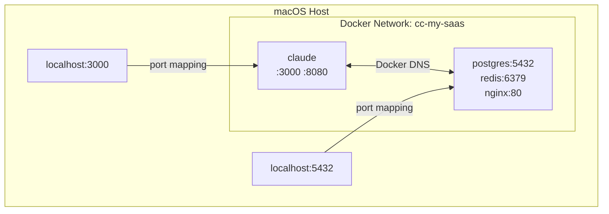

# Docker Specification

> Version: 1.0.0
> Status: v1.0 — Current
> Related: [architecture.md](../architecture.md) | [spec.md](../spec.md)

---

## 1. Docker Image

### 1.1 Dockerfile

```dockerfile
FROM node:22-bookworm

# ── System dependencies ──────────────────────────────────────────────
RUN apt-get update && apt-get install -y \
    git tmux jq ripgrep fzf curl wget \
    python3 python3-pip openssh-client socat less vim \
    && rm -rf /var/lib/apt/lists/*

# ── Locale (UTF-8 support) ──────────────────────────────────────────
RUN apt-get update && apt-get install -y locales \
    && sed -i 's/^# *\(en_US.UTF-8\)/\1/' /etc/locale.gen \
    && locale-gen \
    && rm -rf /var/lib/apt/lists/*
ENV LANG=en_US.UTF-8
ENV LC_ALL=en_US.UTF-8

# ── Docker CLI (for Docker-from-Docker) ──────────────────────────────
RUN install -m 0755 -d /etc/apt/keyrings \
    && curl -fsSL https://download.docker.com/linux/debian/gpg -o /etc/apt/keyrings/docker.asc \
    && chmod a+r /etc/apt/keyrings/docker.asc \
    && echo "deb [arch=$(dpkg --print-architecture) signed-by=/etc/apt/keyrings/docker.asc] \
       https://download.docker.com/linux/debian $(. /etc/os-release && echo "$VERSION_CODENAME") stable" \
       > /etc/apt/sources.list.d/docker.list \
    && apt-get update \
    && apt-get install -y docker-ce-cli docker-compose-plugin \
    && rm -rf /var/lib/apt/lists/*

# ── GitHub CLI ─────────────────────────────────────────────────────
RUN curl -fsSL https://cli.github.com/packages/githubcli-archive-keyring.gpg \
        -o /usr/share/keyrings/githubcli-archive-keyring.gpg \
    && echo "deb [arch=$(dpkg --print-architecture) \
       signed-by=/usr/share/keyrings/githubcli-archive-keyring.gpg] \
       https://cli.github.com/packages stable main" \
       > /etc/apt/sources.list.d/github-cli.list \
    && apt-get update && apt-get install -y gh \
    && rm -rf /var/lib/apt/lists/*

# ── gosu (drop-in su replacement for Docker entrypoints) ─────────────
# gosu does a direct exec without creating a new session/pty, so TTY
# passthrough works correctly — unlike su/sudo which break stdin forwarding.
RUN arch="$(dpkg --print-architecture)" \
    && curl -fsSL "https://github.com/tianon/gosu/releases/download/1.17/gosu-${arch}" \
       -o /usr/local/bin/gosu \
    && chmod +x /usr/local/bin/gosu \
    && gosu nobody true

# ── Claude Code ──────────────────────────────────────────────────────
# Pin version for reproducible builds: cco build --claude-version 1.0.x
ARG CLAUDE_CODE_VERSION=latest
RUN npm install -g @anthropic-ai/claude-code@${CLAUDE_CODE_VERSION}
ENV CLAUDE_CODE_DISABLE_AUTOUPDATE=1

# ── MCP Server packages (optional pre-installation) ──────────────────
ARG MCP_PACKAGES=""
RUN if [ -n "$MCP_PACKAGES" ]; then npm install -g $MCP_PACKAGES; fi

# ── User setup script (global, build time) ─────────────────────────
# Custom system-level setup. Pass content via: cco build (auto-reads global/setup.sh)
ARG SETUP_SCRIPT_CONTENT=""
RUN if [ -n "$SETUP_SCRIPT_CONTENT" ]; then \
        printf '%s' "$SETUP_SCRIPT_CONTENT" > /tmp/setup.sh \
        && bash /tmp/setup.sh \
        && rm -f /tmp/setup.sh; \
    fi

# ── User setup ───────────────────────────────────────────────────────
# Pre-create docker group with placeholder GID (adjusted at runtime by entrypoint)
RUN groupadd -g 999 docker \
    && useradd -m -s /bin/bash claude \
    && mkdir -p /home/claude/.claude /workspace \
    && chown -R claude:claude /home/claude /workspace

# ── Config files ─────────────────────────────────────────────────────
COPY config/tmux.conf /home/claude/.tmux.conf
COPY config/entrypoint.sh /usr/local/bin/entrypoint.sh
COPY config/hooks/ /usr/local/bin/cco-hooks/
RUN chown claude:claude /home/claude/.tmux.conf \
    && chmod +x /usr/local/bin/entrypoint.sh \
    && chmod +x /usr/local/bin/cco-hooks/*.sh

WORKDIR /workspace

ENTRYPOINT ["/usr/local/bin/entrypoint.sh"]
```

### 1.2 Entrypoint Script

The entrypoint handles Docker socket permissions, GitHub/git authentication, MCP server injection, project setup scripts, per-project MCP packages, and launches Claude Code via `gosu` with optional tmux wrapping.

```bash
#!/bin/bash
set -e

# ── Docker socket permissions ────────────────────────────────────────
# Match container's docker group GID to host's socket GID.
# The docker group is pre-created in the Dockerfile (GID 999 placeholder).
# Here we adjust its GID to match the host socket.
if [ -S /var/run/docker.sock ]; then
    SOCKET_GID=$(stat -c '%g' /var/run/docker.sock)
    if [ "$SOCKET_GID" != "0" ]; then
        if getent group docker > /dev/null 2>&1; then
            CURRENT_GID=$(getent group docker | cut -d: -f3)
            if [ "$CURRENT_GID" != "$SOCKET_GID" ]; then
                groupmod -g "$SOCKET_GID" docker
            fi
        else
            groupadd -g "$SOCKET_GID" docker
        fi
        usermod -aG docker claude
    else
        # Socket owned by root — add claude to root group (common on macOS)
        usermod -aG root claude
    fi
fi

# ── Ensure ~/.claude.json exists and is writable ─────────────────────
# Mounted from global/claude-state/claude.json (shared across all projects).
# Initialized on host by cmd_start before container starts.
# On macOS, OAuth tokens are stored in Keychain — not in ~/.claude.json —
# so seeding from host is not applicable. Login once from inside the container;
# Claude writes tokens here and they persist across all sessions.
CLAUDE_JSON="/home/claude/.claude.json"
MCP_GLOBAL="/home/claude/.claude/mcp-global.json"
MCP_PROJECT="/workspace/.mcp.json"

if [ ! -f "$CLAUDE_JSON" ]; then
    echo '{}' > "$CLAUDE_JSON"
fi
chown claude:claude "$CLAUDE_JSON"

# ── MCP server injection into ~/.claude.json ─────────────────────────
# Claude Code reads user-scope MCP from ~/.claude.json mcpServers key.
# This is the most reliable mechanism (vs .mcp.json which needs approval).
# We merge both global MCP (mounted as mcp-global.json) and project MCP
# (mounted as /workspace/.mcp.json) into ~/.claude.json.

# Merge global MCP servers (from global/.claude/mcp.json)
if [ -f "$MCP_GLOBAL" ]; then
    server_count=$(jq '.mcpServers | length' "$MCP_GLOBAL" 2>/dev/null || echo "0")
    if [ "$server_count" -gt 0 ]; then
        merged=$(jq -s '.[0] * {mcpServers: ((.[0].mcpServers // {}) + (.[1].mcpServers // {}))}' \
            "$CLAUDE_JSON" "$MCP_GLOBAL" 2>/dev/null) && echo "$merged" > "$CLAUDE_JSON"
        echo "[entrypoint] Merged $server_count global MCP server(s) into ~/.claude.json" >&2
    fi
fi

# Merge project MCP servers (from projects/<name>/mcp.json mounted at /workspace/.mcp.json)
# This provides a reliable fallback: servers are in both .mcp.json (project scope)
# AND ~/.claude.json (user scope), so at least one mechanism will work.
if [ -f "$MCP_PROJECT" ]; then
    # .mcp.json uses {mcpServers: {...}} format
    server_count=$(jq '.mcpServers | length' "$MCP_PROJECT" 2>/dev/null || echo "0")
    if [ "$server_count" -gt 0 ]; then
        merged=$(jq -s '.[0] * {mcpServers: ((.[0].mcpServers // {}) + (.[1].mcpServers // {}))}' \
            "$CLAUDE_JSON" "$MCP_PROJECT" 2>/dev/null) && echo "$merged" > "$CLAUDE_JSON"
        echo "[entrypoint] Merged $server_count project MCP server(s) into ~/.claude.json" >&2
    fi
fi

# ── GitHub / Git authentication ───────────────────────────────────
# Authenticate gh CLI and configure git credential helper if GITHUB_TOKEN is set.
# This enables: git push (HTTPS), gh pr create, and MCP GitHub server.
if [ -n "${GITHUB_TOKEN:-}" ]; then
    echo "$GITHUB_TOKEN" | gosu claude gh auth login --with-token 2>&1 >&2 \
        && echo "[entrypoint] GitHub: authenticated gh CLI via GITHUB_TOKEN" >&2
    gosu claude gh auth setup-git 2>&1 >&2 \
        && echo "[entrypoint] GitHub: configured git credential helper" >&2
fi

# ── Project setup script (runtime) ───────────────────────────────
PROJECT_SETUP="/workspace/setup.sh"
if [ -f "$PROJECT_SETUP" ]; then
    echo "[entrypoint] Running project setup script..." >&2
    bash "$PROJECT_SETUP" 2>&1 >&2
    echo "[entrypoint] Project setup complete" >&2
fi

# ── Per-project MCP packages (runtime) ───────────────────────────
PROJECT_MCP_PACKAGES="/workspace/mcp-packages.txt"
if [ -f "$PROJECT_MCP_PACKAGES" ]; then
    pkg_count=$(grep -cv '^\s*$\|^\s*#' "$PROJECT_MCP_PACKAGES" 2>/dev/null || true)
    pkg_count=${pkg_count:-0}
    if [ "$pkg_count" -gt 0 ]; then
        echo "[entrypoint] Installing $pkg_count project MCP package(s)..." >&2
        grep -v '^\s*$\|^\s*#' "$PROJECT_MCP_PACKAGES" | \
            xargs gosu claude npm install -g 2>&1 >&2
        echo "[entrypoint] Project MCP packages installed" >&2
    fi
fi

# ── Debug: log env vars and auth state ────────────────────────────────
echo "[entrypoint] TEAMMATE_MODE=${TEAMMATE_MODE:-unset}" >&2
echo "[entrypoint] ANTHROPIC_API_KEY=${ANTHROPIC_API_KEY:+SET}" >&2

# ── Switch to claude user and launch ─────────────────────────────────
# gosu does exec directly without creating a new session, preserving
# TTY/stdin so Claude Code's interactive UI works correctly.
if [ "${TEAMMATE_MODE}" = "tmux" ] && [ -z "$TMUX" ]; then
    set +e
    gosu claude tmux new-session -s claude "claude --dangerously-skip-permissions $*"
    exit_code=$?
    set -e
    [ $exit_code -ne 0 ] && echo "[entrypoint] claude exited with code ${exit_code}" >&2
    exit $exit_code
else
    exec gosu claude claude --dangerously-skip-permissions "$@"
fi
```

**Key implementation choices**:
- **gosu** instead of `su` — `su` creates a new session/PTY that breaks stdin forwarding. `gosu` does a direct `exec`, preserving TTY passthrough.
- **MCP injection** — global and project MCP servers are merged into `~/.claude.json` via `jq -s`. This is the most reliable mechanism (vs `.mcp.json` which may need approval).
- **GitHub auth** — `GITHUB_TOKEN` env var drives `gh auth login --with-token` + `gh auth setup-git`, enabling HTTPS push and `gh` CLI commands.
- **Project setup** — optional `setup.sh` and `mcp-packages.txt` run at container startup for per-project customization.
- **Error handling** — tmux path captures exit code explicitly (tmux doesn't propagate it via `exec`).

### 1.3 tmux Configuration

```tmux
# config/tmux.conf

# ── Terminal ─────────────────────────────────────────────────────────
set -g default-terminal "tmux-256color"
set -ga terminal-overrides ",xterm-256color:Tc"

# ── Clipboard ────────────────────────────────────────────────────────
set -g set-clipboard on         # OSC 52: apps and tmux copy-mode → host clipboard
set -g allow-passthrough on     # DCS passthrough for iTerm2 inline images, etc.
set -as terminal-features ",xterm-256color:clipboard"

# ── Mouse ────────────────────────────────────────────────────────────
set -g mouse on

# ── Copy mode ────────────────────────────────────────────────────────
setw -g mode-keys vi
bind-key -T copy-mode-vi v send-keys -X begin-selection
bind-key -T copy-mode-vi C-v send-keys -X rectangle-toggle
bind-key -T copy-mode-vi y send-keys -X copy-selection-and-cancel
bind-key -T copy-mode-vi MouseDragEnd1Pane send-keys -X copy-pipe-and-cancel

# ── Status bar ───────────────────────────────────────────────────────
set -g status-style "bg=#1a1b26,fg=#a9b1d6"
set -g status-left "#[fg=#7aa2f7,bold] #{session_name} "
set -g status-left-length 30
set -g status-right "#[fg=#565f89] %H:%M "

# ── Pane borders ─────────────────────────────────────────────────────
set -g pane-border-style "fg=#3b4261"
set -g pane-active-border-style "fg=#7aa2f7"
set -g pane-border-indicators colour

# ── Navigation ───────────────────────────────────────────────────────
bind -n M-Left select-pane -L
bind -n M-Right select-pane -R
bind -n M-Up select-pane -U
bind -n M-Down select-pane -D

# ── History ──────────────────────────────────────────────────────────
set -g history-limit 50000

# ── Quality of life ──────────────────────────────────────────────────
set -g escape-time 0
set -g focus-events on
set -g base-index 1
setw -g pane-base-index 1
```

Key settings for clipboard:
- `set-clipboard on` — enables OSC 52 passthrough from applications and tmux copy-mode to the host terminal's clipboard
- `allow-passthrough on` — enables DCS passthrough for iTerm2 inline images and similar sequences
- `terminal-features clipboard` — explicit clipboard capability (works even when outer TERM is not `xterm*`)
- `MouseDragEnd1Pane copy-pipe-and-cancel` — auto-copies selection on mouse release (no manual `y` press needed)

See [agent-teams guide](../../user-guides/agent-teams.md) §2.4 for copy-paste usage and host terminal compatibility.

---

## 2. Docker Compose

### 2.1 Base Template

Each project gets a `docker-compose.yml` generated from `project.yml`. Here is the annotated structure:

```yaml
# projects/<project-name>/docker-compose.yml
# AUTO-GENERATED from project.yml — edits will be overwritten on next `cco start`

services:
  claude:
    image: claude-orchestrator:latest
    build:
      context: ../../                          # repo root (for Dockerfile)
      dockerfile: Dockerfile
    container_name: cc-${PROJECT_NAME}
    stdin_open: true                           # -i (interactive)
    tty: true                                  # -t (terminal)

    # ── Environment ──────────────────────────────────────────────────
    environment:
      - PROJECT_NAME=${PROJECT_NAME}
      - TEAMMATE_MODE=${TEAMMATE_MODE:-tmux}
      # Agent teams
      - CLAUDE_CODE_EXPERIMENTAL_AGENT_TEAMS=1
      # Disable auto memory directory issues (we mount it explicitly)
      # Auth via API key (if not using OAuth)
      # - ANTHROPIC_API_KEY=${ANTHROPIC_API_KEY}

    # ── Volumes ──────────────────────────────────────────────────────
    volumes:
      # --- Auth & credentials ---
      - ${GLOBAL_DIR}/claude-state/claude.json:/home/claude/.claude.json
      - ${GLOBAL_DIR}/claude-state/.credentials.json:/home/claude/.claude/.credentials.json

      # --- Global config → user-level (~/.claude/) ---
      # Paths are absolute, resolved by cco CLI from GLOBAL_DIR
      - ${GLOBAL_DIR}/.claude/settings.json:/home/claude/.claude/settings.json:ro
      - ${GLOBAL_DIR}/.claude/CLAUDE.md:/home/claude/.claude/CLAUDE.md:ro
      - ${GLOBAL_DIR}/.claude/rules:/home/claude/.claude/rules:ro
      - ${GLOBAL_DIR}/.claude/agents:/home/claude/.claude/agents:ro
      - ${GLOBAL_DIR}/.claude/skills:/home/claude/.claude/skills:ro
      - ${GLOBAL_DIR}/.claude/mcp.json:/home/claude/.claude/mcp-global.json:ro

      # --- Project config ---
      - ./.claude:/workspace/.claude
      - ./project.yml:/workspace/project.yml:ro

      # --- Claude state: auto memory + session transcripts ---
      - ./claude-state:/home/claude/.claude/projects/-workspace

      # --- Repositories ---
      # (generated from project.yml repos list)
      # - /Users/user/projects/backend-api:/workspace/backend-api
      # - /Users/user/projects/frontend-app:/workspace/frontend-app

      # --- Git config ---
      - ${HOME}/.gitconfig:/home/claude/.gitconfig:ro

      # --- Conditional mounts (added by cco start when files exist) ---
      # - ./setup.sh:/workspace/setup.sh:ro
      # - ./mcp-packages.txt:/workspace/mcp-packages.txt:ro

      # --- (conditional) Docker socket (Docker-from-Docker) ---
      # Omitted when docker.mount_socket: false in project.yml
      - /var/run/docker.sock:/var/run/docker.sock

    # ── Ports ────────────────────────────────────────────────────────
    # Common dev server ports. Customize in project.yml.
    ports:
      - "3000:3000"     # Frontend dev server
      - "3001:3001"     # Backend dev server
      - "4000:4000"     # GraphQL
      - "5173:5173"     # Vite
      - "8000:8000"     # Python/Django
      - "8080:8080"     # Generic

    # ── Network ──────────────────────────────────────────────────────
    networks:
      - cc-${PROJECT_NAME}

    working_dir: /workspace

# ── Networks ─────────────────────────────────────────────────────────
# Named network for this project. Sibling containers (postgres, redis, etc.)
# launched by Claude via docker compose will join this network.
networks:
  cc-${PROJECT_NAME}:
    name: cc-${PROJECT_NAME}
    driver: bridge
```

### 2.2 Volume Mount Strategy

```
HOST                                    CONTAINER                       PURPOSE
──────────────────────────────────────────────────────────────────────────────────
user-config/global/claude-state/claude.json      → ~/.claude.json                   Auth state (rw)
user-config/global/claude-state/.credentials.json→ ~/.claude/.credentials.json      OAuth credentials (rw)
$GLOBAL_DIR/.claude/settings.json    → ~/.claude/settings.json          Global settings (ro)
$GLOBAL_DIR/.claude/CLAUDE.md        → ~/.claude/CLAUDE.md              Global instructions (ro)
$GLOBAL_DIR/.claude/rules/           → ~/.claude/rules/                 Global rules (ro)
$GLOBAL_DIR/.claude/agents/          → ~/.claude/agents/                Global subagents (ro)
$GLOBAL_DIR/.claude/skills/          → ~/.claude/skills/                Global skills (ro)
$GLOBAL_DIR/.claude/mcp.json         → ~/.claude/mcp-global.json        Global MCP config (ro)
user-config/projects/<n>/.claude/                → /workspace/.claude/              Project context (rw)
user-config/projects/<n>/project.yml             → /workspace/project.yml           Project config (ro)
user-config/projects/<n>/claude-state/           → ~/.claude/projects/-workspace/   Memory + transcripts (rw)
~/projects/repo-x/                   → /workspace/repo-x/               Repository (rw)
~/.gitconfig                         → ~/.gitconfig                      Git config (ro)
user-config/projects/<n>/setup.sh                → /workspace/setup.sh              Project setup (conditional, ro)
user-config/projects/<n>/mcp-packages.txt        → /workspace/mcp-packages.txt      MCP packages (conditional, ro)
/var/run/docker.sock                 → /var/run/docker.sock              Docker socket (conditional)
```

**Read-only vs Read-write**:
- `ro`: Config that should not be modified by the agent (global settings, git config)
- `rw` (default): Repos (Claude writes code), project .claude/ (Claude may update), memory (Claude writes)
- **`~/.claude.json`**: Mounted read-write from `user-config/global/claude-state/claude.json`. Shared across all projects. On macOS, OAuth tokens live in Keychain — this file holds other Claude state.

---

## 3. Networking

### 3.1 macOS Docker Desktop Networking Model

Docker Desktop for Mac runs Docker inside a Linux VM. This has implications:

| Feature | Behavior on macOS |
|---------|-------------------|
| `network_mode: host` | Refers to the Linux VM, NOT macOS. **Don't use.** |
| Port mapping (`-p 3000:3000`) | Routes macOS localhost → container. **Use this.** |
| `host.docker.internal` | Resolves to macOS host IP from inside any container. |
| Container-to-container | Use shared Docker network with service discovery. |

### 3.2 Networking Strategy



**Key rules**:
1. Claude container and sibling containers join the same named network (`cc-<project>`)
2. Container-to-container communication uses Docker DNS (service names)
3. macOS access uses port mappings defined in docker-compose
4. Claude reaches macOS host services via `host.docker.internal`

### 3.3 Sibling Container Management

When Claude runs `docker compose up` for infrastructure:

1. The docker-compose file SHOULD specify the project's network as external:
   ```yaml
   networks:
     default:
       external: true
       name: cc-my-saas
   ```

2. This ensures sibling containers join the same network as the Claude container

3. The CLAUDE.md project instructions should include guidance on using the project network:
   ```markdown
   When running docker compose for infrastructure, use the network `cc-<project-name>`.
   Set it as external in the docker-compose file.
   ```

### 3.4 Port Allocation

Default port ranges in docker-compose, customizable per project:

| Range | Purpose |
|-------|---------|
| 3000-3099 | Frontend dev servers |
| 4000-4099 | API servers |
| 5173 | Vite |
| 5432 | PostgreSQL |
| 6379 | Redis |
| 8000-8099 | Python/Go servers |
| 8080-8099 | Generic HTTP |
| 27017 | MongoDB |

Projects specify needed ports in `project.yml` under `docker.ports`.

---

## 4. Image Build

### 4.1 Build Command

```bash
# From repo root
docker build -t claude-orchestrator:latest .

# Or via CLI
cco build
```

### 4.2 Build Caching

The Dockerfile is ordered for optimal layer caching:
1. System packages (changes rarely)
2. Docker CLI (changes rarely)
3. Claude Code npm install (changes with updates)
4. User setup and config (changes when config changes)

### 4.3 Updating Claude Code

To update Claude Code in the image:
```bash
cco build --no-cache
```

To pin a specific version for reproducible builds:
```bash
cco build --claude-version 1.0.5
```

The Dockerfile uses `ARG CLAUDE_CODE_VERSION=latest` — when no version is specified, the latest is installed. `CLAUDE_CODE_DISABLE_AUTOUPDATE=1` prevents Claude Code from self-updating inside the container.

---

## 5. Container Lifecycle

### 5.1 Start

```bash
# Via CLI
cco start my-project

# Equivalent docker command
docker compose -f projects/my-project/docker-compose.yml \
  run --rm --service-ports claude
```

The `--rm` flag ensures the container is removed after exit.
The `--service-ports` flag ensures port mappings are active.

### 5.2 During Session

- Container runs Claude Code interactively
- User interacts via terminal (stdin/stdout attached)
- Claude creates files, runs commands, manages git — all inside mounted volumes
- Changes are immediately visible on host (volume mounts)

### 5.3 Stop

- User exits Claude Code (Ctrl+C, `/exit`, or closing terminal)
- Container is removed (`--rm`)
- All file changes persist via volume mounts
- Auto memory persists in `user-config/projects/<n>/claude-state/memory/`
- Git commits persist in the repos

### 5.4 Cleanup

```bash
# Stop all running sessions
cco stop

# Remove project network
docker network rm cc-my-project

# Remove sibling containers (if Claude left them running)
docker compose -f /path/to/infra/docker-compose.yml down
```

---

## 6. Directory Structure & File Inventory

### 6.1 Complete File Tree

```
claude-orchestrator/
│
├── docs/                                   # ── Documentation ──────────────
│   ├── README.md                           # Documentation index
│   ├── getting-started/
│   │   ├── overview.md                    # What it is, how it works
│   │   ├── installation.md                # Setup and usage guide
│   │   ├── first-project.md               # Step-by-step first project
│   │   └── concepts.md                    # Key concepts
│   ├── user-guides/
│   │   ├── project-setup.md               # Project setup guide
│   │   ├── agent-teams.md                 # tmux vs iTerm2 setup
│   │   └── advanced/
│   │       └── subagents.md               # Custom subagents guide
│   ├── reference/
│   │   ├── cli.md                         # CLI commands & project.yml format
│   │   └── context-hierarchy.md           # Context hierarchy & settings
│   └── maintainer/
│       ├── spec.md                        # Requirements specification
│       ├── architecture.md               # Architecture & design decisions
│       ├── docker/design.md              # This file (incl. directory structure)
│       └── roadmap.md                     # Planned features
│
├── Dockerfile                              # Docker image definition
├── .dockerignore                           # Exclude docs, .git from build context
├── .gitignore                              # Ignore user config, secrets
├── README.md                               # Project overview
├── docs/getting-started/installation.md    # Setup and usage guide
├── CLAUDE.md                               # Claude Code guidance for this repo
│
├── config/                                 # ── Docker Config ──────────────
│   ├── entrypoint.sh                       # Container entrypoint script
│   ├── tmux.conf                           # tmux config for agent teams
│   └── hooks/
│       ├── session-context.sh             # SessionStart hook: injects repo/MCP context
│       ├── subagent-context.sh            # SubagentStart hook: condensed context for subagents
│       ├── precompact.sh                  # PreCompact hook: guides context compaction
│       └── statusline.sh                  # StatusLine hook: shows model/context/cost
│
├── bin/                                    # ── CLI ────────────────────────
│   └── cco                                 # Main CLI script (bash)
│
├── defaults/                               # ── TOOL DEFAULTS (tracked) ────
│   ├── managed/                            # Framework infrastructure (baked in Docker image → /etc/claude-code/)
│   │   ├── managed-settings.json           # Hooks, env vars, deny rules, statusLine (non-overridable)
│   │   ├── CLAUDE.md                       # Framework instructions (Docker env, workspace, agent teams)
│   │   └── .claude/skills/
│   │       └── init-workspace/SKILL.md     # /init-workspace skill (managed, non-overridable)
│   ├── global/                             # User defaults (copied once by cco init → ~/.claude/)
│   │   └── .claude/
│   │       ├── CLAUDE.md                   # Global workflow instructions
│   │       ├── settings.json               # User preferences (allow rules, attribution, teammateMode)
│   │       ├── mcp.json                    # Empty MCP server list (user populates)
│   │       ├── rules/
│   │       │   ├── workflow.md             # Development workflow phases
│   │       │   ├── git-practices.md        # Git conventions
│   │       │   ├── diagrams.md             # Mermaid diagram conventions
│   │       │   └── language.md             # Language preferences (with {{LANG}} vars)
│   │       ├── agents/
│   │       │   ├── analyst.md              # Analysis specialist (haiku, read-only)
│   │       │   └── reviewer.md             # Code review specialist (sonnet, read-only)
│   │       └── skills/
│   │           ├── analyze/SKILL.md        # /analyze skill
│   │           ├── commit/SKILL.md         # /commit skill
│   │           ├── design/SKILL.md         # /design skill
│   │           └── review/SKILL.md         # /review skill
│   └── _template/                          # Default project template
│       ├── project.yml                     # Project metadata & config (with comments)
│       ├── .claude/
│       │   ├── CLAUDE.md                   # Project instructions template ({{PLACEHOLDERS}})
│       │   ├── settings.json               # Project settings template (empty, overrides go here)
│       │   ├── rules/
│       │   │   └── language.md             # Language override (commented out by default)
│       │   ├── agents/.gitkeep             # Project-specific agents
│       │   └── skills/.gitkeep             # Project-specific skills
│       └── claude-state/                   # Claude state dir placeholder
│           ├── .gitkeep
│           └── memory/.gitkeep             # Auto memory subdir placeholder
│
└── user-config/                            # ── USER CONFIG (gitignored) ───
    ├── global/                             # Global Claude config
    │   └── .claude/                        # User defaults from defaults/global/ (copied once on cco init)
    │       ├── settings.json               # Customized by user
    │       ├── CLAUDE.md                   # Customized by user
    │       ├── mcp.json                    # Global MCP servers
    │       ├── rules/                      # User rule files
    │       ├── agents/                     # User global agents
    │       └── skills/                     # User global skills
    │
    │   (optional, in global/)
    │   ├── secrets.env                     # Sensitive env vars (loaded at runtime)
    │   └── mcp-packages.txt               # MCP npm packages to pre-install in image
    │
    ├── projects/                           # Per-project configurations
    │   └── <project-name>/                 # Created by `cco project create`
    │       ├── project.yml                 # Source of truth for the project
    │       ├── .claude/
    │       │   ├── CLAUDE.md               # Project-specific instructions
    │       │   ├── settings.json           # Project-specific settings overrides
    │       │   ├── packs.md                # Auto-generated instructional file list (by cco start)
    │       │   ├── workspace.yml           # Auto-generated project structure summary (by cco start)
    │       │   ├── rules/                  # Project-specific rules
    │       │   ├── agents/                 # Project-specific agents
    │       │   └── skills/                 # Project-specific skills
    │       ├── claude-state/               # Claude state: memory + session transcripts (mounted to ~/.claude/projects/-workspace/)
    │       │   └── memory/                 # Auto memory subdir
    │       ├── mcp.json                    # Optional project-level MCP servers
    │       └── docker-compose.yml          # Auto-generated by `cco start` (not committed)
    │
    ├── packs/                              # Knowledge packs
    │   └── <pack-name>/
    │       ├── pack.yml                    # Pack manifest (knowledge, skills, agents, rules)
    │       ├── knowledge/                  # Optional: pack's own knowledge files (no source:)
    │       ├── skills/                     # Optional: skills mounted read-only into projects
    │       ├── agents/                     # Optional: agents mounted read-only into projects
    │       └── rules/                      # Optional: rules mounted read-only into projects
    │
    ├── templates/                          # Project templates
    └── manifest.yml                        # Manifest for sharing via Config Repos
```

### 6.2 File Descriptions

#### Root Files

| File | Purpose | Notes |
|------|---------|-------|
| `Dockerfile` | Docker image definition | See §1.1 |
| `.dockerignore` | Exclude files from Docker build context | Excludes: `docs/`, `.git/`, `projects/*/claude-state/` |
| `.gitignore` | Git ignore patterns | Ignores: `user-config/` (user data), `.env` |
| `README.md` | Project overview and documentation index | What it is, how it works, requirements |
| `docs/getting-started/installation.md` | Setup and usage guide | Clone, init, create project, start session |
| `CLAUDE.md` | Guidance for Claude Code when working on this repo | Commands, architecture, conventions |

#### config/

| File | Purpose | Notes |
|------|---------|-------|
| `entrypoint.sh` | Container entrypoint | Docker socket perms, MCP injection, gosu, tmux launch. See §1.2 |
| `tmux.conf` | tmux configuration | Colors, navigation, history, mouse. See §1.3 |
| `hooks/session-context.sh` | SessionStart hook | Discovers repos, counts MCP servers, injects context JSON |
| `hooks/subagent-context.sh` | SubagentStart hook | Condensed project context for subagents |
| `hooks/precompact.sh` | PreCompact hook | Guides context compaction (what to preserve) |
| `hooks/statusline.sh` | StatusLine hook | Reads session JSON, displays `[project] model \| ctx XX% \| $cost` |

#### bin/

| File | Purpose | Notes |
|------|---------|-------|
| `cco` | CLI entrypoint | Dispatcher (~100 lines) that sources `lib/*.sh` modules. See [cli.md](../../reference/cli.md) |

#### defaults/managed/

Framework infrastructure files, baked into the Docker image at `/etc/claude-code/`. Non-overridable by users — this is Claude Code's Managed level. Updated only via `cco build`.

| File | Purpose | Notes |
|------|---------|-------|
| `managed-settings.json` | Framework settings | Hooks (SessionStart, SubagentStart, PreCompact), env vars, statusLine, deny rules |
| `CLAUDE.md` | Framework instructions | Docker environment, workspace layout, agent team behavior |
| `.claude/skills/init-workspace/SKILL.md` | `/init-workspace` skill | Initialize/refresh project CLAUDE.md. Managed: non-overridable, updated via `cco build` |

#### defaults/global/.claude/

User defaults, copied to `user-config/global/.claude/` once by `cco init`. User owns these files after the initial copy. Not overwritten unless `cco init --force` is used. This includes agents, skills, rules, and settings that users can freely customize.

| File | Purpose | Notes |
|------|---------|-------|
| `CLAUDE.md` | User-level instructions | Workflow, git practices, communication style |
| `settings.json` | User preferences | Allow rules, attribution, teammateMode, cleanup, MCP settings |
| `mcp.json` | Global MCP server list | Empty by default; user populates. See [context-hierarchy.md](../../reference/context-hierarchy.md) §8 |
| `rules/workflow.md` | Workflow phase rules | Analysis, Design, Implementation, Documentation phases |
| `rules/git-practices.md` | Git conventions | Branch naming, conventional commits |
| `rules/diagrams.md` | Diagram conventions | Always use Mermaid, never ASCII art |
| `rules/language.md` | Language preferences | Has `{{COMM_LANG}}`, `{{DOCS_LANG}}`, `{{CODE_LANG}}` placeholders, substituted by `cco init --lang` |
| `agents/analyst.md` | Analyst subagent | Haiku, read-only tools, user memory. See [subagents.md](../../user-guides/advanced/subagents.md) §2.1 |
| `agents/reviewer.md` | Reviewer subagent | Sonnet, read-only tools, user memory. See [subagents.md](../../user-guides/advanced/subagents.md) §2.2 |
| `skills/analyze/SKILL.md` | `/analyze` skill | Structured codebase exploration mode |
| `skills/commit/SKILL.md` | `/commit` skill | Conventional commit creation with confirmation |
| `skills/design/SKILL.md` | `/design` skill | Implementation planning mode |
| `skills/review/SKILL.md` | `/review` skill | Structured code review with checklist |

#### defaults/_template/

Default project template, used by `cco project create` to scaffold new projects.

| File | Purpose | Notes |
|------|---------|-------|
| `project.yml` | Project config template | Repos, ports, auth, packs. See [cli.md](../../reference/cli.md) §4 |
| `.claude/CLAUDE.md` | Project instructions template | `{{PROJECT_NAME}}` and `{{DESCRIPTION}}` placeholders |
| `.claude/settings.json` | Project settings template | Empty; project-specific overrides go here |
| `.claude/rules/language.md` | Language override template | Commented out by default; uncomment to override global |
| `.claude/agents/.gitkeep` | Placeholder | Project-specific agents |
| `.claude/skills/.gitkeep` | Placeholder | Project-specific skills |
| `claude-state/.gitkeep` | Claude state dir | Mounted to `~/.claude/projects/workspace/`; persists memory and session transcripts |
| `claude-state/memory/.gitkeep` | Auto memory subdir | Created empty; Claude populates with project insights |

### 6.3 Generated Files (Not in Git)

These files are generated by the CLI or Claude Code and must not be committed:

| File | Generated By | Purpose |
|------|-------------|---------|
| `user-config/projects/<n>/docker-compose.yml` | `cco start` | Docker Compose config for the project session |
| `user-config/projects/<n>/.claude/packs.md` | `cco start` | Instructional file list for activated knowledge packs; injected via hook |
| ~~`.pack-manifest`~~ | ~~`cco start`~~ | Eliminated by ADR-14 — pack resources are now delivered via read-only Docker volume mounts, not copied |
| `user-config/projects/<n>/.claude/workspace.yml` | `cco start` | Structured project summary (repos, packs); read by `/init-workspace` skill |
| `user-config/global/.claude/.managed-migration-done` | `_migrate_to_managed()` | Marker indicating managed scope migration has been completed |
| `user-config/projects/<n>/claude-state/memory/*.md` | Claude Code | Auto memory files (project insights, patterns) |
| `user-config/projects/<n>/claude-state/*.json` | Claude Code | Session transcripts (enables `/resume` across rebuilds) |
| `.env` | User / secrets.env | Runtime secrets (not committed) |

### 6.4 Implementation Order

Recommended order for building the repo from scratch:

| Phase | Files | Depends On |
|-------|-------|------------|
| 1. Docker | `Dockerfile`, `config/entrypoint.sh`, `config/tmux.conf`, `config/hooks/*`, `.dockerignore` | Nothing |
| 2. Global Config | `defaults/managed/*`, `defaults/global/.claude/*` | Nothing |
| 3. Project Template | `defaults/_template/*` (all files) | Nothing |
| 4. CLI | `bin/cco` | Phases 1–3 (needs files to reference) |
| 5. Root Files | `README.md`, `CLAUDE.md`, `.gitignore` | Phases 1–4 |
| 6. Testing | Manual: create project, start session, verify | Phases 1–5 |

### 6.5 Validation Checklist

After implementation (or after significant changes), verify:

- [ ] `cco build` creates the Docker image successfully
- [ ] `cco init` copies user defaults (agents, skills, rules, settings) to user-config/global/ and creates user-config/projects/
- [ ] `cco project create test-project --repo <any-repo>` creates correct project structure
- [ ] `cco start test-project` launches interactive Claude Code session
- [ ] Claude sees global CLAUDE.md (ask: "What are your global instructions?")
- [ ] Claude sees project CLAUDE.md (ask: "What project are you working on?")
- [ ] Claude sees repo `.claude/` when reading repo files (if repo has one)
- [ ] Git operations work inside container (`git commit`, `git push`)
- [ ] Docker commands work inside container (`docker ps`, `docker compose up`)
- [ ] Port mapping works (run `npx serve` on port 3000, access from host browser)
- [ ] Agent teams create panes (visible in tmux or iTerm2)
- [ ] Auto memory persists across sessions (check `user-config/projects/<n>/claude-state/memory/`)
- [ ] `/resume` works after `cco build --no-cache` (session transcripts in `user-config/projects/<n>/claude-state/`)
- [ ] Knowledge packs: `packs.md` is generated with correct instructional list on `cco start`
- [ ] Knowledge packs: `additionalContext` contains pack file list (check Claude's initial context)
- [ ] `workspace.yml` is generated at `user-config/projects/<n>/.claude/workspace.yml` on `cco start`
- [ ] SessionStart hook fires and injects context (visible in Claude's initial context)
- [ ] StatusLine shows project/model/context info
- [ ] `cco new --repo <path>` works for temporary sessions
- [ ] `cco stop` stops running sessions cleanly
- [ ] `cco project list` lists available projects with status
