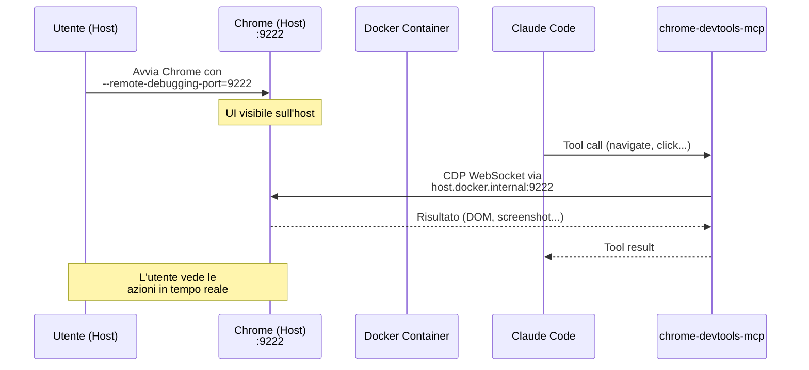
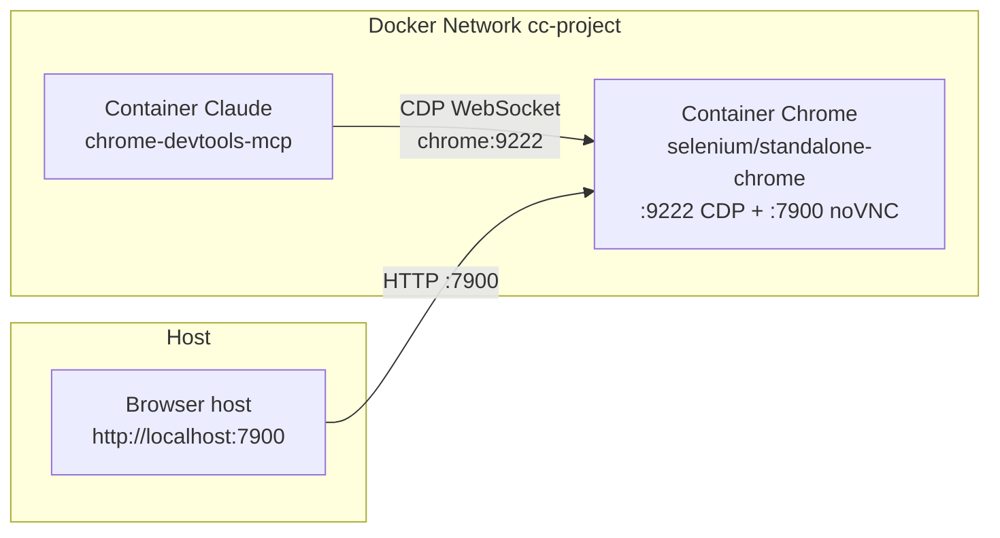
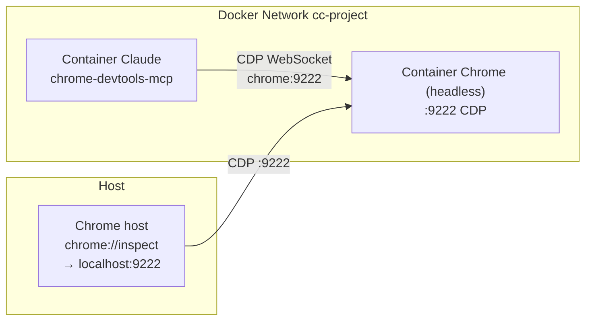

# Analisi: Browser Automation via Chrome DevTools MCP

> **Stato**: Analisi — fase di esplorazione e documentazione dei requisiti
> **Data**: 2026-02-27
> **Scope**: Feature — integrazione browser automation nel container Docker

---

## Indice

1. [Contesto e Motivazione](#1-contesto-e-motivazione)
2. [Comportamento Nativo di Claude Code](#2-comportamento-nativo-di-claude-code)
3. [Vincoli dell'Ambiente Docker](#3-vincoli-dellambiente-docker)
4. [Requisiti](#4-requisiti)
5. [Opzioni di Browser Automation MCP](#5-opzioni-di-browser-automation-mcp)
6. [Architetture Proposte](#6-architetture-proposte)
7. [Raccomandazione](#7-raccomandazione)
8. [Dettagli Tecnici di Implementazione](#8-dettagli-tecnici-di-implementazione)
9. [Considerazioni di Sicurezza](#9-considerazioni-di-sicurezza)
10. [Open Questions](#10-open-questions)

---

## 1. Contesto e Motivazione

claude-orchestrator esegue Claude Code in un container Docker. Per progetti
frontend, la capacità di navigare un browser, testare UI, leggere console log
e fare screenshot è essenziale. Il requisito è:

1. Claude (nel container) controlla un browser via MCP
2. L'utente **vede** il browser nel proprio sistema operativo host con UI
3. La soluzione integra il più possibile le feature native di Claude Code

Nella roadmap, Browser Automation MCP era tra le ultime priorità. Tuttavia
è necessario per testare correttamente i progetti frontend e migliorare il
debugging.

---

## 2. Comportamento Nativo di Claude Code

### 2.1 "Claude in Chrome" — Integrazione Nativa

Claude Code offre un'integrazione browser nativa attivabile con `claude --chrome`
o il comando `/chrome`. Documentata in [Use Claude Code with Chrome](https://code.claude.com/docs/en/chrome.md).

**Architettura nativa:**
```
Chrome Extension ("Claude in Chrome")
    ↕ Chrome Native Messaging API (stdio pipes, IPC locale)
Native Messaging Host (file di config JSON + eseguibile locale)
    ↕ stdio pipes
Claude Code CLI (processo locale)
```

**Capacità native**: navigazione, click, form filling, lettura console, screenshot,
registrazione GIF, accesso ai login sessions dell'utente.

**Requisiti**:
- Chrome o Edge sul sistema locale
- Estensione "Claude in Chrome" v1.0.36+
- Claude Code v2.0.73+
- File di configurazione Native Messaging Host installato localmente:
  - macOS: `~/Library/Application Support/Google/Chrome/NativeMessagingHosts/com.anthropic.claude_code_browser_extension.json`
  - Linux: `~/.config/google-chrome/NativeMessagingHosts/com.anthropic.claude_code_browser_extension.json`

### 2.2 Perché l'Integrazione Nativa NON Funziona da Docker

Il Native Messaging API è **intrinsecamente locale**:

- Comunicazione via **stdio pipes** tra processi sullo stesso filesystem
- Nessun socket TCP in ascolto (confermato: `ss -tlnp | grep claude` non
  restituisce nulla)
- Il discovery dell'estensione si basa su **file di configurazione locali**
  nel filesystem di Chrome
- Non attraversa il boundary del container Docker
- Confermato dal [bug #25506](https://github.com/anthropics/claude-code/issues/25506):
  la funzionalità non è supportata in DevContainer/SSH remoto

**Conclusione**: L'integrazione nativa "Claude in Chrome" non è utilizzabile
nel nostro contesto. Serve un approccio basato su MCP server standalone che
usi un protocollo di rete.

### 2.3 MCP in Claude Code — Configurazione

Claude Code supporta MCP servers con tre transport ([docs MCP](https://code.claude.com/docs/en/mcp.md)):

| Transport | Formato | Caso d'uso |
|-----------|---------|-----------|
| `stdio` | Processo locale, stdin/stdout | Server locali (nel container) |
| `http` | Streamable HTTP | Server remoti |
| `sse` | Server-Sent Events (deprecato) | Legacy |

**Scope di configurazione MCP:**

| Scope | Storage | Uso |
|-------|---------|-----|
| `local` | `.claude/settings.local.json` (nella root progetto, gitignored) | Privato, per progetto |
| `project` | `.mcp.json` nella root progetto | Condiviso via VCS |
| `user` | `~/.claude.json` globale | Tutti i progetti |
| `managed` | `managed-mcp.json` in `/etc/claude-code/` | Framework-level |

Il file `.mcp.json` supporta **variable expansion**: `${VAR}` e `${VAR:-default}`.

---

## 3. Vincoli dell'Ambiente Docker

### 3.1 Vincolo: Isolamento di Rete

Il container Claude Code è isolato dal filesystem e dalla rete dell'host.
La comunicazione con il browser deve avvenire tramite:

- **Porta esposta** (port mapping Docker)
- **Network Docker** (tra container fratelli)
- **`host.docker.internal`** (verso l'host, Docker Desktop)

### 3.2 Vincolo: No GUI nel Container

Il container è basato su `node:22-bookworm` senza X11/Wayland. Non può
mostrare interfacce grafiche direttamente.

### 3.3 Vincolo: macOS Docker Desktop

Su macOS (il target primario di claude-orchestrator):
- `host.docker.internal` risolve automaticamente all'IP dell'host
- `network_mode: host` **non funziona** (si riferisce alla VM Linux, non macOS)
- I port mapping funzionano correttamente

### 3.4 Vincolo: Chrome Host Header

Chrome valida l'header `Host` delle connessioni al debugging port. Se non è
`localhost` o `127.0.0.1`, rifiuta la connessione. Soluzioni:
- Chrome flag `--remote-allow-origins=*` (permissivo ma semplice)
- Reverse proxy che riscrive l'header Host
- Connessione da `localhost` (solo se nello stesso network namespace)

---

## 4. Requisiti

### R1: Claude Controlla il Browser

Claude Code nel container deve poter usare tool MCP per:
- Navigare a URL
- Fare click, compilare form, interagire con la pagina
- Leggere la console del browser (log, errori)
- Fare screenshot
- Eseguire JavaScript nel contesto della pagina
- Ispezionare il traffico di rete

### R2: L'Utente Vede il Browser

L'utente deve visualizzare il browser con UI nel proprio sistema operativo host.
Deve poter vedere le azioni dell'agent in tempo reale.

### R3: Feature Opzionale

Non tutti i progetti necessitano del browser. L'integrazione deve essere
attivabile per progetto, senza impatto sulle sessioni che non la usano.

### R4: Integrazione Nativa

Seguendo il principio fondamentale del progetto, la soluzione deve sfruttare
il più possibile componenti già pronti (MCP server esistenti, protocolli
standard) senza reinventare.

### R5: Semplicità di Setup

L'utente deve poter attivare browser automation con minimo sforzo.
Idealmente un flag in `project.yml` e un singolo comando per avviare Chrome
sull'host.

---

## 5. Opzioni di Browser Automation MCP

### 5.1 Chrome DevTools MCP (Raccomandato)

**Repository**: [ChromeDevTools/chrome-devtools-mcp](https://github.com/ChromeDevTools/chrome-devtools-mcp)
**Autore**: Google (Chrome DevTools team)
**Protocollo**: Chrome DevTools Protocol (CDP) via WebSocket

#### Configurazione MCP

```json
{
  "mcpServers": {
    "chrome-devtools": {
      "command": "npx",
      "args": ["-y", "chrome-devtools-mcp@latest",
               "--browserUrl=http://host.docker.internal:9222"]
    }
  }
}
```

#### Tool Disponibili (29 totali, 6 categorie)

**Input Automation (9)**:

| Tool | Descrizione |
|------|-------------|
| `click` | Click su elementi della pagina |
| `drag` | Operazioni drag-and-drop |
| `fill` | Popola campo form singolo |
| `fill_form` | Compila intero form |
| `handle_dialog` | Gestisce dialog JavaScript (alert, confirm, prompt) |
| `hover` | Trigger stato hover |
| `press_key` | Simula input tastiera |
| `type_text` | Inserisce testo |
| `upload_file` | Upload file |

**Navigation (6)**:

| Tool | Descrizione |
|------|-------------|
| `close_page` | Chiude tab |
| `list_pages` | Lista tab aperti |
| `navigate_page` | Naviga a URL |
| `new_page` | Apre nuova tab |
| `select_page` | Cambia tab attiva |
| `wait_for` | Attende condizione/evento |

**Emulation (2)**:

| Tool | Descrizione |
|------|-------------|
| `emulate` | Simula configurazioni device (CPU, network) |
| `resize_page` | Modifica dimensioni viewport |

**Performance (4)**:

| Tool | Descrizione |
|------|-------------|
| `performance_start_trace` | Inizia registrazione trace |
| `performance_stop_trace` | Ferma registrazione |
| `performance_analyze_insight` | Estrae metriche (LCP, TBT, etc.) |
| `take_memory_snapshot` | Cattura heap snapshot |

**Network (2)**:

| Tool | Descrizione |
|------|-------------|
| `list_network_requests` | Lista richieste di rete |
| `get_network_request` | Dettagli richiesta specifica |

**Debugging (6)**:

| Tool | Descrizione |
|------|-------------|
| `evaluate_script` | Esegue JavaScript nel contesto pagina |
| `get_console_message` | Accede a messaggio console |
| `list_console_messages` | Lista messaggi console |
| `lighthouse_audit` | Audit qualità Lighthouse |
| `take_screenshot` | Screenshot visuale |
| `take_snapshot` | Snapshot DOM (struttura + stili) |

#### Flag di Configurazione Completi

| Flag | Tipo | Default | Descrizione |
|------|------|---------|-------------|
| `--browserUrl` / `-u` | string | — | URL istanza Chrome debuggable |
| `--wsEndpoint` / `-w` | string | — | WebSocket endpoint diretto |
| `--wsHeaders` | JSON string | — | Header custom per WebSocket |
| `--autoConnect` | boolean | false | Auto-connect a Chrome 144+ |
| `--headless` | boolean | false | Chrome senza UI |
| `--executablePath` / `-e` | string | — | Path eseguibile Chrome |
| `--isolated` | boolean | false | Profilo temporaneo |
| `--userDataDir` | string | — | Directory profilo Chrome |
| `--channel` | string | stable | Canale Chrome |
| `--viewport` | string | — | Dimensioni iniziali (es. "1280x720") |
| `--proxyServer` | string | — | Proxy configuration |
| `--acceptInsecureCerts` | boolean | — | Ignora errori certificato |
| `--chromeArg` | string[] | — | Argomenti Chrome aggiuntivi |
| `--slim` | boolean | — | Set minimo: 3 tool (navigate, evaluate, screenshot) |
| `--experimentalScreencast` | boolean | — | Screencast (richiede ffmpeg) |
| `--categoryEmulation` | boolean | true | Abilita tool emulazione |
| `--categoryPerformance` | boolean | true | Abilita tool performance |
| `--categoryNetwork` | boolean | true | Abilita tool network |
| `--no-usage-statistics` | boolean | — | Disabilita telemetria |
| `--no-performance-crux` | boolean | — | Disabilita CrUX API |
| `--logFile` | string | — | Path file debug log |

### 5.2 Playwright MCP

**Repository**: [microsoft/playwright-mcp](https://github.com/microsoft/playwright-mcp)
**Autore**: Microsoft
**Protocollo**: CDP (tramite Playwright) o SSE

- 23+ tool core per automazione browser
- Approccio accessibility-first (snapshot del DOM accessibile, meno token)
- Supporto multi-browser: Chrome, Firefox, WebKit, Edge
- Docker image ufficiale: `mcr.microsoft.com/playwright/mcp`
- Transport SSE disponibile (`--port 8931`)
- Connessione a browser esistente supportata

### 5.3 Browserbase MCP

**Repository**: [browserbase/mcp-server-browserbase](https://github.com/browserbase/mcp-server-browserbase)
**Autore**: Browserbase Inc.
**Protocollo**: Cloud-based (Stagehand su Playwright)

- Browser cloud-hosted (non locale)
- Pay-per-use
- Anti-detection (stealth mode, proxy)
- Non utilizzabile offline
- Non permette visualizzazione diretta all'utente

### 5.4 Confronto

| Aspetto | chrome-devtools-mcp | playwright-mcp | browserbase-mcp |
|---------|-------------------|---------------|----------------|
| **Autore** | Google | Microsoft | Browserbase Inc. |
| **Tool count** | 29 (3 in slim) | 23+ | ~10-15 |
| **Performance profiling** | Sì | No | No |
| **Network inspection** | Sì (dettagliato) | Sì (base) | No |
| **Lighthouse audit** | Sì | No | No |
| **Multi-browser** | Solo Chrome | Chrome, Firefox, WebKit | Solo Chrome cloud |
| **Token efficiency** | Medio (screenshot, ma offre anche `take_snapshot` strutturato) | Alto (accessibility snapshot) | Medio |
| **Connessione a browser esistente** | Sì | Sì | No |
| **Funziona offline** | Sì | Sì | No |
| **Browser visibile** | Sì (headed) | Sì (headed) | No |
| **Costo** | Gratis | Gratis | Pay-per-use |
| **Docker image dedicata** | No | Sì | No |

---

## 6. Architetture Proposte

### Architettura A: Chrome sull'Host (Headed, Visibile)

L'utente avvia Chrome con remote debugging sul proprio sistema operativo.
Claude nel container si connette via CDP attraverso `host.docker.internal`.



**Setup host:**
```bash
# macOS
/Applications/Google\ Chrome.app/Contents/MacOS/Google\ Chrome \
  --remote-debugging-port=9222 \
  --remote-allow-origins=* \
  --user-data-dir="$HOME/.chrome-debug"

# Linux
google-chrome \
  --remote-debugging-port=9222 \
  --remote-allow-origins=* \
  --user-data-dir="$HOME/.chrome-debug"
```

**MCP config nel container:**
```json
{
  "mcpServers": {
    "chrome-devtools": {
      "command": "npx",
      "args": ["-y", "chrome-devtools-mcp@latest",
               "--browserUrl=http://host.docker.internal:9222"]
    }
  }
}
```

#### Pro
- **UI nativa** — Chrome gira normalmente sull'host, UI completa e fluida
- **Setup minimo** — nessun container aggiuntivo, nessun VNC
- **Performance** — nessun overhead di rendering remoto
- **Interazione diretta** — l'utente può usare il browser manualmente e
  Claude contemporaneamente
- **Profilo dedicato** — `--user-data-dir` isola dal profilo Chrome principale

#### Contro
- **Setup manuale** — l'utente deve avviare Chrome con flag specifici
- **Dipendenza dall'host** — richiede Chrome installato sull'host
- **`--remote-allow-origins=*`** — necessario ma permissivo
- **Profilo separato** — non condivide login/cookie del browser principale
  (in realtà è un vantaggio per la sicurezza)
- **Linux nativo**: serve `--add-host=host.docker.internal:host-gateway`
  nel docker-compose

### Architettura B: Chrome in Container Fratello + noVNC

Un container fratello con Chrome + server VNC. L'utente visualizza il browser
via web browser su `http://localhost:7900`.



**docker-compose.yml generato:**
```yaml
services:
  claude:
    # ... config standard ...
    depends_on:
      - browser

  browser:
    image: selenium/standalone-chrome:latest
    ports:
      - "${BROWSER_VNC_PORT:-7900}:7900"    # noVNC web UI
    shm_size: "2g"
    environment:
      - SE_VNC_NO_PASSWORD=1
      - SE_SCREEN_WIDTH=1920
      - SE_SCREEN_HEIGHT=1080
      - SE_START_XVFB=true
    networks:
      - cc-${PROJECT_NAME}
```

**MCP config:**
```json
{
  "mcpServers": {
    "chrome-devtools": {
      "command": "npx",
      "args": ["-y", "chrome-devtools-mcp@latest",
               "--browserUrl=http://browser:9222"]
    }
  }
}
```

#### Pro
- **Completamente automatizzato** — `cco start` gestisce tutto
- **No setup manuale** — nessun Chrome da avviare manualmente sull'host
- **Cross-platform** — funziona su macOS, Linux, Windows
- **Isolamento completo** — Chrome gira nel proprio container
- **Monitoring via browser** — `http://localhost:7900` funziona ovunque

#### Contro
- **Latenza visiva** — noVNC aggiunge latenza al rendering
- **Qualità ridotta** — compressione VNC, non è Chrome nativo
- **Risorse** — un container Chrome aggiuntivo (RAM, CPU)
- **`shm_size: 2g`** — Chrome necessita di shared memory adeguata; default
  Docker (64MB) causa crash
- **Non interattivo** — l'utente non può facilmente interagire con il browser
  (input via noVNC è limitato)
- **CDP Host Header** — il container Chrome potrebbe rifiutare connessioni
  con hostname `browser` anziché `localhost`; serve `--remote-allow-origins=*`
  nel lancio di Chrome

### Architettura C: Chrome in Container Fratello + CDP Port Forward

Come B, ma senza VNC. L'utente apre Chrome DevTools nativo dell'host
puntando a `localhost:9222`. Visualizzazione tramite Chrome DevTools
"Inspect" o con "chrome://inspect".



**docker-compose.yml:**
```yaml
services:
  browser:
    image: zenika/alpine-chrome:with-puppeteer
    command:
      - "--no-sandbox"
      - "--remote-debugging-address=0.0.0.0"
      - "--remote-debugging-port=9222"
      - "--remote-allow-origins=*"
      - "--disable-gpu"
      - "--headless=new"
    ports:
      - "${BROWSER_CDP_PORT:-9222}:9222"
    shm_size: "2g"
    networks:
      - cc-${PROJECT_NAME}
```

#### Pro
- **Leggero** — nessun VNC, nessun display server
- **Automatizzato** — gestito da `cco start`
- **DevTools nativi** — l'utente può usare Chrome DevTools completi

#### Contro
- **Headless** — il browser non è visibile, solo ispezionabile via DevTools
- **UX limitata** — chrome://inspect è un tool per sviluppatori, non una
  visualizzazione diretta del browser
- **Non soddisfa R2** — l'utente non "vede il browser" in senso tradizionale
- Per un'esperienza completa, combinare con l'Architettura D (ibrida)

### Architettura D: Ibrida — Supporto sia Host che Container

Supportare entrambe le modalità (A e B), selezionabili in `project.yml`:

```yaml
browser:
  enabled: true
  mode: host      # "host" (Chrome sull'host) o "container" (Chrome containerizzato)
  cdp_port: 9222  # Porta CDP
  vnc_port: 7900  # Porta noVNC (solo mode: container)
```

#### Pro
- **Massima flessibilità** — l'utente sceglie l'approccio migliore per il suo setup
- **Mode host** — per sviluppo interattivo, UI nativa, performance
- **Mode container** — per CI/CD, testing automatizzato, ambienti headless

#### Contro
- **Complessità implementativa** — due code path nel CLI
- **Documentazione doppia** — due guide setup

---

## 7. Raccomandazione

### Soluzione Raccomandata: D (Ibrida) con Default su Host

**Motivazione**:
1. Il **mode host** soddisfa pienamente R2 (utente vede il browser) e R4 (setup minimo)
2. Il **mode container** copre CI/CD e testing automatizzato
3. La flessibilità giustifica la complessità aggiuntiva minima

**Default**: `mode: host` — l'esperienza più naturale per lo sviluppo interattivo.

### MCP Server: chrome-devtools-mcp

- Tool ufficiale del team Chrome DevTools di Google
- 29 tool completi (automazione + performance + network + debugging)
- Performance profiling e Lighthouse audit sono capacità uniche
- Connessione a browser esistente via `--browserUrl`
- Slim mode per ridurre context window consumption

### Implementazione Step-by-Step

#### Step 1: Pre-installare chrome-devtools-mcp nel Dockerfile

```dockerfile
# Pre-install per startup veloce (evita npx download a ogni sessione)
RUN npm install -g chrome-devtools-mcp@latest
```

#### Step 2: Aggiungere `browser:` in project.yml

```yaml
# projects/<name>/project.yml
browser:
  enabled: false          # default: disabilitato
  mode: host              # "host" o "container"
  cdp_port: 9222          # porta CDP (host) o porta esposta (container)
  vnc_port: 7900          # porta noVNC (solo container mode)
  mcp_args: []            # flag aggiuntivi per chrome-devtools-mcp
```

#### Step 3: Generare MCP config in `cco start`

Quando `browser.enabled: true`:

**Mode host** — iniettare in `.mcp.json` del progetto:
```json
{
  "mcpServers": {
    "chrome-devtools": {
      "command": "chrome-devtools-mcp",
      "args": ["--browserUrl=http://host.docker.internal:9222"]
    }
  }
}
```

Aggiungere al docker-compose.yml:
```yaml
services:
  claude:
    extra_hosts:
      - "host.docker.internal:host-gateway"  # Linux only, macOS ha built-in
```

**Mode container** — generare servizio browser nel docker-compose:
```yaml
services:
  browser:
    image: selenium/standalone-chrome:latest
    ports:
      - "7900:7900"
    shm_size: "2g"
    environment:
      - SE_VNC_NO_PASSWORD=1
      - SE_SCREEN_WIDTH=1920
      - SE_SCREEN_HEIGHT=1080
    networks:
      - cc-${PROJECT_NAME}
```

E iniettare in `.mcp.json`:
```json
{
  "mcpServers": {
    "chrome-devtools": {
      "command": "chrome-devtools-mcp",
      "args": ["--browserUrl=http://browser:9222"]
    }
  }
}
```

#### Step 4: Helper script per avvio Chrome sull'host

`cco chrome` — convenience command che stampa il comando per avviare Chrome:

```bash
# cco chrome
echo "Avvia Chrome sull'host con:"
echo ""
echo "  /Applications/Google\\ Chrome.app/Contents/MacOS/Google\\ Chrome \\"
echo "    --remote-debugging-port=9222 \\"
echo "    --remote-allow-origins=* \\"
echo '    --user-data-dir="$HOME/.chrome-debug"'
```

Su macOS, potrebbe anche avviare Chrome direttamente con `open`:
```bash
cco chrome start   # Avvia Chrome con remote debugging
cco chrome stop    # Chiude la sessione Chrome debug
```

#### Step 5: Documentazione utente

- `docs/user-guides/browser-automation.md` — guida setup e uso
- Sezione in `docs/reference/cli.md` per `cco chrome`
- Esempio in `docs/user-guides/project-setup.md` per `browser:` in project.yml

---

## 8. Dettagli Tecnici di Implementazione

### 8.1 Chrome DevTools Protocol (CDP)

CDP è un protocollo di debug remoto esposto da Chrome sulla porta configurata.
Offre due endpoint principali:

| Endpoint | Protocollo | Uso |
|----------|-----------|-----|
| `GET http://host:9222/json/version` | HTTP | Info browser, WebSocket URL |
| `GET http://host:9222/json/list` | HTTP | Lista tab attive |
| `ws://host:9222/devtools/page/<id>` | WebSocket | Controllo tab specifica |
| `ws://host:9222/devtools/browser/<id>` | WebSocket | Controllo browser globale |

chrome-devtools-mcp gestisce la connessione WebSocket internamente. La
configurazione richiede solo `--browserUrl` (endpoint HTTP).

### 8.2 `host.docker.internal`

| Piattaforma | Disponibilità | Note |
|------------|---------------|------|
| macOS (Docker Desktop) | Automatico | Risolve all'IP host nativo |
| Windows (Docker Desktop) | Automatico | Risolve all'IP host nativo |
| Linux (Docker Desktop) | Automatico | Come macOS/Windows |
| Linux (Docker Engine nativo) | Manuale | Serve `--add-host=host.docker.internal:host-gateway` |

Nel docker-compose.yml generato, `extra_hosts` viene aggiunto sempre
per compatibilità cross-platform:

```yaml
services:
  claude:
    extra_hosts:
      - "host.docker.internal:host-gateway"
```

Su macOS Docker Desktop, questa entry è ridondante ma innocua.

### 8.3 Requisiti Chrome sull'Host

Da Chrome 136+, `--user-data-dir` è **obbligatorio** quando si usa
`--remote-debugging-port` ([dettagli](https://developer.chrome.com/blog/remote-debugging-port)).
Chrome rifiuta di avviarsi senza un profilo dedicato per motivi di sicurezza.

```bash
# ERRORE (Chrome 136+): manca --user-data-dir
chrome --remote-debugging-port=9222

# CORRETTO
chrome --remote-debugging-port=9222 --user-data-dir="$HOME/.chrome-debug"
```

Il profilo dedicato:
- Isola i dati dal profilo Chrome principale (cookie, login, estensioni)
- Persiste tra sessioni (utile per mantenere login nei siti di test)
- Può essere eliminato con `rm -rf "$HOME/.chrome-debug"`

### 8.4 Integrazione con Entrypoint

L'entrypoint non richiede modifiche per il browser. La configurazione MCP
è già gestita dal merge in `~/.claude.json` (righe 37-64 di entrypoint.sh).

Il MCP server `chrome-devtools-mcp` è un processo stdio avviato da Claude Code
quando necessario — non un servizio persistente.

### 8.5 Integrazione con Session Context Hook

Il `session-context.sh` già scopre e riporta i server MCP configurati.
Con browser abilitato, l'output includerà:

```
MCP servers (1): chrome-devtools
```

Nessuna modifica necessaria all'hook.

### 8.6 Telemetria e Privacy

chrome-devtools-mcp invia per default:
- **Usage statistics** a Google (opt-out con `--no-usage-statistics`)
- **URL visitati** alla CrUX API per performance data (opt-out con
  `--no-performance-crux`)
- Env vars alternative: `CHROME_DEVTOOLS_MCP_NO_USAGE_STATISTICS=1` o `CI=1`
  (attenzione: `CI=1` potrebbe avere effetti collaterali su altri tool nel
  container come test runner e build tools; preferire i flag espliciti)

**Raccomandazione**: Disabilitare entrambi per default nella configurazione
dell'orchestratore:

```json
{
  "mcpServers": {
    "chrome-devtools": {
      "command": "chrome-devtools-mcp",
      "args": [
        "--browserUrl=http://host.docker.internal:9222",
        "--no-usage-statistics",
        "--no-performance-crux"
      ]
    }
  }
}
```

---

## 9. Considerazioni di Sicurezza

### 9.1 CDP Espone Controllo Completo del Browser

La porta 9222 (o quella configurata) dà accesso a:
- Esecuzione JavaScript arbitrario nel contesto di qualsiasi pagina
- Lettura/modifica cookie, localStorage, sessionStorage
- Intercettazione richieste di rete (incluse con credenziali)
- Screenshot di contenuti potenzialmente sensibili
- Accesso completo al DOM di ogni tab

### 9.2 Mitigazioni

| Rischio | Mitigazione |
|---------|-------------|
| Accesso non autorizzato alla porta CDP | Profilo dedicato (`--user-data-dir`); porta non esposta pubblicamente |
| Leak di credenziali browser principale | Profilo separato, nessun accesso al profilo Chrome principale |
| MCP server invia dati a terzi | `--no-usage-statistics --no-performance-crux` |
| Container compromesso controlla browser host | Il rischio è intrinseco al design; mitigato dall'isolamento del profilo |
| `--remote-allow-origins=*` | Accettabile per sviluppo locale; non usare in produzione |

### 9.3 Raccomandazioni di Sicurezza per la Documentazione

1. Usare **sempre** `--user-data-dir` dedicato (mai il profilo principale)
2. Non navigare su siti sensibili (banking, admin) nel profilo debug
3. Chiudere Chrome debug dopo la sessione di sviluppo
4. Non esporre la porta CDP su interfacce di rete pubbliche
5. In ambienti condivisi, considerare mode container con VNC password

---

## 10. Open Questions

### Q1: Pre-installazione nel Dockerfile vs npx on-demand

Pre-installare `chrome-devtools-mcp` nel Dockerfile:
- **Pro**: Startup istantaneo, no download a ogni sessione
- **Contro**: Aumenta dimensione immagine, versione bloccata

Opzione alternativa: aggiungere a `MCP_PACKAGES` build arg per utenti che
la vogliono. Così resta opzionale anche a livello di build.

### Q2: `cco chrome` — Automation sull'Host

Quanto automatizzare il lancio di Chrome sull'host?
- **Minimo**: stampare il comando e lasciare che l'utente lo esegua
- **Medio**: script che lancia Chrome e verifica che la porta sia disponibile
- **Massimo**: integrazione con launchd/systemd per profilo debug persistente

### Q3: Playwright MCP come Alternativa Ufficiale

Offrire anche playwright-mcp come opzione? Potrebbe essere utile per:
- Progetti che necessitano di test cross-browser (Firefox, WebKit)
- Approccio accessibility-first (meno token, snapshot strutturato)
- Immagine Docker ufficiale pronta

### Q4: Mode Container — Quale Immagine Base?

| Immagine | Dimensione | Feature |
|----------|-----------|---------|
| `selenium/standalone-chrome` | ~1.5GB | Chrome + VNC + noVNC + WebDriver |
| `zenika/alpine-chrome:with-puppeteer` | ~500MB | Chrome + Puppeteer, Alpine-based |
| `browserless/chrome` | ~1.2GB | Chrome + API HTTP + health check |

`selenium/standalone-chrome` è la più completa per il nostro caso d'uso
(include noVNC built-in per la visualizzazione).

### Q5: Interazione con Docker Socket

I container fratelli (browser) sono creati sullo stesso daemon Docker dell'host.
Attualmente `cco start` genera `docker-compose.yml` con i servizi. Aggiungere
un servizio `browser` è naturale e coerente con l'architettura Docker-from-Docker
esistente.

Tuttavia, il servizio `browser` è di tipo diverso: non è infrastruttura di
progetto (come postgres o redis) ma è un **tool di sviluppo**. Va documentata
la distinzione.

### Q6: Timeout e Resilienza MCP

chrome-devtools-mcp potrebbe non connettersi se Chrome non è ancora avviato
sull'host. Gestione proposta:
- Claude Code mostra errore MCP (comportamento nativo)
- L'utente avvia Chrome e riprova
- Il session-context.sh potrebbe verificare la connettività CDP e avvisare

---

## Appendice: Riferimenti

- [Use Claude Code with Chrome (beta)](https://code.claude.com/docs/en/chrome.md)
- [Connect Claude Code to tools via MCP](https://code.claude.com/docs/en/mcp.md)
- [ChromeDevTools/chrome-devtools-mcp](https://github.com/ChromeDevTools/chrome-devtools-mcp)
- [Chrome DevTools Protocol Documentation](https://chromedevtools.github.io/devtools-protocol/)
- [Bug #25506: Chrome extension cannot connect in DevContainer](https://github.com/anthropics/claude-code/issues/25506)
- [Feature #15125: Support targeting specific Chrome instances](https://github.com/anthropics/claude-code/issues/15125)
- [microsoft/playwright-mcp](https://github.com/microsoft/playwright-mcp)
- [browserbase/mcp-server-browserbase](https://github.com/browserbase/mcp-server-browserbase)
- [null-runner/chrome-mcp-docker](https://github.com/null-runner/chrome-mcp-docker)
- [avi686/chrome-devtools-mcp-docker](https://github.com/avi686/chrome-devtools-mcp-docker)
- [Docker MCP Toolkit](https://www.docker.com/blog/add-mcp-servers-to-claude-code-with-mcp-toolkit/)
- [Chrome Remote Debugging Port Security (Chrome 136+)](https://developer.chrome.com/blog/remote-debugging-port)
