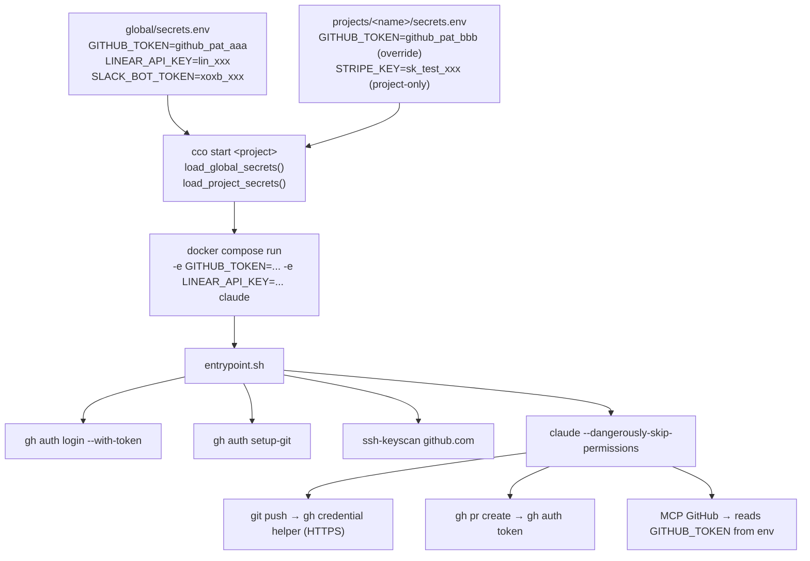
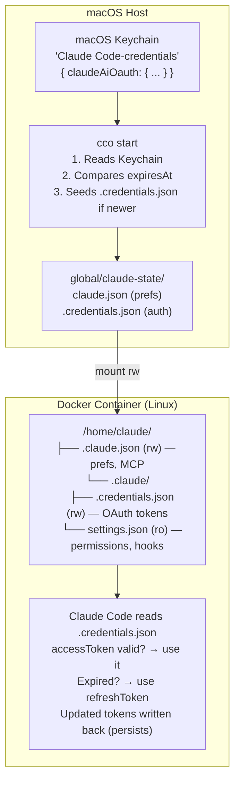

# Design: Authentication & Secrets

> Version: 1.1.0
> Status: Partially implemented (OAuth implemented, GitHub token design pending)
> Related: [analysis](./analysis.md) | [architecture](../../architecture/architecture.md) (ADR-11)

---

## 1. Overview

Unified authentication for container sessions using two complementary mechanisms:

1. **Claude OAuth** — Claude Code's own authentication, seeded from macOS Keychain into the container's `~/.claude/.credentials.json`
2. **`GITHUB_TOKEN`** (fine-grained PAT) — handles `git push`, `gh` CLI, MCP GitHub, and other MCP servers

Per-project `secrets.env` for token scoping.

---

## 2. Token Flow



### What Changes vs Current

| Component | Current | New |
|-----------|---------|-----|
| SSH keys | Mounted `:ro` (broken) | **Removed from default**. Opt-in via `docker.mount_ssh_keys: true` |
| `.gitconfig` | Mounted `:ro` | Unchanged (commit identity) |
| `gh` CLI | Not installed | **Installed in Dockerfile** |
| `gh` auth | N/A | **Entrypoint: `gh auth login --with-token`** |
| Git credential helper | None | **Entrypoint: `gh auth setup-git`** |
| `known_hosts` | Via mounted `~/.ssh` | **Entrypoint: `ssh-keyscan github.com`** |
| `secrets.env` | Global only | **Global + per-project with override** |

---

## 3. Component Changes

### 3.1 Dockerfile — Install `gh` CLI

Add after the Docker CLI installation block:

```dockerfile
# ── GitHub CLI ─────────────────────────────────────────────────────
RUN curl -fsSL https://cli.github.com/packages/githubcli-archive-keyring.gpg \
        -o /usr/share/keyrings/githubcli-archive-keyring.gpg \
    && echo "deb [arch=$(dpkg --print-architecture) \
       signed-by=/usr/share/keyrings/githubcli-archive-keyring.gpg] \
       https://cli.github.com/packages stable main" \
       > /etc/apt/sources.list.d/github-cli.list \
    && apt-get update && apt-get install -y gh \
    && rm -rf /var/lib/apt/lists/*
```

### 3.2 `config/entrypoint.sh` — Auth Setup

New section after MCP merge, before debug log:

```bash
# ── GitHub / Git authentication ───────────────────────────────────
# Authenticate gh CLI and configure git credential helper if GITHUB_TOKEN is set.
# This enables: git push (HTTPS), gh pr create, and MCP GitHub server.
if [ -n "${GITHUB_TOKEN:-}" ]; then
    echo "$GITHUB_TOKEN" | gosu claude gh auth login --with-token 2>&1 >&2 \
        && echo "[entrypoint] GitHub: authenticated gh CLI via GITHUB_TOKEN" >&2
    gosu claude gh auth setup-git 2>&1 >&2 \
        && echo "[entrypoint] GitHub: configured git credential helper" >&2
fi

# ── SSH known_hosts (no private keys) ─────────────────────────────
# Populate known_hosts so git doesn't prompt for host verification.
# Private SSH keys are NOT mounted by default (use docker.mount_ssh_keys for SSH remotes).
mkdir -p /home/claude/.ssh
ssh-keyscan -t ed25519,rsa github.com gitlab.com bitbucket.org \
    >> /home/claude/.ssh/known_hosts 2>/dev/null
chown -R claude:claude /home/claude/.ssh
chmod 700 /home/claude/.ssh
```

### 3.3 `config/entrypoint.sh` — Optional SSH Key Fix

Only when `MOUNT_SSH_KEYS=true` (set by compose when `docker.mount_ssh_keys: true`):

```bash
# ── SSH key permission fix (opt-in) ──────────────────────────────
# When SSH keys are mounted (for non-GitHub remotes), fix permissions.
if [ "${MOUNT_SSH_KEYS:-}" = "true" ] && [ -d /home/claude/.ssh-mounted ]; then
    cp -r /home/claude/.ssh-mounted/* /home/claude/.ssh/
    find /home/claude/.ssh -type f -name "id_*" ! -name "*.pub" \
        -exec chmod 600 {} \;
    chown -R claude:claude /home/claude/.ssh
    echo "[entrypoint] SSH: keys copied from mount, permissions fixed" >&2
fi
```

### 3.4 `bin/cco` — Per-Project Secrets

New function and integration in `cmd_start()`:

```bash
# Load secrets from a file into an array of -e flags
# Usage: load_secrets_file array_name file_path
load_secrets_file() {
    local -n _arr="$1"
    local file="$2"
    local line_num=0
    while IFS= read -r line || [[ -n "$line" ]]; do
        line_num=$((line_num + 1))
        # Skip empty lines and comments
        [[ -z "$line" || "$line" == \#* ]] && continue
        # Validate KEY=VALUE format
        if [[ "$line" =~ ^[A-Za-z_][A-Za-z0-9_]*= ]]; then
            _arr+=(-e "$line")
        else
            warn "$(basename "$file"):${line_num}: skipping malformed line (expected KEY=VALUE)"
        fi
    done < "$file"
}

# In cmd_start(), after load_global_secrets:
load_global_secrets run_env

# Load project secrets (override global values)
local project_secrets="$PROJECT_DIR/secrets.env"
if [[ -f "$project_secrets" ]]; then
    load_secrets_file run_env "$project_secrets"
fi
```

### 3.5 `bin/cco` — Compose Volume Changes

Remove SSH key mount from default, add opt-in:

```bash
# Current (remove from default):
# echo "      - \${HOME}/.ssh:/home/claude/.ssh:ro"

# New: only if mount_ssh_keys is true
local mount_ssh
mount_ssh=$(yml_get "$project_yml" "docker.mount_ssh_keys")
if [[ "$mount_ssh" == "true" ]]; then
    echo "      - \${HOME}/.ssh:/home/claude/.ssh-mounted:ro"
    echo "      - MOUNT_SSH_KEYS=true"   # in environment section
fi
```

### 3.6 `project.yml` — New Fields

```yaml
# ── Docker options ───────────────────────────────────────────────────
docker:
  mount_ssh_keys: false    # default: false. Set true for non-GitHub SSH remotes.
```

### 3.7 `defaults/_template/` — New Files

**`defaults/_template/secrets.env`**:
```bash
# Project-specific secrets — overrides values from global/secrets.env
# Format: KEY=VALUE (one per line, no spaces around =)
# This file is gitignored.
#
# GITHUB_TOKEN=github_pat_...
# LINEAR_API_KEY=lin_api_...
```

---

## 4. Claude OAuth in Docker

### 4.1 Problem

Claude Code runs inside a Docker container (Linux). The host is macOS. The user logs in to Claude on the host — the container must authenticate without requiring a separate login.

**Constraints:**
- Login from host should propagate to containers automatically
- Auth must persist across container restarts (`cco start` / `cco stop`)
- Auth must be shared across all projects (global, not per-project)
- When the container auto-refreshes the token, it must persist
- When the host re-authenticates (e.g., token expiry after ~90 days), the container must pick up the new token

### 4.2 Credential Storage (internals)

Claude Code stores OAuth credentials differently per platform:

| Platform | Storage Mechanism | Read Path |
|----------|-------------------|-----------|
| **macOS** | macOS Keychain (`security find-generic-password -s "Claude Code-credentials"`) | Keychain API |
| **Linux** | Plaintext file `~/.claude/.credentials.json` | Direct file read |
| **Windows** | Windows Credential Manager | OS API |

#### Key discovery: `~/.claude.json` vs `~/.claude/.credentials.json`

These are **two separate files** with different purposes:

| File | Purpose | Contains auth tokens? |
|------|---------|----------------------|
| `~/.claude.json` | Preferences, MCP servers, session metadata, onboarding state | **No** (on macOS) |
| `~/.claude/.credentials.json` | OAuth credentials (access token + refresh token) | **Yes** (on Linux) |

On macOS, `~/.claude.json` has an `oauthAccount` key with profile info (email, UUID, billing type) but **no tokens**. Tokens are exclusively in the Keychain.

On Linux, `~/.claude/.credentials.json` stores `claudeAiOauth` with:
```json
{
  "claudeAiOauth": {
    "accessToken": "sk-ant-oat01-...",
    "refreshToken": "sk-ant-ort01-...",
    "expiresAt": 1772044474163,
    "scopes": ["user:inference"],
    "subscriptionType": "...",
    "rateLimitTier": "..."
  }
}
```

#### macOS Keychain entry format

The Keychain entry (`Claude Code-credentials`) stores the exact same JSON structure as `~/.claude/.credentials.json` on Linux. This makes cross-platform seeding straightforward.

#### Source code references (Claude Code 2.1.56)

The credential store selector in `cli.js`:
```javascript
function iO() {
  if (process.platform === "darwin") return $24(H24, af8);  // Keychain + plaintext fallback
  return af8;  // Linux: plaintext only
}
```

The Linux plaintext store (`af8`):
```javascript
{
  name: "plaintext",
  read() {
    let { storagePath } = rf8();  // ~/.claude/.credentials.json
    if (existsSync(storagePath))
      return JSON.parse(readFileSync(storagePath, "utf8"));
    return null;
  },
  update(data) {
    let { storageDir, storagePath } = rf8();
    if (!existsSync(storageDir)) mkdirSync(storageDir);
    writeFileSync(storagePath, JSON.stringify(data), "utf8");
    chmodSync(storagePath, 0o600);  // owner read/write only
  }
}
```

### 4.3 What does NOT work

These approaches were tested and **do not** work for authenticating Claude Code in a Docker container:

| Approach | Why it fails |
|----------|-------------|
| Setting `claudeAiOauth` in `~/.claude.json` | Claude does not read auth tokens from this file (it uses the credential store) |
| `CLAUDE_CODE_OAUTH_TOKEN` env var | Only provides access token (no refresh token). Works for API calls (`-p "say hi"`) but interactive mode shows "Not logged in" |
| Mounting host `~/.claude.json` as seed | macOS `~/.claude.json` does not contain tokens (they're in Keychain) |
| `ANTHROPIC_AUTH_TOKEN` env var | For API gateways/custom auth, not for OAuth |

### 4.4 Implemented Solution

#### Architecture



#### File locations

| Host path | Container path | Mode | Purpose |
|-----------|----------------|------|---------|
| `global/claude-state/claude.json` | `/home/claude/.claude.json` | rw | Preferences, MCP servers, onboarding state |
| `global/claude-state/.credentials.json` | `/home/claude/.claude/.credentials.json` | rw | OAuth tokens (access + refresh) |

Both files are in `global/claude-state/` (shared across all projects, gitignored).

#### Seeding flow (`cmd_start`)

```bash
# 1. Read macOS Keychain
keychain_json=$(security find-generic-password \
  -s "Claude Code-credentials" -a "$(whoami)" -w)

# 2. Compare expiresAt
keychain_expires=$(jq -r '.claudeAiOauth.expiresAt // 0' <<< "$keychain_json")
file_expires=$(jq -r '.claudeAiOauth.expiresAt // 0' "$global_creds")

# 3. Seed only if Keychain is fresher
if [[ "$keychain_expires" -gt "$file_expires" ]]; then
    cp "$keychain_json" "$global_creds"
    chmod 600 "$global_creds"
fi
```

#### Session lifecycle

| Scenario | What happens |
|----------|-------------|
| **First session** | No `.credentials.json` → Keychain seeded → container authenticated |
| **Normal restart** | `.credentials.json` has valid tokens → Claude uses them, auto-refreshes → tokens updated in file |
| **Token refresh** | Claude auto-refreshes inside container → writes updated tokens to `.credentials.json` → persists |
| **Host re-login** | User logs in on host (new Keychain tokens) → `cco start` detects higher `expiresAt` → re-seeds `.credentials.json` |
| **Host logout+login** | Host `~/.claude.json` may reset `hasCompletedOnboarding: false` → `cco start` forces it to `true` → no onboarding screen |
| **API key mode** | No Keychain seeding → `ANTHROPIC_API_KEY` passed as env var → `.credentials.json` unused |

#### Preferences sync (`claude.json`)

`~/.claude.json` (preferences) is synced from host when host has a higher `numStartups`:

```bash
host_startups=$(jq -r '.numStartups // 0' "$HOME/.claude.json")
global_startups=$(jq -r '.numStartups // 0' "$global_claude_json")
if [[ "$host_startups" -gt "$global_startups" ]]; then
    cp "$HOME/.claude.json" "$global_claude_json"
fi

# Force hasCompletedOnboarding — container must never show onboarding
if [[ "$(jq -r '.hasCompletedOnboarding // false' "$global_claude_json")" != "true" ]]; then
    jq '.hasCompletedOnboarding = true' "$global_claude_json" > "$global_claude_json.tmp" \
        && mv "$global_claude_json.tmp" "$global_claude_json"
fi
```

This ensures theme preferences and other settings stay current. The `hasCompletedOnboarding` override is critical: after a host logout+login cycle, `~/.claude.json` on the host may have `hasCompletedOnboarding: false`, which would trigger the "theme: dark" onboarding screen inside the container — blocking the session even when valid credentials exist.

---

## 5. User Setup Flow

### First-time setup

```bash
# 1. Create a fine-grained PAT on GitHub:
#    GitHub → Settings → Developer Settings → Fine-grained personal access tokens
#    - Repository access: select specific repos
#    - Permissions: Contents (read/write), Pull requests (read/write)

# 2. Save token:
echo "GITHUB_TOKEN=github_pat_..." >> ~/claude-orchestrator/user-config/global/secrets.env

# 3. Rebuild image (to get gh CLI, if not already built with it):
cco build

# 4. Start session — auth is automatic:
cco start my-project
# [entrypoint] GitHub: authenticated gh CLI via GITHUB_TOKEN
# [entrypoint] GitHub: configured git credential helper
```

### Per-project token

```bash
# Create a different PAT scoped to this project's repos
echo "GITHUB_TOKEN=github_pat_project_specific..." > \
    ~/claude-orchestrator/user-config/projects/my-project/secrets.env
```

---

## 6. Security Considerations

### GitHub Token Security

| Risk | Mitigation |
|------|------------|
| Token in `secrets.env` on disk | File is gitignored. User's responsibility to protect (like any credentials file) |
| Token in container env | Container is ephemeral (`--rm`). Token not persisted to disk inside container |
| Token scope too broad | Fine-grained PAT allows per-repo, per-permission scoping |
| Token in docker-compose.yml | Tokens are passed as runtime `-e` flags, NOT written to compose file |
| SSH keys exposure | Not mounted by default. Opt-in only for non-GitHub use cases |
| Token in shell history | `load_global_secrets` reads from file, not command-line args |

### Claude OAuth Security

| Aspect | Detail |
|--------|--------|
| Token storage | Plaintext file with `chmod 600` (same security model as Claude Code on Linux natively) |
| Keychain access | `security find-generic-password` runs on macOS host only, never inside container |
| Token scope | OAuth access token scoped to Claude API only (not GitHub, not other services) |
| Token rotation | Refresh token allows automatic rotation without user interaction (~90 day lifetime) |
| Container isolation | Container runs as `claude` user (non-root). File is owned by `claude:claude` |
| File location | `global/claude-state/` is gitignored — never committed |

---

## 7. Troubleshooting

### "Not logged in" after `cco start` (Claude OAuth)

1. **Check Keychain**: `security find-generic-password -s "Claude Code-credentials" -a "$(whoami)" -w | python3 -c "import sys,json; print('OK' if json.load(sys.stdin).get('claudeAiOauth',{}).get('accessToken') else 'NO TOKEN')"`
2. **Check `.credentials.json`**: `jq '.claudeAiOauth | keys' global/claude-state/.credentials.json`
3. **Check permissions**: `ls -la global/claude-state/.credentials.json` (should be `600`)
4. **Re-seed manually**: `rm global/claude-state/.credentials.json && cco start <project>`

### "theme: dark" onboarding screen appears

This happens when `claude.json` has `hasCompletedOnboarding: false`. Common after a host logout+login cycle. Since v1.1, `cco start` automatically forces `hasCompletedOnboarding: true` before starting the container. If it still occurs, manually fix:
```bash
jq '.hasCompletedOnboarding = true' global/claude-state/claude.json > /tmp/fix.json \
  && mv /tmp/fix.json global/claude-state/claude.json
```

### Token expired (after ~90 days)

1. Login on host: `claude` → authenticate via browser
2. `cco start <project>` → Keychain has newer `expiresAt` → automatic re-seed

---

## 8. Implementation Checklist

- [ ] `Dockerfile`: Install `gh` CLI
- [ ] `config/entrypoint.sh`: Add GitHub auth section (`gh auth login`, `gh auth setup-git`)
- [ ] `config/entrypoint.sh`: Add `ssh-keyscan` for `known_hosts`
- [ ] `config/entrypoint.sh`: Add optional SSH key fix section
- [ ] `bin/cco`: Extract `load_secrets_file` helper function
- [ ] `bin/cco`: Add per-project `secrets.env` loading in `cmd_start()` and `cmd_new()`
- [ ] `bin/cco`: Remove default SSH mount from compose generation
- [ ] `bin/cco`: Add `docker.mount_ssh_keys` support in compose generation
- [ ] `defaults/_template/secrets.env`: Create template file
- [ ] `defaults/_template/project.yml`: Add `docker.mount_ssh_keys` (commented)
- [ ] `bin/test`: Tests for per-project secrets loading
- [ ] `bin/test`: Tests for SSH mount opt-in in dry-run compose
- [ ] Documentation: Update [cli.md](../../../reference/cli.md), [project-setup.md](../../../user-guides/project-setup.md)
