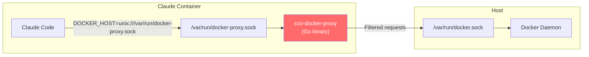
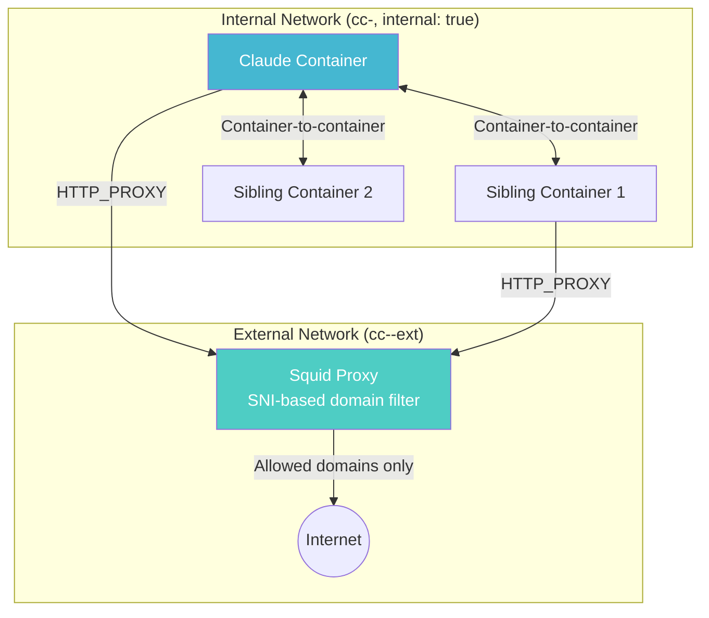
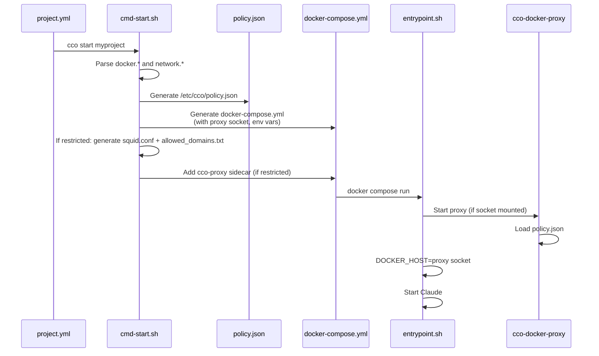

# Design: Docker Socket Restriction & Network Hardening

> **Version**: 1.0.0
> **Status**: Phase A & B implemented. Phase C pending.
> **Date**: 2026-03-11
> **Scope**: Sprint 6-Security
> **Related**: [analysis.md](./analysis.md) | [security.md](../../architecture/security.md) | [architecture.md](../../architecture/architecture.md) | [docker/design.md](../docker/design.md)

---

## Table of Contents

1. [Overview](#1-overview)
2. [Architecture](#2-architecture)
3. [Phase A: mount_socket Default Fix](#3-phase-a-mount_socket-default-fix)
4. [Phase B: Docker Socket Proxy](#4-phase-b-docker-socket-proxy)
5. [Phase C: Network Hardening](#5-phase-c-network-hardening)
6. [project.yml Schema Changes](#6-projectyml-schema-changes)
7. [Proxy Configuration Protocol](#7-proxy-configuration-protocol)
8. [Entrypoint Changes](#8-entrypoint-changes)
9. [Compose Generation Changes](#9-compose-generation-changes)
10. [YAML Parser Extensions](#10-yaml-parser-extensions)
11. [Error Handling](#11-error-handling)
12. [Testing Strategy](#12-testing-strategy)
13. [Migration](#13-migration)
14. [Implementation Checklist](#14-implementation-checklist)

---

## 1. Overview

This design introduces a layered security system for Docker socket access:

1. **Phase A** — Flip `mount_socket` default to `false` (bugfix)
2. **Phase B** — Go-based HTTP proxy between Claude and the Docker socket, enforcing container access, mount restrictions, and security constraints
3. **Phase C** — Network isolation via Docker `internal: true` network + Squid egress proxy sidecar

Each phase is independently deployable and adds incremental security.

---

## 2. Architecture

### 2.1 Phase B: Socket Proxy



The proxy listens on a Unix socket (`/var/run/docker-proxy.sock`). The real Docker socket is mounted but accessible only to the proxy process (root). Claude's `DOCKER_HOST` env var points to the proxy socket.

### 2.2 Phase C: Network Isolation



The project network is `internal: true` — no direct internet. A Squid sidecar bridges internal and external networks. All egress goes through Squid with domain-based filtering (SNI peek for HTTPS).

---

## 3. Phase A: mount_socket Default Fix

### 3.1 Change

**File**: `lib/cmd-start.sh:111`

```bash
# BEFORE
mount_socket=$(_parse_bool "$(yml_get "$project_yml" "docker.mount_socket")" "true")

# AFTER
mount_socket=$(_parse_bool "$(yml_get "$project_yml" "docker.mount_socket")" "false")
```

### 3.2 Breaking Change Mitigation

Projects that rely on Docker socket without explicitly declaring `docker.mount_socket: true` will lose access. Migration strategy: **security first** — the migration does NOT auto-enable the socket. It emits a warning during `cco update` so the user can review and explicitly opt-in per project.

**File**: `migrations/project/006_mount_socket_default_false.sh`

```bash
MIGRATION_ID=6
MIGRATION_DESC="Notify: docker.mount_socket default changed from true to false"

migrate() {
    local target_dir="$1"
    local yml="$target_dir/project.yml"

    [[ -f "$yml" ]] || return 0

    # Skip if mount_socket is already declared explicitly
    if grep -q 'mount_socket' "$yml" 2>/dev/null; then
        return 0
    fi

    # Emit warning — do NOT modify the file
    warn "BREAKING CHANGE: docker.mount_socket now defaults to false (was true)"
    warn "  If this project needs Docker socket access, add to project.yml:"
    warn "    docker:"
    warn "      mount_socket: true"
}
```

### 3.3 Documentation Updates

- `docs/reference/project-yaml.md`: change default from `true` to `false`
- `docs/maintainer/security.md`: mark HIGH-2 mitigation as "default off"
- `CHANGELOG.md`: breaking change notice

---

## 4. Phase B: Docker Socket Proxy

### 4.1 Go Proxy Design

#### Directory Structure

```
proxy/
├── cmd/
│   └── cco-docker-proxy/
│       └── main.go              # Entry point: socket listener, signal handling
├── internal/
│   ├── config/
│   │   └── config.go            # Policy config parsing (JSON)
│   ├── filter/
│   │   ├── containers.go        # Container name/label filtering
│   │   ├── mounts.go            # Mount path validation
│   │   ├── security.go          # Privileged, capabilities, resources
│   │   └── networks.go          # Network access filtering
│   ├── handler/
│   │   └── proxy.go             # HTTP reverse proxy with request interception
│   └── cache/
│       └── containers.go        # Container ID → name/labels cache
├── go.mod
├── go.sum
└── Makefile                     # Build targets: linux/amd64, linux/arm64
```

#### Config Structure (`policy.json`)

Generated by `cmd-start.sh` and mounted at `/etc/cco/policy.json`:

```json
{
  "project_name": "my-project",
  "containers": {
    "policy": "project_only",
    "allow_patterns": [],
    "deny_patterns": [],
    "create_allowed": true,
    "name_prefix": "cc-my-project-",
    "required_labels": {
      "cco.project": "my-project"
    }
  },
  "mounts": {
    "policy": "project_only",
    "allowed_paths": [
      "/home/user/projects/backend",
      "/home/user/projects/frontend"
    ],
    "denied_paths": [],
    "implicit_deny": [
      "/var/run/docker.sock",
      "/etc/shadow",
      "/etc/sudoers"
    ],
    "force_readonly": false
  },
  "security": {
    "no_privileged": true,
    "no_sensitive_mounts": true,
    "force_non_root": false,
    "drop_capabilities": ["SYS_ADMIN", "NET_ADMIN"],
    "max_memory_bytes": 4294967296,
    "max_nano_cpus": 4000000000,
    "max_containers": 10
  },
  "networks": {
    "allowed_prefixes": ["cc-my-project"]
  }
}
```

#### Core Proxy Logic (`handler/proxy.go`)

```go
// Simplified flow
func (p *ProxyHandler) ServeHTTP(w http.ResponseWriter, r *http.Request) {
    // 1. Always allow: /_ping, /version
    if isAlwaysAllowed(r.URL.Path) {
        p.forward(w, r)
        return
    }

    // 2. Route-based filtering
    switch {
    case isContainerCreate(r):
        p.handleContainerCreate(w, r)
    case isContainerOperation(r):
        p.handleContainerOp(w, r)
    case isContainerList(r):
        p.handleContainerList(w, r)
    case isNetworkCreate(r):
        p.handleNetworkCreate(w, r)
    case isNetworkConnect(r):
        p.handleNetworkConnect(w, r)
    default:
        // Allow read operations, deny unknown writes
        if r.Method == "GET" || r.Method == "HEAD" {
            p.forward(w, r)
        } else {
            p.deny(w, r, "unknown write operation")
        }
    }
}
```

#### Container Create Interception (`filter/containers.go`)

On `POST /containers/create`:

1. Parse request body as `container.Config` + `container.HostConfig`
2. **Name check**: extract `?name=` query param → validate against `name_prefix`
3. **Label injection**: add `required_labels` to `Config.Labels`
4. **Mount check**: validate `HostConfig.Binds` and `HostConfig.Mounts` against mount policy
5. **Security check**: validate `HostConfig.Privileged`, `HostConfig.CapAdd`, `Config.User`, resource limits
6. **Network check**: validate `NetworkingConfig` against allowed networks
7. If all checks pass → forward modified request to real socket
8. If any check fails → return `403 Forbidden` with explanation

#### Container ID Resolution (`cache/containers.go`)

Most Docker API endpoints use container IDs (hex strings), not names. The proxy maintains an in-memory cache:

```go
type ContainerCache struct {
    mu         sync.RWMutex
    byID       map[string]*ContainerInfo  // full ID → info
    byShortID  map[string]*ContainerInfo  // 12-char prefix → info
    byName     map[string]*ContainerInfo  // name → info
}

type ContainerInfo struct {
    ID     string
    Name   string
    Labels map[string]string
}
```

Cache is populated:
- On startup: `GET /containers/json?all=true`
- On container create: from response
- On container remove: delete entry
- Periodic refresh: every 30 seconds (catch external changes)

#### Container List Filtering

On `GET /containers/json`:
1. Forward request to real socket
2. Parse response as `[]ContainerInfo`
3. Filter to only containers matching the policy
4. Return filtered list

This ensures Claude only "sees" containers it's allowed to access.

### 4.2 Dockerfile Changes

Add a multi-stage build for the Go proxy:

```dockerfile
# ── Stage 1: Build proxy ───────────────────────────────────────────
FROM golang:1.22-bookworm AS proxy-builder
WORKDIR /build
COPY proxy/ .
RUN CGO_ENABLED=0 GOOS=linux go build -ldflags="-s -w" -o cco-docker-proxy ./cmd/cco-docker-proxy/

# ── Stage 2: Main image (existing) ─────────────────────────────────
FROM node:22-bookworm
# ... existing setup ...
COPY --from=proxy-builder /build/cco-docker-proxy /usr/local/bin/cco-docker-proxy
```

### 4.3 Entrypoint Changes

When `mount_socket: true`, the entrypoint starts the proxy before Claude:

```bash
# ── Docker Socket Proxy ────────────────────────────────────────────
if [ -S /var/run/docker.sock ] && [ -f /etc/cco/policy.json ]; then
    # Start proxy as root (needs socket access)
    /usr/local/bin/cco-docker-proxy \
        -listen /var/run/docker-proxy.sock \
        -upstream /var/run/docker.sock \
        -policy /etc/cco/policy.json \
        -log-denied \
        &
    PROXY_PID=$!

    # Wait for proxy socket to be ready
    for i in $(seq 1 30); do
        [ -S /var/run/docker-proxy.sock ] && break
        sleep 0.1
    done

    # Make proxy socket accessible to claude user
    chown claude:docker /var/run/docker-proxy.sock
    chmod 660 /var/run/docker-proxy.sock

    # Point Docker CLI to proxy
    export DOCKER_HOST="unix:///var/run/docker-proxy.sock"
fi
```

### 4.4 Proxy Socket Permissions

- Real socket (`/var/run/docker.sock`): owned by root, accessible only by root
- Proxy socket (`/var/run/docker-proxy.sock`): owned by `claude:docker`, accessible by claude user
- The proxy process runs as root (PID 1 child) to access the real socket
- Claude process runs as `claude` user and can only reach the proxy socket

---

## 5. Phase C: Network Hardening

### 5.1 Squid Configuration

**Squid sidecar** runs a minimal configuration with SNI-based HTTPS filtering:

```
# /etc/squid/squid.conf (generated from project.yml)

# Listen on port 3128
http_port 3128

# ACL: allowed domains
acl allowed_domains dstdomain "/etc/squid/allowed_domains.txt"

# SSL bump: peek at SNI, splice if allowed
ssl_bump peek step1 all
ssl_bump splice allowed_domains
ssl_bump terminate !allowed_domains

# HTTP: allow only listed domains
http_access allow allowed_domains
http_access deny all

# Logging
access_log stdio:/dev/stdout
cache_log stdio:/dev/stderr

# No caching (simple proxy)
cache deny all
```

**Domain allowlist file** (`/etc/squid/allowed_domains.txt`):
```
# Generated from network.allowed_domains in project.yml
.anthropic.com
.npmjs.org
.github.com
.githubusercontent.com
.pypi.org
.pythonhosted.org
.docker.io
.docker.com
.googleapis.com
```

### 5.2 Compose Generation for Restricted Mode

When `network.internet: restricted`, `cmd-start.sh` generates additional compose elements:

```yaml
services:
  # Existing claude service
  claude:
    # ... existing config ...
    environment:
      - HTTP_PROXY=http://cco-proxy:3128
      - HTTPS_PROXY=http://cco-proxy:3128
      - NO_PROXY=localhost,127.0.0.1,cco-proxy
    networks:
      - cc-myproject           # internal network only
    depends_on:
      - cco-proxy

  # NEW: Squid egress proxy sidecar
  cco-proxy:
    image: ubuntu/squid:latest
    container_name: cc-myproject-proxy
    volumes:
      - ./proxy/squid.conf:/etc/squid/squid.conf:ro
      - ./proxy/allowed_domains.txt:/etc/squid/allowed_domains.txt:ro
    networks:
      - cc-myproject           # internal (can talk to claude)
      - cc-myproject-ext       # external (can reach internet)
    labels:
      cco.project: myproject
      cco.role: proxy

networks:
  cc-myproject:
    name: cc-myproject
    driver: bridge
    internal: true             # NO internet access
  cc-myproject-ext:
    name: cc-myproject-ext
    driver: bridge             # HAS internet access
```

### 5.3 Network Mode: `none`

When `network.internet: none`:
- No Squid sidecar needed
- Project network set to `internal: true`
- No `HTTP_PROXY` env vars
- All external network access blocked

### 5.4 Network Mode: `full`

When `network.internet: full` (default):
- No Squid sidecar
- Project network remains as-is (not internal)
- Optional `blocked_domains` implemented via Claude Code deny rules only (best-effort)

### 5.5 Managed Settings Integration

When `network.internet` is `restricted` or `none`, add to managed-settings.json:

```json
{
  "permissions": {
    "deny": [
      "WebFetch",
      "WebSearch",
      "Bash(curl *)",
      "Bash(wget *)"
    ]
  }
}
```

This is a **complementary layer** — the real enforcement is at the network level. The deny rules prevent Claude from attempting requests that would fail anyway (better UX: immediate error vs timeout).

Note: these deny rules are generated per-session (written to a session-specific managed config), not globally. Projects with `network.internet: full` don't get these restrictions.

---

## 6. project.yml Schema Changes

### 6.1 New Fields

Added to the `docker:` section and new `network:` section. See [analysis.md §8](./analysis.md#8-projectyml-schema--full-proposal) for the complete schema.

### 6.2 Field Validation

| Field | Type | Validation |
|-------|------|------------|
| `docker.containers.policy` | enum | `project_only` \| `allowlist` \| `denylist` \| `unrestricted` |
| `docker.containers.allow[]` | string | Glob pattern, non-empty |
| `docker.containers.deny[]` | string | Glob pattern, non-empty |
| `docker.containers.create` | bool | `_parse_bool()` with default `true` |
| `docker.containers.name_prefix` | string | Must end with `-`, alphanumeric + `-_` |
| `docker.mounts.policy` | enum | `none` \| `project_only` \| `allowlist` \| `any` |
| `docker.mounts.allow[]` | string | Absolute path |
| `docker.mounts.deny[]` | string | Absolute path or glob |
| `docker.mounts.force_readonly` | bool | `_parse_bool()` with default `false` |
| `docker.security.no_privileged` | bool | `_parse_bool()` with default `true` |
| `docker.security.no_sensitive_mounts` | bool | `_parse_bool()` with default `true` |
| `docker.security.force_non_root` | bool | `_parse_bool()` with default `false` |
| `docker.security.drop_capabilities[]` | string | Valid Linux capability name |
| `docker.security.resources.memory` | string | Docker memory format (`4g`, `512m`) |
| `docker.security.resources.cpus` | string | Numeric (`"4"`, `"0.5"`) |
| `docker.security.resources.max_containers` | int | 1-100 |
| `network.internet` | enum | `full` \| `restricted` \| `none` |
| `network.allowed_domains[]` | string | Domain or wildcard (`*.example.com`) |
| `network.blocked_domains[]` | string | Domain or wildcard |
| `network.created_containers.internet` | enum | `same` \| `full` \| `restricted` \| `none` |

---

## 7. Proxy Configuration Protocol

### 7.1 Config Generation Flow



### 7.2 Policy File Location

- **Generated at**: `projects/<name>/.managed/policy.json`
- **Mounted at**: `/etc/cco/policy.json:ro`
- **Generated by**: `cmd-start.sh` (alongside docker-compose.yml)

### 7.3 Squid Config Location (Phase C)

- **Generated at**: `projects/<name>/.managed/proxy/squid.conf` and `allowed_domains.txt`
- **Mounted at**: `/etc/squid/squid.conf:ro` and `/etc/squid/allowed_domains.txt:ro`

---

## 8. Entrypoint Changes

### 8.1 Modified Flow

```bash
# ── 1. Docker Socket Permissions (existing) ────────────────────────
if [ -S /var/run/docker.sock ]; then
    # ... existing GID fix ...
fi

# ── 2. Docker Socket Proxy (NEW) ──────────────────────────────────
if [ -S /var/run/docker.sock ] && [ -f /etc/cco/policy.json ]; then
    /usr/local/bin/cco-docker-proxy \
        -listen /var/run/docker-proxy.sock \
        -upstream /var/run/docker.sock \
        -policy /etc/cco/policy.json \
        -log-denied &
    PROXY_PID=$!

    # Wait for proxy socket
    _wait_for_socket /var/run/docker-proxy.sock 3

    # Permissions: claude user can access proxy socket
    chown claude:docker /var/run/docker-proxy.sock
    chmod 660 /var/run/docker-proxy.sock

    # Real socket: only root (proxy process)
    chmod 600 /var/run/docker.sock

    # Redirect Docker CLI to proxy
    export DOCKER_HOST="unix:///var/run/docker-proxy.sock"
fi

# ── 3. Claude State Files (existing) ──────────────────────────────
# ... rest of entrypoint unchanged ...
```

### 8.2 Proxy Socket Wait Helper

```bash
_wait_for_socket() {
    local socket="$1" timeout="${2:-3}"
    local elapsed=0
    while [ ! -S "$socket" ]; do
        sleep 0.1
        elapsed=$(echo "$elapsed + 0.1" | bc)
        if [ "$(echo "$elapsed >= $timeout" | bc)" -eq 1 ]; then
            warn "Docker proxy socket did not appear within ${timeout}s"
            return 1
        fi
    done
}
```

### 8.3 Cleanup on Exit

```bash
cleanup() {
    if [ -n "${PROXY_PID:-}" ]; then
        kill "$PROXY_PID" 2>/dev/null || true
    fi
}
trap cleanup EXIT
```

---

## 9. Compose Generation Changes

### 9.1 cmd-start.sh Modifications

#### Policy Generation Function

```bash
_generate_policy_json() {
    local project_yml="$1" project_name="$2" output="$3"

    local containers_policy mount_policy
    containers_policy=$(yml_get "$project_yml" "docker.containers.policy" "project_only")
    mount_policy=$(yml_get "$project_yml" "docker.mounts.policy" "project_only")

    # Collect repo paths for project_only mount policy
    local allowed_mount_paths=""
    if [[ "$mount_policy" == "project_only" ]]; then
        # Extract repo paths from project.yml
        allowed_mount_paths=$(yml_get_repos "$project_yml" | while read -r path name; do
            echo "\"$path\""
        done | paste -sd,)
    fi

    # Generate JSON
    cat > "$output" <<POLICY
{
  "project_name": "$project_name",
  "containers": {
    "policy": "$containers_policy",
    ...
  },
  ...
}
POLICY
}
```

#### Volume Mounts Addition

When `mount_socket: true`, add to compose:

```yaml
volumes:
  # Real socket (root-only access, proxy reads it)
  - /var/run/docker.sock:/var/run/docker.sock
  # Policy config
  - ./.managed/policy.json:/etc/cco/policy.json:ro
```

#### Environment Variables

```yaml
environment:
  - DOCKER_HOST=unix:///var/run/docker-proxy.sock
```

#### Network Generation (Phase C)

When `network.internet: restricted`:

```bash
_generate_compose_restricted_network() {
    local project_name="$1"

    # Internal network (no internet)
    echo "  ${project_name}:"
    echo "    name: cc-${project_name}"
    echo "    driver: bridge"
    echo "    internal: true"

    # External network (internet via proxy)
    echo "  ${project_name}-ext:"
    echo "    name: cc-${project_name}-ext"
    echo "    driver: bridge"
}
```

---

## 10. YAML Parser Extensions

### 10.1 New Parser Functions

Add to `lib/yaml.sh`:

```bash
# Parse nested list under a dotted key
# Usage: yml_get_list "project.yml" "docker.containers.allow"
yml_get_list() {
    local file="$1" key="$2"
    # Split key into section path
    # ... AWK-based nested list parser ...
}

# Parse nested map under a dotted key
# Usage: yml_get_map "project.yml" "docker.containers.required_labels"
yml_get_map() {
    local file="$1" key="$2"
    # ... AWK-based nested map parser ...
}

# Validate enum field
# Usage: yml_get_enum "project.yml" "docker.containers.policy" "project_only" "project_only|allowlist|denylist|unrestricted"
yml_get_enum() {
    local file="$1" key="$2" default="$3" valid_values="$4"
    local value
    value=$(yml_get "$file" "$key" "$default")
    if ! echo "$valid_values" | grep -qw "$value"; then
        warn "Invalid value '$value' for $key — using default '$default'"
        echo "$default"
    else
        echo "$value"
    fi
}
```

---

## 11. Error Handling

### 11.1 Proxy Error Responses

When the proxy denies a request, it returns a Docker-compatible error:

```json
{
  "message": "cco-docker-proxy: operation denied — container 'postgres-prod' does not match policy 'project_only' (allowed: cc-myproject-*)"
}
```

HTTP status codes:
- `403 Forbidden` — policy violation (including max_containers reached)
- `502 Bad Gateway` — upstream socket error

### 11.2 Startup Errors

If the proxy fails to start (socket permission, policy parse error):
- Log error to stderr (visible in `docker compose logs`)
- Exit with code 1 → entrypoint falls back to direct socket access with a prominent warning
- **No silent failures**: Claude sees the warning in session context

### 11.3 Graceful Degradation

If `policy.json` is missing but socket is mounted:
- Proxy is not started
- Direct socket access (current behavior)
- Warning in entrypoint logs: "Docker socket mounted without policy — unrestricted access"

---

## 12. Testing Strategy

### 12.1 Unit Tests (Go Proxy)

```
proxy/internal/filter/containers_test.go   — container name/label matching
proxy/internal/filter/mounts_test.go       — mount path validation
proxy/internal/filter/security_test.go     — privileged, caps, resources
proxy/internal/config/config_test.go       — policy JSON parsing
proxy/internal/handler/proxy_test.go       — HTTP handler integration
```

### 12.2 Integration Tests (Bash — dry-run)

**File**: `tests/test_docker_security.sh`

Tests for compose generation:

| Test | Validates |
|------|-----------|
| `test_mount_socket_default_false` | Default changed to false |
| `test_mount_socket_explicit_true` | Explicit true still works |
| `test_policy_json_generated` | policy.json created with correct content |
| `test_policy_project_only` | Container policy defaults |
| `test_policy_allowlist` | Custom allow patterns in policy |
| `test_policy_mount_project_only` | Only repo paths in allowed mounts |
| `test_policy_mount_deny` | Deny list includes implicit denies |
| `test_policy_security_defaults` | Security constraints in policy |
| `test_compose_proxy_socket_env` | DOCKER_HOST env var in compose |
| `test_compose_restricted_network` | internal:true + proxy sidecar in compose |
| `test_compose_network_none` | internal:true, no proxy |
| `test_compose_network_full` | No changes to compose |
| `test_squid_config_generated` | squid.conf created |
| `test_squid_allowed_domains` | Domain list from project.yml |
| `test_migration_mount_socket` | Migration adds explicit mount_socket: true |

### 12.3 E2E Tests (Future)

Real Docker interactions (requires running Docker daemon):
- Proxy starts and accepts connections
- Container create with valid name succeeds
- Container create with invalid name fails with 403
- Mount of denied path fails
- Privileged container creation fails
- Network restricted mode blocks direct internet

---

## 13. Migration

### 13.1 Existing Projects

**Migration 004**: Add explicit `docker.mount_socket: true` to projects that didn't declare it.

### 13.2 Template Update

**File**: `templates/project/base/project.yml`

Add the new sections with secure defaults (commented out):

```yaml
docker:
  mount_socket: false
  # ports:
  #   - "3000:3000"
  # env: {}

  # ── Container access policy ─────────────────────────────────────
  # containers:
  #   policy: project_only
  #   allow: []
  #   deny: []
  #   create: true

  # ── Mount restrictions ──────────────────────────────────────────
  # mounts:
  #   policy: project_only
  #   allow: []
  #   deny: []
  #   force_readonly: false

  # ── Security constraints ────────────────────────────────────────
  # security:
  #   no_privileged: true
  #   no_sensitive_mounts: true
  #   force_non_root: false
  #   drop_capabilities: [SYS_ADMIN, NET_ADMIN]
  #   resources:
  #     memory: "4g"
  #     cpus: "4"
  #     max_containers: 10

# ── Network policy ─────────────────────────────────────────────────
# network:
#   internet: full
#   allowed_domains: []
#   blocked_domains: []
#   created_containers:
#     internet: same
```

---

## 14. Implementation Checklist

### Phase A: mount_socket Default Fix

- [ ] Change default in `lib/cmd-start.sh:111` from `"true"` to `"false"`
- [ ] Create migration `migrations/project/004_mount_socket_explicit.sh`
- [ ] Update `templates/project/base/project.yml` default
- [ ] Update `docs/reference/project-yaml.md`
- [ ] Update `docs/maintainer/security.md` (HIGH-2 status)
- [ ] Add test in `tests/test_docker_security.sh` for default behavior
- [ ] Run full test suite (`bin/test`)

### Phase B: Docker Socket Proxy

- [ ] Initialize Go module (`proxy/go.mod`)
- [ ] Implement config parser (`internal/config/config.go`)
- [ ] Implement container filter (`internal/filter/containers.go`)
- [ ] Implement mount filter (`internal/filter/mounts.go`)
- [ ] Implement security filter (`internal/filter/security.go`)
- [ ] Implement network filter (`internal/filter/networks.go`)
- [ ] Implement container cache (`internal/cache/containers.go`)
- [ ] Implement HTTP proxy handler (`internal/handler/proxy.go`)
- [ ] Implement main entry point (`cmd/cco-docker-proxy/main.go`)
- [ ] Write Go unit tests
- [ ] Add multi-stage build to Dockerfile
- [ ] Add proxy startup to `config/entrypoint.sh`
- [ ] Add policy.json generation to `lib/cmd-start.sh`
- [ ] Add YAML parser extensions to `lib/yaml.sh`
- [ ] Parse `docker.containers`, `docker.mounts`, `docker.security` in `cmd-start.sh`
- [ ] Add DOCKER_HOST env var to compose generation
- [ ] Mount policy.json in compose
- [ ] Update template `templates/project/base/project.yml`
- [ ] Write integration tests (`tests/test_docker_security.sh`)
- [ ] Update `docs/reference/project-yaml.md`
- [ ] Update `docs/maintainer/security.md`
- [ ] Run full test suite

### Phase C: Network Hardening

- [ ] **Review default/bridge network policy**: Phase B allows `default`, `bridge`, `host`, `none` networks unconditionally in the proxy to support basic `docker run` without `--network`. Evaluate whether to restrict this — e.g., force `--network cc-<project>-*` for created containers, blocking `bridge`/`default` to prevent cross-project communication on the shared bridge network. Trade-off: stricter isolation vs usability (every `docker run` would require explicit `--network`).
- [ ] Implement Squid config generation in `cmd-start.sh`
- [ ] Generate `allowed_domains.txt` from project.yml
- [ ] Generate `internal: true` network in compose
- [ ] Generate proxy sidecar service in compose
- [ ] Add HTTP_PROXY/HTTPS_PROXY env vars to compose
- [ ] Add NO_PROXY for internal communication
- [ ] Handle `network.internet: none` (internal only, no proxy)
- [ ] Handle `network.internet: full` (no changes)
- [ ] Generate session-specific managed deny rules for restricted/none modes
- [ ] Handle `network.created_containers.internet` override
- [ ] Write integration tests
- [ ] Update `docs/reference/project-yaml.md`
- [ ] Update `docs/user-guides/` with network configuration guide
- [ ] Run full test suite
