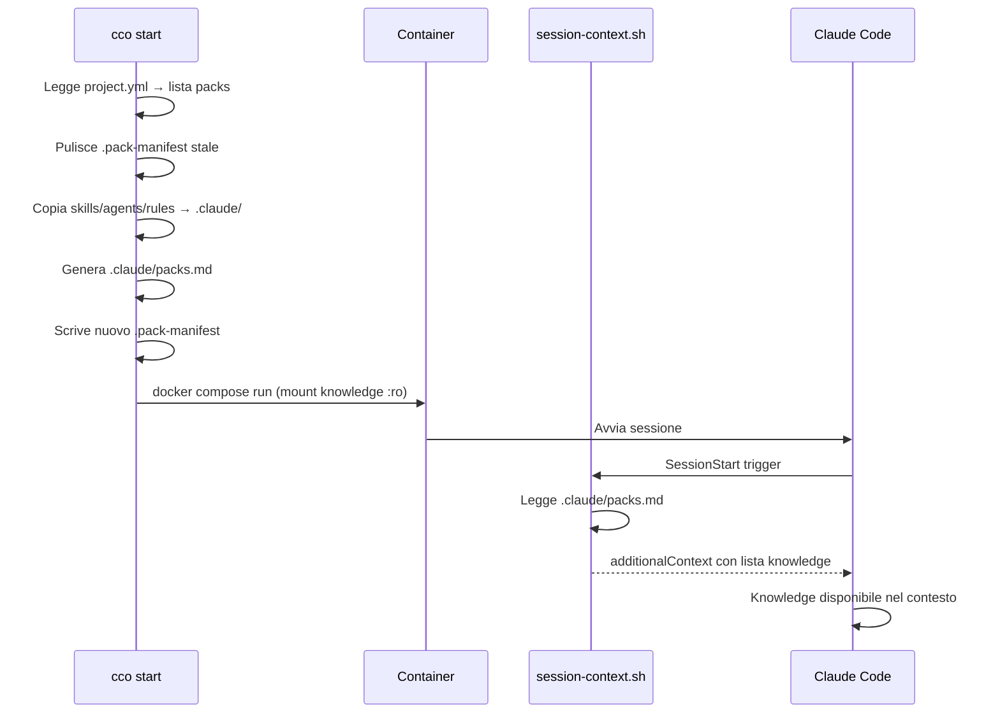

# Design: Knowledge Packs System

> Stato: Implementato (v1)
> ADR di riferimento: [ADR-9](../architecture.md) (Copy vs Mount)
> Specifiche CLI: [cli.md](../../reference/cli.md) §3.7–3.11
> Formato project.yml: [project-yaml.md](../../reference/project-yaml.md) §Knowledge Packs

---

## 1. Overview

I Knowledge Packs risolvono il problema della documentazione e del tooling riutilizzabile tra progetti. Senza packs, ogni progetto deve duplicare manualmente file di knowledge, skill, agent e rule nella propria directory `.claude/`. Quando la documentazione evolve, le copie diventano stale e inconsistenti.

Un pack è un bundle autonomo che raggruppa:
- **Knowledge** — documentazione di riferimento (convenzioni di codice, overview di business, linee guida)
- **Skills** — skill Claude Code riutilizzabili (deploy, review, etc.)
- **Agents** — definizioni di subagent specializzati
- **Rules** — regole addizionali per il contesto di sessione

Un pack viene definito una volta in `global/packs/<name>/` e attivato in qualsiasi progetto aggiungendone il nome alla lista `packs:` in `project.yml`. Tutte le sezioni sono opzionali: un pack può contenere solo knowledge, solo skill, o qualsiasi combinazione.

---

## 2. Formato Pack — `pack.yml`

Ogni pack è definito da un file `pack.yml` nella propria directory sotto `global/packs/`:

```yaml
# global/packs/my-client/pack.yml

name: my-client

# Knowledge files — montati read-only, iniettati nel contesto automaticamente
knowledge:
  source: ~/documents/my-client-knowledge  # directory host da montare (read-only)
  files:
    - path: backend-coding-conventions.md
      description: "Read when writing backend code, APIs, or DB logic"
    - path: business-overview.md
      description: "Read for business context and product understanding"
    - testing-guidelines.md              # short form: senza description

# Skills — copiate in /workspace/.claude/skills/ al cco start
skills:
  - deploy

# Agents — copiati in /workspace/.claude/agents/ al cco start
agents:
  - devops-specialist.md

# Rules — copiate in /workspace/.claude/rules/ al cco start
rules:
  - api-conventions.md
```

**Chiavi top-level ammesse**: `name`, `knowledge`, `skills`, `agents`, `rules`.

Il campo `name` deve corrispondere al nome della directory del pack. `cco pack validate` emette un warning in caso di mismatch.

### Struttura directory del pack

```
global/packs/<name>/
├── pack.yml              # Manifest del pack
├── knowledge/            # Fallback se knowledge.source non è specificato
│   ├── overview.md
│   └── conventions.md
├── skills/
│   └── deploy/
│       └── SKILL.md
├── agents/
│   └── specialist.md
└── rules/
    └── conventions.md
```

Se `knowledge.source` è omesso, i file di knowledge vengono cercati nella sottodirectory `knowledge/` del pack stesso.

---

## 3. Tipi di Risorse

### 3.1 Knowledge

File di documentazione di riferimento. Sono materiale read-only che Claude legge durante la sessione per ottenere contesto su convenzioni, architettura, business logic, etc.

- **Montati** come volumi Docker read-only in `/workspace/.packs/<name>/`
- **Non copiati** nella directory `.claude/` del progetto
- **Iniettati** nel contesto tramite `packs.md` e il hook `session-context.sh`

Ogni file può avere una `description` opzionale che guida Claude su quando leggerlo. I file senza description appaiono comunque nella lista ma senza indicazione d'uso.

### 3.2 Skills

Directory di skill Claude Code, ciascuna contenente un `SKILL.md`. Vengono copiate in `/workspace/.claude/skills/` per essere disponibili nella sessione.

### 3.3 Agents

File `.md` di definizione subagent. Vengono copiati in `/workspace/.claude/agents/` per essere disponibili come subagent nella sessione.

### 3.4 Rules

File `.md` di regole addizionali. Vengono copiati in `/workspace/.claude/rules/` e caricati automaticamente da Claude Code come project-level rules.

---

## 4. Strategia Copy vs Mount (ADR-9)

La decisione architetturale chiave dei packs riguarda come le risorse vengono rese disponibili nel container. Esistono due strategie distinte, motivate da vincoli tecnici di Docker:

### Knowledge → Mount read-only

I file di knowledge sono montati come volumi Docker `:ro` in `/workspace/.packs/<name>/`.

**Motivazione**: i file di knowledge sono materiale di riferimento che Claude legge on-demand. Il mount read-only è naturale e impedisce scritture accidentali. Non serve che risiedano sotto `.claude/` perché non sono risorse Claude Code native.

### Skills, Agents, Rules → Copy nel progetto

Skills, agents e rules vengono copiati fisicamente in `projects/<name>/.claude/` al momento di `cco start`.

**Motivazione**: Docker non può fare merge di mount multipli sullo stesso target. Se due pack definiscono entrambi degli agent, non possono essere montati entrambi su `.claude/agents/` — il secondo mount oscurerebbe il primo. Copiando i file, questa limitazione viene eliminata. Inoltre, skills/agents/rules devono trovarsi sotto `.claude/` dove Claude Code li scopre nativamente, integrandosi con la gerarchia di contesto a quattro livelli (ADR-3).

---

## 5. Pack Manifest e Cleanup

### `.pack-manifest`

Il file `.pack-manifest` si trova in `projects/<name>/` e traccia tutti i file copiati dai pack nella sessione precedente. Il formato è una lista di path relativi rispetto alla directory del progetto:

```
.claude/agents/devops-specialist.md
.claude/rules/api-conventions.md
.claude/skills/deploy/SKILL.md
```

### Ciclo di vita

1. **Pulizia stale** — all'avvio di `cco start`, ogni file elencato nel `.pack-manifest` esistente viene rimosso. Questo garantisce che risorse eliminate da un pack tra una sessione e l'altra non persistano come "ghost resources".
2. **Copia fresh** — le risorse di tutti i pack attivi vengono copiate nella directory `.claude/` del progetto.
3. **Scrittura manifest** — il nuovo `.pack-manifest` viene scritto con l'elenco aggiornato dei file copiati.

### Rilevamento conflitti

Se due pack definiscono una risorsa con lo stesso nome (es. entrambi hanno `agents/reviewer.md`), si applica la regola **last-wins**: il pack elencato per ultimo in `project.yml` sovrascrive il file. Un warning viene emesso all'utente:

```
Warning: Pack 'pack-b' overwrites agents/reviewer.md (previously from 'pack-a')
```

L'ordine dei pack in `project.yml` determina la precedenza.

---

## 6. Meccanismo di Iniezione nel Contesto

I file di knowledge non vengono caricati automaticamente da Claude Code (non sono sotto `.claude/`). L'iniezione avviene tramite una catena di tre componenti:

### 6.1 Generazione di `packs.md`

Al `cco start`, il CLI genera il file `.claude/packs.md` nel progetto con un elenco istruzionale dei file di knowledge disponibili:

```markdown
The following knowledge files provide project-specific conventions and context.
Read the relevant files BEFORE starting any implementation, review, or design task.

- /workspace/.packs/my-client/backend-coding-conventions.md — Read when writing backend code
- /workspace/.packs/my-client/business-overview.md — Read for business context
- /workspace/.packs/my-client/testing-guidelines.md
```

I file senza description appaiono senza il suffisso `—`.

### 6.2 Hook `session-context.sh`

Il hook `session-context.sh` (tipo `SessionStart`, definito in `defaults/managed/managed-settings.json`) viene eseguito all'avvio della sessione Claude Code. Se il file `.claude/packs.md` esiste, il suo contenuto viene iniettato nella risposta del hook come `additionalContext`.

Questo significa che l'elenco dei knowledge file appare automaticamente nel contesto iniziale di Claude, senza bisogno di modificare il `CLAUDE.md` del progetto.

### 6.3 Flusso completo



---

## 7. Interazione con la Scope Hierarchy

Le risorse dei pack si inseriscono nel livello **project** della gerarchia di contesto:

| Risorsa | Destinazione | Livello Claude Code |
|---------|-------------|---------------------|
| Knowledge files | `/workspace/.packs/<name>/` | Nessuno (iniettato via hook) |
| Skills | `/workspace/.claude/skills/` | Project |
| Agents | `/workspace/.claude/agents/` | Project |
| Rules | `/workspace/.claude/rules/` | Project |

**Ordine di override**: le risorse copiate dai pack convivono con quelle definite direttamente nel progetto. Se un progetto ha già un `agents/reviewer.md` e un pack ne fornisce uno omonimo, il pack sovrascrive il file del progetto (la copia avviene dopo, e il manifest traccia solo i file del pack). Per evitare sovrascritture indesiderate, usare nomi distinti o verificare con `cco pack validate`.

Le risorse a livello **user** (`~/.claude/agents/`, etc.) non vengono toccate dai pack. Un agent definito in un pack a livello project può coesistere con un agent omonimo a livello user — Claude Code li vede entrambi, con il project che ha precedenza sul user.

---

## 8. Ciclo di Vita Completo — `cco start`

Ecco cosa accade, passo per passo, quando `cco start` processa i pack:

1. **Lettura configurazione** — `project.yml` viene parsato; la lista `packs:` contiene i nomi dei pack attivi.

2. **Pulizia stale** — se esiste un `.pack-manifest` precedente, ogni file elencato viene rimosso dal filesystem del progetto. Questo elimina risorse di pack rimossi o rinominati.

3. **Rilevamento conflitti** — il CLI scansiona tutti i pack attivi. Se due pack dichiarano una risorsa con lo stesso filename (es. `agents/reviewer.md`), viene emesso un warning. L'ultimo pack nella lista `packs:` di `project.yml` ha la precedenza.

4. **Mount knowledge** — per ogni pack con `knowledge.source`, la directory viene aggiunta al `docker-compose.yml` generato come volume read-only:
   ```yaml
   - ~/documents/my-client-knowledge:/workspace/.packs/my-client:ro
   ```

5. **Copia risorse** — skills, agents e rules di ogni pack vengono copiate nelle rispettive sottodirectory di `projects/<name>/.claude/`:
   - `global/packs/<name>/skills/<skill>/` → `projects/<name>/.claude/skills/<skill>/`
   - `global/packs/<name>/agents/<agent>.md` → `projects/<name>/.claude/agents/<agent>.md`
   - `global/packs/<name>/rules/<rule>.md` → `projects/<name>/.claude/rules/<rule>.md`

6. **Scrittura manifest** — il nuovo `.pack-manifest` viene scritto con tutti i path copiati.

7. **Generazione `packs.md`** — viene generato `.claude/packs.md` con l'elenco istruzionale dei file di knowledge e relative description.

8. **Generazione `workspace.yml`** — viene generato `.claude/workspace.yml` con un sommario strutturato del progetto (usato dal comando `/init`).

9. **Lancio container** — `docker compose run` avvia il container. I volumi knowledge sono montati, le risorse copiate sono in `.claude/`. Al `SessionStart`, il hook inietta `packs.md` nel contesto.

---

## 9. Comandi CLI

Il CLI fornisce cinque comandi per la gestione dei pack:

| Comando | Descrizione |
|---------|-------------|
| `cco pack create <name>` | Crea lo scaffold di un nuovo pack (directory + `pack.yml` template) |
| `cco pack list` | Elenca tutti i pack con conteggio risorse per tipo |
| `cco pack show <name>` | Mostra dettagli del pack: risorse, description, progetti che lo usano |
| `cco pack validate [name]` | Valida struttura e riferimenti (tutti i pack se name omesso) |
| `cco pack remove <name>` | Rimuove un pack (con check d'uso e conferma) |

Per i dettagli di ogni comando, vedi [cli.md](../../reference/cli.md) §3.7–3.11.
