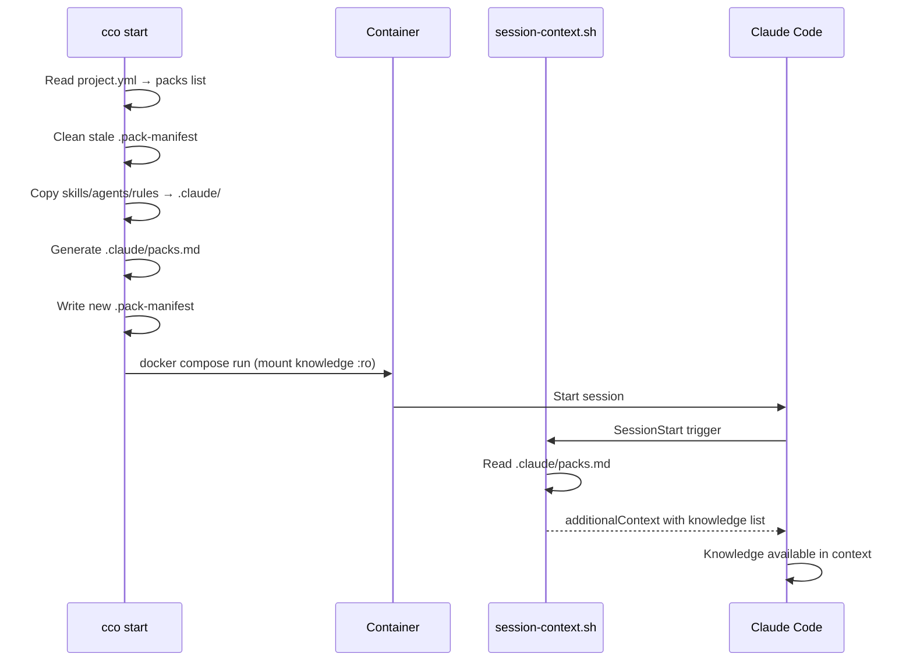

# Design: Knowledge Packs System

> Status: Implemented (v1)
> Reference ADR: [ADR-9](../architecture.md) (Copy vs Mount)
> CLI Specifications: [cli.md](../../reference/cli.md) §3.7–3.11
> project.yml format: [project-yaml.md](../../reference/project-yaml.md) §Knowledge Packs

---

## 1. Overview

Knowledge Packs solve the problem of reusable documentation and tooling across projects. Without packs, each project must manually duplicate knowledge files, skills, agents, and rules in its own `.claude/` directory. As documentation evolves, copies become stale and inconsistent.

A pack is a self-contained bundle that groups:
- **Knowledge** — reference documentation (code conventions, business overview, guidelines)
- **Skills** — reusable Claude Code skills (deploy, review, etc.)
- **Agents** — definitions of specialized subagents
- **Rules** — additional rules for session context

A pack is defined once in `global/packs/<name>/` and activated in any project by adding its name to the `packs:` list in `project.yml`. All sections are optional: a pack can contain only knowledge, only skills, or any combination.

---

## 2. Pack Format — `pack.yml`

Each pack is defined by a `pack.yml` file in its own directory under `global/packs/`:

```yaml
# global/packs/my-client/pack.yml

name: my-client

# Knowledge files — mounted read-only, injected into context automatically
knowledge:
  source: ~/documents/my-client-knowledge  # host directory to mount (read-only)
  files:
    - path: backend-coding-conventions.md
      description: "Read when writing backend code, APIs, or DB logic"
    - path: business-overview.md
      description: "Read for business context and product understanding"
    - testing-guidelines.md              # short form: without description

# Skills — copied to /workspace/.claude/skills/ at cco start
skills:
  - deploy

# Agents — copied to /workspace/.claude/agents/ at cco start
agents:
  - devops-specialist.md

# Rules — copied to /workspace/.claude/rules/ at cco start
rules:
  - api-conventions.md
```

**Allowed top-level keys**: `name`, `knowledge`, `skills`, `agents`, `rules`.

The `name` field must match the pack's directory name. `cco pack validate` emits a warning if they mismatch.

### Pack directory structure

```
global/packs/<name>/
├── pack.yml              # Pack manifest
├── knowledge/            # Fallback if knowledge.source is not specified
│   ├── overview.md
│   └── conventions.md
├── skills/
│   └── deploy/
│       └── SKILL.md
├── agents/
│   └── specialist.md
└── rules/
    └── conventions.md
```

If `knowledge.source` is omitted, knowledge files are searched in the `knowledge/` subdirectory of the pack itself.

---

## 3. Resource Types

### 3.1 Knowledge

Reference documentation files. They are read-only material that Claude reads during the session to get context on conventions, architecture, business logic, etc.

- **Mounted** as Docker read-only volumes at `/workspace/.packs/<name>/`
- **Not copied** to the project's `.claude/` directory
- **Injected** into context via `packs.md` and the `session-context.sh` hook

Each file can have an optional `description` that guides Claude on when to read it. Files without a description still appear in the list but without usage indication.

### 3.2 Skills

Claude Code skill directories, each containing a `SKILL.md`. They are copied to `/workspace/.claude/skills/` to be available in the session.

### 3.3 Agents

Subagent definition `.md` files. They are copied to `/workspace/.claude/agents/` to be available as subagents in the session.

### 3.4 Rules

Additional rules `.md` files. They are copied to `/workspace/.claude/rules/` and automatically loaded by Claude Code as project-level rules.

---

## 4. Copy vs Mount Strategy (ADR-9)

The key architectural decision for packs concerns how resources are made available in the container. There are two distinct strategies, motivated by Docker technical constraints:

### Knowledge → Mount read-only

Knowledge files are mounted as Docker read-only volumes `:ro` at `/workspace/.packs/<name>/`.

**Rationale**: knowledge files are reference material that Claude reads on-demand. Read-only mount is natural and prevents accidental writes. They don't need to reside under `.claude/` because they are not native Claude Code resources.

### Skills, Agents, Rules → Copy to project

Skills, agents, and rules are physically copied to `projects/<name>/.claude/` at `cco start` time.

**Rationale**: Docker cannot merge multiple mounts on the same target. If two packs both define agents, they cannot both be mounted on `.claude/agents/` — the second mount would shadow the first. By copying files, this limitation is eliminated. Additionally, skills/agents/rules must be located under `.claude/` where Claude Code discovers them natively, integrating with the four-tier context hierarchy (ADR-3).

---

## 5. Pack Manifest and Cleanup

### `.pack-manifest`

The `.pack-manifest` file is located in `projects/<name>/` and tracks all files copied from packs in the previous session. The format is a list of paths relative to the project directory:

```
.claude/agents/devops-specialist.md
.claude/rules/api-conventions.md
.claude/skills/deploy/SKILL.md
```

### Lifecycle

1. **Stale cleanup** — at `cco start` startup, each file listed in the existing `.pack-manifest` is removed. This ensures that resources deleted from a pack between sessions don't persist as "ghost resources".
2. **Fresh copy** — resources from all active packs are copied to the project's `.claude/` directory.
3. **Manifest write** — the new `.pack-manifest` is written with the updated list of copied files.

### Conflict detection

If two packs define a resource with the same name (e.g., both have `agents/reviewer.md`), the **last-wins** rule applies: the pack listed last in `project.yml` overwrites the file. A warning is emitted to the user:

```
Warning: Pack 'pack-b' overwrites agents/reviewer.md (previously from 'pack-a')
```

The order of packs in `project.yml` determines precedence.

---

## 6. Context Injection Mechanism

Knowledge files are not automatically loaded by Claude Code (they are not under `.claude/`). Injection occurs via a chain of three components:

### 6.1 Generation of `packs.md`

At `cco start`, the CLI generates the `.claude/packs.md` file in the project with an instructional list of available knowledge files:

```markdown
The following knowledge files provide project-specific conventions and context.
Read the relevant files BEFORE starting any implementation, review, or design task.

- /workspace/.packs/my-client/backend-coding-conventions.md — Read when writing backend code
- /workspace/.packs/my-client/business-overview.md — Read for business context
- /workspace/.packs/my-client/testing-guidelines.md
```

Files without a description appear without the `—` suffix.

### 6.2 Hook `session-context.sh`

The `session-context.sh` hook (type `SessionStart`, defined in `defaults/managed/managed-settings.json`) is executed at Claude Code session startup. If the `.claude/packs.md` file exists, its content is injected into the hook response as `additionalContext`.

This means the list of knowledge files appears automatically in Claude's initial context, without needing to modify the project's `CLAUDE.md`.

### 6.3 Complete flow



---

## 7. Interaction with Scope Hierarchy

Pack resources are inserted at the **project** level of the context hierarchy:

| Resource | Destination | Claude Code Level |
|---------|-------------|---------------------|
| Knowledge files | `/workspace/.packs/<name>/` | None (injected via hook) |
| Skills | `/workspace/.claude/skills/` | Project |
| Agents | `/workspace/.claude/agents/` | Project |
| Rules | `/workspace/.claude/rules/` | Project |

**Override order**: resources copied from packs coexist with those defined directly in the project. If a project already has an `agents/reviewer.md` and a pack provides an identically named one, the pack overwrites the project's file (copying happens later, and the manifest tracks only pack files). To avoid unwanted overwrites, use distinct names or verify with `cco pack validate`.

Resources at the **user** level (`~/.claude/agents/`, etc.) are not touched by packs. An agent defined in a pack at project level can coexist with an identically named agent at user level — Claude Code sees both, with project taking precedence over user.

---

## 8. Complete Lifecycle — `cco start`

Here's what happens, step by step, when `cco start` processes packs:

1. **Configuration reading** — `project.yml` is parsed; the `packs:` list contains the names of active packs.

2. **Stale cleanup** — if a previous `.pack-manifest` exists, each file listed is removed from the project filesystem. This removes resources from deleted or renamed packs.

3. **Conflict detection** — the CLI scans all active packs. If two packs declare a resource with the same filename (e.g., `agents/reviewer.md`), a warning is emitted. The last pack in the `packs:` list in `project.yml` takes precedence.

4. **Knowledge mount** — for each pack with `knowledge.source`, the directory is added to the generated `docker-compose.yml` as a read-only volume:
   ```yaml
   - ~/documents/my-client-knowledge:/workspace/.packs/my-client:ro
   ```

5. **Resource copy** — skills, agents, and rules from each pack are copied to their respective subdirectories of `projects/<name>/.claude/`:
   - `global/packs/<name>/skills/<skill>/` → `projects/<name>/.claude/skills/<skill>/`
   - `global/packs/<name>/agents/<agent>.md` → `projects/<name>/.claude/agents/<agent>.md`
   - `global/packs/<name>/rules/<rule>.md` → `projects/<name>/.claude/rules/<rule>.md`

6. **Manifest write** — the new `.pack-manifest` is written with all copied paths.

7. **Generation of `packs.md`** — `.claude/packs.md` is generated with the instructional list of knowledge files and their descriptions.

8. **Generation of `workspace.yml`** — `.claude/workspace.yml` is generated with a structured summary of the project (used by the `/init` command).

9. **Container launch** — `docker compose run` starts the container. Knowledge volumes are mounted, copied resources are in `.claude/`. At `SessionStart`, the hook injects `packs.md` into context.

---

## 9. CLI Commands

The CLI provides five commands for pack management:

| Command | Description |
|---------|-------------|
| `cco pack create <name>` | Creates scaffold for a new pack (directory + `pack.yml` template) |
| `cco pack list` | Lists all packs with resource count by type |
| `cco pack show <name>` | Shows pack details: resources, descriptions, projects using it |
| `cco pack validate [name]` | Validates structure and references (all packs if name omitted) |
| `cco pack remove <name>` | Removes a pack (with usage check and confirmation) |

For details of each command, see [cli.md](../../reference/cli.md) §3.7–3.11.
