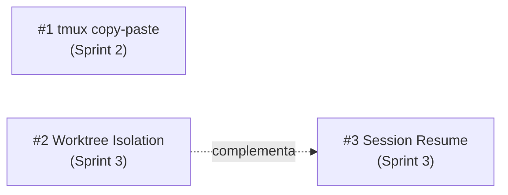

# Implementation Plan: Sprint 2 & Sprint 3

> Data: 2026-02-26
> Status: Sprint 2 completed — Sprint 3 pending
> Related: [roadmap.md](../maintainer/roadmap.md) | [progress review](./reviews/26-02-2026-progress-review.md)

---

## Panoramica

Tre feature da implementare, ordinate per priorità e dipendenze:



Sprint 2 è **indipendente** (nessuna dipendenza tecnica con Sprint 3). Sprint 3 ha due feature: worktree prima, resume dopo. Resume complementa worktree ma non ha dipendenze hard — può essere implementato anche senza worktree.

---

## Feature #1: Fix tmux copy-paste ✅

**Sprint**: 2 (qualità di vita) — **Completed 2026-02-26**
**Effort**: Basso (1 sessione)
**Rischio**: Nullo — config-only, no code logic changes
**Analysis doc**: [`terminal-clipboard-and-mouse.md`](./terminal-clipboard-and-mouse.md)

### Problema

La configurazione tmux attuale ha 6 gap che rendono copy-paste non intuitivo:
1. `default-terminal` usa `screen-256color` (obsoleto, manca italics e key codes)
2. Nessuna capability esplicita per clipboard (affidamento a heuristic `xterm*`)
3. Nessun `allow-passthrough` (blocca DCS per iTerm2 inline images)
4. Nessun `MouseDragEnd1Pane` binding (utente deve premere `y` dopo selezione — UX non ovvia)
5. Nessun `C-v` per rectangle toggle
6. Documentazione bypass key solo per iTerm2 e Terminal.app

### Implementazione

#### 1. Aggiornare `config/tmux.conf`

```tmux
# ── Terminal ─────────────────────────────────────────────────────────
set -g default-terminal "tmux-256color"
set -ga terminal-overrides ",xterm-256color:Tc"

# ── Clipboard ────────────────────────────────────────────────────────
set -g set-clipboard on
set -g allow-passthrough on
# Explicit clipboard capability for terminals where TERM is not xterm*
set -as terminal-features ",xterm-256color:clipboard"

# ── Mouse ────────────────────────────────────────────────────────────
set -g mouse on

# ── Copy mode ────────────────────────────────────────────────────────
setw -g mode-keys vi
bind-key -T copy-mode-vi v send-keys -X begin-selection
bind-key -T copy-mode-vi C-v send-keys -X rectangle-toggle
bind-key -T copy-mode-vi y send-keys -X copy-selection-and-cancel
bind-key -T copy-mode-vi MouseDragEnd1Pane send-keys -X copy-pipe-and-cancel

# Bypass tmux mouse capture for native terminal selection:
#   macOS iTerm2:      hold Option (⌥)
#   macOS Terminal.app: hold fn
#   Linux/Windows:     hold Shift
```

#### 2. Aggiornare documentazione

- `docs/user-guides/agent-teams.md` — Aggiungere sezione "Copy & Paste" con:
  - Tabella dei tasti bypass per terminale
  - Setup iTerm2 (abilitare OSC 52 in preferences)
  - Limitazioni note (Terminal.app, VTE terminals)

#### 3. Test

Nessun test automatizzato necessario (configurazione visuale). Verificare manualmente:
- [ ] Mouse drag → auto-copy (senza premere `y`)
- [ ] `y` in copy-mode → copia a clipboard
- [ ] `C-v` → rectangle selection
- [ ] Paste con Cmd+V funziona
- [ ] Pane switching con mouse funziona ancora

#### 4. Open Questions dall'analisi (§9)

| Domanda | Proposta |
|---------|----------|
| `allow-passthrough on`? | Sì — container con `--dangerously-skip-permissions`, il rischio è accettabile |
| `MouseDragEnd1Pane` con comando pipe? | No — solo copy-pipe-and-cancel senza comando. OSC 52 è sufficiente |
| Documentare iTerm2 preference? | Sì — nella guida display-modes, non nell'entrypoint |
| `terminal-overrides` per Alacritty/Kitty/Ghostty? | No per ora — copre la maggioranza con `xterm-256color`. Utenti avanzati possono customizzare |
| `mouse on` come default? | Sì — i benefici (pane switching, scrollback) superano il costo (bypass key) |

---

## Feature #2: Git Worktree Isolation

**Sprint**: 3 (feature differenziante)
**Effort**: Medio-alto (2-3 sessioni)
**Rischio**: Basso — opt-in, default invariato
**Analysis doc**: [`worktree-isolation.md`](../future/worktree/analysis.md)
**Design doc**: [`worktree-design.md`](../future/worktree/design.md)

### Prerequisiti

- Auth implementata (GITHUB_TOKEN + gh CLI) ✅
- tmux copy-paste fix (Sprint 2) — non strettamente necessario ma migliora l'esperienza

### Implementazione (dal design doc §8)

I task sono in ordine di implementazione. Ogni step è committable indipendentemente.

#### Step 1: CLI — Parsing configurazione

**File**: `bin/cco`

- Parsare `worktree` e `worktree_branch` da `project.yml` (via `yml_get`)
- Parsare flag `--worktree` in `cmd_start()`
- Calcolare `worktree_branch`: se `auto` o assente → `cco/<project-name>`
- Logica: flag `--worktree` override `project.yml`; entrambi default a `false`

#### Step 2: CLI — Compose generation condizionale

**File**: `bin/cco`

Quando worktree mode è attivo, cambiare i volumi generati **per i repo git**:

```yaml
# Senza worktree (invariato):
volumes:
  - ~/projects/my-repo:/workspace/my-repo

# Con worktree (repo git):
volumes:
  - ~/projects/my-repo:/git-repos/my-repo

# Con worktree (directory non-git in repos:) — fallback a mount diretto:
volumes:
  - ~/projects/shared-assets:/workspace/shared-assets
```

La detection avviene al momento della compose generation: per ogni entry in `repos:`, verificare se `<path>/.git` esiste sull'host. Se sì → `/git-repos/`. Se no → `/workspace/` (fallback, stesso comportamento senza worktree).

Aggiungere environment vars:
```yaml
environment:
  - WORKTREE_ENABLED=true
  - WORKTREE_BRANCH=cco/myproject
```

#### Step 3: Entrypoint — Worktree creation

**File**: `config/entrypoint.sh`

Dopo il Docker socket handling, prima del lancio Claude:

```bash
if [ "${WORKTREE_ENABLED:-}" = "true" ]; then
    BRANCH="${WORKTREE_BRANCH:-cco/${PROJECT_NAME}}"
    echo "[entrypoint] Worktree mode: creating worktrees on branch '$BRANCH'" >&2

    for repo_dir in /git-repos/*/; do
        [ -d "${repo_dir}.git" ] || continue
        repo_name=$(basename "$repo_dir")
        wt_target="/workspace/${repo_name}"

        # Prune stale worktree refs from previous container runs
        gosu claude git -C "$repo_dir" worktree prune 2>/dev/null

        # Resume existing branch or create new
        if gosu claude git -C "$repo_dir" rev-parse --verify "$BRANCH" &>/dev/null; then
            gosu claude git -C "$repo_dir" worktree add "$wt_target" "$BRANCH" 2>&1 >&2
            echo "[entrypoint] Worktree: $repo_name → $wt_target (existing branch $BRANCH)" >&2
        else
            gosu claude git -C "$repo_dir" worktree add -b "$BRANCH" "$wt_target" 2>&1 >&2
            echo "[entrypoint] Worktree: $repo_name → $wt_target (new branch $BRANCH)" >&2
        fi
    done
fi
```

Questo blocco va **prima** del `exec gosu claude ...` finale, ma **dopo** il Docker socket GID fix (che richiede root). Tutti i comandi git usano `gosu claude` per evitare che i file worktree vengano creati come root.

#### Step 4: Hook fix — `.git` file detection

**File**: `config/hooks/session-context.sh`

Cambiare `[ -d "${dir}.git" ]` a `[ -e "${dir}.git" ]` per supportare worktree (dove `.git` è un file, non una directory).

Backward-compatible: `[ -e ]` è true sia per file che directory.

#### Step 5: CLI — Post-session cleanup

**File**: `bin/cco`

Dopo che `docker compose run` ritorna in `cmd_start()`:

```bash
if [[ "$worktree_enabled" == true ]]; then
    info "Cleaning up worktrees..."
    while IFS=: read -r repo_path repo_name; do
        [[ -z "$repo_path" ]] && continue
        repo_path=$(expand_path "$repo_path")
        git -C "$repo_path" worktree prune 2>/dev/null
        local branch="$worktree_branch"
        if git -C "$repo_path" rev-parse --verify "$branch" &>/dev/null; then
            ahead=$(git -C "$repo_path" rev-list --count "origin/main..$branch" 2>/dev/null || echo "?")
            if [[ "$ahead" == "0" ]]; then
                git -C "$repo_path" branch -d "$branch" 2>/dev/null
                info "  ${repo_name}: branch '$branch' merged — deleted"
            else
                warn "  ${repo_name}: branch '$branch' has $ahead unmerged commit(s) — kept"
            fi
        fi
    done <<< "$(yml_get_repos "$project_yml")"
fi
```

#### Step 6: Template update

**File**: `defaults/_template/project.yml`

Aggiungere campi commentati:

```yaml
# ── Git Worktree Isolation (optional) ──────────────────────────────
# worktree: true            # Create worktrees for git isolation
# worktree_branch: auto     # "auto" = cco/<project-name>; or explicit branch name
```

#### Step 7: Test (dry-run)

**File**: `tests/test_worktree.sh` (nuovo)

Test per compose generation con worktree:
- [ ] `worktree: true` → repos montati su `/git-repos/` (non `/workspace/`)
- [ ] `worktree: false` (default) → repos montati su `/workspace/` (invariato)
- [ ] `WORKTREE_ENABLED=true` presente nelle env vars del compose
- [ ] `WORKTREE_BRANCH=cco/<name>` presente nelle env vars
- [ ] `worktree_branch: custom-name` → `WORKTREE_BRANCH=custom-name`
- [ ] `--worktree` flag override di `worktree: false` nel project.yml
- [ ] Non-git directories in `repos:` montate su `/workspace/` (fallback, non `/git-repos/`)

Test per post-session cleanup (mock git):
- [ ] `git worktree prune` chiamato per ogni repo
- [ ] Branch merged → deleted
- [ ] Branch con unmerged commits → kept con warning

#### Step 8: Documentazione

| Documento | Aggiornamento |
|-----------|---------------|
| `docs/reference/cli.md` | Flag `--worktree`, campi `worktree`/`worktree_branch` in project.yml |
| `docs/user-guides/project-setup.md` | Sezione "Git Worktree Isolation" con esempi |
| `docs/maintainer/docker/design.md` | Variante compose template per worktree |
| `docs/maintainer/future/worktree/design.md` | Status → "Implemented" |
| `docs/maintainer/roadmap.md` | Spostare #2 nella sezione "Completed" |

#### Edge cases (dal design doc §6)

| Caso | Gestione |
|------|----------|
| Branch esiste, worktree no | Resume: `git worktree add` senza `-b` |
| Branch esiste E ha worktree attivo | `git worktree prune` prima di add |
| Repo con uncommitted changes | Worktree indipendente, non impattato |
| Due progetti sullo stesso repo | Branch naming `cco/<project>` evita collisioni |
| Directory non-git in repos | Skip worktree, mount diretto su `/workspace/` |
| Subagent worktree inside container worktree | Funziona nativamente, nessun handling speciale |

---

## Feature #3: Session Resume

**Sprint**: 3 (dopo worktree)
**Effort**: Basso (1 sessione)
**Rischio**: Nullo — nuovo comando, nessun impatto su esistente

### Problema

Non esiste un modo per rientrare in una sessione tmux running dopo un disconnect. L'utente deve fare `docker exec` manualmente.

### Implementazione

#### 1. Nuovo comando `cmd_resume()`

**File**: `bin/cco`

```bash
cmd_resume() {
    local name="${1:?Usage: cco resume <project>}"
    local project_dir="$PROJECTS_DIR/$name"
    local project_yml="$project_dir/project.yml"

    [[ -d "$project_dir" ]] || die "Project '$name' not found in $PROJECTS_DIR"
    [[ -f "$project_yml" ]] || die "Missing project.yml for '$name'"

    # Read project name from yml (may differ from directory name)
    local project_name
    project_name=$(yml_get "$project_yml" "name")
    local container="cc-${project_name}"

    if ! docker ps --format '{{.Names}}' 2>/dev/null | grep -q "^${container}$"; then
        die "No running session for project '${project_name}'. Use 'cco start' instead."
    fi

    # Check if tmux is available inside the container
    if docker exec "$container" tmux has-session -t claude 2>/dev/null; then
        info "Reattaching to tmux session '${project_name}'..."
        docker exec -it "$container" tmux attach-session -t claude
    else
        # Non-tmux mode (--teammate-mode auto): attach to main process
        info "Reattaching to session '${project_name}' (non-tmux mode)..."
        docker exec -it "$container" bash
    fi
}
```

Nota: il project name viene letto da `project.yml` (come fa `cmd_stop()`) per coerenza con il naming del container. Il check `tmux has-session` gestisce sessioni avviate senza tmux.

#### 2. Registrare il comando nel dispatch

**File**: `bin/cco` (nel `case` statement principale)

```bash
resume)   shift; cmd_resume "$@" ;;
```

#### 3. Help text

Aggiornare `cmd_usage()` con:
```
  resume <project>        Reattach to a running session
```

#### 4. Test

**File**: `tests/test_resume.sh` (nuovo) o estendere `test_stop.sh`

- [ ] `cco resume` senza argomento → errore con usage
- [ ] `cco resume nonexistent` → errore "Project not found"
- [ ] `cco resume` con container non running → errore "No running session"
- [ ] Project name letto da `project.yml` (non dal nome directory)
- [ ] tmux session presente → `tmux attach-session`
- [ ] tmux session assente (non-tmux mode) → fallback `bash`

#### 5. Documentazione

| Documento | Aggiornamento |
|-----------|---------------|
| `docs/reference/cli.md` | Nuovo comando `cco resume` |
| `docs/maintainer/roadmap.md` | Spostare #3 nella sezione "Completed" |
| CLAUDE.md (root) | Aggiungere `cco resume` alla tabella comandi |

---

## Ordine di implementazione consigliato

```
Sessione 1 (Sprint 2):
  ├── #1 tmux copy-paste config
  ├── #1 documentazione display-modes
  └── commit + test manuale

Sessione 2 (Sprint 3 — parte 1):
  ├── #2 Step 1: CLI parsing worktree config
  ├── #2 Step 2: Compose generation condizionale
  ├── #2 Step 4: Hook fix .git detection
  ├── #2 Step 6: Template update
  ├── #2 Step 7: Test dry-run
  └── commit (worktree CLI pronto, testabile con --dry-run)

Sessione 3 (Sprint 3 — parte 2):
  ├── #2 Step 3: Entrypoint worktree creation
  ├── #2 Step 5: Post-session cleanup
  ├── #2 Step 8: Documentazione
  ├── #3 Session resume (completo)
  ├── Test integrazione (cco build + cco start --worktree)
  └── commit finale

Post-implementazione:
  ├── Aggiornare status design doc (auth, environment → Implemented)
  ├── Aggiornare roadmap
  └── Considerare tag v1.0
```

---

## Rischi e mitigazioni

| Rischio | Probabilità | Impatto | Mitigazione |
|---------|-------------|---------|-------------|
| `tmux-256color` terminfo non disponibile | Bassa (Bookworm lo ha) | Basso | Fallback: `screen-256color` |
| `git worktree add` fallisce in entrypoint | Media | Alto | `git worktree prune` preventivo; error handling con messaggio chiaro |
| Post-session cleanup non raggiunto (kill -9 del container) | Bassa | Basso | Worktree prune nel prossimo `cco start --worktree` |
| `[ -e .git ]` non funziona su tutti gli shell | Nulla (POSIX) | — | POSIX standard, supportato ovunque |
| Docker exec su container stopped | — | — | Check `docker ps` prima di exec in `cmd_resume()` |
