# Roadmap

> Tracks planned features, improvements, and known issues for future iterations.
> Last updated: 2026-03-13 (Sprint ordering revised: vault multi-PC sync added as Sprint 7, E2E moved up to Sprint 8, session resume deferred to exploratory, pack inheritance merged into Sprint 11. Added: #B4 cco update regression, hot-reload exploratory section, defaults/ structure review in Sprint 5b).

---

## Completed

### Automated Testing ✓

Pure bash test suite (`bin/test`) covering 154 test cases across 11 test files. Tests run without a Docker container using `--dry-run` and file-system assertions. Zero external dependencies.

**Coverage**: `cco init`, `cco project create`, `cco start --dry-run` (docker-compose generation), knowledge pack generation, workspace.yml generation, YAML parser edge cases, `cco stop`, `cco project list`.

### Knowledge Packs — Full Schema (knowledge + skills + agents + rules) ✓

Packs now support the full expanded schema: `knowledge:` section for document mounts, plus `skills:`, `agents:`, and `rules:` for project-level tooling. *(Originally copied at `cco start` time — superseded by ADR-14: all resources are now mounted `:ro` via Docker volumes.)*

Knowledge files are injected automatically via `session-context.sh` hook (no `@.claude/packs.md` in CLAUDE.md required).

### /init-workspace Skill ✓

Managed project initialization skill at `defaults/managed/.claude/skills/init-workspace/SKILL.md` (baked into the Docker image at `/etc/claude-code/.claude/skills/init-workspace/`). Uses a distinct name to avoid clashing with the built-in `/init` command. Reads `workspace.yml`, explores repositories, generates a structured CLAUDE.md, and writes descriptions back to `workspace.yml`. Non-overridable — updated only via `cco build`.

### Review Fixes Sprint 1 ✓

CLI robustness and settings alignment from the 24-02-2026 architecture review:
- Fixed test `test_packs_md_has_auto_generated_header` (assertion mismatch with generated output)
- Added `alwaysThinkingEnabled: true` to global settings (aligning doc and implementation)
- Simplified SessionStart hook to single catch-all matcher (was duplicated for startup + clear)
- Added session lock check — `cco start` now detects already-running containers and exits with a clear message
- Added `secrets.env` format validation — malformed lines are skipped with a warning
- Added `--claude-version` flag and `ARG CLAUDE_CODE_VERSION` for reproducible Docker builds

### Pack Manifest & Conflict Detection ✓

Name conflicts between packs (same agent/rule/skill name) emit a warning at `cco start`. *(Originally used `.pack-manifest` for copy tracking — superseded by ADR-14: resources are now mounted `:ro`, eliminating the need for copy/cleanup.)*

### Authentication & Secrets ✓

Unified auth for container sessions: `GITHUB_TOKEN` (fine-grained PAT) as primary mechanism, `gh` CLI in Dockerfile, per-project `secrets.env` with override semantics. `gh auth login --with-token` + `gh auth setup-git` in entrypoint. OAuth credentials seeded from macOS Keychain to `~/.claude/.credentials.json`.

### Environment Extensibility ✓

Full extensibility story implemented:
- `docker.image` in project.yml — custom Docker image per project
- Per-project `secrets.env` overrides `global/secrets.env`
- `global/setup.sh` — system packages at build time (via `SETUP_SCRIPT_CONTENT` build arg)
- `projects/<name>/setup.sh` — per-project runtime setup (mounted and run by entrypoint)
- `projects/<name>/mcp-packages.txt` — per-project npm MCP packages (installed at startup)

### Docker Socket Toggle ✓

`docker.mount_socket: false` in project.yml disables Docker socket mount for projects that don't need sibling containers.

### Pack CLI (create, list, show, remove, validate) ✓

Full pack management CLI in `lib/cmd-pack.sh`:
- `cco pack create <name>` — scaffolds directory structure (`knowledge/`, `skills/`, `agents/`, `rules/`) and a commented `pack.yml` template. Validates name (lowercase, hyphens) and checks for duplicates.
- `cco pack list` — tabular view of all packs with resource counts per category
- `cco pack show <name>` — detailed view: knowledge files with descriptions, skills, agents, rules, projects using the pack
- `cco pack remove <name> [--force]` — removes pack with in-use guard (warns if referenced by projects, prompts confirmation)
- `cco pack validate [name]` — validates pack structure for one pack or all packs

### Update System ✓

Intelligent config merge system to update `projects/` and `global/` without losing user customizations.

**What's included**:
- `cco update` command: `--project`, `--all`, `--dry-run`, `--force`, `--keep`, `--backup` flags
- Hybrid checksum + migrations engine (`lib/update.sh`, `lib/cmd-update.sh`)
- `.cco-meta` file: schema versioning, file manifest with hashes, saved language choices
- Migration runner: `migrations/global/` and `migrations/project/` (NNN_name.sh convention)
- Backward compatibility for installations without `.cco-meta`
- `cco init` updated: generates `.cco-meta` with correct hashes on first setup
- `cco start` updated: shows hint if schema_version < latest
- Test suite: `tests/test_update.sh` (14 scenarios)

**Docs**: [update-system/design.md](./update-system/design.md)

---

### Scope Hierarchy Refactor (Sprint 3) ✓

Reorganization of the configuration hierarchy to leverage Claude Code's native **Managed** level (`/etc/claude-code/`). Infrastructure files (hooks, env, deny rules) are protected in the Managed level; agents, skills, rules, and preferences moved to the User level where they are customizable and never overwritten.

**What changed**:
- `defaults/system/` removed → replaced by `defaults/managed/` (baked into the Docker image)
- `managed-settings.json` contains only hooks, env vars, statusLine, deny rules (non-overridable)
- Agents, skills, rules, settings.json moved to `defaults/global/.claude/` (user-owned)
- `_sync_system_files()` removed → replaced by `_migrate_to_managed()` (one-time migration)
- `system.manifest` removed (managed files baked into the Docker image via `COPY`)
- Dockerfile updated: `COPY defaults/managed/ /etc/claude-code/`
- Test suite updated: `test_system_sync.sh` → `test_managed_scope.sh` (15 tests)

**Docs**: [analysis](./scope-hierarchy/analysis.md) | [ADR-3](./architecture.md) | [ADR-8](./architecture.md)

### Security Hardening — Phase 1, 2, 3 (ADR-13) ✓

Full secure-by-default config parsing and validation. Completed in commit `17407a2`.

**What was implemented**:
- `_parse_bool()` helper: whitespace trimming + case-insensitive + YAML variants (`yes/no/on/off/1/0`) + safe fallback with warning
- All boolean fields use `_parse_bool()`: `docker.mount_socket`, `browser.enabled`, `github.enabled`
- `extra_mounts[].readonly` default changed `false` → `true` (secure-by-default, breaking change)
- Validation pass in `cmd_start()`: project name (regex + max 63 chars), `browser.cdp_port` (numeric 1-65535), `auth.method` (enum)
- JSON escaping for `browser.mcp_args` to prevent injection
- Security docs: ADR-13 (architecture.md), NFR-4/5 (spec.md), HIGH-5 (security.md), validation rules (project-yaml.md)
- Test coverage: 44 yaml_parser tests (all passing, 508 total)

**Breaking change note**: Projects with `extra_mounts:` entries that omit `readonly:` now mount read-only by default. Users who need write access must add `readonly: false` explicitly. No migration script needed — the default is managed by the CLI, not stored in user config files.

---

### Interactive Tutorial Project (Sprint 5) ✓

Built-in interactive tutorial created by `cco init`. Users launch it with `cco start tutorial` for AI-guided onboarding, project setup assistance, and best practices guidance.

**What was implemented**:
- Tutorial project template (`defaults/tutorial/`): project.yml with path placeholders, CLAUDE.md with 12-module curriculum, documentation map, and session flow
- 3 skills: `/tutorial` (guided onboarding), `/setup-project` (project creation wizard), `/setup-pack` (pack creation wizard)
- `tutorial-behavior.md` rule: teacher-not-executor constraints, cco-is-host-only awareness
- CLI integration: `cco init` creates tutorial with `{{CCO_REPO_ROOT}}` and `{{CCO_USER_CONFIG_DIR}}` substitution
- Structured agentic development guide (`docs/user-guides/structured-agentic-development.md`): cco-specific version mapping 18 principles to framework features
- Default rules aligned with guide: workflow.md Closure phase, scope discipline, test suite verification, doc accuracy check; /design skill ADR suggestion
- Tutorial discovery in docs: overview.md, installation.md, first-project.md, README.md
- Test coverage: 17 tutorial tests (dry-run compose, --force idempotency, setup.sh)

**Docs**: [analysis](./tutorial-project/analysis.md) | [design](./tutorial-project/design.md)

---

### Config Repo: Sharing & Import + Vault (Sprint 6 + Sprint 10) ✓

Unified design implementing both sharing/import and personal vault under the Config Repo model.

**What was implemented**:
- `user-config/` unified directory restructure (migration 003)
- `cco pack install <url> [--pick] [--token] [--force]` — install packs from remote Config Repos (sparse-checkout with shallow fallback)
- `cco pack update <name> [--all] [--force]` — update from recorded `.cco-source`
- `cco pack export <name>` — `.tar.gz` archive for offline distribution
- `cco project install <url> [--pick] [--as] [--var K=V]` — install project templates with variable resolution
- `cco manifest refresh/validate/show` — manifest lifecycle
- `cco vault init/sync/diff/log/status/restore` — git-backed config versioning
- `cco vault remote add/remove/push/pull` — remote backup
- `lib/remote.sh` — sparse-checkout clone helper with auth support
- Secret detection in vault sync (scans for `.env`, `.key`, `.pem`, `.credentials.json`)
- Vault `.gitignore` template (excludes secrets, runtime files, session state)
- Test coverage: 102 tests (pack install 26, project install 17, share 19, vault 40)

**Docs**: [analysis](./config-repo/analysis.md) | [design](./config-repo/design.md)

### Sharing Enhancements (Sprint 6b) ✓

Enhancements to the Config Repo sharing system. Addresses naming issues, portability gaps, and missing publish workflow.

**What was implemented**:
- Rename `cco share` → `cco manifest` (and `share.yml` → `manifest.yml`)
- `cco remote add/remove/list` — top-level remote management with per-remote token storage
- `cco pack publish` / `cco project publish` — push to named remote Config Repos
- `cco project add-pack` / `cco project remove-pack` — manage project pack lists
- `cco pack internalize` — convert source-referencing packs to self-contained
- Enhanced `cco project install` — auto-install pack dependencies, template variable resolution

**Docs**: [analysis](./config-repo/sharing-analysis.md) | [design](./config-repo/sharing-design.md)

---

### Fix tmux copy-paste (Sprint 2) ✓

Improved tmux configuration for clipboard and selection:
- `default-terminal` upgraded from `screen-256color` to `tmux-256color` (full terminfo)
- Explicit `terminal-features` clipboard capability for non-xterm terminals
- `allow-passthrough on` for DCS sequences (iTerm2 inline images, etc.)
- `MouseDragEnd1Pane` auto-copy on mouse release (no need to press `y`)
- `C-v` rectangle selection toggle in copy-mode
- Fixed bypass key documentation (Terminal.app uses `fn`, not `Shift`)
- Full copy-paste user guide in agent-teams.md (setup per terminal, 3 methods, troubleshooting)
- In-container OAuth login section with copy-paste instructions
- Cross-reference from project-setup.md Authentication section

**Analysis**: [terminal-clipboard-and-mouse.md](./agent-teams/analysis.md)

---

## Known Bugs

### #B4 `cco update --all` does not correctly update files from `defaults/`

**Reported**: 2026-03-13 (field testing).

**Symptom**: After a cco update that introduces changes to `defaults/global/` or `defaults/_template/`, running `cco update --all` does not propagate those changes to existing user installations. Users who had an older `project.yml` schema had to manually copy from the template and merge their customizations by hand.

**Root cause (suspected)**: The update system's checksum manifest (`lib/update.sh`) tracks files under `.claude/` directories, but root-level files such as `project.yml` and `global/` non-`.claude/` files are not covered. When `defaults/` content changes, the manifest hash does not reflect the delta, so the update engine skips the file.

**Impact**: Medium-high. Any user who initialized before a template change and then runs `cco update` will silently miss the new defaults. Manual merge is error-prone and un-documented.

**Required work**:
- Audit `cco update` for all file categories: `global/.claude/`, `projects/*/project.yml`, and root-level project files.
- Implement intelligent merge for `project.yml`: add new keys from the template without overwriting user-customized values. Mirror the approach used for `.claude/` files (checksum + migration runner).
- Introduce template versioning: record the template schema version in `.cco-meta` at `cco project create` / `cco init` time so the update engine can determine which migrations to run for `project.yml`.
- Add migration coverage for `project.yml` schema changes retroactively (audit existing migrations `001`–`005` for completeness).
- Extend test suite (`tests/test_update.sh`) with scenarios covering: outdated `project.yml`, partial user customizations, idempotent re-runs.

**See also**: Sprint 5b #A (Defaults Restructuring) — a cleaner `defaults/` layout will make the scope of "what needs to be updated" more explicit.

---

### #B2 Claude Code native installer — migration deferred

The `Dockerfile` uses `npm install -g @anthropic-ai/claude-code` which is deprecated upstream in favor of a native installer. The native installer was not adopted because it exhibited bot-detection blocks when downloading from container/CI environments.

**Status**: No action needed now. npm install still works and no removal timeline is known. Revisit when Anthropic announces a deprecation date or ships a CI-friendly native installer.

**Tracked**: add to a future maintenance sprint once the upstream situation is clearer.

---

### #B3 Global `setup.sh` (build-time) not effective at runtime ✓ FIXED

**Fixed in**: `fix/setup/dual-phase-global`

**Root cause**: `global/setup.sh` ran only at build time (Dockerfile). User-level config (dotfiles, tmux keybindings) written during build was overwritten by Docker volume mounts at runtime. The `claude` user didn't exist yet at build time either.

**Fix — Dual-phase setup**: Split global setup into two scripts:
- `user-config/global/setup-build.sh` — heavy installs (apt packages, compilers). Runs at Docker build time as root.
- `user-config/global/setup.sh` — lightweight runtime config (dotfiles, aliases, tmux). Runs at every `cco start` as user `claude`, before project setup.

Migration `005_split_global_setup.sh` renames existing `setup.sh` → `setup-build.sh` for users with build-time content.

---

### #B1 Browser MCP loaded when `browser.enabled: false` ✓ FIXED

**Fixed in**: `refactor/managed-integrations/convention`

**Root causes fixed**:

1. **Stale files on host**: `cmd-start.sh` now explicitly `rm -f .managed/browser.json .managed/.browser-port` when `browser_enabled != "true"`. Files moved to `.managed/` (gitignored).

2. **Additive-only MCP merge**: `entrypoint.sh` now resets `mcpServers = {}` before each session, then re-merges from source files. The entrypoint uses a generic loop over `/workspace/.managed/*.json` — only present when browser is enabled, so disabling browser removes it cleanly.

3. **`.managed/` gitignored**: migration 003 adds `.managed/` to each project's `.gitignore`.

---

## Implementation Order

Features are prioritized by impact for third-party users adopting claude-orchestrator. Each sprint can be implemented independently.

```mermaid
graph LR
    DONE["✅ Completed<br/>Sprint 4, Sprint 5,<br/>Sprint 6+10, Sprint 6b,<br/>ADR-13, Bugfix #B1"]

    S5b["Sprint 5b<br/>#Defaults restructure<br/>#Template system"]
    S6S["Sprint 6-Security<br/>#Docker Restriction<br/>#Internet Controls<br/>#mount_socket default fix"]
    S7V["Sprint 7-Vault<br/>#Multi-PC sync<br/>#Memory policy"]
    S8E["Sprint 8-E2E<br/>#E2E Test Suite"]
    S9L["Sprint 9-Linux<br/>#Linux OAuth<br/>(pre-open-source)"]
    S10I["Sprint 10-Isolation<br/>#Git Worktree"]
    S11E["Sprint 11-Ecosystem<br/>#Pack inheritance<br/>#cco project edit<br/>#StatusLine"]
    S12R["Sprint 12-RAG<br/>#Project RAG"]

    DONE --> S5b
    S5b --> S6S
    S6S --> S7V
    S7V --> S8E
    S8E --> S9L
    S9L --> S10I
    S10I --> S11E
    S11E --> S12R
```



---

### Sprint 4 — Browser Automation ✅

Required for frontend testing and debugging. Requires stable scope hierarchy (Sprint 3) for proper MCP configuration placement.

#### #4 Browser MCP Integration — Implemented

Enable Claude to control a browser via Chrome DevTools MCP, with the browser visible to the user on the host OS.

**What was implemented**:
- `browser.enabled` / `browser.mode: host` in `project.yml` + `--chrome` flag override
- `chrome-devtools-mcp` pre-installed in Docker image
- Auto-generated `browser-mcp.json` with privacy flags (`--no-usage-statistics`, `--no-performance-crux`)
- Third MCP merge source in `entrypoint.sh`
- CDP port conflict resolution with auto-assignment and `.browser-port` runtime file
- `cco chrome [start|stop|status]` host-side helper with `--project` port resolution
- `extra_hosts: host.docker.internal:host-gateway` for Linux compatibility
- Support for custom `mcp_args` via `yml_get_list`
- 18 new tests (12 dry-run + 6 chrome command)

**Deferred to future sprint**: container mode (`mode: container` — sibling Chrome + noVNC)

**Docs**: [analysis](./browser-mcp/analysis.md) | [design](./browser-mcp/design.md)

---

---

### Sprint 5b — Defaults Restructuring & Template System

Refactoring leggero del layout `defaults/` e introduzione del meccanismo `--template` per installare progetti built-in opzionali.

#### #A `defaults/` Directory Structure Review

**Context**: `defaults/` has a flat layout with directories of different types at the same level (`managed/`, `global/`, `_template/`, `tutorial/`). As optional templates are added, the structure becomes ambiguous. More importantly, the mapping of each `defaults/` subdirectory to its target scope (managed → global → project → repo) is not visually obvious to contributors, which creates confusion when deciding where a new default file should live.

**Goal**: reorganize `defaults/` so that its subdirectory names mirror the four-tier config hierarchy and the `user-config/` structure:

```
defaults/
├── managed/          → /etc/claude-code/ (Docker image, unchanged)
├── global/           → user-config/global/ (cco init, unchanged)
├── projects/         → user-config/projects/
│   ├── _template/    (scaffold for cco project create)
│   └── tutorial/     (built-in tutorial project)
└── packs/            (empty for now, extensible)
```

**Secondary goal**: clarify in documentation which files in each tier are "write-once at install time" vs. "updated by `cco update`". This directly informs fix #B4 above — the update system must have an explicit list of paths it owns.

**Impacted files**: `Dockerfile`, `bin/cco` (`DEFAULTS_DIR`, `TEMPLATE_DIR`), `lib/cmd-init.sh`, `lib/cmd-project.sh`, tests, documentation.

**Contesto originale**: `defaults/` ha una struttura piatta con directory di tipo diverso allo stesso livello (`managed/`, `global/`, `_template/`, `tutorial/`). Con l'aggiunta di template opzionali la struttura diventa poco chiara.

**Obiettivo**: riorganizzare `defaults/` con sottodirectory per tipo, in modo che rispecchi la struttura di `user-config/`:

```
defaults/
├── managed/          → /etc/claude-code/ (Docker image, invariato)
├── global/           → user-config/global/ (cco init, invariato)
├── projects/         → user-config/projects/
│   ├── _template/    (scaffold per cco project create)
│   └── tutorial/     (progetto tutorial built-in)
└── packs/            (vuoto per ora, estendibile in futuro)
```

**File impattati**: `Dockerfile`, `bin/cco` (DEFAULTS_DIR, TEMPLATE_DIR), `lib/cmd-init.sh`, `lib/cmd-project.sh`, test, documentazione.

#### #B `cco project create --template <name>`

**Contesto**: l'unico modo per installare il tutorial è `cco init`. Un utente che ha già inizializzato e vuole il tutorial (o lo ha rimosso e vuole ricrearlo) non ha un comando diretto.

**Obiettivo**: `--template` copia da `defaults/projects/<name>/` invece di `defaults/projects/_template/`, con sostituzione placeholder.

```bash
cco project create --template tutorial    # installa tutorial da defaults
cco project create --template <name>      # estendibile a futuri template
cco project create my-app --repo ~/code   # comportamento attuale (da _template)
```

**Logica**: se `--template` è presente e il template esiste in `defaults/projects/`, copia e sostituisci placeholder. Se non esiste, errore con elenco template disponibili.

#### #C `cco tutorial` Alias

Alias triviale in `bin/cco`: `cco tutorial` → `cco start tutorial`. Migliora discoverability per nuovi utenti.

---

### Sprint 6-Security — Sandbox & Network Hardening

Elevato a priorità alta. Tre componenti di sicurezza: Docker socket proxy con filtro granulare, restrizioni mount per sibling container, e controllo dell'accesso internet. Include bugfix al default di `mount_socket`.

**Status**: Analysis & Design complete. Implementation pending.
**Docs**: [analysis](./docker-security/analysis.md) | [design](./docker-security/design.md)

#### Phase A: `mount_socket` Safe Default → `false` (bugfix)

Change default from `true` to `false` in `cmd-start.sh:111`. Migration adds explicit `mount_socket: true` to existing projects. Breaking change — projects relying on implicit socket access must declare it.

#### Phase B: Docker Socket Proxy (Go binary)

Custom Go HTTP proxy (`cco-docker-proxy`) between Claude and Docker socket. Filters requests by:
- **Container policy**: `project_only` (default) / `allowlist` / `denylist` / `unrestricted` — per name prefix and label
- **Mount restrictions**: `none` / `project_only` (default) / `allowlist` / `any` — with implicit deny for sensitive paths
- **Security constraints**: block `--privileged`, drop capabilities, resource limits, max container count
- **Network filtering**: restrict container network membership to project networks

Architecture: proxy listens on `/var/run/docker-proxy.sock`, forwards to real socket. Claude's `DOCKER_HOST` points to proxy. Proxy runs as root (socket access), Claude runs as unprivileged user.

#### Phase C: Network Hardening (Squid sidecar)

Layered defense for internet access control:
- **Layer 1**: Claude Code deny rules (`WebFetch`, `WebSearch`, `curl`, `wget`) for restricted/none modes
- **Layer 2**: Docker network `internal: true` + Squid proxy sidecar with SNI-based domain filtering

Configuration: `network.internet: full | restricted | none` with `allowed_domains` / `blocked_domains`. Squid sidecar bridges internal (project) and external (internet) networks. Created containers inherit the same restriction or can be overridden.

---

### Sprint 7-Vault — Multi-PC Config Sync & Memory Policy

Urgente. La suite vault attuale non supporta scenari multi-macchina con configurazioni diverse (es. progetti di lavoro su PC-A, progetti personali su PC-B). Inoltre manca una policy definita su quando usare la memoria automatica di Claude vs. la documentazione versionata del progetto.

**Docs**: [analysis](./vault-multipc/analysis.md) ← da espandere in design doc all'inizio dello sprint.

#### #A Vault Profile-Based Selective Sync

**Contesto**: `cco vault push/pull` opera sull'intera `user-config/` come un singolo `git push/pull`. Con due PC che hanno progetti diversi su un remote condiviso, un `pull` porta progetti indesiderati sull'altro PC.

**Obiettivo**: ogni macchina dichiara un profilo locale (`vault.yml`, gitignored) che specifica cosa sincronizzare:

```yaml
# user-config/vault.yml  (gitignored — locale per macchina)
sync:
  global: true
  packs: true
  templates: true
  projects:
    - work-proj-1
    - work-proj-2
```

**Scope**:
- `cco vault profile init` — setup interattivo del profilo locale
- `cco vault profile add <type> <name>` / `remove` — gestione del profilo
- `cco vault profile show` — mostra configurazione attuale
- `cco vault push/pull` legge `vault.yml` e scopa le operazioni git ai path dichiarati
- `vault.yml` aggiunto al `.gitignore` del vault

**Approcci da valutare** (vedi analysis.md):
- Profile-only (Phase 1): single branch, push/pull per path — immediato, semplice
- Branch strategy (Phase 2): branch per macchina + merge del global da `main` — più pulito storicamente, più complesso

**Decisione**: implementare Phase 1 in questo sprint. Phase 2 è opzionale e può seguire in futuro.

#### #B Memory vs. Docs Policy

**Contesto**: nessuna policy definisce quando Claude deve scrivere in `MEMORY.md` vs. nella documentazione del progetto (`.claude/`, `docs/`). Note importanti finiscono in memoria (locale-macchina, non versionata) quando dovrebbero stare nei doc del repo.

**Obiettivo**: policy chiara e documentata, integrata nel CLAUDE.md globale e nel skill `/init-workspace`.

**Use `MEMORY.md` for**: note temporanee di sessione, preferenze di interazione, context di breve durata.
**Use project docs for**: decisioni architetturali, pattern appresi, convenzioni, regole → `.claude/rules/`, `docs/`.

**Scope**:
- Aggiornare `defaults/global/.claude/CLAUDE.md` con la policy
- Aggiornare il skill `/init-workspace` per guidare la classificazione delle note
- Documentare in `docs/reference/context-hierarchy.md` la sezione memoria

#### #C Memory Vaulting (opzionale)

**Contesto**: se si vuole sincronizzare `MEMORY.md` tra PC, occorre separare `memory/` da `claude-state/` (che contiene i transcript, troppo grandi per il vault).

**Proposta**: montare `memory/` separatamente da `claude-state/`:
```yaml
- ./claude-state:/home/claude/.claude/projects/-workspace
- ./memory:/home/claude/.claude/projects/-workspace/memory
```

`memory/` sarebbe tracciata dal vault (non gitignored), mentre `claude-state/` rimane esclusa.

**Scope**:
- Validare che il bind-mount override funzioni con Claude Code
- Aggiornare `cmd-start.sh` e template docker-compose
- Aggiornare `.gitignore` del vault
- Migration per progetti esistenti

**Priorità**: dipende dal feedback utente. Implementare solo se #B (policy) non è sufficiente.

---

### Sprint 8-E2E — E2E Integration Test Suite

Anticipato rispetto alla pianificazione originale (era Sprint 9). La suite dry-run copre 482 test ma non verifica il comportamento reale del container. E2E è prerequisito per garantire la qualità prima di Sprint 9-Linux (onboarding di nuovi utenti su Linux).

#### #E2E Integration Test Suite

**Obiettivo**: testare il comportamento reale del container, non solo la generazione dei file di configurazione.

**Scope**:
- Entrypoint: socket GID resolution, MCP merge (`~/.claude/mcp.json` risultante), gosu, tmux session
- Mount verification: repos presenti in `/workspace/`, `~/.claude/` montato correttamente, env var `CCO_*` presenti
- Socket: presente se `mount_socket: true`, assente se `false`
- Auth flow: credenziali copiate correttamente nel container
- Setup.sh: script eseguito come `claude` (non root)
- `cco stop`: container terminato correttamente

**Architettura**:
- Test runner separato (`bin/test-e2e`) che richiede Docker disponibile
- Override dell'entrypoint con script di verifica interna (`tests/e2e/fixtures/verify-entrypoint.sh`) — no Claude interattivo
- Fixture in `tests/e2e/fixtures/`: project.yml minimali, repo Git minimali per test di mount
- CI: opzionale (richiede Docker), documentato come "local-first"
- Non sostituisce la suite bash dry-run — la complementa

---

### Sprint 9-Linux — Linux OAuth Support

**Priorità**: alta, richiesta pre-open-source. Attualmente l'autenticazione OAuth funziona solo su macOS via Keychain. Su Linux l'unica opzione è API key via env var.

#### #L Linux OAuth Alternative

**Contesto**: il flusso OAuth attuale legge le credenziali da macOS Keychain (`security find-generic-password`) e le copia in `~/.claude/.credentials.json`. Su Linux non esiste Keychain.

**Obiettivi**:
- Supportare il flusso OAuth su Linux senza dipendenze esterne (no gnome-keyring, no KDE Wallet)
- Mantenere backward compatibility su macOS
- Sicurezza: credenziali mai in plain text su disco senza protezione adeguata

**Approcci da valutare**:
- **`credentials.json` pre-generato**: l'utente ottiene il token OAuth da un browser su macOS o via `claude auth` standalone, poi lo copia manualmente. `cco init` su Linux skippa il seeding e avverte l'utente.
- **`secret-tool` (Linux keyring)**: alternativa a `security` su sistemi con `libsecret` (GNOME). Non universale (non disponibile su tutti i distro/headless).
- **`pass` (password-store)**: gestore password basato su GPG, disponibile su qualsiasi Linux. Richiede setup GPG.
- **Encrypted file**: credenziali cifrate con una passphrase (derivata da machine ID o inserita dall'utente). Simile al macOS Keychain ma implementato localmente.
- **`CLAUDE_API_KEY` come default su Linux**: se no Keychain detected, default `auth.method: api_key` con prompt guidato.

**Scope**:
- Rilevamento automatico del sistema (macOS vs Linux)
- Implementazione del metodo Linux scelto in `lib/cmd-auth.sh` (o equivalente)
- Documentazione: authentication.md aggiornato con sezione Linux
- Test: coverage per entrambi i path (macOS Keychain + Linux alternative)

---

### Sprint 10-Isolation — Git Worktree

#### #6 Git Worktree Isolation

Opt-in git isolation for container sessions. When enabled, repos are mounted at `/git-repos/` and the entrypoint creates worktrees at `/workspace/` on a dedicated branch (`cco/<project>`). Claude works in the worktrees transparently.

**Why here**: Auth is now implemented, enabling the full PR/merge workflow that makes worktree isolation valuable.

**Activation**: `cco start <project> --worktree` or `worktree: true` in `project.yml`.

**Key design points**:
- Worktrees created inside the container (consistent paths, no `.git` file rewriting)
- Commits persist in host repo via bind-mounted object store
- Post-session cleanup integrated in `cmd_start()` (no `cco stop` needed)
- Multiple merge/PR cycles during a single session via standard `gh pr create`
- Branch `cco/<project>` persists across sessions; next `--worktree` start reuses it

**Docs**: [analysis](./future/worktree/analysis.md) | [design](./future/worktree/design.md) | [ADR-10](./architecture.md)

---

### Sprint 11-Ecosystem — Pack, Polish & Automation

Raccoglie le feature di completamento rimaste dopo che pack CLI e sharing sono stati implementati.

#### #9 Pack Inheritance / Composition

Allow packs to extend other packs:
```yaml
extends: base-client
files:
  - additional-doc.md
```

> Note: `cco pack create` (and the full pack CLI) was implemented in Sprint 6+10. Only inheritance/composition remains.

#### #10 `cco project edit <name>` command

Open project.yml in `$EDITOR` and regenerate docker-compose.yml after save.

#### #10b Status bar improvements

Improve the StatusLine hook (`config/hooks/statusline.sh`) for better usability.

**Issues**:
1. **Cost display not useful for Max subscribers**: the `$cost` field shows cumulative USD spend, which is meaningless for users on Claude Max (flat-rate subscription). They would rather see remaining session/conversation budget as a percentage.
2. **Context % stale after /compact**: the `ctx` percentage does not update immediately after `/compact` or other context-reducing events — it takes an additional prompt before the value refreshes. This is likely a Claude Code limitation in how frequently it calls the StatusLine hook, but we should investigate workarounds.

**Proposed changes**:
- Detect subscription type from session data and show remaining session % instead of cost for Max users (requires investigation of available fields in StatusLine JSON input)
- Investigate whether `Notification` or `Stop` hook events can trigger a StatusLine refresh to fix stale context %
- If Claude Code does not expose subscription/session data, document the limitation and request the feature upstream
- Add configurable status bar format (e.g., `statusline.format` in global settings) so users can customize what is shown

---

### Sprint 12-RAG — Project RAG

Integrated semantic search over project knowledge, providing Claude with relevant context from large codebases and documentation without consuming the full context window.

#### #13 Default RAG MCP Integration

Provide a built-in, opt-in RAG system that indexes project files and serves relevant context to Claude via MCP. Users can already add any RAG MCP server manually (via `mcp-packages.txt` or `mcp.json`), but a default integration adds significant value:
- Lowers the barrier (no research/configuration needed)
- Tested, integrated out-of-the-box experience
- Differentiator for claude-orchestrator adoption
- User can override with their own preferred MCP server

**Activation** (same pattern as browser):
```yaml
# project.yml
rag:
  enabled: false          # true to activate project RAG
  provider: local-rag     # default provider (can be overridden)
  paths: []               # directories to index (default: all repos)
  exclude: []             # glob patterns to exclude from indexing
```

**Provider options evaluated**:

| Provider | Storage | Local | API cost | Code-specific | Complexity |
|---|---|---|---|---|---|
| **mcp-local-rag** (LanceDB) | File-based | 100% | None | No | Low |
| **Qdrant MCP** (official) | Qdrant | Yes | None (FastEmbed) | No | Medium |
| **RagCode MCP** (Qdrant+Ollama) | Qdrant+Ollama | 100% | None | Yes (AST) | High (~8GB) |
| claude-context (Zilliz) | Zilliz Cloud | No | OpenAI | Yes | Medium |

**Recommended default provider**: `mcp-local-rag` — zero external dependencies, file-based LanceDB (no server process), ~90MB embedding model download, single `npx` command. Good balance of simplicity and capability.

**Alternative for power users**: Qdrant MCP with FastEmbed for local embedding — more capable but requires Qdrant instance (can run as sibling container via docker compose).

**Key design points**:
- Auto-generate RAG MCP config at `cco start` (same pattern as `.managed/browser.json` → `.managed/rag.json`)
- Index on first session start; incremental updates on subsequent starts
- Provider-agnostic: `rag.provider` selects which MCP server to configure; custom providers supported
- Respect `.gitignore` and `rag.exclude` patterns
- Indexing runs in background (non-blocking session start)
- Storage in `projects/<name>/rag-data/` (gitignored, persistent across sessions)

**Scope**:
- `project.yml` schema extension (`rag:` section)
- RAG MCP generation in `cmd-start.sh` (parallel to browser MCP)
- Entrypoint merge support (third merge source after global + browser)
- Migration for existing projects
- Documentation and user guide
- Test coverage for RAG enable/disable/provider switching

**Open questions**:
- Should indexing happen at `cco start` time (host-side) or inside the container (entrypoint)?
- Should we support a `cco rag reindex` command for manual re-indexing?
- For Qdrant provider: auto-start Qdrant as sibling container, or require user to manage it?
- Should the index be shared across projects that mount the same repos?

---

## Long-term / Exploratory

### Hot-reload for In-Container Configuration

**Raised**: 2026-03-13.

**Context**: Currently all configuration changes (project.yml, policy.json, resource limits) require a full container restart. Some configuration categories are already live-reloadable because they are mounted as Docker volumes and read on every use; others are baked into the image or applied only at entrypoint time.

**Analysis needed**:

| Config category | Currently live? | Hot-reload feasible? |
|---|---|---|
| `project.yml` (repos, packs, browser) | No — parsed at `cco start` | Partial — volume-mounted but not re-read |
| `project.yml` (security policy, resource limits) | No | Potentially yes with a file watcher |
| `policy.json` (Docker proxy allow/denylist) | No — loaded at proxy start | Yes — proxy can `SIGHUP`-reload |
| `global/.claude/` rules / agents / skills | Yes — mounted `:ro` | Already live |
| `defaults/managed/` (hooks, deny rules) | No — baked in image | No — requires rebuild |
| `secrets.env` | No — loaded at entrypoint | No — requires restart |
| `setup.sh` (runtime) | No — run once at entrypoint | No — requires restart |

**Proposed exploration**:
- **Docker proxy `SIGHUP` reload** (`proxy/policy.json`): the Go proxy watches for `SIGHUP` or polls the file for changes, reloading the allow/denylist without restarting the container. This is the highest-value target since security policy changes currently require a full restart.
- **File watcher on `project.yml`**: a lightweight watcher (e.g., `inotifywait`) in the entrypoint notifies the session of changes to fields that are safe to apply at runtime (e.g., `browser.enabled`, resource soft-limits). Changes to structural fields (repo list, image) still require restart.
- **Explicit `cco reload <project>` command**: rather than automatic detection, expose a host-side command that sends a reload signal to the running container. Simpler, more predictable, no polling overhead.

**Decision criteria**: hot-reload adds complexity (signal handling, partial-state risks). It is only worth implementing if the restart cost is measurably painful for users. Collect feedback before committing to an implementation approach.

---

### Session Reattach (`cco attach`)

**Background**: initially scoped as "Session Resume" (Sprint 8). Reassessed 2026-03-11.

Claude Code's native `/resume` command already handles the primary use case: it reads session transcripts from `claude-state/` (mounted Docker volume) to restore conversation context, and works across container rebuilds.

The feature `cco attach <project>` would add: reattach to a *currently running* container's tmux session after the terminal window closes or detaches. This is equivalent to `docker exec -it <container> tmux attach` and could be a simple convenience one-liner rather than a full sprint item.

**Potential future value**: complements worktree isolation (Sprint 10) — after a worktree session, the user might want to reattach to continue on the same branch. Revisit after worktree isolation is implemented.

**Decision**: defer. Implement as a one-liner `cco attach` if user demand emerges post-Sprint 10.

---

### Remote sessions

Mount repos from remote hosts via SSHFS or similar, enabling orchestrator sessions on remote development machines.

### Multi-project sessions

A single Claude session with repos from multiple projects, for cross-project refactoring or analysis tasks.

### Vault Branch Strategy (Phase 2)

After Sprint 7-Vault implements profile-based selective sync, a branch strategy can be layered on top for cleaner per-machine git history:
- `main` branch: shared content (global, packs, templates)
- Per-machine branches: `pc-work`, `pc-home`, etc.
- `cco vault pull --global`: merge shared content from `main` into current branch

This is not needed for the primary use case (preventing wrong-PC projects) but improves git history quality for power users.

### Web UI

Optional lightweight web dashboard for listing projects, starting/stopping sessions, viewing logs, and editing project configurations.

---

## Declined / Won't Do

### PreToolUse safety hook

Proposal from review (§2 gap 3): hook to block `rm -rf /`, `git push --force`, access outside `/workspace`.

**Decision**: Do not implement. Docker is the sandbox (ADR-1). The container operates with limited mount points. Specific commands to block can be added case-by-case in the future if a concrete need emerges.

### claude-mem integration

**Evaluated**: 2026-03-03. [github.com/thedotmack/claude-mem](https://github.com/thedotmack/claude-mem) — automatic persistent memory for Claude Code via SQLite + ChromaDB, with AI-powered compression and progressive disclosure.

**Decision**: Do not integrate. Reasons:
- **Heavy dependencies**: Requires Bun, Python (for ChromaDB), SQLite, Node.js — too many runtimes inside an already complex container
- **Overhead per tool call**: Every tool use triggers a hook (timeout up to 120s). With agent teams in tmux, the slowdown multiplies
- **Hidden API costs**: AI compression consumes Anthropic tokens every session, even when the user doesn't search memory
- **Architecture mismatch**: Uses Claude Code's plugin system, not the lifecycle hooks standard. Integration with cco's entrypoint would be fragile
- **License**: AGPL-3.0 (restrictive for commercial use); `ragtime/` directory uses PolyForm Noncommercial
- **Overlap**: claude-orchestrator already provides per-project auto memory isolation (`claude-state/memory/`) and `MEMORY.md` auto-loaded by Claude Code. The native system covers most use cases adequately
- **Value/complexity ratio**: High complexity for incremental benefit over the native memory system

Users who want claude-mem can install it independently as a Claude Code plugin — it doesn't require framework integration.

### claude-context (Zilliz) as default RAG

**Evaluated**: 2026-03-03. [github.com/zilliztech/claude-context](https://github.com/zilliztech/claude-context) — semantic code search via Zilliz Cloud (managed Milvus) with hybrid BM25 + dense vector retrieval.

**Decision**: Do not use as default RAG provider. Reasons:
- **Cloud dependency**: Requires Zilliz Cloud — cannot function offline or without external service
- **Requires OpenAI API key**: Additional cost for embeddings (unless using alternative providers)
- **Privacy concern**: Source code is sent to third-party cloud services (Zilliz + OpenAI) — unacceptable for many commercial/proprietary projects
- **Vendor lock-in**: Strongly tied to Zilliz/Milvus ecosystem

However, claude-context could be supported as an **optional provider** in the RAG system (Sprint 11, `rag.provider: claude-context`) for users who accept cloud-based indexing. The default provider should be fully local.
