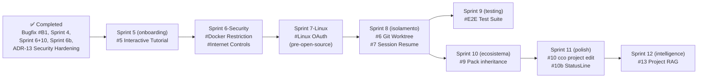

# Roadmap

> Tracks planned features, improvements, and known issues for future iterations.
> Last updated: 2026-03-09 (ADR-13 security hardening complete; roadmap re-prioritized: Docker socket restriction + internet controls elevated; Linux OAuth added pre-open-source; E2E testing added).

---

## Completed

### Automated Testing ✓

Pure bash test suite (`bin/test`) covering 154 test cases across 11 test files. Tests run without a Docker container using `--dry-run` and file-system assertions. Zero external dependencies.

**Coverage**: `cco init`, `cco project create`, `cco start --dry-run` (docker-compose generation), knowledge pack generation, workspace.yml generation, YAML parser edge cases, `cco stop`, `cco project list`.

### Knowledge Packs — Full Schema (knowledge + skills + agents + rules) ✓

Packs now support the full expanded schema: `knowledge:` section for document mounts, plus `skills:`, `agents:`, and `rules:` for project-level tooling. Skills/agents/rules are copied at `cco start` time (not mounted, to avoid Docker volume collisions with multi-pack setups).

Knowledge files are injected automatically via `session-context.sh` hook (no `@.claude/packs.md` in CLAUDE.md required).

### /init-workspace Skill ✓

Managed project initialization skill at `defaults/managed/.claude/skills/init-workspace/SKILL.md` (baked into the Docker image at `/etc/claude-code/.claude/skills/init-workspace/`). Uses a distinct name to avoid clashing with the built-in `/init` command. Reads `workspace.yml`, explores repositories, generates a structured CLAUDE.md, and writes descriptions back to `workspace.yml`. Non-overridable — updated only via `cco build`.

### Review Fixes Sprint 1 ✓

CLI robustness and settings alignment from the 24-02-2026 architecture review:
- Fixed test `test_packs_md_has_auto_generated_header` (assertion mismatch with generated output)
- Added `alwaysThinkingEnabled: true` to global settings (aligning doc and implementation)
- Simplified SessionStart hook to single catch-all matcher (was duplicated for startup + clear)
- Added session lock check — `cco start` now detects already-running containers and exits with a clear message
- Added `secrets.env` format validation — malformed lines are skipped with a warning
- Added `--claude-version` flag and `ARG CLAUDE_CODE_VERSION` for reproducible Docker builds

### Pack Manifest & Conflict Detection ✓

Pack resources are now tracked in a `.pack-manifest` file. On each `cco start`, stale files from the previous session are cleaned before fresh copies. Name conflicts between packs (same agent/rule/skill name) emit a warning. ADR-9 documents the copy-vs-mount design trade-off.

### Authentication & Secrets ✓

Unified auth for container sessions: `GITHUB_TOKEN` (fine-grained PAT) as primary mechanism, `gh` CLI in Dockerfile, per-project `secrets.env` with override semantics. `gh auth login --with-token` + `gh auth setup-git` in entrypoint. OAuth credentials seeded from macOS Keychain to `~/.claude/.credentials.json`.

### Environment Extensibility ✓

Full extensibility story implemented:
- `docker.image` in project.yml — custom Docker image per project
- Per-project `secrets.env` overrides `global/secrets.env`
- `global/setup.sh` — system packages at build time (via `SETUP_SCRIPT_CONTENT` build arg)
- `projects/<name>/setup.sh` — per-project runtime setup (mounted and run by entrypoint)
- `projects/<name>/mcp-packages.txt` — per-project npm MCP packages (installed at startup)

### Docker Socket Toggle ✓

`docker.mount_socket: false` in project.yml disables Docker socket mount for projects that don't need sibling containers.

### Pack CLI (create, list, show, remove, validate) ✓

Full pack management CLI in `lib/cmd-pack.sh`:
- `cco pack create <name>` — scaffolds directory structure (`knowledge/`, `skills/`, `agents/`, `rules/`) and a commented `pack.yml` template. Validates name (lowercase, hyphens) and checks for duplicates.
- `cco pack list` — tabular view of all packs with resource counts per category
- `cco pack show <name>` — detailed view: knowledge files with descriptions, skills, agents, rules, projects using the pack
- `cco pack remove <name> [--force]` — removes pack with in-use guard (warns if referenced by projects, prompts confirmation)
- `cco pack validate [name]` — validates pack structure for one pack or all packs

### Update System ✓

Intelligent config merge system to update `projects/` and `global/` without losing user customizations.

**What's included**:
- `cco update` command: `--project`, `--all`, `--dry-run`, `--force`, `--keep`, `--backup` flags
- Hybrid checksum + migrations engine (`lib/update.sh`, `lib/cmd-update.sh`)
- `.cco-meta` file: schema versioning, file manifest with hashes, saved language choices
- Migration runner: `migrations/global/` and `migrations/project/` (NNN_name.sh convention)
- Backward compatibility for installations without `.cco-meta`
- `cco init` updated: generates `.cco-meta` with correct hashes on first setup
- `cco start` updated: shows hint if schema_version < latest
- Test suite: `tests/test_update.sh` (14 scenarios)

**Docs**: [update-system/design.md](./update-system/design.md)

---

### Scope Hierarchy Refactor (Sprint 3) ✓

Reorganization of the configuration hierarchy to leverage Claude Code's native **Managed** level (`/etc/claude-code/`). Infrastructure files (hooks, env, deny rules) are protected in the Managed level; agents, skills, rules, and preferences moved to the User level where they are customizable and never overwritten.

**What changed**:
- `defaults/system/` removed → replaced by `defaults/managed/` (baked into the Docker image)
- `managed-settings.json` contains only hooks, env vars, statusLine, deny rules (non-overridable)
- Agents, skills, rules, settings.json moved to `defaults/global/.claude/` (user-owned)
- `_sync_system_files()` removed → replaced by `_migrate_to_managed()` (one-time migration)
- `system.manifest` removed (managed files baked into the Docker image via `COPY`)
- Dockerfile updated: `COPY defaults/managed/ /etc/claude-code/`
- Test suite updated: `test_system_sync.sh` → `test_managed_scope.sh` (15 tests)

**Docs**: [analysis](./scope-hierarchy/analysis.md) | [ADR-3](./architecture.md) | [ADR-8](./architecture.md)

### Security Hardening — Phase 1, 2, 3 (ADR-13) ✓

Full secure-by-default config parsing and validation. Completed in commit `17407a2`.

**What was implemented**:
- `_parse_bool()` helper: whitespace trimming + case-insensitive + YAML variants (`yes/no/on/off/1/0`) + safe fallback with warning
- All boolean fields use `_parse_bool()`: `docker.mount_socket`, `browser.enabled`, `github.enabled`
- `extra_mounts[].readonly` default changed `false` → `true` (secure-by-default, breaking change)
- Validation pass in `cmd_start()`: project name (regex + max 63 chars), `browser.cdp_port` (numeric 1-65535), `auth.method` (enum)
- JSON escaping for `browser.mcp_args` to prevent injection
- Security docs: ADR-13 (architecture.md), NFR-4/5 (spec.md), HIGH-5 (security.md), validation rules (project-yaml.md)
- Test coverage: 37 yaml_parser tests (all passing, 475 total)

**Breaking change note**: Projects with `extra_mounts:` entries that omit `readonly:` now mount read-only by default. Users who need write access must add `readonly: false` explicitly. No migration script needed — the default is managed by the CLI, not stored in user config files.

---

### Config Repo: Sharing & Import + Vault (Sprint 6 + Sprint 10) ✓

Unified design implementing both sharing/import and personal vault under the Config Repo model.

**What was implemented**:
- `user-config/` unified directory restructure (migration 003)
- `cco pack install <url> [--pick] [--token] [--force]` — install packs from remote Config Repos (sparse-checkout with shallow fallback)
- `cco pack update <name> [--all] [--force]` — update from recorded `.cco-source`
- `cco pack export <name>` — `.tar.gz` archive for offline distribution
- `cco project install <url> [--pick] [--as] [--var K=V]` — install project templates with variable resolution
- `cco manifest refresh/validate/show` — manifest lifecycle
- `cco vault init/sync/diff/log/status/restore` — git-backed config versioning
- `cco vault remote add/remove/push/pull` — remote backup
- `lib/remote.sh` — sparse-checkout clone helper with auth support
- Secret detection in vault sync (scans for `.env`, `.key`, `.pem`, `.credentials.json`)
- Vault `.gitignore` template (excludes secrets, runtime files, session state)
- Test coverage: 102 tests (pack install 26, project install 17, share 19, vault 40)

**Docs**: [analysis](./config-repo/analysis.md) | [design](./config-repo/design.md)

### Sharing Enhancements (Sprint 6b) ✓

Enhancements to the Config Repo sharing system. Addresses naming issues, portability gaps, and missing publish workflow.

**What was implemented**:
- Rename `cco share` → `cco manifest` (and `share.yml` → `manifest.yml`)
- `cco remote add/remove/list` — top-level remote management with per-remote token storage
- `cco pack publish` / `cco project publish` — push to named remote Config Repos
- `cco project add-pack` / `cco project remove-pack` — manage project pack lists
- `cco pack internalize` — convert source-referencing packs to self-contained
- Enhanced `cco project install` — auto-install pack dependencies, template variable resolution

**Docs**: [analysis](./config-repo/sharing-analysis.md) | [design](./config-repo/sharing-design.md)

---

### Fix tmux copy-paste (Sprint 2) ✓

Improved tmux configuration for clipboard and selection:
- `default-terminal` upgraded from `screen-256color` to `tmux-256color` (full terminfo)
- Explicit `terminal-features` clipboard capability for non-xterm terminals
- `allow-passthrough on` for DCS sequences (iTerm2 inline images, etc.)
- `MouseDragEnd1Pane` auto-copy on mouse release (no need to press `y`)
- `C-v` rectangle selection toggle in copy-mode
- Fixed bypass key documentation (Terminal.app uses `fn`, not `Shift`)
- Full copy-paste user guide in agent-teams.md (setup per terminal, 3 methods, troubleshooting)
- In-container OAuth login section with copy-paste instructions
- Cross-reference from project-setup.md Authentication section

**Analysis**: [terminal-clipboard-and-mouse.md](./agent-teams/analysis.md)

---

## Known Bugs

### #B2 Claude Code native installer — migration deferred

The `Dockerfile` uses `npm install -g @anthropic-ai/claude-code` which is deprecated upstream in favor of a native installer. The native installer was not adopted because it exhibited bot-detection blocks when downloading from container/CI environments.

**Status**: No action needed now. npm install still works and no removal timeline is known. Revisit when Anthropic announces a deprecation date or ships a CI-friendly native installer.

**Tracked**: add to a future maintenance sprint once the upstream situation is clearer.

---

### #B1 Browser MCP loaded when `browser.enabled: false` ✓ FIXED

**Fixed in**: `refactor/managed-integrations/convention`

**Root causes fixed**:

1. **Stale files on host**: `cmd-start.sh` now explicitly `rm -f .managed/browser.json .managed/.browser-port` when `browser_enabled != "true"`. Files moved to `.managed/` (gitignored).

2. **Additive-only MCP merge**: `entrypoint.sh` now resets `mcpServers = {}` before each session, then re-merges from source files. The entrypoint uses a generic loop over `/workspace/.managed/*.json` — only present when browser is enabled, so disabling browser removes it cleanly.

3. **`.managed/` gitignored**: migration 003 adds `.managed/` to each project's `.gitignore`.

---

## Implementation Order

Features are prioritized by impact for third-party users adopting claude-orchestrator. Each sprint can be implemented independently.



---

### Sprint 4 — Browser Automation ✅

Required for frontend testing and debugging. Requires stable scope hierarchy (Sprint 3) for proper MCP configuration placement.

#### #4 Browser MCP Integration — Implemented

Enable Claude to control a browser via Chrome DevTools MCP, with the browser visible to the user on the host OS.

**What was implemented**:
- `browser.enabled` / `browser.mode: host` in `project.yml` + `--chrome` flag override
- `chrome-devtools-mcp` pre-installed in Docker image
- Auto-generated `browser-mcp.json` with privacy flags (`--no-usage-statistics`, `--no-performance-crux`)
- Third MCP merge source in `entrypoint.sh`
- CDP port conflict resolution with auto-assignment and `.browser-port` runtime file
- `cco chrome [start|stop|status]` host-side helper with `--project` port resolution
- `extra_hosts: host.docker.internal:host-gateway` for Linux compatibility
- Support for custom `mcp_args` via `yml_get_list`
- 18 new tests (12 dry-run + 6 chrome command)

**Deferred to future sprint**: container mode (`mode: container` — sibling Chrome + noVNC)

**Docs**: [analysis](./browser-mcp/analysis.md) | [design](./browser-mcp/design.md)

---

### Sprint 5 — Interactive Tutorial Project

Required before open-source publication. Provides a guided, hands-on onboarding experience that teaches new users how to use claude-orchestrator effectively.

#### #5 Interactive Tutorial Project — AI-Guided Onboarding

A self-contained example project that users launch with `cco start tutorial` (or similar). Once inside the session, an AI agent guides the user through claude-orchestrator's features interactively — explaining concepts, demonstrating workflows, and answering questions in real time.

**Goals**:
- Lower the barrier to entry for new users adopting claude-orchestrator
- Showcase key features (project setup, knowledge packs, agent teams, browser MCP, etc.) through hands-on exercises
- Serve as living documentation — the tutorial itself uses the features it teaches
- Clarify common doubts about architecture, configuration, and advanced techniques
- Prepare the repository for open-source publication with a polished first-run experience

**Key design points**:
- Ships as a built-in example project (e.g. `examples/tutorial/`) with a pre-configured `project.yml`
- A dedicated knowledge pack provides the tutorial curriculum and structured lesson content
- An agent (skill or custom agent) orchestrates the interactive session: presents lessons, checks understanding, adapts to user pace
- Progressive curriculum: basics (project structure, repos, CLAUDE.md) → intermediate (packs, secrets, MCP) → advanced (agent teams, worktrees, custom images)
- Each lesson includes a practical exercise the user performs inside the tutorial session
- The agent can answer free-form questions about claude-orchestrator at any point (FAQ mode)
- `cco tutorial` shortcut command (alias for `cco start tutorial`) for discoverability

**Scope**:
- Tutorial project scaffold (`examples/tutorial/` or `defaults/tutorial/`)
- Knowledge pack with curriculum content (lessons, exercises, reference material)
- Tutorial agent/skill with interactive guidance logic
- CLI integration (`cco tutorial` command or documented `cco start` usage)
- Minimal test coverage for tutorial project generation

**Open questions**:
- Should the tutorial be a standalone `cco tutorial` command or a regular project the user creates via `cco project create --template tutorial`?
- How many lessons / what depth for v1? Suggest starting with 5-7 core lessons covering the essentials
- Should the tutorial track user progress across sessions (resume where you left off)?

---

---

### Sprint 6-Security — Sandbox & Network Hardening

Elevato a priorità alta. Due problemi di sicurezza residui che richiedono analisi e design approfondito prima dell'open source release: controllo granulare del Docker socket e gestione dell'accesso a internet.

#### #A Docker Socket Restriction (nuovo ADR)

**Contesto**: Claude ha accesso non filtrato al Docker socket dell'host — accesso root-equivalent su tutti i container del sistema. L'attuale `docker.mount_socket: false` è un toggle blunt (tutto o niente). Non esiste middle ground.

**Obiettivo**: consentire a Claude l'accesso ai container del progetto corrente (`cc-<project>-*` o label `cco.project=<name>`), bloccando operazioni su container non correlati.

**Approcci da valutare** (richiede ADR dedicato):
- **Tecnativa docker-socket-proxy**: filtra per API endpoint type (non per container specifico). Blocca `POST /containers/create` ma permette `GET /containers/json`. Soluzione consolidata, ma non offre isolamento per-container.
- **Custom HTTP proxy**: intercetta le chiamate Docker API e filtra per container name/label nel payload. Richiede parsing del body — più potente ma custom.
- **Docker Authorization Plugin**: richiede modifica del daemon host (`--authorization-plugin`). Non fattibile per uso personale.
- **Configurazione in project.yml**: `docker.socket_policy: full | filtered | none` con allowlist container patterns.

**Scope analisi**:
- Mappare le API Docker effettivamente usate da Claude (compose up/down, exec, logs, build)
- Valutare impatto su workflow Docker-from-Docker (sibling containers `cc-<project>-*`)
- Decidere se il proxy gira come sidecar nel container o come processo separato sull'host
- Progettare la configurazione `project.yml` per la policy

#### #B Internet Access Controls

**Contesto**: Claude ha accesso completo a internet all'interno del container. Utile per la maggior parte dei workflow (npm install, git clone, API calls), ma introduce rischi in sessioni autonome o con poco human-in-the-loop: prompt injection via contenuti web, exfiltration di secrets, download di dipendenze non verificate.

**Obiettivo**: ridurre la superficie di attacco per sessioni autonome, senza bloccare i workflow normali.

**Approcci da valutare** (richiede ADR dedicato):
- **Network policy per project**: `network.internet: full | restricted | none` in project.yml
  - `full` (default): accesso completo (comportamento attuale)
  - `restricted`: allowlist di domini (npm registry, github, pypi, etc.) via egress proxy
  - `none`: solo rete interna `cc-<project>` (per sessioni puramente locali)
- **Egress proxy (Squid/mitmproxy)**: sidecar container che implementa l'allowlist
- **Claude Code deny rules**: usare `denyTools` per bloccare tool specifici (WebFetch, WebSearch) a livello managed — più semplice ma meno granulare
- **Autonomy level come trigger**: `network.internet: restricted` automatico quando `autonomy: high` in project.yml

**Scope analisi**:
- Identificare i domini legittimi necessari (npm, github, pypi, anthropic API, etc.)
- Valutare l'impatto sulle features esistenti (pack install, browser MCP, setup.sh)
- Decidere la granularità: per-project vs per-session vs globale
- Prompt injection via browser MCP: già mitigato parzialmente dai deny rules? Valutare.

---

### Sprint 7-Linux — Linux OAuth Support

**Priorità**: alta, richiesta pre-open-source. Attualmente l'autenticazione OAuth funziona solo su macOS via Keychain. Su Linux l'unica opzione è API key via env var.

#### #L Linux OAuth Alternative

**Contesto**: il flusso OAuth attuale legge le credenziali da macOS Keychain (`security find-generic-password`) e le copia in `~/.claude/.credentials.json`. Su Linux non esiste Keychain.

**Obiettivi**:
- Supportare il flusso OAuth su Linux senza dipendenze esterne (no gnome-keyring, no KDE Wallet)
- Mantenere backward compatibility su macOS
- Sicurezza: credenziali mai in plain text su disco senza protezione adeguata

**Approcci da valutare**:
- **`credentials.json` pre-generato**: l'utente ottiene il token OAuth da un browser su macOS o via `claude auth` standalone, poi lo copia manualmente. `cco init` su Linux skippa il seeding e avverte l'utente.
- **`secret-tool` (Linux keyring)**: alternativa a `security` su sistemi con `libsecret` (GNOME). Non universale (non disponibile su tutti i distro/headless).
- **`pass` (password-store)**: gestore password basato su GPG, disponibile su qualsiasi Linux. Richiede setup GPG.
- **Encrypted file**: credenziali cifrate con una passphrase (derivata da machine ID o inserita dall'utente). Simile al macOS Keychain ma implementato localmente.
- **`CLAUDE_API_KEY` come default su Linux**: se no Keychain detected, default `auth.method: api_key` con prompt guidato.

**Scope**:
- Rilevamento automatico del sistema (macOS vs Linux)
- Implementazione del metodo Linux scelto in `lib/cmd-auth.sh` (o equivalente)
- Documentazione: authentication.md aggiornato con sezione Linux
- Test: coverage per entrambi i path (macOS Keychain + Linux alternative)

---

### Sprint 8 — Isolation features

#### #6 Git Worktree Isolation

Opt-in git isolation for container sessions. When enabled, repos are mounted at `/git-repos/` and the entrypoint creates worktrees at `/workspace/` on a dedicated branch (`cco/<project>`). Claude works in the worktrees transparently.

**Why here**: Auth is now implemented, enabling the full PR/merge workflow that makes worktree isolation valuable.

**Activation**: `cco start <project> --worktree` or `worktree: true` in `project.yml`.

**Key design points**:
- Worktrees created inside the container (consistent paths, no `.git` file rewriting)
- Commits persist in host repo via bind-mounted object store
- Post-session cleanup integrated in `cmd_start()` (no `cco stop` needed)
- Multiple merge/PR cycles during a single session via standard `gh pr create`
- Session resume: branch `cco/<project>` persists, next `--worktree` start reuses it

**Docs**: [analysis](./future/worktree/analysis.md) | [design](./future/worktree/design.md) | [ADR-10](./architecture.md)

#### #7 Session resume

`cco resume <project>` — reattach to a running tmux session inside a running container. Complements worktree isolation: resume work on the same branch.

---

### Sprint 8 — Pack ecosystem

> Note: `cco pack create` (and the full pack CLI) was implemented earlier and is now in the Completed section.

#### #9 Pack inheritance / composition

Allow packs to extend other packs:
```yaml
extends: base-client
files:
  - additional-doc.md
```

---

### Sprint 9 — E2E Testing

Attualmente la test suite è composta da 475 test in modalità dry-run (no Docker). I bug di runtime (entrypoint, socket GID, MCP merge, gosu, tmux) non sono coperti. Per il mantenimento a lungo termine — specialmente post-open-source con contribuzioni esterne — una suite E2E è necessaria.

#### #E2E Integration Test Suite

**Obiettivo**: testare il comportamento reale del container, non solo la generazione dei file di configurazione.

**Scope**:
- `cco start <project>` lancia effettivamente un container Docker e verifica che Claude si avvii
- Entrypoint: socket GID resolution, MCP merge (`~/.claude/mcp.json` risultante), gosu, tmux session
- Auth flow: credenziali copiate correttamente nel container
- Browser MCP: server avviato, porta CDP corretta
- Setup.sh: script eseguito come `claude` (non root)
- `cco stop`: container terminato correttamente

**Architettura proposta**:
- Test runner separato (`bin/test-e2e`) che richiede Docker disponibile
- Ogni test lancia un container con `--dry-run-entrypoint` o override dell'entrypoint per verificare senza lanciare Claude interattivamente
- Fixture di progetti di test in `tests/fixtures/`
- CI: opzionale (può richiedere Docker in CI), documentato come "local-only" se necessario
- Non sostituisce la suite bash dry-run — la complementa

**Priorità**: media — importante per mantenimento a lungo termine, non urgente pre-release.

---

### Sprint 10 — Automation and polish

#### #10 `cco project edit <name>` command

Open project.yml in `$EDITOR` and regenerate docker-compose.yml after save.

#### #10b Status bar improvements

Improve the StatusLine hook (`config/hooks/statusline.sh`) for better usability.

**Issues**:
1. **Cost display not useful for Max subscribers**: the `$cost` field shows cumulative USD spend, which is meaningless for users on Claude Max (flat-rate subscription). They would rather see remaining session/conversation budget as a percentage.
2. **Context % stale after /compact**: the `ctx` percentage does not update immediately after `/compact` or other context-reducing events — it takes an additional prompt before the value refreshes. This is likely a Claude Code limitation in how frequently it calls the StatusLine hook, but we should investigate workarounds.

**Proposed changes**:
- Detect subscription type from session data and show remaining session % instead of cost for Max users (requires investigation of available fields in StatusLine JSON input)
- Investigate whether `Notification` or `Stop` hook events can trigger a StatusLine refresh to fix stale context %
- If Claude Code does not expose subscription/session data, document the limitation and request the feature upstream
- Add configurable status bar format (e.g., `statusline.format` in global settings) so users can customize what is shown

---

---

### Sprint 12 — Project RAG

Integrated semantic search over project knowledge, providing Claude with relevant context from large codebases and documentation without consuming the full context window.

#### #13 Default RAG MCP Integration

Provide a built-in, opt-in RAG system that indexes project files and serves relevant context to Claude via MCP. Users can already add any RAG MCP server manually (via `mcp-packages.txt` or `mcp.json`), but a default integration adds significant value:
- Lowers the barrier (no research/configuration needed)
- Tested, integrated out-of-the-box experience
- Differentiator for claude-orchestrator adoption
- User can override with their own preferred MCP server

**Activation** (same pattern as browser):
```yaml
# project.yml
rag:
  enabled: false          # true to activate project RAG
  provider: local-rag     # default provider (can be overridden)
  paths: []               # directories to index (default: all repos)
  exclude: []             # glob patterns to exclude from indexing
```

**Provider options evaluated**:

| Provider | Storage | Local | API cost | Code-specific | Complexity |
|---|---|---|---|---|---|
| **mcp-local-rag** (LanceDB) | File-based | 100% | None | No | Low |
| **Qdrant MCP** (official) | Qdrant | Yes | None (FastEmbed) | No | Medium |
| **RagCode MCP** (Qdrant+Ollama) | Qdrant+Ollama | 100% | None | Yes (AST) | High (~8GB) |
| claude-context (Zilliz) | Zilliz Cloud | No | OpenAI | Yes | Medium |

**Recommended default provider**: `mcp-local-rag` — zero external dependencies, file-based LanceDB (no server process), ~90MB embedding model download, single `npx` command. Good balance of simplicity and capability.

**Alternative for power users**: Qdrant MCP with FastEmbed for local embedding — more capable but requires Qdrant instance (can run as sibling container via docker compose).

**Key design points**:
- Auto-generate RAG MCP config at `cco start` (same pattern as `.managed/browser.json` → `.managed/rag.json`)
- Index on first session start; incremental updates on subsequent starts
- Provider-agnostic: `rag.provider` selects which MCP server to configure; custom providers supported
- Respect `.gitignore` and `rag.exclude` patterns
- Indexing runs in background (non-blocking session start)
- Storage in `projects/<name>/rag-data/` (gitignored, persistent across sessions)

**Scope**:
- `project.yml` schema extension (`rag:` section)
- RAG MCP generation in `cmd-start.sh` (parallel to browser MCP)
- Entrypoint merge support (third merge source after global + browser)
- Migration for existing projects
- Documentation and user guide
- Test coverage for RAG enable/disable/provider switching

**Open questions**:
- Should indexing happen at `cco start` time (host-side) or inside the container (entrypoint)?
- Should we support a `cco rag reindex` command for manual re-indexing?
- For Qdrant provider: auto-start Qdrant as sibling container, or require user to manage it?
- Should the index be shared across projects that mount the same repos?

---

## Long-term / Exploratory

### Remote sessions

Mount repos from remote hosts via SSHFS or similar, enabling orchestrator sessions on remote development machines.

---

### Remote sessions

Mount repos from remote hosts via SSHFS or similar, enabling orchestrator sessions on remote development machines.

### Multi-project sessions

A single Claude session with repos from multiple projects, for cross-project refactoring or analysis tasks.

### Web UI

Optional lightweight web dashboard for listing projects, starting/stopping sessions, viewing logs, and editing project configurations.

---

## Declined / Won't Do

### PreToolUse safety hook

Proposal from review (§2 gap 3): hook to block `rm -rf /`, `git push --force`, access outside `/workspace`.

**Decision**: Do not implement. Docker is the sandbox (ADR-1). The container operates with limited mount points. Specific commands to block can be added case-by-case in the future if a concrete need emerges.

### claude-mem integration

**Evaluated**: 2026-03-03. [github.com/thedotmack/claude-mem](https://github.com/thedotmack/claude-mem) — automatic persistent memory for Claude Code via SQLite + ChromaDB, with AI-powered compression and progressive disclosure.

**Decision**: Do not integrate. Reasons:
- **Heavy dependencies**: Requires Bun, Python (for ChromaDB), SQLite, Node.js — too many runtimes inside an already complex container
- **Overhead per tool call**: Every tool use triggers a hook (timeout up to 120s). With agent teams in tmux, the slowdown multiplies
- **Hidden API costs**: AI compression consumes Anthropic tokens every session, even when the user doesn't search memory
- **Architecture mismatch**: Uses Claude Code's plugin system, not the lifecycle hooks standard. Integration with cco's entrypoint would be fragile
- **License**: AGPL-3.0 (restrictive for commercial use); `ragtime/` directory uses PolyForm Noncommercial
- **Overlap**: claude-orchestrator already provides per-project auto memory isolation (`claude-state/memory/`) and `MEMORY.md` auto-loaded by Claude Code. The native system covers most use cases adequately
- **Value/complexity ratio**: High complexity for incremental benefit over the native memory system

Users who want claude-mem can install it independently as a Claude Code plugin — it doesn't require framework integration.

### claude-context (Zilliz) as default RAG

**Evaluated**: 2026-03-03. [github.com/zilliztech/claude-context](https://github.com/zilliztech/claude-context) — semantic code search via Zilliz Cloud (managed Milvus) with hybrid BM25 + dense vector retrieval.

**Decision**: Do not use as default RAG provider. Reasons:
- **Cloud dependency**: Requires Zilliz Cloud — cannot function offline or without external service
- **Requires OpenAI API key**: Additional cost for embeddings (unless using alternative providers)
- **Privacy concern**: Source code is sent to third-party cloud services (Zilliz + OpenAI) — unacceptable for many commercial/proprietary projects
- **Vendor lock-in**: Strongly tied to Zilliz/Milvus ecosystem

However, claude-context could be supported as an **optional provider** in the RAG system (Sprint 11, `rag.provider: claude-context`) for users who accept cloud-based indexing. The default provider should be fully local.
