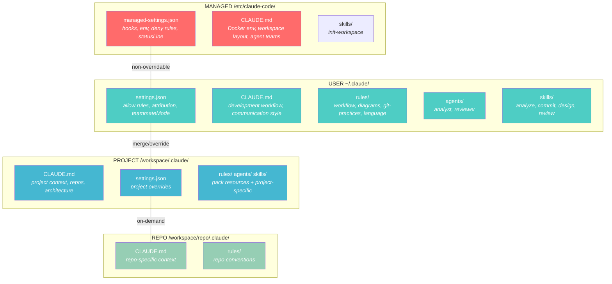
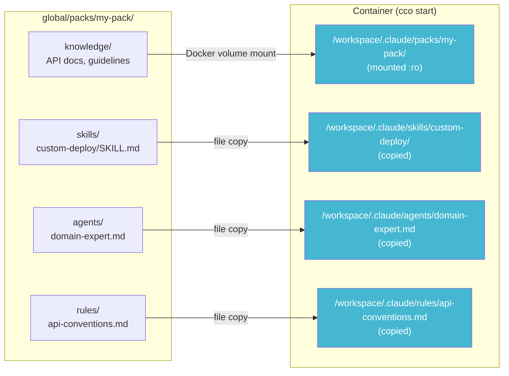

# Scope Design — Four-Tier Context Hierarchy

> Version: 1.0.0
> Status: Current (Sprint 3)
> Related: [architecture.md](../architecture.md) (ADR-3, ADR-8) | [context.md](../../reference/context-hierarchy.md) | [analysis](./analysis.md)

---

## 1. Overview

claude-orchestrator maps its configuration onto Claude Code's native settings resolution, using four tiers from highest to lowest priority. Each tier has a clear owner, a clear purpose, and clear override semantics.



---

## 2. Tier Definitions

### 2.1 Managed (`/etc/claude-code/`)

**Owner**: Framework (baked in Docker image via `COPY defaults/managed/`)
**Overridable**: No — Claude Code's Managed level has the highest priority
**Updated via**: `cco build` (rebuild Docker image)

| File | Content | Why managed |
|------|---------|-------------|
| `managed-settings.json` | Hooks (SessionStart, SubagentStart, PreCompact), env vars (`CLAUDE_CODE_EXPERIMENTAL_AGENT_TEAMS`), statusLine, deny rules | Hooks MUST always execute; env vars are required for agent teams to function |
| `CLAUDE.md` | Docker environment description, workspace layout, agent team behavior | Claude must always know it's in a container and how the workspace is structured |
| `.claude/skills/init-workspace/SKILL.md` | `/init-workspace` skill — initializes project CLAUDE.md from workspace repos | Framework-critical: must always be available and consistent across all sessions |

**What does NOT go here**: Agents, user-customizable skills, rules, user preferences. These are customizable and belong in the User tier. Only framework-critical skills (like `init-workspace`) belong at the Managed level.

**Key property**: Even if a user or project defines conflicting settings at lower tiers, managed settings always win. Hooks are additive — managed hooks run alongside any user/project hooks.

### 2.2 User (`~/.claude/`)

**Owner**: User (copied once from `defaults/global/.claude/` by `cco init`)
**Overridable**: Yes — by project or repo tiers (rules differ per resource type)
**Updated via**: User edits directly; `cco init --force` resets to defaults

| Resource | Files | Purpose |
|----------|-------|---------|
| `settings.json` | Allow rules, attribution, teammateMode, cleanup | User preferences (no infrastructure) |
| `CLAUDE.md` | Development workflow, communication style | Customizable workflow instructions |
| `rules/` | workflow.md, diagrams.md, git-practices.md, language.md | Modular rule files (team conventions) |
| `agents/` | analyst.md, reviewer.md | Default subagents (customizable) |
| `skills/` | analyze, commit, design, review | Default skills (customizable) |
| `mcp.json` | Global MCP servers | Empty by default |

**Key property**: These files are NEVER overwritten after initial copy. `cco start` does not touch them. Users can freely modify, add, or remove files.

### 2.3 Project (`/workspace/.claude/`)

**Owner**: Per-project (scaffolded by `cco project create`, extended by packs)
**Overridable**: Yes — by repo tier for CLAUDE.md and rules
**Updated via**: User edits; `cco start` copies pack resources here

| Resource | Source | Purpose |
|----------|--------|---------|
| `CLAUDE.md` | Template + `/init-workspace` skill | Project context, repos, architecture |
| `settings.json` | Template (empty) | Project-specific overrides |
| `rules/` | Template + packs | Project-specific rules |
| `agents/` | Packs | Project-specific agents |
| `skills/` | Packs | Project-specific skills |
| `packs.md` | Generated by `cco start` | Knowledge file list (injected via hook) |
| `workspace.yml` | Generated by `cco start` | Structured project summary |

### 2.4 Repo (`/workspace/<repo>/.claude/`)

**Owner**: Repository (lives in the repo itself, committed to git)
**Overridable**: No — this is the most specific tier
**Loaded**: On-demand, when Claude reads files in the repo directory

| Resource | Typical content |
|----------|----------------|
| `CLAUDE.md` | Repo-specific build commands, architecture, conventions |
| `rules/` | Repo-specific coding rules |

---

## 3. Override Semantics per Resource Type

Claude Code applies different merge/override strategies depending on the resource type. This is native behavior, not something we implement.

### 3.1 settings.json — Merge with Precedence

All tiers' settings are merged. When the same key exists at multiple tiers, the higher-priority tier wins.

```
Managed:  { hooks: {...}, env: {...}, deny: [...] }
User:     { allow: [...], attribution: {...}, teammateMode: "tmux" }
Project:  { deny: ["Read(.env)"] }
```

Result: all keys coexist. Project `deny` rules merge with managed `deny` rules (both apply). User `allow` is present. Managed `hooks` are always active.

### 3.2 CLAUDE.md — Additive

All CLAUDE.md files from all tiers are loaded into the conversation context. They coexist — nothing is overridden. In case of conflicting instructions, the more specific tier (project > user > managed) prevails in Claude's interpretation.

```
/etc/claude-code/CLAUDE.md          → always loaded (framework)
~/.claude/CLAUDE.md                 → always loaded (workflow)
/workspace/.claude/CLAUDE.md        → always loaded (project)
/workspace/<repo>/.claude/CLAUDE.md → on-demand (repo-specific)
```

### 3.3 rules/*.md — Additive with Project Priority

All rules from all tiers are loaded. In case of conflicting rules, project-level rules take priority over user-level rules.

### 3.4 agents/*.md — Override by Name (Project > User)

Agents are resolved by name. If the same agent name exists at multiple tiers:

```
Managed > Project > User > Plugin
```

**Implication**: A pack that defines `agents/analyst.md` at the project level **overrides** the global `analyst.md` at the user level for that project. This is the desired behavior — packs can specialize agents per project.

### 3.5 skills/*/SKILL.md — Override by Name (User > Project)

Skills are resolved by name. If the same skill name exists at multiple tiers:

```
Managed > User > Project > Plugin
```

**Implication**: A pack that defines `skills/analyze/SKILL.md` at the project level **cannot override** the global `/analyze` skill at the user level. The user's version always wins.

### 3.6 Summary Table

| Resource | Merge strategy | Override direction | Pack can override global? |
|----------|---------------|-------------------|--------------------------|
| `settings.json` | Merge with precedence | Managed > User; Project > User | Yes (project settings merge) |
| `CLAUDE.md` | Additive | All coexist; most specific prevails | N/A (additive) |
| `rules/*.md` | Additive | Project rules > User rules | N/A (additive) |
| `agents/*.md` | Override by name | Project > User | **Yes** |
| `skills/*/` | Override by name | User > Project | **No** |
| `hooks` | Additive | All execute | N/A (all run) |
| `permissions.deny` | Merge | All apply (union) | Yes (additive) |
| `permissions.allow` | Merge | All apply (union) | Yes (additive) |

---

## 4. Knowledge Packs and Scope

### 4.1 Where Pack Resources Go

Packs are defined in `global/packs/<name>/` and activated per project in `project.yml`. At `cco start`, their resources are distributed across different locations:



| Resource type | Destination | Scope level | Mechanism |
|---|---|---|---|
| Knowledge files | `/workspace/.claude/packs/<name>/` | Injected via hook | Docker volume mount (:ro) |
| Skills | `/workspace/.claude/skills/` | **Project** | File copy |
| Agents | `/workspace/.claude/agents/` | **Project** | File copy |
| Rules | `/workspace/.claude/rules/` | **Project** | File copy |

### 4.2 Why Project Level?

Pack resources (skills, agents, rules) go in the **Project** tier because:

1. **Per-project activation** — Different projects use different packs. A React pack should only be active in a React project.
2. **Per-file mounts** — Multiple packs contribute individual file mounts to `.claude/agents/` and `.claude/rules/` without shadowing (ADR-14). Skills use per-directory mounts.
3. **Correct override semantics** — Pack agents at project level can override global agents (Project > User for agents). This is the expected behavior: a project-specific analyst should replace the generic one.

### 4.3 Pack Override Behavior

| Scenario | Behavior | Correct? |
|---|---|---|
| Pack defines `agents/analyst.md` | Overrides global analyst **for this project** | Yes — Project > User |
| Pack defines `skills/analyze/SKILL.md` | Does NOT override global `/analyze` | Correct by design — User > Project for skills |
| Pack defines `rules/api-rules.md` | Added alongside global rules | Yes — rules are additive |
| Two packs both define `agents/reviewer.md` | Last pack in `project.yml` list wins | Warning emitted |

### 4.4 Pack Lifecycle

```
cco start <project>
  │
  ├── 1. For each pack in project.yml:
  │   ├── Mount knowledge dir → /workspace/.claude/packs/<name>/ (:ro)
  │   ├── Mount skills → /workspace/.claude/skills/<name>/ (:ro, per dir)
  │   ├── Mount agents → /workspace/.claude/agents/<file>.md (:ro, per file)
  │   ├── Mount rules → /workspace/.claude/rules/<file>.md (:ro, per file)
  │   └── Detect name conflicts → warn on duplicates
  ├── 2. Generate packs.md (knowledge file list)
  └── 3. session-context.sh injects packs.md into additionalContext
```

---

## 5. File Locations Summary

### 5.1 defaults/ (tracked in git)

```
defaults/
├── managed/                     → /etc/claude-code/ (Managed)
│   ├── managed-settings.json    Hooks, env, deny, statusLine
│   ├── CLAUDE.md                Framework instructions
│   └── .claude/skills/          Managed skills (non-overridable)
│       └── init-workspace/      /init-workspace skill
├── global/                      → ~/.claude/ (User, copied once)
│   └── .claude/
│       ├── CLAUDE.md            Workflow instructions
│       ├── settings.json        User preferences
│       ├── mcp.json             MCP servers (empty)
│       ├── rules/               workflow, diagrams, git-practices, language
│       ├── agents/              analyst, reviewer
│       └── skills/              analyze, commit, design, review
└── _template/                   → projects/<name>/ (scaffolding)
    └── .claude/
        ├── CLAUDE.md            Project template
        ├── settings.json        Empty overrides
        └── rules/language.md    Language override (commented)
```

### 5.2 Container Paths (runtime)

| Container Path | Source | Tier | Mount |
|---|---|---|---|
| `/etc/claude-code/` | `defaults/managed/` (in image) | Managed | Baked in image |
| `~/.claude/settings.json` | `global/.claude/settings.json` | User | `:ro` volume |
| `~/.claude/CLAUDE.md` | `global/.claude/CLAUDE.md` | User | `:ro` volume |
| `~/.claude/rules/` | `global/.claude/rules/` | User | `:ro` volume |
| `~/.claude/agents/` | `global/.claude/agents/` | User | `:ro` volume |
| `~/.claude/skills/` | `global/.claude/skills/` | User | `:ro` volume |
| `/workspace/.claude/` | `projects/<name>/.claude/` | Project | `:rw` volume |
| `/workspace/.claude/packs/` | Knowledge files | Pack data | `:ro` volume |
| `/workspace/<repo>/` | Host repos | Repo | `:rw` volume |

---

## 6. Migration from System Sync

The `_migrate_to_managed()` function in `bin/cco` handles one-time migration from the old `_sync_system_files()` architecture:

1. **Removes `.system-manifest`** — no longer needed (managed files are in the Docker image)
2. **Removes `skills/init/`** — legacy path renamed to `skills/init-workspace/`
3. **Splits `settings.json`** — if the user's settings.json contains `"hooks"` (old unified format), it's backed up as `settings.json.pre-managed` and replaced with the user-only version
4. **Creates `.managed-migration-done`** marker — prevents re-running on subsequent `cco init`

After migration, agents, skills, rules, and settings.json in `global/.claude/` become fully user-owned and are never overwritten by the framework.

---

## 7. Design Decisions

### Why not put agents/skills in Managed?

Agents and skills are workflow extensions, not infrastructure. Users should be able to:
- Modify the analyst agent's model or tools
- Add custom skills for their workflow
- Remove skills they don't use

If they were in Managed (`/etc/claude-code/`), they would be immutable per session and require `cco build` to change.

### Why not keep _sync_system_files()?

The old sync mechanism had a fundamental problem: it overwrote user customizations on every `cco start`. Users who modified `rules/workflow.md` or `agents/analyst.md` lost their changes. The managed/user split resolves this by:
- Protecting infrastructure (hooks, env) in the Managed tier (immutable, but these shouldn't be customized)
- Leaving everything else in the User tier (mutable, user-owned)

### Why are skills User > Project but agents Project > User?

This is Claude Code's native behavior, not our design choice. The practical impact:
- **Agents**: A project pack CAN replace the global analyst with a project-specific one. Good — projects have different analysis needs.
- **Skills**: A project pack CANNOT replace the global `/commit` skill. Acceptable — the user's commit workflow should be consistent across projects. Packs can add new skills with different names.

---

## 8. References

- [ADR-3: Four-Tier Context Hierarchy](../architecture.md) — Architecture decision record
- [ADR-8: Tool vs User Config Separation](../architecture.md) — Managed scope update
- [ADR-14: Zero-Duplication Pack Resource Delivery](../architecture.md) — Pack resources via read-only mounts
- [Analysis: Scope Hierarchy](./analysis.md) — Detailed investigation and comparison of approaches
- [Context & Settings Reference](../../reference/context-hierarchy.md) — Runtime context loading, hooks, MCP
