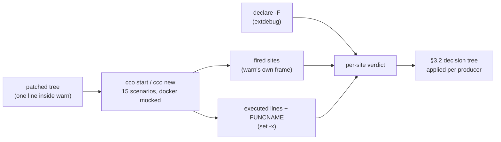
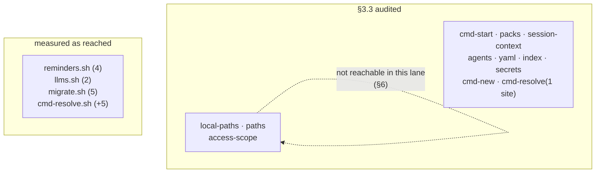

# D19 — the full reclassification of every `warn` producer

> **Status: draft** (analysis artifact, 2026-08-18). Scheduled by
> [ADR-0059 D19](../decisions/0059-message-classification-and-the-start-warning-gate.md#d19--the-full-reclassification-is-scheduled-not-assumed);
> the item's scope, method and definition of done are in the roadmap under A5.
> Historical: it records what was measured on this date, not a living inventory.

## 1. Why this exists

[ADR-0059 D1](../decisions/0059-message-classification-and-the-start-warning-gate.md#d1--every--warn-gates-the-launch)
makes every `warn` gate the launch. The audit that decided which messages *are* `warn`
— [design §3.3](../design/design-warning-gate-and-onboarding-prompts.md#33-the-audit) —
covered **12 of the ~36 files that call `warn`**, because it worked from a list someone
wrote. D1 held anyway (it keys on the level, never on a list), so nothing was lost; but
messages went ungated through the decision tree, and that is what this session repairs.

**The method is the item.** Reading a list is how the gap was created, so the producers
here are enumerated by **running `cco start` and `cco new`** and reading back what the
run touched.

## 2. The enumeration lane

`cco start` is host-only inside a session (ADR-0036 D4), so a session cannot run the
shipped `cco start`. It *can* run the same code the hermetic suite runs: `bin/test`
neutralizes the ambient operator environment, and `tests/mocks.sh` supplies a `docker`
that accepts everything. With those two, a **complete, non-`--dry-run` `cco start`**
executes in-container and launches against the mock instead of a daemon.

Three instruments, each grounded in bash rather than in a parser:

| Instrument | What it answers | How |
|---|---|---|
| **the trace line** | which `warn` **fired**, and from where | one line added inside `warn`, in its own frame: `${BASH_SOURCE[1]}:${BASH_LINENO[0]}` |
| **the xtrace** | which **lines and functions ran** | `set -x` with `PS4='@@@${BASH_SOURCE}:${LINENO}:${FUNCNAME[0]}@@@'` |
| **the function map** | which function **contains** a given line | `shopt -s extdebug; declare -F <fn>` → name, start line, file |



A site is **reached** when the function containing it was entered by a measured run
(`IN-FUNC`), or when a line that *calls* that function was executed (`CALLER-RAN`), or
when the `warn` itself executed (`FIRED`). Reachability is therefore measured on both
sides — bash says where a function starts, and bash says which functions ran.

### 2.1 The oracle was made to discriminate before it was believed

- **`FIRED ⇒ reached`** — every one of the 24 fired sites is independently classified
  reached. A verdict that missed one would be unsound; none is missed.
- **Known-negative control** — `cmd-pack.sh`, `cmd-update.sh` and `cmd-stop.sh` belong
  to verbs no `start` invokes, and the oracle reports **0 reached** in each.
- ⚠ **One false positive was found and killed.** The first `CALLER-RAN` implementation
  reported `update-merge.sh` and `update-sync.sh` as reached from `cco start`. They are
  not: the "call" it matched was the function's name **inside a trailing comment** on a
  top-level assignment, and a top-level assignment executes when the file is sourced.
  Stripping `#…` before matching drops those 9 sites and leaves the one genuine
  `CALLER-RAN` (`_ce_skip_note`). *A mention on an executed line is not a call.*

### 2.2 The scenarios

Fifteen runs: a minimal start; a deliberately hostile `project.yml` (invalid enum,
invalid boolean, no repos, an unresolved mount, an uninstalled llms, an unresolved pack,
a pack whose `pack.yml` has no valid keys, browser enabled); two packs claiming the same
agent/rule/skill over a committed `.claude/`; a malformed `secrets.env`; a shadowed
`init-workspace` skill; an unparsable agent definition under `--claude-access all`;
`--dev-sandbox`; a dirty `~/.cco` and a dirty `<repo>/.cco`; `--dry-run --dump`;
`cco start config-editor`; a bogus `docker.containers.policy`; and **`cco new`**.

## 3. What the measurement produced

| | |
|---|---|
| `warn` call sites in the executable trees (`lib/ bin/ scripts/ migrations/ config/`) | **184**, in **43 files** |
| **reached** by a measured `cco start` / `cco new` | **46**, in **12 files** |
| **fired** at least once in the battery | **24** |
| covered by the §3.3 audit | 12 files |

The two "12 files" are **not the same twelve**.



### 3.1 The gap, per file

| File | Reached | In §3.3? | Note |
|---|---|---|---|
| `lib/reminders.sh` | 4 (`56`, `72`, `87`, `89`) | **no** | predicted by the item — **question 1** |
| `lib/llms.sh` | 2 (`133`, `135`) | **no** | predicted by the item — **question 2** |
| `lib/migrate.sh` | 5 (`160`, `161`, `167`, `174`, `225`) | **no** | ⚠ **not predicted by anyone** — a third file |
| `lib/cmd-resolve.sh` | 6 (`250`, `271`, `294`, `319`, `345`, `383`) | 1 site only (`:845`, the D3 `note`) | five gating sites never classified |
| `lib/cmd-start.sh` | 7 | yes (7) | same conditions; line numbers drifted |
| `lib/packs.sh` | 8 | yes (9 listed) | same conditions after U1/U4 merged three blocks |
| `lib/index.sh` | 8 of 10 | yes (10 listed) | `489`/`504` are in `_index_rehome_*`, **not** entered by any start |
| `lib/agents.sh` · `cmd-new.sh` · `secrets.sh` · `session-context.sh` · `yaml.sh` | 1·1·1·1·2 | yes | confirmed |

**`lib/migrate.sh` is the finding the item could not have predicted.** `_cco_first_run`
runs on **every host `cco` command**, `start` and `new` included; it calls
`_cco_backup_legacy_vault` and `_cco_flatten_global_claude`. Both were entered in **all
15 scenarios** (their early-return guard executed), so their five `warn`s gate a launch
whenever a user still carrying the legacy vault hits a backup failure. Neither the audit
nor the D19 item named this file.

## 4. Classification — §3.2's decision tree, per producer

### 4.1 Confirmed correct, unchanged — gates (35 sites)

`cmd-start.sh` (7) · `packs.sh` (8) · `index.sh` (8) · `cmd-resolve.sh` (5 of 6) ·
`agents.sh` · `cmd-new.sh` · `secrets.sh` · `session-context.sh` · `yaml.sh` (2).

Each answers §3.2's Q2 with *yes*: something about **this session** is not as the user
intended — a reference that will be missing inside the container, a pack that will
overwrite another, a secret line that will not be loaded, an index entry kept over a
divergent one. They gate as written.

One exception inside that set, listed for the record: `cmd-resolve.sh:250`
(*"No .cco/project.yml in …"*) fired in a scan whose unit is simply not a project. It is
a genuine session condition when it fires on the session's own project, so it stays.

### 4.2 The three files never classified

| Producer | §3.2 verdict | Reasoning |
|---|---|---|
| `reminders.sh` `56` · `72` · `87` · `89` | **→ `note()`** (proposed) | see §5.1 — Q2 is *no* |
| `llms.sh` `133` · `135` | **stays `warn`** — gates | Q2 is *yes*: the project declares documentation the session will not have |
| `migrate.sh` `160` · `161` · `167` · `174` | **stays `warn`** — gates | a legacy-vault backup that failed leaves secrets unarchived; the session proceeds over an unresolved migration |
| `migrate.sh` `225` | **stays `warn`** — gates | the same, for a `~/.cco/global/.claude` that could not be flattened |

## 5. The two questions the item names

### 5.1 Are ADR-0008's *non-blocking reminders* meant to gate? — **No, and the contradiction is literal**

[ADR-0008](../../configuration/decentralized-config/decisions/0008-personal-store-management.md)
is titled *"Config Versioning Model: Explicit Commits + **Non-Blocking** Reminders"*. Its
alternatives table **rejects** the blocking form in its own words — *"Forces commits …
blocks legitimate 'proceed uncommitted'; **hostile UX** → Rejected (downgraded to
reminder)"*. `lib/reminders.sh`'s header repeats it: *"advisory, **NEVER-blocking**
reminders"*, *"P14: awareness, never a block"*.

Under D1 all three of them block. The clean-tree gate ADR-0008 deliberately removed has
been reinstated, by a decision that never mentioned it.

§3.2 reaches the same verdict independently. Q1 is *no* (nobody is in a prompt). Q2 —
*is something about **this session** not as the user intended?* — is **no**: uncommitted
changes in `~/.cco` or in a member `.cco`, and a divergent synced set, say nothing about
what this session will be. The session runs exactly as asked. Q3 then routes them to
`note()`.

Measured cost of the current state: `reminders.sh:72` fired in **10 of the 15 scenarios**
— every one that reached the reminder stage, including the minimal start and the
`--dry-run`. It is the one warning a session with nothing wrong with it still shows,
which is the precise shape that trains a user to answer the gate without reading it.

⚖ **This is a decision, not a defect** — it changes what stops a launch, so it belongs in
an ADR-0059 amendment, not in a reclassification commit.

### 5.2 Does `lib/llms.sh` belong at `warn`? — **Yes, unchanged**

*"llms 'X' is not installed (looked in …) → cco llms install"*. Q2 is **yes**: the
project declares framework documentation, the managed `use-official-docs` rule tells the
agent to consult it before writing code against that framework, and inside the container
it will not be there. That is a session that differs from the one the user configured.
`133` (one missing) and `135` (the D16 aggregate for several) both stay.

## 6. What this lane could not reach — stated, not glossed

Three §3.3 entries are **not** contradicted by a 0 here; the lane cannot produce their
conditions:

- **`local-paths.sh` prompt-local sites (D4) and `local-paths.sh:532`** (*"Could not bind
  … in the machine-local index"*) sit behind an interactive `read … < /dev/tty`. The
  battery runs under `CCO_NONINTERACTIVE=1`, so `_resolve_entry_index` was never entered.
  `_resolve_unit` — its caller — **was** entered in every scenario, so the site is
  reachable on a terminal; §3.3's classification of it stands and is not re-opened.
- **`paths.sh:611,616`** (dev-sandbox seed) need `CCO_DEV_SANDBOX_SEED=1` **and** a real
  STATE bucket; redirecting STATE into a tmpdir is what makes the lane hermetic, so the
  two are mutually exclusive here. §3.3's classification stands.
- **`access-scope.sh:1422-1425`** — §3.3 calls them container-operator only, *"never in a
  host start"*. **Measured: 0 reached**, in 15 host-lane runs. Confirmed.

Also unreachable and therefore unclassified, correctly: `migrations/*` scripts (run by
`cco update`, not by `start`), `scripts/cco-*.sh`, and every `cmd-*.sh` belonging to
another verb — 138 sites in 31 files.

## 7. What the method surfaced beyond classification

The hostile scenario renders **11 warnings for what a user reads as three problems**:

```
paths & index (4)      · mount 'nowhere-mount' unresolved …          ┐ one missing mount
                       · llms 'not-installed-llms' not installed …   ├ one missing llms
                       · pack 'ghost-pack' not installed …           ┤ one missing pack
                       · hostile: 3 reference(s) still unresolved    ┘
packs & overlays (2)   · Pack 'ghost-pack' not resolved …            ← the SAME pack again
documentation / llms   · llms 'not-installed-llms' is not installed  ← the SAME llms again
session (3)            · hostile: 1 reference(s) unresolved          ← the SAME residue again
```

Three observations, none of which is a classification question:

1. **D16/D18's goal is not met on the resolve path.** One missing pack produces two
   sentences from two producers in two areas; one missing llms does the same.
   Deduplication is on the message **text** (`lib/colors.sh`), so two different sentences
   for one condition both survive. The live run that produced Amendment A1 had no
   unresolved references, which is why this shape stayed invisible.
2. **The two residue counters contradict each other in the same gate** — *"3 reference(s)
   still unresolved"* (`cmd-resolve.sh:383`, counting repos + mounts + llms + packs) and
   *"1 reference(s) unresolved"* (`cmd-start.sh:3155`, counting only what
   `_project_effective_paths` returns). Both are right in their own terms; the user reads
   two different numbers for one condition.
3. **`cmd-start.sh:3155`'s own comment is now false.** It describes a *"passive ⚠ badge
   … [that] never blocks the launch"*. Under D1 it blocks. Same class as ADR-0008 — a
   document (here, a code comment) whose words D1 contradicts.

## 8. Both directions were checked

A reclassification that only ever demotes is not a reclassification. The nine `note()`
call sites were enumerated too: the reachable ones are `paths.sh:623,647` (§3.3's flagged
judgement call), `cmd-start.sh:393,445,457` (ADR-0049 / ADR-0057 FI-52), `agents.sh:326`
(ADR-0059 A1 §A2) and `cmd-resolve.sh:845` (D3). **None needs promoting to `warn`** —
each is an accepted divergence the user asked for or that cco resolved itself.

## 9. What is owed, and to whom

| # | Item | Whose call |
|---|---|---|
| 1 | `reminders.sh` (4 sites) → `note()`, and forward-annotate ADR-0008 | **human** — ADR-0059 amendment |
| 2 | `llms.sh`, `migrate.sh`, `cmd-resolve.sh` classifications | none — confirmed as written; record in §3.3 |
| 3 | §3.3 table completed with the 12 measured files and current line numbers | documentation |
| 4 | one condition rendering as two sentences (§7.1) | **human** — user-visible, a follow-up unit |
| 5 | the contradictory residue counts (§7.2) | **human** — user-visible |
| 6 | `cmd-start.sh:3155`'s stale comment (§7.3) | none — a factual correction |
| 7 | nothing detects the *next* unclassified producer | **human** — a lint could compare the reached set against a recorded baseline; none exists today |
