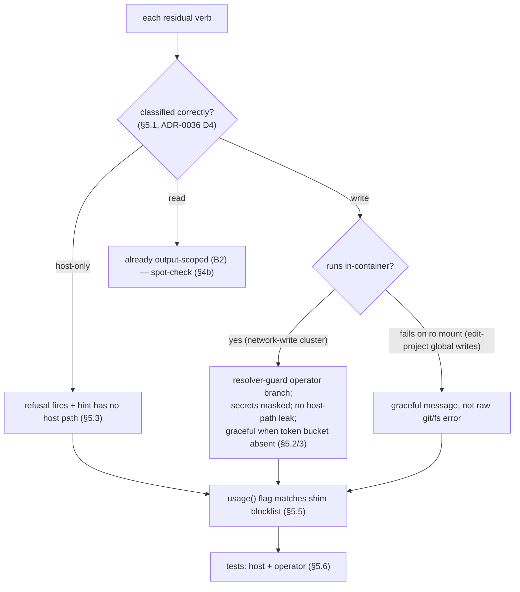

# Handover — Full CLI-surface environment-awareness review

> **Created** 2026-07-02 · **Track**: post-B2 planned work (roadmap → *Broader planned work*,
> priority 1). **Additive/hardening audit** — does not gate any release.
> **Runs on**: `develop`, **after** B2 (`feat/config-access/capability-model`) merges.
> **Nature**: a **read-first audit** of every `cco` verb against the CLI environment-awareness
> principle, producing a findings report + targeted fixes + tests. Not a redesign.

## 0. Why this review exists

ADR-0042 made the wrapped `cco` a **primary channel** (normal sessions default to
`cco_access=read-project`), so the *same* `cco` binary now runs in two contexts — the user's
**host** and an agent inside a **container** (container-operator mode). Environment-awareness
stopped being a property of a few commands and became a property of the **whole surface**
([design-cli-environment-awareness.md](design/design-cli-environment-awareness.md), the normative
principle).

B2 applied the principle **incrementally, to the READ surface only** (it had to: B2's own
`read-project` mount narrowing created the read-output incoherence that ADR-0043 fixed). The
principle's own §6 schedules the rest:

> *"After B2 completes, a dedicated review of the ENTIRE verb surface is planned — auditing every
> `cco` command against §2–§5 (including §4b for any remaining read paths, and the write/host-only
> verbs not yet touched)."*

**This handover is that review.** The residual surface is **the write verbs and the host-only
verbs** — reachable (writes) or refused (host-only) in-container, but **not yet individually
audited** for resolver-guard behaviour, secret masking, host-path hygiene, scope-aware help, and
(where they emit resources/paths) output scoping.

## 1. Read first (authoritative — do not re-litigate)

1. **[design-cli-environment-awareness.md](design/design-cli-environment-awareness.md)** — the
   principle (§2), detection signals (§3), the two enforcement layers **verb gating §4** +
   **output scoping §4b**, and the **§5 per-verb checklist** (this review's method).
2. **[ADR-0042](../configuration/agent-cco-access/decisions/0042-agent-cco-interaction-model.md)** —
   three-level model; the wrapped-`cco` as a primary channel; the `cco_access` enum.
3. **[ADR-0043](decisions/0043-unified-cli-environment-access-scope.md)** — the output-scoping
   layer (`lib/access-scope.sh`), the `project|global` taxonomy, INV-A…E.
4. **[ADR-0036](../configuration/decentralized-config/decisions/0036-session-config-capability-model.md)** —
   §D4 the whitelist/blocklist mechanism; the **network carve-out** (`install|update|import` are
   write verbs at an edit level, *not* host-only; only credential/remote-git ops are host-only).
5. Code anchors: `bin/cco` (`_cco_operator_shim` + dispatch + `usage()`),
   `lib/paths.sh` (`_cco_caller_context`, `_cco_container_operator`, `_cco_resolver_guard`),
   `lib/access-scope.sh` (the output-scoping layer).

## 2. What B2 already verified — the KNOWN-GOOD baseline (don't redo)

The 2026-07-02 correctness review (see
[`agent-cco-access/impl-handoff.md` → Correctness review](../configuration/agent-cco-access/impl-handoff.md))
cross-verified and confirmed **correct**. Treat these as settled; this review *extends* coverage,
it does not re-open them:

- **Shim default-deny is complete.** Every dispatched top-level verb is classified in
  `_cco_operator_shim`; the `*)` arm refuses the unknown. (Confirmed by cross-mapping the dispatch
  `case` against the shim `case`.)
- **The READ surface is output-scoped** via `lib/access-scope.sh`: `cco list`, the five
  `cco list <kind>`, the four `<kind> show`, `cco … validate`, `cco path list`, `cco project
  coords`. INV-A (host-open), INV-B/C (count-only stderr notice), INV-D (index complete),
  INV-E (single source) hold. The one INV-B leak found (`_llms_find_users`) is **fixed** (`d8e6848`).
- **Mount-layer boundaries are correct**: the edit-level matrix (edit-project → project rw / global
  ro; edit-global → project ro / global rw; edit-all → both) is orthogonal and enforced at the
  mount; secret masking (`secrets.env`/`*.env`/`*.key`/`*.pem`, not `*.example`) is applied in
  **every** `.cco` + `~/.cco` column; tokens/transcripts/memory are excluded from the STATE mount.
- **The shim's flat write axis is BY-DESIGN**: any edit level passes the write gate; the *mount*
  is the real boundary (documented intent in `tests/test_operator_shim.sh:93`). Do not "fix" this
  into per-level shim gating without a design decision — it is intentional (P17: cco assists, the
  mount gatekeeps).

## 3. The residual surface to audit (grounded verb map)

Full top-level verbs dispatched by `bin/cco`: `init join forget build start new resolve path sync
tag list config project pack llms template chrome remote update docs clean stop help`.

Legend — **HO** host-only (shim dies with a hint) · **R** read (scope-gated + output-scoped) ·
**W** write (edit level) · ✅ audited by B2 · ▶ **audit target of THIS review**.

| Verb / sub-verb | Shim class | B2? | This review must verify |
|---|---|---|---|
| `list`, `list <kind>`, `docs`, `help`, `--version` | R (open) | ✅ | (baseline — spot-check only) |
| `<kind> show`, `… validate`, `path list`, `project coords` | R | ✅ | (baseline — spot-check only) |
| `start` `stop` `build` `new` | HO | — | ▶ refusal fires; no host-path in the hint; `new` (temp session) truly unreachable |
| `resolve` `sync` `init` `join` `forget` `update` `clean` | HO | — | ▶ refusal + hint hygiene; **`clean`/`update`** emit paths on the host — confirm they never run in-container |
| `chrome start\|stop\|status` | HO | — | ▶ refused (network/host tooling); hint hygiene |
| `path set` | HO | — | ▶ refused (resolves host paths); `path list` stays R |
| `project rename` | HO | — | ▶ refused (re-keys machine-local state) |
| `project export\|import\|add` | HO | — | ▶ refused; **`add`** writes `project.yml` — confirm it is HO by design (resolves coordinates) or reconsider |
| `pack\|template\|llms install\|update\|import` | W (net carve-out) | — | ▶ **highest value**: they RUN in-container at edit levels — resolver-guard passes (operator mode), they fetch network + write the mounted store; verify **no host path leaks** into output, secrets masked, scope respected, graceful failure when the token bucket is absent |
| `pack\|template create\|remove` · `llms rename\|remove` | W | — | ▶ run in-container at edit; host-path hygiene in output; operate only on mounted trees |
| `pack\|template internalize` | W | — | ▶ run in-container at edit; path hygiene |
| `pack\|template\|project publish` · `pack\|template\|project export` | HO | — | ▶ refused (network/credentials or host-path bundle) |
| `config save` | W | — | ▶ runs at edit-global+ (global store rw); at edit-project it passes the shim but the `~/.cco` mount is ro → **verify the failure is graceful**, not a raw git error (candidate UX fix) |
| `config push\|pull` | HO | — | ▶ refused (network + credentials) |
| `config validate` | R | — | ▶ orphan-sweep across buckets — does it print host paths? respect `show_host_paths` / scope? |
| `tag add\|remove` | W | — | ▶ runs at edit (DATA registry rw only at edit-global+); graceful at edit-project |
| `remote add\|remove` | W | — | ▶ writes DATA remotes registry; `--token` path → the token bucket is unmounted, verify graceful |
| `remote set-token\|remove-token` | HO | — | ▶ refused (secrets) |
| `remote list` | R (global) | ✅ | (baseline) |
| `stop` (already above) / `resolve` etc. | HO | — | (above) |

> **The single highest-value target is the network-write cluster** (`install|update|import` on
> pack/template/llms): these are the only host-*touching* verbs that legitimately RUN in-container.
> Everything else either runs on scoped mounts (writes) or is refused (host-only).

## 4. Method — apply the §5 checklist to each residual verb

For every verb in the ▶ rows, answer and wire the design's §5 checklist:

1. **Classification correct?** host-only vs read(scope) vs write(scope) — matches ADR-0036 D4 +
   the network carve-out. An unclassified verb is refused (default-deny) — confirm none slipped.
2. **Resolver guard.** If it resolves host paths → host-only (rely on `_cco_resolver_guard`) OR, if
   it legitimately runs in operator mode (the network-write cluster), confirm the operator branch
   of the guard is what lets it through and that it resolves to the *container* `$HOME`, never the
   host.
3. **Secret masking / host-path hygiene.** Does it print a path? → mask secrets, respect
   `show_host_paths`, never emit a host path outside the gated `path_map` (INV-4). **Grep each ▶
   verb's output statements for absolute paths.**
4. **Output scoping (§4b).** If it *lists or shows* resources → route through `lib/access-scope.sh`
   (`_env_in_scope`/`_env_note_hidden`/`_env_flush_hidden_notice`; `show` → `_env_require_visible`).
   Most residual verbs are writes/host-only and do not list — but confirm none emit an unscoped
   resource set (e.g. `config validate`'s orphan report).
5. **Scope-aware help.** `usage()` in operator mode flags host-only verbs and marks write verbs at a
   read level. Confirm the flagged set in `usage()` (`bin/cco:171` `_hostonly=…`) matches the shim
   blocklist exactly — **drift here is a real finding** (a verb host-only in the shim but not
   flagged in help, or vice-versa).
6. **Tests, both contexts.** Extend `tests/test_operator_shim.sh` (classification/scope) + the
   verb's own suite; assert host **and** container-operator behaviour.

## 5. Concrete focus areas (where findings are likely)

- **A. Host-path leaks in write-verb output.** The network-write cluster runs in-container; any
  `echo "$abs_path"` / success message printing a resolved path could leak a container path (benign)
  or, worse, a host path if a bucket resolver returns one. Grep `lib/cmd-{pack,template,llms}.sh`
  for path-printing on the install/update/import/create paths.
- **B. `usage()` ↔ shim drift (§5.5).** `bin/cco:171` hard-codes `_hostonly='init|join|forget|build|
  start|new|stop|resolve|sync|update|clean|chrome'` for the help annotation, but the shim also treats
  `path set`, `project rename`, `project export|import|add`, `*publish`, `*export`, `config push|pull`,
  `remote set-token|remove-token` as host-only. The help flags only *top-level* verbs, so host-only
  *sub-verbs* are not marked. Decide: acceptable (top-level granularity) or extend the annotation.
- **C. `config save` at edit-project.** Passes the shim (write) but `~/.cco` is ro at edit-project →
  it will fail at the git/fs layer. Confirm whether that failure is graceful. (This is the one place
  the "flat write axis is by-design" trade-off produces a raw error; a clean "needs edit-global"
  message would be a good UX fix — but it is a *messaging* change, not a re-gating.)
- **D. `remote add --token` / token-authed `install`.** The token bucket is never mounted in-container.
  Verify these degrade with a clear message, not a confusing partial write or crash.
- **E. Verbs that resolve host paths but are NOT container-spawning** (`clean`, `update`, `sync`,
  `resolve`): confirm they are host-only in the shim (they are) AND that their resolver-guard fires
  before any host-path work if the classification were ever bypassed (defence in depth).

## 6. Deliverables & definition of done

- A **findings report** at `docs/maintainers/cli/reviews/<date>-cli-surface-awareness-review.md`
  (create the `reviews/` dir) — the per-verb audit matrix (§3 expanded), each finding classified
  BLOCKER/MAJOR/MINOR/NIT with file:line + a failure scenario, following the same rigor as the B2
  review.
- **Targeted fixes** for confirmed findings (atomic commits), each with a test asserting **both**
  host and container-operator behaviour.
- **`usage()`↔shim drift** resolved (item B) — either extend the annotation or record the
  top-level-only decision in-code.
- **Tests green** (`./bin/test`); new coverage for any residual verb that gained an assertion.
- The CLI-environment-awareness doc **§6** updated: mark the full-surface review **done**, so the
  principle reads as fully applied (living doc → truth).
- If a systemic pattern emerges (e.g. a shared host-path-masking helper for write-verb output),
  record it as a small ADR or a note in the design doc (INV-E: one place to change).

## 7. Scope guardrails (do NOT)

- Do **not** re-gate the shim's flat write axis (by-design; §2 baseline).
- Do **not** re-open the mount matrix / secret masking / read-surface scoping (B2-verified).
- Do **not** turn this into a CLI redesign — it is an awareness/hygiene audit against a fixed
  principle. New verbs/UX belong in their own workstream.
- Keep the network carve-out (ADR-0036 D4) intact: `install|update|import` stay write, not host-only.

## 8. Reading order

design-cli-environment-awareness.md (§2–§6) → ADR-0043 → ADR-0042 → ADR-0036 §D4 →
`bin/cco` (`_cco_operator_shim` + `usage()`) → `lib/access-scope.sh` → this handover → the ▶ rows
of §3, verb by verb.
