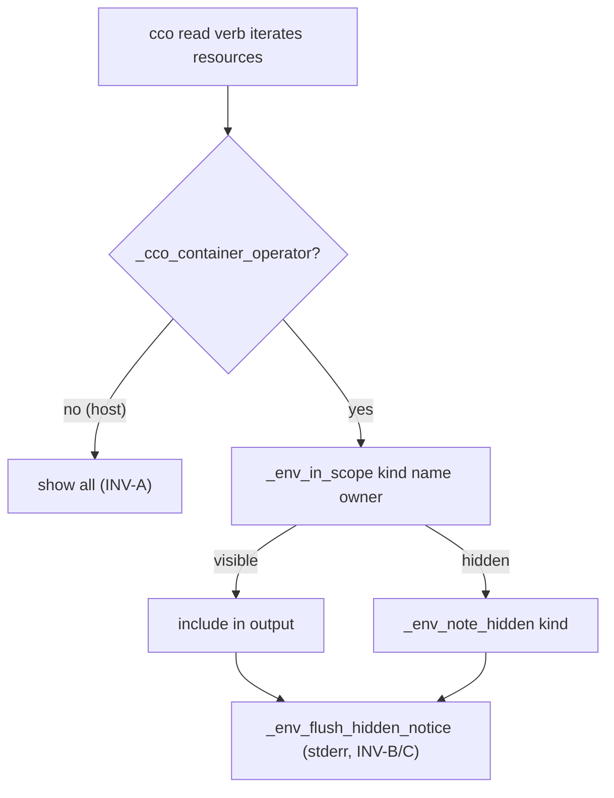

# ADR 0043 — Unified CLI environment & access-scope resolution

**Status**: Accepted (2026-07-02) — direction ratified by the maintainer (full scope-aware
read verbs via a single shared layer); implementation in a following session, folded into
workstream B2 (agent ↔ cco access). **Extends** [ADR-0042](../../configuration/agent-cco-access/decisions/0042-agent-cco-interaction-model.md)
(three-level model; does not modify it) and formalises the **output-scoping** layer of the
[CLI environment-awareness principle](../design/design-cli-environment-awareness.md).

**Deciders**: maintainer (chose full scope-awareness over a discovery-footer half-measure;
asked for one common env+permissions system so commands implement only their differentiation
logic, and future permissions/environments change a single point), implementer (analysis,
code-grounding, module API).

> **Refined (2026-07-05) by the agent↔cco access e2e fix** — see
> `../../configuration/agent-cco-access/e2e-review/fix-design/01-scope-model.md`.
> The read side is now **symmetric** with the write side on `{project, global, all}`:
> each level reads at its matching scope (`edit-project` reads at *project* scope,
> not "everything"; `edit-global` at global; `edit-all` at all), and **`read-global`
> ≠ `read-all`** — they differ only in *other-project* visibility. The §1 taxonomy
> table below is updated to that model; the original two-column form (read-global and
> read-all merged, `edit-*` omitted) under-specified what the write side already did.

## Context

ADR-0042 made the wrapped `cco` a primary channel and defaulted normal sessions to
`cco_access=read-project`; its step-4 implementation (`9e4535f`) then **narrowed the
`read-project` mount** so the operator CONFIG bucket exposes only the current project's
referenced personal-store packs (templates and other projects' packs stay physically hidden).

That narrowing exposed a **three-layer misalignment** at `read-project`:

| Layer | Behaviour at `read-project` (post-narrowing) |
|---|---|
| **Physical mount** | only referenced packs mounted; `~/.cco/templates` + other packs absent |
| **CLI read verbs** | `cco list pack` scans the narrowed mount → already scoped, BUT `cco list template` scans the unmounted dir → **empty (false-negative)**, and `cco list project` reads the STATE index → **all projects (unscoped)** |
| **STATE index** | logical name → host path for *everything*; references paths not mounted in-container |

Consequences without a fix: an agent sees `cco list template` return nothing and may conclude
"no templates exist" (they exist on the host); `cco list project` leaks the full project set
regardless of scope; `cco <kind> show <unmounted>` fails with a raw filesystem error. The
CLI-environment-awareness doc already governs **verb gating** (host-only vs read-scope vs
write-scope) but says nothing about **what a permitted read verb should show** under a scope.

The signals needed to resolve this already exist in-container: `PROJECT_NAME` (the current
project) and `CCO_CCO_ACCESS` (the resolved scope) are both exported by `cco start`, and
`_cco_container_operator` / `_cco_caller_context` (`lib/paths.sh`) distinguish host from
container-operator execution.

## Decision

Introduce a **single shared access-scope layer** that every `cco` read verb consults, so the
three layers align: the CLI **output** is scoped to match the mount, and anything hidden is
**announced** (hidden ≠ absent). Commands implement only their own differentiation; the layer
owns environment + permission resolution, so a future permission or environment is added in
**one place**.

### 1. Scope taxonomy — reuse the shim's classification

> **Generalised (2026-07-08) by [ADR-0046](../../configuration/agent-cco-access/decisions/0046-unified-cco-access-model.md)**
> — the `{project, global, all}` read-scope ordinal below is subsumed by the three-axis
> `(G, Pc, Po)` model (each `none|ro|rw`). The mapping is exact: `read-project` vs
> `read-global` is the **G** axis (referenced subset vs whole store); `read-global` vs
> `read-all` is the **Po** axis (other-project visibility); the `project`-class vs
> `global`-class split here is preserved as the per-kind read-visibility rules
> (ADR-0046 §7). This §1 table stays valid as the *derived* view of the ladder presets; the
> axes are the base model.

Resources fall into the same two scope classes the operator shim already uses for verb
gating, now applied to **read output**:

Visibility is driven by the level's derived **read_scope** (`project | global | all`),
symmetric with write_scope. `read-project`/`edit-project` → project; `read-global`/
`edit-global` → global; `read-all`/`edit-all` → all (the bare `read` alias → all).

| Kind | Scope class | `read_scope = project` | `read_scope = global` | `read_scope = all` |
|---|---|---|---|---|
| project (other) | **project** | current only (`PROJECT_NAME`) | current only | **all** |
| pack | **project** | referenced by the current project | all | all |
| llms | **project** | referenced by the current project | all | all |
| template | **global** | none (needs `read-global+`) | all | all |
| remote | **global** | none (needs `read-global+`) | all | all |

The **only** `global`-vs-`all` difference is the `project` kind (other projects need
`read-all`); packs/llms/templates/remotes are global-store resources, fully visible at
`global`. `global`-class kinds mirror the shim gates already in place (`template …`,
`remote list` need `read-global+`). This is one taxonomy for both *verb gating* and *output
scoping* — no parallel model. The level→scope maps (`_cco_level_read_scope` /
`_cco_level_write_scope` / `_cco_write_scope_satisfies`) are the single source consumed by
host mount-generation, the operator shim, and this output layer.

> **Completed in part (2026-07-20) by the e2e v2 fix workstream (RC-4).** The taxonomy above
> covers the five *resource kinds*; it said nothing about the **path index**, whose rows are
> `(owner-project, name, host-path)` bindings rather than kind instances. `cco path list`
> consequently carried its own inline rule and exempted **owner-less** (`unscoped:`, ADR-0051 D2)
> rows from scoping entirely — a false negative that disclosed other projects' names and host
> paths at `Po=none` (findings E1-09, E2-02, E3-07, E4-03, E5-03). The taxonomy now includes a
> **`path` kind, `project` class**, whose visibility follows the row's **effective** owner through
> the single layer predicate `_env_owner_in_scope`: a **current** owner rides `Pc`, **any other**
> owner rides `Po`, and an **absent/unattributable** owner is conservatively *classified as* other
> — it rides `Po` too, never `Pc`. Effective ownership is resolved as the mount generator resolves
> it: an unscoped row that a current project's own manifest declares and does not shadow is that
> project's live binding (`_index_get_path`'s unscoped fallback) and stays `Pc`-visible, so the fix
> hides no resource the session is already mounting. Fail-closed below `read-all`, unchanged at
> `read-all`/`edit-all` and on the host (INV-A), and counted in the count-only notice (INV-B). The
> axis (`Po`, not `G`) was maintainer-ratified 2026-07-20; it keeps the "SOLE difference" invariant
> above true by construction (an unattributable row is other-project data, so it needs `read-all`,
> never `read-global`).
>
> **Known deviation from §4.** §4 requires a wired read verb to call `_env_in_scope`,
> `_env_note_hidden` on skip, and `_env_flush_hidden_notice` at the end. RC-4 satisfies the
> **first** clause only: `cco path list` keeps its own hidden counter and dedicated notice, because
> the shared notice hardcodes a `read-global`-first widening hint that is wrong for path rows
> (`read-global` never reveals one under this rule). Folding `path` into the shared counters
> requires parameterising the widening hint per kind across all five wired listers; that refactor
> is deferred (cycle 2), and until it lands the §4 notice clauses remain deliberately unmet for
> this verb.

### 2. Invariants

- **INV-A (host-open).** Scoping engages **only** under `_cco_container_operator`. On the
  host every resource is always visible — no behaviour change to the human-facing CLI.
- **INV-B (hidden ≠ absent).** Whenever output is filtered by scope, the command emits one
  standardized notice with the hidden **count per kind** and how to widen (a `read-global`
  session, or run on the host). Counts only — hidden names are not leaked.
- **INV-C (notice on stderr).** The notice is written to **stderr**, never stdout, so
  machine-readable `cco list` output stays uncorrupted.
- **INV-D (index stays complete).** The STATE index remains the full logical→path map for
  internal resolution; scoping is a **presentation filter** on command output, not a mutation
  of the index.
  > **Revised by [ADR-0047](../../configuration/agent-cco-access/decisions/0047-config-access-enforcement.md)
  > (2026-07-08, D2).** A presentation-only filter is **not sufficient for confidentiality**:
  > the raw internal store (index, DATA) mounts whole and same-UID, so an agent `cat`s it
  > regardless of output scoping (bypass S1/S1b). The internal store is now confined by a
  > **privilege boundary** (parent-directory gating on the real container FS + a setuid
  > `cco-svc` helper enforcing `(G,Pc,Po)`); this output-scoping layer is retained as a
  > **defense-in-depth** presentation layer, no longer the confidentiality control. The index
  > still stays complete internally — the invariant's *first* clause holds; its *"scoping is
  > the filter"* clause is superseded.
- **INV-E (single source).** Context + permission resolution lives in one module; a command
  never re-derives context ad hoc (extends the existing "canonical signals" rule).

### 3. The shared layer (`lib/access-scope.sh`, depends on `lib/paths.sh`)

Public API (names indicative; finalised at implementation):

- `_env_context` → `host | operator`
- `_env_access` → resolved read/edit scope (`CCO_CCO_ACCESS`; host = unrestricted)
- `_env_current_project` → `PROJECT_NAME` (empty on host)
- `_env_scope_class <kind>` → `project | global` (the taxonomy above — single source)
- `_env_in_scope <kind> <name> [owner_project]` → 0/1. Host → always 0. Operator → compares
  the kind's scope class against the current read level; for `project`-class kinds at
  `read-project`, visible only when the resource belongs to the current project.
- `_env_note_hidden <kind>` → increment an in-process hidden counter per kind
- `_env_flush_hidden_notice` → emit the single standardized notice to stderr (idempotent;
  no-op when nothing hidden)
- `_env_require_visible <kind> <name> [owner]` → for `show`/detail verbs: if out of scope,
  exit with a clear "not available at this access scope — start a `read-global` session or
  run on the host" message (the point-3 robustness requirement becomes a layer property)

### 4. Per-command contract

Read verbs reachable in operator mode — `cco list`, the five `cco list <kind>`, the five
`cco <kind> show`, `cco … validate`, `cco path list`, `cco project coords` — MUST: call
`_env_in_scope` while iterating, `_env_note_hidden` on skip, `_env_flush_hidden_notice` at
the end; detail/`show` verbs call `_env_require_visible` first. A command that resolves or
prints host paths keeps its existing resolver-guard / `show_host_paths` obligations — this
layer is orthogonal and additive.

### 5. Awareness (Level A + managed rule)

Level-A injection and the managed config-interaction rule (ADR-0042 §C, workstream B2 step 5)
state explicitly: at `read-project` the `~/.cco` view is **project-scoped** — a subset, not
the whole store; use `read-global`/`read-all` (or the host) for the complete picture. This
closes the false-negative reasoning risk at its source, complementing INV-B.

## Alternatives considered

- **B — discovery + graceful degradation (no output scoping).** `cco list` keeps showing all
  index names with a "project-scoped" footer; only `show` degrades. Rejected as the model:
  leaves `list` and `show` incoherent (names you can't open), keeps `list template` falsely
  empty, and papers the gap with a footer rather than aligning the layers. Its good parts —
  the awareness note and graceful `show` — are absorbed (INV-B, `_env_require_visible`).
- **C — defer all verb scoping to the post-B2 CLI-surface audit.** Rejected for *read*
  verbs: B2's own narrowing creates the incoherence now; fixing it cold later is more
  expensive and leaves the feature internally inconsistent in the interim. The residual audit
  (write/host-only verbs not yet touched) still happens post-B2.
- **Per-command ad-hoc `if _cco_container_operator` blocks.** Rejected: duplicates context
  logic across verbs, drifts, and violates the maintainer's explicit "one point of change"
  requirement (INV-E).

## Consequences

- **Positive**: mount, CLI output, and messaging agree at every scope; no false-negatives
  (INV-B); new permissions/environments extend one module (INV-E); reuses the shim taxonomy
  (one mental model); completes the CLI-environment-awareness principle (adds the output-
  scoping layer beside verb gating); the robustness requirement becomes a layer property.
- **Negative / trade-offs**: upfront cost — a new module plus wiring the whole read surface
  (mitigated: the layer is small; each command adds a few calls). Scoping must never regress
  host UX (mitigated by INV-A). `claude_access` / `show_host_paths` are not yet exported to
  the container; only `cco_access` + `PROJECT_NAME` are needed now, and the module is kept
  extensible for those signals when a verb requires them.
- **Rollout**: folded into workstream B2 as step 4.5 (module + read-verb wiring + notice/
  robustness), ahead of step 5 (awareness) and step 7 (docs). The post-B2 full CLI-surface
  audit inherits this method for the remaining verbs.
- **Relation**: extends ADR-0042 (does not modify it) and upgrades the CLI environment-
  awareness doc to v1.1 (adds the output-scoping layer). ADR-0042 stays Accepted/frozen.
