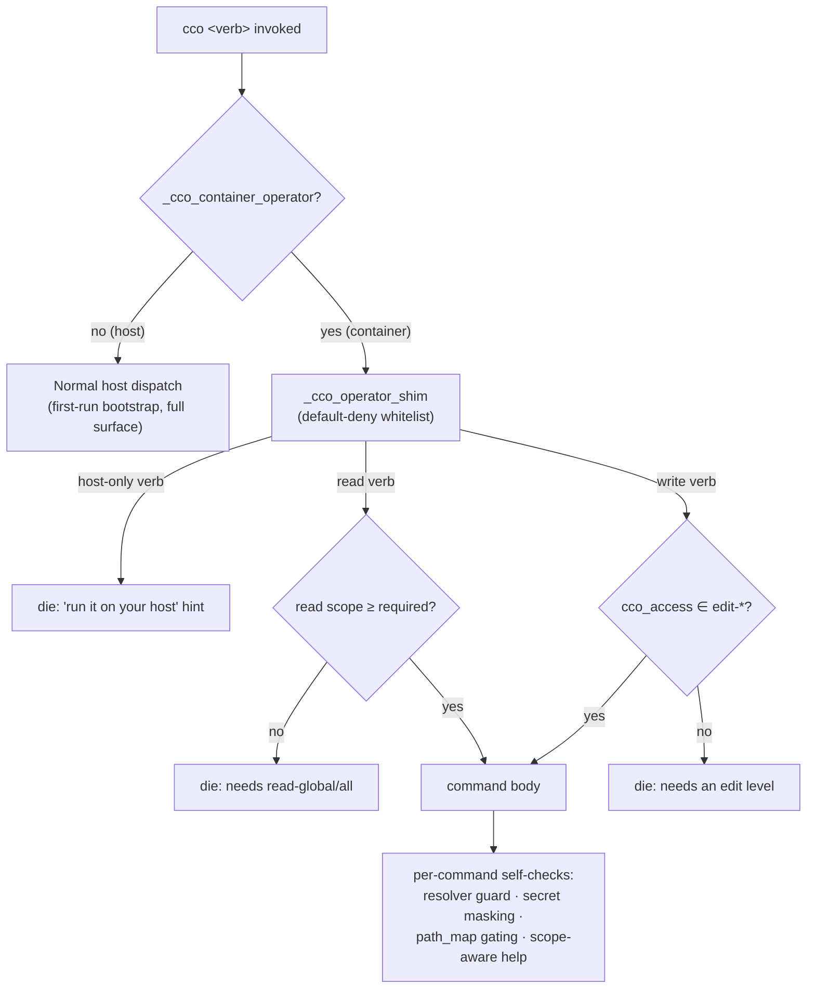

# CLI Environment-Awareness

> Version: 1.1.0
> Status: Current — principle established with ADR-0042 (agent ↔ cco access); **output-scoping
> layer added with [ADR-0043](../decisions/0043-unified-cli-environment-access-scope.md)**
> Related: [ADR-0036](../../configuration/decentralized-config/decisions/0036-session-config-capability-model.md) (capability model — D4 wrapped-cco, D8 caller-context) · [ADR-0042](../../configuration/agent-cco-access/decisions/0042-agent-cco-interaction-model.md) (three-level interaction model) · [ADR-0043](../decisions/0043-unified-cli-environment-access-scope.md) (unified env & access-scope resolution) · [agent ↔ cco access design](../../configuration/agent-cco-access/design.md) · user CLI reference [`cli.md`](../../../users/reference/cli.md)

---

## 1. Why this document exists

The `cco` CLI used to run in exactly one place: the user's **host**. Two decisions changed
that:

- **ADR-0036 D4** introduced a **wrapped `cco`** that runs *inside a session container*
  (container-operator mode), behind a default-deny whitelist shim, driven by the agent.
- **ADR-0042** made that wrapped `cco` a **primary channel** (Level B of the three-level
  model) and set the normal-session default to `cco_access=read-project` — so a wrapped
  `cco` is present in **almost every session**, not an edge case.

**Consequence — the entire CLI surface is now dual-context.** The *same* `cco` binary is
invoked both by a human on the host and by an agent inside a container. A verb that was
historically "host-only / user-facing" is now reachable by an agent. Environment-awareness
can no longer be an afterthought bolted onto a few commands — it is a **property of the
whole surface**.

## 2. The principle (normative)

> **Every `cco` command MUST determine the environment it runs in and behave correctly for
> that environment.** Host execution and container-operator execution are both first-class;
> neither may be assumed. When in doubt, a command defaults to the *safe* behavior for the
> container context (refuse + redirect to the host).

This is default-deny: a command reaches its real work in a container session **only** when it
has been explicitly classified as safe for that context (read within scope, or a path-free
write at an edit level). Everything else is refused with a "run it on your host" hint.

## 3. Detection signals (grounded)

All three live in `lib/paths.sh` / `bin/cco` and are the canonical way to reason about
context — do not re-derive it ad hoc:

| Signal | Location | Meaning |
|---|---|---|
| `_cco_caller_context` | `lib/paths.sh` | `host` \| `container-agent` — the D8 caller-context signal (`/.dockerenv` / `CCO_IN_CONTAINER`). |
| `_cco_container_operator` | `lib/paths.sh` | True **only** under the deliberate wrapped-cco mode: `CCO_CONTAINER_OPERATOR=1` **and** all three bucket overrides (`CCO_DATA_HOME`/`CCO_STATE_HOME`/`CCO_CACHE_HOME`) are absolute mount paths. Never inferrable from a plain agent env. |
| `CCO_CCO_ACCESS` | env (set by `cco start`) | The resolved access scope in-container (`read-project` … `edit-all`) — drives read-scope + write gating (ADR-0042). |
| `PROJECT_NAME` | env (set by `cco start`) | The current session's project — the "current project" signal that makes `project`-scoped output filtering possible in-container (ADR-0043). Empty on the host. |

## 4. Enforcement layers

Environment-correct behavior is layered — a command must respect **all** layers that apply
to it, not rely on one alone:

1. **Central shim — `_cco_operator_shim` (`bin/cco`).** The first gate in container-operator
   mode. Default-deny: host-only verbs die with a hint; read verbs are gated by read scope
   (`template`/`remote list` need `read-global`, etc.); write verbs need an edit level. This
   is where a verb's *context classification* lives.
2. **Resolver guard — `_cco_resolver_guard` (`lib/paths.sh`).** Refuses host-path resolution
   inside a container (anti-in-container guard, ADR-0007), except the sanctioned operator
   mode with mounted buckets. Any command that resolves host paths is thereby host-only.
3. **Per-command self-checks.** Where a command does context-sensitive work it must self-check:
   - **Secret masking** — real secret files never reach the container (masked at mount).
   - **Host-path hygiene** — never print host paths beyond the gated `path_map`
     (`show_host_paths`); resolution stays host-side (ADR-0007 / INV-4).
   - **Scope-aware help** — `usage()` / `--help` reflect the wrapped scope in operator mode:
     host-only verbs flagged `(host only — run on your host)`, verbs above the current level
     marked unavailable (ADR-0042 §4.3).

## 4b. Output scoping — what a *permitted* read verb shows (ADR-0043)

Verb gating (§4) decides **whether** a verb runs in-container. It does **not** decide **what a
permitted read verb shows**. A verb that is allowed at `read-project` must still scope its
**output** to the current project — otherwise it leaks the full resource set, or (worse) shows
an empty result for an unmounted resource that the agent then mistakes for "does not exist".

This is a second, orthogonal dimension enforced by a single shared layer
(`lib/access-scope.sh`) so every command implements only its own differentiation logic:

- **Scope taxonomy (reuses §4's shim classes).** Two scope classes — the same ones the shim
  uses for verb gating — now applied to read **output**:

  | Kind | Scope class | Visible at `read-project` | Visible at `read-global` / `read-all` |
  |---|---|---|---|
  | project · pack · llms | **project** | current project (`PROJECT_NAME`) + its referenced resources | all |
  | template · remote | **global** | none (needs `read-global+`) | all |

  `global`-class kinds mirror the shim's existing gates (`template …`, `remote list` need
  `read-global+`). One taxonomy for both verb gating and output scoping — no parallel model.
  Rationale + the full module API in
  [ADR-0043](../decisions/0043-unified-cli-environment-access-scope.md).
- **Invariants.** Host-open (scoping engages only under `_cco_container_operator`); hidden ≠
  absent (a filtered command emits one standardized *count-only* notice on **stderr** telling
  the agent how to widen — a `read-global` session or the host); the STATE index stays the
  complete internal map (scoping is a presentation filter, not an index mutation).
- **Layer API.** `_env_in_scope <kind> <name> [owner]` (0/1), `_env_note_hidden <kind>`,
  `_env_flush_hidden_notice` (stderr), `_env_require_visible <kind> <name>` (graceful "not
  available at this scope" for `show`/detail verbs). Commands call these; they never re-derive
  context.
- **Awareness pairing.** Level A + the managed rule state that `read-project` gives a
  *project-scoped* view of `~/.cco` — a subset, not the whole store — so a hidden resource is
  never read as a missing one.

## 5. Checklist — adding or changing a `cco` verb

Any new or changed verb MUST answer, and wire, the following:

1. **Classify the verb for the container context**: host-only (spawns containers, resolves
   host paths, touches **credentials** or the personal-store git remote) · read (which scope:
   project / global / all) · write (which scope).
   > **Network carve-out (ADR-0036 D4).** "Touches the network" is *not* on its own a
   > host-only trigger. Sharing-repo fetches — `pack|template|llms install|update|import` —
   > are **write** verbs, allowed at an edit level (they clone public sharing repos into the
   > mounted store); only credential/remote-git ops stay host-only (`config push|pull`,
   > `remote set-token|remove-token`). Token-authed fetches simply degrade in-container (the
   > token bucket is never mounted), they are not refused by the shim.
2. **Wire it into `_cco_operator_shim`** with that classification (default-deny — an
   unclassified verb is refused in-container).
3. If it **resolves host paths** → it is host-only; rely on the resolver guard and add the
   host-only branch + hint.
4. If it **emits paths or reads config** → mask secrets, respect `show_host_paths` and the
   resolved read scope.
5. If it **lists or shows resources** → scope its **output** via the shared layer (§4b):
   `_env_in_scope` while iterating, `_env_note_hidden` on skip, `_env_flush_hidden_notice` at
   the end; `show`/detail verbs call `_env_require_visible` first. Never re-derive context.
6. If it **prints help** → keep it scope-aware in operator mode.
7. **Tests**: extend `tests/test_operator_shim.sh` (classification/scope) and the verb's own
   suite; add scoped-output assertions (§4b). Assert both host and container-operator behavior.

## 6. Forthcoming — full CLI-surface review

The principle above is applied incrementally as verbs are touched. The **output-scoping layer
(§4b) for the READ surface is pulled into workstream B2** (ADR-0043, step 4.5) because B2's
`read-project` mount narrowing makes it necessary now. **After B2 completes, a dedicated review
of the ENTIRE verb surface is planned** — auditing every `cco` command against §2–§5 (including
§4b for any remaining read paths, and the write/host-only verbs not yet touched), now that
container-operator execution is a first-class, always-present context rather than an opt-in.
Tracked in the roadmap under broader planned work. Until then, treat this document as the
reference for any CLI change: new commands inherit the correct method from day one.
