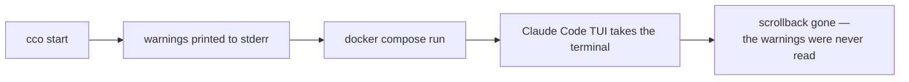
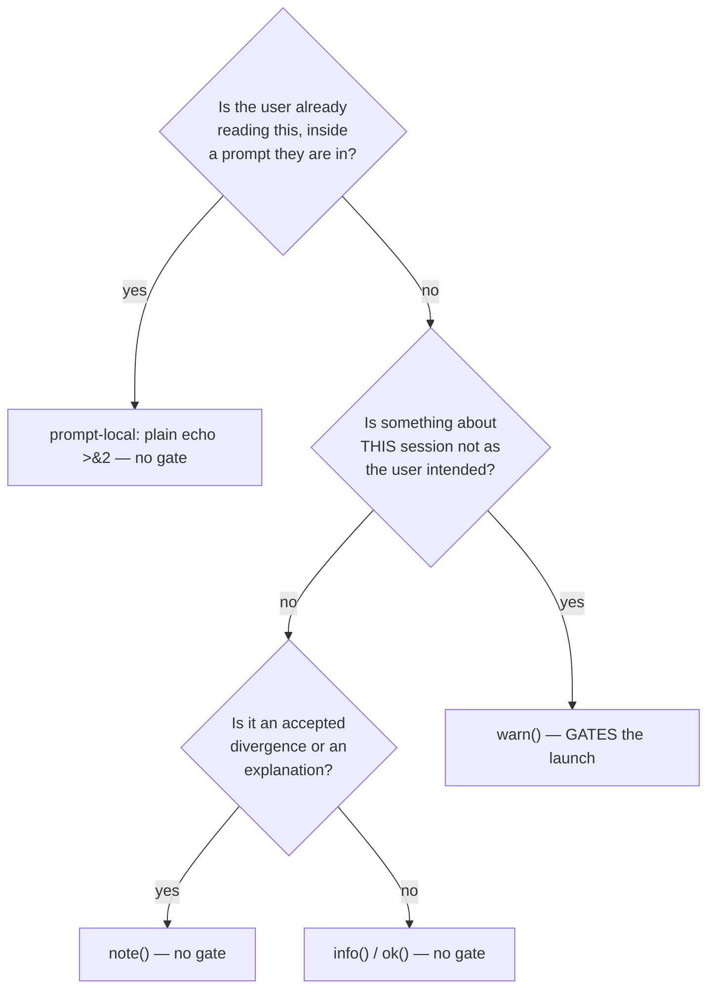
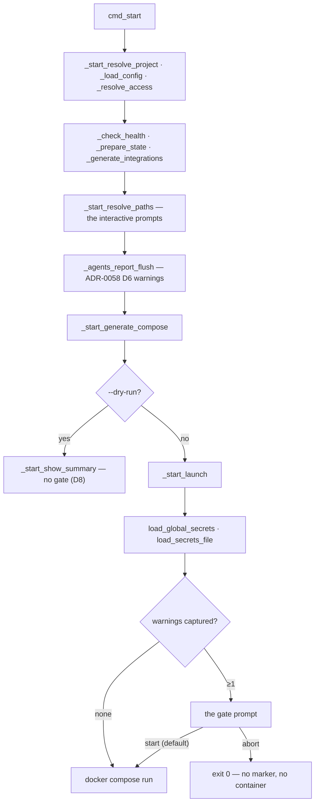

# The start-time warning gate and the onboarding prompts

> Version: 1.2.0
> Status: **Accepted — A5 is implemented (U1 + U2); U3 (A8) outstanding.** Records the mechanism, the
> full message-classification table and the test plan for roadmap items **A5** and **A8**.
> The taxonomy, the capture buffer, the two lints and the gate itself have landed. §6.1 records the
> one correction the implementation forced on the test plan; §6.2 records what the hermetic suite
> cannot reach and therefore what host acceptance still owes.
> Decisions: [ADR-0059](../decisions/0059-message-classification-and-the-start-warning-gate.md).
> Closes [FI-55](../../improvements.md), [FI-68](../../improvements.md),
> [FI-69](../../improvements.md), [FI-70](../../improvements.md).
> Related: [ADR-0058 A2](../../integration/agent-teams/decisions/0058-teammate-coordination-tools.md#amendments)
> (the first warning this gate must be tested against) ·
> [ADR-0047](../../configuration/agent-cco-access/decisions/0047-config-access-enforcement.md)
> (INV-S1 — why the buffer is not in STATE) ·
> [CLI environment-awareness](design-cli-environment-awareness.md) ·
> user CLI reference [`cli.md`](../../../users/reference/cli.md)

---

## 1. Scope and the analysis it stands on

**The analysis phase was not waived.** It is carried by four code-grounded entries in
[`improvements.md`](../../improvements.md) — FI-55, FI-68, FI-69, FI-70, each naming its sites — plus
the survey in §3 and §4 of this document, produced 2026-08-13. Two of its findings changed the design
before it was written (§4.1 and §3.3), so it is recorded here rather than summarised away.

Two roadmap items, one surface:

- **A5** — `cco start` must stop on its own warnings, because today it destroys them.
- **A8** — the mount-declaration flags and the two path-resolution prompts.

They share the `_cco_have_tty` / `CCO_NONINTERACTIVE=1` contract. The roadmap pairs them for that
reason: derived once it is a constraint, derived twice it is a suite that hangs.

## 2. The problem, stated once



The stream is **write-only**. [FI-54](../../improvements.md) sat on the first line after the start
command through a complete six-check acceptance run, read by nobody. ADR-0058 A2 then shipped a
warning into it that says *a teammate will finish its work and lose it* — knowingly unreadable until
this lands.

## 3. The message surface, surveyed

### 3.1 What exists today

`lib/colors.sh` defines four emitters — `info` (`ℹ`), `ok` (`✓`), `warn` (`⚠`), `error` (`✗`) — plus
`die`/`refuse`/`_cco_exit`. A fifth level, `note:`, exists **only as an idiom**: five bare
`echo`/`printf` `"note: …" >&2` sites with no function behind them
(`lib/cmd-start.sh:393,445,457`, `lib/access-scope.sh:1161,1187`).

ADR-0059 D3 makes `note()` a real emitter. Without it, D2's non-gating level has no spelling in code
and the next author reaches for `warn` because it is the only thing that looks like a function.

### 3.2 The classification rule



### 3.3 The audit

Every `warn` reachable from a host `cco start` / `cco new`. **Unchanged** means it is already
classified correctly and gates as written.

| Site | Message | Verdict |
|---|---|---|
| `cmd-start.sh:1153` | config-editor: resource not mounted in this session | unchanged — **gates** |
| `cmd-start.sh:1585` | Invalid `auth.method` — defaulting to `oauth` | unchanged — **gates** |
| `cmd-start.sh:1643` | No repositories defined in project.yml | unchanged — **gates** |
| `cmd-start.sh:1697-1699` | init-workspace skill shadowed by the managed copy | **merge 3 warns → 1** — gates |
| `cmd-start.sh:1959` | Agent teams: cannot prepare the agents overlay | unchanged — **gates** |
| `cmd-start.sh:3134` | N reference(s) unresolved | **strip the leading `⚠`** (INV-WG1) — gates |
| `cmd-start.sh:3223-3224` | Browser: CDP port claimed / using port N instead | **merge 2 warns → 1** — gates |
| `packs.sh:74,83,92` | agent/rule/skill defined in two packs — one overwrites | unchanged — **gates** |
| `packs.sh:116,133,138,143` | committed `.claude/…` shadowed by a pack `:ro` overlay | unchanged — **gates** |
| `packs.sh:161` | pack not resolved | unchanged — **gates** |
| `packs.sh:167` + `session-context.sh:38` | pack.yml has no valid top-level keys | unchanged — **gates**; identical text from two producers, **deduplicated in the buffer** (§4.4) |
| `agents.sh:322,324` | ADR-0058 D6 — toolset widened / no return channel | unchanged — **gates**. The flagship case |
| `yaml.sh:118,283` | invalid boolean / invalid enum — using the default | unchanged — **gates** |
| `index.sh:489,504,533,538,542,547` | re-home and residue reconciliation | unchanged — **gates** |
| `index.sh:1197-1220` | legacy-index reconcile divergences | unchanged — **gates** |
| `secrets.sh:102` | malformed line in `secrets.env` | unchanged — **gates**. Emitted *after* every other step → the reason for D7 |
| `local-paths.sh:504` | could not bind name → path in the index | unchanged — **gates** |
| `cmd-new.sh:198` | could not extract the OAuth token from Keychain | unchanged — **gates** (`cco new`, D9) |
| `local-paths.sh:109,120,151,164,445,450` | "No URL available for clone" · "Path '…' does not exist" · "Invalid choice 'x'" | **→ prompt-local** (D4) — no gate |
| `cmd-resolve.sh:841` | "note: '…' does not exist on this machine yet" | **→ `note()`** (D3) — no gate |
| `paths.sh:620` | dev-sandbox: seeded STATE+DATA (one-shot) | **→ `note()`** — no gate |
| `paths.sh:638` | dev-sandbox active — state isolated | **→ `note()`** — no gate. 📌 *the one judgement call*: it is loud by intent, but the user typed `--dev-sandbox` themselves and nothing is wrong. Gating every dev-sandbox start would be friction on the developer path |
| `paths.sh:611,616` | dev-sandbox: STATE/DATA seed was incomplete | unchanged — **gates** |
| `access-scope.sh:1424-1427` | hidden / not-mounted / unresolved by access scope | **out of scope** — container-operator only, never in a host start |

**Net**: 3 sites change level, 3 blocks merge, 1 badge is stripped. Everything else was already
honest — which is the result the audit had to be capable of producing to be worth running.

## 4. Mechanism

### 4.1 Why a file, not an array (measured)

`_prompt_for_path` and `_resolve_disambiguate` are called inside command substitution:

```
_reuse=$(_resolve_disambiguate "$name" "$section" "$url" "$proj") || _drc=$?   # local-paths.sh:497
resolved=$(_prompt_for_path "$name" "$url" "$suggested" "$label") || rc=$?      # local-paths.sh:474
```

Every `warn` they emit therefore runs in a **subshell**, and an array append dies with it. An
array-backed buffer would work everywhere except on the interactive surface this same unit is fixing,
and would look correct while doing it. Same class as the `die`-inside-`$( )` defect (FI-62).

### 4.2 API

In `lib/colors.sh`, beside the emitter it instruments (single producer):

| Function | Contract |
|---|---|
| `_cco_warn_capture_begin` | creates the buffer, exports `_CCO_WARN_LOG`. Idempotent |
| `warn()` | unchanged output; additionally appends the rendered message to `$_CCO_WARN_LOG` when set and writable. **A capture failure never breaks `warn`** |
| `_cco_warn_capture_list` | the captured messages, in order, **deduplicated on exact text** |
| `_cco_warn_capture_count` | the number of distinct messages |
| `_cco_warn_capture_end` | removes the buffer, unsets the variable |

**D6 — location.** `mktemp "${TMPDIR:-/tmp}/cco-warn.XXXXXX"`: the template form is the spelling BSD
and GNU agree on (`lib/sync-meta.sh:117` is the precedent). Never STATE/DATA/CACHE — INV-S1 forbids
any code outside `lib/store.sh` from mutating *or predicating* a confined path, and a warning buffer
does not justify a `store-op` crossing.

**Cleanup.** Explicit `_cco_warn_capture_end` on every exit path of the two verbs — **U2's
responsibility**, since U2 owns the `begin`/`end` call sites (D7/D9); U1 ships the API and calls it
from nowhere. Not an `EXIT` trap alone: `cco new` installs its own at `lib/cmd-new.sh:75`, which
replaces `bin/cco:14`'s sentinel trap (D9).

⚠ **Correction (U1).** An earlier revision of this section claimed a leftover file is "pid-named, and
swept by `cco clean --tmp`". Neither half is true: the name is an `mktemp` suffix, and `cco clean
--tmp` removes `<project>/.cco/.tmp/` dry-run directories — it has never looked at `$TMPDIR`. What is
true is that a file left behind by a hard kill is **inert**: an unread list of strings in the system
temp directory, reclaimed by the OS on the usual schedule. Whether `cco clean` should also sweep
`$TMPDIR/cco-warn.*` is a user-visible change to that verb, so it is left as an open question rather
than folded in silently.

### 4.3 Placement



Inside `_start_launch`, **after** secrets loading and **before** `_cco_running_mark`. Secrets warn
last of all (`lib/secrets.sh:102`), so any earlier placement misses them; marking after the gate means
an abort leaves no registry entry to reap.

### 4.4 The prompt

```
⚠ 2 warnings for this session:

  ⚠ Pack 'core-dev-framework' not resolved (not in ~/.cco/packs or <repo>/.cco/packs) — run 'cco resolve'.
  ⚠ Agent teams: 1 agent definition(s) keep NO return channel — a teammate using one will finish its
    work and lose it. …

  Start the session anyway? [S/a]:
```

- The list is the deduplicated buffer, in emission order.
- Bare Enter starts (**D10**). `a`/`A` aborts → `return 0`, no container, no marker — the same clean
  shape `_start_resolve_paths`'s `[q]` already returns through.
- Gated on `_cco_have_tty`, which is also what honours `CCO_NONINTERACTIVE=1` (**D11**). No terminal →
  no prompt, launch proceeds exactly as today.
- No remedies are offered. Offering `cco config save` and friends grows out of this naturally
  (FI-55 says so) and is deliberately **not** built now — YAGNI until a second message wants it.

## 5. A8 — the three surface fixes

### 5.1 FI-68 — `--writable` (ADR-0059 D12)

`lib/cmd-project-add.sh`:

| Invocation | `project.yml` | Effective bind |
|---|---|---|
| *(no flag)* | no `readonly:` key | **read-only** (the default, `local-paths.sh:312`) |
| `--readonly` | `readonly: true` | read-only — now an explicit affirmation |
| `--writable` | `readonly: false` | **writable** — the only CLI spelling |
| both | error | — |

- The applicability guards already key on the shared `$ro` variable, so `--writable` is rejected for
  `repo`/`llms`/`pack` for free — but their **messages** name only `--readonly` today and must name
  both.
- The help text states the default in words.
- **The `readonly: true` default is not touched** (ADR-0059 P4).
- Additive change → a `changelog.yml` entry and a line in `docs/users/reference/cli.md`, per
  `.claude/rules/update-system.md`.

### 5.2 FI-69 — the clone prompt asks where to clone (D13)

`(c)` renders its computed destination and accepts an override; Enter accepts. The answer goes
through `_resolve_to_abs` like `(p)` does — a relative path stored in the index resolves wrong from
any other cwd (M7).

`suggested` is computed only for `repos` (`local-paths.sh:489-494`), so an `extra_mount` falls back to
`~/Projects/<name>` — unrelated to where the user keeps mounts. With the destination now editable the
fallback stops being a trap, and no new derivation is invented for mounts (YAGNI: the override is the
answer).

### 5.3 FI-70 — the reuse prompt shows what it accepts (D14)

`[1-${#cands[@]}]` → the literal tokens. With one candidate the line reads `[1] reuse that path`
instead of `[1-1]`, which the parser rejects (`*[!0-9]*`, `:445`) after the prompt itself printed it.

## 6. Test plan

⚠ **Prove the oracle discriminates before believing a pass** — the standing rule of this repo. Each
test below names what it would fail against.

| # | Test | Discriminates against |
|---|---|---|
| T1 | a clean start emits **no** prompt and no extra output | a gate that fires unconditionally (would read as "working") |
| T2 | a seeded `warn` produces the prompt, listing that exact text | a buffer that is never read |
| T3 | **a `warn` emitted from inside `$( )`** reaches the buffer | ⭐ **the array implementation** — the one test D5 exists for. Drive it through a real call path, never a synthetic subshell (see the driver note below) |
| T4 | `CCO_NONINTERACTIVE=1` → no prompt, launch proceeds, exit 0 | a suite-hanging prompt (`test_invariant_tty_gate_single_spelling`'s failure mode) |
| T5 | abort → exit 0, **no container and no running-registry marker** | a gate placed after `_cco_running_mark` |
| T6 | `--dry-run` with warnings → summary, no prompt (D8) | a gate in `cmd_start` instead of `_start_launch` |
| T7 | two producers of the identical message → **one** list entry | a buffer that does not dedupe (`packs.sh:167` + `session-context.sh:38`) |
| T8 | a `secrets.env` malformed line is in the list | a gate placed before secrets loading (D7) |
| T9 | `note()` / prompt-local feedback do **not** appear in the list | D2 collapsing back into "everything gates" |
| T10 | `cco new` gates identically (D9) | a fix applied to one launch path of two |
| T11 | INV-WG1 / INV-WG2 lints fail on a seeded violation | a lint that passes because it matches nothing |
| T12 | `--writable` writes `readonly: false`; `--readonly` writes `readonly: true`; both → error; neither → **no key** | a flag that writes the wrong polarity, or a "fix" that inverts the default |
| T13 | the reuse prompt's printed token is accepted verbatim when typed back | FI-70 recurring — assert on the rendered line, not on the parser alone |

Plus the **live check** the gate exists for: a session whose agents carry no return channel must stop
and show ADR-0058 A2's warning (roadmap A5, *"the first message A5 should be tested against"*).

### 6.1 T3's driver — corrected during U1, decision unchanged

This document named `_prompt_for_path` as T3's driver. **It cannot be one**, and the reason is D4 in
this same design: D4 reclassifies *every* message inside `_prompt_for_path` and `_resolve_disambiguate`
to prompt-local, so after U1 neither function emits a `warn` at all. The two decisions interact, and
the interaction was only visible once both were applied to the code.

**D5 is untouched** — the property under test, and its rationale, are exactly as written: production
`warn`s still run inside command substitution, and an array buffer would still lose them. Only the
driver moves, to another site the audit already classified:

```
_effective_extra_mounts        lib/local-paths.sh:312   ro=$(_parse_bool "$ro_raw" "true")
  └── _parse_bool              lib/yaml.sh:118          warn "Invalid boolean value …"   ← §3.3: unchanged, gates
```

A `readonly:` the user typed wrong is a real session condition, on the real `cco start` path, warned
from inside a real `$( )`. `tests/test_warn_capture.sh` drives that path and carries a second
assertion proving the shape *is* a subshell — without it a pass would prove only that the fixture ran.
**Measured**: against a shell-array buffer this test fails (`count 0, expected 1`) while every other
test in the file still passes, which is what makes it the discriminating one.

### 6.2 What the hermetic suite cannot reach — and what that costs

Stated rather than implied, because a test plan that does not name its own edge reads as complete.

| Reachable in the suite | Not reachable | Why |
|---|---|---|
| the renderer (count, dedup, order, singular/plural) | the `read` and the case that consumes it | needs a controlling terminal |
| the no-tty branch of the gate (T4) | an end-to-end abort (T5's *runtime* half) | `cco start` ends in `docker compose run` |
| the placement of the gate (T5/T6/T8/T10, static) | the ADR-0058 A2 **live check** | `cco start` is host-only in a session |

**Placement is asserted statically, and that is not a shortcut**: "after secrets, before the marker"
*is* the decision, and a run under `CCO_NONINTERACTIVE=1` cannot discriminate a misplaced gate from a
correct one — neither prompts. All three static oracles were **measured against the wrong
implementation they name** (gate after `_cco_running_mark`; gate in `cmd_start` instead of
`_start_launch`; `cco new` without a gate): each fails its own test and only its own test.

**Owed on the host**, and not substitutable from inside a session:

1. `cco start` on a project whose agent definitions keep no return channel → the gate must stop and
   show [ADR-0058 A2](../../integration/agent-teams/decisions/0058-teammate-coordination-tools.md#amendments)'s
   warning. This is the message that shipped deliberately unread, one release early, for this moment.
2. Answer `a` → no container, and `cco list` shows **no** running marker for that project.
3. `cco start --dry-run` on the same project → the summary, and **no** prompt.

*(The prompt itself was driven end to end through a pty during U1/U2 development: three warnings
render as two deduplicated entries under `⚠ 2 warnings for this session:`, `a` returns 1, bare Enter
returns 0. That exercises the code, not the integration — the three checks above are the integration.)*

## 7. The units *(approved at the Plan gate, 2026-08-13 — the roadmap carries their status)*

1. ✅ **U1 — capture + taxonomy**: `note()`, the buffer, the reclassifications of §3.3, the two lints.
   Self-verifying via T1–T3, T7, T9, T11. No user-visible prompt yet.
2. ✅ **U2 — the gate**: the prompt in `_start_launch` + `cco new`. T4–T6, T8, T10 + the live check
   (the live check is **owed on the host** — see §6.2).
3. **U3 — A8's three fixes**: `--writable` (+ changelog + user docs), the clone destination, the
   reuse tokens. T12–T13.

U1 before U2 is not cosmetic: the gate must not ship while a message that should not gate still can.
No unit touches a baked file, so **no `cco build`** is in the acceptance lane.

## 8. Out of scope, deliberately

- The `readonly: true` default (ADR-0059 P4).
- Remedy actions inside the prompt (`cco config save`, committing `.cco`) — §4.4.
- `access-scope.sh`'s in-session warnings — a container-operator surface, not a launch.
- A derived clone destination for `extra_mounts` — the override answers it (§5.2).
