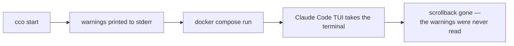
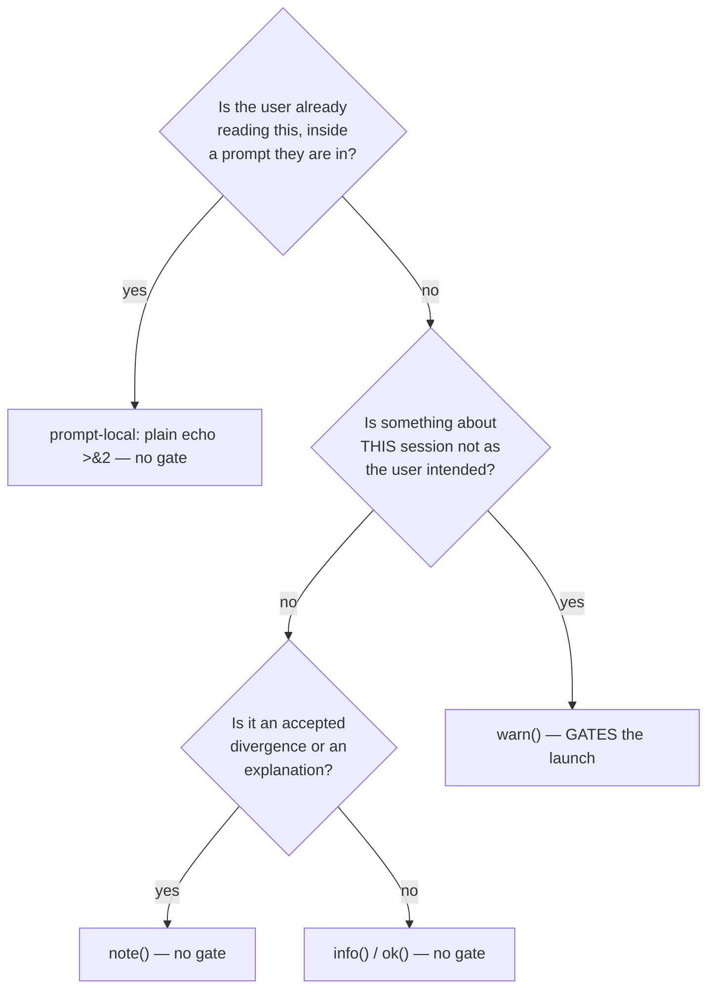
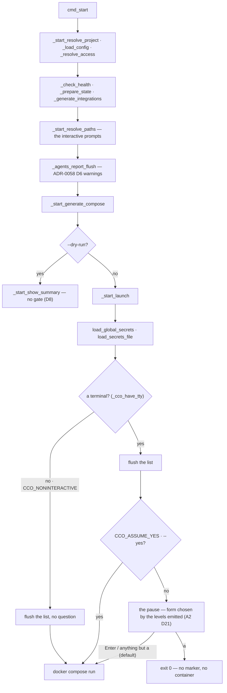

# The start-time warning gate and the onboarding prompts

> Version: 1.2.0
> Status: **Accepted — A5 is implemented (U1 + U2); U3 (A8) outstanding.** Records the mechanism, the
> full message-classification table and the test plan for roadmap items **A5** and **A8**.
> The taxonomy, the capture buffer, the two lints and the gate itself have landed. §6.1 records the
> one correction the implementation forced on the test plan; §6.2 records what the hermetic suite
> cannot reach and therefore what host acceptance still owes.
> Decisions: [ADR-0059](../decisions/0059-message-classification-and-the-start-warning-gate.md).
> Closes [FI-55](../../improvements.md), [FI-68](../../improvements.md),
> [FI-69](../../improvements.md), [FI-70](../../improvements.md).
> Related: [ADR-0058 A2](../../integration/agent-teams/decisions/0058-teammate-coordination-tools.md#amendments)
> (the first warning this gate must be tested against) ·
> [ADR-0047](../../configuration/agent-cco-access/decisions/0047-config-access-enforcement.md)
> (INV-S1 — why the buffer is not in STATE) ·
> [CLI environment-awareness](design-cli-environment-awareness.md) ·
> user CLI reference [`cli.md`](../../../users/reference/cli.md)

---

## 1. Scope and the analysis it stands on

**The analysis phase was not waived.** It is carried by four code-grounded entries in
[`improvements.md`](../../improvements.md) — FI-55, FI-68, FI-69, FI-70, each naming its sites — plus
the survey in §3 and §4 of this document, produced 2026-08-13. Two of its findings changed the design
before it was written (§4.1 and §3.3), so it is recorded here rather than summarised away.

Two roadmap items, one surface:

- **A5** — `cco start` must stop on its own warnings, because today it destroys them.
- **A8** — the mount-declaration flags and the two path-resolution prompts.

They share the `_cco_have_tty` / `CCO_NONINTERACTIVE=1` contract. The roadmap pairs them for that
reason: derived once it is a constraint, derived twice it is a suite that hangs.

## 2. The problem, stated once



The stream is **write-only**. [FI-54](../../improvements.md) sat on the first line after the start
command through a complete six-check acceptance run, read by nobody. ADR-0058 A2 then shipped a
warning into it that says *a teammate will finish its work and lose it* — knowingly unreadable until
this lands.

## 3. The message surface, surveyed

### 3.1 What exists today

`lib/colors.sh` defines four emitters — `info` (`ℹ`), `ok` (`✓`), `warn` (`⚠`), `error` (`✗`) — plus
`die`/`refuse`/`_cco_exit`. A fifth level, `note:`, exists **only as an idiom**: five bare
`echo`/`printf` `"note: …" >&2` sites with no function behind them
(`lib/cmd-start.sh:393,445,457`, `lib/access-scope.sh:1161,1187`).

ADR-0059 D3 makes `note()` a real emitter. Without it, D2's non-gating level has no spelling in code
and the next author reaches for `warn` because it is the only thing that looks like a function.

### 3.2 The classification rule



### 3.3 The producer survey

> **Superseded in place by the D19 measurement (2026-08-18).** The first version of this section
> was an audit — a table assembled by *reading* the tree — and it was a **lower bound**: it covered
> 12 of the ~36 files that call `warn`, and the twelve it named are **not** the twelve a start
> actually reaches. The table below is what a start *runs*, enumerated by executing `cco start` and
> `cco new` under an instrumented `warn`. Method, the per-site verdicts, and the numbers behind each
> row: [the D19 analysis](../analysis/d19-warn-producer-reclassification.md).

**184 `warn` call sites in the executable trees; 46 reached, in 12 files; 24 fired.** Keyed on file
and condition, not on line number — line numbers drift between the survey and the reader, and the
condition is what the classification is about.

| Producer | The condition it reports | Verdict |
|---|---|---|
| `cmd-start.sh` (6) | config-editor resource not mounted · invalid `auth.method` · no repos in `project.yml` · init-workspace skill shadowed · agents overlay cannot be prepared · browser CDP port claimed | unchanged — **gates**. Measured as 7; the seventh was the passive residue badge, **removed** by A2 D25 |
| `packs.sh` (8) | an agent/rule/skill defined in two packs · committed `.claude/…` shadowed by a pack `:ro` overlay · pack not resolved · `pack.yml` has no valid top-level keys | unchanged — **gates** |
| `index.sh` (8) | index residue reconciliation · legacy-index reconcile divergences | unchanged — **gates** |
| `cmd-resolve.sh` (6) | no `.cco/project.yml` in the unit · repo · extra_mount · llms · pack unresolved on this machine · the residue count | unchanged — **gates**. Only *one* of the six was ever audited; llms and packs now go silent when a start is about to restate them (**A2 D24**) |
| `reminders.sh` (4) | `~/.cco` uncommitted · repos with an uncommitted `.cco` · divergent `.cco` across repos | **never classified before D19** — stays `warn`, **gates** (ADR-0008's *non-blocking* forbids a precondition that forces commits, not a prompt that defaults to proceed) |
| `migrate.sh` (5) | the legacy vault could not be backed up · `~/.cco/global/.claude` could not be flattened | ⚠ **named by nobody** — `_cco_first_run` runs on every host command, so these gate a launch for any user still carrying the legacy vault. Stays `warn`, **gates** |
| `llms.sh` (2) | N referenced llms are not installed | **never classified before D19** — stays `warn`, **gates** |
| `yaml.sh` (2) | invalid boolean / invalid enum — using the default | unchanged — **gates** |
| `agents.sh` (1 of 2) | a definition keeps **no return channel** | unchanged — **gates**. The flagship case |
| `agents.sh` (the other) | the declared toolset was **widened** | **→ `note()`** (A1 §A2) — cco resolved it, nothing is left to decide |
| `secrets.sh` (1) | a malformed line in `secrets.env` | unchanged — **gates**. Emitted *after* every other step → the reason for D7 |
| `session-context.sh` (1) | `pack.yml` has no valid top-level keys | unchanged — **gates**; identical text to `packs.sh`, **deduplicated in the buffer** |
| `cmd-new.sh` (1) | the OAuth token could not be extracted from the Keychain | unchanged — **gates** (`cco new`, D9) |
| `local-paths.sh` | "No URL available for clone" · "Path '…' does not exist" · "Invalid choice 'x'" | **→ prompt-local** (D4) — the user is already reading the prompt |
| `cmd-resolve.sh` | "'…' does not exist on this machine yet" | **→ `note()`** (D3) |
| `paths.sh` | dev-sandbox seeded / active | **→ `note()`**. 📌 *the one judgement call*: loud by intent, but the user typed `--dev-sandbox` and nothing is wrong |
| `paths.sh` | the dev-sandbox STATE/DATA seed was incomplete | unchanged — **gates** |

**Measured NOT reachable from a start**, recorded so the next survey does not re-derive it:
`index.sh:489,504` (inside `_index_rehome_*`, never entered) and `access-scope.sh`'s
hidden/not-mounted/unresolved family (container-operator only, **0 reached** in 15 host-lane runs).

**Net: no producer is reclassified by D19.** Three files had simply never been through §3.2's
decision tree, and all three are correct where they stand. What the measurement bought is
*coverage* — and the proof that **P2 pays itself back**: the mechanism keys on the level, so the four
messages the audit never named were captured, listed and gated anyway, exactly where the enumeration
failed.

⚠ **Nothing detects the *next* unclassified producer.** The instrument that would is the D19 lane
(§2 of the analysis); building it is recorded in `improvements.md`, not done. Until then this table
is a snapshot, and a snapshot of a moving tree is a lower bound the moment it is written — which is
the reason the guarantee was never allowed to depend on it (**P2**).

## 4. Mechanism

### 4.1 Why a file, not an array (measured)

`_prompt_for_path` and `_resolve_disambiguate` are called inside command substitution:

```
_reuse=$(_resolve_disambiguate "$name" "$section" "$url" "$proj") || _drc=$?   # local-paths.sh:497
resolved=$(_prompt_for_path "$name" "$url" "$suggested" "$label") || rc=$?      # local-paths.sh:474
```

Every `warn` they emit therefore runs in a **subshell**, and an array append dies with it. An
array-backed buffer would work everywhere except on the interactive surface this same unit is fixing,
and would look correct while doing it. Same class as the `die`-inside-`$( )` defect (FI-62).

### 4.2 API

In `lib/colors.sh`, beside the emitter it instruments (single producer):

| Function | Contract |
|---|---|
| `_cco_warn_capture_begin` | creates the buffer, exports `_CCO_WARN_LOG`. Idempotent |
| `warn()` · `note()` | append `<level>\t<source>\t<message>` to `$_CCO_WARN_LOG` when set and writable, and then **print nothing** (D18/D22). **A capture failure never breaks either**: the append's status is what decides whether printing may be deferred |
| `_cco_warn_capture_records [<level>]` | `<level>\t<area>\t<message>` per distinct message, in emission order. Deduplicated **before** the level filter, so one sentence emitted at two levels is one entry and the warning wins |
| `_cco_warn_capture_list [<level>]` | the captured messages, in order, **deduplicated on exact text** |
| `_cco_warn_capture_count [<level>]` | the number of distinct messages; `warn` is the filter the pause reads to choose its form |
| `_cco_warn_gate_render` | the two sections (warnings, then notes) to stdout. **Pure** — no read, no prompt, no terminal |
| `_cco_warn_flush` | renders to stderr and **empties** the buffer; a second flush prints nothing |
| `_cco_warn_capture_end` | flushes, removes the buffer, unsets the variable |

**D6 — location.** `mktemp "${TMPDIR:-/tmp}/cco-warn.XXXXXX"`: the template form is the spelling BSD
and GNU agree on (`lib/sync-meta.sh:117` is the precedent). Never STATE/DATA/CACHE — INV-S1 forbids
any code outside `lib/store.sh` from mutating *or predicating* a confined path, and a warning buffer
does not justify a `store-op` crossing.

**Cleanup.** Explicit `_cco_warn_capture_end` on every exit path of the two verbs — **U2's
responsibility**, since U2 owns the `begin`/`end` call sites (D7/D9); U1 ships the API and calls it
from nowhere. Not an `EXIT` trap alone: `cco new` installs its own at `lib/cmd-new.sh:75`, which
replaces `bin/cco:14`'s sentinel trap (D9).

⚠ **Correction (U1).** An earlier revision of this section claimed a leftover file is "pid-named, and
swept by `cco clean --tmp`". Neither half is true: the name is an `mktemp` suffix, and `cco clean
--tmp` removes `<project>/.cco/.tmp/` dry-run directories — it has never looked at `$TMPDIR`. What is
true is that a file left behind by a hard kill is **inert**: an unread list of strings in the system
temp directory, reclaimed by the OS on the usual schedule. Whether `cco clean` should also sweep
`$TMPDIR/cco-warn.*` is a user-visible change to that verb, so it is left as an open question rather
than folded in silently.

### 4.3 Placement



⚠ **The pause does not branch on whether anything was captured** (A2 D20). It branches on whether
there is a terminal. A clean run pauses too — that is the amendment, not an oversight.

Inside `_start_launch`, **after** secrets loading and **before** `_cco_running_mark`. Secrets warn
last of all (`lib/secrets.sh:102`), so any earlier placement misses them; marking after the gate means
an abort leaves no registry entry to reap.

### 4.4 The prompt

> **Amended twice on 2026-08-18** — by [ADR-0059 A1](../decisions/0059-message-classification-and-the-start-warning-gate.md#amendments)
> after the first host run, and by **A2** at the D19 gate. The mockup in §4.4bis is the original
> *shape*; §4.5 is the output model and **§4.6 is what the pause keys on** — which is what is built.

### 4.5 The output model, as amended (A1 · D16–D18)

**A warning is printed exactly once.** While the capture is armed `warn` appends and does not print;
the buffer is rendered to stderr and emptied by the first of: the gate (then its question),
`_cco_warn_capture_end` (no TTY, `--dry-run`, abort), or `die`/`refuse`/`_cco_exit` (before the `✗`).
⚠ **Deferral is conditional on the append succeeding** — an unwritable buffer makes `warn` print
immediately, so a broken capture degrades to today's behaviour instead of eating the message.

**The list is aggregated and grouped.** Loop producers emit one warning naming their items (D16); the
gate groups by an area derived from `${BASH_SOURCE[1]}` — no call-site tags, and a file missing from
the label table falls through to `other` with its warning intact (D17).

As built, on the reporting project — **14 warnings printed twice became this**, measured through a
pty (the `widened` line is a `note` under §A2, so it is no longer in the list at all):

```
note: Agent teams: widened the declared toolset of 2 agent definition(s) — analyst.md, reviewer.md. …

⚠ 6 warnings for this session, in 3 areas:

  ── packs & overlays (2) ────────────────────────────────────
   · Committed .claude/packs/ is framework-reserved — its contents are shadowed by
     pack/llms :ro overlays.
   · 5 committed .claude/rules/ files are shadowed by pack ':ro' overlays — the packs win:
     cave-architecture-rules.md (cave-core), cave-testing-rules.md (cave-core),
     cave-dev-workflow.md (cave-core), cave-backend-rules.md (cave-web),
     cave-frontend-rules.md (cave-web)

  ── documentation / llms (1) ────────────────────────────────
   · 3 llms are not installed (shadcn-svelte, svelte, svelte-kit)
     → cco llms install

  ── config hygiene (3) ──────────────────────────────────────
   · ~/.cco has uncommitted changes               → cco config save
   · 2 repos have uncommitted .cco (cave-auth, cave-auth-web)
     → commit with your normal git flow
   · project repos have divergent .cco            → cco sync

  Start the session anyway? [S/a]:
```

Long entries wrap with a **hanging indent** at a fixed width. Not `$COLUMNS`: that variable is not
exported to a script, so reading it would silently mean 80 everywhere while pretending to adapt.

A message may end in ` → <remedy>`; the renderer right-aligns it when the line fits and drops it to
its own indented line when it does not. No arrow means no column — the convention degrades to plain
text rather than requiring every message to adopt it.

### 4.6 The pause, as amended (A2 · D20–D23)

**The pause is a property of the RUN, not of the warning level.** A start takes under five seconds
and then Claude Code owns the terminal; everything cco printed — `⚠`, `note:`, `ℹ`, `✓` alike — is
gone before it can be read. D1 keyed the stop on `warn`, which fused two independent questions:

| Job | Answers | Keyed on |
|---|---|---|
| **level** | how serious, how presented | `warn` / `note` / `ℹ`·`✓` — unchanged |
| **pause** | may the user read what this run printed | **the run reached the launch**, nothing else |

So on an interactive terminal `cco start` and `cco new` **always** stop before the container runs.
What the level changes is what the pause *says*:

| The run emitted | The pause shows | The prompt |
|---|---|---|
| chronicle only (`ℹ`/`✓`) | nothing extra | `→ Press Enter to start the session.` |
| notes, no warnings | the notes, grouped by area | `→ Press Enter to start the session.` |
| one or more warnings | `⚠ N warnings … in M areas`, grouped (D17) | `Start the session anyway? [S/a]:` |

`a`/`A` aborts in **all three** — uniform even where the clean form does not advertise it, because a
user who picked the wrong project must be able to back out of the one they did pick. Bare Enter
starts everywhere (D10 unchanged), and an unrecognised answer starts rather than re-asking.

**The buffer carries the level** (D22). `note()` is captured exactly like `warn()`; the record is
`<level>\t<source>\t<message>` and the records stream `<level>\t<area>\t<message>`. The renderer
emits **warnings first, then notes**, each grouped by the area derived from `${BASH_SOURCE[1]}`.
Two sections, never one merged list: what the reader must decide about and what cco already settled
are different questions, and the section badge is the only thing that says which is which.

⚠ **Deferral stays conditional on the append succeeding**, for notes as for warnings. A buffer that
cannot be written makes `note` print immediately. Do not simplify that into an unconditional defer:
it is what keeps a capture problem from eating the message it was built to deliver.

**Two opt-outs, and they are not synonyms** (D23):

| Spelling | Means | The list | The question |
|---|---|---|---|
| `CCO_NONINTERACTIVE=1` | *there is nobody there* | flushed by `_cco_warn_capture_end` | not asked |
| `CCO_ASSUME_YES=1`, `--yes`/`-y` | *somebody is there and has already answered* | **rendered at the pause** | not asked |

The second exists because D20 makes every interactive start pause: automation driven from a real
terminal needs a way to *answer*, not a way to pretend the terminal is absent — and it still has a
reader, so it still gets the list.

**Why this is not merely nicer.** Under D1, `note()` and `info()` were **write-only**: a note
printed, was never captured (the gate keyed on the warn count alone) and was overwritten seconds
later. D3 created `note()` so the non-gating level would have a spelling in code; a level whose
messages cannot be read is not a level, and the next author facing that reaches for `warn` for the
very reason D3 exists.

### 4.4bis The prompt *(original shape, pre-A1)*

```
⚠ 2 warnings for this session:

  ⚠ Pack 'core-dev-framework' not resolved (not in ~/.cco/packs or <repo>/.cco/packs) — run 'cco resolve'.
  ⚠ Agent teams: 1 agent definition(s) keep NO return channel — a teammate using one will finish its
    work and lose it. …

  Start the session anyway? [S/a]:
```

- The list is the deduplicated buffer, in emission order.
- Bare Enter starts (**D10**). `a`/`A` aborts → `return 0`, no container, no marker — the same clean
  shape `_start_resolve_paths`'s `[q]` already returns through.
- Gated on `_cco_have_tty`, which is also what honours `CCO_NONINTERACTIVE=1` (**D11**). No terminal →
  no prompt, launch proceeds exactly as today.
- No remedies are offered. Offering `cco config save` and friends grows out of this naturally
  (FI-55 says so) and is deliberately **not** built now — YAGNI until a second message wants it.

## 5. A8 — the three surface fixes

✅ **Built 2026-08-18 (U3).** All three are in `lib/cmd-project-add.sh` and `lib/local-paths.sh`;
T12 (5 tests) and T13 (7 tests) cover them, and **every oracle was measured against the pre-fix
tree**. What the fixes themselves are is below, unchanged; what changed during the build is §6.4.

### 5.1 FI-68 — `--writable` (ADR-0059 D12)

`lib/cmd-project-add.sh`:

| Invocation | `project.yml` | Effective bind |
|---|---|---|
| *(no flag)* | no `readonly:` key | **read-only** (the default, `local-paths.sh:312`) |
| `--readonly` | `readonly: true` | read-only — now an explicit affirmation |
| `--writable` | `readonly: false` | **writable** — the only CLI spelling |
| both | error | — |

- The applicability guards already key on the shared `$ro` variable, so `--writable` is rejected for
  `repo`/`llms`/`pack` for free — but their **messages** name only `--readonly` today and must name
  both.
- The help text states the default in words.
- **The `readonly: true` default is not touched** (ADR-0059 P4).
- Additive change → a `changelog.yml` entry and a line in `docs/users/reference/cli.md`, per
  `.claude/rules/update-system.md`.

### 5.2 FI-69 — the clone prompt asks where to clone (D13)

`(c)` renders its computed destination and accepts an override; Enter accepts. The answer goes
through `_resolve_to_abs` like `(p)` does — a relative path stored in the index resolves wrong from
any other cwd (M7).

`suggested` is computed only for `repos` (`local-paths.sh:489-494`), so an `extra_mount` falls back to
`~/Projects/<name>` — unrelated to where the user keeps mounts. With the destination now editable the
fallback stops being a trap, and no new derivation is invented for mounts (YAGNI: the override is the
answer).

### 5.3 FI-70 — the reuse prompt shows what it accepts (D14)

`[1-${#cands[@]}]` → the literal tokens. With one candidate the line reads `[1] reuse that path`
instead of `[1-1]`, which the parser rejects (`*[!0-9]*`, `:445`) after the prompt itself printed it.

## 6. Test plan

⚠ **Prove the oracle discriminates before believing a pass** — the standing rule of this repo. Each
test below names what it would fail against.

| # | Test | Discriminates against |
|---|---|---|
| T1 | a clean start emits **no** prompt and no extra output | a gate that fires unconditionally (would read as "working") |
| T2 | a seeded `warn` produces the prompt, listing that exact text | a buffer that is never read |
| T3 | **a `warn` emitted from inside `$( )`** reaches the buffer | ⭐ **the array implementation** — the one test D5 exists for. Drive it through a real call path, never a synthetic subshell (see the driver note below) |
| T4 | `CCO_NONINTERACTIVE=1` → no prompt, launch proceeds, exit 0 | a suite-hanging prompt (`test_invariant_tty_gate_single_spelling`'s failure mode) |
| T5 | abort → exit 0, **no container and no running-registry marker** | a gate placed after `_cco_running_mark` |
| T6 | `--dry-run` with warnings → summary, no prompt (D8) | a gate in `cmd_start` instead of `_start_launch` |
| T7 | two producers of the identical message → **one** list entry | a buffer that does not dedupe (`packs.sh:167` + `session-context.sh:38`) |
| T8 | a `secrets.env` malformed line is in the list | a gate placed before secrets loading (D7) |
| T9 | `note()` / prompt-local feedback do **not** appear in the list | D2 collapsing back into "everything gates" |
| T10 | `cco new` gates identically (D9) | a fix applied to one launch path of two |
| T11 | INV-WG1 / INV-WG2 lints fail on a seeded violation | a lint that passes because it matches nothing |
| T12 | `--writable` writes `readonly: false`; `--readonly` writes `readonly: true`; both → error; neither → **no key** | a flag that writes the wrong polarity, or a "fix" that inverts the default |
| T13 | the reuse prompt's printed token is accepted verbatim when typed back | FI-70 recurring — assert on the rendered line, not on the parser alone |

Plus the **live check** the gate exists for: a session whose agents carry no return channel must stop
and show ADR-0058 A2's warning (roadmap A5, *"the first message A5 should be tested against"*).

### 6.1 T3's driver — corrected during U1, decision unchanged

This document named `_prompt_for_path` as T3's driver. **It cannot be one**, and the reason is D4 in
this same design: D4 reclassifies *every* message inside `_prompt_for_path` and `_resolve_disambiguate`
to prompt-local, so after U1 neither function emits a `warn` at all. The two decisions interact, and
the interaction was only visible once both were applied to the code.

**D5 is untouched** — the property under test, and its rationale, are exactly as written: production
`warn`s still run inside command substitution, and an array buffer would still lose them. Only the
driver moves, to another site the audit already classified:

```
_effective_extra_mounts        lib/local-paths.sh:312   ro=$(_parse_bool "$ro_raw" "true")
  └── _parse_bool              lib/yaml.sh:118          warn "Invalid boolean value …"   ← §3.3: unchanged, gates
```

A `readonly:` the user typed wrong is a real session condition, on the real `cco start` path, warned
from inside a real `$( )`. `tests/test_warn_capture.sh` drives that path and carries a second
assertion proving the shape *is* a subshell — without it a pass would prove only that the fixture ran.
**Measured**: against a shell-array buffer this test fails (`count 0, expected 1`) while every other
test in the file still passes, which is what makes it the discriminating one.

### 6.2 What the hermetic suite cannot reach — and what that costs

Stated rather than implied, because a test plan that does not name its own edge reads as complete.

| Reachable in the suite | Not reachable | Why |
|---|---|---|
| the renderer (count, dedup, order, singular/plural) | the literal `read -r reply < /dev/tty` line | needs a controlling terminal |
| the no-tty branch of the gate (T4) | an end-to-end abort (T5's *runtime* half) | `cco start` ends in `docker compose run` |
| the placement of the gate (T5/T6/T8/T10, static) | the ADR-0058 A2 **live check** | `cco start` is host-only in a session |

📌 **Row 1 was narrowed twice, and both narrowings are real.** U3 brought the onboarding prompts'
`case` into reach (§6.4); **A2 brought the pause's own prompt into reach** with the same driver,
duplicated into `tests/test_warn_capture.sh` so that file stays runnable on its own. D21 makes the
question itself the contract — three graduated forms over one answer — and no static probe can tell
them apart. What stays unreachable is the literal `read` line, and nothing else.

**Placement is asserted statically, and that is not a shortcut**: "after secrets, before the marker"
*is* the decision, and a run under `CCO_NONINTERACTIVE=1` cannot discriminate a misplaced gate from a
correct one — neither prompts. All three static oracles were **measured against the wrong
implementation they name** (gate after `_cco_running_mark`; gate in `cmd_start` instead of
`_start_launch`; `cco new` without a gate): each fails its own test and only its own test.

✅ **Run on the host 2026-08-18, all three PASS** (`cco start cave-auth`, 14 warnings):

1. `cco start` on a real project → the gate stops before the container and lists every warning,
   including [ADR-0058 A2](../../integration/agent-teams/decisions/0058-teammate-coordination-tools.md#amendments)'s
   — the message that shipped deliberately unread, one release early, for this moment.
2. Answer `a` → no container **and** no running marker.
3. `cco start --dry-run` → the summary, and no prompt.

### 6.3 What the live run found that no test could

**The §3.3 audit was a lower bound — for the sixth time in this repo.** Two producers reachable from
a host `cco start` are absent from its table: `lib/reminders.sh` (3 sites — the ADR-0008 hygiene
reminders) and `lib/llms.sh` (1 site, in a loop). They surfaced in the live run because **the gate
captured them anyway**: D1 keys on the *level*, never on a list, so the mechanism held exactly where
the enumeration failed. That is the P2 argument being paid back rather than merely asserted.

What the omission did cost is **classification**: those four messages were never put through §3.2's
decision tree. ADR-0008 calls its reminders *non-blocking*, and under D1 they now hold the launch —
the same contradiction the `decentralized-config` sentence had, in a doc the audit never reached.

**And the gate's readability does not survive a real project.** 14 warnings render as 14 flat lines,
twice (once inline at emission, once in the list) — and 9 of them are three *conditions* emitted per
item by a loop: 5 rule collisions from one pack overlay, 3 missing llms, 2 repos with uncommitted
`.cco`. "One condition, one warn" (D2) was applied to the three blocks §3.3 happened to name, and the
loops were never looked at. See the roadmap's A5 follow-up for the decision.

*(The prompt itself was driven end to end through a pty during U1/U2 development: three warnings
render as two deduplicated entries under `⚠ 2 warnings for this session:`, `a` returns 1, bare Enter
returns 0. That exercises the code, not the integration — the three checks above are the integration.)*

### 6.4 U3's driver — the read half, reached by patching one line

T13 says *assert on the rendered line, not on the parser alone*, and FI-70 is exactly why: the parser
was always right to reject `1-1`; the **prompt** was wrong to print it. A test of either half alone
passes throughout the defect. So the test has to do what the user did — read the token off the
rendered line and type it back — and that needs the `read`.

Three options existed, and the third is what shipped:

| Option | Rejected because |
|---|---|
| leave the read half untested | it is the half the defect lives in |
| drive a pty (`script -qec`) | BSD `script` takes different arguments, and a pty test invites the capture-hang class — already excluded during U1/U2 |
| **run the real body with only the `read` replaced** | ✅ what `tests/test_resolve.sh`'s `_p8_*` driver does |

The driver `awk`s the function body out of `lib/local-paths.sh` **at run time** and `sed`s
`read -r reply < /dev/tty` into a queue pop. The rendering, the `case`, and `_resolve_to_abs` are the
shipped code, not a copy — which is the property that makes it a test rather than a mirror.

⚠ **It carries its own oracle, and must.** If that line is ever reworded, `sed` misses it and an
unpatched body would **block on `/dev/tty` forever** rather than fail an assertion — the capture-hang
class, one layer up. `_p8_body` therefore refuses to return any body still naming `/dev/tty`, and
`test_p8_harness_refuses_a_body_it_could_not_patch` proves the refusal fires on a spelling one space
away from the real one (`</dev/tty` vs `< /dev/tty`).

✅ **The technique was generalised in A2.** `_cco_warn_gate` uses the identical spelling, and the
amendment gave it a reason to be reached: D21's three forms and the *`a` aborts in all three*
affordance are behaviour, not placement. `tests/test_warn_capture.sh` carries its own `_wg_*` copy of
the driver — duplicated deliberately, so `bin/test --file test_warn_capture` runs standalone — with
the same refuse-an-unpatched-body oracle, for the same reason.

📌 The strongest oracle there is not a string match. `CCO_ASSUME_YES=1` is asserted with **`a` queued
as the answer**: had the gate read it, the run would have aborted, so `rc 0` proves the read never
happened — where checking for the absence of the prompt text proves only that the text changed.

**Two traps paid for while building it**, both silent, both of the shape this repo keeps a list for:

- `reply=$(_p8_reply)` pops the queue **in a subshell**, so the queue never advances and every read
  replays the first answer. Measured: the destination read consumed the choice `c` and cloned into
  `./c`. The pop writes through `printf -v` instead.
- `out=$(…) 2>file` installs the redirect **after** the substitution has already expanded, so the
  captured stderr was empty while the real output scrolled past the test. The redirect belongs
  *inside* the subshell (`exec 2>file`).

## 7. The units *(approved at the Plan gate, 2026-08-13 — the roadmap carries their status)*

1. ✅ **U1 — capture + taxonomy**: `note()`, the buffer, the reclassifications of §3.3, the two lints.
   Self-verifying via T1–T3, T7, T9, T11. No user-visible prompt yet.
2. ✅ **U2 — the gate**: the prompt in `_start_launch` + `cco new`. T4–T6, T8, T10 + the live check
   (the live check is **owed on the host** — see §6.2).
3. ✅ **U3 — A8's three fixes**: `--writable` (+ changelog + user docs), the clone destination, the
   reuse tokens. T12–T13, plus the harness self-test of §6.4.
4. ✅ **U4 — D19 + A2**: the reclassification measured by *running* the two verbs (§3.3), then the
   amendment it produced — the pause keyed on the run (§4.6), the two-level buffer, `--yes`, D24's
   cross-producer dedup and D25's removed residue badge. Self-verifying: the `_wg_*` prompt driver
   and the D24 pair in `tests/test_resolve.sh`.

U1 before U2 is not cosmetic: the gate must not ship while a message that should not gate still can.
No unit touches a baked file, so **no `cco build`** is in the acceptance lane.

## 8. Out of scope, deliberately

- The `readonly: true` default (ADR-0059 P4).
- Remedy actions inside the prompt (`cco config save`, committing `.cco`) — §4.4.
- `access-scope.sh`'s in-session warnings — a container-operator surface, not a launch.
- A derived clone destination for `extra_mounts` — the override answers it (§5.2).
