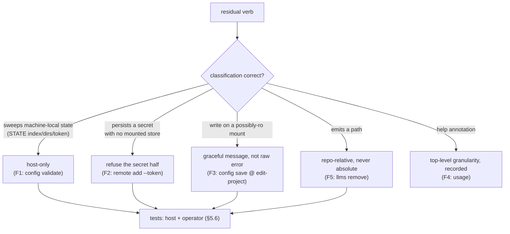

# CLI-surface environment-awareness review

> **Date** 2026-07-02 · **Branch** `feat/cli/surface-awareness-review` (from `develop`)
> **Scope** the residual `cco` verb surface (write + host-only) not audited by B2 ·
> **Nature** read-first audit against
> [design-cli-environment-awareness.md](../design/design-cli-environment-awareness.md)
> §2–§5 · **Handover** [cli-surface-awareness-review-handoff.md](../cli-surface-awareness-review-handoff.md)

This is a **decision/analysis record** (immutable history — see the
[documentation-lifecycle rule](../../../../.claude/rules/documentation-lifecycle.md)).
It captures the audit, the findings, and their resolutions. Fixes landed in the same
branch; commits are referenced inline.

## 1. Method

Every verb in the handover's ▶ rows was audited against the §5 checklist: context
classification (ADR-0036 D4 + the network carve-out), resolver-guard behaviour, secret
masking / host-path hygiene, output scoping (§4b), scope-aware help, and both-context
tests. The audit was grounded on the *actual* operator-mode mount set, which is the pivot
for the two MAJOR findings.

### Grounded baseline — what container-operator mode actually mounts

From `lib/cmd-start.sh:1024-1069`:

| Bucket | Mounted in operator mode | Mode |
|---|---|---|
| CONFIG (`~/.cco`) | referenced packs only at `read-project`; whole store at `read-global+` | rw only at `edit-global`/`edit-all` |
| DATA (`~/.local/share/cco`) | whole (tags/remotes-url/source registries) | follows edit level (rw at edit-global+) |
| STATE (`~/.local/state/cco`) | **the `index` FILE only** (logical→**host** path map) | ro |
| CACHE (`~/.cache/cco`) | `llms/` only | follows edit level |
| STATE token store, STATE `projects/`/`packs/`/`templates/`, memory, transcripts | **not mounted** | — |

Two consequences drive the findings: (a) the mounted STATE `index` carries **host absolute
paths** that never resolve inside the container; (b) the STATE token store is **absent**, so
any verb that writes a token in-container writes it nowhere durable.

## 2. Per-verb audit matrix

Legend: ✅ correct as-is · ⚠ finding (see §3) · **HO** host-only · **W** write · **R** read.

| Verb / sub-verb | Class | Verdict |
|---|---|---|
| `start` `stop` `build` `new` | HO | ✅ refusal fires, static hint, no host path |
| `resolve` `sync` `init` `join` `forget` `update` `clean` | HO | ✅ refused; hints host-path-free |
| `chrome start\|stop\|status` | HO | ✅ refused |
| `path set` | HO | ✅ refused; `path list` stays R (scoped, B2) |
| `project rename` | HO | ✅ refused |
| `project export\|import\|add` | HO | ✅ refused (add resolves coordinates → correctly HO) |
| `pack\|template\|llms install\|update\|import` | W (net carve-out) | ✅ run in-container; success output is **repo-relative** (no host-path leak); token-authed fetch degrades to a public clone / git-auth error (ADR-0036 D4); explicit `--token` still works |
| `pack\|template create\|remove` · `llms rename\|remove` | W | ✅ operate on mounted trees; relative output — **`llms remove` preview fixed** (⚠ **F5**) |
| `pack\|template internalize` | W | ✅ path hygiene OK |
| `*publish` · `*export` | HO | ✅ refused |
| `config save` | W | ⚠ **F3** — passes shim at edit-project but `~/.cco` is ro → misleading message |
| `config push\|pull` | HO | ✅ refused |
| `config validate` | R→**HO** | ⚠ **F1** — host-path leak + wholesale false orphans in-container → reclassified host-only |
| `tag add\|remove` | W | ✅ writes DATA at edit; raw fs error at edit-project (same by-design flat-write axis as F3) |
| `remote add` | W | ⚠ **F2** — `--token` writes an ephemeral secret + false "[token saved]" |
| `remote remove` | W | ✅ writes DATA at edit level |
| `remote set-token\|remove-token` | HO | ✅ refused |
| `usage()` annotation | — | ⚠ **F4** — top-level-only granularity (decision recorded; no drift) |

## 3. Findings

Severity rubric: BLOCKER / MAJOR / MINOR / NIT.

### F1 — MAJOR — `config validate` leaks host paths + reports wholesale false orphans in-container

- **Where** `lib/cmd-config.sh` (`_cv_detect` sweep; the leak is `_cv_add … "index path
  '$name' -> $path (missing)"` at line 217). Reachable via the shim `config) validate)
  return 0` at `bin/cco` — permitted at the **read-project default**.
- **Why** In operator mode only the STATE `index` file is mounted (ro), carrying host
  absolute paths; the STATE `projects/`/token store are absent and, at read-project, the
  CONFIG/pack set is narrowed. So `[[ -d "$path" ]]` fails for **every** index entry (host
  paths don't exist in the container) → each is flagged orphan **with its host path
  printed** (INV-4 leak); DATA tag/source detection also mis-fires under mount narrowing.
- **Failure scenario** An agent in a default `read-project` session runs `cco config
  validate` → sees dozens of "orphans" enumerating the user's host filesystem paths for
  every project on the machine. With an edit level + `--fix -y`, prunes could fire against
  synced DATA on false positives.
- **Contrast** `cco path list` (B2 baseline) consults the ADR-0043 layer and scopes to the
  current project; `config validate` consults it not at all. Scoping alone would not fix it
  (the current project's own index path is still a host path that "does not exist"
  in-container), so **host-only is the correct classification** — the sweep sanitizes
  machine-local internal state and is coherent only host-side.
- **Fix** `d78a46e` — host-only branch in the shim (`config validate` dies with a
  host-redirect hint at every level). Test `test_operator_blocks_config_validate_hostonly`.

### F2 — MAJOR — `remote add --token` writes an ephemeral secret and falsely reports it saved

- **Where** `lib/cmd-remote.sh` `_cmd_remote_add` → `_remote_token_set` + the `ok "…[token
  saved]"` message. Shim: `remote add) _op_write` (allowed at edit levels).
- **Why** The STATE token store is never mounted (`cmd-start.sh:1010-1011`), so
  `_remote_token_set` does `mkdir -p` + append to an **ephemeral container path** (lost on
  exit), then reports `[token saved]`. The url persists to synced DATA; the token silently
  does not — a confusing partial write that also drops a plaintext secret on the container FS.
- **Failure scenario** An agent (edit-global) runs `cco remote add r https://… --token
  ghp_xxx` → "Added … [token saved]". A later `cco pack install` from `r` fails auth; the
  agent believes the token is configured.
- **Fix** `d78a46e` — in operator mode, `remote add` refuses `--token` **before any write**
  with a host-redirect hint (mirrors host-only `remote set-token`); a plain `remote add`
  still registers the url at an edit level. Test `test_operator_remote_add_token_refused`.

### F3 — MINOR — `config save` fails unclearly on the read-only `~/.cco` mount at edit-project

- **Where** `lib/cmd-config.sh` `_config_save`.
- **Why** The shim's write axis is flat by design (§2 baseline — the mount gatekeeps), but
  `~/.cco` is rw only at edit-global/edit-all. At edit-project the ro mount makes `git add`
  fail silently → the false "already up to date — nothing to save" (or a raw `git init`
  error). Low risk (the agent cannot have pending `~/.cco` changes on a ro mount), but the
  message misleads.
- **Fix** `d78a46e` — a graceful pre-check: in operator mode below edit-global, die with
  "the ~/.cco store is read-only at cco_access=… — start with --cco-access edit-global".
  Messaging only, **not** a re-gate. Test
  `test_operator_config_save_edit_project_needs_edit_global`.
- **Note** `tag add` / `remote add` / `pack install` share the same by-design pattern at
  edit-project (raw fs error on a ro registry/store). Left as-is: the message fix above is
  the documented Focus-C case; extending it to every write verb risks scope creep. Recorded
  here as a candidate follow-up if the raw errors prove confusing in practice.

### F4 — NIT — `usage()` annotates only fully-host-only top-level verbs

- **Where** `bin/cco` (`_hostonly='init|join|…|chrome'`).
- **Finding** Host-only **sub-verbs** (`path set`, `config push|pull`, `remote
  set|remove-token`, `*publish|export`, `project rename|export|import|add`) are not flagged
  in help. **No behavioural drift**: the 12 fully-host-only top-level verbs match the shim
  exactly, and `path` is correctly excluded (its `path list` is a read verb).
- **Resolution** `d78a46e` — decision recorded in-code next to `_hostonly`: annotation is
  deliberately top-level (verbs whose *every* subcommand is host-only); host-only sub-verbs
  stay shim-enforced with a call-time hint, keeping the help list readable.

### F5 — NIT — `llms remove` preview prints an absolute path

- **Where** `lib/cmd-llms.sh` remove preview.
- **Finding** Printed `$LLMS_DIR/$name` (absolute) where pack/template use repo-relative
  (`packs/$name/`, `templates/$kind/$name/`). Benign container path in-container, host path
  on the host — inconsistent host-path hygiene.
- **Fix** `d78a46e` — preview now prints `llms/$name/`. Test
  `test_llms_remove_preview_uses_relative_path`.

## 4. Decision flow

## 5. What was confirmed correct (no action)

- **Network-write cluster** (`pack|template|llms install|update|import`): success output is
  repo-relative — no host-path leak. Token-authed fetches degrade gracefully in-container
  (unmounted token store → public clone or a git-auth error, per the ADR-0036 D4 carve-out);
  an explicit `--token` on the CLI still authenticates.
- **Host-only refusals**: static hints, no host paths in any message.
- **usage() ↔ shim**: the 12 fully-host-only top-level verbs match exactly — no drift.
- The B2-verified read surface (`list`, `<kind> show`, `pack|template|llms validate`,
  `path list`, `project coords`) was not re-opened (handover §7).

## 6. Systemic note

F1 and F2 share one root: a verb touching machine-local STATE that is **not fully mounted**
in-container (the host-path index; the absent token store). No shared helper is warranted —
the correct response is per-verb classification (F1 → host-only; F2 → refuse the token
half). The environment-awareness §5.1 checklist already captures this; the design doc §6 is
updated to mark the full-surface review done.

## 7. Definition of done

- [x] Findings report (this file).
- [x] Fixes for F1–F5 (commit `d78a46e`), each with host + operator tests (`312cea7`).
- [x] `usage()` ↔ shim decision recorded in-code (F4).
- [x] Suite green — 1132/1133; the single failure (`test_paths_symlink_safe_tool_root`) is
      a pre-existing environment-only permission issue unrelated to this change.
- [x] Design doc §6 marked done (living doc → truth).
- [x] Changelog entry for the user-observable in-container behaviour changes (F1/F2).
</content>
</invoke>
