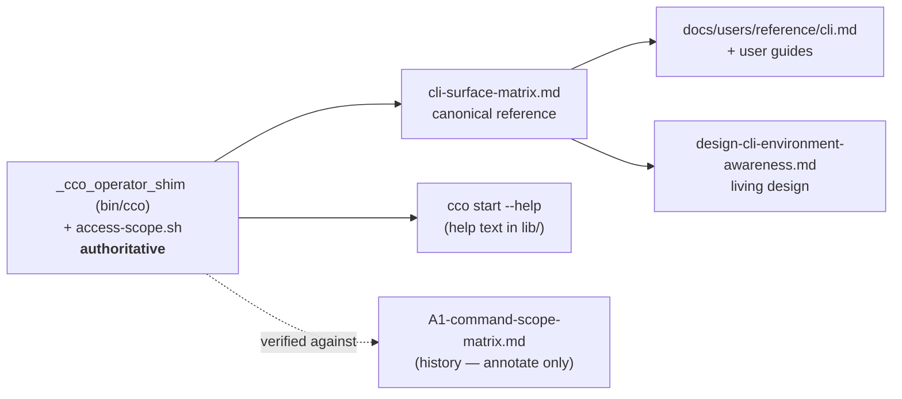

# CLI-surface documentation audit — release gate G2

> **Date** 2026-07-31 · **Branch** `fix/release/cycle-1.2` · **Gate**
> [G2](../../configuration/agent-cco-access/e2e-review/fix-design-v3.1/08-gates-to-release.md)
> (roadmap **step 3**), in-session, `review-docs`-class autonomy ·
> **Scope** every verb's declared **access level** and **host vs container** classification ·
> **Predecessor** [2026-07-02](2026-07-02-cli-surface-awareness-review.md) — which predates both
> surfaces this cycle moved.

This is a **decision/analysis record** (immutable history — see the
[documentation-lifecycle rule](../../../../.claude/rules/documentation-lifecycle.md)). It captures
the audit, its findings and their disposition. Fixes landed on the same branch and are referenced
inline.

## 1. Method — audit the code, then the chain that copies it

The authoritative classification is `_cco_operator_shim` (`bin/cco:315-509`), not any document. The
audit derived the verb table from it, then walked the chain of documents that restate it, in
dependency order — a wrong row upstream is inherited, so the canonical matrix is checked first.

**Claims were run, not read.** Every behavioural statement below was checked against the hermetic
harness (`tests/helpers.sh` operator lanes + a sandboxed host run), because this cycle's own history
shows code-reading alone producing confident, wrong classifications — see §3.

## 2. Findings corrected in place (objective drift)

| # | Surface | Drift | Fix |
|---|---|---|---|
| 1 | `cco start --help` (`lib/cmd-start.sh`) | config-editor described with the **pre-ADR-0044 broad default** (*"mounts your ~/.cco store + EVERY resolvable project's .cco/"*), `--all` as *"an explicit alias of the broad default"*, `--claude-access` defaulting to `repo` (pre-ADR-0049) | rewritten to min-privilege **by mode**; `--all` stated as the widener; `--claude-access` stated as **derived** | 
| 2 | `cli-surface-matrix.md` §2.3 | *"No project-tree writes exist as wrapped verbs"* — falsified by **ADR-0050 D7**; `repo rename` / `extra-mount rename` had **no row at all** | rows added; the note now explains *why* those two are verbs (they re-key the STATE index, which a file edit cannot) |
| 3 | `cli-surface-matrix.md` §2.2 | `list templates\|remotes` below read-global documented as *"empty+notice"* | it is a **refusal (exit 2)**; the count-only notice belongs to the **unified** `cco list` |
| 4 | `cli-surface-matrix.md` §2.2/§2.4 | `remote list` documented as a live read verb; `llms list` missing from the redirect row | documented as the removed alias it is, **including** its level-dependent message (§4) |
| 5 | `design-cli-environment-awareness.md` §5 | host-only credential set predates **D-V3-1** (`remote remove\|rename` missing) | added |
| 6 | `design-cli-environment-awareness.md` §4b | ADR-0047's boundary still marked *"design-intent; not yet implemented"* | marked shipped |
| 7 | `docs/users/reference/cli.md` | one line listed `cco remote add\|remove` among in-session write verbs — contradicting the same file 12 lines later; the `cco start` usage block omitted `--project/--repo/--all` | corrected + completed |
| 8 | `docs/users/…/guides/config-editor.md` | the **whole access model** was pre-ADR-0048 (`edit-global` in every mode, `~/.cco` rw in project mode, bespoke `claude_access=all`) — and it advertised `pack create`, `remote add`, `config save` as in-session verbs that **project mode refuses** | rewritten per mode; verbs split by the axis they write |

**Finding 8 is the one worth remembering.** The built-in's own agent-facing instructions
(`internal/config-editor/.claude/`) were **correct**; only the human-facing guide had drifted. A
sweep that checks the machine-read surface and stops there would have passed it.

## 3. The finding that changes a release artefact

**The release known-issue named an invocation `cco start` refuses.** G6 step 5's suggested wording,
FI-42's reachability table, the G1.3 note and the roadmap all named
`cco start config-editor --all --repo <name>` as the one route reaching the pack-rename fan-out.

That combination is **rejected before launch** — `cmd-start.sh:2687` refuses `--all` together with a
narrowing selector. The route that *does* reach the fan-out is the other spelling of the same
resolved mode: **`--cco-access edit-all --repo <name>`**, which the guard does not test
(`_resolve_config_editor_mode` maps both to `mode=all`; only `config_editor_all` is guarded).

| Probe | Result |
|---|---|
| `cco start config-editor --all --repo dummy-repo --dry-run` | **rc 1** — *"--all … cannot be combined with --project/--repo"* |
| `cco start config-editor --cco-access edit-all --repo dummy-repo --dry-run` | **rc 0** — launches, repo mounted |

Why the earlier claim survived: it was **half right**. The collector really does compose `--repo`
with mode=all unconditionally (`cmd-start.sh:1128-1135`) — the missing half was a guard 1500 lines
away. This is the third time in this cycle that a confident classification derived by reading was
refuted by running; it is also, precisely, the *"a message that reads correct and strands the
reader"* class the cycle exists to close — one document further out than usual, in the release
notes.

The bug and its cycle-2 deferral are unchanged. **The wording is release-facing, so the sentence is
flagged for maintainer sign-off** rather than treated as a settled edit.

## 4. Left as shipped, recorded not fixed

- **`remote list` answers two different things by level.** At `read-project` the shim's scope gate
  fires first (*"needs read-global scope"*, exit 2) — advising a user to widen access for a verb
  that **does not exist**; at `read-global+` the dispatcher's *"was removed — use `cco list
  remotes`"* (exit 1) is reached. The one-line fix (classify it with the other removed aliases) is
  **pinned by `tests/test_operator_shim.sh:320`** and would change a user-visible refusal, so it is
  documented and left for the maintainer.
- **The `--all` guard covers one of its mode's two spellings** (§3). Which spelling is canonical is
  part of the cycle-2 topology decision, so the asymmetry is annotated at the guard, not resolved.

## 5. What was verified correct and needed nothing

`tutorial.md` (read-only teacher at `read-all`) · `internal/config-editor/.claude/CLAUDE.md` +
`rules/config-safety.md` + `skills/setup-pack` (all mode-aware and correct) ·
`defaults/managed/.claude/rules/cco-config-interaction.md` (D-V3-1 present in both its lists) ·
`project-yaml.md`'s `access.cco` row · `cli.md`'s §3.2 access-model section, its `remote
remove|rename` host-only statements and its `cco remote list` removal note · the matrix's §2.1,
§3, §4 and §5 tables · every host-only row in §2.4.

## 6. Residual

None blocking. Two items for the maintainer: the release-note sentence (§3) and the `remote list`
message inconsistency (§4). Both are recorded where the work lives — the
[gates runbook](../../configuration/agent-cco-access/e2e-review/fix-design-v3.1/08-gates-to-release.md)
and [FI-45](../../roadmap-backlog.md) respectively.
