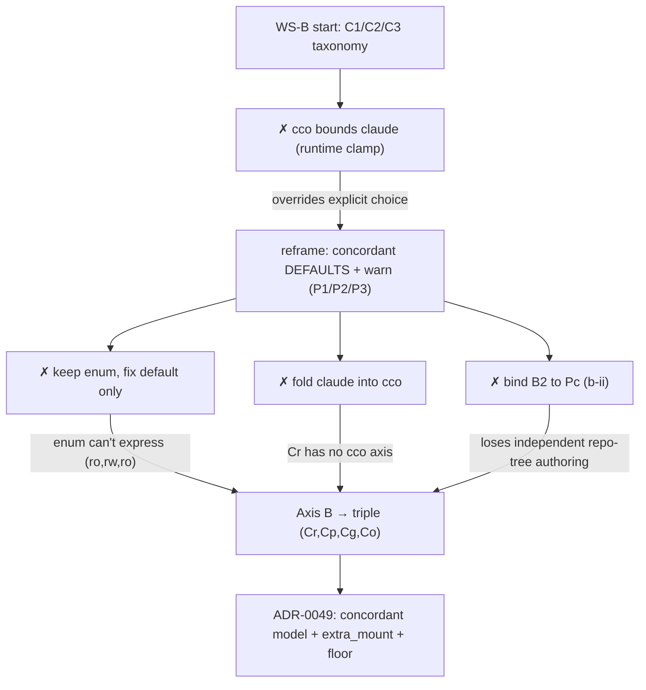

# WS-B analysis — `claude_access` × `cco_access` coupling (history)

**Class**: analysis / decision-history (immutable — see
`.claude/rules/documentation-lifecycle.md`). Records the code-grounded reasoning that
produced [ADR-0049](../../decisions/0049-claude-access-concordant-model.md). The **decision**
lives in the ADR; the **target behaviour** in [`../../design.md`](../../design.md). This
file preserves *why*, including the paths considered and rejected.

**Session**: WS-B dedicated analysis, 2026-07-13 (post hardening-v2 + WS-A) — the general
`claude_access` × `cco_access` coupling left open after WS-A shipped the config-editor
min-privilege refinement (ADR-0048).

---

## 1. The problem, code-grounded

Three `.claude` authoring trees are governed by `claude_access` (Axis B), but two live
physically **inside** `.cco` config (Axis A `cco_access`), decoupled only by Docker
child-mount-wins. Verified in `lib/cmd-start.sh`:

| Tree | Host source (`lib/cmd-start.sh`) | Container path | Mode driver |
|---|---|---|---|
| **B1** `<repo>/.claude` (repo-native) | repo mount | `/workspace/<repo>/.claude` | `_b1_ro` (:ro overlay, `~1400`) |
| **B2** `<repo>/.cco/claude` (`claude_src`, `:628`) | `/workspace/.claude` (`:1251`) | `_b2_mode` |
| **B3** `~/.cco/.claude` (`global_claude`, `:1001`) | `/home/claude/.claude` (`:1242-45`) | `_b3_auth_mode` |

B2/B3 are sub-trees of `.cco` (Pc / G) but the mount-gen carves them out as separate child
mounts governed by `claude_access` — the structural source of the incongruences.

### Incongruence taxonomy

| # | Combination | Effect | Original verdict |
|---|---|---|---|
| **C1** | normal `claude=repo` + `cco=read-project` | writes `<repo>/.cco/claude/` (CLAUDE.md/rules) not `project.yml`/secrets | FEATURE (P17) — but the **default** grants B2 *write* under a *read-only* cco intent |
| **C2** | `claude=all` + `G=none/ro` | writes global `~/.cco/.claude` not global packs | FOOTGUN — asymmetric global authoring (closed for config-editor by ADR-0048 §4) |
| **C3** | `cco=edit-*` + `claude=none` | rewires structure not rules | rare/coherent |

## 2. The reframing (maintainer dialogue)

The first proposal — *`cco_access` **bounds** `claude_access` (runtime clamp/min-of-two)* —
was **rejected**. The maintainer reframed to three principles (→ ADR-0049 P1/P2/P3):
concordant **defaults** (not a clamp), explicit discordance **allowed + warned**, and
minimum-privilege predictable defaults. Key shift: the knobs stay orthogonal and explicit;
only the *implicit default* becomes cco-aware. C2 is then acceptable **as an explicit,
warned choice**; the latent issue worth fixing is the **default** over-grant (C1: B2 rw
under `read-project`).

## 3. The non-expressibility proof (why the enum must become a triple)

The concordant Axis-B default for `edit-project` `(none,rw,none)` is *"author the project
tree, keep the global tree read-only"* = `(B1=ro, B2=rw, B3=ro)`. Enumerate `none|repo|all`:

| enum | (B1,B2,B3) |
|---|---|
| `none` | (ro, ro, ro) |
| `repo` | (rw, rw, ro) |
| `all`  | (rw, rw, rw) |

None equals `(ro, rw, ro)` — `repo` **bundles B1+B2**. ∴ the single 3-value enum **cannot
express** the concordant default; per-axis granularity is **forced by the model**, not a
style choice. The natural shape mirrors cco's `(G,Pc,Po)`: **Cg↔B3, Cp↔B2, Co↔other
projects**, plus **Cr↔B1** — the extra axis with *no cco counterpart*, which is exactly why
`claude_access` cannot fold into `cco_access`. The Axis-B lattice is **`{ro,rw}`** (no
`none`/invisible: Claude Code must *read* its config to run).

## 4. Verification findings (code-grounded gaps the ADR closes)

- **`project.yml` schema.** `access.cco` supports scalar **or** map (`_mg/_mc/_mo`,
  `cmd-start.sh:296-300`); `access.claude` supports **scalar only** (`_ACCESS_CLAUDE_VALUES`,
  `:175`). → the map form must be added (ADR-0049 §3/§9).
- **Global settings `~/.cco/access.yml`** exists (`_cco_access_file`, `paths.sh:103`) and is
  the level-3 default source, but reads **scalar only** for `claude` *and* `cco`
  (`cmd-start.sh:276-278`; the map read at `:296-300` is `project_yml`-gated). → extend to
  granular (ADR-0049 §9). Sibling user-global datum: `~/.cco/languages` (`paths.sh:85`).
- **Functional-write floor.** Only `settings.json` (global B3) is force-rw today (`:1241`,
  runtime prefs). ADR-0027 (`:123-132`) had a `settings.local.json` rw child overlay,
  **dropped** when B2 stayed rw. Claude Code writes "Always allow" to `.claude/settings.local.json`
  (code-claude llms `:4596`). → with B2/B1 default-ro, the overlay must be **re-introduced**
  (ADR-0049 §5).
- **Nested / extra_mount holes.** The B1/A1 `:ro` overlays iterate `_effective_repo_mounts`
  **root-only** (`cmd-start.sh:1400-1421`) and **skip extra_mounts** (mounted with their own
  `readonly:` only, `:1461-1465`). A `.claude` nested deeper (monorepo) or in a rw extra_mount
  escapes both knobs; Claude Code discovers nested `.claude` natively. → strict extra_mount
  default + `config_access_policy` + recursive detection (ADR-0049 §7).

## 5. P17 reversal + init-workspace

`Cp`/`Cr` default read-only reverses ADR-0027 §P17 (which kept B2 rw to preserve `/init`).
The managed `init-workspace` skill writes `/workspace/.claude/CLAUDE.md` (B2) → now needs an
explicit Axis-B grant. Decided: **no `/init` carve-out**; `init-workspace` **flagged for a
dedicated re-analysis** (deprecate / re-scope) — its framework-aware value is largely
covered by Level-A injection + the CLI and it is little used; residual value = repo
descriptions + project CLAUDE.md generation (ADR-0049 §6, design §7).

## 6. Decision journey (paths rejected)

See ADR-0049 for the settled decision and coverage matrix; [design.md](../../design.md)
§4bis for the living target.
