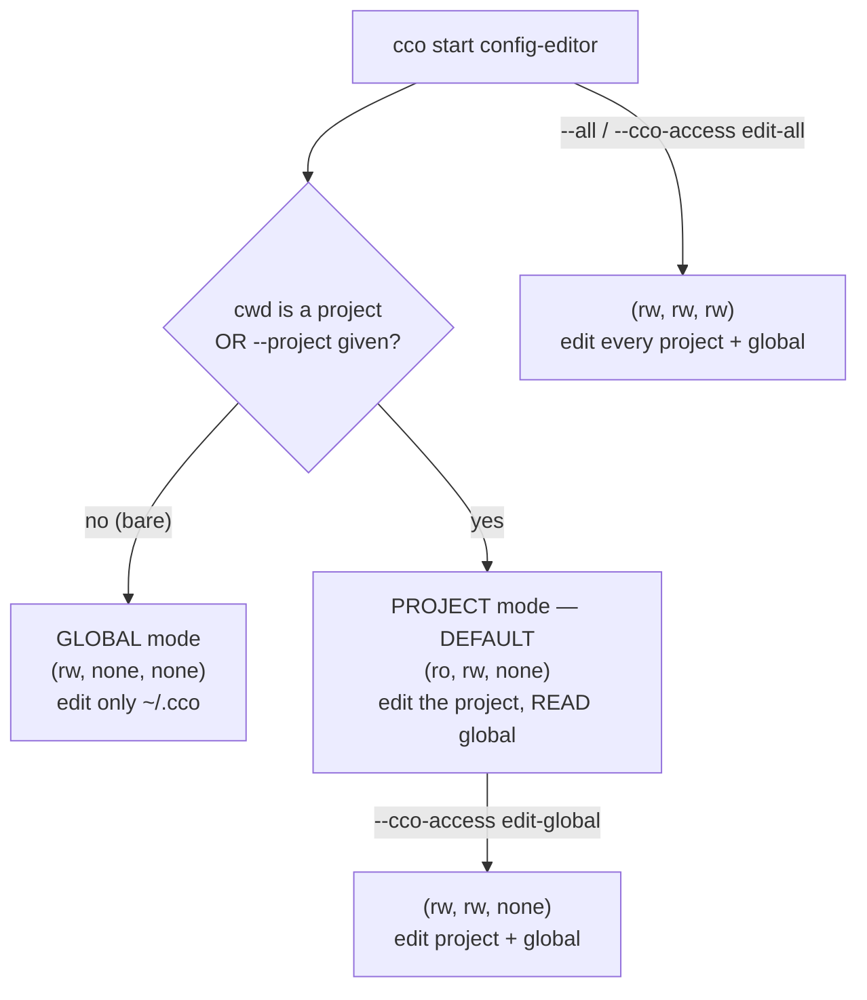
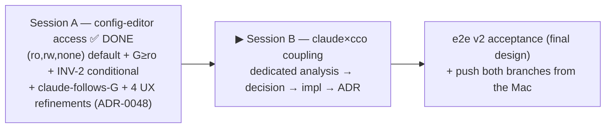

# Access-model refinements — handoff (post hardening-v2)

> ## ✅ WS-A + WS-B (analysis + design) DONE — implementation continues elsewhere (2026-07-13)
>
> **This handoff is consumed.** WS-A shipped + live (branch `feat/config-access/config-editor-access`);
> WS-B analysis + design are DONE and captured canonically in
> **[ADR-0049](../decisions/0049-claude-access-concordant-model.md)**, the
> **[WS-B analysis](analysis/ws-b-claude-cco-coupling.md)**, and **[design.md §4bis](../design.md)**.
> The WS-B direction below (cco-*bounds*-claude / b-i vs b-ii / knob-elimination) was **superseded**
> during the WS-B dialogue: the settled model is **concordant cco-derived defaults + a claude axis
> triple + discordance warn**, not a runtime clamp — see ADR-0049.
>
> **▶ To IMPLEMENT WS-B, start from [implementation-handoff.md](implementation-handoff.md).**
> The remainder of this file is retained as the WS-A decision record + WS-B's original framing
> (frozen-ADR back-references point here).

> **History (2026-07-11, for context):** these refinements emerged from the hardening-v2 Phase VI
> maintainer dialogue (the config-editor `edit-global` fix `67ad13f` + the DOC5 cutover). WS-A was
> then PROPOSED; it has since been validated, implemented, and shipped (see below). WS-B remains.
> Sequencing decision stands: refinements land **before** e2e v2, so e2e runs against the FINAL design.

**Related decisions**: [ADR-0036](../decisions/) (three-knob model `claude_access`/`cco_access`/
`show_host_paths`), [ADR-0044](../decisions/0044-internal-builtin-presets-and-config-editor-scope.md)
(config-editor min-privilege + tutorial read-all), [ADR-0046](../decisions/0046-unified-cco-access-model.md)
(the `(G,Pc,Po)` triple + invariants). **These refinements will be extracted into a new ADR (or an
amendment) + the living design docs once validated.**

---

## 0. Verified facts (established this session, code-grounded)

1. **Tutorial `read-all` is overridable downward.** `read-all` is the *preset default*; the user
   may narrow it with an explicit `--cco-access` (precedence CLI > preset; **no clamp** —
   `cmd-start.sh:247-262`; ADR-0044 §2 chose "available but discouraged", not hard-disable).
   **No change wanted** — confirmed correct as-is.
2. **config-editor project mode currently resolves to `edit-global` `(rw,rw,none)`** (`67ad13f`),
   and `~/.cco` (`cco-config`) is mounted `rw` unconditionally by its generated project.yml
   (`cmd-start.sh:132-134`). An explicit `--cco-access edit-project` yields `(none,rw,none)` — the
   footgun this refinement closes.
3. **`edit-project` mounts project-referenced globals READ-ONLY** (ADR-0046 §7: referenced packs
   ride with `Pc` for *read visibility only*; any global *write* needs `G=rw`; code
   `cmd-start.sh:1212-1230` mounts them `ro` under `G=none`). There is **no partial-write on the
   referenced subset** (that is the rejected Model α). This is why `edit-project` config-editor is
   read-limited (can't discover unreferenced globals to reference) — see WS-A.
4. **`claude_access` (Axis B) governs three `.claude` trees; `cco_access` (Axis A) governs the
   `.cco` config** — physically nested, decoupled by child-mount-wins (`cmd-start.sh:1123-1246`):

   | Tree | Container path | Governed by | Modes |
   |---|---|---|---|
   | **B1** repo-native `<repo>/.claude` | `/workspace/<repo>/.claude` | `claude_access` | none→ro, repo/all→rw |
   | **B2** project claude `<repo>/.cco/claude/` | `/workspace/.claude` | `claude_access` | none→ro, repo/all→rw |
   | **B3** global claude `~/.cco/.claude` | `/home/claude/.cco/.claude` | `claude_access` | none/repo→ro, **all→rw** |
   | **A1** project structural `<repo>/.cco` (project.yml, secrets, packs wiring) | overlay | `cco_access` **Pc** | Pc=rw→rw |
   | **A2** global store `~/.cco` (packs/templates/llms) | `/home/claude/.cco` | `cco_access` **G** | G=rw→rw |
   | `settings.json` (B3) | — | — | **always rw** (runtime prefs) |

   B2 and B3 live *inside* the `.cco` trees but are governed by `claude_access`, not `cco_access`
   → the source of the C2 incongruence (WS-B).

---

## WS-A — config-editor default access + read floor — ✅ DONE + SHIPPED (2026-07-13)

> **Implemented and live** (ADR-0048; commits `aab422f`→`00b8b2a` + the UX refinements below).
> The A.1 model was validated (A.2 items resolved), implemented per A.3, and shipped. Retained
> below as the decision record; **Session B does not re-open WS-A** — go to §WS-B.

### A.1 The decided model (SHIPPED — was PROPOSED)

config-editor serves **three real, recurring intents**, all of which must be launchable
**without typing an explicit granular triple**:

| Launch | Resolved `(G,Pc,Po)` | Intent | Preset? |
|---|---|---|---|
| `config-editor`, cwd-in-project or `--project <n>` | **`(ro, rw, none)`** *(DEFAULT, min-priv)* | edit **only** the project; **see** the whole global store (to reference) | none (asymmetric) — reached as the default |
| `config-editor --cco-access edit-global`, in a project | `(rw, rw, none)` | edit project **+** global store | `edit-global` sugar |
| `config-editor`, bare (no project resolved) | **`(rw, none, none)`** | edit **only** the global store | none (see A.2) |
| `config-editor --all` / `--cco-access edit-all` | `(rw, rw, rw)` | edit every project + global | `edit-all` sugar |

**Invariant (config-editor-specific): `G ≥ ro` always.** config-editor is an *authoring* tool — it
must always *see* the global store to reference/author against it (analogous to tutorial=read-all).
So `G=none` is never allowed for config-editor: an explicit `--cco-access edit-project` (or any
lower-G granular) is **clamped to `G=ro`** → `(ro,rw,none)`. Rationale mirrors ADR-0044 §2's
read-all reasoning + closes both C1-blindness and the C2 asymmetry at the config-editor level.

**Why `(ro,rw,none)` default over the shipped `edit-global` `(rw,rw,none)`:** "I opened config-editor
on project X" most often means *edit X*, reading the global only to reference it — least privilege.
Writing the global store is a *distinct* intent, reached with the known `edit-global` sugar. This
gives a clean, symmetric-sugar-friendly ladder without forcing explicit triples.

### A.2 Correctness / coherence items to VALIDATE FIRST

- **[A-V1] `(rw,none,none)` violates INV-2 as currently coded.** `_cco_promote_triple`
  (`access-scope.sh:132-143`) **dies** if `Pc < ro` while cco is enabled (*"INV-2 project floor"*).
  INV-2 (ADR-0046 §2) assumes a current project **always exists** — false in config-editor global
  mode (and arguably `cco new` / any no-project session). **Decision needed:** refine INV-2 to
  **"IF a current project is in scope, `Pc ≥ ro`"** (a conditional floor + a "no-current-project"
  session state where `Pc=none` is legitimate), **or** keep `Pc` inert at `ro`/`rw` for global mode
  (i.e. accept `(rw,ro,none)` / today's `(rw,rw,none)` as "Pc moot"). Recommended: the conditional
  floor — it makes `(rw,none,none)` the honest triple the maintainer wants and generalises to every
  project-less session. Verify it does not break the resolver, the mount-gen, or output-scoping
  (what does `_env_in_scope project <current>` do when there is no current project?).
- **[A-V2] Revises `67ad13f` + contradicts ADR-0044 §3.** ADR-0044 §3 states project-mode editable
  surface = "`~/.cco` + cwd project" (⇒ `~/.cco` writable). The new default `(ro,rw,none)` makes
  `~/.cco` **read-only** in project mode. Re-annotate ADR-0044 §3 (immutable history) and reconcile
  the forward-annotation added by `67ad13f`/`4335b2f`.
- **[A-V3] config-editor `claude_access=all` interaction.** config-editor sets `claude=all`
  unconditionally (`cmd-start.sh:226`) → B3 (`~/.cco/.claude`) `rw` even when the new default has
  `G=ro`. That reintroduces the global-authoring asymmetry (global `.claude` writable, global `.cco`
  read-only) at the config-editor level. **This couples WS-A to WS-B** — resolve together, or make
  config-editor's `claude_access` follow `G` (B3 rw only when `G=rw`).
- **[A-V4] Global mode "no project resolved".** Confirm the resolver's mode detection
  (`_resolve_config_editor_mode`) cleanly distinguishes "bare, no project" (→ global) from
  "cwd-in-project" (→ project) for the `(rw,none,none)` vs `(ro,rw,none)` split; and that `--all`
  still wins.

### A.3 Implementation sketch (AFTER validation)

- `_start_resolve_access` config-editor branch: `project → (ro,rw,none)`; `global → (rw,none,none)`;
  `all → edit-all`; clamp `G` to `≥ ro` for any explicit override.
- Enforce the `G ≥ ro` invariant for the config-editor preset (clamp, with a one-line notice).
- Revisit the config-editor `cco-config` mount so its rw/ro follows the resolved `G` (today
  unconditional rw, `cmd-start.sh:132-134`).
- Resolve [A-V1] (INV-2) and [A-V3] (claude=all) as decided.
- Tests: `test_access_resolution` (the new triples + clamp), `test_config_editor` (the three launch
  modes + edit-global override + explicit-edit-project→clamp), invariant tests for the conditional floor.
- **DOC5 follow-up cutover** (the shipped docs describe `edit-global` project mode today): update
  `cli.md`, repo `CLAUDE.md`, config-editor guide, CLI-surface matrix; re-annotate ADR-0044 §3.

---

## WS-B — `claude_access` × `cco_access` coupling (dedicated analysis session)

### B.1 The incongruence taxonomy (established)

| # | Combination | Effect | Verdict |
|---|---|---|---|
| **C1** | normal session: `claude=repo` + `cco=read-project` | writes `<repo>/.cco/claude/` (CLAUDE.md/rules) but **not** project.yml/secrets | **FEATURE** (P17: /init authoring open; structural protected) — coherent but non-obvious |
| **C2** | config-editor `claude=all` + `G=none/ro` | writes `~/.cco/.claude` (global rules) but **not** `~/.cco/packs` (global packs) | **FOOTGUN** — asymmetric global authoring; `claude=all` is unconditional in config-editor, decoupled from `G` |
| **C3** | `cco=edit-*` + `claude=none` | rewires packs/project.yml but not rules/agents | rare/coherent |

### B.2 Proposed direction (to analyse in depth)

**Targeted coupling, not blanket:** `cco_access` **bounds** `claude_access` for the `.claude` trees
that live **inside** `.cco` config (B2 `<repo>/.cco/claude/`, B3 `~/.cco/.claude`); only **B1**
(`<repo>/.claude`, the repo's own native tree, *not* framework config) stays fully decoupled.

- **Global (B3 vs G):** `cco_access` wins — if `cco_access` denies the global store (`G=none`) but
  `claude_access=all` would write `~/.cco/.claude` → **error** (or clamp B3 to ro + warn). Closes C2.
- **Project (B2 vs Pc):** decide between:
  - **(b-i) keep decoupled** — B2 rw under `claude=repo` even if `Pc=ro` (preserves C1/P17), or
  - **(b-ii) bound it too** — `<repo>/.cco/claude/` follows `Pc`; only `<repo>/.claude` (B1) stays
    decoupled. Cleaner mental model ("everything under `.cco` obeys `cco_access`; the repo's own
    `.claude` obeys `claude_access`") but **changes the C1/P17 default** for standard projects.
- **Warn** on explicit conflicting flags regardless (`--claude-access all --cco-access read-project`).

### B.3 Open questions for the dedicated session

- Is `claude_access` **always** bounded by `cco_access` (leaving only B1 decoupled)? Or keep
  project-level decoupling (b-i)? Weigh C1/P17 value vs the "everything-in-.cco obeys cco_access"
  simplicity. **Applies to ALL projects, standard + internal.**
- Should `claude_access` even remain a **separate knob**, or fold into `cco_access`? (Maintainer
  raised elimination; preliminary view: **keep it** — B1 the repo-native `.claude` is not a `.cco`
  tree and has no `(G,Pc,Po)` mapping; folding loses that dimension. Re-examine with the coupling
  decision.)
- Does the config-editor `claude=all` default (A-V3) survive, or become `claude=repo` + a G-coupled
  B3?

---

## Session plan

1. ~~**Validate** + **Session A** (config-editor)~~ — **✅ DONE + SHIPPED (2026-07-13)**: A.1 model
   validated (A.2 items resolved), implemented (A.3), `cco build` + restart done, refinements live.
   ADR-0048 + annot 0044/0046; changelog #38/#39; suite 1211/7.
2. **▶ Session B** (this one, separate context): the claude×cco coupling analysis + decision +
   implementation — see §WS-B. Validate the direction against the shipped `(G,Pc,Po)` model and
   `lib/cmd-start.sh` mount-gen before implementing.
3. **Extract**: fold the Session-B decisions into a **new ADR** (refining 0036/0044/0046) and the
   **living design docs** (`design.md`, user guides).
4. **e2e v2** acceptance against the final design + **push both branches from the Mac**.

## Decisions to confirm (carried from the maintainer dialogue, 2026-07-11)

- [x] Tutorial read-all overridable — **keep as-is** (verified).
- [x] config-editor default `(ro,rw,none)` (project) / `(rw,none,none)` (global) / `edit-global`
  override / `edit-all` via `--all` — **DONE + SHIPPED (ADR-0048, `6264bc9`).**
- [x] `G ≥ ro` invariant for config-editor (never blind) — **DONE + SHIPPED (`6264bc9`).**
- [x] INV-2 refined to a **conditional** project floor (Pc≥ro *iff* a current project is in scope) —
  **DONE + SHIPPED (`aab422f`); enables the honest `(rw,none,none)`.**
- [ ] claude×cco: **cco bounds claude for in-`.cco` trees (B2/B3); B1 decoupled**; error/warn on
  conflict — **▶ WS-B / Session B (still open)** — direction confirmed, dedicated analysis needed
  (esp. project-level b-i vs b-ii). A-V3 already closed C2 *for config-editor* (`6264bc9`); WS-B is
  the general treatment.

## WS-A refinements — session UX (shipped 2026-07-13, post-`cco build` dogfood)

Four small UX/semantic gaps surfaced while dogfooding the WS-A build in a live session
(config-editor + a normal session). They do **not** change the access MODEL (triples,
scoping, enforcement are untouched) — they make the model *legible* in-session. Shipped
on `feat/config-access/config-editor-access`; changelog #39.

- **R1 — `whoami` identity-first.** The old single `project:` line conflated two concepts
  in a config-editor session: `PROJECT_NAME` is the synthetic `config-editor` **envelope**,
  while the projects it EDITS are `CCO_CONFIG_TARGETS`. `whoami` now leads with a `Session`
  block — `identity` (envelope) / `editing target` (config-editor only) / `code repos`
  (mounted repo names vs `— (config only)`) — so an agent reads WHO it is, WHICH project(s)
  it edits, and whether repos are mounted for repo-aware authoring, before the access detail.
  The `code repos` signal is derived purely from the mounted `/workspace/project.yml` +
  a dir test (no index/store probe → the ADR-0047 boundary holds).
- **R2 — `whoami` deduplicated access.** The three rows `cco_access` / `access triple` /
  `granular form` were byte-identical for a custom (granular) triple. Collapsed to `level`
  (the PRESET name when the resolved triple is symmetric, else `custom (global=…,current=…,
  others=…)` carrying the granular form once) + `triple` (explicit `(G,Pc,Po)` + read/write
  scope). New `_cco_triple_preset` reverse-maps a triple → preset name. No row now duplicates
  another; the copy-pasteable `--cco-access` identity appears exactly once (preset name, or
  the `custom (…)` granular).
- **R3 — `cco list` surfaces internal built-ins.** `cco list` enumerates the index, so the
  reserved framework sessions (`config-editor`, `tutorial`) were never rows — not even
  config-editor inside its own session. They now appear as KIND `builtin`, probed by their
  fixed non-secret names via the ADR-0045 running registry (per-name status test, **no dir
  enumeration** → boundary-safe). RUNNING-only by default (clean list); all-with-status under
  `--include-internal` / `cco list builtin`. Framework sessions, so never scope-hidden, never
  tagged. Decision: inline KIND row (not an ad-hoc section) to keep the flat table aligned.
- **R4 — bare `cco project show` at the WORKDIR root.** In-container `/workspace` is a FLAT
  session mount (`/workspace/project.yml`, no repo-local `.cco`), so a bare `cco project show`
  from the root errored while the same command inside a mounted repo dir worked. It now falls
  back to the **session project** (`PROJECT_NAME` → flat manifest), unifying cwd-based
  introspection root-vs-repo-dir. Narrow trigger (`_project_show_session_fallback`): operator
  mode only, only AT the WORKDIR root (child-wins — a repo-local `.cco` is handled first),
  only with a flat session manifest; host is inert. For config-editor this resolves the
  synthetic `config-editor` envelope — the editing targets stay a distinct concept (R1's
  `whoami`), never conflated into cwd resolution. WORKDIR overridable via `CCO_WORKDIR` so the
  trigger is unit-testable without a live `/workspace`.

These are living-behavior refinements of the shipped surface; they refine ADR-0043 (CLI
environment/scope) and ADR-0045 (running registry) at the UX layer without altering their
decisions, so no new ADR — recorded here + in the CLI-surface matrix + user `cli.md`.
