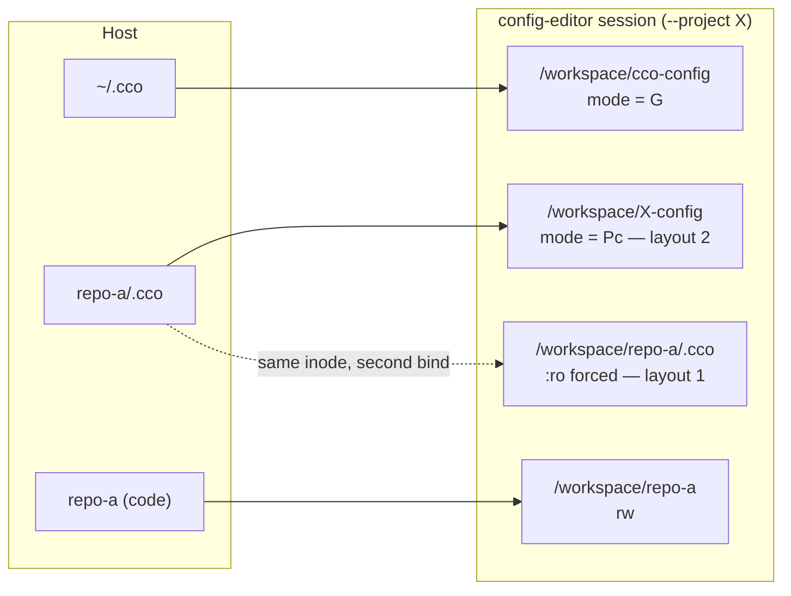
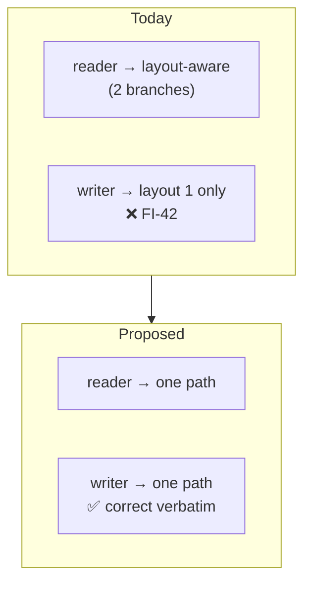

# Config mount topology & multi-repo config editing (roadmap step 2b)

> **Status**: Analysis, **direction approved by the maintainer 2026-07-31**; the *decision*
> (implementation scope, and whether any of it ships in this release) is **not taken here** —
> it is the gate this document feeds.
>
> **Subject**: how a project's committed config (`<repo>/.cco`) is mounted into a session, and
> **by which path a verb reaches it**. Triggered by two refusals observed in cycle-1.2's **G1**
> gate, which exposed a question larger than either refusal.
>
> **The proposal weighed here** (the maintainer's): mount every involved repo's `.cco` **at the
> path it would occupy in a real repo** — `/workspace/<repo>/.cco`, without the rest of the repo —
> so there is never a second path to the same file, with the project→repo mapping surfaced to the
> agent through `cco project show`.
>
> **Nature** (documentation-lifecycle): an **analysis** — history. It records what is true, what
> the proposal changes, and what must be decided. It decides nothing and updates no living doc.
>
> **Home — why here and not `environment/`.** The subject is literally bind-mount topology, which
> would argue for `environment/`. It is filed under `configuration/agent-cco-access/` because the
> question it answers is *which authoring path a verb may use at a given access level*: it is
> driven by the config-editor's min-privilege modes ([ADR-0044](../decisions/0044-internal-builtin-presets-and-config-editor-scope.md)
> §3 / [ADR-0048](../decisions/0048-config-editor-min-privilege-refinement.md)), it would supersede
> [RC-6 §3.7](../e2e-review/fix-design-v2/03-config-editor-repos.md) and
> [ADR-0046 §6](../decisions/0046-unified-cco-access-model.md), and its inputs are this domain's
> findings (FI-40/42/43). The mount table is the *mechanism*; access is the *subject*. Decided
> deliberately, per the step-2b brief.
>
> **Feeds / consumes**: [roadmap step 2b](../../../roadmap.md) ·
> [FI-42, FI-43, FI-40](../../../roadmap-backlog.md).

---

## 1. What is true today

### 1.1 Two layouts, carried explicitly in the code

A session reaches a project's committed config by one of two paths, and the codebase names them
**layout 1** and **layout 2** in the resolver's own header (`lib/cmd-resolve.sh:96-105`):

| | Layout 1 — **repo-keyed** | Layout 2 — **project-keyed** |
|---|---|---|
| Container path | `/workspace/<repo>/.cco/project.yml` (plus the always-mounted `/workspace/project.yml`) | `/workspace/<name>-config/project.yml` — *the mount **is** the `.cco` dir* |
| Produced by | a normal session (the repo body carries its own `.cco`) | the config-editor built-in, one mount **per project target** |
| Reached by | `_resolve_operator_current_yml` (`cmd-resolve.sh:108-124`) | `_resolve_operator_project_yml` step 2 (`cmd-resolve.sh:134-138`) |

Every **reader** is layout-aware: `_resolve_operator_project_yml` (`:128-146`) tries current-project
→ config-editor target → built-in preset; `_resolve_project_cco_dir` duplicates the same branch;
`_project_foreach`'s operator arm enumerates `PROJECT_NAME ∪ CCO_CONFIG_TARGETS` through it.

W3's **D-M11** probe established that, when a repo *is* mounted in a config-editor session, the two
paths are **the same inode** — a second bind of one directory. The only thing keeping the repo-path
copy unwritable is the `:ro` overlay forced at `cmd-start.sh:1898`.

### 1.2 The config-editor's generated mount table

`_setup_internal_config_editor` (`lib/cmd-start.sh:110-181`) writes a **synthetic manifest** and
publishes mount names through an in-process override — never through the persistent index (review
**H4**):

| Surface | Container path | Mode | Site |
|---|---|---|---|
| `~/.cco` (personal store) | `/workspace/cco-config` | follows **G** | `:166-169` (`_config_editor_mount_ro g`) |
| `$REPO_ROOT/docs` | `/workspace/cco-docs` | `:ro` | `:170-172` |
| target `t`'s `<repo>/.cco` | `/workspace/<t>-config` | follows **Pc**, role `project-config` | `:117`, `:176-179` |
| a target's member repo (project / `--repo` mode only) | `/workspace/<repo>` | **rw** | `:2166` |
| that repo's committed `.cco` | `/workspace/<repo>/.cco` | **`:ro` unconditionally** | `:1898` (RC-6 §3.7) |
| that repo's native `.claude` | `/workspace/<repo>/.claude` | `:ro` when `Cr=ro` | `:2200-2216` |

`--all` mounts **no** repos at all — repos are an explicit opt-in (ADR-0042 §8 / P18).
`CCO_CONFIG_TARGETS` (`:1785`) carries the target **names** and is **path-independent**.

### 1.3 The defect this explains — FI-42, code-grounded

`_rename_fanout_projectyml` (`lib/rename.sh:300-325`) has two loops:

- the **outer** loop receives its `project.yml` path from `_project_foreach`, i.e. **layout-aware**,
  and reads the *right* file: `_yaml_list_has_ref "$yml" packs "$old"` (`:305`);
- the **inner** loop writes a *different* file — `$path/.cco/project.yml` (`rename.sh:316,318`),
  where `$path` is `_project_iter_members`' probe, hardwired to `probe="$wd/$repo_name"`
  (`index.sh:1463`, comment: *"repos always mount at `<workdir>/<name>`"*) — **layout 1 only**.

So in `--all` the probe is empty → the member is classified `unresolved`; in `--project` the probe
hits but the file is `:ro` → every rewrite fails. **Both observed failures are caused by the path,
not by the cascade.** `INV-F` (*resolve through the operator-aware pair, not the host-only
resolver*) was applied to the readers; this writer escaped it.

---

## 2. The proposal, structurally

The proposal is, in one sentence, **"delete layout 2"**: keep only the repo-keyed path, so a verb
in a session reaches config by the same path a verb on the host does.

**This is its strongest argument, and it should be stated plainly**: under the proposal
`rename.sh`'s inner loop becomes correct **verbatim, unmodified**. FI-42 is fixed by *removing a
special case*, not by adding a compensating branch. Layout 2 disappears from
`cmd-resolve.sh:128-146` and `:165-190`, and `_project_iter_members`' probe becomes correct by
construction.

---

## 3. Axis 1 — impact on the current system

### 3.1 Containment result: the access model does not move

Worth stating because it bounds the blast radius. `CCO_CONFIG_TARGETS` remains the **semantic**
target set, so everything keyed on *names* is untouched: `_env_is_current_project`
(`access-scope.sh:480-486`), the **B5** tag gate, path-list scoping, and
`_store_unmounted_project_count` (`store.sh:185-194`). The `(G,Pc,Po)` resolution
(`_config_editor_default_cco`, `_config_editor_mount_ro`) is untouched. **The proposal is a change
of *addressing*, not of *authority*.**

### 3.2 What must change

- `lib/cmd-start.sh`: `_setup_internal_config_editor` (`:110-181` — override table, reserved-name
  set, emitted `extra_mounts`); `_ce_add_repo` / `_ce_collect_target_repos` / `_ce_filter_reserved`
  (`:886-985`); the collector (`:1072-1150`); `_op_config_masks` (`:1232-1238`); `_committed_ro`
  and the §3.7 force (`:1885-1898`); the repo mount loop (`:2163-2167`) and the three overlay loops
  over `_effective_repo_mounts` (`:2196-2216`, `:2232-2238`); **plus a new mountpoint-scaffold lane**
  (blocker (a)).
- Tests: `tests/test_config_editor.sh` (~25 assertions pin `:/workspace/<t>-config` literally),
  `test_access_resolution.sh`, `test_local_paths.sh`, `test_project_validate.sh`,
  `test_pack_install.sh`, `helpers.sh`, `test_invariants.sh`.
- **Agent-facing files that are behaviour, not prose** (they are mounted into the session and
  instruct the agent): `defaults/managed/.claude/rules/cco-config-interaction.md:65`,
  `internal/config-editor/.claude/CLAUDE.md:16,95`,
  `internal/config-editor/.claude/rules/config-safety.md:12-14`.

### 3.3 Four blockers — each a decision, none fatal

**(a) INV-MP — the mountpoint ancestor.** *"Without the rest of the repo"* makes `/workspace/<repo>`
an ancestor that is only **passed through**. ADR-0055 D4 states the physics: an ancestor absent from
both the image and any bind is materialised **root-owned** — harmless when something is mounted *on*
it, fatal when it is only passed *through* (mechanism **R-D**, third recurrence).
`test_invariant_mount_ancestry_owned` (`tests/test_invariants.sh:864-935`) **would fail**:
`/workspace` exempts only itself, `<repo>` is dynamic so the Dockerfile cannot pre-create it, it is
not itself a target, and it is not strictly inside another target. → the proposal **requires** a
framework-owned, claude-owned scaffold bound at `/workspace/<repo>` — ADR-0054 D2's own mechanism,
reused.

**(b) ADR-0051 homonyms — the container path stops being unique.** `<t>-config` is keyed by a
**project** name (globally unique in the index). `/workspace/<repo>` is keyed by a **repo** name,
which ADR-0051 D2 defines as a *per-project label*: same-name-in-different-projects **is not a
collision**. Under `--all` (N projects × M members) collisions are the **expected** case.
`_ce_add_repo`'s homonym arm (`cmd-start.sh:891-893`) resolves this today as *mount the first,
announce the second* (D-M9 / Q-7) — acceptable for **reference code**, unacceptable for **the config
being edited**: it would silently author project A's `api/.cco` while B's is announced-and-dropped,
precisely the drift ADR-0024 D2 exists to prevent. RC-6 §8 Q2 already flagged that the disambiguated
alternative (`/workspace/<project>--<repo>`) *"changes container paths, Level-A rendering and the
proxy pathmap"*. → **sound in project mode** (within one project the name→path map is 1:1, D2),
**unsound in `--all`** without a disambiguator — which would reintroduce the two-naming-schemes
problem the proposal sets out to delete.

**(c) Which of N copies is canonical.** ADR-0024 D1 replicates `project.yml` across a project's
config-bearing members; D5 classifies them `synced` / `divergent` / `foreign`. Today `<t>-config`
designates exactly one, chosen host-side by a documented rule (`_resolve_unit_dir_for_project`,
`cmd-resolve.sh:78-90` — first member on disk carrying a manifest). Mount all of them and
`_resolve_operator_current_yml`'s layout-1 scan (`for d in "$wd"/*/`, `:118`) returns whichever
**glob order** hits first. **No ADR states a canonical-copy rule for the in-session case; one is
owed.** Glob order is not an answer.

**(d) The absent-reported-as-present inversion (RC-5 / INV-B), landing on `cco project show`.** A
`.cco`-only stub makes `/workspace/<repo>` exist, and **three predicates key on exactly that dir
test** — all three would answer *"the repo is here"* with the code absent:

| Predicate | Site | Consumer |
|---|---|---|
| `_effective_repo_mounts` operator fallback | `local-paths.sh:206-209` | `cco project show`'s repo list + count |
| `_whoami_mounted_repos` | `cmd-whoami.sh:24-33` | `cco whoami`'s `code repos:` line |
| `_env_member_state` / `_cco_member_probe_path` | `access-scope.sh:931-937`, `paths.sh:377-386` | the availability vocabulary |

The irony is load-bearing: the inversion lands on **the very verb the proposal designates as the
project→repo mapping surface**. A **config-only availability state** (a fourth `_env_member_state`
arm, or a session-descriptor marker) is a **prerequisite**, and a new subject for INV-AVAIL.

---

## 4. Axis 2 — ADR conformance, with explicit supersessions

| Decision | Verdict |
|---|---|
| [**ADR-0024 D2**](../../decentralized-config/decisions/0024-repo-multi-project-and-config-home.md) (clobber-guard) | **Conforms unchanged** — the guard keys on the target's `project.yml` `name:`, which is path-independent. What changes is its **reach**: today only one copy is ever visible in-session, so the guard is never exercised there; with N copies mounted it becomes live in-session. That is what makes in-container sync conceivable at all. |
| [**ADR-0044 §3**](../decisions/0044-internal-builtin-presets-and-config-editor-scope.md) / [**ADR-0048 §1**](../decisions/0048-config-editor-min-privilege-refinement.md) | **Conform** — the min-privilege-by-mode table is stated in **surfaces**, not paths. ⚠ **ADR-0048 §5** (*the mount's readonly follows its axis, from a single source*) must be preserved: each per-repo `.cco` mount's mode must derive from `_config_editor_mount_ro pc` (or a role-aware refinement), **never** be hardcoded. Moving from a generated `extra_mounts` entry (which carries `readonly:`) to a hand-emitted `_compose_vol` is exactly how the RC-1 §3.5 / D-M11 **declared-vs-enforced** escalation was opened before. |
| [**RC-6 §3.7**](../e2e-review/fix-design-v2/03-config-editor-repos.md) | **Must be superseded explicitly.** Its *rule* (**one authoring path**) survives and improves — there is no second path left to forbid. Its *rationale sentence* (*"mounts its target's repos to READ code, not to author config"*) becomes **false by construction**. Its gain **"`Po=none` is honoured"** survives **only if** the per-member mode becomes **role-aware**: today the blanket `_committed_ro=":ro"` (`:1898`) is the single line keeping a `foreign` member (`_project_member_role`, `cmd-project-query.sh:76-104`) read-only. Replacing it takes **more** logic, not less. |
| [**ADR-0046 §6**](../decisions/0046-unified-cco-access-model.md) (multi-repo `Pc` span) | **Superseded in fact for the built-in.** §6's default is *"`Pc` covers only the cwd/hosting repo's `.cco`"*, with `access.cco.include_member_configs` (default `false`) as the widener; mounting every member's `.cco` rw hard-codes that flag's `true` span. ⚠ **The asymmetry this exposes**: a **normal** `edit-project` session **already** mounts every member repo with `.cco` rw (`_committed_ro=""`, `:1885-1887`) — the normal session is *already* where the proposal wants the built-in to be, and §6's default is currently **unenforced** for it (the deferred note at `:2218-2230`, cross-referenced from `:1897`). Simultaneously the strongest argument *for* the proposal and the reason §6 should be settled **in the same ADR** rather than re-deferred. |
| [**ADR-0054 D1**](../../decentralized-config/decisions/0054-framework-owned-mountpoints.md) / [**ADR-0055 D4**](../../../environment/decisions/0055-claude-runtime-state-and-mountpoint-ancestry.md) (INV-MP) | **Violated by the literal proposal**; conformable via a framework-owned scaffold mount — blocker (a). |
| [**ADR-0051 D1/D2**](../../../naming/decisions/0051-per-project-name-scoping.md) | **Violated in `--all`**; conformable in project mode — blocker (b). |
| **ADR-0042 §8 / P18** (*repos are an explicit opt-in*) | Needs a **written distinction**: is mounting `<repo>/.cco` *without the body* "mounting the repo"? The answer must be **no** for `--all` to stay coherent and **yes** for `whoami`'s `code repos:` line to stay honest — the same distinction, two required answers, which is why (d) is a prerequisite rather than a follow-up. |

---

## 5. Axis 3 — UX across the real launch modes

| Mode | Effect under the proposal |
|---|---|
| `config-editor` bare, **global** (outside any project) | No targets → no-op. Conforms. |
| `config-editor` bare **in a project cwd**, mono-repo | **Strictly better**: one path, matching the host layout the user already knows. It already works today via the same-inode second bind (D-M11 / W3) — the proposal removes the need to *know* that. |
| `--project X`, mono-repo | Same; **FI-42's rename works**. |
| `--project X`, **multi-repo** | The real subject. Gains the write path; needs (b) trivially (in-project names are 1:1), (c) by decision, and role-aware modes per the RC-6 row. |
| `--all` | **Weakest case.** Mounts no repos today *by design* (P18). The proposal necessarily produces N×M binds with **expected** homonym collisions, and re-opens the explicit-opt-in rule for the very mode whose point is *"no code"*. |
| `--repo <name>` | Today a **cross-project reference** mount, resolved outside any project scope (`_index_get_path_any`, `cmd-start.sh:1131`); its `.cco` would collide with a same-named target member. **FI-43 should be decided inside this ADR, not before it** — if the topology moves, `--repo`'s contract is restated anyway. Its options become: (i) body rw + config rw at the repo path; (ii) body `:ro` + config rw (**makes §3.7's rationale true**); (iii) no body at all (the literal proposal) — which forfeits both repo-aware authoring (ADR-0042 §8, the thing RC-6 was built to deliver) and the `git -C /workspace/<repo> diff` review loop `config-safety.md:67` teaches. |
| `--mount` | User mounts carry their own `:ro\|:rw` + `config_access_policy`, and `_nested_config_modes` (`:2280-2295`) already re-overlays a nested `.cco` bearing a `project.yml`. **A user can always create a third path** → the single-authoring-path claim must be worded as *"cco never **generates** a second path"*. |
| **tutorial** | Unaffected — `cco-config` `:ro` + `cco-docs` only. |
| **standard project session** | Unaffected unless §6 is settled generally (see the ADR-0046 row). |

---

## 6. Axis 4 — `cco sync` in-container: the topology removes 1 obstacle of 4

1. **Reachability — removed.** `_sync_copy` (`cmd-sync.sh:99-108`) is a pure file copy between two
   `.cco` dirs; with both mounted rw it becomes physically possible. **This is the genuine gain.**
2. **Locator — unchanged.** `cmd_sync` resolves both endpoints via `_index_get_path_any` /
   `_index_get_path` (`cmd-sync.sh:180-247`) and `_resolve_find_unit_dir` — **host** resolvers
   returning host paths (INV-F: never valid in-container). Sync needs the operator-aware pair: the
   **FI-42 shape again, one verb over.**
3. ⚠ **The divergence oracle is blind in a session — the blocking prerequisite.**
   `_sync_is_divergent` reads `$(_cco_state_dir)/sync-meta` (`sync-meta.sh:33-37`), and **INV-STATE**
   (`tests/test_invariants.sh:560-600`) allow-lists only `state/cco/{shared,running}` into the
   container. `sync-meta` is **not mounted** → the fingerprint read returns empty →
   `_sync_is_divergent` returns 1 → `_project_member_status` (`index.sh:1420-1428`) reports **every
   owned member `synced`**. **So the three config modes the step-2b brief names — divergent /
   synced / one-config-repo — are indistinguishable in-session today**, and `_sync_record` could not
   persist a fingerprint after an in-container copy. The blocker is STATE crossing, **not** mounts.
4. **Policy — decided and re-affirmed.** Host-only in the shim (`bin/cco:407`) on a decision made in
   ADR-0046 §6 and **explicitly re-affirmed** in A1 §4.4 (2026-07-08): *"`cco sync` stays host-only
   for every session, config-editor included"*, citing `include_member_configs` as the reason no
   carve-out was needed. Reopening it needs the same explicit supersession treatment as §3.7 and §6.

**Honest reading**: the topology makes in-container `cco sync` *possible*; items 2–4 make it a
separate, larger unit. They should **not** be bundled — but the ADR must state whether the topology
is being chosen **in order to** enable sync, because if it is, item 3 is the gating work.

---

## 7. Two things that should not be bundled here

- **FI-40 is topology-independent.** The census (`store.sh:185-194`) counts index projects absent
  from `PROJECT_NAME ∪ CCO_CONFIG_TARGETS` — a **name** set. No mount change affects it, and the
  proposal does not shrink the unmounted set at all. Its fix (names at read scope `all`, count
  otherwise, owned by `lib/access-scope.sh`) can ship on either side of this gate.
- **A stale-doc side-catch for roadmap step 3 (G2).** `cco start --help`
  (`cmd-start.sh:2586-2590`) still describes the pre-ADR-0044 world: *"By default it mounts your
  ~/.cco store + EVERY resolvable project's .cco/"*. Both halves have been false since ADR-0044 §3 /
  ADR-0048 §1 — config-editor's default is min-privilege by mode. Logged for the CLI-surface audit.

---

## 8. Open questions for the maintainer (the decision agenda)

1. **Scope by mode?** Project mode is sound; `--all` is not, without a disambiguator. Is the
   decision *"repo-keyed in project mode, project-keyed in `--all`"* (two layouts survive, split
   differently), or *"repo-keyed everywhere + `/workspace/<project>--<repo>`"* (RC-6 §8 Q2's
   rejected-for-cycle-1 option, which moves container paths, Level-A rendering and the proxy
   pathmap)?
2. **Which copy is canonical in-session** when N owned members are mounted, and what does a verb do
   when they are `divergent`?
3. **Repo body: rw, `:ro`, or absent?** (FI-43, now a sub-question of this decision.)
4. **Is `<repo>/.cco` without the body "mounting the repo"?** The answer must be *no* for
   `--all`/P18 and *yes* for `whoami`'s `code repos:` line — so a **config-only availability state**
   is needed either way. Where does it live: a fourth `_env_member_state` arm, or a
   session-descriptor marker?
5. **Is the topology being chosen in order to enable in-container `cco sync`?** If yes, the blocking
   prerequisite is the `sync-meta` STATE crossing (INV-STATE + the ADR-0047 boundary), not the mounts.
6. **Does ADR-0046 §6's multi-repo `Pc` span get settled for normal sessions in the same ADR?** The
   normal session already ships the `true` span unenforced (`cmd-start.sh:2218-2230`); superseding
   §6 for the built-in while leaving it deferred for normal sessions leaves the two modes
   disagreeing in the **opposite** direction from today.

---

## 9. Sites referenced

- `lib/cmd-start.sh` — `:110-181` synthetic manifest; `:886-985` repo collection / dedup / reserved
  filter (`:891-893` homonym arm); `:1044-1057` `_config_editor_mount_ro`; `:1072-1150` collector;
  `:1232-1238` `_op_config_masks`; `:1885-1898` `_committed_ro` + the RC-6 §3.7 force;
  `:2163-2238` repo mounts + the three overlay loops; `:2586-2590` the stale help text.
- `lib/cmd-resolve.sh` — `:78-90` `_resolve_unit_dir_for_project`; `:96-146` the two-layout operator
  resolvers; `:165-190` `_resolve_project_cco_dir`; `:205-225` `_project_foreach`'s operator arm.
- `lib/index.sh` — `:1398-1428` `_project_member_status`; `:1440-1475` `_project_iter_members` and
  its `$wd/$repo_name` probe (`:1463`).
- `lib/rename.sh` — `:300-325` the fan-out; the FI-42 write at `:316,318`.
- `lib/local-paths.sh` — `:170-215` `_effective_repo_mounts` and its operator dir-test fallback.
- `lib/access-scope.sh` — `:478-486` `_env_is_current_project`; `:923-940` `_env_member_state`.
- `lib/cmd-whoami.sh:24-33` · `lib/paths.sh:377-386` · `lib/store.sh:185-194` · `bin/cco:407`.
- `lib/cmd-sync.sh:99-108,180-247` · `lib/sync-meta.sh:33-37`.
- `tests/test_invariants.sh` — `:560-600` INV-STATE; `:838-935` INV-MP ancestry lint.
- `tests/test_config_editor.sh` — the pinned mount shape.
- Agent-facing (mounted → behaviour): `defaults/managed/.claude/rules/cco-config-interaction.md:65`,
  `internal/config-editor/.claude/CLAUDE.md:16,95`,
  `internal/config-editor/.claude/rules/config-safety.md:12-14`.
