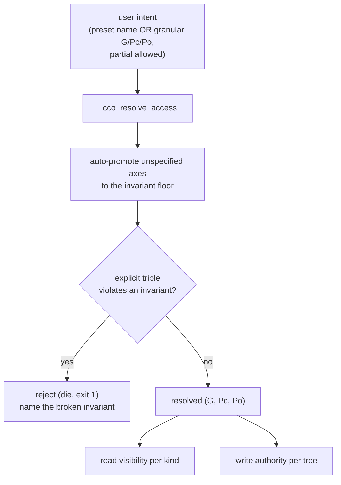

# ADR 0046 — Unified `(G, Pc, Po)` cco-access permission model

**Status**: Accepted (2026-07-08) — model ratified by the maintainer across a design
dialogue (D1 of the hardening-v2 plan). Implementation in a later phase (after D2
enforcement + D3 per-command analysis). **Supersedes the access *model* of**
[ADR-0036 §D2](../../decentralized-config/decisions/0036-session-config-capability-model.md)
(the opaque `cco_access` level enum) and **generalises the symmetric read/write scoping of**
[ADR-0043 §1](../../../cli/decisions/0043-unified-cli-environment-access-scope.md) and the
e2e-fix scope model ([`../e2e-review/fix-design/01-scope-model.md`](../e2e-review/fix-design/01-scope-model.md)).
ADR-0042's three-level A/B/C interaction model is **unchanged**; this ADR refines only
*how the B-level access level is modelled and resolved*.

**Deciders**: maintainer (ratified the three-axis model, the G-referenced-subset invariant,
the lattice + auto-promotion of defaults, keeping presets as a *symmetric ladder* with
`edit-global` redefined to include project write, the descriptive granular syntax, and the
multi-repo Pc default); implementer (analysis, code-grounding, coverage matrix, resolver
generalisation).

**Plan**: [`../hardening-v2/handoff.md`](../hardening-v2/handoff.md) §3 D1. **Living design**:
[`../design.md`](../design.md) §4 (rewritten to this truth).

---

## Context

`cco_access` today exposes **seven opaque levels** — `none · read-project · read-global ·
read-all · edit-project · edit-global · edit-all` — resolved into two derived scopes
(`_cco_level_read_scope` / `_cco_level_write_scope` → `none|project|global|all`,
`lib/access-scope.sh:75-93`), the single source consumed by host mount-generation
(`lib/cmd-start.sh:892-894`), the operator shim (`bin/cco:261-262`), and the output-scoping
layer (`lib/access-scope.sh:110`). A maintainer design review (2026-07-08) found the level
enum **structurally incomplete**:

- **Unreachable asymmetric intents.** The levels encode a fixed ladder; two legitimate
  combinations have **no expression**: (6) *edit every project's config but not the global
  store*, and (7) *edit the global store while consulting all projects read-only*. `edit-all`
  is the only cross-project write level and it forces `G=rw` **and** `Po=rw` together.
- **A modelling collision.** Mapping the levels onto per-resource-area access showed
  `read-project` and `read-global` differ **only** in how much of the global store `~/.cco`
  is visible (the project's referenced subset vs the whole store) — a distinction the opaque
  ladder buries inside "scope" rather than naming.
- **Single-source goal.** The maintainer asked for **one** access model that mount-generation,
  the shim, and output-scoping all read, with future permissions added in one place (INV-E,
  ADR-0043) — not a level enum that each site re-interprets.

The signals to resolve this already exist in-container (`PROJECT_NAME`, `CCO_CCO_ACCESS`,
`CCO_PROJECT_PACKS`/`CCO_PROJECT_LLMS`) and the write side is *already* per-tree; this ADR
lifts that per-tree structure into the **model** itself.

> **Not in this ADR**: *how* the model is physically enforced (the confidentiality bypass
> S1/S1b is D2's — [`../hardening-v2/handoff.md`](../hardening-v2/handoff.md) §3 D2), and the
> per-verb resource-area classification (D3/A1). This ADR fixes the **model**; D2 fixes
> **enforcement**; D3 fixes **per-command gating**.

## Decision

### 1. Three resource axes, each a `none < ro < rw` lattice

Replace the opaque level as the *base* model with **three explicit resource axes**:

| Axis | Resource area | Container tree |
|---|---|---|
| **G** | global store `~/.cco` — packs, templates, llms, remotes, `.claude`, **plus the DATA registries** (tags, remotes) | `/home/claude/.cco`, `/home/claude/.local/share/cco` |
| **Pc** | the **current** project's config | `/workspace/.cco` ← cwd `<repo>/.cco` |
| **Po** | **other** projects' config | (mounted only in cross-project sessions, e.g. config-editor) |

Each axis takes a value on the lattice **`none < ro < rw`** (`rw` implies `ro`; `ro` implies
`none`). A session's access is the triple **`(G, Pc, Po)`**.

**The referenced-subset invariant (why G has only three values).** `~/.cco` is **always
mounted** whenever cco is enabled (`permission > none`), but **filtered by scope**. The global
resources **referenced by the current project** (its packs/llms, transitively) are **always
in-scope** with `Pc` — excluding them would make the project's own configuration incomplete.
Therefore the **G axis governs only the *rest* of the store** — the resources the current
project does *not* reference:

- `G = none` → only the project-referenced subset is visible (it rides with `Pc`). This is
  `read-project`.
- `G = ro` → the **whole** store is readable, unreferenced resources included. This is
  `read-global`.
- `G = rw` → the whole store is writable.

This disambiguates `read-project` from `read-global` **without a fourth G value and without a
separate "scope" ordinal** — the referenced subset is a design constant, not a knob.

### 2. Invariants + auto-promotion of defaults

- **INV-1 (lattice).** Per axis `none < ro < rw`; `rw ⇒ ro`. A wider grant satisfies every
  narrower requirement.
- **INV-2 (project floor).** `permission > none ⇒ Pc ≥ ro` — the current project is always at
  least readable, its referenced global resources included (§1).
  > **Forward annotation ([ADR-0048](0048-config-editor-min-privilege-refinement.md), 2026-07-11):**
  > INV-2 is refined to a **conditional** floor — `Pc ≥ ro` holds only when the session has a
  > **current project in scope**. A *project-less* session (config-editor global mode; future
  > `cco new`) may honestly carry `Pc = none`. Implemented fail-closed via an explicit
  > `has_current_project` signal (default `true`), so a normal `cco start <project>` keeps the
  > strict floor and still rejects an explicit `current=none`. INV-3/INV-4 unchanged.
- **INV-3 (see-self-first).** `Po ≠ none ⇒ Pc ≠ none`.
- **INV-4 (no-more-than-self).** `Po ≤ Pc` — never broader access to *other* projects than to
  your own.
- **G is independent** of `Pc`/`Po` (no mutual min/max) — this is precisely what makes the
  asymmetric cases (§4, 6 & 7) expressible.

**Auto-promotion.** A user declares the *maximal intent* on the axes they care about; any
**unspecified** axis is promoted to the **minimum value that satisfies all invariants** given
the specified ones. Examples:
- `others=rw` (Pc unspecified) → `Pc=rw` (INV-4) → `(none, rw, rw)`.
- `others=ro` (Pc unspecified) → `Pc=ro` (INV-4 + INV-2 floor) → `(none, ro, ro)`.
- nothing specified, `permission > none` → `Pc=ro`, `G=none`, `Po=none` = `read-project`.

An **explicit** triple that violates an invariant (e.g. `current=ro,others=rw`) is a user error
and is **rejected at validation** with a message naming the broken invariant — promotion fills
*gaps*, it does not silently override an explicit contradiction.



### 3. Presets survive as a **symmetric ladder** (sugar over triples)

The six named levels are **kept** — not for user back-compat (the feature is unreleased) but
because they are ergonomic names for the common intents. They are redefined as **pure sugar
for the *symmetric* triples** — the monotone ladder where a read/edit tier applies uniformly
across a nested scope. **Every asymmetric intent is granular-only**, so a name is never
ambiguous: each preset publishes its exact triple.

| Preset | `(G, Pc, Po)` | Meaning |
|---|---|---|
| `none` | — | cco disabled in-session (refused wholesale, R6) |
| `read-project` | `(none, ro, none)` | read own project + its referenced globals |
| `read-global` | `(ro, ro, none)` | + read the whole global store |
| `read-all` | `(ro, ro, ro)` | + read other projects |
| `edit-project` | `(none, rw, none)` | write own project config |
| `edit-global` | `(rw, **rw**, none)` | write the global store **and** the current project |
| `edit-all` | `(rw, rw, rw)` | write everything |

The presets form a clean chain: `read-project ⊂ read-global ⊂ read-all`,
`edit-project ⊂ edit-global ⊂ edit-all`, and `read-* ⊂ edit-*` at each scope.

> **`edit-global` is redefined.** Previously `edit-global = (rw, ro, none)` — global write,
> project **read-only** (least-privilege; e2e-fix `01-scope-model.md`). It now **includes
> project write** (`Pc=rw`), making the ladder symmetric ("editing a wider scope includes the
> narrower"). The old least-privilege intent — *curate the global store without risking
> `project.yml`* — remains fully expressible, now **granular-only** as `(rw, ro, none)`. This
> is a deliberate semantic change, safe because unreleased; it moves asymmetry out of the
> named levels entirely.

### 4. Coverage matrix — the seven canonical intents (cases 6 & 7 newly reachable)

| # | Intent | `(G, Pc, Po)` | Reachable via |
|---|---|---|---|
| 1 | Read own project (+ referenced globals) — **default** | `(none, ro, none)` | `read-project` |
| 2 | Read own project + browse the whole global store | `(ro, ro, none)` | `read-global` |
| 3 | Read everything, other projects included | `(ro, ro, ro)` | `read-all` |
| 4 | Edit own project config only | `(none, rw, none)` | `edit-project` |
| 5 | Edit the global store **and** own project | `(rw, rw, none)` | `edit-global` |
| **6** | **Edit all project configs, NOT the global store** | `(ro, rw, rw)` † | **granular only** |
| **7** | **Edit the global store, consult all projects read-only** | `(rw, ro, ro)` | **granular only** |
| (8) | Edit everything | `(rw, rw, rw)` | `edit-all` |

Plus the off-ladder least-privilege point surfaced by §3:

| Intent | `(G, Pc, Po)` | Reachable via |
|---|---|---|
| Curate global store only, project read-only | `(rw, ro, none)` | granular only |

† **Case 6's G is the user's choice** (independent axis): `(none, rw, rw)` for the strict form
(don't even read unreferenced globals) or `(ro, rw, rw)` to consult the store while editing all
projects. The table shows the more useful `ro` form.

### 5. Granular syntax + resolution

`access.cco` (and `--cco-access`) accept **either** a **scalar** (a preset name — the ladder)
**or** a **map** (the granular triple). The map keys are **descriptive** (`global` / `current`
/ `others`) so the committed `project.yml` is self-documenting:

```yaml
# project.yml — granular form (any subset of keys; the rest auto-promote, §2)
access:
  cco:
    global: ro       # G  — none | ro | rw
    current: rw      # Pc — ro | rw   (never none while cco is enabled, INV-2)
    others: rw       # Po — none | ro | rw
```

```
# CLI — comma-separated, order-free, partial allowed
cco start <project> --cco-access global=ro,current=rw,others=rw
cco start <project> --cco-access current=rw,others=rw          # G,→ auto none; Pc,Po → rw
cco start <project> --cco-access edit-project                  # scalar preset still works
```

**Resolution precedence is unchanged** (ADR-0036 D3): CLI flag `--cco-access` > `project.yml`
`access.cco` > `~/.cco/access.yml` > preset default. A scalar and a map are two spellings of
the **same** field, so they never mix within one source; precedence still selects one source's
value, which is then resolved to a triple (scalar → ladder lookup, map → auto-promotion §2).
The bare `read` alias → `read-all` (ADR-0042) is kept.

### 6. Multi-repo Pc

`Pc` is, by default, the **cwd (hosting) repo's** `<repo>/.cco` — the authoritative project
config (Case-C / `--from` already switches which repo hosts it). A project may have **member
repos** each carrying a **divergent** (non-synced) `<repo>/.cco`.

- **Default**: `Pc` covers **only the cwd repo's** `<repo>/.cco`.
- **Opt-in flag** `access.cco.include_member_configs` (`project.yml`, default `false`): when
  `true`, `Pc` covers **all member repos'** `<repo>/.cco` (divergent copies included) at the
  resolved `Pc` level. It widens *which trees* `Pc` spans, not the `Pc` access value.
- **`cco sync` of divergent members stays host-only in-session.** The agent does not run
  `cco sync` from the wrapped CLI (consistent with `resolve`/`sync` being host-only, ADR-0036
  D4); reconciling divergent member configs is a host action.

> **Open, deferred to D3/A1.** Whether an in-container **config-editor** session should be
> allowed to run `cco sync` of divergent members (arguably legit for a config-focused session)
> is recorded as a **future evolution** — re-evaluated in the per-command info×scope analysis
> (D3), which classifies every verb by the resource area it touches. Until then: host-only.
>
> **⤷ Resolved in A1/D3 (2026-07-08)** — [`../e2e-review/analysis/A1-command-scope-matrix.md`](../e2e-review/analysis/A1-command-scope-matrix.md)
> §4.4: **`cco sync` stays host-only for every session, config-editor included.** It is in the
> resolve/sync host-only family (depends on host path resolution + clone-from-url); the
> `include_member_configs` flag above already covers the in-container read/edit need, so no
> `cco sync` carve-out is required. §6's "until then: host-only" becomes the settled answer.

### 7. The resolver — `(G, Pc, Po)` as the single source

`_cco_resolve_access` (generalising the current `_cco_level_read_scope` /
`_cco_level_write_scope`, `lib/access-scope.sh:75-93`) resolves the intent to the triple; the
three consumers (INV-E) derive their behaviour **directly from the axes**, replacing the
`{project, global, all}` ordinal:

**Read visibility** (output-scoping `_env_in_scope`, mount narrowing):

| Kind | Visible when |
|---|---|
| current project | `Pc ≥ ro` (always, INV-2) |
| referenced pack / llms | `Pc ≥ ro` (rides with the project) |
| unreferenced pack / llms | `G ≥ ro` |
| template / remote | `G ≥ ro` |
| other project | `Po ≥ ro` |

**Write authority** (shim `_op_write`, `_committed_ro`/`_op_rw` mount upgrades):

| Target tree | Requires |
|---|---|
| current project `<repo>/.cco` | `Pc = rw` |
| other project `<repo>/.cco` | `Po = rw` |
| global store `~/.cco` (packs/templates/llms, `config save`) | `G = rw` |
| DATA registry (`tag`, `remote add/remove`) | `G = rw` |

The current `{project,global,all}` scope is **subsumed**: `read-global` vs `read-all` is just
`Po`; `read-project` vs `read-global` is just `G`; the per-tree write gate is already what the
shim does (`bin/cco:269-287`) — now keyed off the axis instead of a hard-coded level list.
`_cco_write_scope_satisfies` (`lib/access-scope.sh:98-103`) collapses into the per-axis lattice
comparison.

### 8. Migration & back-compat

- **Additive schema.** `access.cco` gains the **map form**; the scalar preset form is
  unchanged. New optional `access.cco.include_member_configs`. New `--cco-access global=…,…`
  parse path beside the enum. No project-file migration needed for the syntax (code handles a
  missing map with the preset default).
- **`edit-global` semantic change** (§3) is a code change (`_cco_level_write_scope` → the axis
  resolver + mount-gen), not a data migration — unreleased, feature-branch only.
- **Enum retained as ladder aliases**; `read` → `read-all` alias kept.
- **changelog** entry at implementation time ("requires `cco build`").

## Alternatives considered

- **Keep the opaque seven-level enum (status quo).** Rejected: cannot express cases 6 & 7,
  and buries the G (referenced-vs-whole) and Po (other-projects) distinctions inside a single
  "scope" ordinal that each consumer re-interprets — the incoherence the review surfaced.
- **Model α — a four-value G axis (`none | ro-ref | ro-full | rw`).** Make the referenced
  subset an explicit *read flavour* of G. Rejected: breaks the "three values per axis"
  intent and re-introduces the very ordinal the triple removes; the §1 invariant (referenced
  subset always rides with `Pc`) achieves the same distinction with a clean 3-value G.
- **Fork A — eliminate named presets entirely (pure granular).** One model, maximal
  uniformity. Rejected: throws away the ergonomics of the common intents (the default and
  `edit-*` become verbose triples) for no gain, since presets-as-sugar already give a single
  underlying model (each name publishes its triple).
- **Keep `edit-global` asymmetric (`rw, ro, none`) as a named level.** Rejected: it is an
  *asymmetric* intent wearing a symmetric-looking name — exactly the ambiguity ("does
  edit-global write the project?") the maintainer flagged. Pushing all asymmetry to the
  granular form makes every named preset unambiguous.
- **Allow in-container `cco sync` of divergent members now.** Deferred, not rejected — see §6;
  re-evaluated in D3/A1 rather than decided cold here. **⤷ A1/D3 (2026-07-08) resolved it
  host-only**, config-editor included (§6 annotation).

## Consequences

- **Positive**: every legitimate access intent is now expressible (cases 6 & 7 reachable);
  one model — `(G, Pc, Po)` — drives mount-gen, shim, and output-scoping, with a new
  permission added in one place (INV-E preserved and strengthened); named presets stay
  ergonomic yet provably unambiguous (each publishes its triple); the read-project/read-global
  distinction is named (`G`) rather than buried; the per-tree write model the shim already
  uses becomes the *stated* model.
- **Negative / trade-offs**: two spellings of `access.cco` (scalar + map) to document and
  parse (mitigated: mutually exclusive per source, one resolver); `edit-global`'s meaning
  changes (mitigated: unreleased; the old intent is a documented granular point); auto-promotion
  must be specified precisely so a partial triple is predictable (done — §2).
- **Enforcement gap remains (D2).** This model is a **presentation + gating** contract; the
  confidentiality bypass (an agent `cat`-ing the whole mounted index/DATA regardless of the
  triple, S1/S1b) is **not** closed here. D2 decides the enforcement architecture (broker vs
  scoped mounts) that makes the triple *physically* binding. Until then, `(G, Pc, Po)` binds
  the CLI surface, not the raw filesystem.
- **Feeds**: D2 (the triple is what the enforcement layer enforces), D3/A1 (per-verb gating
  keys off the per-tree write table §7; the `cco sync` question §6), the CLI-surface matrix
  (§1/§5 model recap), and `design.md` §4.
- **Supersession**: supersedes ADR-0036 §D2's level enum as the base model (the enum lives on
  as ladder sugar); generalises ADR-0043 §1's `{project,global,all}` taxonomy to the three
  axes (ADR-0043 §1 forward-annotated; its INV-D is D2's to revise, not this ADR's). ADR-0042
  (A/B/C) and ADR-0044 (built-in presets) are unaffected — their preset *names* now denote the
  §3 triples.
