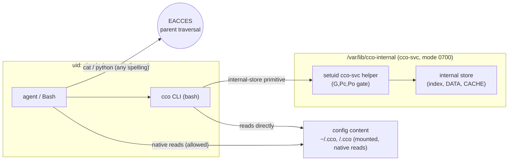

# ADR 0047 — Config-access enforcement: internal-store privilege boundary

**Status**: Accepted (2026-07-08) — enforcement architecture ratified by the maintainer across
a design dialogue (D2 of the hardening-v2 plan), on the strength of an empirical test of macOS
Docker Desktop bind-mount ownership behaviour (see [§8](#8-empirical-basis)). Implementation in a
later phase (after D3 per-command analysis + doc reconciliation). **Closes the confidentiality
bypass S1/S1b** left open by [ADR-0046](0046-unified-cco-access-model.md) §Consequences and
**revises [ADR-0043](../../../cli/decisions/0043-unified-cli-environment-access-scope.md) §2
INV-D** (index-complete / presentation-only).

**Deciders**: maintainer (ratified the privilege-boundary model, the "only `cco` touches the
internal store" invariant, no-daemon, the dedicated `cco-svc` uid + setuid helper); implementer
(security trace, empirical verification, code-grounding).

**Plan**: [`../hardening-v2/handoff.md`](../hardening-v2/handoff.md) §3 D2 + [`D2-handoff.md`](../hardening-v2/D2-handoff.md).
**Living design**: [`../design.md`](../design.md) §5 (INV-5), [`design-docker.md`](../../../environment/design/design-docker.md) §1.2.3.

---

## Context

[ADR-0046](0046-unified-cco-access-model.md) fixed the **model** — a session's access is the
triple `(G, Pc, Po)`, from which read-visibility per kind and write-authority per tree derive
(§7). It explicitly left the **enforcement** open: *"the triple binds the CLI surface, not the
raw filesystem — D2 makes it physically binding."* This ADR decides that enforcement.

### The bug to close (security trace, 2026-07-08)

**Integrity is safe, confidentiality is bypassable.** Write-gating is enforced physically by
`:ro`/`:rw` bind-mount **flags** (a VFS-level property, not DAC) — a read-level agent that
bypasses the shim hits a read-only filesystem (`lib/cmd-start.sh:1051-1052`, `:1166-1172`,
`:1091`). No write-bypass. But **reads leak across scope**:

- **S1 — cross-scope info leak (confirmed, by design).** The STATE **index** (whole, `:ro`,
  every level — `lib/cmd-start.sh:1090-1091`) and the whole **DATA** bucket (tags,
  de-tokenized remotes/URLs, per-resource `source` provenance — `:1088`) mount **outside** the
  `read-project` narrowing branch (`:1054-1072` narrows only CONFIG). `lib/access-scope.sh`
  filters command **output** (`_env_in_scope`), never the raw files. At `read-project` the agent
  `cat`s `~/.local/state/cco/index` and enumerates **every other project's name, host path,
  membership, tags, remote URLs**. *Verified live in-session* (a `read-project` agent read
  another project's `"/Users/.../…"` host path straight from the index).
- **S1b — `show_host_paths` bypass (confirmed).** Host paths in the mounted index are readable
  even at `show_host_paths=off`. Same root.

- **Root cause — no privilege boundary.** The agent and the wrapped `cco` run as the **same UID
  `claude`** with no filesystem confinement (`--dangerously-skip-permissions`; `WORKDIR
  /workspace` is only cwd). Any file `cco` can read, the agent can `cat`. A "mount-outside /
  CLI-only" guarantee needs a **process/privilege boundary that does not exist today**. The
  `cco-docker-proxy` (`config/entrypoint.sh:47-85` — lock the real socket `chmod 600` *first*,
  run a root proxy, expose only a filtered socket) is the **precedent**.

### The reframing that scopes the fix

The buckets are **not** one problem. Two categories with opposite requirements:

| Category | Trees | Who reads them | Requirement |
|---|---|---|---|
| **Config content** | CONFIG `~/.cco` (packs/templates/`.claude`), `<repo>/.cco` | **Claude Code natively**, as files | **Must stay mounted** — a boundary that hides them breaks native reads. Already scoped by directory mounts + `read-project` narrowing + secret-masking; write-gated by `:ro`/`:rw`. **Not the leak.** |
| **Internal store** | STATE index, DATA (tags/remotes/`source`), CACHE (internal) — the XDG hidden buckets | **only `cco`**, never natively | Carries cross-project + host-path confidential data. **This is the entire leak surface.** |

So enforcement must confine **only the internal store**, and the target architecture the
maintainer ratified is:

```
[human/agent] ──▶ [cco CLI] ──▶ [internal XDG store]        (allowed)
[human/agent] ──────────────▶ [internal XDG store]          (forbidden — no direct access)
```

`cco` is the **sole** access path to the internal store, for **every** actor (human on host or
agent in container). On the host this is a convention (the user won't hand-edit dot-dirs by
accident); in the container it must be a **hardened boundary** against involuntary or adversarial
agent reads/writes.

### Why Claude Code's own controls cannot provide this boundary

Investigated against the official docs (`code-claude/llms-full.txt`):

- The host "**scope = cwd**" is **not** a filesystem sandbox. The default sandbox read behaviour
  is *"read access to the entire computer"* (sandboxing doc); cwd bounds **writes** and
  **prompts**, not reads.
- The container runs **`--dangerously-skip-permissions`** (`config/entrypoint.sh:273,279`) =
  `bypassPermissions`, whose prompt replacement is *"Nothing"* — by design ("Docker IS the
  sandbox").
- The two real mechanisms act on the shell **uniformly** and cannot grant `cco` **more** reach
  than the shell that spawns it:
  - **`permissions.deny` (Read/Bash)** — survives bypass, catches path-referencing Bash, but is
    a command-pattern **guardrail**: a shell reads via child processes / obfuscation
    (`python -c open()`, `dd`, symlink). Not airtight.
  - **Sandbox `denyRead`** (bubblewrap, OS-level) — a real boundary, but applies to *"all Bash
    commands **and their child processes**"*: it would block `cco` too (a child of the same
    shell). No per-binary exemption.

To give `cco` strictly more filesystem reach than the invoking shell requires a **privilege
transition the shell cannot perform** — a distinct uid. Claude Code controls can only add a
**second, defense-in-depth** layer.

## Decision

### 1. Confine only the internal store; config content stays mounted

The privilege boundary wraps the **internal XDG store** (STATE index, DATA registries, CACHE
internals). Config-content trees keep their current mount model (native reads; `read-project`
narrowing; secret-masking; `:ro`/`:rw` write-gating). This preserves the ADR-0046 §1
referenced-subset invariant unchanged.

### 2. Mechanism: parent-directory privilege gating + a setuid `cco-svc` boundary — no daemon

The confinement rests on an empirically verified property of the container filesystem
([§8](#8-empirical-basis)): on macOS Docker Desktop, `chown`/`chmod` on the **content** of a
bind mount are **not** DAC-enforced (the `fakeowner` VirtioFS layer fakes ownership to the caller
— this is why the index is `cat`-able today). **But** the kernel evaluates path **traversal** on
each component using the **real inode of the parent**, and a parent on the container's **real
overlay FS** (not `fakeowner`) enforces DAC normally.

Therefore:

- The internal XDG store is **bind-mounted (rw)** at leaf paths, but **nested under a dedicated
  privileged root on the real container FS** — `/var/lib/cco-internal/` (or equivalent), owned by
  a new **`cco-svc`** uid, **mode 0700** — that the `claude` user (the agent's shell) **cannot
  traverse** → `EACCES` at the OS level, cross-platform and airtight. `$HOME/.local/{state,share,cache}/cco`
  become **symlinks** into that root (Test **B** validates exactly the symlink-into-privileged-parent path).
- `cco` reaches the store by **elevating to `cco-svc`** via a **minimal setuid helper** baked
  into the image (mirroring the single-binary boundary of `cco-docker-proxy`; `cco-svc`, not
  root — least privilege). The `(G, Pc, Po)` gate (ADR-0046 §7 read-visibility + write-authority
  tables) is enforced **inside that privileged helper** — the single physical enforcement point.
- **One `cco` implementation, no duplication, no daemon, no RPC protocol.** `cco` keeps its bash
  logic; only its internal-store **primitives** re-exec through the setuid helper. The earlier
  "verb-level vs record-level broker protocol" question is **moot** (it applied only to a socket
  daemon, which is not chosen).



### 3. Two hard requirements

- **R1 — the privileged root lives outside `claude`'s owned tree.** A parent under `$HOME`
  (which `claude` owns) could be renamed/replaced by the agent. The root is a dedicated path the
  `claude` user neither owns nor can traverse; the `$HOME` XDG paths reach it via symlink only.
- **R2 — the helper derives scope from a trusted source, never from agent input.** The resolved
  `(G, Pc, Po)` is written **host-side** by `cco start` into a `cco-svc`/root-owned session
  descriptor mounted `:ro` (mirroring `/etc/cco/policy.json` of the proxy). The setuid helper
  reads **that**, not `argv`/env — the agent can invoke the helper directly but cannot forge a
  wider scope. Absent a valid descriptor the helper refuses (fail-closed).

> **Implementation note (2026-07-09, Phase II — `feat/config-access/e2e-review`).** The
> "elevate to cco-svc" step landed as **euid-only elevation**, not a full uid/gid/groups drop.
> A setuid-to-**non-root** helper (the `cco-svc`, *not root* choice above) has no
> `CAP_SETGID`/`CAP_SETUID`, so `setgid`/`setuid`/`setgroups` `EPERM`; and file access is
> checked against the **effective** uid, so the setuid bit's `euid=cco-svc` already suffices to
> traverse the 0700 root. The helper therefore execs the baked cco via **`bash -p`** (privileged
> mode) — load-bearing, because a plain bash started with `euid≠ruid` resets `euid` back to
> `ruid` (claude), which would silently defeat the boundary. The real uid stays `claude`
> (harmless: the store is 0700 owner-only, and a `euid≠ruid` process is non-dumpable, so claude
> cannot ptrace it). This keeps the decision above ("setuid `cco-svc`, not root") intact. A
> setuid-**root** helper doing a complete `setgroups`+`setgid`+`setuid` drop
> (`euid==ruid==cco-svc`, no residual claude groups incl. `docker`) is the cleaner-running-state
> alternative if the "not root" constraint is later relaxed. **Cross-platform caveat**: writes
> to the bind-mounted internal registries by `cco-svc` rely on macOS Docker Desktop `fakeowner`
> (verified); the Linux DAC write-path (chowning bind-mount content would mutate *host*
> ownership) is an open follow-up.

### 4. Consequences for the existing layers

- **Output-scoping retrocedes to a second layer.** `lib/access-scope.sh` (`_env_in_scope` +
  the count-only notice) stays for **ergonomics + defense-in-depth**, no longer the primary
  confidentiality control. The `read-project` **mount-narrowing of the internal registries** is
  no longer needed as protection (the parent boundary supersedes it) — the registries may mount
  **whole, rw**, since only `cco-svc` traverses and the helper gates every op. This **simplifies**
  the `cmd-start.sh` mount block.
- **Integrity model unchanged in principle.** Write-gating for **config content** keeps using
  `:ro`/`:rw` mount flags (VFS-level, `fakeowner`-independent). For the **internal store**, the
  helper's `(G,Pc,Po)` gate *is* the write-authority enforcement (per ADR-0046 §7), so those
  mounts need not carry a `:ro` flag.
- **Optional belt-and-suspenders.** Managed `permissions.deny` on the internal paths and/or
  `sandbox.enabled` `denyRead` may be layered as a second boundary; not required and never the
  primary control.
- **Resolves a pre-existing collision.** `design-docker.md` §1.2.2 works around the internal
  registries sharing the `.local/state` / `.cache` bases with `claude`'s own files (native
  installer sibling `EACCES`). Relocating the registries under `/var/lib/cco-internal` **removes
  that collision** — the shared bases no longer hold cco mounts.

### 5. INV-D revision (ADR-0043 §2)

INV-D previously read: *"the STATE index stays complete; scoping is a presentation filter, never
a mutation."* Revised to: **the internal store stays complete internally, but is confined by a
privilege boundary (parent-gating + setuid `cco-svc`); output-scoping is a defense-in-depth
presentation layer, no longer the confidentiality control.** ADR-0043 is history → **forward-
annotated**, not rewritten (documentation-lifecycle).

## Alternatives considered

- **Option A — scoped read-only projection of the registries** (host generates a filtered,
  host-path-stripped snapshot, mounts it `:ro`). Rejected: closes reads but **regresses edit-level
  in-container registry writes** that work today and that ADR-0046 §7 blesses (a partial `:ro`
  snapshot cannot persist a write); **splits enforcement** into two mechanisms (reads via
  projection, writes elsewhere) — violates INV-E single-source; write-back merge on shared
  single-file registries (index / `tags.yml` / remotes) is fragile.
- **Option B — cco config broker (socket daemon)**, the original ratified *target*: registries
  unmounted host-side, in-container `cco` a thin RPC client to a root broker. **Not chosen**:
  parent-gating achieves the same confidentiality **and** the same single `(G,Pc,Po)` gate for
  read+write with far less surface — no new long-running component, no protocol, no shim rewrite,
  no command duplication (the maintainer's explicit anti-duplication goal). **Kept as the
  fallback** if parent-gating ever proves infeasible on a target platform (e.g. a runtime where
  the privileged root cannot be established on a real FS).
- **Rely on Claude Code `permissions.deny` / sandbox** as the boundary. Rejected — uniform on
  the shell, cannot exempt `cco`; bypassed by `--dangerously-skip-permissions`; retained only as
  an optional second layer (see Context).
- **`chown`/`chmod` the bind-mounted registries directly.** Rejected — **empirically fails** on
  macOS Docker Desktop (`fakeowner`): Test **A** shows a mode-0700, uid-9999 file read by a
  different uid.

## Consequences

- **Positive**: S1/S1b physically closed for every actor; **one** enforcement point for the
  `(G,Pc,Po)` model (read + write), keyed off ADR-0046 §7; no daemon / protocol / duplication;
  mounts may stay whole+rw (the boundary, not the mount mode, confines); the `cmd-start.sh` mount
  block simplifies (registry output-narrowing demoted); the §1.2.2 sibling-`EACCES` collision
  disappears; `show_host_paths=off` becomes trustworthy.
- **Negative / trade-offs**: a **new `cco-svc` uid + setuid helper** = new privileged surface —
  must be minimal and hardened (R2 trusted-scope source, fail-closed, no `argv`/env trust);
  `cco`'s internal-store access path gains an elevation hop (a re-exec); the privileged root +
  symlink layout is new container plumbing (Dockerfile + entrypoint + `cmd-start.sh` +
  `lib/paths.sh` XDG resolver). Cross-platform confinement holds on Linux and macOS Docker
  Desktop (verified); it requires the privileged root on the **real** container FS, never a bind
  mount.
- **Feeds**: **D3/A1** — per-command info×scope gating runs **inside the same helper boundary**,
  keyed off ADR-0046 §7; the tag/remote per-target gating (B5) and the hint invariant (B6) land
  there. **✅ A1/D3 done (2026-07-08)** — [`../e2e-review/analysis/A1-command-scope-matrix.md`](../e2e-review/analysis/A1-command-scope-matrix.md)
  (internal-store writes — tag by tagged resource, remote → `G` — ride this helper). **Implementation phase** — Dockerfile (`cco-svc`, setuid helper, `/var/lib/cco-internal`),
  entrypoint (create/own the root, symlink XDG, lock down first — mirroring the proxy's
  chmod-first), `cmd-start.sh` (session descriptor + simplified internal mounts), `lib/paths.sh`
  (resolver → privileged root), migrations + changelog + `cco build`.
- **Supersession**: revises ADR-0043 §2 INV-D (forward-annotated). ADR-0046's model is
  unchanged — this ADR makes its §7 tables *physically binding*. ADR-0042 (A/B/C) unaffected.

## 8. Empirical basis

Test run **on the target platform** (this session's container is on the maintainer's macOS Docker
Desktop; a root sibling container bind-mounted a real host path `/Users/.../…`, mount type
`fakeowner`). A non-owner uid (9001) attempted reads:

| Test | Setup | Result | Reading |
|---|---|---|---|
| **A** | bind mount (host, `fakeowner`) + `chown 9999` + `chmod 700` | uid 9001 **reads** the mode-0600 file | DAC on bind-mount **content** is NOT enforced (`fakeowner`) — chown/chmod cannot confine |
| **C** | dir on the **real overlay FS** + `chown 9999` + `chmod 700` | uid 9001 → **Permission denied** | real container-FS DAC **works** |
| **B** | `fakeowner` content nested under a real-FS parent (mode 0700, uid 9999) | uid 9001 → **Permission denied** traversing the parent | **parent traversal** is checked on the real parent inode → confines even `fakeowner` children |

`fakeowner` fakes **ownership** (a DAC-content property) but the kernel's **path-traversal**
check runs on each component's **real** inode. A real-FS mode-0700 parent therefore confines a
`fakeowner` child — the mechanism this ADR builds on. Independent host-side reproduction:

```bash
mkdir -p /tmp/ccoperm && docker run --rm -v /tmp/ccoperm:/hostmnt alpine:latest sh -c '
adduser -D -u 9001 agent; mkdir -p /hostmnt/A; echo s>/hostmnt/A/d
chown -R 9999 /hostmnt/A; chmod 700 /hostmnt/A; chmod 600 /hostmnt/A/d
echo -n "[A bind] "; su -s /bin/sh agent -c "cat /hostmnt/A/d" 2>&1 || true
mkdir -p /opt/p; echo s>/opt/p/d; chown -R 9999 /opt/p; chmod 700 /opt/p; chmod 600 /opt/p/d
echo -n "[C realFS] "; su -s /bin/sh agent -c "cat /opt/p/d" 2>&1 || true'
# expected: [A bind] s   (confinement fails)  ·  [C realFS] Permission denied (holds)
```
