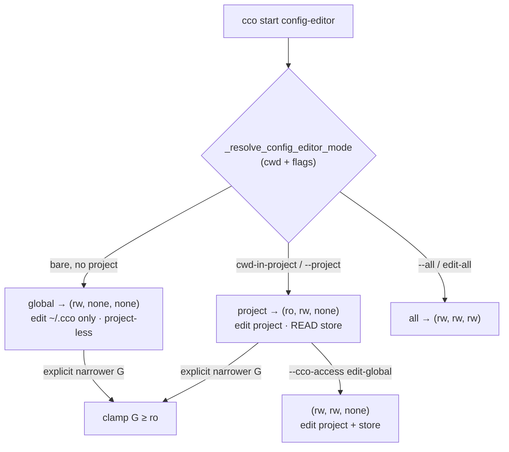

# ADR 0048 — config-editor minimum-privilege refinement + conditional project floor

**Status**: Accepted (2026-07-11) — ratified by the maintainer in the post-hardening-v2
access-refinements dialogue (WS-A). **Refines** the config-editor preset of
[ADR-0044 §3](0044-internal-builtin-presets-and-config-editor-scope.md) (project mode is
now `(ro,rw,none)`, not `edit-global`) and the **INV-2 project floor** of
[ADR-0046 §2](0046-unified-cco-access-model.md) (made *conditional* on a current
project). ADR-0044 and ADR-0046 stay Accepted/frozen; each is forward-annotated to point
here. The `(G,Pc,Po)` model, the preset ladder, and the enforcement boundary
([ADR-0047](0047-config-access-enforcement.md)) are otherwise unchanged.

**Deciders**: maintainer (confirmed the by-mode min-privilege split, the honest
project-less triple, the generalized conditional floor, the `G≥ro` authoring floor, and
folding the claude×G coupling for config-editor into this refinement); implementer
(validation against the resolver/mount-gen/output-scoping, the coverage trace, the
fail-closed implementation).

**Living design**: [`../design.md`](../design.md) §4.3/§8 (rewritten to this truth).

---

## Context

Under the shipped hardening-v2 model (ADR-0044 reconciled with the ADR-0046 ladder,
commit `67ad13f`), **every** `cco start config-editor` mode resolved to **`edit-global`
`(rw,rw,none)`** — project mode included. Opening config-editor "on project X" therefore
made the personal store `~/.cco` **writable** even when the intent was only to edit X's
`<repo>/.cco`. That is the one place the model still defaulted a session to more write
authority than its stated purpose:

- **Least-privilege gap.** "Edit project X" and "edit the global store" are *distinct*
  intents. The shipped default fused them: to touch X you also got `~/.cco` rw. The rest
  of the model is minimum-by-default (normal sessions `read-project`; the write side
  gated per tree); config-editor project mode was the exception.
- **A dishonest global triple.** Bare config-editor (no project) *also* resolved to
  `edit-global` `(rw,rw,none)` — but with no project resolved, `Pc=rw` is **inert** (no
  `<repo>/.cco` is mounted for a nonexistent current project). The triple claimed a
  project-write authority that had no referent.
- **INV-2 blocks the honest triple.** The honest bare-config-editor triple is
  `(rw,none,none)` — "edit only the store." But ADR-0046 §2's **INV-2 project floor**
  (`permission > none ⇒ Pc ≥ ro`) *rejects* `Pc = none`, because it assumes a current
  project **always exists**. That assumption is false for a project-less session
  (config-editor global mode; and, in future, `cco new`).
- **An asymmetry appears once G drops.** config-editor sets `claude_access = all`
  unconditionally, so the global `.cco/.claude` authoring tree (B3) is writable. Under the
  shipped `edit-global` (G=rw) that is symmetric (global rules *and* global packs
  writable). The moment project mode's G becomes `ro` (this ADR), B3 would stay writable
  while global packs go read-only — the **C2 asymmetry** (writable global rules, read-only
  global packs).

## Decision

### 1. config-editor default is minimum-privilege **by mode**

`cco start config-editor` resolves its default `(G,Pc,Po)` from the mode already computed
by `_resolve_config_editor_mode` (cwd + flags), not to a single `edit-global` for all:

| Mode | Trigger | Default `(G,Pc,Po)` | Intent |
|---|---|---|---|
| **project** | cwd-in-project, or `--project <name>` (repeatable) | **`(ro, rw, none)`** | edit the target project(s); **read** the whole store to reference it |
| **global** | bare, outside any project | **`(rw, none, none)`** | edit the personal store **only**; project-less (Pc has no referent) |
| **all** | `--all` / `--cco-access edit-all` | `(rw, rw, rw)` = `edit-all` | edit every project + the store (explicit widener) |

Writing `~/.cco` from project mode is a **distinct, explicit** intent:
`--cco-access edit-global` → `(rw,rw,none)`. `--all`/`edit-all` remains the only path to
the every-project surface.

### 2. INV-2 becomes a **conditional** project floor

ADR-0046 §2 INV-2 is refined: **`Pc ≥ ro` holds only when the session has a current
project in scope.** A **project-less** session (config-editor global mode; future
`cco new`) may honestly carry `Pc = none`.

- Implemented as an explicit **session signal** `has_current_project`, threaded into
  `_cco_promote_triple` / `_cco_resolve_access`. **Fail-closed default `true`**: a normal
  `cco start <project>` always has a current project, so the strict floor stands — an
  explicit `--cco-access current=none` there is **still rejected**. The relaxation is
  *never* inferred from an empty `Pc` field; only a session that genuinely has no project
  passes `false`.
- INV-3 (`Po ≠ none ⇒ Pc ≠ none`) and INV-4 (`Po ≤ Pc`) are **unchanged** and still
  enforced — a project-less `others=ro` is rejected.
- This is a pure relaxation of an over-strong assumption: nothing is mounted for a
  nonexistent `Pc`, so `(rw,none,none)` is *functionally* identical to the old inert
  `(rw,rw,none)` global mode — the change makes the **triple + its label honest**
  (`global=rw,current=none,others=none`).

### 3. `G ≥ ro` authoring floor for config-editor

config-editor is an **authoring tool** — it must always be able to *see* the global store
to reference/author against it (the same reasoning ADR-0044 §2 applied to
tutorial=`read-all`). So **`G = none` is never allowed for config-editor**: an explicit
narrower override (e.g. `--cco-access edit-project` → `G=none`, or `read-project`) is
**clamped up to `G = ro`**, with a one-line stderr notice. Consequences:

- `--cco-access edit-project` `(none,rw,none)` → `(ro,rw,none)` — identical to the
  project-mode default (store readable, not writable). `read-project` → `read-global`.
- The clamp **subsumes** the old F4 "inert edit-project" guard case: `G=none` no longer
  reaches the mount stage. The guard is **generalized** to the still-reachable inert
  triple — `Pc=rw` (a project write is intended) **and** `G≠rw` (store not writable
  either) **and** zero targets resolved → fail loud with actionable guidance.

### 4. `claude_access` follows `G` for config-editor (closes C2)

> **Forward annotation ([ADR-0049](0049-claude-access-concordant-model.md), 2026-07-13, WS-B):**
> this config-editor-specific *"`claude_access` follows `G`"* is **generalised** into the
> cco-derived Axis-B default for **every** session (`Cg = G`, `Cp = Pc`, `Co = Po`, `Cr = ro`).
> config-editor's `claude` is then a **consequence** of the general derivation, not a bespoke
> branch (project mode `(ro,rw,none)` → `Cp=rw, Cg=ro`; `edit-global` → `Cg=rw`; `edit-all` →
> `Co=rw`). The dedicated branch is removed at implementation. WS-B (general coupling) is
> settled by ADR-0049. This §4 remains the record of the config-editor-level closure.

config-editor's `claude_access` is no longer unconditionally `all`. It **follows the
resolved G**: `all` iff `G = rw`, else `repo`. So the global `.cco/.claude` authoring tree
(B3) is writable **only** when the store itself is — global rules and global packs move
together. In project mode `(ro,rw,none)` → `claude = repo` → B3 read-only; under
`edit-global`/`edit-all` (`G=rw`) → `claude = all` → B3 read-write. This closes the C2
asymmetry **at the config-editor level**; the general claude×cco coupling (normal
sessions, B2, whether to keep `claude_access` a separate knob) remains WS-B.

### 5. The `cco-config` mount readonly follows `G`

The config-editor mounts `~/.cco` at `/workspace/cco-config` (the workspace-visible
authoring surface, referenced throughout the config-editor instructions). Its `readonly`
flag now **follows G** (rw iff `G=rw`), so it agrees with the operator bucket
`/home/claude/.cco` (whose `:ro`/`:rw` already follows G). Both derive from a **single
source** — `_config_editor_default_cco` (the by-mode default) resolved through the same
`_cco_resolve_access`, computed at project.yml-generation time (a built-in's G is fully
determined by mode + CLI, so it is knowable before the full access resolution).

> **Forward annotation (2026-07-20, e2e v2 cycle-1 — RC-1/D-M11).** The `cco-config` (store) mount
> readonly follows **G** (§5); the config-editor **target** project mount root's readonly follows
> **Pc** — the same single source (`_config_editor_mount_ro pc`, `lib/cmd-start.sh`) the store mount
> uses for G. This closes a real, reachable **declared-vs-enforced escalation** that RC-1 would
> otherwise have opened: RC-1's `-mindepth 1` (02-mount-generation §3.5) removed the nested-config
> self-match line that was, accidentally, the **only** thing enforcing `Pc=ro` on that target mount
> root, so `cco start config-editor --cco-access global=rw,current=ro,others=none` would have mounted
> the current project's `.cco` writable while `Pc=ro`. Deriving the flag from `Pc` restores the
> intended clamp by rule rather than by accident (D-M11 moved Q-12 into cycle 1 as a **forced
> consequence** of D-M1; a bare revert of §3.5 is rejected — it keeps the self-clamp removal and
> ships the escalation). The store-content write rule (§3/§4) is now physically enforced on the
> `/workspace/cco-config` view via the ADR-0047 boundary, not only the mount flag.

## Coverage — the recurring config-editor intents

| Launch | Resolved `(G,Pc,Po)` | Label | `claude` | `cco-config` mount |
|---|---|---|---|---|
| in-project / `--project X` (default) | `(ro,rw,none)` | `global=ro,current=rw,others=none` | repo | ro |
| in-project `--cco-access edit-global` | `(rw,rw,none)` | `edit-global` | all | rw |
| bare (no project) | `(rw,none,none)` | `global=rw,current=none,others=none` | all | rw |
| `--all` / `--cco-access edit-all` | `(rw,rw,rw)` | `edit-all` | all | rw |
| bare `--cco-access edit-project` | `(ro,rw,none)` then **guard dies** (no target) | — | — | — |
| `--cco-access read-project` | `(ro,ro,none)` (clamped) | `read-global` | repo | ro |

## Alternatives considered

- **Keep `edit-global` for project mode (status quo, `67ad13f`).** Rejected: fuses "edit
  project" with "write the store", the least-privilege gap this ADR closes. The store
  write is preserved as the explicit `--cco-access edit-global`.
- **Global mode `(rw,ro,none)` — leave Pc inert at `ro`, don't touch INV-2.** Functionally
  equivalent (no project is mounted either way) and lower-risk, but the label
  (`global=rw,current=ro,others=none`) *reads* as "there is a current project I can read",
  which is false. Rejected in favour of the honest `(rw,none,none)` + the conditional
  floor, which also **generalizes** to every future project-less session (`cco new`).
- **Scope the conditional floor to config-editor only.** Rejected: the honest property is
  "a session with no project has no `Pc`" — a general truth. Keying it on an explicit
  fail-closed session signal (not on config-editor identity) makes it correct for
  `cco new` and future built-ins without re-touching INV-2.
- **Defer the claude×G coupling (A-V3) entirely to WS-B.** Rejected: this ADR's own
  `G=ro` project default *introduces* the C2 asymmetry, so shipping WS-A without §4 would
  ship an incoherence. §4 is a clean subset of WS-B (config-editor B3 only); the broader
  coupling analysis stays WS-B.

## Consequences

- **Positive**: least-privilege is now consistent for config-editor too (project mode
  doesn't silently grant store writes); the bare-config-editor triple is honest; the
  conditional floor generalizes to any project-less session; config-editor always *sees*
  the store (never blind) yet writes it only on an explicit `edit-global`; global rules
  and global packs move together (no C2 asymmetry); the workspace mount and the operator
  bucket derive their rw/ro from one source.
- **Negative / trade-offs**: `edit-global`'s meaning for config-editor project mode
  changes (a behaviour change — unreleased, changelog on `cco build`); the honest global
  triple carries a granular label rather than a preset name (`global=rw,current=none,…`);
  INV-2 now has a session-dependent form (mitigated: fail-closed default, explicit signal,
  regression-tested that normal sessions still reject `current=none`).
- **Enforcement unaffected.** ADR-0047's privilege boundary enforces whatever `(G,Pc,Po)`
  the resolver produces; this ADR only changes *which* triple config-editor resolves to.
- **Supersession**: refines ADR-0044 §3 (config-editor project-mode `cco_access`) and
  ADR-0046 §2 (INV-2 → conditional). Both are forward-annotated. Feeds the CLI-surface
  matrix (config-editor rows), `design.md` §4.3/§8, and the config-editor built-in
  instructions (project mode = read-only store). The general claude×cco coupling is WS-B.
