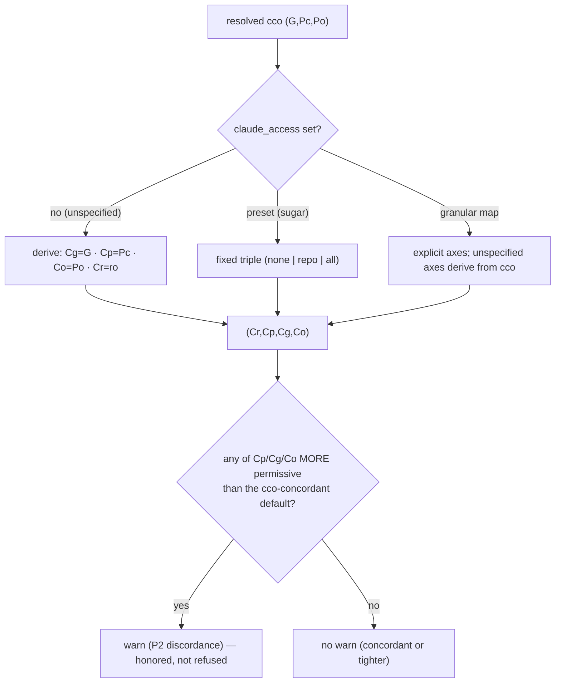

# ADR 0049 — `claude_access` concordant authoring model (axis triple + cco-derived defaults)

**Status**: Accepted (2026-07-13) — model ratified by the maintainer across the WS-B
design dialogue (post-hardening-v2 access-refinements). Implementation
in a later phase. **Refines / supersedes:**

- **Supersedes the `claude_access` *model* of**
  [ADR-0036 §D2](../../decentralized-config/decisions/0036-session-config-capability-model.md)
  (the opaque `none|repo|all` Axis-B enum) — the enum lives on as **preset sugar** over the
  new axis triple.
- **Reverses [ADR-0027](../../decentralized-config/decisions/0027-config-editor-builtin-and-edit-protection.md)
  §P17** (project `.claude` tree rw *by default* in a normal session) → the project
  authoring tree (B2) now **defaults read-only**, concordant with `cco_access`.
- **Generalises [ADR-0048](0048-config-editor-min-privilege-refinement.md) §4**
  (config-editor's bespoke *"`claude_access` follows `G`"*) into the **general** cco-derived
  default rule for every session — config-editor becomes a *consequence* of the rule, not a
  special case.
- **Mirrors** the `(G,Pc,Po)` triple form of
  [ADR-0046](0046-unified-cco-access-model.md) for the three `.claude` trees that live
  **inside** `.cco` config. [ADR-0042](0042-agent-cco-interaction-model.md)'s A/B/C
  interaction model is unchanged; this ADR refines only *how Axis B is modelled and
  resolved*.

**Deciders**: maintainer (ratified the three principles, the axis triple, the
cco-derived concordant defaults, `Cr` defaulting read-only, the discordance-aware warn,
the strict extra_mount default + `config_access_policy`, recursive nested-config
detection, and reversing P17 with init-workspace re-analysis); implementer (the
non-expressibility proof, the coverage matrix, the code-grounded schema-gap audit).

**Validation**: this session's code-grounded analysis
([`../access-refinements/analysis/ws-b-claude-cco-coupling.md`](../access-refinements/analysis/ws-b-claude-cco-coupling.md)).
**Living design**: [`../design.md`](../design.md) §4bis (Axis B authoring model), §7
(init-workspace), §8 (config-editor).

---

## Context

`cco` resolves three orthogonal knobs (ADR-0036/0042): **`claude_access`** (Axis B) over
the `.claude` authoring trees, **`cco_access`** (Axis A) over the `.cco`/framework config,
and **`show_host_paths`** (Axis C). ADR-0046 turned Axis A into an explicit `(G, Pc, Po)`
triple; Axis B stayed an opaque three-value enum (`none|repo|all`) with a **fixed default
of `repo`**.

A maintainer design review (WS-B, 2026-07-13) found the Axis-B model structurally at odds
with the Axis-A model it now sits beside. Three `.claude` trees are governed by
`claude_access`, but **two of them live physically *inside* `.cco` config** (governed by
`cco_access`), decoupled only by Docker's child-mount-wins:

| Tree | Host source | Container path | Reach | Governed by |
|---|---|---|---|---|
| **B1** repo-native | `<repo>/.claude` | `/workspace/<repo>/.claude` | the repo (cross-project) | `claude_access` only |
| **B2** project claude | `<repo>/.cco/claude` | `/workspace/.claude` | **this project** | `claude_access` (but nested in `Pc`'s tree) |
| **B3** global claude | `~/.cco/.claude` | `/home/claude/.claude` | **all projects** | `claude_access` (but nested in `G`'s tree) |

This produced three incongruences (WS-B taxonomy):

- **C1** — a normal session (`claude=repo` + `cco=read-project`) writes `<repo>/.cco/claude/`
  (CLAUDE.md/rules) but **not** `project.yml`/secrets. Deliberate (ADR-0027 P17: `/init`
  open, structural protected) — but it means the **default** grants B2 *write* while the
  cco intent is *read-only*: the Axis-B default is **more permissive than the cco intent**.
- **C2** — `claude=all` + `G=none/ro` writes the global `~/.cco/.claude` authoring tree but
  **not** global packs: **asymmetric global authoring** (writable rules, read-only packs).
  Closed *for config-editor* by ADR-0048 §4; still reachable for any explicit
  `--claude-access all --cco-access read-project`.
- **C3** — `cco=edit-*` + `claude=none` rewires structure but not rules. Rare/coherent.

Two further code-grounded gaps surfaced:

- **The single 3-value enum cannot express the concordant default.** Proof: the concordant
  Axis-B default for `edit-project` `(none,rw,none)` is *"author the project tree, keep the
  global tree read-only"* = `(B1=ro, B2=rw, B3=ro)`. No value of `none|repo|all` yields it
  (`repo` forces B1+B2 rw together; `none` forces B2 ro). The enum **bundles B1 and B2** at
  `repo`. Expressing the model *requires* per-axis granularity.
- **Schema gaps.** `project.yml` `access.claude` accepts a **scalar only** (no map form,
  unlike `access.cco`); `~/.cco/access.yml` reads **scalar only** for both `claude` and
  `cco`. Neither can express a granular Axis-B intent or a granular global default.
- **Nested / extra_mount governance holes.** The B1/A1 read-only overlays iterate repo
  mounts **root-only** and skip **extra_mounts** entirely — a `.claude`/`.cco` nested deeper
  in a repo (monorepo), or inside a rw extra_mount, escapes both knobs. Claude Code
  discovers nested `.claude` natively, so this is a real authoring-governance hole.

## Principles

- **P1 — concordant derived defaults.** When the user sets only `cco_access`, the resolved
  `claude_access` is **never more permissive than the cco intent** on the trees that live
  inside `.cco` config.
- **P2 — explicit discordance allowed, warned.** A user *may* deliberately grant `.claude`
  a wider (or narrower) surface than `.cco`; an explicit, more-permissive Axis-B override is
  honored and **surfaced with a warning** (awareness, not refusal). The knobs remain
  orthogonal, explicit user choices — enforcement never silently clamps one by the other.
- **P3 — minimum-privilege, predictable defaults.** Defaults map the recommended standard
  behaviour and avoid granting dangerous operations out of the box. The safe default is
  *read-only authoring*; write is an opt-in.

## Decision

### 1. Axis B becomes an axis triple (lattice `{ro, rw}`), mirroring cco

`claude_access` is modelled as **four per-tree axes**, each on the lattice **`ro < rw`**
(there is no `none`/invisible value — Claude Code must *read* its own config to function):

| Axis | Tree | Mirrors cco | Default |
|---|---|---|---|
| **Cg** | B3 global `~/.cco/.claude` | `G` | `= G` (rw iff `G=rw`) |
| **Cp** | B2 current-project `<repo>/.cco/claude` | `Pc` | `= Pc` (rw iff `Pc=rw`) |
| **Co** | other projects' `.cco/claude` | `Po` | `= Po` (rw iff `Po=rw`) |
| **Cr** | B1 repo-native `<repo>/.claude` | — (no cco counterpart) | **`ro` always** |

`Cg`/`Cp`/`Co` mirror cco's `(G, Pc, Po)`. **`Cr` is the extra axis** — the repo's *own*
`.claude` is not a `.cco` tree and has no `(G,Pc,Po)` mapping. This is precisely **why
`claude_access` stays a separate knob** and is **not folded into `cco_access`**: folding
would leave `Cr` homeless and would force B2 to follow `Pc` (killing the ability to author
the repo tree independently).

### 2. Concordant derived defaults (P1/P3)

When `claude_access` is **unspecified**, each axis derives from the resolved cco triple:
`Cg = G`, `Cp = Pc`, `Co = Po`, and **`Cr = ro`** (never derived up; the repo-native tree is
read-only by default — a session should not rewrite the config that governs its own
behaviour unless explicitly permitted). "rw" here means *only for the axes' lattice*; cco's
`none` collapses to `ro` on the Axis-B lattice (a not-writable tree is still readable).



### 3. Presets as sugar + uniform granular syntax

The Axis-B setting uses **exactly the same grammar as `cco_access`** (ADR-0046 §5), in
**every** source — CLI `--claude-access`, `project.yml` `access.claude`, and
`~/.cco/access.yml` `claude` — namely a **scalar** (a preset name) **or** a **map** (the
granular triple):

```yaml
# project.yml / ~/.cco/access.yml — granular form (any subset; the rest derive from cco, §2)
access:
  claude:
    repo:    ro | rw     # Cr — repo-native <repo>/.claude   (default ro)
    current: ro | rw     # Cp — <repo>/.cco/claude            (default = Pc)
    global:  ro | rw     # Cg — ~/.cco/.claude                (default = G)
    others:  ro | rw     # Co — other projects' .cco/claude   (default = Po)
```

**Presets are fixed triples** (coherent with cco presets — a name always publishes one
triple; keys omitted from a *map* derive from cco, but a *preset* fixes all axes):

| Preset | `(Cr, Cp, Cg, Co)` | Meaning |
|---|---|---|
| `none` | `(ro, ro, ro, ro)` | lock all `.claude` authoring (tighter than any cco — never warns) |
| `repo` | `(rw, rw, ro, ro)` | author the local trees (repo-native **+** current project), global read-only |
| `all` | `(rw, rw, rw, rw)` | author every `.claude` tree |

The **default (unspecified)** is **not** a preset — it is the cco-derived triple (§2). This
is the sole grammatical difference from cco (whose unspecified default is the fixed
`read-project` preset): Axis B's unspecified default *derives*, because concordance is its
purpose. `~/.cco/access.yml` is the user's **explicit global escape** (e.g. `claude: repo`
to author `.claude` across all projects) — created commented at `cco init`, values applied
only when the user uncomments them (§9).

### 4. Discordance-aware warning (P2)

A warning is emitted **iff** the resolved Axis B grants **more write** than the
cco-concordant default on a tree that lives inside `.cco` (`Cp` vs `Pc`, `Cg` vs `G`,
`Co` vs `Po`). `Cr` (B1, repo-native) **never warns** — it has no cco counterpart, so it
can be neither concordant nor discordant. A *tighter*-than-cco Axis B (e.g. `claude=none`
under `cco=edit-all`) never warns — restriction is always safe (P3). The session still
starts; the warning is awareness, never a refusal.

### 5. Functional-write floor (must-be-writable)

Independent of the axes, the files Claude Code **must** write to function stay writable in
every session — only *preference/authoring* content follows the axes:

- **Global** `~/.claude/settings.json` (B3) — already always-rw (runtime prefs: `/effort`, …).
- **Project** `/workspace/.claude/settings.local.json` (B2) and **repo**
  `<repo>/.claude/settings.local.json` (B1) — a **rw child overlay**, re-introducing the
  ADR-0027 pattern (dropped there only because B2 stayed rw). Claude Code writes "Always
  allow" and local runtime state here.
- **Read-only by default** (follow the axes): `CLAUDE.md`, `rules/`, `agents/`, `skills/`,
  and the shared `settings.json` (project/repo static config).

The discriminator (maintainer): *keep writable what determines Claude's **correct
functioning**; govern what impacts a user's **settings/preferences** for the project/repo.*
The exact set is verified against Claude Code behaviour at implementation (e.g.
`.claude/worktrees/` for background sessions — likely inert under cco).

> **Forward annotation (2026-07-15, implementation).** The rw child overlay above needs
> **both ends of the bind to exist as files**. Docker/runc cannot create the mountpoint
> inside the `:ro` parent — it fails with `mknod ... read-only file system` and the
> container never starts. Mount *ordering* was never the issue (the child does win over
> the `:ro` parent); the target must simply **pre-exist**. `cco start` therefore seeds an
> inert stub host-side, in the mount's backing directory, before the bind — gitignored
> (migration 015), always shadowed by the rw STATE copy. Because §2 makes `Cp=ro`/`Cr=ro`
> the default, the missing seed broke `cco start` for **every** normal session until it
> was fixed. Two refinements of §5 as written here:
> - STATE is seeded **from** the mountpoint, so a tree that already carried a real
>   `settings.local.json` keeps its content on first start instead of being shadowed by
>   an empty `{}`.
> - The floor is **only as verifiable as the harness**: the dry-run compose tests assert
>   the emitted YAML and never execute it, so this shipped green. Mount-time failures are
>   invisible to a hermetic suite and belong to the e2e gate.

### 6. B2/B1 default read-only reverses P17 → init-workspace re-analysis

Because `Cp` defaults to `Pc` (read-only under the `read-project` default) and `Cr`
defaults read-only, a **normal session no longer authors the project/repo `.claude` tree by
default** — reversing ADR-0027 §P17 (which kept B2 rw to preserve `/init`). Consequences:

- The managed **`init-workspace`** skill writes `/workspace/.claude/CLAUDE.md` (B2); under
  the new default it needs an explicit Axis-B grant (`--claude-access repo`) or a cco edit
  level. **No carve-out for `/init`** is added — writing `.claude` authoring content is now
  an explicit, min-privilege opt-in (config-editor or explicit flag), coherent with the
  model.
- **`init-workspace` is flagged for a dedicated re-analysis** (possible deprecation or
  re-scope). Its historical value — a framework-aware CLAUDE.md init — is largely covered
  today by Level-A context injection + the wrapped CLI; it is **little used**. The residual
  value is **generating repo descriptions + the project `CLAUDE.md`**, to be delegated to
  another mechanism or kept as a re-scoped skill. Out of scope for this ADR; recorded here
  and in [design §7](../design.md).

### 7. extra_mount: strict default + `config_access_policy` + recursive detection

extra_mounts are arbitrary host directories, **not** project-config repos, so P3 makes them
strict by default:

- **Default**: **all** nested `.claude`/`.cco` directories inside an extra_mount are
  **read-only**, regardless of the session's (possibly more permissive) `claude_access`/
  `cco_access`. The mount's own `readonly:` flag governs everything else.
- **Opt-out attribute** `config_access_policy` on an extra_mount (`project.yml`), three
  values: **`ro`** (default) · **`project`** (nested config follows the session's
  `cco_access`/`claude_access`) · **`write`** (nested config rw). Per-mount custom triples
  are **YAGNI** (a future extension).
- **Recursive detection**: the read-only overlays now find `.claude` (and `.cco` carrying a
  `project.yml`) **nested at any depth** under repos *and* extra_mounts (a bounded `find`),
  not only at the mount root — closing the monorepo/extra_mount governance hole. Depth/cost
  is tuned at implementation.

### 8. config-editor is subsumed by the general rule

ADR-0048 §4 gave config-editor a bespoke *"`claude_access` follows `G`"*. Under §2 the
**general** derivation already yields this: config-editor project mode `(ro,rw,none)` →
derived `(Cr=ro, Cp=rw, Cg=ro, Co=ro)` (authors the target project's `.claude`, reads the
global); `edit-global` `(rw,rw,none)` → `Cg=rw`; `edit-all` → `Co=rw`. The bespoke branch is
**removed**; config-editor uses the general resolver. ADR-0048 §4 is forward-annotated.

### 9. Schema, precedence, migration

- **`project.yml` `access.claude`** gains the **map form** (§3), beside the scalar preset —
  additive, no migration (code handles a missing map with the derived default). The
  `none|repo|all` enum is **redefined** as preset sugar (§3).
- **`~/.cco/access.yml`** gains **granular map** support for both `claude` and `cco`
  (symmetric with `project.yml`) — additive. Created **commented** at `cco init` so the user
  sees the escape exists but nothing is set implicitly.
- **Precedence unchanged** (ADR-0036 D3, ADR-0046 §5): CLI `--claude-access` >
  `project.yml` `access.claude` > `~/.cco/access.yml` `claude` > **cco-derived default**
  (the level-4 default is now *derived*, not the fixed `repo`).
- **changelog** entry at implementation time (behaviour change: `.claude` authoring default
  → read-only; requires `cco build`). The Axis-B enum→triple is a **code** change, not a
  data migration (unreleased/feature-branch); the new `config_access_policy` field and the
  `access.*` map forms are additive.

## Coverage — concordant Axis-B default per cco intent

| cco | `(G,Pc,Po)` | derived `(Cr,Cp,Cg,Co)` | note |
|---|---|---|---|
| `read-project` / `read-global` | `(·,ro,·)` | `(ro, ro, ro, ro)` | all authoring read-only |
| `read-all` | `(ro,ro,ro)` | `(ro, ro, ro, ro)` | |
| `edit-project` | `(none,rw,none)` | `(ro, **rw**, ro, ro)` | author *this* project only — **not expressible by the old enum** |
| `edit-global` | `(rw,rw,none)` | `(ro, rw, **rw**, ro)` | + global authoring |
| `edit-all` | `(rw,rw,rw)` | `(ro, rw, rw, **rw**)` | every project's; `Cr` still ro |
| granular `(rw,ro,ro)` (case 7) | | `(ro, ro, rw, ro)` | curate global store, projects read-only |

`Cr` is `ro` in every derivation — raising it (author the repo-native tree) always requires
an explicit Axis-B grant (`repo`/`all`/`repo: rw`), which never warns.

## Alternatives considered

- **Runtime *bound*/clamp — `cco_access` caps `claude_access` (min of the two).** The
  first WS-B proposal. Rejected: silently overrides an explicit user choice, breaking the
  "two orthogonal, explicit knobs" model. Concordance belongs in the **default**, not in a
  hard clamp; explicit discordance is a legitimate (warned) intent (P2).
- **Fold `claude_access` into `cco_access` (eliminate the knob).** Rejected: `Cr` (B1,
  repo-native) has no `(G,Pc,Po)` mapping, and folding forces B2 to follow `Pc` (loses
  independent repo-tree authoring). The extra axis is the structural reason to keep Axis B.
- **Bind B2 to `Pc` too ("everything under `.cco` obeys `cco_access`", b-ii).** A uniform
  mental model, but it removes the ability to author `<repo>/.cco/claude` independently of
  structural config and offers nothing the concordant default + explicit override don't.
  Rejected in favour of per-axis concordance (B2 default follows `Pc`, but is independently
  overridable).
- **Keep the `none|repo|all` enum, fix only the default.** Rejected: the enum **cannot
  express** the concordant `edit-project` default `(ro,rw,ro)` (bundles B1+B2). The triple
  is forced by the model, not a stylistic choice.
- **Carve `/init`/B2 always-rw to preserve P17.** Rejected: reintroduces the "default more
  permissive than cco intent" gap (C1) the model closes; `.claude` authoring is a legitimate
  explicit opt-in, and `init-workspace` is up for re-analysis anyway.
- **extra_mount nested config follows session policy by default.** Rejected: extra_mounts
  are arbitrary, not config repos — P3 makes them strict (`ro`) by default, with
  `config_access_policy: project` as the opt-in.

## Consequences

- **Positive**: Axis B is now expressible and concordant with Axis A by default (no
  "`.claude` default more permissive than cco"); one grammar (scalar preset | granular map)
  across flags/`project.yml`/`access.yml` for **both** knobs; C1 (default over-grant) and C2
  (asymmetric global authoring) closed by default while explicit asymmetry stays possible
  (warned); config-editor's bespoke claude-follows-G collapses into the general rule; the
  extra_mount/nested-config holes are closed; `~/.cco/access.yml` becomes a real granular
  global-default escape.
- **Negative / trade-offs**: a **behaviour change** — a normal session no longer authors
  `.claude` (B1/B2) by default (reverses P17); `/init`/`init-workspace` need an explicit
  grant (mitigated: min-privilege intent, unreleased, `init-workspace` re-analysis pending);
  Axis B gains a granular form to parse and document (mitigated: it reuses the Axis-A
  resolver/grammar); the functional-write floor must be verified against Claude Code
  behaviour (settings.local.json overlay).
- **Enforcement**: unchanged in mechanism — the resolved Axis-B triple drives the same
  `.claude` mount-mode generation; ADR-0047's privilege boundary is Axis-A only and is
  untouched. The extra_mount recursive overlays are new `:ro` child mounts.
- **Feeds**: `design.md` §4bis/§7/§8; the CLI-surface matrix (`--claude-access` granular);
  the init-workspace re-analysis; implementation (resolver generalisation reusing
  `_cco_promote_triple`, mount-gen, `access.yml`/`project.yml` schema, extra_mount detection).
- **Supersession**: supersedes ADR-0036's Axis-B enum as the base model (enum → preset
  sugar); reverses ADR-0027 §P17; generalises/absorbs ADR-0048 §4. All three are
  forward-annotated.
