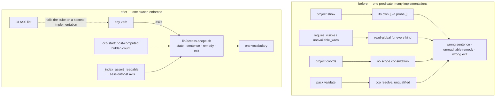

# ADR 0056 — The availability model: one owner for availability answers, and a session/host axis for index health

**Status**: Accepted (design) — 2026-07-29, approved by the maintainer at S2's design gate.
**Design only — no implementation in this session.** Cycle-1.2, session **S2**.
Closes the design half of **R-A**, **R-B** and **R-C** of the
[e2e v3.1 consolidated review](../e2e-review/results/consolidated-review-v3.1.md) §4.
Implemented by **S3** (the index axis) and **S4** (the INV-AVAIL sweep + the CLASS lint).
Ratifies **D-V31-1**, **D-V31-2** and **D-V31-3** (review §6) into the model.

**Related ADRs**: [0043](../../../cli/decisions/0043-unified-cli-environment-access-scope.md)
(symmetric read scoping — extended here, not superseded) ·
[0047](0047-config-access-enforcement.md) (the privilege boundary; INV-S6 and its CLASS lint are this
ADR's working precedent) · [0046](0046-unified-cco-access-model.md) (the `(G,Pc,Po)` triple) ·
[0042](0042-agent-cco-interaction-model.md) (`CCO_SESSION_CONTEXT`, the host-computed session signal
D5 reuses) ·
[0055](../../../environment/decisions/0055-claude-runtime-state-and-mountpoint-ancestry.md)
(INV-MP — the sibling gap named by the same audit).

**Analysis**: [`invariant-gap-audit.md`](../../../engineering/analysis/invariant-gap-audit.md) §2
(Gap A) · runbook [`fix-design-v3.1/00-plan.md`](../e2e-review/fix-design-v3.1/00-plan.md) §4.

---

## Context

The v3.1 re-review deduplicated 24 raw findings (1 🔴 · 13 🟠 · 10 🟡) into 8 product defects, and
every one of them turned out to be the same proposition:

> **cco renders *"I cannot see X from here"* as *"X is not there"*, and computes the remedy without
> regard to where the message is printed.**

### Why it recurs is structural, not a matter of care

Every subsystem in this codebase that acquired an invariant plus a static lint has held under
adversarial probing: INV-S1…S6 (store writes), INV-IDX (index writers),
`test_invariant_tty_gate_single_spelling` (interactivity). The three that keep shipping the same
defect — availability vocabulary, mountpoint ancestry, YAML section editing — are exactly the three
without one.

The consequence is that each cycle has fixed **the reported site** and left its siblings. Two of the
current divergences are the unswept siblings of fixes that *did* land: B-DF1 corrected *which path*
`project show` probes but left its `else` branch a two-way test; S8's `221d8fb` corrected the
**aggregate** hidden-count notice and left the two **per-resource** call sites.

Hence the shape of this ADR: **the unit of work is the invariant plus its lint**, and the findings
close as a consequence. Fixing the eight one at a time reproduces the failure.

### What the code already gets right

`lib/access-scope.sh` already provides the intended single source. `_env_member_state` and
`_env_project_state` (`:726-743`) implement D-M2's three states; `:753-755` carries the comment
*"The not-mounted sentence deliberately never says 'run cco resolve'."*; `_env_flush_hidden_notice`
(`:632-637`) already picks the correct widening per hidden kind; `index.sh:160-164` already branches
its remedy on `_cco_container_operator`.

**The classifier is correct. It is simply not the only implementation.** That distinction is what
this ADR converts into an enforceable rule.

### The divergent sites (a lower bound)

| Site | What it does instead | Symptom |
|---|---|---|
| `cmd-project-query.sh:249-253` | its own two-way `[[ -d "$_probe" ]]` test | a not-mounted member renders `[missing]` + *"run 'cco resolve 
'"* — which the same session refuses at exit 2 |
| `access-scope.sh:688` (`_env_require_visible`) | offers `read-global`/`read-all` for every kind | for a **project**, `read-global` reveals nothing — ADR-0043 defines it as the level that hides other projects |
| `access-scope.sh:785` (`_env_unavailable_warn`) | the same string | the same |
| the `project coords` lane | no scope consultation at all | answers store-wide from a 1-of-10 view, at exit 0, with no hidden-count notice |
| `cmd-pack.sh` (validate remedy) | prescribes `cco resolve` with no host qualifier | unfollowable in-session |

### R-C — the index taxonomy has no session-vs-host axis

`_index_read_state` (`index.sh:128-135`) classifies five mechanical states with **`absent` as the
only benign one**. A session is *launched from* the index, so in-container `absent` can only mean the
bind broke or host state was destroyed — it is never benign there. Observed with the index moved
aside under a live session: `path list` answered *"the path index is empty — nothing is registered on
this machine yet"* at **rc=0**, and `project show` rendered a **fabricated** card — three bound,
readable mounts badged `[unresolved]`, the repo's host path silently degraded to its container path.

⚠ **This is also the default state of every session on native Linux** (review §5): host buckets are
created mode 0700 by `_cco_ensure_dir`, `cco-svc` is uid 900, so without search permission on the
parent the `[[ -e ]]` probe fails and the state reads `absent`.

`stale` does not catch it: that arm (nlink 0) was designed against the pre-S1 **file** bind; S1's
directory bind makes a host-side `mv` present as plain `absent`.

---

## Decision

### D1 — INV-AVAIL: a verb may ask, it may not decide

> **INV-AVAIL** — no verb computes an availability or scope-widening answer for itself. Every such
> answer is produced by `lib/access-scope.sh`, which owns (a) the three-state classification,
> (b) the sentence, (c) the remedy, and (d) the exit code.

This is deliberately the same shape as INV-S6, whose CLASS lint has held: *no code outside the
primitive layer mutates or predicates a confined path*. Here: *no code outside the availability layer
predicates a member/mount/project path in order to render availability*.

### D2 — a remedy is a function of the print site

A sentence emitted in a container may never prescribe a verb that is host-only there. `cco resolve`
is the specific string, and the refusal builder already knows the context. This generalises
`index.sh:160-164` rather than inventing a rule: that site is the existing correct implementation.

### D3 — the widening offered is a function of what is hidden

| Hidden set | Widening named |
|---|---|
| projects only | `read-all` alone (`read-global`'s sole difference from `read-all` is that other projects stay hidden — naming it would offer a remedy that reveals nothing) |
| store kinds only | `read-global` |
| mixed | both, with `read-all` attached to the projects clause |

The aggregate notice already does this. The per-resource sites (`:688`, `:785`) must share the
**implementation**, not merely the intent — the inline logic at `:632-637` is extracted into one
named builder that all three call. *Sharing an intent is what produced the divergence being fixed.*

### D4 — the `unknown` arm exists, and is enabled only at read scope `all`

Ratifies **D-V31-1**. W2-01 (the classifier has complete information at `edit-all` and still says
*"it exists on this machine"*) and W3-F05 (distinguishing would make `project show` an existence
oracle) are both right, on **different axes** — and the discriminating axis already exists:
ADR-0043's `_cco_level_read_scope`.

- read scope **`all`** → nothing can be hidden by construction, so the `unknown` arm is safe **and
  owed**: a typo must not be answered *"it exists on this machine"*. No oracle is created — the
  session would see the resource anyway. Truth source: `_index_list_projects`.
- read scope **`project` / `global`** → **one non-disclosing sentence that asserts nothing**:
  *"no project 'X' is available at this access scope (cco_access=…)"*. Never *"it exists on this
  machine, but …"*.

`_env_project_state` therefore gains a fourth state, `unknown`, materialised only at scope `all`.
`_env_require_visible:688` is reworded: today it asserts both existence **and** location (*"it is
outside this session's project"*), which is precisely the disclosure D-V31-1 forbids below `all`.

This makes the managed rule — *"A hidden resource is not a missing one"* — true of the code for the
first time.

### D5 — you cannot count what you cannot enumerate; the count comes from where enumeration is possible

**First, a correction the ADR records deliberately**: the session reports diagnose R-B as *"packs are
not wired into the scope layer"*. **That is wrong.** `cmd-pack.sh:116` does call `_env_note_hidden
pack` and `:134` does flush. The real cause is that at `G=none` **`~/.cco` is not mounted at all**,
so the enumeration loop never iterates and there is nothing to count. `llms` behaves correctly only
because it enumerates from CACHE, which is mounted regardless of `G`. The correction is written down
because this diagnosis has already misled one reader, and a wrong root cause survives longer than a
wrong fix.

**The decision**: a hidden-set count the session cannot enumerate is a **host-side fact**, computed
by `cco start` where enumeration is possible and injected as a session signal — the pattern
`CCO_PROJECT_PACKS` / `CCO_PROJECT_LLMS` already establishes (*"computed once host-side (INV-E)"*,
`access-scope.sh:45-47`).

Consequence, recorded rather than discovered later: the count is a **snapshot at session start**. A
pack installed from the host mid-session is not reflected. This is acceptable — the session could not
see that pack anyway, and INV-D already frames scoping as a presentation filter over a host-owned
truth.

### D6 — the index taxonomy gains a session/host axis; the classifier stays pure

**The classifier does not change.** `_index_read_state` keeps its five mechanical states, because its
optional file argument lets the reconcile probe classify *arbitrary* index files (the legacy
location, the new location) with the **same** classifier — making it context-dependent would corrupt
that use.

The axis lives in the **interpretation**, `_index_assert_readable`: under `_cco_container_operator`,
`absent` is **non-benign** and routes to the same fail-closed path as `unreadable`/`truncated`/`stale`.
The current remedy for that state — *"run cco on your host to populate it"* — is false exactly where
it is printed: that is where the index came from.

**Two causes, two sentences**, separated by probing the parent's traversability:

| Cause | The sentence names | Remedy |
|---|---|---|
| the bind was severed / host state destroyed | the index was readable at start and is no longer | run cco on your host to inspect or rebuild it |
| the internal store is unreachable (parent not traversable) | the platform limitation, by name | forward-pointer to the cycle-2 Linux ADR |

The second row is the **native-Linux default**. One sentence for both was considered and rejected: it
is true but unspecific, and it would leave every Linux user reading a message that does not tell them
they have hit a known, recorded limitation.

**What this fix does and does not do for Linux.** It converts Linux from *silently wrong* to
*honestly refusing* — the precondition for stating a verified platform in release notes at all. It
does **not** make Linux work. The store-reachability fix is **cycle-2, and an ADR, not a patch**: the
conflict is structural — the agent's uid must equal the host user's (or it cannot write the repos),
the store content is owned by that same uid, and the elevated identity must **not** be that uid. The
candidate resolutions (a dedicated host group with setgid dirs and the gid joined in the entrypoint;
POSIX ACLs granting uid 900; or dropping the boundary on Linux, a security regression) all imply
host-side setup.

### D7 — `[unresolved]` means exactly one thing, and an unreadable index gets its own rendering

- **`[unresolved]` := the index holds no binding for this member.** It does **not** mean *"the probe
  failed"*, and it does **not** mean *"I could not read the index"*.
- `project show`'s member branch stops being a two-way `[[ -d "$_probe" ]]` test
  (`cmd-project-query.sh:249-253`) and routes through `_env_member_state`'s three states — so a
  not-mounted member stops rendering `[missing]` plus the retired `cco resolve` remedy.
- When the **index itself** is unreadable, `project show` renders **no card at all**, refusing at
  entry through the existing `_index_assert_readable` guard. A card that badges bound, readable
  mounts `[unresolved]` and silently degrades a host path to its container path is not a *degraded*
  answer — it is a **fabricated** one, and that is strictly worse.
- **D-V31-3** folded in: a config-editor target's dropped `extra_mounts` are badged
  `[not mounted in this session]`, in the existing vocabulary. The managed rule stays as
  defense-in-depth. The governing precedent is ADR-0047 itself — **mechanism before prose**: when
  correctness depended on output scoping, the project chose a real boundary and demoted the prose
  layer to defense-in-depth.

### D8 — INV-S3b's text is amended (D-V31-2)

`lib/store.sh`'s header (`:15-30`) is restated as **pre-flight-vs-write × session-vs-host**, dropping
the bucket parenthetical (*"the bucket is not bound into this container"*) that reads as the
discriminator when it is only an **example**. It has now been misread three times. Text only — no
behaviour changes, and V3-03's exit **1** stays out of it: a *usage* fact, fixable where it is
printed, is a different lane.

### D9 — the CLASS lint (specified here, built in S4)

Modelled on INV-S6's guard (`tests/test_invariants.sh:431-558`). Fails the suite when a file outside
`lib/access-scope.sh` either:

1. tests a member / mount / project path for existence **in order to render availability**, or
2. emits any **reserved string** outside the sanctioned builder — `[missing]`, `[unresolved]`,
   `not mounted in this session`, `not available at this access scope`, `cco resolve`.

Two properties are mandatory, both learned from INV-S6:

- **Assignment provenance, not a naive grep.** A guard blind to the `local x; x=$(…)` split idiom
  misses the majority of its class and certifies anyway.
- **It must prove its own discrimination** by planting a violation in a staged copy of a
  non-allowlisted file. A static invariant cannot *"fail on reverted `lib/`"*, so an undemonstrated
  one is indistinguishable from an inert one.

---

## Alternatives considered

**A1 — an elevated read op in the setuid helper** (`store-op count <kind>` beside `plan`/`apply`), so
the count is live and always accurate. **Rejected**: it widens ADR-0047's privileged surface for a
**cosmetic datum** — the inverse of the criterion by which that boundary was deliberately drawn
narrow. D5's host-computed signal reaches the same user-visible outcome with no new crossing.

**A2 — drop the count; emit a sentence with no number** (*"packs are not visible at this access
scope"*). Honest and zero-mechanism. **Rejected**: it weakens INV-B, which requires a *count-only
notice* precisely so an agent can tell hidden from absent. Removing the count to fix a missing count
answers the finding by deleting the requirement.

**A3 — move the session/host axis into `_index_read_state` itself** (a sixth state, or a
context-dependent classification). **Rejected**: the classifier is reused by the reconcile probe on
arbitrary files, where "in a session" is meaningless. Contaminating a pure mechanical classifier with
policy would break a second, unrelated consumer — the same coupling error this ADR exists to remove.

**A4 — one sentence for both `absent` causes.** Minimal and YAGNI-consistent. **Rejected by the
maintainer**: on native Linux the unreachable-store arm is not an edge case but the **default state
of every session**, and a true-but-unspecific message would leave those users unable to tell a known
platform limitation from a broken installation.

**A5 — enable the `unknown` arm at every read scope.** Would give the best error message for a typo
everywhere. **Rejected**: below read scope `all` it converts `project show` into an existence oracle
across the scope boundary, which is exactly what W3-F05 identified and what ADR-0043's scoping
exists to prevent.

**A6 — fix the eight findings at their reported sites, no invariant, no lint.** The smallest diff.
**Rejected — it is the failure mode this cycle exists to remove.** Three prior cycles took this route
and each left the siblings of its own fix; S7's lesson turned one notch: *a fix at one of several
sites that can execute is indistinguishable from a complete fix until you look at the others.*

---

## Consequences

- **One vocabulary, mechanically enforced.** A second implementation of the availability predicate
  becomes a suite failure rather than a review finding, which is the only thing that has ever stopped
  this class in this codebase.
- **The managed rule stops being aspirational.** *"A hidden resource is not a missing one"* becomes
  true of the code, so an agent reading the rule and an agent reading the output finally agree.
- **Native Linux sessions begin refusing index-reading verbs**, loudly, until cycle-2. This is a
  deliberate, user-visible regression *in appearance* and an improvement in fact: the previous
  behaviour was a confident wrong answer at rc=0 in every session. It must be stated in the release
  notes, not discovered.
- **The hidden count becomes a session-start snapshot** (D5). Documented above; the alternative was a
  wider privileged surface.
- **`project show` can now refuse where it used to render.** An unreadable index produces no card.
  Any consumer parsing that output sees a refusal instead of a fabricated card — which is the point,
  but it is a contract change.
- **S3 and S4 are unblocked and separable**: S3 is one file and one taxonomy; S4 is a sweep across a
  verb family plus a lint. Their blast radii differ, which is why they stay separate sessions.
- ⚠ **S4's site list is a lower bound.** Cycle-1.1's S9 established that a named file list always is.
  The sweep is enumerated by grepping the reserved strings, never by working from the table above.

## Verification

S2 is **design only**. Its exit criterion is this ADR, approved — no code, no tests. What it hands
its consumers:

- **S3** owes a **container probe** after `cco build` — per cycle-1.2 Rule 1, suite-green is not
  acceptance for this lane (RC-17's fourth recurrence). With a session live, move
  `~/.local/state/cco/shared/index` aside from the host, re-run `cco path list` · `cco list` ·
  `cco list projects` · `cco project show 
`, confirm each reports a read failure, then restore and
  confirm recovery.
  ⚠ The path is `state/cco/`**`shared/`**`index`. The pre-S1 `state/cco/index` no longer exists, and
  a copy-paste of the older command moves nothing and produces a **false pass**.
- **S3** owes a regression test reproducing §10.9d (index moved aside under a live session).
- **S4** owes the CLASS lint plus its planted-violation self-test (D9), and the enumeration-by-grep
  discipline.

## Forward annotations

- **ADR-0043** — extended, not superseded: D4 makes the `unknown` arm a function of
  `_cco_level_read_scope`, and D3 binds the widening offered to the hidden kind. Its INV-B (hidden ≠
  absent) gains a host-side count source in D5.
- **ADR-0047** — D5 respects the boundary by declining to widen it; INV-S6 and its CLASS lint are the
  model for D9. Its INV-S3b text is amended by D8.
- **ADR-0055** — the sibling gap from the same audit (INV-MP). Together they close the two structural
  gaps `invariant-gap-audit.md` named; the third (INV-YAML) is S5.
- **ADR-0042** — `CCO_SESSION_CONTEXT` and the membership signals gain one more host-computed
  datum (D5).
- **Cycle-2** — the Linux store-reachability ADR is named by D6 and does not exist yet; the
  forward-pointer in the unreachable-store sentence must be updated when it lands.

---

## Implementation annotations — ratified 2026-07-29 (S3, S4, S5)

The decision text above is **not rewritten**; these are forward notes recording where the
implementation departed from, or reached past, what this ADR decided. Each was raised at
implementation time and **ratified by the maintainer** rather than settled by the implementer. The
point of writing them here is A6's lesson read forwards: an undocumented deviation is rediscovered
and re-litigated, which is the cost this ADR exists to stop.

### D4 — the refusal wording deviates from the string quoted in the decision

D4 specifies the sentence *"no project 'X' is available at this access scope (cco_access=…)"*. The
implementation emits **`'project X' is not available at this access scope …`** instead.

**Why**: D4's own phrasing destroys the reserved fragment **`not available at this access scope`**,
which INV-ENV budgets and which the managed rule `cco-config-interaction.md` quotes verbatim. Written
literally it broke the pre-existing `test_as_require_visible_degrades_gracefully`. The implementation
kept the reserved fragment and deleted only the **disclosing clause** (*"— it is outside this
session's project ('Y')"*), which is the part D-V31-1 actually forbids.

**Ratified**: D4's stated intent — *assert neither existence nor location* — is fully met. Naming the
resource the caller just typed discloses nothing. ⚠ Anyone who wants the literal string must change
INV-ENV's vocabulary **and** the managed rule with it; it is not a string substitution.

### D4 — the `unknown` arm is gated on operator mode as well as read scope `all`

D4 makes the arm a function of `_cco_level_read_scope`. On the **host**, `_env_read_scope` returns
`all` by INV-A, so a literal reading enables the arm there too. The implementation keeps the host on
its existing `unresolved` wording.

**Ratified — narrower than a literal reading, deliberately**: the false claim D4 exists to kill
(*"it exists on this machine"*) lives in the **not-mounted** sentence, which only a session produces.
The host's `unresolved` already claims no more than *"not resolved on this machine"*, and host-side
counterweight tests pin it.

### D9 — the lint's tracked probe set is one function, not the full "member / mount / project path"

**Ratified — narrower than D9's text, for D9's own reason.** The wider set
(`_resolve_project_yml`, `_index_get_path`, `_mount_source_for`) flags **twelve** sites and every one
is legitimate: `[[ -f "$project_yml" ]] || die "has no readable project.yml"` runs *after* the owner
has already answered `here`, and asks a different question. A lint whose hits are mostly legitimate
gets allowlisted until it is inert — which is the failure mode D9's second mandatory property exists
to prevent. INV-S6 could ban its whole set only because behind the ADR-0047 boundary those reads are
*meaningless*; here they are meaningful. The reason is written in the lint body, not only here.

### D6 — a **missing** parent directory is folded into the store-unreachable row, not given a third arm

D6 splits `absent`-in-session by probing the parent's traversability. A parent that is **absent** —
the STATE bind itself gone, plausible on macOS — is not traversable and therefore lands in row 2,
whose native-Linux framing is not what happened.

**Ratified — two arms, as decided.** Rows 1 and 3 would carry the **same remedy** (*run cco on your
host to inspect or rebuild it*), so a third arm buys diagnostic precision and changes no action.
Against that: separating `ENOENT` from `EACCES` is not a one-liner in bash — `[[ -e ]]` is false for
both, and on Linux the **grandparent** (`~/.local/state/cco`) is itself 0700/`cco-svc`, so a naive
existence probe would misclassify the Linux default as "missing". It would need an ancestor walk to
the first traversable directory, on bash 3.2 + BSD, with its own failure modes. The shipped sentence
already names both sub-cases explicitly (*"no search permission on it, or it is not there at all"* …
*"Anywhere else, the store bind itself is gone. Either way: …"*) and delivers the right remedy to
both. **Recorded so the next reader does not rediscover the sub-case and re-open it.**

### D6 — extended to a zero-row index in a session (S6)

D6 covers the mechanical state `absent`. An index that is **present, readable and non-zero but holds
zero rows** classifies `ok`, passes `_index_assert_readable`, and `cco path list` / `cco list
projects` still answer *"the path index is empty — nothing is registered on this machine yet. Run cco
on your host to populate it."* at **rc=0** — §10.9d's exact sentence, from a different cause, and
containing the very string D6 calls *false exactly where it is printed*.

Found by the independent tester writing S3's regression cover; **not** a violation of D6 as written —
the classifier is right and the guard is right. But D6's own argument applies with identical force: a
session is *launched from* the index, so a zero-row index in a session is as impossible as an absent
one.

**Ratified: closed in S6**, extending the interpretation rather than the classifier — the same shape
as D6, and for the same reason A3 gives. Left open it would have been a textbook A6 outcome: the
reported site fixed, its sibling shipped.
