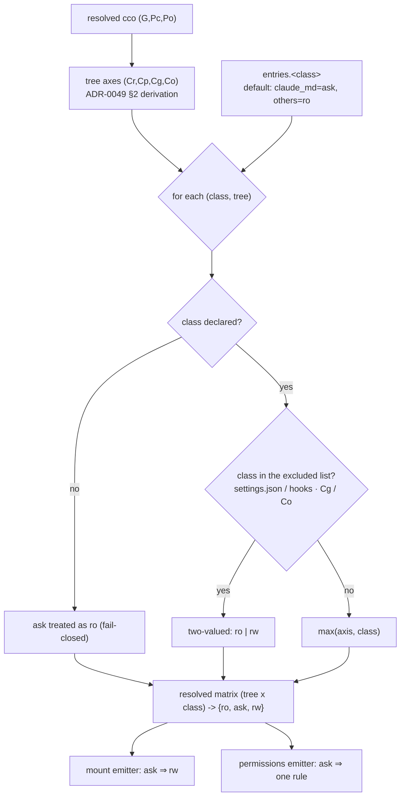
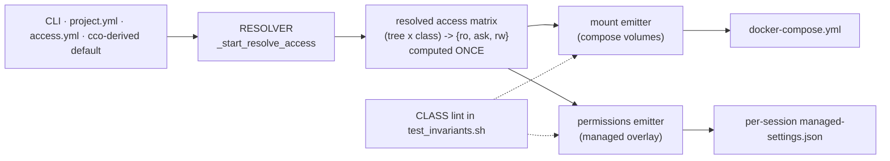

# ADR 0057 — `ask` as a third access value, and a resource-class dimension for Axis B

**Status**: **Accepted (design)** — 2026-08-05, ratified by the maintainer across this session's design
dialogue. The four gating measurements (P1–P4) were run on the host the same day and **all passed**;
record: [`../analysis/probe-ask-enforcement-plane.md`](../analysis/probe-ask-enforcement-plane.md).
They were preconditions rather than acceptance criteria because a negative P1 or P3 would have changed
D9. Implementation pending.

**Closes**: [FI-18](../../../improvements.md) (*"decouple CLAUDE.md from rules/agents/skills in
`claude_access`"*, open since 2026-07-15).

**Related ADRs**:

- **Extends [ADR-0049](0049-claude-access-concordant-model.md)** — Axis B's lattice becomes
  `ro < ask < rw` and gains a second dimension. Its §2 derivation, §3 grammar, §5 floor and §7
  extra_mount rules are **unchanged in mechanism**; §4 (discordance warning) is **refined** by D12.
- **Extends [ADR-0055](../../../environment/decisions/0055-claude-runtime-state-and-mountpoint-ancestry.md)
  D1** — that ADR split `.claude` into *authoring* and *runtime state*; this one partitions the
  **authoring** half by resource class. Runtime state stays outside both.
- **Does not touch [ADR-0046](0046-unified-cco-access-model.md) /
  [ADR-0047](0047-config-access-enforcement.md)** — `ask` is excluded from Axis A **on principle**
  (D6), and the reason is recorded so it is not re-litigated.
- **Consumes [ADR-0054](../../decentralized-config/decisions/0054-framework-owned-mountpoints.md)** —
  INV-MP and the D4 composed-namespace caveat drive the seeding rule (D13).
- **Feeds [FI-48](../../../improvements.md) / Block C stage C2** — D9's layering doctrine answers the
  *"how do cco's own rules compose with pack-shipped ones"* half of that design before it is asked.

---

## Context

### The trigger, twice

A session in progress found the project's `CLAUDE.md` stale — stale *because of the work that session
was doing* — and was refused by `claude_access`. The same event produced FI-18 on 2026-07-15 and this
ADR on 2026-08-05. The policy is right for `rules/`, `agents/` and `skills/`; it is wrong for the file
that describes the codebase the session is changing.

### Three defects of the current model, all structural

**1. A classification gap.** ADR-0049 governs `.claude` **trees**; ADR-0055's authoring/runtime table
names `CLAUDE.md` only inside the global and project trees. Nothing classifies
`<repo>/CLAUDE.md` or its nested siblings: `_find_nested_config_dirs` matches **directories**, and
those are files. They therefore follow the repo mount and are **writable in every session**. The same
class of file is governed three different ways, one of them by omission:

| File | Governed by | Today |
|---|---|---|
| `~/.cco/.claude/CLAUDE.md` | `Cg` | `ro` by default |
| `<repo>/.cco/claude/CLAUDE.md` | `Cp` | `ro` by default |
| `<repo>/.claude/CLAUDE.md` | `Cr` | `ro` always |
| **`<repo>/**/CLAUDE.md`** | **nothing** | **`rw`** |

**2. A binary lattice cannot express the common intent.** Access is resolved at `cco start` and mounts
are immutable for the session's lifetime (INV-1). So `ro` does not mean *"not now"*, it means *"not
without restarting the session"* — the cost is paid exactly when the need is discovered, mid-task.

**3. One enforcement plane where two are available.** cco has enforced access through Docker mounts
only. `permissions` is a second plane, measured as working under cco's own launch conditions.

### What was measured before this ADR, and by whom

[FI-48](../../../improvements.md), field measurement of 2026-08-04 (claude 2.1.221, repeated for
determinism): **an `ask` rule prompts under `bypassPermissions`** — the mode cco launches every session
in. And, from the same measurement, the reach limit that constrains D8: `Edit` rules cover the built-in
modifying tools and the file commands Claude Code recognizes in Bash (`sed -i`, `echo >`, `printf >`);
**`dd`, `truncate` and any interpreter pass**.

---

## Principles

Continuing ADR-0049's P1–P3, which are unchanged.

**P4 — `ask` is not a grant of write; it is the capability to *request* one.** Minimum privilege (P3)
constrains what the agent may do **unilaterally**, and under `ask` that is nothing: every write ends in
a human decision. `ask` therefore does not weaken P3 — it refines it, by making the decision *timely*
instead of *anticipated*.

**P5 — the maintainership criterion.** *Does the file go stale as a consequence of the work the session
is doing?*

- **Yes** → the session is the only party that knows, so the agent is the natural maintainer and a
  prompt is proportionate. `CLAUDE.md` describes the codebase; the session changes the codebase.
- **No** → the file encodes user intent that does not age with the code. The user is the maintainer,
  and the deliberate vehicle already exists: a config-editor session.

This criterion, not "is it committed", is what decides every future case.

**P6 — the two planes are not interchangeable.**

| | mount (`:ro`) | `permissions` |
|---|---|---|
| Nature | **boundary**, OS-level | **gate**, in-session |
| Holds under `bypassPermissions` | yes | yes (explicit `ask`/`deny` only) |
| Holds against an arbitrary subprocess | yes | **no** (`dd`, interpreters) |
| Covers files created mid-session | no (enumerated at start) | yes (glob) |
| Cost on an unbounded set | N binds, re-enumerated per start | one rule |

`ask` **requires the mount to be rw**, so choosing it always trades a boundary for a gate. That trade
is legitimate only where a backstop exists (a versioned tree) **and** the file is not itself part of the
enforcement mechanism.

---

## Decision

### D1 — the lattice becomes `ro < ask < rw`

Axis B's lattice gains a middle value, legal **wherever the grammar accepts a mode** — tree keys and
class keys alike. Axis A (`cco_access`) is untouched (D6).

### D2 — Axis B gains a second dimension: resource classes

Beside the per-tree axes `(Cr, Cp, Cg, Co)`, Axis B gains **resource classes** — the authoring content
kinds — under an explicit sub-section:

```yaml
access:
  claude:
    repo:    ro | ask | rw       # Cr
    current: ro | ask | rw       # Cp
    global:  ro | rw             # Cg — two-valued (D5)
    others:  ro | rw             # Co — two-valued (D5)
    entries:                     # resource-class dimension — reach: {Cr, Cp} only
      claude_md: ro | ask | rw
      rules:     ro | ask | rw
      agents:    ro | ask | rw
      skills:    ro | ask | rw
```

The sub-section is named **`entries`** and deliberately **not `resources`**: in cco a *resource* is a
pack / template / llms / project, and the cross-cutting resource-taxonomy analysis is about to fix that
term. A lexical collision planted here would be paid there.

Additive in every source, so **no migration** (`.claude/rules/update-system.md`): existing keys keep
their meaning, the two namespaces are disjoint, and unknown keys in either are rejected at validation.
The CLI keeps its flat `key=value` grammar with a dotted key, preserving ADR-0049 §3's *one grammar in
every source*:

```
--claude-access current=ro,entries.claude_md=ask
```

### D3 — resolution is `max()` on the lattice, with two exclusions expressed as data

```
effective(class, tree) = max( axis(tree), value(class) )
```

- A tree already `rw` absorbs `ask`: the user has granted authoring, prompting would be noise.
- A class never *reduces* below its tree.
- The exclusions (D4, D5) are a **list**, not a branch: one rule, no special cases in code.

⚠ **Fail-closed corollary.** `ask` applies **only to the declared classes**. Any other entry of a tree
treats `ask` as `ro`. Without this, a tree-level `ask` would give a future class (`commands/`, FI-29) a
`rw` mount with no rule emitted — i.e. **silent `rw`**. This is *"a named list is a lower bound"*,
applied before it bites rather than after.



### D4 — `settings.json` (and the hooks of C2) are excluded, on principle

They are **not** in the class set: `ask` is never legal on them, at any level, including via a
tree-level `ask`.

They *are* the enforcement plane. Making them ask-writable lets a session out of its own cage by
accumulating approvals — and, worse, an uncovered write path (`dd`, an interpreter — measured) lets it
out without asking at all. What survives, and can now be published as cco's guarantee:

> **A session cannot alter its own mechanical enforcement.** `settings.json` and hooks stay `:ro` at
> OS level, not bypassable by a subprocess and independent of permission mode. Prose governance
> (`CLAUDE.md`, `rules/`, `agents/`, `skills/`) is modifiable only through an explicit in-session human
> approval, and every such modification lands in a versioned tree.

This is narrower than the sentence FI-48 was going to publish, and it is narrower **because** of D2.
The narrowing is deliberate and stated here so the doc item is written true the first time.

### D5 — `Cg` and `Co` stay two-valued

`ask` is not offered on the global store or on other projects' config. Two reasons, in order of force:

1. **P5.** Global and other-project configuration does not go stale *as a consequence of the work this
   session is doing* — the event that would justify a prompt cannot occur.
2. **No backstop.** `Cp` and `Cr` are both git-backed, so the prompt is followed by a diff. `~/.cco` is
   versioned only if the user runs `cco config save`; another project's tree is not this session's to
   review.

Consequence, requiring no code: config-editor derives `Cp=rw` for its target, so by D3 every class
resolves `rw` there and **`ask` never appears in a config-editor session**. Editing `Cg` / `Co` keeps
needing the explicit `edit-global` / `edit-all` levels, and `Cr` keeps needing an explicit Axis-B grant
— ADR-0049 §2 (`Cr` never derives up) is unchanged.

### D6 — no `ask` on Axis A (`cco_access`), on principle

**`ask` does not compose with an enforcement point in a different trust domain.** ADR-0047's boundary
is enforced by a setuid helper that reads the resolved `(G,Pc,Po)` from a trusted `:ro` session
descriptor, fail-closed, never from argv or env. That helper lives in the **trusted** domain; the
permission dialog lives in the **untrusted** one and has no channel to it. A third value in the
descriptor would have to be mapped by the helper either to `rw` (**fail-open** — the exact trap FI-48
already paid once) or to `ro` (the mount says writable while the verbs refuse — incoherent). The
session descriptor is a contract with consumers in two trust domains; adding a value only one of them
understands is how such contracts rot.

### D7 — defaults

| Class | Default | Why |
|---|---|---|
| `claude_md` | **`ask`** | P5 says the session is the maintainer; the block always lands mid-task, where the alternative is a session restart |
| `rules`, `agents`, `skills` | **`ro`** | P5 says the user is the maintainer; the edit is deliberate, so it is declared at `cco start` before anything is lost |

The default is **derived**, not a preset (ADR-0049 §3), so it composes with the cco-derived tree axes:
a default `read-project` session resolves `(Cr=ro, Cp=ro, Cg=ro, Co=ro)` with `claude_md` at `ask`.

**Autonomy needs no new syntax.** Both unattended shapes are already expressible with shipped presets:
`claude_access: none` (locked, zero prompts) and `repo` / `all` (open, zero prompts). ⚠ cco **cannot
detect** that nobody is watching — the session runs a TUI on a pty and looks interactive either way —
so autonomy is **declared, never inferred**.

### D8 — which plane governs which surface

The discriminator is whether the surface is **bounded and enumerable at `cco start`**:

| Surface | Plane | Rationale |
|---|---|---|
| `.cco` authoring trees (`Cp`, `Cg`) and `<repo>/.claude/` | **mount** authoritative; `ask` adds the permissions plane on top | bounded, enumerable, already mounted entry-by-entry |
| `<repo>/**/CLAUDE.md` (root and nested) | **permissions only** | unbounded: files appear mid-session, enumeration cannot win, and its failure mode is *looks enforced, is not* |

One rule covers both governed trees and leaves the global tree untouched, because `~/.claude/CLAUDE.md`
is outside `/workspace`:

```
Edit(//workspace/**/CLAUDE.md)
```

⚠ `Edit`, never `Write`: a path rule on `Write` is accepted and **never consulted** (FI-48, syntax trap
already paid). `Edit` covers every modifying tool.

For the repo class cco therefore claims a **gate, not a boundary** — consistent with the repo belonging
to the repo: cco governs its own trees hard and offers a gate over the user's, without pretending to
own them.

### D9 — transport: a per-session overlay at the managed layer

cco's generated rules are written to a **per-session** `managed-settings.json` and bind-mounted `:ro`
over the baked `/etc/claude-code/managed-settings.json`. The baked file is static per image; the
resolved matrix is per session — the overlay reconciles the two without losing non-overridability. It
is the pattern already used three times (compose → STATE, `.claude` view → CACHE, `project.yml` `:ro`).

**This dissolves the composition problem for cco's own rules.** Permission arrays **merge across
layers**, and lower layers may extend but not remove managed entries; precedence (`deny → ask → allow`,
first match) is the platform's. So cco never merges its rules with pack- or user-authored ones: **the
layers compose**, and C2 inherits the doctrine instead of inventing it.

✅ **Both halves measured, 2026-08-05.** P1: a bound file wins over the baked one, with the negative
control printing the real baked content — so the substitution is real and the probe measured it. P3: a
lower-layer `allow` for the same path leaves the dialog in place. The fallback drafted for a negative
result (emit into a session-visible layer and **declare** the loss of non-removability) is therefore
not taken, and is recorded only so a future regression has a known escape.

### D10 — one assembly point (SOLID)



- **The resolver is the single producer** of the matrix: precedence, cco derivation, `max()`,
  exclusions and the floor live there and nowhere else. **No consumer re-derives.**
- **Both emitters are pure functions of the matrix.** The mount emitter consumes only the `ro`/`rw`
  projection (`ask` ⇒ `rw`); the permissions emitter consumes only the `ask` cells.
- **INV-P (new invariant, enforced by a static CLASS lint)** — *no code outside the permissions emitter
  writes a `permissions` key into any settings file cco generates, and no code outside the mount
  emitter emits a compose volume for a `.claude` path.* Same shape as INV-S1…S6 for `lib/store.sh`.
  This is what makes *"one point of change"* **verified** rather than intended.

### D11 — presets declare their position on the new dimension

Mandatory, not cosmetic: ADR-0049 §3 states that *a preset fixes all axes*, so leaving the class
dimension unstated would leave resolution undefined.

| Preset | Trees | `entries` |
|---|---|---|
| `none` | `(ro,ro,ro,ro)` | all `ro` |
| `repo` | `(rw,rw,ro,ro)` | `rw` by `max()` |
| `all` | `(rw,rw,rw,rw)` | `rw` by `max()` |

**No new preset** in v1 (YAGNI): the default already produces the `ask` shape, and *"ask everywhere"* is
two keys (`repo: ask, current: ask`). A named preset can be added later without breaking anything.

### D12 — the discordance warning is computed against the derived default

ADR-0049 §4 warns when the resolved Axis B grants **more write than the cco-concordant default**. With
`claude_md: ask` *in* that default, the letter of the rule would warn on **every** session. The
comparison base is therefore the **new derived default**, not the bare tree axis. One line here, one
bug not shipped.

### D13 — seeding: a missing `CLAUDE.md` must not be created into the void

Per ADR-0054 D4, a **new** file created directly in the composed `/workspace/.claude` namespace is
session-local: the agent would create `CLAUDE.md`, see it succeed, and lose it at exit — the failure
mode that ADR-0054 itself calls the hardest to explain, and the fourth recurrence of a class this
project has fought before.

When `entries.claude_md` resolves to `ask` or `rw` and the file is absent, `cco start` **seeds an empty
stub host-side** in the mount's backing directory, exactly as `settings.local.json` is seeded
(ADR-0049 §5 forward annotation). ⚠ Unlike that stub, this one **must not be gitignored**: the whole
point of the file is to be committed. The existing `init-workspace` nudge is unaffected — it tests
`-s` (non-empty), so an empty stub still reads as *absent* (`lib/cmd-start.sh:2382`).

---

## Alternatives considered

- **A1 — extend the functional-write floor instead of adding a dimension** (FI-18's second candidate).
  **Rejected**: the floor's contract is *"what Claude Code must write to function"*, **derived** from
  the official application-data table with a provenance comment (ADR-0055 D2). `CLAUDE.md` is not
  runtime state. Smuggling it in would corrupt the one property that makes the floor maintainable —
  that a future maintainer can *re-derive* it.
- **A2 — a full per-tree × per-class matrix** (4 trees × 5 classes). **Rejected** on FI-18's own
  warning: an unusable surface. Two flat dimensions composed by `max()` cover every intent raised,
  and a per-tree refinement remains addable later without breaking the grammar.
- **A3 — `ask` on `cco_access` too.** **Rejected** — D6, trust-domain argument.
- **A4 — govern `<repo>/**/CLAUDE.md` by mount enumeration.** **Rejected** — D8: unbounded set, files
  created mid-session escape, N binds in a monorepo, and it would advertise a boundary it does not hold.
- **A5 — emit cco's rules into the project or user settings layer.** **Rejected** as the primary
  design: both are writable by the session, so the rules become removable and the property C2 depends
  on evaporates. **Retained as the named fallback** if P1/P3 fail (D9).
- **A6 — default `rw` for `claude_md`** (no prompt). **Rejected by the maintainer**: the agent would
  edit the file silently, with no awareness for the user, and that is a unilateral grant — P3 in its
  strict sense.
- **A7 — auto-deny the prompt after a timeout** (maintainer's proposal, examined and withdrawn).
  **Not implementable as specified**: no timeout on the permission dialog is documented, and the hook
  that could carry one — `PermissionRequest` — fires *before* the dialog is shown, so a hook that waits
  **suppresses** the dialog for the duration instead of timing it out. Recorded as a **future
  evolution in its correct form**: a policy-driven auto-answer for sessions *declared* autonomous, whose
  real added value is **audit/logging** of the autonomous decision — autonomy itself already needs no
  hook (D7: `none` / `repo` / `all`).

---

## Consequences

**Positive**

- The trigger case is closed: a stale `CLAUDE.md` is updated in the session that noticed it, with one
  keystroke instead of a restart.
- The classification gap is closed: one class of file, one regime, wherever it lives.
- cco gains a second enforcement plane and, with it, a graduated configuration — hard boundary for
  unattended work, in-session gate for interactive work — chosen by the user, not by the framework.
- C2/FI-48 inherits a settled layering doctrine (D9) and a guarantee sentence that is true (D4).

**Negative / trade-offs**

- **Prompt fatigue** on a gate always approved. Mitigated by scope: one class, edits rare.
- **A behaviour change in two directions**: `Cp`'s `CLAUDE.md` opens (gated), `<repo>/**/CLAUDE.md`
  tightens from silent `rw` to prompted. Both need a `changelog.yml` entry, and the second is the one
  users will notice.
- **A partial inversion of ADR-0049 §2 for one file**: a `read-project` session can now modify the
  committed project tree — precisely what ADR-0055 rejected as its alternative A1 for workflows. It is
  accepted **here** because the destination *must* be shared to have any value, and the review gate
  moves to the commit, where this project already places it (`git-practices.md`: *a commit is agent
  work inside approved scope; the merge is the human review point*). ADR-0049 §2 is forward-annotated.
- **Unattended sessions stall** on a prompt if autonomy was not declared — **measured** (P4: no
  timeout, no self-resolution, the session waits). This is a configuration error, not a design defect,
  but a silent wait is a bad enough symptom to belong in the user docs beside the autonomy presets.
- Requires `cco build`: mount generation, the new emitter and the managed overlay are all image- or
  start-time.

---

## Verification

Suite-green is **not** acceptance for this lane: mount-time and permission-time behaviour are invisible
to the hermetic suite by construction (RC-17, fourth recurrence). The four host-side probes below were
**preconditions of implementation**, run on macOS on 2026-08-05 against a purpose-built image. Protocol
and verbatim output: [`../analysis/probe-ask-enforcement-plane.md`](../analysis/probe-ask-enforcement-plane.md).

| Probe | Question | Gates | Result |
|---|---|---|---|
| **P1** | a generated file can overlay the baked `/etc/claude-code/managed-settings.json`, with a negative control proving the overlay is what was measured | **D9** | ✅ PASS — both arms |
| **P2** | a managed `ask` prompts under `bypassPermissions` in the tmux TUI; the `**` glob matches a **nested** file; a non-matching sibling does **not** prompt; a "no" refuses the edit | **D1, D8** | ✅ PASS — all four |
| **P3** | a lower-layer `allow` does **not** remove the managed `ask` | **D9** | ✅ PASS — dialog still appears |
| **P4** | an unanswered dialog blocks, or auto-denies after N | D7's docs, A7 | **blocks** — no timeout, no self-resolution |

Post-implementation acceptance, after `cco build`, in a **default** session:

1. `grep '/workspace/.claude/CLAUDE.md' /proc/self/mountinfo` → an `rw` entry.
2. An edit to a nested `<repo>/**/CLAUDE.md` prompts; an edit to a sibling `.md` does not.
3. An edit to `<repo>/.cco/claude/rules/*` is refused at OS level (`:ro`), with no prompt.
4. A `--claude-access none` session: no prompt, no write, on every class.
5. A config-editor session: no prompt on any class of its target project.
   ⚠ **Amended 2026-08-06 — see [Amendments](#amendments).** Measured **false**, and the measurement
   was accepted rather than fixed: these sessions **do** prompt on `CLAUDE.md`.
6. The `cco whoami` output reports the resolved matrix, both dimensions.

## Amendments

### A1 — 2026-08-06: the `claude_md` rule out-reaches its matrix ([FI-52](../../../improvements.md))

Raised by the dry-run pre-flight and **confirmed against a real config-editor session** the same day
([acceptance results](../acceptance/0057-acceptance-results.md) §3). It is a conflict **between two
decisions of this ADR**, not an implementation slip — the code implements D8 literally.

**The conflict.** D8 governs `claude_md` with one glob, `Edit(//workspace/**/CLAUDE.md)`, because the
file set is unbounded and enumeration cannot win. A glob has no notion of a tree, so it also gates
trees D3 resolved to `rw` — where D3 says in as many words that a prompt is noise. Since `Cr` defaults
to `ro` and never derives up while `claude_md` defaults to `ask`, the `repo` cell asks in nearly every
session, so the rule is emitted — and therefore reaches the `current` tree — in **every**
`--cco-access edit-project` session and **every** config-editor session.

**Decision — options 1 + 4** (of the four recorded in FI-52), taken by the maintainer 2026-08-06:

- **Accept.** D3 and D8 both stand **as written**; neither is rewritten, and the mount plane is
  untouched. What is amended is the *expectation*: D5's closing sentence — *"`ask` never appears in a
  config-editor session"* — reasoned about the **matrix**, and the matrix is right; it is the **rule**
  that does not discriminate. Verification check 5 is inverted accordingly.
- **Surface it.** `cco start` now emits a `note:` naming the trees the rule reaches beyond the matrix
  (`_claude_matrix_overreach`, `lib/access-scope.sh`). Zero behaviour change. The reason is the failure
  this cost: from inside a session, *rule out-reaches matrix* and *bug* are indistinguishable, and a
  trained reader drew the wrong conclusion from exactly that, in writing, on a security surface.

**Rejected here, not forever.** Per-tree rules (option 2) remain the only real fix, and they need
their own design: the repo set is unbounded (D8's own argument) and a one-level glob still catches
`/workspace/<name>-config/`, which is precisely where the friction lands. Block D may move that mount,
so the design waits for it. Suppressing the rule when `current` is `rw` (option 3) was rejected
outright: it drops the gate over the repo trees, the class of file this ADR most wanted governed.

**The friction has a one-flag exit that needs no code**: `--claude-access …,entries.claude_md=rw` (or
`access.claude.entries.claude_md` in `project.yml`) resolves every tree to `rw`, so no rule is emitted
and nothing prompts. Stated honestly: that opens *every* `CLAUDE.md` under `/workspace`, repo trees
included — a deliberate per-session grant, which is what an authoring session is.

## Forward annotations

- **ADR-0049** — §1 lattice `ro < rw` → `ro < ask < rw`; §3 grammar gains the `entries` sub-section;
  §4's comparison base is replaced by D12; §5's floor is unchanged, and D4 states explicitly that
  `settings.json` is outside the class set for a *second*, independent reason.
- **ADR-0055** — D1's authoring/runtime axis is unchanged; this ADR partitions its authoring half and
  adds the previously unclassified `<repo>/**/CLAUDE.md` to the table.
- **ADR-0047** — untouched by construction; D6 records **why**, so the question is not reopened.
- **FI-48 / C2** — the guarantee sentence to publish is D4's, not the wider one; the composition
  question for cco's own rules is answered by D9.
