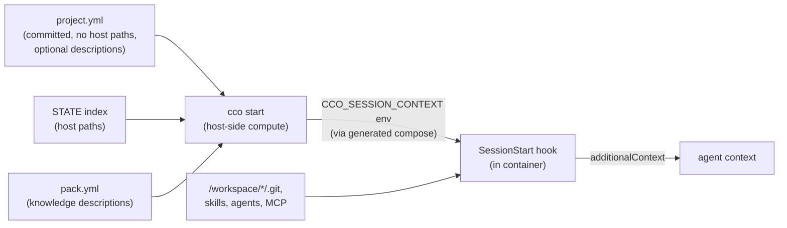

# Agent ↔ cco Access & Context — Design

> **Status**: Design **approved** (2026-07-02) — direction + the four open decisions
> ratified by the maintainer (see §9). **Implementation IN PROGRESS** on
> `feat/config-access/capability-model`: **Step 1 done** (`0e6bc87` — symmetric read scoping §4,
> `read-project` default, scope-aware operator help §4.3); **Step 2 done** (`8183b4a` — Level-A
> hook injection §3, `workspace.yml` file retired, `CCO_SESSION_CONTEXT` env, INV-2/3/4); Steps
> 3–7 pending (tracked in [`impl-handoff.md`](impl-handoff.md)). Living design doc (see
> `.claude/rules/documentation-lifecycle.md`): it reflects the target behavior and is
> rewritten in place.
>
> **Scope**: how a Claude agent running inside a cco session (a) becomes *aware* of its
> cco environment and the project's resources, and (b) is granted *read/write* access to
> the cco configuration. This is the **agent-facing** view of configuration — orthogonal
> to how config is *structured/distributed/shared* (that lives in
> [`../decentralized-config/design.md`](../decentralized-config/design.md)). The two
> cross-reference each other.
>
> **Authoritative decisions**: [ADR-0042](decisions/0042-agent-cco-interaction-model.md)
> (this model) builds on [ADR-0036](../decentralized-config/decisions/0036-session-config-capability-model.md)
> (capability knobs) and **supersedes the workspace.yml surface of**
> [ADR-0041](../decentralized-config/decisions/0041-unified-session-info-surface.md) (R1).
> The §4 access model is unified by [ADR-0046](decisions/0046-unified-cco-access-model.md)
> (the `(G, Pc, Po)` three-axis model; D1 of hardening-v2) — presets become symmetric-ladder
> sugar over the axes.

---

## 1. Problem & motivation

A cco session is a Claude agent in a Docker container with repos and config mounted. The
agent needs two distinct things:

1. **Awareness** — know *what* is around it: which repos/mounts/packs/llms exist, where
   (container paths, and — when allowed — host paths), the CLAUDE.md scope hierarchy, and
   that it is running under cco.
2. **Operation** — the ability to *read* and, at higher privilege, *write* cco
   configuration (packs, templates, project config, global store), safely.

The previous mechanism (`packs.md`, then the unified `workspace.yml`) delivered awareness
as a **generated file** overlaid into the session. That approach accreted problems
(grounded in the current tree):

- **P-a — generated file in the committed config tree.** `<repo>/.cco/claude/workspace.yml`
  is git-tracked in real installs (violates ADR-0005 F1: generated files must not live in
  committed config). Same for stale `packs.md` and `scheduled_tasks.lock`.
- **P-b — a config-looking file that is actually a cache artifact** confuses users: it is
  editable from the repo, versioned, yet regenerated each start.
- **P-c — broken description round-trip.** `workspace.yml` is mounted `:ro`; the
  `init-workspace` skill and the file's own header instruct editing descriptions *in the
  file*, which silently fails. Descriptions never persist through it.
- **P-d — duplication/divergence risk** between `project.yml` (the real config) and
  `workspace.yml` (the derived snapshot) for the same data (resources, descriptions).

The redesign removes the file entirely and reframes awareness+operation as one coherent
**three-level interaction model**.

## 2. The three-level model (A / B / C)

All communication and context between cco and the agent is modeled and implemented through
three levels. Every context element below is classified as A, B, or C.

```mermaid
flowchart TD
  subgraph cco["cco (host + baked image)"]
    A["A — Hook context injection\n(SessionStart / SubagentStart)"]
    B["B — Wrapped cco CLI\n(container-operator, access-gated)"]
    C["C — Managed .claude resources\n(rules / skills, baked at /etc/claude-code)"]
  end
  A -->|"short, always-present:\nenv + resources + 'use cco for more'"| Agent["Claude agent"]
  Agent -->|"on-demand detail\n(read/write per access)"| B
  C -->|"enforcement + awareness\n(always loaded, access-gated sections)"| Agent
```

- **(A) Hook context injection** — a short, always-present block injected into the session
  (and each subagent) at start. Introduces cco + the execution environment, lists the
  project's resources (with optional descriptions), and **declares that a wrapped `cco` is
  available** for more detail. Replaces and integrates the old `workspace.yml`. Contains
  **only information that is fixed for the session's lifetime** (see §5 invariant).
- **(B) Wrapped `cco` CLI** — the in-container `cco` (container-operator mode, ADR-0036 D4),
  gated by the per-project access knobs. The agent uses it for richer, on-demand
  read (and, at edit levels, write) — so the injected block (A) stays minimal.
- **(C) Managed `.claude` resources** — rules (and skills) baked into the image at
  `/etc/claude-code/.claude/`. They carry enforcement + awareness that is framework-wide
  and version-stable, including **access-gated** guidelines that only apply when the
  session has write privilege.

### Division of labour

| Concern | Level | Why there |
|---|---|---|
| "You are in a cco container; repos at `/workspace/<name>`; CLAUDE.md scope global→project→repo; Docker env" | **C** (+ 1-line pointer in A) | Framework-wide, version-stable → baked managed CLAUDE.md/rules |
| Project **resources** (repos, extra_mounts, packs, llms) + optional **descriptions** | **A** | Project-specific, fixed at start; computed host-side from `project.yml` + index |
| Host↔container **path_map** (when `show_host_paths`) | **A** | Needs the host-side index; fixed at start |
| **Declaration** that wrapped `cco` is available + current access scope + "use it for detail" | **A** (capability lives in **B**) | Makes the agent aware it can query on-demand |
| Detailed/ò on-demand resource info (`cco list`, `cco … show`, `cco project coords`, `cco docs`) | **B** | Dynamic, always fresh, avoids bloating A |
| Enforcement: memory-policy, documentation-first, use-official-docs (llms.txt) | **C** | Already managed rules |
| **Config-interaction guidelines** (diff+status before edit, atomic config commits, `cco config save` / `cco project save`) | **C**, access-gated | Applies only when `cco_access ≥ edit` |
| `init-workspace` reminder if CLAUDE.md is empty/absent | **A** (nudge) | Dynamic, one-shot |

## 3. Level A — hook context injection (replaces workspace.yml)

**No `workspace.yml` file exists anymore — not in the committed tree, not in CACHE.** The
context is delivered as injected text, never as a file the user sees, edits, or commits.

**Split generation (grounded in `config/hooks/session-context.sh`):**

- **In-container discovery** (the hook already does this — keep it): repos are found by
  scanning `/workspace/*/.git`; skills/agents/MCP by scanning the mounted trees. This is
  inherently non-stale (reads the actual filesystem).
- **Host-side computation** (new): `cco start` already resolves `project.yml` + the STATE
  index + the access knobs. It computes the parts that need host data — **resource
  descriptions** (from `project.yml`), the **knowledge/llms index** (paths + descriptions
  from each `pack.yml`), the **path_map** (host↔container, from the index), and the
  **access-scope declaration** — and passes them to the container as an **environment
  variable** (set in the generated `docker-compose.yml`, which is a cache artifact, not a
  config file). The SessionStart/SubagentStart hooks emit that block as `additionalContext`,
  merged with the in-container discovery.

**Why env var, not a file**: it satisfies "no file" (P-a/P-b), needs no `:ro` overlay, and
carries no staleness (recomputed every start). The block is deliberately **short** —
resource names + optional one-line descriptions + a pointer to wrapped `cco` — because
detail is available on-demand via Level B.

## 4. Level B — wrapped `cco`, with read scoping

Wrapped `cco` (ADR-0036 D4) is the on-demand channel. Two changes:

1. **The `(G, Pc, Po)` access model** (unified 2026-07-08 —
   [ADR-0046](decisions/0046-unified-cco-access-model.md), supersedes the opaque
   level enum as the base model). Access is a triple of three resource axes, each on the
   lattice `none < ro < rw`:
   - **G** — the global store `~/.cco` (packs, templates, llms, remotes, `.claude`, DATA
     registries), governing its **non-referenced** portion. `~/.cco` is *always* mounted
     (filtered) while cco is enabled: the project's **referenced** packs/llms are always
     in-scope with `Pc` (excluding them would break the project); `G` decides whether the
     **rest** of the store is visible (`ro`) / writable (`rw`) or hidden (`none`).
   - **Pc** — the **current** project's config (`<repo>/.cco`). Floor `ro` while cco is
     enabled (ADR-0046 INV-2). Multi-repo: default = the cwd repo's `.cco`; opt-in
     `access.cco.include_member_configs` extends `Pc` to all member repos' (divergent) `.cco`.
   - **Po** — **other** projects' config. `Po ≤ Pc` (ADR-0046 INV-4); `Po ≠ none ⇒ Pc ≠ none`
     (ADR-0046 INV-3).

   > **Note on invariant labels.** The `INV-n` above are **[ADR-0046](decisions/0046-unified-cco-access-model.md)'s
   > model invariants** (lattice / floor / see-self / no-more-than-self), distinct from this
   > design's own **§5 INV-1…5** (which are numbered independently). Qualified as "ADR-0046 INV-n"
   > wherever referenced here to avoid the collision.

   Unspecified axes **auto-promote** to the invariant floor, so a user declares only the
   maximal intent (`--cco-access current=rw,others=rw` → `(none, rw, rw)`). Secrets and tokens
   remain masked/absent in every case (unchanged from ADR-0036). The read/write behaviour of
   every consumer (mount-gen, shim, output-scoping) derives directly from the triple — one
   source (INV-E; ADR-0046 §7).

   **Named levels survive as a *symmetric ladder* of sugar** over the triples — `read-project`
   `(none,ro,none)` · `read-global` `(ro,ro,none)` · `read-all` `(ro,ro,ro)` · `edit-project`
   `(none,rw,none)` · `edit-global` `(rw,rw,none)` · `edit-all` `(rw,rw,rw)`. Every **asymmetric**
   intent (e.g. curate-global-only `(rw,ro,none)`, edit-all-projects-not-global `(ro,rw,rw)`,
   edit-global-consult-all `(rw,ro,ro)`) is **granular-only**, so a named preset is never
   ambiguous. `access.cco` accepts either a scalar (preset) or a `{global,current,others}` map.

2. **Normal-project default becomes `read-project`** (was `none`; **decided 2026-07-02**).
   This is what makes the three-level model work in ordinary sessions: the agent can *query*
   its environment on-demand, so Level A stays minimal. Trade-off in
   [ADR-0042](decisions/0042-agent-cco-interaction-model.md) §Consequences (read-only,
   project-scoped, secrets always masked → low risk; the cost is that the wrapped `cco`
   shim is present in every session).

The cco user guides/docs are reachable in **any** session at any read level via the wrapped
verb `cco docs` — no extra mount is required (config-editor/tutorial still mount them
explicitly).

3. **Scope-aware help in-container (decided 2026-07-02).** `cco` is now used both on the
   host and inside a container (the caller-context signal D8 already distinguishes them).
   When `cco` runs in container-operator mode, its help/usage (`cco help`, `cco --help`, a
   command's usage) **reflects the wrapped scope**: host-only verbs are **still listed**
   (discoverability) but explicitly **flagged `(host only — run on your host)`**, and verbs
   above the current `cco_access` level are marked unavailable. The agent sees the full
   command surface yet knows what it can execute here versus what to hand to the user.
   Grounded: `usage()` (bin/cco) gains an operator-mode annotation pass keyed on the
   caller-context + resolved access.

Presets (ADR-0036 D6) restated on the new axis, **refined by
[ADR-0044](decisions/0044-internal-builtin-presets-and-config-editor-scope.md) +
[ADR-0048](decisions/0048-config-editor-min-privilege-refinement.md)**:
tutorial = `read-all` (read-only teacher — full context, no write risk), config-editor
= **minimum-privilege by mode** (project mode `(ro,rw,none)` — edit the project, read the
store; global mode `(rw,none,none)` — edit the store only, project-less; `--all`/`edit-all`
is an explicit widener). config-editor's G is clamped `≥ ro` (an authoring tool always sees
the store) and its `claude_access` follows G. See §8 for the two-regime principle and
config-editor's mount scope.

### 4.4 CLI environment-awareness is now a surface-wide property

Making the wrapped `cco` a *primary* channel (Level B) and defaulting normal sessions to
`read-project` means the **entire** CLI surface is dual-context: the same binary is invoked
by a human on the host **and** by an agent inside a container. Verbs that were historically
"host-only / user-facing" are now reachable in-session. This is no longer a per-command
concern — **every** command must determine its execution environment (via the caller-context
signal D8 / `_cco_container_operator`) and behave correctly, defaulting to the safe
container behavior (refuse + redirect to host) when in doubt. The shim (`_cco_operator_shim`)
is the first gate, but resolver guards, secret masking, host-path hygiene, and scope-aware
help are per-command responsibilities too.

This principle — and the checklist every new/changed verb must follow — is captured as a
standing reference so future CLI work inherits the correct method:
**[`docs/maintainers/cli/design/design-cli-environment-awareness.md`](../../cli/design/design-cli-environment-awareness.md)**.
The **definitive per-verb classification** — every verb by enforcement side (config-content /
internal-store / environment-host) and resource area (`(G,Pc,Po)` × read/write, ADR-0046 §7),
with the shim's hardcoded level literals replaced by a **gate-by-resource-area** derivation —
is the D3/A1 analysis
**[`e2e-review/analysis/A1-command-scope-matrix.md`](e2e-review/analysis/A1-command-scope-matrix.md)**,
the oracle the [CLI-surface matrix](../../cli/reference/cli-surface-matrix.md) and the e2e v2
pass derive from.

## 5. Invariants

- **INV-1 — Level A carries only session-fixed information.** The injected block is a
  start-time snapshot; mounts and resources are immutable for the session's lifetime
  (Docker bind-mount invariant). Anything that can change during a session, or that the
  agent needs *fresh*, is obtained via Level B (wrapped `cco`), never baked into A. (This
  is the property `workspace.yml` had, preserved without the file.)
- **INV-2 — No generated artifact in the committed config tree.** No `workspace.yml` /
  `packs.md` / lock files under `<repo>/.cco/` or `~/.cco/`. Committed config stays
  machine-agnostic (ADR-0005 F1, AD3).
- **INV-3 — Descriptions have exactly one structured source: `project.yml`.** No derived
  copy is persisted; Level A renders them at start. No round-trip, no divergence.
- **INV-4 — Host paths never touch committed files.** `path_map` is a runtime view in
  Level A only, gated by `show_host_paths` (AD3, ADR-0041 R1-D3).
- **INV-5 — The internal store is reachable only through `cco` (privilege boundary).**
  The internal XDG store (STATE index, DATA registries, CACHE internals) is confined behind a
  privilege boundary — a dedicated `cco-svc`-owned, mode-0700 real-FS parent the `claude` user
  cannot traverse, crossed only by a setuid helper that enforces `(G,Pc,Po)` (ADR-0046 §7).
  The agent has **no direct filesystem access** to it; `cco` is the sole path. Config-content
  trees are exempt (native reads). Level B output-scoping (§4) is defense-in-depth, not the
  confidentiality control. Physically closes S1/S1b. See
  [ADR-0047](decisions/0047-config-access-enforcement.md).

## 6. Descriptions — provenance

Two homes, distinct intents, no duplication:

- **`project.yml` — structured, optional source of truth.** New optional fields
  `repos[].description`, `extra_mounts[].description` (packs already carry per-knowledge-file
  descriptions in `pack.yml`). Machine-agnostic, committed, shareable. **Rendered into
  Level A** at start. Authored by the user, or by an agent in a session that has
  **`cco_access ≥ edit-project`** (config-editor, or `cco start <project> --cco-access edit-project`).
- **`CLAUDE.md` — rich narrative.** Authored by `init-workspace` in a normal session (which
  has repo read + rw `.claude`). The place for prose architecture/stack/commands.

**The authoring tension (resolved).** The two capabilities needed to author good
structured descriptions — *exploring the repos* and *writing `project.yml`* — do not
co-occur in the base presets (normal has repo access but `cco_access` too low to write
config; config-editor writes config but has no repos). The resolution is the redesigned
**`config-editor --project <name>`** (see §8), which mounts *both* the project's `.cco`
config *and* its repos — the natural, explicit session for authoring repo-aware
descriptions into `project.yml`. Absent that, descriptions are simply optional and the
narrative lives in CLAUDE.md.

## 7. init-workspace — responsibility split

`init-workspace` is split to match the new model:

- **Keeps**: authoring/refreshing the project **CLAUDE.md** (like `/init`, multi-repo /
  pack aware). Works in a normal session (repo read + rw committed `.claude`).
- **Drops**: the broken `workspace.yml` description write-back (the file no longer exists).
- **Optionally gains** (only when the session has `cco_access ≥ edit-project`): writing the
  optional structured descriptions into `project.yml`.
- **Not required**: Level A awareness does **not** depend on `init-workspace` — resources,
  knowledge, llms, and paths are always injected. Forgetting it degrades only the *rich
  CLAUDE.md*, never the session. A gentle **nudge** in Level A (when CLAUDE.md is
  empty/absent) replaces the previous silent dependence.

## 8. Two regimes + config-editor UX

> **Refined by [ADR-0044](decisions/0044-internal-builtin-presets-and-config-editor-scope.md)
> (2026-07-07) + [ADR-0048](decisions/0048-config-editor-min-privilege-refinement.md)
> (2026-07-11, WS-A).** The 2026-07-02 §8 made bare `config-editor` default to a broad
> `edit-all` surface — superseded by ADR-0044 (min-privilege, `--all` is the explicit
> widener). ADR-0048 refines it further: project mode edits the project but **reads** the
> store (`(ro,rw,none)`, not `edit-global`), global mode is the honest project-less
> `(rw,none,none)`, `G` is clamped `≥ ro`, and `claude_access` follows `G`. This section
> reflects that current target.

**Two regimes.** Sessions fall into two classes with different scope-default rules:

- **Standard projects** — the uniform scope model: default minimum privilege
  (`repo`/`read-project`/on); flags widen or narrow. The started project and the cwd
  project coincide.
- **Internal built-ins** (tutorial, config-editor) — **special sessions that define their
  own explicit, motivated preset rules and exceptions**. The discriminator is **read-only
  vs write**: a read-only built-in (tutorial) may default to a *broad read* scope (full
  context, no mutation risk → `read-all`, §4); a write-capable built-in (config-editor)
  MUST default to *minimum privilege* and widen only via an explicit flag. A built-in may
  also carry structural exceptions — e.g. config-editor's *started project* is always
  `config-editor` while the projects it may **edit** are a separate set (D9 /
  `CCO_CONFIG_TARGETS`), so **started-project ≠ scoped-config-project** (unlike a standard
  session, where they are the same).

**config-editor model (ADR-0044 → ADR-0048):**

| Command | `~/.cco` (store) | Project `.cco` | Resolved `(G,Pc,Po)` | `claude` | Intent |
|---|---|---|---|---|---|
| `cco start config-editor` **in a project cwd** | **ro** | the cwd project's, rw | `(ro,rw,none)` | repo | Edit *this* project's config; **read** the store to reference it |
| `cco start config-editor` **outside any project** | **rw** | — (project-less) | `(rw,none,none)` | all | Edit the personal store only |
| `cco start config-editor --project <name>` (repeatable) | **ro** | that project's, rw **+ its repos** | `(ro,rw,none)` | repo | Configure project X *aware of its code*; author repo-aware `project.yml` descriptions |
| `cco start config-editor --project X --cco-access edit-global` | **rw** | that project's, rw | `(rw,rw,none)` | all | Edit project X **and** the store |
| `cco start config-editor --repo <name>` | (as its mode) | (as its mode) + a specific repo | (as its mode) | (as its mode) | Fine-grained: add one repo for reference |
| `cco start config-editor --all` / `--cco-access edit-all` | **rw** | **every** resolvable project's, rw (no repos) | `(rw,rw,rw)` | all | Broad cross-project config editing (**explicit** opt-in) |

Writing `~/.cco` from project mode is a **distinct, explicit** intent
(`--cco-access edit-global`) — the default reads the store but does not write it
(least privilege). The cwd is a **convenience default** for *which project* to scope —
always overridable by `--project`/`--all`; it picks the default target, it does not rigidly
bind the session (reconciling the ADR-0042 "config-editor is not cwd-based" argument). The
outside-a-project default is **global-only** and honestly project-less; the every-project
surface is reached **only** via the explicit `--all`/`edit-all`. Two floors keep the tool
usable and coherent: **`G ≥ ro`** (an authoring session always *sees* the store — an
explicit narrower `--cco-access` is clamped up, with a notice) and **`claude_access`
follows `G`** (global `.cco/.claude` authoring is writable only when the store is — no
writable-rules/read-only-packs asymmetry). cco widens access via explicit flags, never an
interactive prompt.

**On "no repo content mounted" (P18 / ADR-0036 D6).** Unchanged: the default config-editor
mounts no repos; mounting repos is an explicit opt-in via `--project`/`--repo`. ADR-0036 D6 +
P18 are *refined*, not broken.

## 9. Decisions & deferrals

**Decided 2026-07-02** (maintainer):

1. **Normal-project default = `read-project`** (was `none`) — §4. Enables the on-demand
   model; accepted trade-off (wrapped `cco` present in every session; read-only,
   project-scoped, secrets masked).
2. **config-editor default = broad** (all projects' `.cco` + personal store, no repos);
   **`--project <name>` narrows and mounts that project's repos** (repo-aware config
   authoring); `--repo <name>` adds a single repo — §8. **⤷ Superseded 2026-07-07 by
   [ADR-0044](decisions/0044-internal-builtin-presets-and-config-editor-scope.md):
   config-editor now defaults to *minimum privilege* (cwd-project / global-only) and the
   broad every-project surface is an explicit `--all`/`edit-all`. tutorial → `read-all`.
   See §8 (two regimes).**
3. **`cco docs` reachable at any read level** in every session (no extra mount); the
   built-ins keep their explicit docs mount.
4. **Full symmetric read scoping** — `read-project | read-global | read-all` mirror the
   `edit-*` levels.
5. **Scope-aware in-container help** (§4.3): host-only verbs are shown but flagged
   `(host only — run on your host)`; verbs above the current access level marked
   unavailable. Discoverability without misleading the agent about what it can execute.
6. **`read-project` mount narrowing + unified output scoping** — the operator CONFIG bucket
   at `read-project` exposes only the project's referenced packs (§8, impl `9e4535f`); read
   verbs (`cco list`/`show`/…) scope their **output** to match, via one shared layer, with a
   count-only "hidden by scope" notice on stderr. Formalised in
   **[ADR-0043](../../cli/decisions/0043-unified-cli-environment-access-scope.md)** (extends
   this design; upgrades the CLI environment-awareness doc to v1.1 §4b).

**Deferred (evaluate separately, future evolution):**

- **Language rule** (`.claude/rules/language.md`): candidate to move from the template
  mechanism into Level A/C injection, to drop the template-interpolation path. Not in this
  sprint's scope; recorded as a follow-up.

## 10. Migration & cleanup (implementation-time)

Additive at the schema level (new optional `project.yml` fields + new access enum values),
but requires cleanup of the retired surfaces:

- **Migration (project scope, id 014)**: remove generated files from committed trees —
  `<repo>/.cco/claude/workspace.yml`, `packs.md`, `scheduled_tasks.lock` (idempotent).
- **`.gitignore`**: scaffold generated-file exclusions in `templates/project/base` and
  propagate to existing projects via the migration.
- **Investigate**: why an empty `packs.md` reappears in `.cco/claude/` (confirm `cco init` /
  `cco sync` never write generated files into the committed tree).
- **changelog #32** (additive: descriptions, `read-project`, new interaction model —
  "requires `cco build`").
- **Retire**: `lib/workspace.sh` (generator), the `workspace.yml` compose overlay, the
  `_ws_section` reader in the hooks (replaced by the env-var block), and the `workspace.yml`
  read in `init-workspace`.

## 11. Reading order

ADR-0036 (capability knobs) → ADR-0041 (R1, superseded surface) →
[ADR-0042](decisions/0042-agent-cco-interaction-model.md) (this model) → this doc →
`config/hooks/session-context.sh` + `lib/cmd-start.sh`.
