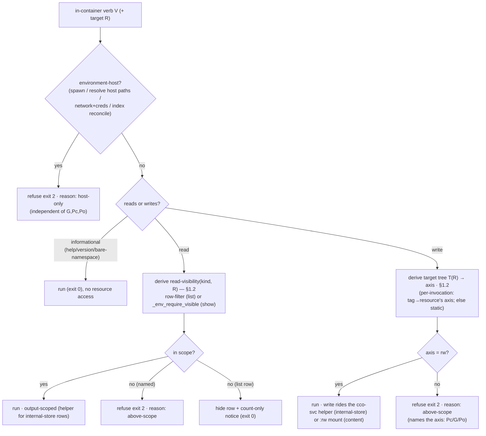

# A1 — Per-command info × scope matrix (D3)

> **Status**: Design analysis, **awaiting maintainer approval** (2026-07-08). Third and
> last design sub-phase of hardening-v2 ([`../../hardening-v2/handoff.md`](../../hardening-v2/handoff.md)
> §3 D3; implementation → [`../../hardening-v2/implementation-handoff.md`](../../hardening-v2/implementation-handoff.md)).
> Consumes the two
> ratified design outputs:
> - **[ADR-0046](../../decisions/0046-unified-cco-access-model.md)** — the `(G, Pc, Po)`
>   model (read-visibility §7 + write-authority §7 tables; multi-repo Pc §6).
> - **[ADR-0047](../../decisions/0047-config-access-enforcement.md)** — the internal-store
>   privilege boundary (config-content vs internal-store split; the setuid `cco-svc` gate).
>
> **Purpose**: the **definitive per-verb classification** that replaces the shim's hardcoded
> per-verb level list (`bin/cco:301-368`) with a **gate-by-resource-area** derivation, and
> feeds the setuid-helper gate (D2), the [CLI-surface matrix](../../../../cli/reference/cli-surface-matrix.md),
> and the e2e v2 oracle. **No implementation here** — this is the classification the implementer
> builds from.
>
> **Nature** (documentation-lifecycle): an **analysis** (history). It resolves the open items
> ADR-0046 §6 and the backlog left for D3 (tag **B5**, hint **B6**, `path`, `cco sync` of
> divergent members, coverage gaps). Living docs (matrix / `design.md`) are updated **⏳
> design-intent** only, never ahead of code.
>
> **Tracking**: [`../pre-revalidation-backlog.md`](../pre-revalidation-backlog.md) (A1 = D3).

---

## 0. What D3 replaces

Today the operator shim (`bin/cco` `_cco_operator_shim`, `:248-369`) gates each verb against a
**hardcoded scope literal**: `_op_write "tag $sub" global` (`:314`), `_op_write "config save"
global` (`:329`), `_op_read_scope global "remote list"` (`:336`), and so on. Two structural
problems the hardening-v2 review surfaced:

1. **The literal buries the *why*.** `tag` is gated `global` because its *storage* is the DATA
   registry — but the permission should follow the **tagged resource** (a project, a pack, a
   template), not the storage bucket. This makes the gate **both too strict and too loose**
   (the **B5** exemplar, §4).
2. **The literals are keyed to the *old* level enum**, which ADR-0046 redefines (`edit-global`
   `(rw,ro,none)`→`(rw,rw,none)`). A gate that names a *level* drifts when the level changes; a
   gate that names a **resource area** (an axis of the `(G,Pc,Po)` triple) does not.

D3's contribution: state, **per verb**, (a) the **info it exposes** and its scope-class, (b)
the **resource area** its action reads/writes as an **axis of `(G,Pc,Po)`**, (c) which **side of
the ADR-0047 boundary** it sits on (config-content mount vs internal-store helper), and (d) its
**correct per-scope behaviour** with a refusal reason. The shim then *derives* the gate from
(b) per-invocation, instead of carrying a literal.

---

## 1. The two orthogonal classification dimensions

Every in-container verb is classified on **two independent axes**. Neither subsumes the other.

### 1.1 The enforcement side (ADR-0047)

| Side | Trees | How it is gated | Verbs (examples) |
|---|---|---|---|
| **config-content** | `~/.cco` (packs/templates/llms/`.claude`), `<repo>/.cco` | directory mounts + `read-project` narrowing + secret-masking + `:ro`/`:rw` flags; native reads | `pack show`, `template show`, `config save`, `project coords`, `docs` |
| **internal-store** | STATE `index`, DATA (tags, remotes, `source`), CACHE internals | the **setuid `cco-svc` helper** enforces `(G,Pc,Po)` (ADR-0047 §2); the agent cannot traverse the mode-0700 parent | `list` (project rows), `path list`, `remote list/add/remove`, `tag add/remove`, `project show` (repo/host paths) |
| **environment-host** | — | the verb **cannot run in-container at all** (needs host: container spawning, host-path resolution, network+credentials, machine-local index reconciliation). Refused **regardless** of `(G,Pc,Po)`. | `start`, `resolve`, `sync`, `config push`, `pack publish`, `path set` |

> **A verb may touch both content and internal-store** (e.g. `cco list` enumerates
> config-content dirs **and** reads the STATE index / DATA registries). It is then gated on
> **both** sides: content by the mount, internal reads by the helper. The table below names the
> **dominant** side per verb and flags dual ones.

### 1.2 The resource area (ADR-0046 §7) — the gate

The **axis** of `(G, Pc, Po)` the verb's action touches, and whether it **reads** or **writes**
it. This is the value the shim derives per-invocation.

**Read-visibility** (a read verb / a `list` row is visible iff):

| Kind read | Visible when |
|---|---|
| current project | `Pc ≥ ro` (always, INV-2) |
| referenced pack / llms | `Pc ≥ ro` (rides with the project) |
| unreferenced pack / llms | `G ≥ ro` |
| template / remote | `G ≥ ro` |
| other project | `Po ≥ ro` |

**Write-authority** (a write verb is allowed iff):

| Target tree written | Requires |
|---|---|
| current project `<repo>/.cco` | `Pc = rw` |
| other project `<repo>/.cco` | `Po = rw` |
| global store `~/.cco` (packs/templates/llms, `config save`) | `G = rw` |
| DATA registry — **by tagged/target resource** (see B5, §4) | the resource's axis `= rw` |

### 1.3 Refusal taxonomy (R9 / B6)

`exit 0` success-or-degrade · **`exit 2` policy refusal**, always with a **stated reason** —
either *host-only* (environment-host class) **or** *above-scope* (resource-area gate not met) ·
**`exit 1`** unknown verb / subcommand / parse error. **Invariant B6 (§5): no silent exit-2.**

### 1.4 The derivation the shim performs (replacing the literal)

---

## 2. The per-verb matrix

Legend — **Area**: the `(G,Pc,Po)` axis + `ro`/`rw` the action needs (read-visibility or
write-authority, §1.2). **Side**: config-content (C) · internal-store (I) · environment-host
(H). **From**: the minimum symmetric-ladder preset that satisfies it (the gate is by axis, this
is the ergonomic name). ⏳ = behaviour changes vs the shipped shim once ADR-0046/0047 land.

### 2.1 Environment-host — refused in-container regardless of `(G,Pc,Po)`

| Verb | Info exposed | Side | Per-scope behaviour | Refuse reason |
|---|---|---|---|---|
| `start`, `stop`, `new` | — | H | refuse at every level | host-only (spawns/needs containers) |
| `build` | — | H | refuse | host-only (rebuilds the image) |
| `resolve`, `sync`, `init`, `join`, `forget` | — | H | refuse | host-only (resolves host paths; writes the STATE index) |
| `update`, `clean`, `chrome` | — | H | refuse | host-only |
| `path set` | — | H (index write) | refuse | host-only (machine-local index mutation) |
| `config validate` | machine-local STATE (host paths) | H | refuse | host-only (sweeps STATE; would leak host paths in-container) |
| `config push`, `config pull` | — | H | refuse | host-only (network + credentials) |
| `remote set-token`, `remote remove-token` | — | H | refuse | host-only (secrets stay off the container) |
| `pack\|template publish`, `pack\|template export` | — | H | refuse | host-only (network / archive materialization) |
| `project export`, `project import`, `project add` | — | H | refuse | host-only |
| `project rename` | — | H (re-keys index/DATA) | refuse | host-only (re-keys machine-local state) |

> **The environment-host class is the answer to "why not just widen the scope?"** — these verbs
> are refused because they **need the host**, not because the session's `(G,Pc,Po)` is too
> narrow. Even `edit-all` in-container cannot run them. Grounded: `bin/cco:304` (blocklist),
> `:328` (config validate), `:330/:338/:351/:359-360` (the rest). See §4.4 for `cco sync`.

### 2.2 Read / introspection — gate by read-visibility

| Verb | Info exposed (scope-class) | Area | Side | Per-scope behaviour | From |
|---|---|---|---|---|---|
| `help`, `--help`/`-h`, `--version`/`-v` | — | — | — | always run; help is scope-filtered (§5) | any |
| `whoami` | this session's own resolved access state (no store read) | — | env only | always run | read-project |
| `docs` | framework docs (static/CACHE) | none (content) | C | always run | read-project (refused at `none`, R6) |
| `list` (unified) | cross-kind index | per row (§1.2) | C+I | run; **each row** filtered by read-visibility; count-only notice | read-project |
| `list projects` | project names/status | project → other:`Po≥ro` | I (index) | current row always; others need `Po≥ro`; else hidden+notice | read-project |
| `list packs\|llms` | pack/llms names | referenced:`Pc`; other:`G≥ro` | C (dir) | referenced rows always; unreferenced need `G≥ro` | read-project |
| `list templates\|remotes` | template/remote names (remote = de-tokenized URL) | `G≥ro` | C (templates) / I (remotes) | whole kind hidden below `G≥ro` → refuse (bare `list <kind>`) or empty+notice | read-**global** |
| `project show` | roles, **repos → host paths** (index), referenced-by | current:`Pc≥ro`; other:`Po≥ro`; host paths gated by `show_host_paths` | C+I | `_env_require_visible project` (`cmd-project-query.sh:143`); other project → refuse above-scope | read-project (own) / read-all (other) |
| `project validate` | validity of project.yml | current:`Pc`; other:`Po` | C+I | `_env_require_visible` (`cmd-project-validate.sh:311`) | read-project (own) |
| `project coords` | logical name + `url`/`ref` coordinates | current:`Pc`; other:`Po` | C | row-filtered (`cmd-project-coords.sh:51`) | read-project (own) |
| `pack show\|validate`, `llms show\|validate` | resource detail | referenced:`Pc≥ro`; unreferenced:`G≥ro` | C | `_env_require_visible` (`cmd-pack.sh:164`, `cmd-llms.sh:339`) | read-project (referenced) / read-global |
| `template show\|validate` | template detail | `G≥ro` | C | `_env_require_visible template` (`cmd-template.sh:202`) | read-**global** |
| `remote list` | de-tokenized remote URLs | `G≥ro` | I (DATA) | refuse below `G≥ro` | read-**global** |
| `path list` ⏳ | logical→host path index rows | current+referenced (like `list project`); host paths gated by `show_host_paths` | I (index) | ⏳ **scope output** (see §4.3); today unscoped `return 0` (`:305`) | read-project |
| `config`/`tag`/`pack`/`template`/`llms`/`project`/`remote` (bare) | sub-usage text | — | — | always run (dispatcher prints sub-usage) | any |

### 2.3 Write — gate by write-authority (per target tree)

| Verb | Target tree → area | Side | Per-scope behaviour | From |
|---|---|---|---|---|
| `tag add\|remove` ⏳ | **the tagged resource's axis** — project(current)→`Pc=rw`, project(other)→`Po=rw`, pack/template→`G=rw` (§4.1) | I (DATA) | ⏳ per-target gate; today blanket `G` (`:314`) | edit-project (own project) / edit-global (pack/template) / edit-all (other project) |
| `config save` | `~/.cco` personal store → `G=rw` | C+I (commit) | run at `G=rw`; else refuse above-scope naming `G` | edit-global |
| `remote add\|remove` | DATA remotes registry → `G=rw` (personal-global; **no** project ownership → never per-target) | I (DATA) | run at `G=rw`; `remote add --token` refuses the **token half** in-container | edit-global |
| `pack\|template\|llms create\|update\|remove\|install\|import\|internalize\|rename` | `~/.cco` global store → `G=rw` (+ DATA `source`/tags on install/rename) | C+I | run at `G=rw`; network fetches (`install\|update\|import`) allowed at edit level (D4 carve-out) | edit-global |

> **No wrapped project-config write verb exists.** Editing `<repo>/.cco/project.yml` at
> `Pc=rw` is done by writing the **mounted file directly** (`:rw`), not a `cco` verb — the
> shim's `write:project` gate (`_op_write … project`) exists for completeness/future verbs and
> is exercised **only** by `tag` on the current project after B5 (§4.1). The managed rule
> `cco-config-interaction.md` governs edit safety.

### 2.4 Errors & removed

| Case | Behaviour | Exit |
|---|---|---|
| unknown top-level verb | error, "Run `cco help`" — **not** a host-only misfire (`:367`) | 1 |
| unknown subcommand (`tag foo`, `config foo`, …) | `_op_unknown_sub` (`:294`) | 1 |
| `pack\|template\|project list` (old subcommand) | redirect "use `cco list <kind>`" (ADR-0029, `:344/:358`) | 2 |
| `share`, `manifest` | removed (`:363`) | 2 |
| `<cmd> --help`/`-h` | always run (informational), even for host-only verbs (`:299`) | 0 |

---

## 3. What this changes in the shim (design-intent, not code)

- **Write gate becomes a target→axis derivation.** `_op_write <label> <literal-scope>` is
  replaced by `_op_write <label> <axis-derived-from-target>`. For every write verb except
  `tag`, the target tree is **static** (pack/template/llms/`config save` → `G`; a future
  project-config verb → `Pc`), so the axis is a constant — but a constant **named as the axis**,
  which survives the ADR-0046 `edit-global` redefinition unchanged. `tag` alone derives the
  axis **per-invocation** from the tagged resource (§4.1).
- **The write itself rides the ADR-0047 boundary.** For internal-store targets (tag/remote →
  DATA, provenance) the setuid helper performs the `(G,Pc,Po)` check from the **trusted session
  descriptor** (ADR-0047 R2), not from `argv`/env — the shim gate is defense-in-depth in front
  of it. For config-content targets the `:rw` mount remains the physical gate.
- **Read gate is unchanged in shape** (`_op_read_scope`), but its output-scoping for
  internal-store rows (`list` project rows, `path list`, `remote list`) is now enforced **by
  the helper**, with `access-scope.sh` demoted to ergonomics/defense-in-depth (ADR-0047 §4).
- **`_cco_write_scope_satisfies`** (`access-scope.sh:98-103`) collapses into a per-axis lattice
  compare once the enum is the `(G,Pc,Po)` triple (ADR-0046 §7).

---

## 4. Resolved decisions

### 4.1 B5 — `tag` gated by the tagged resource (the exemplar)

**Problem** (`bin/cco:314`, `lib/tags.sh`): `cco tag add/remove` is gated blanket `write:global`
because tags live in the DATA registry (`_tags_file` → `<data>/cco/tags.yml`, `tags.sh:30`).
But a tag targets a **project, pack, or template** (`_tags_detect_kind`, `tags.sh:162-174`), and
the storage bucket is **irrelevant** to the permission. The blanket gate is:
- **too strict** — an `edit-project` session cannot tag **its own** current project (`G=none`
  there, but the intent is a `Pc` write); and
- **too loose** — an `edit-global` session can tag **another** project (needs `Po=rw`, which
  `edit-global`=`(rw,rw,none)` does **not** grant).

**Decision — gate per-invocation by the tagged resource's axis** (write-authority §1.2):

| Tagged kind (`_tags_detect_kind`) | Ownership | Axis required | Reachable via |
|---|---|---|---|
| project | **current** (== `PROJECT_NAME`, or a `CCO_CONFIG_TARGETS` entry for config-editor) | `Pc = rw` | edit-project + |
| project | **other** | `Po = rw` | edit-all / granular `others=rw` |
| pack | (global-store resource) | `G = rw` | edit-global + |
| template | (global-store resource) | `G = rw` | edit-global + |

**Rationale for pack/template → `G`** (not "ride with `Pc` if referenced"): a pack/template is a
**global-store** resource; the referenced-subset invariant (ADR-0046 §1) governs its **read
visibility** riding with `Pc`, **not** write authority over it. Tagging is a curation *write* on
a global resource → `G=rw`, uniformly, referenced or not. This keeps the axis derivation a pure
function of the resource (no dependency on the current project's reference set), consistent with
the write-authority table.

**Implementation notes (for the build phase, not decided further here):**
- The **kind + ownership must be resolved before/at the gate** — today detection lives *inside*
  `cmd_tag` (`tags.sh:216-223`), after the shim passed. Move the resolution ahead of the write
  gate (or gate inside the helper, which is where the DATA write already lands under ADR-0047).
- The **ownership predicate** must treat config-editor correctly: "current" = `PROJECT_NAME`
  for a normal session, but the **set** `CCO_CONFIG_TARGETS` for config-editor (where
  `PROJECT_NAME` is always `config-editor`, D9). `_env_current_project` (`access-scope.sh:129`)
  today reads `PROJECT_NAME` only — extend it (or the tag gate) to the config-target set.
- **Ambiguous name** (pack **and** project) → `_tags_detect_kind` rc=2 → error (exit 1) unless
  `--pack/--project/--template` forces it (`tags.sh:219-222`); the gate uses the forced kind.
- **`remote add/remove` is deliberately NOT per-target** — remotes have no project ownership;
  they are purely personal-global → always `G=rw`. Stated here so the asymmetry with `tag` is
  explicit, not an oversight.

### 4.2 B6 — the hint invariant (assert across the surface)

**Every `exit 2` refusal carries a reason** — *host-only* (§2.1) **or** *above-scope* (§2.2/2.3
naming the axis) — and **`exit 1` is reserved** for unknown verb/subcommand/parse error. Audit
of `_cco_operator_shim` confirms no silent `exit 2` path today:
- host-only arms → `_op_hostonly`/inline `refuse` with `$host_hint` (`:292`, `:328/:330/:338/:359`);
- above-scope arms → `_op_write`/`_op_read_scope`/`_env_require_*` all `refuse` with a scope
  message (`:271-286`, `access-scope.sh:233/235/249`);
- unknown → `die` (exit 1, `:294/:367`).

**Requirement carried to the fix phase**: when the tag gate moves to the helper (§4.1) and when
`path list` gains output-scoping (§4.3), their refusals must keep the reason (above-scope,
naming the axis) — B6 holds *after* the refactor, not just before. `tests/test_operator_shim.sh`
pins it; extend it for the tag per-target and `path list` cases.

### 4.3 The `path` decision

**Keep the low-level `path list` verb; scope its output.** `cco path list` reads the STATE
index (logical→host paths) — an **internal-store** read now behind the ADR-0047 helper. Today it
is `return 0` unconditionally (`bin/cco:305`), i.e. **unscoped** — the S1b host-path leak
surface.

- **Decision**: `path list` stays available from `read-project`, but its **output is scoped like
  `cco list project`** — current project + referenced rows only (read-visibility §1.2), other
  projects need `Po≥ro`; **host-path columns gated by `show_host_paths`** (now *trustworthy*
  because the helper enforces it — S1b closed). At `show_host_paths=off` it renders logical
  names only.
- **`path set` stays host-only** (§2.1) — an index mutation that reconciles machine-local state.
- **Rejected**: a *new* dedicated agent-facing path verb. `path list` already exists; scoping
  its output is the **minimal, consistent** fix (the same output-scoping pattern every other
  read verb uses), and the session already receives a scoped `path_map` via `CCO_SESSION_CONTEXT`
  when `show_host_paths=on` — a second verb would duplicate it.

### 4.4 `cco sync` of divergent members — **host-only, including config-editor** (closes ADR-0046 §6)

ADR-0046 §6 left open whether an in-container **config-editor** session may run `cco sync` of
divergent member repos. **Decision: no — `cco sync` stays host-only for every session**,
config-editor included.

**Rationale** (grounded in the environment-host class, §1.1):
- `cco sync` is in the **resolve/sync host-only family** (ADR-0036 D4; `bin/cco:304`). It
  **materializes** resolved config into repo working trees and depends on **host path
  resolution** (the STATE index of logical→host paths) and potentially **clone-from-url**
  (network) — none of which is coherent or safe in-container.
- A config-editor session's job is editing config **content** (the committed `<repo>/.cco` it
  mounts `:rw`); **materializing** that content across member repos is a distinct **host**
  action (index + working-tree + network), not a config edit. The privilege boundary (ADR-0047)
  confines the internal store precisely so the agent does **not** drive index-reconciling
  operations.
- Therefore reconciling divergent member configs remains a **human host action** (`cco sync` on
  the host). This is univocal and needs no per-session carve-out. **The `include_member_configs`
  flag (ADR-0046 §6) already covers the legitimate in-container need** — it *mounts* all member
  `<repo>/.cco` at the resolved `Pc` level so a config-editor session can **read/edit** them;
  it does not need `cco sync` to do so.

> **Maintainer gate item** — this closes an ADR-0046-deferred question; confirm at approval so
> ADR-0046 §6 can be forward-annotated "resolved in A1: host-only."

### 4.5 Coverage gaps

- **`cco state`? — do not add.** Internal-store introspection is already covered by `list`
  (rows), `path list` (index, §4.3), `remote list` (DATA), and `whoami` (session state), each
  scoped. A dedicated `cco state` would be a **new confidential surface** (a raw internal-store
  dump) for no capability gain. **Decision: no new verb in this phase.** If ever added, it is an
  internal-store read behind the helper, output-scoped like `path list`.
- **`whoami` completeness — extend at implementation.** Today `cmd_whoami` (`lib/cmd-whoami.sh:38-59`)
  prints the *level* + derived read/write scope + per-tree `rw`/`ro`. Under ADR-0046 it should
  render the **resolved `(G, Pc, Po)` triple explicitly** (each axis `none|ro|rw`), mention the
  granular `{global,current,others}` form, and (ADR-0047) state that enforcement is the
  **privilege boundary** (so the agent knows the internal store is confined, not just
  output-filtered). This is an **implementation item** (`whoami-triple`), not a new decision.
  The verb **name** is still provisional (`whoami` vs `session`/`status`, `cmd-whoami.sh:11-13`)
  — deferred to the CLI-UX review, out of D3 scope.
- **B1/B2 (help) and B3/B4 (running status)** remain as tracked pre-review fixes
  ([backlog §3](../pre-revalidation-backlog.md)); A1 does not re-derive them. B1 (list `whoami`
  in operator help) and B2 (suppress empty section headers) are help-render fixes; B3/B4 are the
  unified-`list` running-status + `unknown`-not-`stopped` fixes, converging on the ADR-0045
  registry.

---

## 5. Pre-review fix list (consolidated — feeds the implementation phase)

| ID | Fix | Resource-area / side | Where |
|---|---|---|---|
| **B1** | list `whoami` in operator-mode help | — (help render) | `bin/cco` usage (`~:200-215`) |
| **B2** | suppress a help section header with zero runnable verbs | — (help render) | `bin/cco` usage (D7 filter) |
| **B3** | unified `cco list` shows running status for `project` rows | I (running registry, ADR-0045) | `tags.sh:cmd_list` / `cmd-project-query.sh` |
| **B4** | in-container, unseen-by-scoped-docker project → `unknown`, never false `stopped` | I | `lib/utils.sh:141` |
| **B5** | `tag add/remove` gated by the **tagged resource's axis** (§4.1) | I (DATA), gate by Pc/Po/G | `bin/cco:314`, `tags.sh:216-231` |
| **B6** | assert the hint invariant across the surface (§4.2) after B5/`path` refactors | — | shim + `tests/test_operator_shim.sh` |
| **path** | scope `path list` output; keep `path set` host-only (§4.3) | I (index) | `bin/cco:305`, `lib/paths.sh` |
| **whoami+** | render the `(G,Pc,Po)` triple + boundary note (§4.5) | — | `lib/cmd-whoami.sh:38-59` |

**Not fixes — confirmed correct as-is** (audited this pass): `config validate`/`push`/`pull`,
`remote *-token`, `pack/template publish/export`, `project export/import/add/rename` are
correctly **host-only** (§2.1); `remote add/remove` correctly `G=rw` and **not** per-target
(§4.1); read `show`/`validate` verbs correctly gated by `_env_require_visible` (§2.2, verified at
the call sites listed).

---

## 6. CLI-surface matrix — ⏳ design-intent row updates (applied at implementation, not now)

Per documentation-lifecycle, the [CLI-surface matrix](../../../../cli/reference/cli-surface-matrix.md)
is not rewritten ahead of code; these rows carry the **⏳ target** flag until the fix lands:

1. **`tag add\|remove`** (matrix §2.3) — class `write:global` → **write by tagged resource**
   (`Pc`/`G`/`Po`); "available from edit-project (own project) / edit-global (pack/template) /
   edit-all (other project)". **⏳ B5.**
2. **`path list`** (matrix §2.1) — move from the host-only block's "read-only listing OK" note
   to §2.2 read verbs, **output-scoped** (current+referenced, host paths gated by
   `show_host_paths`). **⏳ path.**
3. **`whoami`** (matrix §2.2) — output column: renders the `(G,Pc,Po)` triple + boundary note.
   **⏳ whoami+.**
4. **Model recap §1** — already forward-annotated to ADR-0046/0047; when the triple lands, drop
   the ⏳ from `edit-global`=`(rw,rw,none)` and the read/write-scope columns converge on the
   axis model.

---

## 7. Maintainer gate

**Approve before the implementation phase.** Decisions put for ratification:

1. **B5** — `tag` gated by the tagged resource's axis (project→Pc/Po, pack/template→G), pack/
   template **uniformly G** (not ride-with-Pc-if-referenced). §4.1.
2. **`path`** — keep `path list`, scope its output; `path set` host-only. §4.3.
3. **`cco sync` of divergent members** — **host-only, config-editor included**; closes
   ADR-0046 §6 (`include_member_configs` covers the read/edit need). §4.4.
4. **Coverage** — no `cco state`; `whoami` extended to the triple at implementation. §4.5.
5. **B6** — hint invariant asserted post-refactor. §4.2.

On approval: the **doc-reconciliation sweep** (matrix ⏳ rows §6, `design.md`,
`design-cli-environment-awareness.md`) → **implementation** (per ADR-0046/0047 + this fix list)
→ **e2e v2**.
