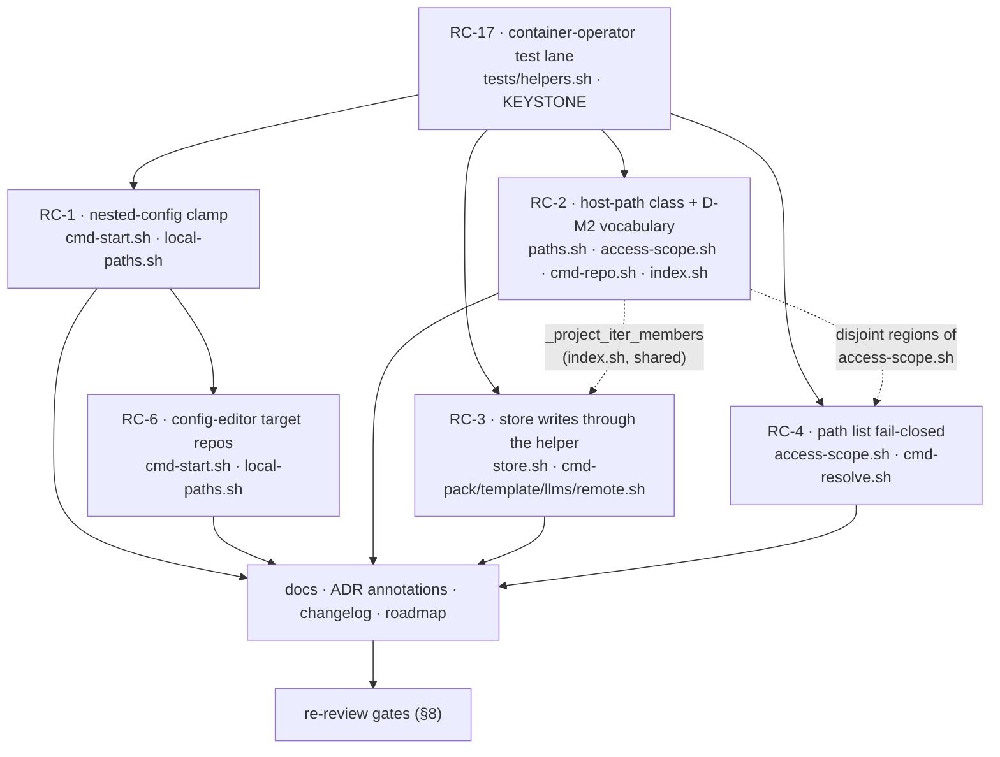

# Fix Design v2 — e2e Acceptance Review, Cycle 1

> **Status**: Design phase (2026-07-19). **Cycle 1** of the incremental
> review → fix → re-review method agreed with the maintainer
> ([`../results/consolidated-review.md`](../results/consolidated-review.md) §intro).
> Grounded in the seven e2e session reports (`E1…E6B`, 2026-07-16) consolidated into
> 17 root causes and one verdict: **NOT ACCEPTED**. All maintainer decisions for this
> cycle are ratified (§3). **No implementation code is written in this phase** — these
> are design-intent documents the implementer builds from.
>
> Structural precedent: the v1 index [`../fix-design/00-overview.md`](../fix-design/00-overview.md).

This is the index for the cycle-1 fix workstream. Each root has its own design doc; this
file carries the shared context — reference reading, the ratified decisions, the root map,
the conventions every cluster consumes, the build ordering, the verification gates, and
the consolidated open questions.

Every design doc in this directory has been through a design + adversarial-verify pass.
Two were returned **FLAWED** on first draft and rewritten; four were **SOUND_WITH_FIXES**.
The per-doc outcome is recorded in §4 so the implementer knows which prescriptions are
first-draft reasoning and which survived falsification.

## 1. Reference reading

**Cycle-0 inputs (what produced the findings)**

- [`../results/consolidated-review.md`](../results/consolidated-review.md) — the acceptance
  verdict, the 17-root map, the ratified decisions **D-M1/D-M2/D-M3**, the cycle-1 ordering.
- [`../handoff.md`](../handoff.md) — the review charter; §8 defines acceptance criteria A–G,
  §9 the pending write-path check-in.
- `/review/E*.md` — the seven session reports (host mount; not in-repo).
- [`../pre-revalidation-backlog.md`](../pre-revalidation-backlog.md) — items deliberately
  triaged out before the run (FI-21/22/23) plus follow-ups filed during it.

**The model being enforced (decisions, in force)**

- `../../decisions/0042-agent-cco-interaction-model.md` — the three-level model, §8 repo-aware authoring.
- `../../../../cli/decisions/0043-unified-cli-environment-access-scope.md` — output scoping, INV-A…E.
- `../../decisions/0044-internal-builtin-presets-and-config-editor-scope.md` — config-editor / tutorial presets.
- `../../decisions/0046-unified-cco-access-model.md` — the `(G,Pc,Po)` triple, the ladder, §7 per-axis rules.
- `../../decisions/0047-config-access-enforcement.md` — the privilege boundary; §2 primitive-level elevation, §3 the Linux DAC follow-up.
- `../../decisions/0048-config-editor-min-privilege-refinement.md` — min-privilege by mode, the `G ≥ ro` floor, conditional INV-2.
- `../../decisions/0049-claude-access-concordant-model.md` — the `(Cr,Cp,Cg,Co)` quad; §5 the settings floor, §7 nested-config detection.
- `../../../../naming/decisions/0050-resource-rename-model.md` — rename model; D5 pre-validation, D7 the in-container gating table.
- `../../../../naming/decisions/0051-per-project-name-scoping.md` — per-project name scoping; D1/D2 identity-is-the-path.

**Living design docs the fixes must keep true**

- `../../design.md` §5 — the access design.
- `../../../../cli/design/design-cli-environment-awareness.md` — the dual-context principle.
- `../../../../environment/design/design-docker.md` §1.2 — mount model + boundary.
- `../../../../naming/design/design-resource-rename.md` — rename behaviour.
- `../../../../engineering/guides/testing.md` — the tier model the RC-17 lane extends.

**Project rules that classify the change**

- `.claude/rules/update-system.md` — additive / breaking / opinionated classification.
- `.claude/rules/documentation-lifecycle.md` — history (annotate) vs living (rewrite).

## 2. The one-sentence diagnosis

The access **model** is sound and the ADR-0047 privilege boundary is **real and confirmed**
in every session — raw store reads fail `EACCES`. What fails is **enforcement fidelity**:
what the resolver declares (`whoami`, the triple, Level-A) and what the container physically
delivers have diverged. Three subsystems declare `rw` and mount `ro`; one write path
declares success and writes nothing; one read verb declares scoping and applies none.

## 3. Ratified decisions (maintainer, 2026-07-19)

Restated verbatim in substance from `consolidated-review.md` §4. No decision is added here.

| # | Decision | Ratified outcome |
|---|---|---|
| **D-M1** | RC-1 fix shape | **`-mindepth 1` + triple-aware extra_mount branch.** The discovery helper must never return its own root (which closes the self-match class for user mounts too), *and* the extra_mount nested-config branch consults the session's committed/`b1` access at the default policy for built-in synthetic mounts, removing the asymmetry with the repo branch (`cmd-start.sh:1551`). `config_access_policy` remains the explicit per-mount override; the strict `ro` default is unchanged for user extra_mounts. **Rejected**: `config_access_policy: write` on generated mounts alone — it leaves the self-match class latent and duplicates intent the triple already carries. |
| **D-M2** | RC-5 semantics | **New vocabulary + honest docs, no additional mounts.** Introduce an explicit third state, **"not mounted in this session"**, distinct from "unresolved on this machine" and from "out of scope", behind **one shared resolver with a single remedy string**. `read-all` keeps its current meaning (name/index visibility, *not* config access); the managed rule, ADR-0043 §1 and `whoami` are corrected to say so. **Rejected**: mounting other projects' `.cco` at `Po=ro` (widens the mount surface against ADR-0047 §1) and restricting `read-all` (a breaking change to a just-settled model). |
| **D-M3** | Cycle-1 scope | **Only the roots that break acceptance criteria**: RC-1, RC-2, RC-3, RC-4, RC-6, plus **RC-17** (without the container-operator lane the fixes are not verifiable). RC-5's *decision* is ratified now so the verbs touched in cycle 1 emit the correct vocabulary; the full RC-5 sweep and RC-7…RC-16 land in cycle 2. |

**Consequence of D-M3 for every doc in this directory**: a cluster may adopt D-M2's
vocabulary only for the call sites it already touches. Widening the sweep is out of scope
even when it is one line away — that is what keeps cycle 1 re-reviewable.

## 4. Cycle-1 root map

| Root | Verify outcome | Findings closed | Acceptance criteria restored | Design doc |
|---|---|---|---|---|
| **RC-17** — suite blind to container context | **FLAWED**; 8 must-fix folded in | `E4-01 meta`; closes its own false green (`test_operator_shim.sh:647-653`) outright | **None directly.** Precondition for signing off A-F3, B, C, D, E, F — *without the lane a green suite is not evidence for any of them* | [`01-test-lane.md`](01-test-lane.md) |
| **RC-1** — nested-config clamp over-reach | SOUND_WITH_FIXES; 3 must-fix folded in | E5-01, E6A-01, E6A-02, E6B-01 (defect a); E6A-12, E6B-02 (defect b) | **D** (mount dimension: 2/3 modes → pass), **E** (`Cg=rw`/`Cp=rw` physically enforced), **C** partial (removes the "triple not physically binding" clause) | [`02-mount-generation.md`](02-mount-generation.md) |
| **RC-6** — config-editor target repos never mounted | SOUND_WITH_FIXES; 5 must-fix folded in | E5-02; E6B-07 class partial (silent skip → announcement) | **D** (delivery half — passes only together with RC-1); ADR-0042 §8 repo-aware authoring becomes possible | [`03-config-editor-repos.md`](03-config-editor-repos.md) |
| **RC-2** — host paths consumed in-container (B-DF1 class) | SOUND_WITH_FIXES; 6 must-fix folded in | E2-03, E3-01, E3-03 (vocabulary half), E4-01, E4-06, E4-08, E5-05, E5-06, E6A-10, E6B-04 (partial), E6B-05 | **A-F3** (in-container resolution, no misleading refusals), **F** (rename verbs runnable at edit-project — conditional on Q1 on native Linux) | [`04-host-path-class.md`](04-host-path-class.md) |
| **RC-3** — direct-FS store writes bypass the helper | **FLAWED**; 7 must-fix folded in | E6A-13, E6B-03, E6B-04 (with RC-2's `_project_iter_members` arm) | **B** (write path gated on `(G,Pc,Po)` + the 0/1/2 convention on that path), **F** (re-key wholly applied or wholly refused), handoff §9 write-path check-in becomes testable | [`05-store-write-path.md`](05-store-write-path.md) |
| **RC-4** — owner-less index pins exempt from scoping | SOUND_WITH_FIXES; 5 must-fix folded in | E1-09, E2-02, E3-07, E4-03, E5-03 | **B** output-scoping (both halves: no leaking false negative, no hiding false positive), **B-S1b** unchanged, **C** (INV-B: newly-hidden rows counted), **G** (host + `read-all` byte-identical) | [`06-path-list-scoping.md`](06-path-list-scoping.md) |

**Criteria left FAILING at the end of cycle 1, by design**: **B-S1b** (RC-7,
`/etc/cco/policy.json` agent-readable), **C** in full (needs the RC-5 sweep),
**A-F2/A-F5/G** partials (RC-8, RC-11, RC-9, RC-14). See §10.

**The shared shape of all six.** Every root is the same failure mode at a different site: a
predicate that was correct on the host was **copy-pasted or inlined** instead of being named,
and it then went wrong in the container. Accordingly every design replaces the inline
predicate with exactly one named source:

| Root | The predicate that was inline | The single source it becomes |
|---|---|---|
| RC-1 | the 3-way `if/else` at `cmd-start.sh:1616-1622` | `_nested_config_modes(mount_ro, policy, role, ktriple, ctriple)` |
| RC-6 | the copy-pasted name→path lookup in three mount bridges | `_mount_source_for <scope> <name>` (INV-M1) |
| RC-2 | `-d "$index_path"` at 5+ call sites | `_cco_member_probe_path` / `_cco_display_path` + `_env_member_state` (INV-F) |
| RC-3 | `rm`/`mv` on bucket paths in command bodies | `lib/store.sh` named whole-cascade ops (INV-S1…S6) |
| RC-4 | the inline filter + `_scope_paths` in `cmd_path list` | `_env_owner_in_scope <owner>` behind `_env_in_scope path` |
| RC-17 | `rc -ne 2` as an ad-hoc "it works" proxy | `assert_rc` / `assert_refused` / `assert_gate_allows` / `assert_index_path` |

## 5. Cross-cutting conventions

Defined **once** here; the cluster docs reference this section rather than restating it.

### 5.1 The three availability states (D-M2)

The model shipped with two outcomes (visible / out of scope) against three realities, and
each verb invented its own third answer. There is now one vocabulary, one shared resolver
(`_env_member_state` / `_env_project_state` in `lib/access-scope.sh`) and one remedy string
per state.

| State | Meaning | Truth test | Remedy | Exit |
|---|---|---|---|---|
| `here` | Reachable now: mounted in this container (or present on the host) and within the session's `(G,Pc,Po)` | the **mount** exists at the container target | — | `0` |
| **`not mounted in this session`** | The resource is known and may be *named* at this scope, but no bind exists in this container, so its config is not reachable | index binding exists; container target absent | restart the session including it (`cco start … --repo`, `--project`, or add it to `project.yml`) — a **host** action | `2` for an explicitly named target *(Q RC-2/2)*; `0` + warn in `--all` sweeps |
| `unresolved on this machine` | Declared member with no usable binding on this host — a genuine missing dependency | no index binding, or the host path does not exist **host-side** | `cco resolve <name>` on the host | `1` |
| `out of scope` | The resource exists and the session's triple does not entitle it | scope layer says hidden | widen `--cco-access` (naming the level that would reveal it) | `2` for a named request; hidden + counted in the count-only notice for listings |

Three rules bind this table:

1. **INV-F (probe locality)** — index paths are **HOST** paths and must never be
   existence-tested in operator mode. Probing asks "is it mounted *here*"; displaying asks
   "what may I show". They are deliberately different helpers
   (`_cco_member_probe_path` vs `_cco_display_path`) and must not be conflated.
2. **INV-B (hidden ≠ absent)** — nothing is ever silently dropped. A hidden row is counted
   in a count-only notice; a skipped member is *announced*. RC-6's `_ce_skip_note` and
   RC-2's `_env_note_unmounted` are drafted to the same wording so the cycle-2 RC-5 sweep
   need not rewrite either.
3. **`read-all` means name/index visibility, not config access.** A `read-all` session that
   can *name* another project still gets `not mounted in this session` for its config. The
   managed rule, ADR-0043 §1 and `whoami` are corrected to say so (cycle-2 docs sweep;
   cycle 1 must not emit text that contradicts it).

### 5.2 Exit codes (D8, restated)

- `0` — success **or** graceful degrade (scope-filtered output, sweeps that skip and warn).
- `2` — **refused by policy**: out of scope, host-only, or (proposed) not mounted in this
  session. Never silent — a refusal must name its reason and its remedy (B6).
- `1` — **error**: missing dependency, unwritable target, parse failure.

Cycle-1 corollaries:

- A store write that cannot complete is an **error (1)**, never a false `0` (RC-3). This is
  the single largest user-visible change in the cycle.
- A failed *precondition* refuses **before** Phase 1 mutates anything: fail-closed, never
  half-applied (RC-3 `_store_check`, RC-2 `_rename_assert_writable`).
- `--all`-style sweeps keep their exit-0 contract and degrade per item
  (`_env_unavailable_warn`), rather than aborting the sweep.

### 5.3 Positive assertions only (RC-17)

A container-operator test asserts an **outcome** (exact rc + an observable state change read
back through the real API) or an **explicit refusal**. `rc -ne 2` is banned as a terminal
assertion by a static invariant in `tests/test_invariants.sh`, with a same-line
`# allow-negative-rc: <why>` escape. A rename writes **two** stores (index and
`project.yml`); asserting one certifies a half-apply, so the assertion set must bracket the
whole effect.

### 5.4 Change classification (all six roots)

Per `.claude/rules/update-system.md`, verified per doc: **code-only**. No `project.yml`
schema change, no index schema change, no `*_FILE_POLICIES` change, no new
`defaults/global/` content ⇒ **no migration in cycle 1**, nothing for `cco update --sync`
to discover. Changelog: next free id is **46** (max in `changelog.yml` is 45); the
recommendation from `04`/`05` is **one grouped cycle-1 entry** owned by the docs sweep —
see Q-C1.

### 5.5 The rebuild gate

Store-touching verbs exec the **image-baked** `/opt/cco/bin/cco` through the setuid helper,
and the managed rules are baked into `/etc/claude-code/`. Consequently **`lib/` edits are
invisible in-session until `cco build`**. Every cluster states this; it is also verification
gate 2 (§8) and the single most common cause of "the fix did not work" during self-dev.

### 5.6 Doc/ADR reconciliation (executed by the docs task, last)

Consequences already identified by the clusters, listed here so none is lost. **Forward
annotations** (history — append, never rewrite): ADR-0049 §5 (the RC-17 prediction came
true a second time) and §7 (the mount root is governed by its own `readonly:`; the nested
clamp never applies to it); ADR-0048 §4/§5 (the store rule now enforced on the
`/workspace/cco-config` view; the sibling "target mount follows `Pc`" rule); ADR-0051 (a
synthetic manifest carries its bindings out-of-band; the `unscoped` bucket is *not* that
mechanism); ADR-0046 §6 / ADR-0047 (config-editor's narrow multi-repo `Pc` span);
ADR-0047 §2/§3 (primitive-granularity elevation; INV-S6; pointer to the Linux DAC question);
ADR-0050 D5/D7 (pre-validation includes physical write capability; in-container rename is
name-only, `--move-dir` host-only); ADR-0043 §1/§4 (the `path` kind completes the taxonomy,
with its stated deviation); ADR-0042 §8 / ADR-0044 §3 (declared but not delivered until
RC-6). **Living docs** (rewrite to truth): `design-cli-environment-awareness.md` (INV-F,
the three-state table, probe-vs-display), `design-docker.md` §1.2.2/§1.2.3 (nested-config
governance table; the two boundary-crossing modes), `design-resource-rename.md`,
`design.md` §5 (INV-S invariants), `docs/users/reference/cli.md` (`config_access_policy`
governs nested trees only; `--move-dir` host-only; `path list` scoping), `testing.md` (the
container-operator lane + the CAN/CANNOT boundary), root `CLAUDE.md` Key Files
(`lib/store.sh`).

## 6. Build ordering and dependencies

**Why this order**

- **RC-17 first, always.** It is the only item that converts the other five from *believed
  fixed* to *verified fixed*, and it retro-fits the false-green assertion that let dead code
  ship green. Its own first draft was falsified by exactly the failure it exists to catch —
  which is the strongest available argument for landing it before anything it must certify.
- **RC-1 → RC-6 are sequential**: the same subsystem and largely the same lines of
  `lib/cmd-start.sh` (mount generation) and `lib/local-paths.sh`. RC-1 widens the
  `_effective_extra_mounts` TSV contract to 5 fields; RC-6 adds `_mount_source_for` and the
  repo-side session override. Interleaving them guarantees a merge conflict in the mount
  generator.
- **RC-2, RC-3, RC-4 proceed in parallel** once the lane exists — with **two documented
  seams**, both dotted above and neither discovered at merge:
  - **RC-2 ↔ RC-3** are *not* file-disjoint: both edit `_project_iter_members` in
    `lib/index.sh`. **RC-2 lands the operator arm** (preferred — it keeps the whole
    probe-path class in one design) and RC-3 builds on it; RC-3's E6B-04 closure depends on
    it either way. The choice must be made before implementation starts.
  - **RC-2 ↔ RC-4** both extend `lib/access-scope.sh`, in disjoint regions: RC-2 adds the
    state/remedy helpers, RC-4 adds `_env_owner_in_scope` and rewires `_env_in_scope`'s
    branches. Textually mergeable; land RC-2's helpers first so RC-4 rebases onto a settled
    header.
- **Docs last**, once behaviour is settled — the v1 workstream's convention, and the reason
  the changelog entry is recommended as one grouped entry (§5.4).

## 7. What each doc owns (no overlaps)

| Doc | Owns | Explicitly does **not** own |
|---|---|---|
| `01-test-lane.md` | `tests/helpers.sh` lane, the assertion vocabulary, the `rc -ne 2` ban, the retro-fit of `test_operator_shim.sh:647-653` | the fixes themselves; the mount-intent tests it specifies the *rule* for (owned by RC-1/RC-6) |
| `02-mount-generation.md` | `_find_nested_config_dirs`, `_nested_config_modes`, the `role` column, `_config_editor_mount_ro` | RC-6's repo bridge; the RC-5 sweep |
| `03-config-editor-repos.md` | `_mount_source_for`, the config-editor repo override, `_ce_skip_note`, reserved-name filtering | the triple resolution (RC-1); Level-A repo markers (RC-9, cycle 2) |
| `04-host-path-class.md` | INV-F, `lib/paths.sh` probe/display pair, `lib/access-scope.sh` state vocabulary, the 5 confirmed call sites, `_project_iter_members` operator arm, rename write-probe | the store write path (RC-3); the full RC-5 sweep |
| `05-store-write-path.md` | `lib/store.sh`, `store-op` crossing, `_store_check` pre-flight, the seven mutating verbs | rename verbs' own host-path resolution (RC-2); provenance writers (open Q) |
| `06-path-list-scoping.md` | `_env_owner_in_scope`, `_env_in_scope path`, deletion of `_scope_paths` | mis-owned rows (RC-16, cycle 2); notice unification (deferred) |

## 8. Verification gates for the re-review

The re-review may only start when **all five** hold.

1. **Suite.** Full suite against the **1311/9** baseline (the 9 are pre-existing FI-19
   boundary artifacts — host-only tests defeated by the ADR-0047 boundary, not regressions),
   **plus the new container-operator lane green**. A lane that is green while the fixes are
   reverted is not a lane: `01-test-lane.md` §6 T6 is the lane's own self-test and must fail
   on reverted code.
2. **`cco build` from `develop`.** Not from a feature branch — the cycle-0 run deviated here
   (E1-04/E4-09) and validated B-DF1/F3 on code not yet on the release branch. Every one of
   these fixes is invisible in-session until the image is rebuilt (§5.5).
3. **Targeted e2e re-run**: **E5**, **E6A**, **E6B** for criteria **D** and **E**; **E4** for
   criterion **F**. E1–E3 re-run only for **RC-4** (`cco path list` must no longer be
   byte-identical across levels).
4. **RC-3's `pack rename` half-apply (E6B-04) reproduced on a scratch project** before being
   declared fixed. The cycle-0 reviewers deliberately did not execute it with `-y`, so the
   half-apply is *predicted*, not observed; a fix for an unreproduced defect is unverified.
   Reproduce on a throwaway project, both pre- and post-fix.
5. **Open questions answered.** §9's blocking items (Q-1, Q-2 in particular) change the shape
   of what ships; the re-review cannot certify behaviour the design has not settled.

Two honest limits, recorded rather than buried: the hermetic lane **cannot** observe
mount-time failures (that is what the e2e sessions are for), and its simulation of the
ADR-0047 boundary is a `chmod` seam on a bucket ancestor, which models the *errno* and not
the setuid trampoline.

## 9. Open questions for the maintainer

Ordered by blocking weight, then by root. Q-1 and Q-2 change what ships; the rest change
scope or sequencing.

### Blocking — decide before implementation

- **Q-1 [RC-2/RC-3] Elevated identity vs claude-owned config trees (criterion F on Linux).**
  `bin/cco:462` trampolines the **whole** repo/extra-mount rename verb to `euid=cco-svc`,
  but the verb must write `<repo>/.cco/project.yml`, which is **claude-owned**. It works on
  this machine only because Docker Desktop mounts with `fakeowner` (confirmed in
  `/proc/self/mountinfo`); native Linux bind mounts enforce POSIX and the rewrite fails.
  Three shapes: **(a)** de-elevate just the config-tree write via a plain `bash` (resets
  euid to ruid=`claude` — documented behaviour `cco-svc-helper.c` already relies on, and it
  only ever *narrows* privilege); **(b)** drop the verbs from `_cco_verb_touches_store` and
  give the index accessors a per-call boundary crossing (the general answer RC-3 also wants,
  but an architectural addition ADR-0047 deliberately avoided); **(c)** accept host-only,
  contradicting ADR-0050 D7. Also: does this belong to `04-*`, to `05-*` (same primitive), or
  to an ADR-0047 forward annotation?
- **Q-2 [RC-1] Is the role-keyed reading of D-M1 the intended one?** D-M1 literally says the
  extra_mount branch should consult `_committed_ro`/`_b1_ro`. Applied literally that **is**
  the existing `config_access_policy: project` mapping, whose `.claude` axis is `Cr` — which
  ADR-0049 fixes at `ro` for every session — so **E6A-12 and E6B-02 would survive the fix**.
  `02-mount-generation.md` keeps D-M1's decision but resolves **which axis per mount role**
  (`store` → `Cg`/`G`, `project-config` → `Cp`/`Pc`). Confirm this is the intended reading of
  D-M1 and not a decision change.
- **Q-3 [RC-3] Linux write-path check-in (handoff §9 / ADR-0047 §3).** Should cycle 1 **gate**
  on it, or ship macOS-verified with a forward-annotated caveat? Settling it needs an
  ownership decision (chown bucket content host-side at `cco start`, or a `cco-svc`
  supplementary-group grant) outside RC-3's scope — the one item in this cycle that could
  force an ADR-0047 §3 revision. Coupled to Q-1.

### User-visible behaviour

- **Q-4 [RC-2] Exit code for a named `not mounted in this session` target**: `2` (proposed —
  a refusal with a remedy, per B6) or `1`? D8 reserves `2` for "refused by scope / host-only"
  and *not mounted* is strictly neither. Asserted by the shim tests, so it must be settled
  once, here (§5.1 currently assumes `2`).
- **Q-5 [RC-2/RC-17] `--move-dir` in-container**: refuse **exit 2** with a host hint
  (proposed — explicit user intent is never silently downgraded), or degrade to the name-only
  rename with a warning? RC-17 additionally asks whether the lane should *assert* the
  refusal; it borders on ADR-0050 D4 ("a directory move is a host operation") and so was
  flagged rather than assumed.
- **Q-6 [RC-2] Bare `cco repo rename <new>` at the WORKDIR root** (cwd=`/workspace`, not a
  member dir): resolve to the session's single repo when the project has exactly one
  (mirroring R4's `project show` fallback), or always refuse as ambiguous? The design
  currently refuses in both cases.
- **Q-7 [RC-6] Two `--project` targets binding the same repo NAME to different paths** — a
  legitimate ADR-0051 homonym — cannot both occupy `/workspace/<name>`. Proposed for cycle 1:
  **mount the first, announce the second**. The alternative (a disambiguated target such as
  `/workspace/<project>--<name>`) changes container paths, Level-A rendering and the proxy
  pathmap, so it needs an explicit maintainer decision rather than an implementer's choice.
- **Q-8 [RC-6] Duplicate authoring path.** Once a target's hosting repo is a declared member,
  its `.cco` is writable at both `/workspace/<t>-config` and `/workspace/<repo>/.cco`. Accept
  the duplication, or re-overlay the repo-path copy `:ro` to keep one authoring path? This
  touches the deliberately deferred ADR-0046 §6 multi-repo `Pc` note
  (`cmd-start.sh:1566-1573`).
- **Q-9 [RC-4] Project-less config-editor global session**: confirm it should get the honest
  **empty path list + notice**, rather than a special case for the authoring tool.

### Cycle-1 scope (each enlarges the diff against D-M3)

- **Q-10 [RC-3] Which store writers convert?** Only the destructive/re-key ops, or also the
  install/update **provenance writers** (`pack`/`template install|update|import|internalize`,
  `llms install|update`, `_record_tree_as_base`, `_meta_record_provenance`)? Deferring means
  `pack install` becomes a clean in-container **refusal** until cycle 2.
- **Q-11 [RC-3/RC-2] Rename verbs onto the primitive layer now?** `repo`/`extra-mount rename`
  are whole-verb elevated today, so `cco-svc` rewrites a mounted repo's `project.yml` and
  `mv`s a real working tree — the same INV-S5 over-elevation. Migrate in cycle 1 (needs
  sequencing with RC-2, same file) or cycle 2? Coupled to Q-1.
- **Q-12 [RC-1] Adjacent latent defect.** `_setup_internal_config_editor` hard-codes
  `readonly: false` on every generated target mount (`cmd-start.sh:152`) whereas the store
  mount derives its flag from the triple. A granular
  `--project X --cco-access global=rw,current=ro,others=none` would mount X's `.cco` writable
  while `Pc=ro` — same declared-vs-enforced class, **opposite polarity**, unreachable in any
  shipped mode. ~3 lines, belongs naturally in this commit, but widens the diff beyond the six
  ratified findings. Cycle 1 or cycle 2?
- **Q-13 [RC-17] Supersede `_op_cco`/`_op_seed`?** Migrate them to the lane in one pass
  (~35 call sites in `test_operator_shim.sh`), or keep them for gate-only tests? The designer
  leans **supersede** — two vocabularies for one context is exactly how the third (`_ps_probe`)
  got invented — but it enlarges cycle 1's diff.
- **Q-14 [RC-17/RC-3] Boundary simulation reach.** Include the `chmod 000` seam in cycle 1
  (verified to produce `EACCES` for uid 1001 here, with a mandatory `id -u` self-check because
  root bypasses it), or is RC-3's verification explicitly deferred to the e2e gate per
  `consolidated-review.md` §6.4? The one place the lane's reach is genuinely contested.
- **Q-15 [RC-6] The unscoped seed.** `tests/helpers.sh:59` seeds `dummy-repo` **unscoped** for
  every test and `_index_get_path` falls back to the unscoped bucket for any scope — which is
  why `test_config_editor.sh:339,354` **pass today on broken code**. Converting the shared seed
  to scoped is the honest global fix but touches most of the 1311-test suite: cycle 1 (with the
  lane) or cycle 2? RC-6 routes around it (new tests use an unseeded name with the 3-arg scoped
  form), so it is not blocked either way.
- **Q-16 [RC-4] `_op_seed` and the owner-less pin**: seed it **unconditionally** (strengthens
  three existing tests, makes the fixture representative of the real index) or gate it behind
  an `OP_ORPHAN` var (fixture stability; existing tests stay unrepresentative)?

### Documentation / process

- **Q-C1 [RC-3, and `04`/`05` concur] Changelog granularity**: **one grouped entry** for the
  whole cycle-1 fix set (recommended — a per-root split fragments one release note into six),
  or one entry per root? Next free id is 46.
- **Q-C2 [RC-4] Does the drafted ADR-0043 forward annotation clear the "ADR amendment" bar**,
  or do you want a short standalone ADR? The designer's read is **no**: the reversed decision
  lives only in a code comment (`cmd-resolve.sh:730-731`), ADR-0043 §4 already mandated the
  opposite, and ADR-0046 §7's per-axis rules are applied unchanged (`Po` is simply consulted
  where it was skipped). But if "un-owned data rides `Po`" reads as a *model statement* rather
  than a taxonomy completion, that is a maintainer call.
- **Q-C3 [RC-4] Notice unification — cycle 2 or never?** `path list` keeps its dedicated notice
  because the shared `_env_flush_hidden_notice` hardcodes a `read-global`-first widening hint
  (`access-scope.sh:584`) that is wrong for path rows (they always need `read-all`). The clean
  fix parameterises the hint per kind and touches five listers' stderr wording — deliberately
  not smuggled into a confidentiality fix.
- **Q-C4 [RC-17] Sequencing of T3's expected string.** T3 asserts D-M2's shared remedy wording,
  which RC-2 authors. May the lane assert only the **absence of the wrong answers** (no
  "unresolved", no "not found") until the wording is settled, or should T3 land after RC-2?
  Sequencing only — it does not change the lane's shape.

## 10. Explicitly NOT in cycle 1

Per **D-M3**, cycle 1 fixes only the roots that break acceptance criteria. Everything below is
**known, triaged and deferred** — not forgotten, and not to be re-discovered by the re-review.

| Deferred | Why it is out |
|---|---|
| **RC-5 full sweep** | The *decision* (D-M2) is ratified and cycle 1 emits the correct vocabulary at the sites it already touches. The sweep across `access-scope.sh` (`_env_require_visible`), `cmd-project-query.sh` and every other verb that invents a third answer is cycle 2. |
| **RC-7** non-store host-path surfaces | Criterion **B-S1b** stays FAILING. `/etc/cco/policy.json` is agent-readable and carries host paths + username regardless of `show_host_paths`; `/proc/self/mountinfo` and persisted transcripts do too. Needs a **criterion-wording decision**, not only patches. |
| **RC-8** kinds counted from the narrowed mount | Packs are enumerated from the mount-narrowed CONFIG bucket, so the hidden-count is structurally unreachable. Templates already show the correct pattern. |
| **RC-9** Level-A accuracy | Wrong remediation target for pack-declared llms; missing `(read-only)` markers; declared-but-unmounted repos omitted; resolved triples never injected. RC-6 closes only the config-editor instance of the announcement class. |
| **RC-10** `whoami` presentation | Derived `claude_access` labelled as preset `none`; `Co` omitted. |
| **RC-11** help surface | Host-only *subverb* `--help` refuses; above-scope verbs unmarked; spurious `✗ exited unexpectedly (exit 0)`. |
| **RC-12** list rendering | Two distinct `base` templates collapsed into one row; `REPOS` shows `-` for known non-current projects; NAME overflow. |
| **RC-13** llms verb desync | Cycle 1 removes most of its *evidence* (the wrong-reason `not found`) as a side effect, but RC-13 also covers read verbs outside this file set and must be **re-verified**, not declared fixed. |
| **RC-14** doc/ADR drift | The managed rule + ADR-0043 §1 over-promise `read-all`; CLI-surface matrix §2.2 contradicts the shipped exit code; `cco start --help` advertises the retired broad config-editor default. Cycle 1 must not *add* drift; correcting the existing drift is the cycle-2 sweep. |
| **RC-15** M0 residue | Retired `workspace.yml`/`packs.md` survive (0-byte) in 3/7 committed trees; the reap covers only the session overlay. |
| **RC-16** host-side index hygiene | Needs a host-side `cco resolve --scan` to settle whether these are shipped defects or local residue. Includes E4-02, which RC-4 explicitly does **not** claim (a mis-owned row is a different mechanism from an un-owned one). |

Also out, and **not to be re-reported**: FI-21 / FI-22 / FI-23 (index-model items, triaged
out before the run) and the docs-coherence track (`to-verify-guides-docs.md`), which stays
separate per handoff §9. Full deferred table with findings and sites:
[`../results/consolidated-review.md`](../results/consolidated-review.md) §3.
