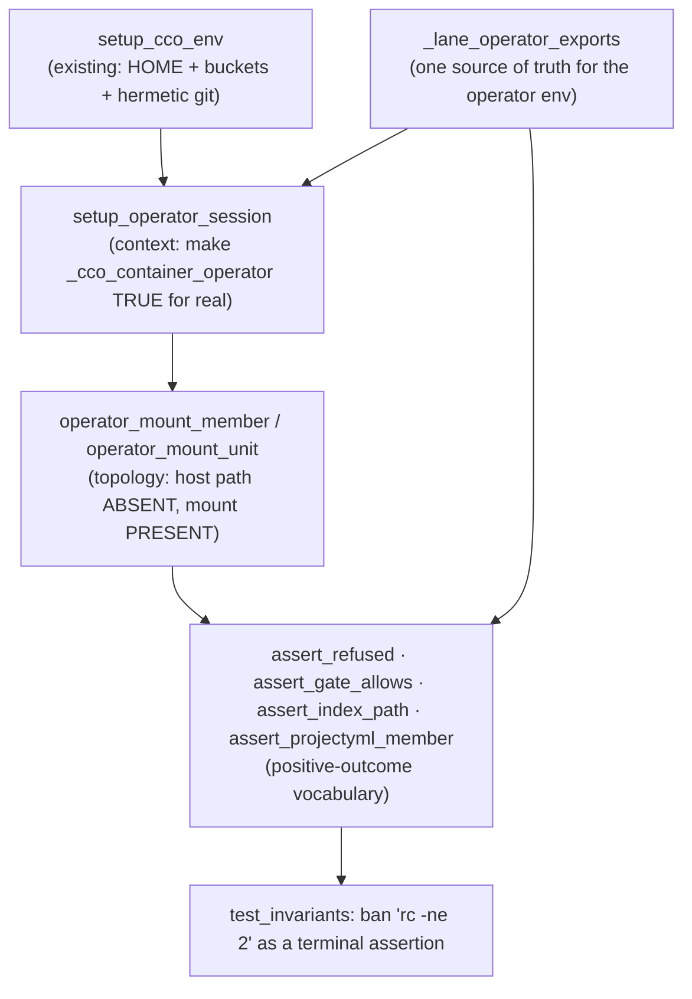

# Fix design RC-17 — container-operator test lane

> **Status**: Design phase (2026-07-19). Cycle-1 **keystone** per
> [`../results/consolidated-review.md`](../results/consolidated-review.md) §5 and decision
> **D-M3**. No implementation code is written here. Structural template:
> [`../fix-design/00-overview.md`](../fix-design/00-overview.md).
>
> **Scope note**: this doc designs the *verification lane*. It does not fix RC-1/RC-2/RC-3/
> RC-4/RC-6 — it makes their fixes provable. Every claim below was executed against the
> working tree before being written; the reproductions are transcribed from real runs.
>
> **Revision note (v2.1)**: an adversarial review of the first draft found that the draft's
> own keystone test was a false green under the minimal RC-2 fix the draft prescribed —
> the exact failure mode RC-17 is filed against, reproduced inside the RC-17 fix. §1.2,
> §3.2, §3.3 and §6 T1 are rewritten around that finding. It is recorded, not buried:
> "the assertion set must bracket the *whole* effect" is the lane's central lesson, and it
> was learned the hard way twice.

## 1. Root cause

RC-17 is not one defect. It is **three**, which is why the class keeps shipping green.

### 1.1 A false green: `rc -ne 2` as a proxy for "the verb works"

`tests/test_operator_shim.sh:647-653` — verified verbatim:

```bash
647	    # repo rename is Pc=rw → NOT policy-refused at edit-project (falls through to
648	    # the verb, which then errors on no resolvable project — rc≠2, not a gate).
649	    _op_cco edit-project repo rename old new
650	    [[ $OP_RC -ne 2 ]] || fail "repo rename must NOT be policy-refused at edit-project: $OP_OUT"
651	    if echo "$OP_OUT" | grep -qiE 'needs Pc=rw|edits project config'; then
652	        fail "repo rename wrongly gated at edit-project: $OP_OUT"
653	    fi
```

`OP_RC -ne 2` is satisfied by **every** exit code except 2 — including `rc=1` from a `die`.
The verb never has to work. Executed under the real runner:

```
$ bin/test --file test_operator_shim --filter rename_gating -v
[PASS] test_op_rename_gating_by_target_tree                         (195ms)
```

…while the same invocation, traced, dies at `lib/cmd-repo.sh:68-69`:

```
RC=1
✗ No repo named 'old' in project 'claude-orchestrator'. …
```

Two further properties make it worse than a weak assertion:

- **It is cwd-dependent.** The `die` above fired only because `bin/test`'s cwd
  (`$REPO_ROOT`) happens to contain `.cco/project.yml`, so `_resolve_find_unit_dir`
  (`lib/cmd-resolve.sh:52-64`) resolved the *developer's own* project. From a cwd without
  one, it dies earlier at `lib/cmd-repo.sh:43-44` instead. Both are `rc=1`; the assertion
  cannot tell them apart, and neither is the behaviour under test. This is non-hermetic:
  the test reads a tracked file outside its tmpdir.
- **`_op_cco` leaks ambient env.** `_op_cco` (`tests/test_operator_shim.sh:24-38`) does
  **not** `unset CCO_ACCESS_TRIPLE`, while its sibling `_op_seed` (`:67`) does. Run outside
  `bin/test` — inside a live cco session — the ambient triple wins and the same call returns
  `rc=2`. `bin/test:21-26` unsets it globally, so the suite is currently safe **by
  accident of the runner**, not by the helper's own construction. §3.1/§3.3 treat "correct
  from any calling context" as a hard requirement precisely because of this.

### 1.2 The real defect the false green conceals (RC-2) — and its second layer

`lib/cmd-repo.sh:74-76`:

```bash
74	    # ── Strict guard: the member must be resolved on this machine ───────
75	    [[ -d "$oldpath" ]] \
76	        || die "Member '$old' is not resolved on this machine ($oldpath is missing). Run 'cco resolve' first — …"
```

`$oldpath` comes from `_index_get_path` (`:67`) — a **host** path. `lib/paths.sh:333-355`
defines the correct probe and states the rule explicitly:

```bash
348	_cco_member_probe_path() {
349	    local name="$1" host_path="$2"
350	    if [[ -n "$name" ]] && _cco_container_operator; then
351	        printf '%s\n' "${CCO_WORKDIR:-/workspace}/$name"
```

Grepping its call sites shows the B-DF1 fix was applied to **exactly one file**:

```
lib/cmd-project-query.sh:82, :112, :228
```

**The open sites, complete** — every remaining place that `-d`/`-f`-tests a raw index host
path. The list is exhaustive because an incomplete list is how the keystone below failed:

| Site | Code | Effect in-container |
|---|---|---|
| `lib/cmd-repo.sh:75` | `[[ -d "$oldpath" ]]` | `repo`/`extra-mount rename` dies rc=1 |
| `lib/index.sh:762` | `_project_member_status`: `[[ -n "$repo_path" && -d "$repo_path" ]] \|\| { printf 'unresolved'; …}` | **every member reads `unresolved`** |
| `lib/index.sh:781` | `_project_iter_members`: `[[ -n "$path" && -d "$path" ]] \|\| path=""` | blanks the path before `:762` even sees it |
| `lib/cmd-resolve.sh:70-82` | `_resolve_unit_dir_for_project`: `[[ -n "$p" && -f "$p/.cco/project.yml" ]]` | `cco project validate <name>` dies rc=1 "not found" |
| `lib/cmd-project-validate.sh:307-316` | consumes both of the above | the T3 target |

`lib/index.sh:762` is the one the consolidated review misses (it names `:777`/`:781`), and it
is the **actual producer** of the `unresolved` verdict: `:781` merely blanks the path before
handing it over. A fix applied to `:781` alone still yields `unresolved` whenever a caller
passes a raw index path — which `_project_iter_members` does. Likewise `cmd-resolve.sh:70-82`
is the real `project validate` target; `cmd-project-validate.sh:312` calls
`_resolve_unit_dir_for_project` directly rather than the operator-aware `_resolve_project_yml`
(`lib/cmd-resolve.sh:140-150`) that exists three functions below it.

**The second layer: the verb half-applies, and the guard hides it.** Because
`_rename_projectyml_current` (`lib/rename.sh:132-144`) filters members on
`case "$status" in synced|divergent`, and `$status` comes from the two `index.sh` sites
above, the project.yml rewrite loop body **never executes** in-container. Today that is
invisible — `cmd-repo.sh:75` kills the verb first. The moment the `:75` guard is fixed, the
verb returns **rc=0, "✓ Renamed"**, re-keys the index, and leaves `project.yml` untouched:

```
$ cco repo rename alpha api -y        # with the :75 guard probing the mount
RC=0   ✓ Renamed repo 'alpha' → 'api' in project 'alpha'.
--- index AFTER ---            alpha → ''   api → '/Users/cco-e2e/code/alpha'
--- project.yml AFTER ---      name: alpha
                               repos:
                                 - name: alpha          ← NOT rewritten
```

And the `Commit + push the updated .cco/project.yml` warning at `lib/cmd-repo.sh:120-123` is
**silently suppressed**, because it is guarded by `[[ ${#changed[@]} -gt 0 ]]` and `changed[]`
is empty. That is the same *half-apply, data-loss-shaped* defect **RC-3** is filed for
(`consolidated-review.md:71`) — arriving through RC-2's door, in the verb the keystone
certifies. §3.2 and §6 T1 are built around it.

### 1.3 Structural blindness: no fixture models container topology

Three incompatible ad-hoc mechanisms exist, none of which models the one fact that defines
in-container life — *the index holds a host path that does not exist; the member is
reachable only at `$CCO_WORKDIR/<name>`*:

| Mechanism | Site | What it establishes | Why it cannot catch RC-2 |
|---|---|---|---|
| `_op_cco` / `_op_seed` | `test_operator_shim.sh:24`, `:47` | real operator env, throwaway/seeded store | seeded repos live at `$tmp/repos/<n>` and **do exist** → the `-d` guard passes |
| `_as_operator` | `test_access_scope.sh:26-29` | real operator env, **fake** buckets `/x /y /z` | no filesystem at all |
| `_ps_probe`/`_ps_role`/`_ps_fallback` | `test_project_show.sh:142-260` | **stubs** `_cco_container_operator() { return 0; }` | stub cannot regress-test the predicate; never reaches a dispatcher |

And `tests/test_repo_rename.sh` / `tests/test_project_validate.sh` have **zero** operator
coverage — confirmed by grep (`CONTAINER_OPERATOR|CCO_WORKDIR|operator` → no match).

ADR-0049 §5's forward annotation (`0049-claude-access-concordant-model.md:210-212`)
predicted precisely this:

> The floor is **only as verifiable as the harness**: the dry-run compose tests assert
> the emitted YAML and never execute it, so this shipped green. Mount-time failures are
> invisible to a hermetic suite and belong to the e2e gate.

It has now come true in a second subsystem.

### 1.4 What the suite *can* already see — and does not look at

Not everything is beyond hermetic reach. Running the existing dry-run machinery against a
config-editor project session surfaces **RC-1 and RC-6 in one compose file**:

```
$ run_cco start config-editor --project cave --dry-run --dump
63:  - "/tmp/…/repos/cave/.cco:/workspace/cave-config"
64:  - "/tmp/…/repos/cave/.cco/.:/workspace/cave-config/.:ro"      ← RC-1 self-match (rel=".")
     (no  /tmp/…/repos/cave:/workspace/cave  line at all)          ← RC-6 silent repo skip
```

Line 64 is `_find_nested_config_dirs` returning its own root — `lib/cmd-start.sh:480`,
`rel="${d#"$root"}"; rel="${rel#/}"; [[ -z "$rel" ]] && rel="."` — the exact D-M1 target.
The absent repo line is `_effective_repo_mounts` (`lib/local-paths.sh:182`) deriving
`proj` from the *generated* project.yml (`config-editor`) and missing the `[cave]`-keyed
binding, then conscious-skipping at `:197`.

**Nobody asserts either line.** `tests/test_config_editor.sh:82-94` asserts the `.cco`
mount and stops; it never asserts the target's *repo* mount, and it treats the extra `/.:…:ro`
line as invisible. So the blindness is not purely structural — it is also **unasserted
surface**, which is cheap to close.

## 2. Findings closed and criteria restored

### 2.1 Findings

RC-17 itself is filed against `E4-01 meta`. As the keystone it does not close findings
directly; it converts these from *believed fixed* to *verified fixed*:

| Root | Findings the lane makes verifiable |
|---|---|
| RC-1 | E5-01, E6A-01, E6A-02, E6A-12, E6B-01, E6B-02 |
| RC-2 | E2-03, E3-01, E3-03, E4-01, E4-06, E4-08, E5-05, E5-06, E6A-10, E6B-04, E6B-05 |
| RC-3 | E6A-13, E6B-03, E6B-04 — **partially** (see §5.3) |
| RC-4 | E1-09, E2-02, E3-07, E4-03, E5-03 |
| RC-6 | E5-02 |

It closes one finding outright — its own: the false-green assertion at
`test_operator_shim.sh:647-653`, retro-fitted per §3.4.

### 2.2 Acceptance criteria (§8)

The lane restores **no criterion by itself**. It is the precondition for the re-review
signing off **A-F3** (RC-2), **B — output-scoping** (RC-4), **C** (RC-1), **D** (RC-1,
RC-6), **E** (RC-1) and **F** (RC-2, RC-3). Stated plainly so it is not over-claimed:
*without the lane, a green suite is not evidence for any of them.*

## 3. The fix

One lane, assembled in `tests/helpers.sh` from three layers — context, topology, assertion
vocabulary — plus one assertion ban.
**No new runner, no new tier.** The lane is a *fixture and assertion vocabulary* layered on
`setup_cco_env`, so lane tests stay in their subject-matter files and inside the single
`bin/test` baseline.



### 3.0 One source of truth for the operator environment

Both the persistent context (§3.1) and the ephemeral gate probe (§3.3) need *the same*
environment, and the review found that letting each build its own is how they diverge — the
draft's `assert_gate_allows` set one variable and inherited the rest, making its `<level>`
argument decorative (§3.3). So the env is defined **once**:

```bash
# DESIGN INTENT — not final code.
# Emit the COMPLETE container-operator env as `export`/`unset` statements, to be eval'd
# either into the current shell (setup_operator_session) or into a subshell
# (assert_gate_allows). Single source of truth: there is exactly one definition of "what
# a lane operator session is", so the two consumers cannot drift.
#
# Three groups, all load-bearing:
#  (a) THE PREDICATE: _cco_container_operator (lib/paths.sh:325-331) needs the flag AND
#      three ABSOLUTE bucket paths. Never stubbed — a stub cannot regress-test it.
#  (b) THE GATE PIN: CCO_STORE_ELEVATED=1. repo|extra-mount rename is store-touching
#      (_cco_verb_touches_store, bin/cco:457), so without this bin/cco:511-513 execs the
#      real setuid helper when one is present (it IS, in the self-dev container) and the
#      TRUSTED :ro session descriptor overrides the simulated level. Measured: without the
#      flag, `CCO_CCO_ACCESS=edit-project … repo rename --help` → rc=2 reading
#      "current cco_access=read-project" — the live session's level, not the requested one.
#  (c) THE SANITISER: every ambient session variable that steers a decision. bin/test:23-27
#      unsets these, but a helper that RELIES on the runner is wrong when sourced from any
#      other context — which is exactly the _op_cco leak in §1.1. Mirror bin/test's list.
_lane_operator_exports() {
    local level="$1" project="$2"
    cat <<EOF
export CCO_IN_CONTAINER=1 CCO_CONTAINER_OPERATOR=1
export CCO_STORE_ELEVATED=1
export CCO_CCO_ACCESS='$level'
# Pinned deterministically rather than inherited (the _op_seed precedent, :64):
export CCO_SHOW_HOST_PATHS=true
export CCO_CONFIG_TARGETS=''
export CCO_PROJECT_PACKS='' CCO_PROJECT_LLMS=''
$(if [[ -n "$project" ]]; then printf "export PROJECT_NAME='%s'\n" "$project"
  else                        printf "unset PROJECT_NAME || true\n"; fi)
# CCO_SESSION_CONTEXT: with operator mode ON it is inert, but if a future change flips
# the predicate off it makes bin/cco:118 refuse EVERY invocation (exit 2) — measured.
unset CCO_SESSION_CONTEXT CCO_SUBAGENT_CONTEXT CCO_CLAUDE_ACCESS || true
EOF
    # Deterministic triple: explicit when asked, otherwise ABSENT so _env_triple derives
    # from the preset. Never inherited from an ambient session (the _op_cco leak).
    if [[ -n "${OP_TRIPLE:-}" ]]; then printf "export CCO_ACCESS_TRIPLE='%s'\n" "$OP_TRIPLE"
    else                               printf "unset CCO_ACCESS_TRIPLE || true\n"; fi
}
```

**Why `PROJECT_NAME` is `unset`, not left alone.** The draft wrote
`[[ -n "$project" ]] && export PROJECT_NAME="$project"`, which *neither sets nor unsets* it
when no project is given — so a lane test run outside `bin/test` inherits the live session's
`PROJECT_NAME` (measured: `claude-orchestrator`) and with it every `_env_is_current_project`
decision (`lib/access-scope.sh:465,477`). That directly steers T3, whose `read-project`
scoping runs through `_env_require_visible`. Same reasoning for `CCO_CONFIG_TARGETS`,
`CCO_PROJECT_PACKS` and `CCO_PROJECT_LLMS` (`lib/access-scope.sh:478,531,536`).

### 3.1 Context — `setup_operator_session`

**Contract**: after this call, `_cco_container_operator` (`lib/paths.sh:325-331`) returns 0
**because its real preconditions hold**, not because it was stubbed. Single responsibility:
declare the environment. It never creates fixtures and never runs cco.

```bash
# DESIGN INTENT — not final code.
# Usage: setup_operator_session <tmpdir> [<level>] [<project>]
#   Optional caller vars: OP_TRIPLE (explicit G,Pc,Po → CCO_ACCESS_TRIPLE)
# PRECONDITION: setup_cco_env must have run (it owns HOME + CCO_{DATA,STATE,CACHE}_HOME).
setup_operator_session() {
    local tmpdir="$1" level="${2:-read-project}" project="${3:-}"
    # Buckets are MOUNTS in production: the resolvers deliberately skip _cco_ensure_dir
    # under operator mode (paths.sh:428/440/477) because `cco start` creates them
    # host-side. Omitting this mkdir yields `mktemp: failed to create file via template
    # …/state/index.XXXXXX` and a SILENTLY EMPTY index — every lane test then vacuous.
    # (Observed; pinned by T6.)
    mkdir -p "$CCO_DATA_HOME" "$CCO_STATE_HOME" "$CCO_CACHE_HOME"
    export CCO_WORKDIR="$tmpdir/workspace"; mkdir -p "$CCO_WORKDIR"
    eval "$(_lane_operator_exports "$level" "$project")"
    return 0   # never let the last command's status leak under `set -e`
}
```

`setup_cco_env` also exports `CCO_ALLOW_HOST_RESOLVE=1`. Keep it: index seeding needs it,
and `_cco_resolver_guard` (`lib/paths.sh:367-373`) treats it and operator mode as equivalent
bypasses, so it changes no behaviour under test. Flagged in §5.2 as a masking risk.

### 3.2 Topology — `operator_mount_member` / `operator_mount_unit`

**Contract**: model the defining in-container fact. The index binding is a **host-shaped
path that does not exist**; the member is reachable **only** at `$CCO_WORKDIR/<name>`.
This is the single fixture that makes RC-2 reproducible without Docker.

```bash
# DESIGN INTENT — not final code.
# Bind <name> in <project> to a HOST-shaped path that is deliberately ABSENT, and
# create the bind TARGET at $CCO_WORKDIR/<name>. This is what a live session looks
# like: `cco start` mounts each member flat at <workdir>/<name>; the index keeps the
# host path. A verb that -d-tests the index path sees "missing" for a mounted member.
# Echoes the mount path. Usage: operator_mount_member <project> <name> [<host_path>]
operator_mount_member() {
    local project="$1" name="$2"
    # Absent on every runner: Linux CI, the self-dev container, and a macOS dev host
    # (no such user). Host-SHAPED so failure messages read like the real defect.
    local host_path="${3:-/Users/cco-e2e/code/$name}"
    [[ ! -e "$host_path" ]] || fail "lane fixture broken: $host_path exists on this runner"
    local mnt="$CCO_WORKDIR/$name"
    mkdir -p "$mnt"
    seed_index_path "$name" "$host_path" "$project"   # scoped binding (ADR-0051)
    printf '%s\n' "$mnt"
}

# Companion: a member that also HOSTS the project's committed config, so cwd-first
# verbs (_resolve_find_unit_dir) resolve from the mount. Composes, never duplicates.
# Usage: operator_mount_unit <project> <name> [<host_path>]
operator_mount_unit() {
    local project="$1" name="$2" host_path="${3:-}"
    local mnt; mnt=$(operator_mount_member "$project" "$name" ${host_path:+"$host_path"})
    mkdir -p "$mnt/.cco"
    printf 'name: %s\nrepos:\n  - name: %s\n' "$project" "$name" > "$mnt/.cco/project.yml"
    index_set_project_repos "$project" "$name"
    printf '%s\n' "$mnt"
}
```

**Verified end-to-end.** With this topology, `cco repo rename alpha api -y` run from the
mount today produces:

```
host path exists? NO   mount exists? YES
RC=1
✗ Member 'alpha' is not resolved on this machine (/Users/cco-e2e/code/alpha is missing). …
--- index after ---   alpha -> '/Users/cco-e2e/code/alpha'   api -> ''
```

…dying at `lib/cmd-repo.sh:75-76`, index un-re-keyed. And with the index pointed at a
resolvable path the same invocation returns `RC=0` and re-keys correctly. So the target
assertion is both **failing today** and **reachable after the fix** — the reproduction is
real, not hypothetical.

#### The constraint this hands RC-2's author — and what it is *not*

The draft of this doc stated the constraint as: *"probe the mount but leave the host path in
the index; after the fix the assertion is `_index_get_path alpha api == /Users/cco-e2e/code/alpha`,
new key, unchanged value."* **That is true but dangerously incomplete**, and the draft's own
T1 could not detect the gap. Both halves were measured on a sandbox copy of `lib/`:

1. **Minimal fix** — probe the mount at `cmd-repo.sh:75` via `_cco_member_probe_path`, leave
   the host path in the index. Result: `rc=0`, `✓ Renamed repo alpha → api`, index re-keyed
   with the value unchanged — and **`project.yml` still reads `repos: - name: alpha`**, with
   the "Commit + push" warning silently suppressed. All three of the draft's T1 assertions
   PASS. A half-applied rename, certified green.
2. **Full-class fix** — the minimal fix *plus* `_project_iter_members` (`index.sh:781`)
   probing via `_cco_member_probe_path`, i.e. every site the draft's §1.2 named. Result:
   **`project.yml` is still not rewritten.**

The reason (2) fails is structural, and it is the constraint that actually matters:

> `lib/cmd-repo.sh:105` runs `_index_rename_path "$project" "$old" "$new"` **before** `:109`
> runs `_rename_projectyml_current`. Measured directly: members **before** the re-key are
> `alpha → <mnt>/alpha (synced)`; **after**, `api → '' (unresolved)`. And
> `_cco_member_probe_path api` yields `<workdir>/api`, **which does not exist** — the bind
> mount was created by `cco start` under the **old** label and is fixed for the session's
> lifetime.

So **`<workdir>/<name>` is not a valid probe for the rename verb after the re-key**, and no
amount of applying `_cco_member_probe_path` at the sites listed in §1.2 will make
`cco repo rename` work in-container. The constraint, stated correctly:

> **Design constraint for RC-2's author.** (a) Probe the *mount*, leave the *host path* in
> the index — after the fix `_index_get_path alpha api == /Users/cco-e2e/code/alpha`, new
> key, unchanged value. (b) The mount is keyed by the member's **old** name for the whole
> session, so any mount probe performed **after** `_index_rename_path` resolves to a path
> that does not exist. The rename path must therefore establish the member's inspectable
> location **before** the re-key and carry it forward (or otherwise decouple the project.yml
> rewrite from a post-re-key name lookup). The lane does not prescribe which; per §4 it does
> not encode fix shapes. It **does** enforce the outcome: T1 asserts the project.yml effect
> and the operator-visible warning, so any fix that satisfies (a) but not (b) fails loudly
> instead of being certified.

That last sentence is the whole point of the revision. A constraint the test cannot enforce
is a comment; the lane's job is to make it an assertion.

### 3.3 Assertion vocabulary

Five helpers, each replacing an idiom that can pass vacuously.

```bash
# DESIGN INTENT — not final code.

# An EXACT exit code. `run_cco` returns cco's rc, so a lane test captures it as
#   local rc=0; run_cco repo rename alpha api -y || rc=$?
# The point is that the expected value is stated positively — never "anything but 2".
assert_rc() {   # <expected> <actual> [<label>]
    [[ "$2" -eq "$1" ]] || { fail "${3:-cco} expected rc=$1, got rc=$2: ${CCO_OUTPUT:-}"; return 1; }
}

# A policy refusal: exit 2, never silent, and it must NAME the reason (B6 / A1 §4.2).
# Generalises the private _b6_assert (test_operator_shim.sh:610-617) into shared vocabulary.
assert_refused() {   # <rc> <output> <reason-substring>
    [[ "$1" -eq 2 ]]      || { fail "expected a policy refusal (exit 2), got rc=$1: $2"; return 1; }
    [[ -n "$2" ]]         || { fail "an exit-2 refusal must never be silent (B6)"; return 1; }
    [[ "$2" == *"$3"* ]]  || { fail "refusal should state '$3', got: $2"; return 1; }
}

# THE replacement for `rc -ne 2`. Asks one question — does the gate ADMIT this verb at this
# level — with a POSITIVE success signal, independent of cwd, store and mounts.
#
# SELF-CONTAINED BY CONSTRUCTION. It establishes the FULL operator env in its own subshell
# via _lane_operator_exports (§3.0) over throwaway buckets. It must not inherit ANY of that
# from the caller: measured in the exact bin/test env (operator vars unset), the draft's
# one-variable version returned rc=0 + full usage at EVERY level — `assert_gate_allows`
# passing vacuously and the paired read-all `assert_refused` failing at rc=0. The draft's
# "(verified)" numbers could only have come from the live session's ambient operator env
# leaking in: the very leak §1.1 diagnoses, reproduced one section later.
#
# Probe: `<verb> --help`. The shim classifies on <cmd> <sub> BEFORE dispatch (bin/cco:413),
# so the gate runs; the verb body then short-circuits on --help and returns 0.
# The usage-shape check is load-bearing: a verb with no --help handler must FAIL here
# rather than pass vacuously — that is the very class this lane exists to kill.
assert_gate_allows() {   # <level> <verb> [<subverb>...]
    local level="$1"; shift
    local out rc=0 tmp; tmp=$(mktemp -d)
    mkdir -p "$tmp/data" "$tmp/state" "$tmp/cache" "$tmp/home"
    out=$(
        export CCO_DATA_HOME="$tmp/data" CCO_STATE_HOME="$tmp/state" \
               CCO_CACHE_HOME="$tmp/cache" HOME="$tmp/home"
        eval "$(_lane_operator_exports "$level" "")"
        bash "$REPO_ROOT/bin/cco" "$@" --help 2>&1
    ) || rc=$?
    rm -rf "$tmp"
    [[ $rc -eq 0 ]]          || { fail "gate must admit 'cco $*' at $level, rc=$rc: $out"; return 1; }
    [[ "$out" == *Usage:* ]] || { fail "'cco $* --help' printed no usage — probe is vacuous: $out"; return 1; }
}

# Read the effect back through the REAL index API (promotes test_repo_rename.sh's _rr_get_path).
assert_index_path() {   # <project> <name> <expected-path>
    local got; got=$(_lane_index_get "$1" "$2")
    [[ "$got" == "$3" ]] || { fail "index [$1] $2 → '$got', expected '$3'"; return 1; }
}

# Read the OTHER half of a rename's effect back through the real YAML API
# (_yaml_list_has_ref, lib/rename.sh:80). The index and project.yml are two independent
# stores that a rename must keep consistent; asserting only the index certifies a
# half-apply (§1.2). Usage: assert_projectyml_member <yml> <section> <name> [absent]
assert_projectyml_member() {
    local yml="$1" section="$2" name="$3" mode="${4:-present}"
    [[ -f "$yml" ]] || { fail "no project.yml at $yml"; return 1; }
    if _yaml_list_has_ref "$yml" "$section" "$name"; then
        [[ "$mode" == present ]] || { fail "$yml: $section[] must NOT list '$name'"; return 1; }
    else
        [[ "$mode" == absent ]]  || { fail "$yml: $section[] must list '$name'"; return 1; }
    fi
}
```

`assert_gate_allows` in the form above **is** verified against the real dispatcher, with the
full operator env and `CCO_STORE_ELEVATED=1`: `repo rename --help` returns **rc=0 + usage**
at `edit-project`, and **rc=2 + `needs Pc=rw`** at `read-all`, from a cwd with no project.
Without `CCO_STORE_ELEVATED=1` the same call at `edit-project` returns rc=2 quoting the
*live session's* level — a false RED whose message does not even mention the level asked for.
Both measured in this container, where `/usr/local/bin/cco-svc-helper` is present and setuid.

### 3.4 Retro-fitting `test_operator_shim.sh:647-653`

The current test conflates two questions. Split them by responsibility:

- **`test_operator_shim.sh` keeps the gate question only**, asked positively:
  `assert_gate_allows edit-project repo rename` / `… extra-mount rename`, and
  `assert_refused` at `read-all`. The `rc -ne 2` lines and the grep-for-absence at `:651-653`
  are deleted — proving a *reason string is absent* is the same negative-space error.
- **`test_repo_rename.sh` gains the behaviour question** under the lane (§6, T1).

**Sequencing note, and why it is not a footnote.** `test_operator_shim.sh` does **not** call
`setup_cco_env` — verified: the string appears there exactly once, inside a comment. So the
retro-fit cannot reach for `setup_operator_session`, which depends on `setup_cco_env` for
`$CCO_{DATA,STATE,CACHE}_HOME`. This is precisely why §3.3 makes `assert_gate_allows`
self-contained over its own throwaway buckets rather than a consumer of the session helper:
the two entry points have genuinely different lifetimes (a persistent lane fixture vs. a
one-shot gate probe), and forcing the probe to depend on the fixture would either drag
`setup_cco_env` into a file built around `_op_cco`, or leave the probe reading ambient env.
`_lane_operator_exports` (§3.0) is what keeps them honest without coupling them.

This also removes the test's accidental dependency on the developer's own
`$REPO_ROOT/.cco/project.yml`.

### 3.5 Closing the idiom — and honestly naming what stays open

An instance fix leaves the idiom available to the next author. Encode the ban as a static
invariant — `tests/test_invariants.sh` already does static/whole-tree checks (it hashes
`defaults/`; the testing guide classes `test_managed_scope.sh` as "static checks only"), so
this is an established pattern, not a new mechanism:

```bash
# DESIGN INTENT — not final code.
# A container-operator test must assert an OUTCOME (exit 0 + a state change) or an explicit
# refusal (assert_refused). `rc -ne 2` asserts only "not refused by THIS gate" and is
# satisfied by a verb that dies rc=1 — it shipped `cco repo rename` dead-but-green (RC-17).
# Matches ANY rc-shaped identifier under `-ne` OR `!=`, not one token sequence: the draft's
# `(OP_RC|CCO_RC|rc) -ne 2` was case-sensitive and operator-specific, so `[[ $RC -ne 2 ]]`,
# `[[ $exit_code -ne 2 ]]`, `[[ $status -ne 2 ]]` and `[[ $rc != 2 ]]` all slipped past it —
# forms a future author writes by accident, not by evasion.
# Deliberate exceptions carry a same-line `# allow-negative-rc: <why>` marker.
test_invariant_no_negative_only_rc_assertions() {
    local hits
    hits=$(grep -rnE '(^|[^A-Za-z_])\$\{?(OP_RC|CCO_RC|RC|rc|exit_code|status|ret|code)\}?[[:space:]]*(-ne|!=)[[:space:]]*2([^0-9]|$)' \
             "$REPO_ROOT/tests" | grep -v 'allow-negative-rc:' || true)
    [[ -z "$hits" ]] || fail "banned negative-only rc assertion (RC-17):"$'\n'"$hits"
}
```

Verified against today's tree — **exactly two hits**, both in the retro-fit target, zero
false positives anywhere else in `tests/`, and the pattern does not match its own source
line:

```
tests/test_operator_shim.sh:650:    [[ $OP_RC -ne 2 ]] || fail "repo rename must NOT be policy-refused at edit-project: $OP_OUT"
tests/test_operator_shim.sh:657:    [[ $OP_RC -ne 2 ]] || fail "extra-mount rename must NOT be policy-refused at edit-project: $OP_OUT"
```

So it fails today and passes after §3.4, with zero collateral.

**What this does NOT close, stated so nobody reads more into it.** The negative-space *shape*
is broader than exit code 2. The terminal `-ne 0` idiom — "assert the command failed
somehow" — is the same shape one code over, and it is already widespread: 46 rc-shaped
negative comparisons live in `tests/` today, including `test_paths.sh:254`,
`test_llms.sh:365`, `test_start_decentralized.sh:71`, `test_update.sh:1230,1256` and
`test_access_resolution.sh:166,425,467,580,593`. Several are genuinely weak in the RC-17 way
(e.g. "invalid `cco_access` should abort" passes on a `die` rc=1 *or* a policy rc=2, which
are different behaviours). They are **not** in cycle-1 scope: most are host-side
argument-validation guards where the distinction does not currently hide a defect, and
converting 46 sites belongs in its own change with its own review.

> **Honest claim**: §3.5 closes the `-ne 2` idiom as a class (any identifier, `-ne` or `!=`),
> not the negative-space family. The `-ne 0` sweep is recorded as a follow-up backlog item in
> `pre-revalidation-backlog.md`, not silently absorbed here.

### 3.6 Mount-generation intent

No new machinery: `--dry-run --dump` + `assert_file_contains` already does this, and
`tests/test_start_dry_run.sh:476-548` is the model (it asserts exact
`src:target:ro` triples for nested config under each `config_access_policy`). The gap is
**unasserted surface**, not missing capability. The lane's contribution is the rule:

> Every mount-generation fix asserts **both** the line that must appear **and** the line
> that must not. RC-1 is a *spurious* `:ro` line; an "expected line present" assertion alone
> passes with the bug in place — the rw line at `:63` is present today *and* clobbered by
> `:64`.

So RC-1's tests pair `assert_file_contains "…/.cco:/workspace/cave-config"` with
`assert_file_not_contains "…/.cco/.:/workspace/cave-config/.:ro"`.

This is the same principle as §3.2's corrected constraint, one layer out: **assert the whole
effect, both the half you expect and the half that would indicate a half-apply.**

## 4. Why this shape, and not the alternatives

| Rejected | Why |
|---|---|
| **A fourth runner `bin/test-operator`** | Splits the `1311/9` baseline into two numbers, gives the lane its own way to be skipped, and duplicates discovery/reporting. The lane needs *more eyes*, not a second place to not-look. It is a fixture concern, not a runner concern. |
| **A Docker-requiring tier now** | That is the e2e gate, and D-M3 scopes cycle 1 to making the five fixes verifiable *hermetically*. A Docker tier would also not have caught RC-2 sooner — RC-2 is pure path logic. |
| **Stub `_cco_container_operator`** (the `_ps_probe` pattern, `test_project_show.sh:208`) | Cheap, but a stub cannot regress-test the predicate itself, and a stubbed test cannot run the dispatcher — so it can never exercise a whole verb. The predicate's real preconditions are three env vars; setting them honestly costs nothing. Keep the pattern for pure-function unit tests; do not build the lane on it. |
| **Extend `_op_cco`/`_op_seed` in place** | They live in one test file and are shaped for *gate* tests (throwaway store, no WORKDIR, existing repo paths). Growing them keeps the vocabulary private to `test_operator_shim.sh` — the opposite of what RC-17 needs, since the missing coverage is in `test_repo_rename.sh` and `test_project_validate.sh`. The lane should *supersede* them; §5 covers migration. |
| **Assert `rc -eq 0` and stop** | Better than `-ne 2`, still weak: a verb that no-ops and returns 0 passes. Effects are read back through the real index and YAML APIs (`assert_index_path`, `assert_projectyml_member`). |
| **Assert `rc -eq 0` + the index and stop** | The draft did exactly this, and it certified a half-applied rename green (§1.2, §3.2). A verb with two stores must be asserted on both. |
| **Keep `rc -ne 2` but add a comment** | Leaves a loaded gun. The idiom is the defect. |
| **Let `assert_gate_allows` inherit the operator env from the caller** | Measured vacuous: in the `bin/test` env it returns rc=0 + usage at every level, so the `<level>` argument is decorative and the paired refusal assertion fails. A probe that depends on ambient state cannot test a gate. |
| **A global "no direct `rm`/`mv` in `lib/cmd-*.sh`" grep for RC-3** | Tempting but brittle and out of scope — it would encode RC-3's fix shape from this doc. §5.3 states the honest limit instead and hands the seam to RC-3's author. |

## 5. Blast radius

### 5.1 Consumers

`tests/helpers.sh` is sourced by `bin/test` into the parent shell; every test file sees the
new helpers. All additions are **new names** — no existing helper changes signature, so
nothing existing can break by name collision. Verified: `setup_operator_session`,
`_lane_operator_exports`, `operator_mount_member`, `operator_mount_unit`, `assert_rc`,
`assert_refused`, `assert_gate_allows`, `assert_index_path`, `assert_projectyml_member` and
`_lane_index_get` have **zero** occurrences across `tests/`, `bin/` and `lib/` today.

`assert_projectyml_member` calls `_yaml_list_has_ref` (`lib/rename.sh:80`), so the lane's
helper file must source `lib/rename.sh` alongside the index API it already needs — a
read-only predicate, no new coupling of consequence.

Files touched:

| File | Change | Risk |
|---|---|---|
| `tests/helpers.sh` | +8 helpers | additive |
| `tests/test_operator_shim.sh` | retro-fit `:647-653`; `_b6_assert` → `assert_refused` | the file's other 30+ tests use `_b6_assert` — keep it as a thin wrapper or migrate all call sites in one pass. Note the file has no `setup_cco_env` (§3.4) |
| `tests/test_repo_rename.sh` | + lane tests | new |
| `tests/test_project_validate.sh` | + lane tests | new |
| `tests/test_invariants.sh` | + the ban | fails until §3.4 lands — sequence them in one commit |
| `tests/test_config_editor.sh`, `tests/test_start_dry_run.sh` | + mount-intent assertions (RC-1/RC-6) | these belong to RC-1/RC-6's docs; the lane supplies the rule in §3.6 |

**Env isolation is safe.** `bin/test:85` runs each test as `( set -e; "$fn_name" )` — a
subshell — so `setup_operator_session`'s exports cannot leak into the next test. Verified in
the runner source. `assert_gate_allows` is safer still: its env lives only in a command
substitution subshell.

### 5.2 What could regress

- **`bin/test:21-27` must keep unsetting the ambient session env.** The lane sets operator
  vars deliberately; if the runner stopped sanitising, a self-dev run would mix the real
  session's buckets into non-lane tests. Unchanged by this design — but the lane no longer
  *depends* on it: `_lane_operator_exports` re-sanitises the same list itself, so the helpers
  are correct when sourced from any context. That was the §1.1 lesson.
- **`CCO_ALLOW_HOST_RESOLVE=1` masks `_cco_resolver_guard`.** Both it and operator mode are
  bypasses (`lib/paths.sh:368-369`), so no behaviour under test differs — but a future fix
  keying off the *guard* would be invisible to the lane. Note it in the helper comment.
- **`/Users/cco-e2e/...` must stay absent.** If a runner ever has that path, the topology
  fixture silently inverts. `operator_mount_member` therefore asserts `[[ ! -e "$host_path" ]]`
  and fails loudly (§3.2).
- **`assert_gate_allows` depends on `--help` short-circuiting after the gate.** True today
  (`bin/cco:413` classifies on `<cmd> <sub>`; `lib/cmd-repo.sh:35` handles `--help` in the
  arg loop). The usage-shape check turns a future divergence into a loud failure rather than
  a vacuous pass.
- **`CCO_STORE_ELEVATED=1` pins the in-process gate.** This is deliberate (it is what makes
  the simulated level meaningful), but it means the lane never exercises the setuid
  trampoline. That path is `tests/test_privilege_boundary.sh`'s job, and §5.3 records it as
  outside the lane's reach.

### 5.3 What this lane can and CANNOT catch

Stated plainly, because over-claiming here is how RC-17 happened.

**CAN — hermetically:**
- Host-path-vs-mount probe decisions (RC-2) — `CCO_WORKDIR` is injectable and the index can
  hold an absent host-shaped path. *Verified.*
- **Half-applied multi-store writes** — a verb that updates the index but not `project.yml`
  (or vice versa), including the suppressed-warning symptom. *Verified: reproduced under two
  different candidate RC-2 fixes.*
- Compose-generation **intent** (RC-1, RC-6) — which volume lines, with which `:ro` suffix,
  via `--dry-run --dump`. *Verified: both defects visible in one generated compose.*
- Gate classification per level (positive and negative), provided the probe establishes the
  full operator env itself. *Verified — and verified vacuous without it.*
- Output scoping / fail-closed (RC-4) — pure logic over the index.
- Verb effects, read back through the real index/YAML/store APIs.

**CANNOT — belongs to the e2e gate:**
- **Whether an emitted bind is actually enforced `ro`/`rw`.** The compose is generated and
  never executed. This is verbatim ADR-0049 §5's limit and it is unchanged.
- **Mount-time failures** — `mknod … read-only file system` on a missing mountpoint inside a
  `:ro` parent. The exact class that broke `cco start` by default (ADR-0049 §5 annotation).
- **The setuid trampoline itself** — pinned off by `CCO_STORE_ELEVATED=1` (§5.2).
- **Real `EACCES` on the 0700 boundary as uid 1001** — RC-3's *swallowed error*. The suite
  runs single-uid, and `CCO_STORE_ELEVATED=1` deliberately pins the in-process path
  (`bin/cco:511`). A direct `rm` in the suite **succeeds**, so an effect-assertion on RC-3
  passes before *and* after the fix — proving nothing.
  → **RC-3 is only partially verifiable here.** Note however that RC-3's *half-apply shape*
  — the symptom, not the permission mechanism — **is** now covered, because §3.2/T1 assert
  both stores; that is a genuine gain over the draft. An optional arm can additionally
  *simulate* the boundary by `chmod 000` on the store parent (confirmed to produce `EACCES`
  for uid 1001 in this container), but **root bypasses it**, so such a test must self-check
  `id -u` and fail loudly rather than skip silently. Offered as a seam; the decision belongs
  to RC-3's design.
- **The image-baked trampoline.** Store-touching verbs re-exec the cco baked into the image,
  so `lib/` edits are invisible in-session until `cco build`. §6.2 of the consolidated review
  remains a gate; no hermetic lane can replace it.
- Whether Claude Code honours the mounted trees at runtime.

### 5.4 bash 3.2

- No associative arrays, no `mapfile`/`readarray`, no `${var^^}`.
- `set -u`: `operator_mount_unit` forwards an optional argument via
  `${host_path:+"$host_path"}` rather than `"$3"`; any array added at implementation uses
  `${arr[@]+"${arr[@]}"}` or an `[[ ${#arr[@]} -gt 0 ]]` guard.
- `set -e`: `setup_operator_session` ends with an explicit `return 0` — a trailing
  conditional would return 1 and abort `bin/test`'s `( set -e; "$fn" )` subshell.
- `grep -rnE` in §3.5 is POSIX-portable; avoid `grep -P`. The widened pattern uses only
  POSIX ERE plus `[[:space:]]`, verified under this container's grep.
- `unset X || true` under `set -e` — `unset` on an unset var returns 0 in bash 3.2, but the
  guard costs nothing and documents intent.

## 6. Test plan

Each entry names the file and, crucially, **the assertion that fails on today's code**.
Entries marked *(verified)* were executed against the working tree.

### T1 — RC-2, the keystone reproduction
**File**: `tests/test_repo_rename.sh` → `test_repo_rename_operator_probes_mount_not_host_path`
Lane session at `edit-project`; `mnt=$(operator_mount_unit alpha alpha)`; `cd "$mnt"`;
`run_cco repo rename alpha api -y`.

Four assertions, bracketing the **whole** effect. The first three alone are what the draft
specified, and all three pass under a fix that half-applies (§3.2) — so assertions (d) and
(e) are what make T1 a keystone rather than a rubber stamp:

- (a) `assert_rc 0` — **fails today**: `rc=1`, `✗ Member 'alpha' is not resolved on this
  machine (/Users/cco-e2e/code/alpha is missing)` from `lib/cmd-repo.sh:75-76`. *(verified)*
- (b) `assert_index_path alpha api /Users/cco-e2e/code/alpha` — **fails today**: `api → ''`
  (un-re-keyed). Pins "probe the mount, keep the host path". *(verified)*
- (c) `assert_index_path alpha alpha ""` — old key gone.
- (d) `assert_projectyml_member "$mnt/.cco/project.yml" repos api` **and**
  `assert_projectyml_member "$mnt/.cco/project.yml" repos alpha absent` — **fails today**
  (the verb dies before the rewrite) **and fails under both candidate half-fixes**, which is
  the point. *(verified: the file still reads `repos: - name: alpha` after a `rc=0` "✓
  Renamed" under each.)*
- (e) `assert_output_contains "Commit + push"` and `assert_output_contains "$mnt"` — the
  operator-facing consequence. `lib/cmd-repo.sh:120-123` emits this only when `changed[]` is
  non-empty, so a half-apply suppresses it **silently**; asserting the warning is how the
  test sees a suppression that produces no error of its own. *(verified absent under both
  half-fixes.)*

### T2 — RC-2, host context unchanged (regression guard)
**File**: `tests/test_repo_rename.sh` → `test_repo_rename_host_still_rejects_unresolved_member`
No lane; index bound to an absent path; expect `rc=1` + "not resolved on this machine".
Passes today and after — **deliberately**: it is the counterweight proving the fix is
scoped to operator mode and did not delete a real host-side guard.

### T3 — RC-2 class, `project validate`
**File**: `tests/test_project_validate.sh` → `test_project_validate_operator_sees_mounted_member`
Lane at `read-project` with `PROJECT_NAME=alpha`; `operator_mount_unit alpha alpha`;
`run_cco project validate alpha`.

- `assert_rc 0` **plus** a positive marker in the output (the validator's success line for
  the unit). **Fails today**: `_resolve_unit_dir_for_project` (`lib/cmd-resolve.sh:70-82`)
  `-f`-tests `$p/.cco/project.yml` on the index host path, returns 1, and
  `lib/cmd-project-validate.sh:312-313` dies `rc=1` "Project 'alpha' not found (unknown, or
  its repo is unresolved here …)".

**Why not "assert the member is not reported missing/unresolved".** That was the draft's
wording and it is the identical negative-space error this doc bans two sections earlier
(§3.4, §4). Any *different* failure satisfies it: a partial fix that gets past
`cmd-resolve.sh:70-82` but not `index.sh:762` would die at
`cmd-project-validate.sh:316` with `Project has no .cco/project.yml at …` — a message
containing neither "unresolved" nor "not found", so the absence assertion passes while
`project validate` stays dead in-container. The assertion **shape** is wrong independently
of D-M2's vocabulary, so it is fixed here and §8 Q1 asks only about the marker's exact text.

### T4 — gate classification, positive
**File**: `tests/test_operator_shim.sh` → `test_op_rename_gating_by_target_tree` (retro-fit)
All three use the self-contained `assert_gate_allows`/`assert_refused` of §3.3, which build
their own operator env — `test_operator_shim.sh` has no `setup_cco_env` to build on (§3.4).
- `assert_gate_allows edit-project repo rename` — passes today (rc=0 + usage) *(verified
  with the full operator env + `CCO_STORE_ELEVATED=1`; **vacuous without it**, and rc=2
  quoting the wrong level without the elevation pin)*; it replaces a *vacuous* pass with a
  *meaningful* one. Its value is the usage-shape check and the deletion of `:650-653`.
- `assert_refused` at `read-all` with `needs Pc=rw` — passes today *(verified under the same
  env; returns rc=0 and FAILS without it)*.
- `assert_gate_allows edit-project extra-mount rename`.

### T5 — the ban
**File**: `tests/test_invariants.sh` → `test_invariant_no_negative_only_rc_assertions`
- **Fails today**: hits at `test_operator_shim.sh:650` and `:657`. Passes once T4 lands.
  This is the idiom-level closure; T4 alone is the instance. Scope limits in §3.5.

### T6 — lane self-test (guards against a vacuous lane)
**File**: `tests/test_paths.sh` → `test_operator_lane_predicate_is_real`
- After `setup_operator_session`, assert `_cco_container_operator` returns 0 **and**
  `_env_context` prints `operator` — i.e. the lane engages the real predicate, not a stub.
- Assert `$CCO_STATE_HOME` exists and a seeded binding reads back. Without the §3.1 `mkdir`
  this **fails** (observed: `mktemp: … No such file or directory`, empty index) — it pins the
  non-obvious invariant that would otherwise make every lane test silently vacuous.
- Assert `PROJECT_NAME` is **empty** after `setup_operator_session "$tmp" read-project` with
  no project argument, and `CCO_ACCESS_TRIPLE` unset. This pins §3.0's sanitiser: run inside
  a live session without it, the ambient `PROJECT_NAME=claude-orchestrator` steers
  `_env_is_current_project` and silently changes T3's scoping. *(The ambient values are
  present in this container — measured.)*

### T7 — mount-generation intent (rule from §3.6; tests owned by RC-1/RC-6)
**Files**: `tests/test_config_editor.sh`, `tests/test_start_dry_run.sh`
- RC-1: `assert_file_not_contains "$compose" "…/.cco/.:/workspace/cave-config/.:ro"` —
  **fails today** *(verified: the line is emitted)*.
- RC-6: `assert_file_contains "$compose" "$tmpdir/repos/cave:/workspace/cave"` —
  **fails today** *(verified: no such line)*.
- **Fixture warning, discovered empirically**: `minimal_project_yml` declares
  `repos: - name: dummy-repo`, and `setup_cco_env` seeds `dummy-repo` **unscoped**. The
  unscoped escape-hatch fallback in `_index_get_path` then *rescues* the config-editor lookup
  and **masks RC-6**. A test that exposes RC-6 must declare a repo bound **only per-project**.
  Getting this wrong yields a test that passes before and after.

## 7. Docs / ADR consequences

Code- and test-only. Per `.claude/rules/update-system.md`:

- **No migration.** Nothing in `project.yml`, no schema, no file policy, no
  `*_FILE_POLICIES` entry. Schema stays where it is.
- **No `changelog.yml` entry.** No user-visible feature or config field — the changelog is
  for user notification via `cco update`, and test infrastructure is invisible to users.
  (Cycle 1 will carry entries for RC-1/RC-2/RC-3/RC-4/RC-6; the lane is not one of them.)
- **No `defaults/global/` change.**

Living-doc updates required (per `.claude/rules/documentation-lifecycle.md`, these are
*shipped-behavior* docs → update at the phase that makes them true, i.e. with the lane):

- **`docs/maintainers/engineering/guides/testing.md`** — the substantive one. Add a
  *container-operator lane* subsection under Tier 2 covering: the helpers and the single
  `_lane_operator_exports` source of truth, the "assert an outcome, never `rc -ne 2`" rule,
  the **"assert every store a verb writes"** rule (§3.2/§3.6 — the half-apply lesson), the
  host-shaped-absent-path topology, the `dummy-repo` unscoped-seed masking trap (§6 T7), and
  — verbatim — the CAN/CANNOT boundary from §5.3. Also add `lib/paths.sh`/`lib/cmd-repo.sh`
  rows to the Selective Execution table.
- **`docs/maintainers/configuration/agent-cco-access/decisions/0049-…md` §5** — extend the
  existing forward annotation (`:198-212`) with a back-pointer: its prediction came true a
  second time (RC-17), and the hermetic/e2e split it named is now *implemented* as the lane
  plus the §5.3 boundary. Append, never rewrite — ADRs are history.
- **`pre-revalidation-backlog.md`** — add the `-ne 0` negative-space sweep (46 sites, §3.5)
  as an explicit follow-up, so the scope limit is recorded rather than assumed.
- **`docs/maintainers/roadmap.md`** — cycle-1 keystone status, with maintainer approval.

No ADR is contradicted, and none of the ten settled decisions (0042/0043/0044/0046/0047/
0048/0049/0050/0051) is touched. A new ADR is not warranted: this is a testing-practice
change, and the guide is its canonical home.

## 8. Open questions for the maintainer

1. **T3's positive marker text depends on D-M2's vocabulary.** T3 now asserts `rc=0` plus a
   positive success marker (§6 T3) — that shape is settled and does not depend on D-M2. The
   open part is narrower: which exact success line to match, given D-M2 ratifies a third
   state ("not mounted in this session") behind one shared resolver with a single remedy
   string. Land T3 matching the validator's current success line and tighten it when D-M2's
   string is settled, or sequence T3 after it? Sequencing only — it does not change the
   lane's shape.

2. **RC-2's rename ordering (§3.2b).** The lane proves that probing `<workdir>/<name>` after
   `_index_rename_path` cannot work, and T1 enforces the outcome. But *which* resolution
   RC-2's author takes — capture the member's inspectable path before the re-key and pass it
   into `_rename_projectyml_current`, or reorder the rewrite ahead of the re-key — has
   consequences for failure atomicity (a `die` between the two steps leaves a different
   half-state each way). Flagging it because it borders on RC-3's data-loss concern; the
   lane deliberately does not prescribe it.

3. **`--move-dir` in operator mode.** `lib/cmd-repo.sh:110-113` `mv "$oldpath" "$newpath"` on
   the *host* path, which does not exist in-container. Once RC-2's probe fix lands, the guard
   at `:75` stops firing and `--move-dir` reaches a `mv` that must fail. Should the lane test
   assert **refusal** of `--move-dir` in operator mode (my reading of ADR-0050 D4: a
   directory move is a host operation), or is a different resolution intended? This changes
   whether the lane adds a refusal test.

4. **`_op_cco`/`_op_seed` migration.** Supersede them with the lane in one pass (~35 call
   sites in `test_operator_shim.sh`), or leave them for gate-only tests and use the lane only
   where mounts matter? I lean *supersede* — two vocabularies for one context is how the
   third one (`_ps_probe`) got invented, and `_op_cco`'s missing `CCO_ACCESS_TRIPLE` unset is
   a live latent bug — but it enlarges cycle 1's diff, and D-M3 scopes cycle 1 tightly.

5. **RC-3's boundary simulation.** §5.3 offers the `chmod 000` seam (verified to produce
   `EACCES` for uid 1001) with a mandatory `id -u` self-check. Do you want it in cycle 1, or
   is RC-3's verification explicitly deferred to the e2e gate per §6.4 of the consolidated
   review ("must be reproduced on a scratch project")? Note the lane now covers RC-3's
   *half-apply shape* regardless (§5.3); this question is only about the permission mechanism.
