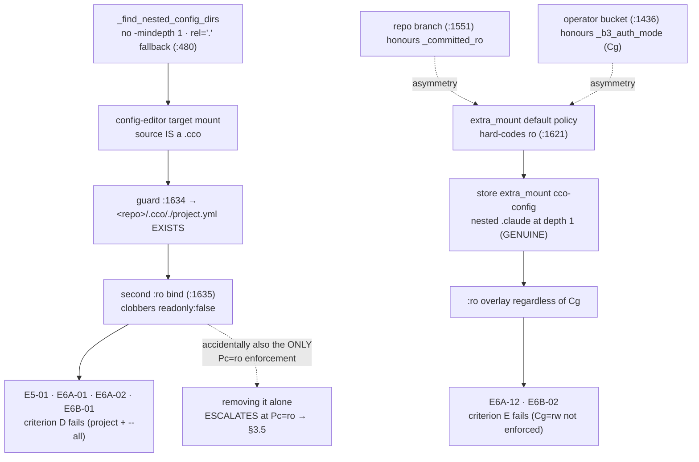
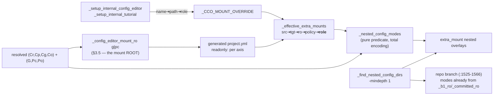

# Fix design RC-1 — nested-config clamp over-reach

> **Status**: design (2026-07-19, rev. 2 after adversarial review), cycle 1 of the e2e v2 fix
> workstream.
> Input: [`../results/consolidated-review.md`](../results/consolidated-review.md) §3 RC-1 and
> the ratified decision **D-M1**. Structural template: [`../../fix-design/00-overview.md`](../fix-design/00-overview.md).
> **No implementation code is written in this phase** — the snippets below are marked
> *design intent* and exist to pin contracts, not to be pasted.
>
> Every line quoted in §1 was read from the working tree on 2026-07-19 and both defects
> were **reproduced hermetically** via `bin/test` + `--dry-run --dump` (§1.4). The review's
> line numbers were re-verified; they had **not** drifted.
>
> **Rev. 2 changes** (all three folded into the body, not appended): the helper's return
> encoding is now **total** and peeled with `_peel_tab` (§3.2 — the `''`/`ro` encoding plus
> `IFS=$'\t' read` swapped the two axes); the config-editor target mount's `readonly:` now
> derives from `Pc` in the **same commit** (§3.5 — without it the fix *loosens* `Pc=ro`); and
> the test plan gains the mixed-axis unit cases and a verified T10 claim (§6).

## 1. Root cause

Two defects in one cluster, both in the mount-generation pass of `lib/cmd-start.sh`
(`_start_generate_compose`). They share a single helper and a single ADR clause
([ADR-0049 §7](../../decisions/0049-claude-access-concordant-model.md)), which is why they
present as one root.

### 1.1 Defect (a) — the discovery helper matches its own root

`lib/cmd-start.sh:474-486`:

```bash
_find_nested_config_dirs() {
    local root="$1" base="$2" require_file="${3:-}" d rel
    [[ -d "$root" ]] || return 0
    while IFS= read -r d; do
        [[ -z "$d" ]] && continue
        [[ -n "$require_file" && ! -f "$d/$require_file" ]] && continue
        rel="${d#"$root"}"; rel="${rel#/}"; [[ -z "$rel" ]] && rel="."
        printf '%s\n' "$rel"
    done < <(find "$root" -maxdepth 6 \
                \( -name .git -o -name node_modules -o -name .venv -o -name venv \
                   -o -name vendor -o -name target -o -name dist -o -name build \) -prune -o \
                -type d -name "$base" -print 2>/dev/null | sort)
}
```

There is no `-mindepth 1`, so when `$root` is *itself* named `$base` the `find` prints the
root and the `rel="."` fallback at `:480` fires. The header comment at `:470-471` states
this is deliberate — *"The mount ROOT itself (rel `.`) is included when it matches, so this
SUBSUMES the former root-only check"* — but that intent is contradicted by ADR-0049 §7,
which scopes the clamp to **nested** trees and says the root is governed elsewhere:

> ADR-0049 §7: *"**Default**: all nested `.claude`/`.cco` directories **inside** an
> extra_mount are read-only … **The mount's own `readonly:` flag governs everything else.**"*

The mount root **is** "everything else".

config-editor delivers each editing target as a synthetic extra_mount whose **source is a
`.cco` directory** — `lib/cmd-start.sh:107-112`:

```bash
    _CCO_MOUNT_OVERRIDE=$(printf 'cco-config\t%s\ncco-docs\t%s' "$cfg" "$REPO_ROOT/docs")
    local _tn _tp
    while IFS=$'\t' read -r _tn _tp; do
        [[ -z "$_tn" ]] && continue
        _CCO_MOUNT_OVERRIDE+=$(printf '\n%s-config\t%s' "$_tn" "$_tp")
    done <<< "$targets"
```

and `:149-153` declares them writable:

```bash
            cat <<YAML
  - name: ${_tn}-config
    target: /workspace/${_tn}-config
    readonly: false
YAML
```

The `.cco` sweep's qualification guard at `:1634` then resolves against the root:

```bash
                            [[ -f "${_ms}/${_nc_rel}/project.yml" ]] || continue
```

With `_nc_rel="."` this is `<repo>/.cco/./project.yml`, which **exists for every real
project**, so `:1635` emits a second bind over the identical destination:

```bash
                            _compose_vol "${_ms}/${_nc_rel}" "${_mt}/${_nc_rel}" "ro"
```

Docker orders binds by destination depth, so the `/.` child wins and the whole editing
target is read-only.

**This accident is load-bearing in one direction** — it is currently the *only* thing that
enforces `Pc=ro` on that mount, because the mount root's mode comes solely from the
hardcoded `readonly: false`. Removing it without §3.5 would be a privilege escalation, not
just a fix. See §3.5 and §5.

### 1.2 Defect (b) — the extra_mount branch is blind to the session triple

`lib/cmd-start.sh:1616-1622`:

```bash
                if [[ "$_mro" != "true" && "$_mpolicy" != "write" ]]; then
                    if [[ "$_mpolicy" == "project" ]]; then
                        _claude_ro=""; [[ -n "$_b1_ro" ]] && _claude_ro="ro"
                        _cco_ro="";    [[ -n "$_committed_ro" ]] && _cco_ro="ro"
                    else
                        _claude_ro="ro"; _cco_ro="ro"
                    fi
```

At the **default** policy (`ro`) both modes are hard-coded, ignoring the resolved triples.
Two sibling call sites in the same function do consult them:

- the **repo** branch, `:1551` — `if [[ -n "$_committed_ro" ]]; then` (Pc-gated);
- the **operator-bucket** branch, `:1436` — and this one is the exact template for the fix:

```bash
                if [[ -z "$_op_rw" && "$_b3_auth_mode" == "ro" && -d "$config_dir/.claude" ]]; then
                    _compose_vol "$config_dir/.claude" "/home/claude/.cco/.claude" "ro"
                fi
```

`_b3_auth_mode` is derived from **Cg** at `:1324` (`[[ "$claude_cg" == "ro" ]] && _b3_auth_mode="ro"`).
So `~/.cco/.claude` is correctly rw at `/home/claude/.cco/.claude` when `Cg=rw`, and
incorrectly `:ro` at `/workspace/cco-config/.claude` — one host tree, two container views,
opposite modes. That is precisely the contradiction table in **E6B-02**.

`~/.cco/.claude` is a **genuine** nested dir at depth 1, not a self-match: `-mindepth 1`
alone does **not** fix it.

### 1.3 Why the store escapes the `.cco` sweep but not the `.claude` sweep

`~/.cco` has no root `project.yml`, so `:1634` `continue`s and the store mount itself stays
writable. Its nested `.claude` has no such guard (`:1623-1628`) and is clamped
unconditionally. This asymmetry is what made the defect invisible until a `G=rw` session ran.

### 1.4 Reproduction (hermetic, this working tree)

`cco start config-editor --project myproj --dry-run --dump` →

```
- "…/repos/myproj/.cco:/workspace/myproj-config"
- "…/repos/myproj/.cco/.:/workspace/myproj-config/.:ro"      ← defect (a)
```

`cco start config-editor --dry-run --dump` (bare, global mode, `G=rw`, `Cg=rw`) →

```
- "…/home/.cco:/workspace/cco-config"
- "…/home/.cco/.claude:/workspace/cco-config/.claude:ro"                             ← defect (b)
- "…/home/.cco/templates/project/base/.claude:/workspace/cco-config/templates/project/base/.claude:ro"
```

The third line is a **finding no e2e session reported**: template `.claude` trees inside the
store are clamped too, so config-editor cannot author project-template Claude content at
`G=rw` either. Same root, same fix.

**Third reproduction — the escalation guard (§3.5).**
`cco start config-editor --project myproj --cco-access global=rw,current=ro,others=none --dry-run --dump`
(resolves `G=rw Pc=ro Po=none`, hence `Cp=ro` by the ADR-0049 §2 derivation) →

```
- "…/repos/myproj/.cco:/workspace/myproj-config"             ← readonly:false, hardcoded
- "…/repos/myproj/.cco/.:/workspace/myproj-config/.:ro"      ← the self-clamp — the ONLY Pc=ro enforcement
```

`Pc=ro` is reachable today: it is not a shipped *preset*, but the granular
`--cco-access global=…,current=…,others=…` form is a shipped user-facing surface, and the
conditional INV-2 floor (ADR-0048) only guarantees `Pc ≥ ro` — it does not force `rw`. So
`Pc=ro` with a named target is a real, reachable session.

### 1.5 Causal map



## 2. Findings closed and criteria restored

| Finding | Session | Defect | Closed by |
|---|---|---|---|
| **E5-01** | E5 | (a) | `-mindepth 1` |
| **E6A-01** | E6A run B | (a) | `-mindepth 1` |
| **E6A-02** | E6A run B | (a) — facet (`…-config/claude` ro because the whole mount is ro) | `-mindepth 1` |
| **E6B-01** | E6B | (a) — all 7 targets | `-mindepth 1` |
| **E6A-12** | E6A run A | (b) | role-keyed triple resolution |
| **E6B-02** | E6B | (b) | role-keyed triple resolution |
| *(unreported)* | — | (b) — store template `.claude` trees | role-keyed triple resolution |
| *(escalation guard)* | — | (a), inverse polarity | target `readonly:` from `Pc` (§3.5) |

**Acceptance criteria (§8) restored:**

- **D — config-editor by-mode.** project mode `(ro,rw,none)` and `--all` `(rw,rw,rw)` become
  *physically* what they declare: the target `<repo>/.cco` trees are writable. Global mode
  `(rw,none,none)` gains the store `.claude`/template authoring it exists for. D moves from
  **FAIL (2/3 modes)** to PASS for the mount dimension.
- **E — claude_access concordant.** `Cg=rw` is enforced on every view of `~/.cco/.claude`;
  `Cp=rw` is enforced on the target authoring tree; `Pc=ro` remains enforced on the target
  root (§3.5). The `.claude`-read-only-by-default reversal and the
  `~/.claude/settings*.json` write floor are untouched.
- **C — model correctness** (partial): removes the RC-1 clause *"triple not physically
  binding"*. C also depends on RC-5, out of cycle-1 scope for this doc.

**Not closed here**: RC-6 (config-editor target repos never mounted, `lib/local-paths.sh:180-200`)
is the sequential successor in the same subsystem and is designed separately.

## 3. The fix

Four changes, each with one responsibility. The predicate that both branches got wrong is
centralized once; the discovery helper is corrected at its source, closing the class for
user mounts as well as synthetic ones; and the mount **root** mode is derived from the
triple so that correcting the nested clamp cannot silently widen it.

### 3.1 `_find_nested_config_dirs` returns strictly *nested* dirs (defect a)

**Contract change**: the helper's output no longer contains `.`; its domain is dirs strictly
*below* `$root`. `-mindepth 1` enforces it at the `find` level; a bash guard states it as
the normative rule so the contract survives a future `find` edit.

```bash
# DESIGN INTENT — not implementation.
# INVARIANT: never returns the search root. The root's own mode is governed by the
# mount that produced it (ADR-0049 §7 "the mount's own readonly: flag governs
# everything else"), never by the nested clamp.
_find_nested_config_dirs() {
    ...
        rel="${d#"$root"}"; rel="${rel#/}"
        [[ -z "$rel" ]] && continue          # the search root itself — not nested
        printf '%s\n' "$rel"
    done < <(find "$root" -mindepth 1 -maxdepth 6 …)
}
```

The header comment at `:465-473` must lose the *"The mount ROOT itself (rel `.`) is included …
SUBSUMES the former root-only check"* sentence — it is the load-bearing untruth that made
the defect look intentional. Its replacement must state the §3.5 counterpart: because the
root is no longer swept, **every** producer of a config mount is now responsible for its own
`readonly:`.

**Repo branch is unaffected**: it searches `$repo_path` (e.g. `…/myrepo`), never a directory
named `.claude`/`.cco`, so `<repo>/.claude` and `<repo>/.cco` are depth-1 children and keep
matching. Verified against `tests/test_access_resolution.sh:688`, which asserts exactly that.

### 3.2 One predicate for the nested-config mode (defect b)

Replace the 3-branch `if` at `:1616-1622` with a call to a **pure**, unit-testable resolver —
the file's stated convention for access helpers (*"The pure helpers below are side-effect-free
so they can be unit-tested in isolation"*, `lib/cmd-start.sh:~184`).

#### 3.2.1 Return encoding — total, never empty

The obvious encoding (`""` = writable, `"ro"` = clamp) is **rejected**: a TAB record with an
empty field cannot be read back with `IFS=$'\t' read`, because **tab is IFS whitespace**, so
`read` collapses runs of it and drops leading/middle empty fields. Proven in this tree:

```
$ IFS=$'\t' read -r a b <<< $'\tro'; echo "a=[$a] b=[$b]"
a=[ro] b=[]                       # ← the two axes are SWAPPED
```

This is not a hypothetical. `lib/utils.sh:96-110` already documents the hazard and forbids
the idiom for exactly this reason — *"it MUST be a manual peel, never `IFS=$'\t' read`,
because tab is whitespace to `read`, which collapses adjacent delimiters and so silently
drops empty MIDDLE fields"* — and ships `_peel_tab` as the sanctioned peel.

Two independent guards are therefore adopted, and both are normative:

1. **The encoding is total.** Each field is the literal string `ro` or `rw`. No field is ever
   empty, so the record is safe under any reader and the value is self-describing at a
   call site (`[[ "$_claude_ro" == "ro" ]]`, not `[[ -n … ]]`).
2. **The peel is `_peel_tab`.** Even with a total encoding, consumers use `_peel_tab` — the
   repo rule for TAB records, and the guard that survives a future contributor
   reintroducing an empty field.

#### 3.2.2 The predicate

```bash
# DESIGN INTENT — not implementation.
# The SINGLE source for "what mode do nested config trees inside an extra_mount take?".
# Echoes "<claude_mode>\t<cco_mode>". Each is the LITERAL "ro" (emit a :ro overlay) or
# "rw" (leave writable) — TOTAL, never empty (§3.2.1). Pure: every input is an argument.
#   role ∈ ''(user mount) | store | project-config      — see §3.3
#   ktriple = "Cr,Cp,Cg,Co"   ctriple = "G,Pc,Po"
_nested_config_modes() {
    local mro="$1" policy="$2" role="${3:-}" ktriple="${4:-}" ctriple="${5:-}"
    local cr cp cg co g pc po
    IFS=, read -r cr cp cg co <<< "$ktriple"
    IFS=, read -r g  pc po    <<< "$ctriple"
    # A :ro mount already locks everything; `write` opts out wholesale.
    [[ "$mro" == "true" || "$policy" == "write" ]] && { printf 'rw\trw'; return 0; }
    case "$policy" in
        project)  _nc_emit "$cr" "$pc"; return 0 ;;   # unchanged: repo-native axes
    esac
    # policy = ro (the default). A framework-synthetic config mount is governed by the
    # session triple for the tree it REPRESENTS; a user mount stays strict.
    case "$role" in
        store)           _nc_emit "$cg" "$g"  ;;      # ~/.cco  → Cg / G
        project-config)  _nc_emit "$cp" "$pc" ;;      # <repo>/.cco → Cp / Pc
        *)               printf 'ro\tro'     ;;      # user extra_mount — UNCHANGED
    esac
}
# _nc_emit <claude_axis> <cco_axis>: an axis of "rw" → "rw"; "ro" AND "none" → "ro"
# (fail-closed: an axis that grants no access never yields a writable overlay).
```

**Mandated consumer idiom** (`lib/cmd-start.sh:1616`):

```bash
_peel_tab "$(_nested_config_modes "$_mro" "$_mpolicy" "$_mrole" \
              "$claude_cr,$claude_cp,$claude_cg,$claude_co" "$cco_g,$cco_pc,$cco_po")" \
          _claude_ro _cco_ro
# then: [[ "$_claude_ro" == "ro" ]] && …   (NOT [[ -n … ]])
```

Both the encoding and the peel were verified together against all nine reachable
(mro, policy, role, axis) combinations, including **both** mixed-axis directions
(`claude=rw,cco=ro` and `claude=ro,cco=rw`) — see §6 T11 for the table, which is the test
this exercise became.

**The strict `ro` default for user extra_mounts is unchanged**, as D-M1 requires, and
`config_access_policy` remains the explicit per-mount override with its current three values.

### 3.3 `role` — a first-class signal, not a name heuristic

The brief's constraint is right: keying on the `-config` suffix would be a heuristic over a
string a user can collide with. The **existing** authoritative marker of "this mount is
framework-generated, not user-declared" is `_CCO_MOUNT_OVERRIDE` — the in-process table set
only by `_setup_internal_tutorial` (`:50`) and `_setup_internal_config_editor` (`:107-112`),
consulted by `_effective_extra_mounts` before the persistent index
(`lib/local-paths.sh:238`). Role belongs there: same producer, same lifetime, same mechanism,
no new registry.

**Contract changes:**

1. `_CCO_MOUNT_OVERRIDE` line format `name<TAB>path` → `name<TAB>path<TAB>role`
   (role may be empty). `_mount_override_get` (`lib/local-paths.sh:211-218`) **must** peel
   three fields — today `read -r oname opath` would absorb `path<TAB>role` into `opath`.
   Use `_peel_tab`, per §3.2.1. Add a sibling `_mount_override_role <name>`.
2. `_effective_extra_mounts` emits a **5th** TSV field `role` (empty for every user mount).
3. Producers set: `cco-config` → `store`; `<name>-config` → `project-config`; `cco-docs` →
   empty (declared `readonly: true`, so `_nested_config_modes` short-circuits anyway).
   Tutorial declares both its mounts `readonly: true` (`internal/tutorial/project.yml:13-24`),
   so its role assignment is inert-but-correct.

**Consumer peel, again.** The extra_mount reader at `:1604` is
`while IFS=$'\t' read -r _ms _mt _mro _mpolicy`. Appending a 5th field happens to be safe
*today* only because `_effective_extra_mounts` normalizes `policy` to a **total**
`ro|project|write` (`lib/local-paths.sh:249`) — there is no empty middle field to collapse.
That is an invisible coupling between two files, and `_effective_extra_mounts` itself already
carries the warning comment about it (`lib/local-paths.sh:220-223`). The reader must
therefore switch to a line-at-a-time `_peel_tab` of five names, so correctness stops
depending on a totality invariant maintained elsewhere.



### 3.4 Why role-keyed axes and not literally `_committed_ro`/`_b1_ro`

D-M1's wording is *"consults `_committed_ro`/`_b1_ro` at default policy"*. Applied
**literally** that is the existing `policy: project` mapping, and it **would not close
E6A-12 / E6B-02**: `_b1_ro` is derived from **Cr** (`:1325`), and ADR-0049 fixes `Cr` at `ro`
for every session (criterion E: *"Cr always ro"*). A store mount whose nested `.claude` is
resolved through `Cr` stays `:ro` forever, so `Cg=rw` remains unenforced and two of D-M1's
own six findings survive the fix.

The role keying is the engineering that makes D-M1's *stated outcome* — "removing the
asymmetry with the repo branch" — actually hold: each synthetic mount resolves against the
axis that names the tree it represents. This is not a new axis, a new knob, or a change to
any settled decision; it is the same triple, read on the correct component. See §8 Q1.

### 3.5 The mount **root** follows the triple too (the escalation guard)

`-mindepth 1` removes the self-clamp. On the config-editor target mounts that self-clamp is,
today, the **only** physical enforcement of `Pc`, because `_setup_internal_config_editor`
hardcodes `readonly: false` (`:152`). Role keying cannot compensate:
`_nc_emit "$cp" "$pc"` governs **nested** trees, whereas the mount root is by construction
governed solely by `readonly:`. Landing §3.1 alone therefore turns a `Pc=ro` session's target
`project.yml`/`.cco` tree from read-only into writable — the same declared-vs-enforced class
as RC-1, opposite polarity. **This change is in scope for the same commit; it is not an
optional widening.**

The store mount already does the right thing: its flag comes from the triple via
`_config_editor_store_ro` (`:137`, `:549`), which resolves the same inputs
`_start_resolve_access` will and returns `G`. The fix is to generalize that one resolver to
either axis and use it for both mounts:

```bash
# DESIGN INTENT — not implementation.
# _config_editor_mount_ro <axis>  (axis ∈ g | pc) → "true"/"false"
# Generalizes _config_editor_store_ro (retired; its single caller is :137). The
# config-editor project.yml is generated BEFORE _start_resolve_access, but for a
# built-in the only cco_access sources are the CLI override and the by-mode default,
# so the triple is fully determined here — the mount flag and the resolved triple
# cannot diverge. Fails safe to read-only.
#   cco-config    (~/.cco)        → axis g     (unchanged behaviour)
#   <name>-config (<repo>/.cco)   → axis pc    (NEW — was hardcoded false)
```

The chosen axis is `pc`, matching §3.2's `project-config` role, so root and nested trees of
the same mount are governed by one axis and cannot contradict each other. Under `--all`,
`Pc == Po == rw`, so targets stay writable exactly as before (see §8 Q2 for the
`current`-vs-`others` assumption, which this change inherits rather than introduces).

**Net effect on shipped modes: none.** project mode `Pc=rw`, `--all` `Pc=rw`, `edit-global`
`Pc=rw` all yield `readonly: false`, as today. The change is visible only on the granular
triples that can set `Pc=ro`, which is precisely where today's behaviour is accidental.

## 4. Alternatives rejected

| # | Alternative | Why rejected |
|---|---|---|
| **A1** | Emit `config_access_policy: write` on the generated target mounts (the option D-M1 already rejected). | Leaves the self-match class latent for user mounts; duplicates intent the triple already carries; and disables the clamp *wholesale*, so a genuinely nested foreign `.claude` inside a target would go rw too. |
| **A2** | Emit `config_access_policy: project` on the generated mounts. | Routes framework intent through a user-facing per-mount attribute, and — decisively — maps `.claude` to **Cr**, which is always `ro`. Does not fix E6A-12/E6B-02 (§3.4). |
| **A3** | `-mindepth 1` only (defect (a) alone). | Fixes 4 of 6 findings. Criterion **E** still fails: `~/.cco/.claude` and store template `.claude` stay `:ro` at `Cg=rw`. And on its own it *escalates* `Pc=ro` (§3.5). |
| **A4** | Special-case `~/.cco` by comparing `$_ms` to `$(_cco_config_dir)`. | A path-identity heuristic, invisible at the producer, and blind to `project-config` targets. Two heuristics instead of one signal. |
| **A5** | Name-prefix/suffix heuristic on `-config` / `cco-config`. | Explicitly out per the brief: a user extra_mount may legitimately be named `foo-config`. Silent, collidable, untestable at the producer. |
| **A6** | Suppress the clamp whenever the session is a built-in (`is_internal=true`). | Session-scoped, not mount-scoped: it would also un-clamp `cco-docs` and any future built-in mount, and it cannot express *which* axis governs *which* tree. |
| **A7** | Fully collapse the repo branch and the extra_mount branch into one routine. | See §4.1. |
| **A8** | Keep the `""`/`"ro"` return encoding and only switch the peel to `_peel_tab`. | `_peel_tab` alone *is* correct, but the record stays a trap: any future consumer reaching for the ubiquitous `IFS=$'\t' read` idiom silently swaps the axes, with no test-visible symptom at same-valued axes. The total encoding removes the trap at the source; keeping both costs nothing (§3.2.1). |
| **A9** | Return via two named globals instead of a TAB record. | Correct, and immune to the splitting hazard — but it breaks the "pure, side-effect-free, unit-testable in isolation" convention the surrounding helpers state and the unit table in T11 depends on. A total record keeps purity *and* safety. |
| **A10** | Defer the target `readonly:` derivation (§3.5) to cycle 2. | Not deferrable: the self-clamp being removed here is today's only `Pc=ro` enforcement on that mount, so deferring ships a privilege escalation as part of a privilege-correctness fix (§3.5). |

### 4.1 On collapsing the two branches (the brief's explicit question)

The two branches share **discovery** (already one function) and, after this fix, **policy
resolution** (one new function). What they do **not** share is *qualification*, and the
difference is a real domain difference, not duplication:

- repo `.cco` sweep (`:1557-1563`): the **root** `<repo>/.cco` qualifies unconditionally — it
  *is* the project's committed config — while a nested `.cco` qualifies only with a
  `project.yml`;
- repo `.claude` sweep (`:1536-1540`): the root tree additionally carries the ADR-0049 §5
  functional-write floor (`_emit_local_settings_overlay`), which no extra_mount has;
- extra_mount `.cco` sweep: **every** candidate must self-identify with a `project.yml` —
  an extra_mount is not a project.

Merging these would produce a routine taking `<root> <target> <base> <mode> <require_file>
<root_exempt_rel> <emit_settings_floor>` — a six-to-seven-argument helper whose body is a
chain of flags, i.e. the two branches inlined behind a dispatcher. That is worse than the
partial collapse: it hides the domain distinction instead of naming it, and it widens the
blast radius of the fix from "the extra_mount default policy" to "every mount cco generates".

**Adopted: partial collapse.** The copy-paste that *caused* this bug — the mode predicate,
duplicated and divergent across three call sites — becomes one pure function. The
qualification rules stay where their meaning lives. If a third consumer of the nested sweep
ever appears, the collapse can be revisited with real evidence.

## 5. Blast radius

**Direct callers / consumers touched:**

| Site | Change | Risk |
|---|---|---|
| `lib/cmd-start.sh:474-486` `_find_nested_config_dirs` | `-mindepth 1` + drop `rel="."` | Behaviour change for any caller passing a root named `.claude`/`.cco` — today the config-editor targets (guarded by §3.5) and a hypothetical user mount rooted at a dotdir. |
| `lib/cmd-start.sh:1525-1566` repo branch | none (verified: search root is the repo dir) | Guarded by `tests/test_access_resolution.sh:688`. |
| `lib/cmd-start.sh:1605-1638` extra_mount branch | `if/else` → `_nested_config_modes`; `_peel_tab` a 5-field record; compare `== "ro"` not `-n` | The behaviour surface of the fix. |
| `lib/cmd-start.sh:137, 149-153` config-editor producer | target `readonly:` from `_config_editor_mount_ro pc`; store keeps `g` | §3.5 — the escalation guard. Must land in the same commit. |
| `lib/cmd-start.sh:542-557` `_config_editor_store_ro` | generalized to `_config_editor_mount_ro <axis>` | Single in-tree caller (`:137`); no test or doc references the old name. |
| `lib/local-paths.sh:211-218` `_mount_override_get` | must peel 3 fields via `_peel_tab` | **Would silently corrupt `opath` if missed** — the one non-obvious hazard. |
| `lib/local-paths.sh:220-252` `_effective_extra_mounts` | emit 5th field | Contract widening; see below. |
| `lib/session-context.sh:70-77` and `:180`, `lib/cmd-start.sh:2274-2280` | `while IFS=$'\t' read -r _src _tgt _ro _pol` | With a 5th field the trailing var absorbs `policy<TAB>role`. **Neither site reads `_pol`**, so this is latent, not live — but all three must be updated to peel (and ignore) the 5th field, or the TSV contract becomes a lie. |
| `lib/cmd-start.sh:50, 107-112` producers | append role column | — |

**What could regress:**

1. **User extra_mount rooted at a dotdir.** A rw extra_mount whose *source* is itself a
   `.claude` dir, or a `.cco` dir carrying a `project.yml`, stops being self-clamped `:ro`.
   This is the **one deliberate loosening** and it is exactly ADR-0049 §7's stated rule
   ("the mount's own `readonly:` flag governs everything else"). It needs a changelog line
   (§7) so anyone leaning on the accident is told.
2. **config-editor target at `Pc=ro` — the escalation this fix must not ship.** Removing the
   self-clamp would make the target writable against `Pc=ro`, because the root mode comes
   from a hardcoded `readonly: false`. §3.5 closes it in the same commit by deriving the flag
   from `Pc`. Guarded by **T15**. Without T15 the regression is invisible: no shipped preset
   produces `Pc=ro`, so only a granular triple exposes it.
3. **Axis inversion in the new predicate.** The mode pair is a TAB record; an empty field
   plus an `IFS=$'\t' read` consumer silently swaps `claude` and `cco` (§3.2.1). Closed by
   the total encoding *and* `_peel_tab`; guarded by **T11**'s two mixed-axis rows, which are
   asserted **through the consumer idiom**, not against the raw `printf` string.
4. **Genuinely nested config inside a synthetic mount.** Under `store`/`project-config` the
   nested trees now follow the triple rather than being pinned `ro`. At `G=ro`/`Cg=ro` the
   mount itself is already `:ro` and the whole block short-circuits, so the only reachable
   change is at `rw`, which is the intent.
5. **Secret masking is unaffected.** `_emit_secret_overlays` runs from `_op_config_masks`
   (`:1591-1596`) independently of this branch and emits *deeper* child mounts, so
   `secrets.env` stays masked on a now-writable target. Must be asserted (§6 T7) — this is
   the one place where "make it writable" could plausibly leak.
6. **No change to the ADR-0047 boundary.** The internal store mounts (`:1440+`) are a
   different branch; the setuid helper remains the write authority. Making a `<repo>/.cco`
   bind writable does not widen store access.

   > **Cycle-1.1 / S1 note (added 2026-07-21).** Still true *of RC-1* — but that "different
   > branch" is no longer untouched, and its line anchors have moved. The e2e v3 run found the
   > boundary's **shape** was itself the blocking root (R1): STATE crossed as individual **file**
   > binds (`index`, `running`) while DATA and CACHE crossed as directories, leaving the
   > `state/cco` parent as a runtime-created `root:root` dir that `cco-svc` cannot create in — so
   > every in-container index write failed `EACCES` while the verb still printed `✓`. That branch
   > now emits **one directory bind** of `state/cco/shared/`, an explicit allow-list sub-bucket
   > holding the index and the pack/template update sidecars; everything else under `state/cco`
   > (the 0600 `remotes-token`, `projects/`, transcripts, memory) stays off the container by
   > construction. Binding `state/cco` whole was rejected — it flips the boundary from allow-list
   > to deny-list. **INV-STATE** (`tests/test_invariants.sh`) pins the allow-list and pins that
   > the index is never file-bound again; the mount-generation hazard this belongs to is
   > `design-docker.md` §1.2.2.1. RC-1's own conclusion is unaffected: nothing here touches the
   > nested-config clamp or the `readonly:` derivation.

**bash 3.2 notes:**

- `-mindepth`/`-maxdepth` are supported by both BSD (macOS) and GNU `find`; keeping both
  immediately after the path argument avoids GNU's "non-option argument after expression"
  warning.
- `IFS=, read -r a b c <<< "$s"` is 3.2-safe: **comma is not IFS whitespace**, so empty
  fields are preserved and the axis triples split correctly. Herestrings are 3.2.
- `IFS=$'\t' read` is **not** safe for records that can carry an empty field — tab *is* IFS
  whitespace, so runs collapse and leading/middle empties vanish (`IFS=$'\t' read -r a b <<< $'\tro'`
  → `a=ro`, `b=`). This is why §3.2.1 mandates a total encoding *and* `_peel_tab`, and why
  `lib/utils.sh:96-110` exists. Applies equally to the widened 5-field extra_mount record
  (§3.3).
- Every new positional is defaulted (`"${3:-}"`) for `set -u`.
- No arrays are added, so no `${arr[@]+"${arr[@]}"}` guards are needed. The existing
  `_op_config_masks` guard at `:1593` is untouched.

## 6. Test plan

The oracle for RC-1 is the **generated compose stream**, which `--dry-run --dump` exposes
host-side. Unlike RC-2/RC-3, RC-1 is therefore **fully verifiable in the hermetic suite** —
it does not have to wait on the RC-17 container lane (which remains the right keystone for
the other roots, and should still re-confirm RC-1 end-to-end in a live session).

Every test below is annotated with **the assertion that fails on today's code**. Each
"passes today" claim below was *executed*, not assumed — the failure mode this review exists
to prevent (`test_operator_shim.sh:650`) is an unverified pass.

### `tests/test_config_editor.sh`

**T1 — `test_config_editor_project_mode_target_not_self_clamped`** *(defect a)*
`start config-editor --project myproj --dry-run --dump`; assert no compose line binds any
path under `/workspace/myproj-config` `:ro` other than a `secret-mask` line.
→ **Fails today**: the stream contains
`"…/repos/myproj/.cco/.:/workspace/myproj-config/.:ro"` (reproduced verbatim, §1.4).

**T1b — strengthen the existing false green.** `test_config_editor_project_mode_mounts_target_cco`
(`tests/test_config_editor.sh:91`) already asserts
`assert_file_not_contains … "…/myproj-config:ro"` and **passes today**, because the emitted
string is `…/myproj-config/.:ro`. It must be widened to a regex over the destination
(`:/workspace/myproj-config(/\.)?:ro`). Recording this explicitly: the existing test is a
false green of exactly the RC-17 shape and should be fixed in the same commit.

**T2 — `test_config_editor_global_mode_store_claude_writable`** *(defect b)*
Bare `start config-editor` outside any project (`G=rw`, `Cg=rw`) with `~/.cco/.claude`
populated; assert no `…/.cco/.claude:/workspace/cco-config/.claude:ro`.
→ **Fails today**: that exact line is emitted (§1.4).

**T3 — `test_config_editor_global_mode_store_template_claude_writable`** *(defect b, unreported)*
Same session with `~/.cco/templates/project/base/.claude` present; assert no `:ro` overlay on
it. → **Fails today**: line emitted (§1.4).

**T4 — `test_config_editor_edit_global_project_mode_both_trees_writable`** *(a + b together)*
`start config-editor --project myproj --cco-access edit-global` → `(rw,rw,none)`,
`Cg=rw`, `Cp=rw`. Assert **both**: target `.cco` not `:ro`, store `.claude` not `:ro`.
→ **Fails today on both assertions.** This is the single strongest regression guard: it is
the only shipped configuration where `G=rw` and `Pc=rw` coexist with a named target.

**T5 — `test_config_editor_project_mode_store_readonly` (existing, `:101`)** must keep passing
unchanged: at `G=ro` the store mount is `:ro`, `_nested_config_modes` short-circuits on
`mro=true`, and no nested overlay is emitted. Verified passing before; must pass after —
**explicitly a non-regression guard, not evidence of the fix.**

**T6 — `test_config_editor_all_mode_targets_writable`**: `--all` with ≥2 resolvable projects;
assert no target is `:ro`. → **Fails today** for every target (E6B-01: 7/7).

**T7 — `test_config_editor_secret_mask_survives_writable_target`**: extend the existing
`:252` masking test to run in project mode and assert
`secret-mask:/workspace/myproj-config/secrets.env:ro` is still emitted once the target is
writable. Passes today (masking is a separate branch) — a **guard against the fix leaking
secrets**, and stated as such.

**T15 — `test_config_editor_target_readonly_follows_pc`** *(§3.5 — the escalation guard)*
`start config-editor --project myproj --cco-access global=rw,current=ro,others=none`
(resolves `G=rw Pc=ro Po=none`). Assert the target is mounted **`:ro` at its root** —
`…/repos/myproj/.cco:/workspace/myproj-config:ro` — and, separately, that the self-clamp
line `…/.cco/.:/workspace/myproj-config/.:ro` is **absent**. Both assertions matter: the
first is the property, the second proves it is delivered by `readonly:` and not by the
accident being removed.
→ **Fails today on the first assertion and on the second**: today the root line carries no
`:ro` (the flag is hardcoded `false`) and the self-clamp line *is* present — verified
hermetically, §1.4 third reproduction. Add the `--all` counterpart asserting targets stay
writable at `Pc=rw`.

### `tests/test_start_dry_run.sh`

**T8 — `test_dry_run_extra_mount_root_dotdir_not_self_clamped`** *(defect a, user-mount class)*
A rw extra_mount whose source directory is literally named `.claude`; assert no
`"${dir}/.:${target}/.:ro"`. → **Fails today.** Repeat with a source named `.cco` carrying a
`project.yml`. This is the class-level half of D-M1 that no e2e session exercised.

**T9 — `test_dry_run_extra_mount_nested_config_strict_ro` (existing, `:476`)** must keep
passing byte-identically: a *user* extra_mount (role empty) with genuinely nested
`sub/.claude` and `proj/.cco` still gets `:ro`. Verified passing before; must pass after —
the guard that the strict default is unchanged for user mounts, per D-M1.

**T10 — `test_dry_run_extra_mount_config_policy_project` / `_write` (existing, `:499`, `:524`)**
unchanged: `_nested_config_modes` must reproduce their current behaviour exactly. The
load-bearing half is `:544-547` — `--claude-access repo` → `Cr=rw` while the session's
`Pc=ro`, i.e. **mixed axes**, asserting *no* `.claude` overlay while the `.cco` overlay
stands.

> This is the case that falsified the first draft of §3.2. With the `""`/`"ro"` encoding the
> record is `$'\tro'`, and the `IFS=$'\t' read` consumer yields `claude_ro=ro`, `cco_ro=` —
> both axes inverted, so the `.claude` overlay would be emitted and `:547` would **fail**.
> Under the §3.2.1 contract the same case was executed and returns `claude=rw`, `cco=ro`,
> matching today's `_claude_ro=""`, `_cco_ro="ro"` exactly. The claim "T10 unchanged" is
> therefore verified, not assumed — and only holds *because* of §3.2.1.

### `tests/test_access_resolution.sh`

**T11 — pure unit table for `_nested_config_modes`.** Cases
(mro, policy, role, ktriple, ctriple) → expected `(claude_mode, cco_mode)`. Two rules govern
this table:

- assertions go **through the mandated consumer idiom** (`_peel_tab` into two names), never
  against the raw `printf` string — a raw-string comparison passes while the wiring is
  inverted, which is exactly how the draft's defect would have shipped;
- the table **must** contain both mixed-axis directions, since same-valued axes are blind to
  an inversion.

| # | mro | policy | role | claude axis | cco axis | expect (claude, cco) |
|---|---|---|---|---|---|---|
| 1 | false | project | — | `Cr=ro` | `Pc=ro` | `ro`, `ro` |
| 2 | false | project | — | **`Cr=rw`** | **`Pc=ro`** | **`rw`, `ro`** ← T10's live case |
| 3 | false | project | — | **`Cr=ro`** | **`Pc=rw`** | **`ro`, `rw`** ← inverse mix |
| 4 | false | ro | `store` | `Cg=rw` | `G=rw` | `rw`, `rw` |
| 5 | false | ro | `store` | **`Cg=rw`** | **`G=ro`** | **`rw`, `ro`** ← mixed |
| 6 | false | ro | `project-config` | `Cp=rw` | `Pc=rw` | `rw`, `rw` |
| 7 | false | ro | `''` | any | any | `ro`, `ro` (user mount, strict) |
| 8 | **true** | ro | `store` | any | any | `rw`, `rw` (short-circuit) |
| 9 | false | **write** | — | any | any | `rw`, `rw` (short-circuit) |
| 10 | false | ro | `store` | `Cg=none` | `G=none` | `ro`, `ro` (fail-closed) |

→ **Fails today**: the function does not exist. These prove the *predicate*; T1–T10 and T15
prove the *wiring*. Both are required — the predicate alone is what A2 would have got right
in isolation and still shipped broken, and rows 2/3/5 are what a same-valued-only table
would have missed.

**T12 — `test_access_mount_nested_claude_recursive` (existing, `:688`)** must keep passing:
proves `-mindepth 1` does not regress the monorepo repo-branch sweep.

### `tests/test_local_paths.sh`

**T13 — `test_effective_extra_mounts_emits_role_field`**: with `_CCO_MOUNT_OVERRIDE` carrying
a role column, assert the 5-field TSV **peeled by `_peel_tab`**; with a plain index-resolved
user mount, assert an empty 5th field. → **Fails today**: only 4 fields are emitted.

**T14 — `test_mount_override_get_ignores_role_column`**: `_mount_override_get` returns the
path alone from a 3-column entry. → **Fails today**: `opath` would be `path<TAB>role`.

### Suite baseline

Full run must be green against the **1311/9** baseline (the 9 = pre-existing FI-19 boundary
artifacts, host-only). `tests/test_config_editor.sh`, `test_start_dry_run.sh`,
`test_access_resolution.sh`, `test_local_paths.sh`, `test_tutorial.sh` (`:69-72` asserts the
`_CCO_MOUNT_OVERRIDE` shape and **will need updating** for the role column) are the files
this fix touches.

### Deployment note

`cco start` is **host-side** code. Unlike the store verbs (which trampoline into the
image-baked cco), this fix is live as soon as the code lands — **no `cco build` required**
for RC-1 itself. A *running* session still shows the old mounts; it must be restarted. The
cycle-1 re-review still needs `cco build` from `develop` for the other roots.

## 7. Docs / ADR consequences

Per `.claude/rules/documentation-lifecycle.md`: ADRs are history → forward-annotate; design
docs are living → rewrite to truth.

- **ADR-0049 §7** (`decisions/0049-claude-access-concordant-model.md`) — **forward-annotate**.
  The text says *"Recursive detection: … nested at any depth … not only at the mount root"*,
  which the implementation read as "root included". Annotate: the mount **root** is governed
  solely by the mount's own `readonly:` flag (as §7 itself already says); the nested clamp
  never applies to it; framework-synthetic config mounts (`store`, `project-config`) resolve
  **both** their `readonly:` and their nested clamp from the session triple's corresponding
  axis at the default policy; and user extra_mounts keep the strict `ro` default. Point
  forward to this doc.
- **ADR-0048 §4/§5** — **forward-annotate**: the C2-asymmetry closure and the "store mount
  follows G" rule are now enforced on the `/workspace/cco-config` view as well as the
  operator bucket; the inverse asymmetry E6A-12 found is closed; and the sibling rule
  "target mount follows Pc" is stated alongside it.
- **ADR-0044 §3** — no change (mode resolution is untouched).
- `docs/maintainers/environment/design/design-docker.md` — **living**: add the nested-config
  governance table (mount root vs nested; role → axis) to the mount model section. This is
  the doc an implementer reads to understand which bind wins.
- `docs/users/reference/cli.md` — **living**: clarify that `config_access_policy` governs
  **nested** `.claude`/`.cco` only and never the mount root. Ships with the code (it
  describes shipped behaviour).
- **`changelog.yml`** — one entry, next free id (max is currently **45**; coordinate with the
  other cycle-1 fixes). Precedent for a user-visible **fix** carrying `type: additive` is
  entry 45 (the stale-launcher fix). Content: config-editor project/`--all` targets and the
  `~/.cco` `.claude`/template trees are now writable when the session's triple says they are;
  a granular `current=ro` now makes the target mount honestly read-only at its root; plus the
  one loosening — a rw extra_mount rooted at a `.claude`/`.cco` directory is no longer
  self-clamped. State "no `cco build` required; restart the session."
- **Migrations** — **none.** No `project.yml` schema change (`config_access_policy` keeps its
  three values), no store layout change, no `*_FILE_POLICIES` change. `_CCO_MOUNT_OVERRIDE`
  is an in-process global, never persisted. Per `.claude/rules/update-system.md` this is a
  **code-only** change.
- **`CLAUDE.md`** (repo root) — no edit required; the access paragraph does not describe the
  nested clamp. (It names `_config_editor_default_cco`, not the retired
  `_config_editor_store_ro`, so the §3.5 generalization leaves it accurate.)

## 8. Open questions for the maintainer

**Q1 — D-M1's literal wording vs the role-keyed axes.** D-M1 says the extra_mount branch
should consult *"`_committed_ro`/`_b1_ro`"*. Taken literally that is the existing
`policy: project` mapping, whose `.claude` axis is **Cr** — permanently `ro` under ADR-0049 —
so E6A-12 and E6B-02 would survive the fix (§3.4). This design keeps D-M1's *decision*
(consult the triple at default policy for built-in synthetic mounts; strict default unchanged
for user mounts) but resolves **which axis** per mount role: `store` → `Cg`/`G`,
`project-config` → `Cp`/`Pc`. Confirm this is the intended reading of D-M1 and not a
decision change.

**Q2 — `project-config` role and the `current` vs `others` axis.** config-editor targets are
classified as the *current* project by `_env_is_current_project` (ADR-0048), so `Pc`/`Cp` is
the correct axis; under `--all` `Pc == Po == rw`, so the two never diverge today. This
assumption now governs **both** the nested clamp (§3.2) and the mount root (§3.5), so it is
load-bearing in one more place than before — though §3.5 inherits it rather than introducing
it, and the two are deliberately keyed to the same axis so they cannot disagree. If a future
granular config-editor intent makes them diverge (e.g. `others=rw, current=ro`), the role
would need to carry the axis rather than assume `current`. Accept the `current` assumption
for cycle 1, or make the role carry the axis now?

**Q3 — verification item, not a design question: E6A-12 ⟂ E6B-02.** The two sessions
disagree on whether `/home/claude/.cco/.claude` (the operator bucket view) is writable in
`G=rw` mode — E6A measured `[ -w ~/.cco/.claude/settings.json ]` false, E6B measured rw.
Reading `:1436`, the code emits the `:ro` re-overlay **only** when `_b3_auth_mode == "ro"`
(i.e. `Cg=ro`), so at `Cg=rw` the bucket view **must** be rw and E6B is consistent with the
source. E6A's probe most likely resolved through the documented `/workspace/cco-config` view.
This design assumes E6B is correct; the re-review should re-measure all three views
(`/home/claude/.claude`, `/home/claude/.cco/.claude`, `/workspace/cco-config/.claude`) in
both global and `--all` mode to confirm, per consolidated-review §6.

> The former **Q3** ("adjacent latent defect: hardcoded `readonly: false` on target mounts —
> in or out of cycle 1?") is **withdrawn as a question and folded into the design as §3.5**.
> It is not adjacent and not latent: the self-clamp this fix removes is currently the only
> enforcement of `Pc=ro` on that mount, so shipping §3.1 without §3.5 would *introduce* the
> escalation rather than leave one standing.
