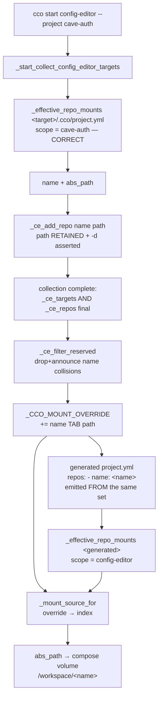
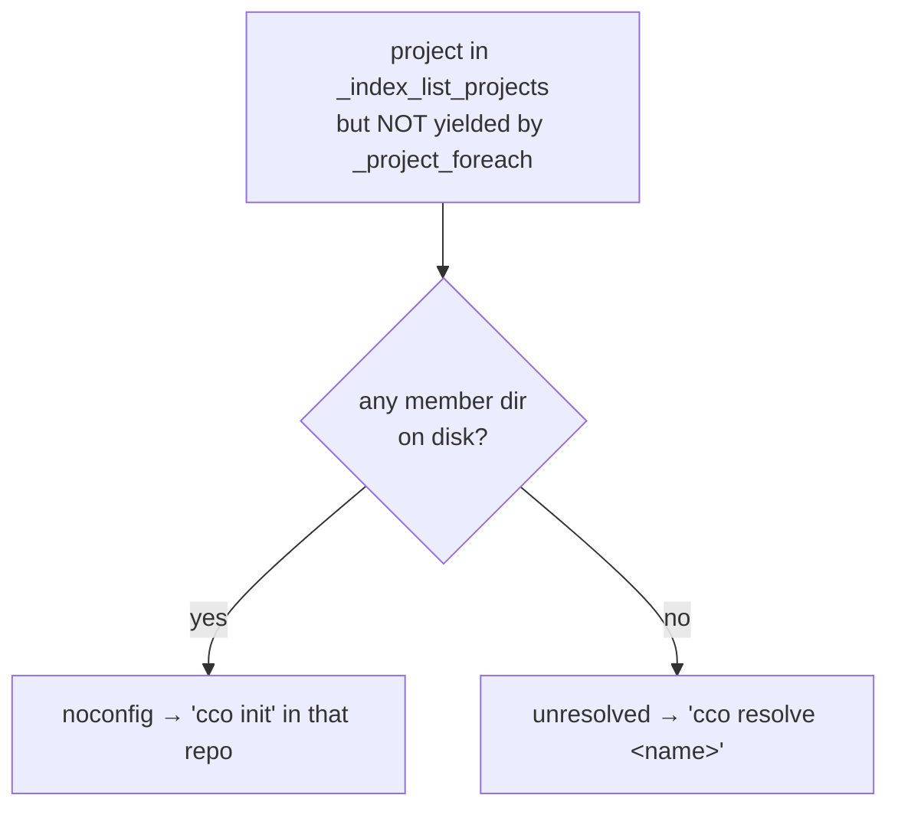

# Fix design RC-6 — config-editor target repos never mounted

> **Status**: Design phase (2026-07-19), cycle 1 of the e2e v2 fix workstream.
> Input: [`../results/consolidated-review.md`](../results/consolidated-review.md) RC-6 (finding
> E5-02) + ratified decisions D-M1/D-M2/D-M3. Structural template:
> [`../fix-design/00-overview.md`](../fix-design/00-overview.md).
> **No implementation code is written in this phase.** The snippets below are design intent.
>
> **Ordering**: per the consolidated review §5, RC-6 lands *after* RC-1 (same file,
> `lib/cmd-start.sh` mount generation) and *after* RC-17 (the container-operator test lane
> is what makes it verifiable in-session).

---

## 1. Root cause

`cco start config-editor --project <target>` declares the target's repos in the generated
`project.yml` but mounts none of them. The declaration and the mount are resolved by two
different, **incompatible** name scopes.

### 1.1 The resolved path is computed correctly — and then thrown away

`lib/cmd-start.sh:575-591` (`_start_collect_config_editor_targets`):

```bash
578:    local name path t rn rp
...
581:        for t in "${config_editor_targets[@]}"; do
582:            path=$(_resolve_unit_dir_for_project "$t") \
583:                || die "config-editor --project '$t' is not resolvable on this machine. Run 'cco resolve' first."
...
587:            # That project's repos — conscious-skip drops any unresolved member.
588:            while IFS=$'\t' read -r rn rp; do
589:                _ce_add_repo "$rn"
590:            done < <(_effective_repo_mounts "$path/.cco/project.yml")
```

`_effective_repo_mounts "$path/.cco/project.yml"` runs against the **target's own**
`project.yml`, so its internal scope is `cave-auth` — the lookup is correct and `rp` holds the
real host path. `rp` is then **never referenced again** (verified: `rp` appears only at
`:578` declaration and `:588`/`:604` `read`). Only the bare name survives:

```bash
493:# Add a repo logical name to the shared _ce_repos set (newline-joined, deduped).
494:_ce_add_repo() {
495:    local rn="$1"
496:    [[ -z "$rn" ]] && return 0
497:    [[ $'\n'"$_ce_repos" == *$'\n'"${rn}"$'\n'* ]] && return 0
498:    _ce_repos+="${rn}"$'\n'
499:}
```

### 1.2 The generated `project.yml` re-resolves the name in the wrong scope

`_setup_internal_config_editor` (`lib/cmd-start.sh:107-129`) publishes only the *internal*
mount names through the session override, and emits the repo names raw:

```bash
107:    _CCO_MOUNT_OVERRIDE=$(printf 'cco-config\t%s\ncco-docs\t%s' "$cfg" "$REPO_ROOT/docs")
108:    local _tn _tp
109:    while IFS=$'\t' read -r _tn _tp; do
110:        [[ -z "$_tn" ]] && continue
111:        _CCO_MOUNT_OVERRIDE+=$(printf '\n%s-config\t%s' "$_tn" "$_tp")
112:    done <<< "$targets"
113:    {
114:        cat <<YAML
115:name: config-editor
...
118:        # Repos (ADR-0042 §8): only under --project/--repo. Each name resolves to
119:        # its host path via the STATE index in _effective_repo_mounts (no override
120:        # needed — these are real user repos). Emitted only when non-empty so the
121:        # broad default stays repo-free (P18).
122:        if [[ -n "$repos" ]]; then
123:            echo "repos:"
```

The comment at `:118-121` is the defect, stated in prose: **"no override needed — these are
real user repos"** was true under the old global-flat index, and is false under ADR-0051.

### 1.3 The scope miss, and the silent drop

`lib/local-paths.sh:180-200`:

```bash
180:_effective_repo_mounts() {
181:    local project_yml="$1"
182:    local proj; proj=$(yml_get "$project_yml" name 2>/dev/null)   # per-project name scope (ADR-0051)
...
193:        _p=$(_index_get_path "$proj" "$name")
...
197:        [[ "$_p" != /* ]] && continue
198:        printf '%s\t%s\n' "$name" "$_p"
```

For the generated file `proj` is **`config-editor`** (`:115` `name: config-editor`), so the
lookup is `_index_get_path config-editor cave-auth`. Per ADR-0051 D2 the binding lives under
the *target's* key, and `_index_get_path` (`lib/index.sh:519-527`) has **no cross-project
fallback** — by design:

```bash
519:_index_get_path() {
520:    if [[ "$(_index_version)" -ge 2 ]]; then
521:        local v; v=$(_index_pp_get "$1" "$2")
522:        [[ -n "$v" ]] && { printf '%s\n' "$v"; return 0; }
523:        _index_section_get unscoped "$2"
```

Miss → `_p` empty → `[[ "$_p" != /* ]] && continue` → the repo is **dropped with no message**.
`ls /workspace/cave-auth` → `No such file or directory`.

### 1.4 Why extra_mounts survive and repos do not

`_effective_extra_mounts` consults the session override **first**; `_effective_repo_mounts`
does not consult it at all. That asymmetry is the whole bug:

```bash
# lib/local-paths.sh:238  (extra_mounts — override, then index)
238:        local _ms; _ms=$(_mount_override_get "$name" || _index_get_path "$proj" "$name")

# lib/local-paths.sh:193  (repos — index only)
193:        _p=$(_index_get_path "$proj" "$name")
```

### 1.5 `--repo <name>` is broken by the same root

`lib/cmd-start.sh:610-617` resolves the path (cross-project, deliberately) and discards it the
same way:

```bash
610:    for t in ${config_editor_repos[@]+"${config_editor_repos[@]}"}; do
613:        path=$(_index_get_path_any "$t")
614:        [[ "$path" == /* && -d "$path" ]] \
615:            || die "config-editor --repo '$t' is not resolvable on this machine. Run 'cco resolve' first."
616:        _ce_add_repo "$t"
617:    done
```

The `die` guarantees the name *was* resolvable at collect time — and then the mount bridge
fails to resolve it. **The consolidated review scopes RC-6 to `--project`; `--repo` and the
cwd-project branch (`:604-606`) share the identical defect.** All three are in scope here.

### 1.6 Built-ins have no resolution/existence heal — the second half of the root

The compose repo loop documents an invariant it does **not** itself enforce
(`lib/cmd-start.sh:1509-1511`):

```bash
1509:        # by the P14 conscious-skip in _effective_repo_mounts (warn + exclude,
1510:        # never a silent empty bind-mount, #B17), so every path here is a real,
1511:        # existing filesystem path.
```

That claim rests entirely on `_start_resolve_paths` having run `_resolve_unit` upstream — and
`_start_resolve_paths` **early-returns for every built-in**:

```bash
1062:_start_resolve_paths() {
1063:    unresolved_refs=0
1064:    $is_internal && return 0
```

So for config-editor nothing heals a stale binding. Downstream, neither
`_effective_repo_mounts` (`local-paths.sh:197` tests **absoluteness only**) nor `_compose_vol`
(`utils.sh:62-69`, a pure `printf`) tests existence. A target whose repo moved or was deleted
since the last `cco resolve` therefore reaches the compose as a bind source that does not
exist — Docker then **creates** the missing host directory (root-owned on Linux) or fails the
start. The `--repo` branch already gets this right (`:614` `[[ "$path" == /* && -d "$path" ]]`);
the two `--project`/cwd producers do not. **Mounting the repos without adding that test would
ship a second defect on top of the first**, so the existence assertion is part of this fix
(§3.5, INV-M3), not a follow-up.

### 1.7 Why `whoami` was honest — and what it teaches

`lib/cmd-whoami.sh:24-33` reads the *mounted* manifest's declared names and dir-tests
`/workspace/<name>` before listing a repo, so it correctly reported
`code repos: — (config only)`. No whoami change is needed; it self-corrects once the mounts
exist.

The interesting part is the **rule** it embodies: in-container, the truth about a repo is
"declared in the mounted manifest **and** `/workspace/<name>` exists" — never a STATE-index
host path. §3.4 generalizes exactly that rule to the introspection verbs, which today do the
opposite.

### 1.8 Why the suite is green

`tests/helpers.sh:59`, inside `setup_cco_env` — run by **every** test:

```bash
59:    seed_index_path "dummy-repo" "$CCO_DUMMY_REPO"
```

The 2-arg form writes the **unscoped escape-hatch bucket** (`helpers.sh:110-111` →
`_index_set_unscoped`), which `_index_get_path` falls back to *for any project scope*
(`index.sh:523`). So `_index_get_path config-editor dummy-repo` **succeeds** in tests via a
bucket production never populates — `create_project` (`helpers.sh:157`) and real
`cco init`/`cco resolve` always write **scoped** bindings.
`minimal_project_yml` (`helpers.sh:554-567`) declares exactly that name, so
`test_config_editor.sh:339` and `:354` assert the right behaviour and **pass on broken code**.
This is RC-17 in miniature: **the fixture, not the code, is what makes this green.** §6.1
fixes both tests in this cycle rather than routing around them.

---

## 2. Findings closed / criteria restored

| Item | Effect |
|---|---|
| **E5-02** | Closed — target repos mounted; `ls /workspace/<repo>` succeeds. |
| **Criterion D** (config-editor by-mode) | Restores the *delivery* half of project mode. RC-1 restores the triple half; D passes only with both. |
| **ADR-0042 §8 / ADR-0044 §3** | Repo-aware `project.yml` description authoring becomes possible — the stated reason project mode mounts code at all. |
| **ADR-0046/0047 conformance** | Held, not merely preserved: the newly-mounted repos' committed `.cco` stays `:ro` (§3.7), so a `Po=none` session never gains rw access to another project's config through a member repo. |
| **E6B-07 class** (partial) | The "silently skips an undeliverable target" pattern is announced at the config-editor collector. The general Level-A declared-but-unmounted **repo** marker stays RC-9/cycle 2. |
| **Suite honesty** (local) | `test_config_editor_project_mounts_repos` / `..._repo_flag_mounts_one_repo` stop passing for the wrong reason (§6.1). |

Not closed here: RC-9 (Level-A repo markers), RC-5's full vocabulary sweep (D-M3 defers it;
the announcement wording below is drafted to be compatible with D-M2's "not mounted in this
session" vocabulary), RC-12's "REPOS shows `-` for non-current projects" (an index-visibility
question, distinct from §3.4's mount-visibility one), and the general ADR-0046 §6 multi-repo
`Pc` span for *normal* sessions (§3.7 settles only the config-editor instance).

---

## 3. The fix

### 3.1 The invariants being restored

> **INV-M1 (mount-source resolution).** For every logical name declared in a `project.yml`
> consumed by the mount bridges, the effective host path is produced by **one** function in
> **one** order: session-local override → the per-project STATE index binding under that
> `project.yml`'s own `name:` scope. **No cross-project fallback** (ADR-0051 D2).
>
> **INV-M2 (synthetic-yml completeness).** A *generated* `project.yml` (built-in) has, by
> construction, **no** index bindings under its own `name:` scope. It must therefore publish a
> session-override binding for **every** logical name it declares. Enforced structurally: the
> generator emits the manifest **from** the override table, so declaring-without-publishing is
> not expressible.
>
> **INV-M3 (mount-source existence).** Every path that reaches `_compose_vol` as a bind source
> is an **existing directory**. For a normal project this is delivered upstream by
> `_resolve_unit`; built-ins skip that heal (`:1063`), so for a synthetic manifest the
> **producer** asserts it, and a failed assertion is *announced*, never silently dropped.
>
> **INV-M4 (declare ⇒ deliver, on both sides of the container boundary).** What a mounted
> manifest declares and what in-container introspection reports must agree. A name the
> session mounted is reported as mounted; a name it did not mount is reported with D-M2's
> "not mounted in this session" vocabulary. Host-side index bindings are not the in-container
> source of truth (`cmd-whoami.sh:24-33` already works this way).

INV-M1/M2 are the class-level closure for resolution; INV-M3 closes the existence gap §1.6
opens; INV-M4 keeps the fix from trading a mount bug for an introspection bug. Together they
cover repos, extra_mounts, the tutorial built-in, and any future synthetic manifest — not just
today's `--project` instance.

### 3.2 Resolution flow (target)



### 3.3 Change 1 — one host-side resolver for all three bridges (`lib/local-paths.sh`)

The duplicated-and-divergent predicate becomes a single helper; the three bridges call it.

```bash
# DESIGN INTENT — not implementation.
#
# _mount_source_for <project-scope> <name>
# THE single logical-name → host-path resolution for every mount bridge (INV-M1).
# Order: session-local override (ephemeral, in-process; published by a built-in's
# generated manifest — review H4) > the per-project STATE index binding (ADR-0051 D2).
# NO cross-project fallback: another project's same-name binding is a DIFFERENT
# resource (ADR-0051 D1), never a default.
_mount_source_for() {
    _mount_override_get "$2" || _index_get_path "$1" "$2"
}
```

Call sites: `_effective_repo_mounts` (`:193`), `_effective_extra_mounts` (`:238`),
`_declared_unresolved_extra_mounts` (`:271`). The non-absolute / conscious-skip guard
(`[[ "$_p" != /* ]] && continue`) is unchanged and stays in each bridge — it is a
*mount-emission* rule, not a resolution rule.

### 3.4 Change 2 — the in-container carrier (`_effective_repo_mounts`, operator mode)

`_CCO_MOUNT_OVERRIDE` is an **in-process host-side global** — never exported (verified: no
`export` at `cmd-start.sh:50`, `:107`, `:111`; the only readers are `local-paths.sh:213-216`
and one host-side test). So Change 1 alone fixes the host and leaves the container behind.

That matters because two **in-container** verbs consume this bridge —
`cmd-project-query.sh:38` (`cco project list`'s REPOS count) and `:210` (`cco project show`'s
`Repos:` block); every other call site (`cmd-start.sh`, `session-context.sh`) is host-only.
Inside a config-editor session the lookup is `_index_get_path config-editor <name>` → miss →
empty. **Today that is harmlessly consistent** (nothing declared-and-delivered, nothing
shown). After Change 1, `/workspace/webapp` would exist on disk while `cco project show`
prints an empty `Repos:` and `project list` counts 0 — the fix would *create* a
declare-vs-deliver divergence, the exact class this review exists to close. Leaving it is not
an option, and "Unchanged / None" would be literally true of the code and substantively wrong
about the outcome.

The carrier is the rule `cmd-whoami.sh` already ships (§1.7), applied to the bridge:

```bash
# DESIGN INTENT — inside _effective_repo_mounts, after the override/index lookup.
# In-container (operator mode) the STATE index is not the truth about what is
# MOUNTED: a synthetic manifest has no bindings under its own scope by
# construction (INV-M2), and _CCO_MOUNT_OVERRIDE is host-process-local. The
# container's truth is the mount itself — the same predicate cmd-whoami.sh:24-33
# uses. Fallback ONLY (never an override): a normal session's index hit is
# unchanged, so host-path display under show_host_paths keeps working.
if [[ "$_p" != /* ]] && _cco_container_operator \
   && [[ -d "${CCO_WORKDIR:-/workspace}/$name" ]]; then
    _p="${CCO_WORKDIR:-/workspace}/$name"
fi
```

Three properties make this safe rather than a second routing mechanism:

- **Fallback-only.** It fires exclusively when the host-side resolution already missed, so a
  normal in-container session (index hit) is byte-identical. In particular the
  `show_host_paths` rendering at `cmd-project-query.sh:229-235` — which deliberately prefers
  the host path when the knob is on — is untouched.
- **Host-path-free.** It emits a container path, so it cannot leak a host path in-container
  (INV-4 hygiene) and needs no new env carrier. Exporting the override table was the
  alternative and is rejected below (§4, alternative G).
- **Honest by construction.** Post-fix the generated manifest declares only names that were
  mounted, so "declared **and** `/workspace/<name>` exists" is exactly "delivered".

Scope note: this closes the *config-editor* divergence only. RC-12's "REPOS shows `-` for
non-current projects the index knows" is a different question (index visibility for projects
this session never mounted) and stays in cycle 2 — the fallback deliberately says nothing
about them, because for them the mount genuinely does not exist and D-M2's "not mounted in
this session" is the right answer, not a fabricated path.

### 3.5 Change 3 — carry the path, and assert it exists (`lib/cmd-start.sh`)

`_ce_repos` becomes newline-joined `name<TAB>abs_path`. The three producers already hold the
path; two of them do not yet test it (§1.6).

```bash
# DESIGN INTENT.
# _ce_add_repo <name> <abs_path>
# Dedup by NAME (one /workspace/<name> target exists). A second binding of the same
# name to a DIFFERENT path is an ADR-0051 homonym across two --project targets: it
# cannot share the container target, so it is announced and skipped, never silently
# dropped and never silently overwritten. A binding whose path no longer exists is
# a STALE index entry — built-ins skip the _resolve_unit heal (:1063), so this is
# the ONLY place it can be caught before it becomes a Docker-created root-owned
# directory (INV-M3). It is announced, not dropped.
_ce_add_repo() {
    local rn="$1" rp="$2"
    [[ -z "$rn" ]] && return 0
    [[ "$rp" != /* || ! -d "$rp" ]] && { _ce_skip_note "$rn" "stale"; return 0; }
    case $'\n'"$_ce_repos" in
        *$'\n'"${rn}"$'\t'"${rp}"$'\n'*) return 0 ;;                     # same name+path → dedup
        *$'\n'"${rn}"$'\t'*) _ce_skip_note "$rn" "homonym"; return 0 ;;  # same name, other path
    esac
    _ce_repos+="${rn}"$'\t'"${rp}"$'\n'
}
```

Producers: `:588-590` and `:604-606` pass `"$rn" "$rp"` (already read); `:610-617` passes
`"$t" "$path"` (already resolved and `die`-guarded — its own `-d` test at `:614` stays, since
an explicitly named `--repo` that does not exist is a *user error* worth dying on, whereas a
target's stale member is a warn-and-continue).

Note what this helper deliberately does **not** do: the reserved-name check. That is
order-dependent and cannot run here — see Change 4.

### 3.6 Change 4 — the reserved-name pass runs after collection, not inside the producer

The built-in claims container targets of its own: `/workspace/cco-config`,
`/workspace/cco-docs`, and `/workspace/<t>-config` for **every** collected target. A repo
whose logical name equals one of those cannot be mounted — post-fix it would emit **two
compose volumes at the same container target** (one from the repo loop `:1516`, one from the
generated `extra_mounts`), which `docker compose` rejects at start. Today the collision is
masked by the bug itself (the repo is dropped anyway), so this guard is new work, and
`cco project validate` is not its owner: it checks duplicates only *within* `repos:` and
*within* `extra_mounts:` (`cmd-project-validate.sh:121,141`), never across sections.

**The check is order-dependent, so it must run after collection completes.** The reserved set
depends on the *full* target list, and `_ce_targets` is appended **per iteration**
(`:585-587`) while repos are collected in the **same** iteration (`:588-590`). With
`cco start config-editor --project a --project b`, a repo declared by `a` and named
`b-config` is examined while `b` has not yet been appended — it would pass a producer-local
guard, obtain both an override entry and a `repos:` line, and reproduce precisely the
duplicate-target start failure the guard exists to prevent.

The guard is therefore a **post-collection pass** at the end of
`_start_collect_config_editor_targets`, where both sets are final (all three mode branches
*and* the `--repo` loop have run):

```bash
# DESIGN INTENT — final statement of _start_collect_config_editor_targets.
# _ce_filter_reserved: drop (and announce) every collected repo whose name
# collides with a container target the built-in itself claims. Runs ONCE, on the
# COMPLETE sets — the reserved set is a function of all --project targets, which
# are only final here.
#   reserved = cco-config, cco-docs, <t>-config for every t in _ce_targets
_ce_filter_reserved
```

Keeping the pass inside the collector (rather than in `_setup_internal_config_editor`) leaves
the generator a pure function of an already-clean set, so INV-M2's "emit the manifest from
the override table" stays a structural property with nothing to re-filter.

### 3.7 Change 5 — the newly mounted repos' committed `.cco` stays `:ro`

Mounting the target's repos would, unmodified, hand a `Po=none` session read-write access to
**other projects'** committed config. config-editor project mode resolves `(G=ro, Pc=rw,
Po=none)` (`cmd-start.sh:537`, `_config_editor_default_cco`), so `_pc_rw=true` →
`_committed_ro=""` (`:1333-1336`) → the A1 `:ro` overlay loop (`:1551-1565`) is skipped for
**every** repo in the session. A target's member repo that hosts a *different* project — the
`foreign` role `_project_member_role` explicitly classifies (`cmd-project-query.sh:65`,
`index.sh:765`) — would expose that project's `.cco/project.yml` **read-write** from a session
whose `Po` axis is `none`.

**Decision (ratified here): for the config-editor built-in, `_committed_ro` is `:ro`
regardless of `Pc`.** The rationale is that config-editor's repo mounts exist to *read code*,
not to author config: every writable config path it needs is already a dedicated mount —
`~/.cco` at `/workspace/cco-config` (rw iff `G=rw`) and each target's `<repo>/.cco` at
`/workspace/<t>-config` (rw). Nothing is lost by making the repo-path copy read-only, and
three things are gained:

1. **`Po=none` is honoured.** A foreign member's config is read-only, as the triple says.
2. **One authoring path.** The hosting repo's own `.cco` stops being writable at *both*
   `/workspace/<t>-config` and `/workspace/<t-repo>/.cco`, matching what the managed
   `cco-config-interaction.md` rule tells the agent to do. (This is what open question 2 of
   the previous draft asked; it is now decided, not deferred.)
3. **Uniformity across modes.** `--repo` in bare/global mode already gets `:ro` today
   (`Pc=none` → `_pc_rw=false`), so this removes a mode-dependent inconsistency rather than
   introducing one.

Secret masking is unaffected and still runs unconditionally over every mounted repo
(`:1581-1584`), so `<repo>/.cco/secrets.env` is masked on the repo path either way.

**What this does not do:** it does not settle the general ADR-0046 §6 multi-repo `Pc` span for
*normal* sessions (the deferred note at `:1566-1573` — "Pc's rw span limited to the HOSTING
repo, other members' divergent `.cco` re-overlaid `:ro`"). That case is untouched and stays
deferred; this decision is scoped to the built-in, where the authoring path is unambiguous
because the generator creates it.

### 3.8 Change 6 — publish before declaring (`_setup_internal_config_editor`)

The override table is built for **all** names first — `cco-config`, `cco-docs`, each
`<target>-config`, and now each repo — and the `repos:` block is emitted by iterating the
same set. INV-M2 then holds by construction rather than by assertion.

```bash
# DESIGN INTENT — inside _setup_internal_config_editor, replacing :107-129.
_CCO_MOUNT_OVERRIDE=$(printf 'cco-config\t%s\ncco-docs\t%s' "$cfg" "$REPO_ROOT/docs")
while IFS=$'\t' read -r _tn _tp; do
    [[ -z "$_tn" ]] && continue
    _CCO_MOUNT_OVERRIDE+=$(printf '\n%s-config\t%s' "$_tn" "$_tp")
done <<< "$targets"
# Repos (ADR-0042 §8): a generated manifest's `name:` scope holds NO index bindings
# (ADR-0051), so each repo's host path — already resolved in its OWNING project's
# scope by the collector, existence-asserted, and filtered for reserved-name
# collisions — is published through the same session override the config mounts
# use. Nothing is written to the persistent user-facing index (review H4).
while IFS=$'\t' read -r _rn _rp; do
    [[ -z "$_rn" ]] && continue
    _CCO_MOUNT_OVERRIDE+=$(printf '\n%s\t%s' "$_rn" "$_rp")
done <<< "$repos"
# ... then emit `repos:` from the SAME $repos set (names only — no host path is ever
# written into a manifest; AD3/G8 unchanged).
```

Note `$repos` is a runtime value; only the **name** reaches the generated YAML, so AD3/G8
("no host path in a manifest") is preserved exactly as it is for `cco-config`/`cco-docs`
today.

### 3.9 Change 7 — announce, never drop silently

Three distinct drops exist, and today all three are silent. None should be.

| Drop | Where | Announcement |
|---|---|---|
| Target member has **no binding** on this machine | the target's own conscious-skip at `:590` (before `_ce_add_repo` sees it) | `warn "config-editor: <target> declares repo '<n>' but it is not resolved on this machine — not mounted this session. Run 'cco resolve <target>' on your host."` |
| Binding exists but the path is **gone** (stale index, no built-in heal — §1.6) | `_ce_add_repo`'s `-d` test | `warn "config-editor: repo '<n>' not mounted this session — its recorded path no longer exists. Run 'cco resolve <target>' on your host."` |
| **Name collision** — homonym across two targets, or a reserved built-in mount name | `_ce_add_repo` (homonym) / `_ce_filter_reserved` (reserved) | `warn "config-editor: repo '<n>' not mounted this session — <reason>."` |

`_ce_skip_note` is one helper with one message shape, deliberately worded to match D-M2's
"not mounted in this session" vocabulary so the cycle-2 RC-5 sweep does not have to rewrite
it. The *no-binding* variant needs the declared-vs-effective diff for the target yml
(`yml_get_repo_coords` minus `_effective_repo_mounts`) — the same diff
`_declared_unresolved_extra_mounts` already performs for mounts. The *stale* and *collision*
variants need no diff: the collector already holds both the name and the reason.

#### 3.9.1 Cycle-1.1 / S7 — two more drop classes (added 2026-07-21)

The table above enumerated the drops that reach `_ce_add_repo`. The v3 run found two more that
never do, so §3.9's own rule — *announce, never drop silently* — did not yet cover them.

| Drop | Where | Announcement |
|---|---|---|
| An index-known **project** that `--all` cannot mount | `_start_collect_config_editor_targets`, `--all` branch | `_ce_skip_note <name> noconfig\|unresolved <name> project` |
| A target's **extra_mounts**, which config-editor never mounts | `_ce_announce_target_extra_mounts`, project modes | `_ce_skip_note <name> reference "" "extra mount"` |

`_ce_skip_note` gained a 4th positional, `<kind>` (default `repo`) — neither of these drops is a
repo — plus the `noconfig` and `reference` reason arms. The arms carry the *detail*; the single
`warn` still carries the *state*, so INV-ENV's budget of 2 for `cmd-start.sh` is unchanged.

**V5-05's prescribed fix site was dead code.** `00-plan.md` §8 item 1 pointed at the `--all`
branch's bare `[[ -d "$path/.cco" ]] || continue`. That test can never be false: `_project_foreach`
yields a project only when `<unit>/.cco/project.yml` is a **file**, and `_resolve_unit_dir_for_project`
asserts the same before it. The set of 8 became 7 one function upstream, in `_project_foreach`'s
own conscious-skips — which are correct there and must stay silent, because that iterator is shared
by many verbs and must not learn config-editor's vocabulary. So the announcement is built the way
`_ce_collect_target_repos` already builds it for repos: the **declared-vs-effective diff**
(`_index_list_projects` minus what `_project_foreach` yielded) computed in the config-editor
collector. The original `-d` test is kept as an announcing backstop, not a bare `continue`, so a
future relaxation of that contract surfaces instead of silently shrinking the target set.



Two realities, two remedies: prescribing `cco resolve` for a repo that is present but has no
`.cco` would be the same class of false-remedy INV-ENV exists to prevent. The probe runs through
`_cco_member_probe_path` (INV-F): an index entry is a **host** path, and only that helper knows
what is existence-testable in the current context.

**Decision (b) — config-editor never mounts a target's `extra_mounts`** (ratified with the
maintainer 2026-07-21, closing V4-F-V4-01). config-editor exists to author *config*; a target's
extra_mounts are reference material for a working session, not authoring surface, so mounting them
would widen the built-in's blast radius for no authoring gain. The alternative (a) — mount them
with the repos, RC-6's shape — was rejected on exactly that ground. What was **not** acceptable is
the state v3 found: neither delivered nor decided, while `cco path list` prints those bindings as
live host paths and so implies they are reachable. The decision is therefore announced, not merely
implemented — silence is what made it a finding. Not announced in `--all` mode, which mounts no
member surfaces at all by design (the same reason its repos are not announced one by one).

---

## 4. Why this shape, and not the alternatives

**The override table is not a bypass here.** It is a *resolved-binding carrier*. The path was
resolved in the **correct** scope (the target's own `project.yml`) and then discarded; the
fix stops discarding it. There is no "correct index lookup" being bypassed, because
`(config-editor, cave-auth)` has no binding and must not acquire one.

| Alternative | Why rejected |
|---|---|
| **A. Scope argument** — `_effective_repo_mounts <yml> [<scope-project>]` | Structurally too weak. One generated manifest can carry repos from **several** owner scopes (`--project a --project b`) plus `--repo`, which is cross-project *by design* (`_index_get_path_any`, `:613`). A single scope arg cannot express per-entry ownership. It would also push scope knowledge into 13 call sites, and add a *second* routing mechanism next to the one extra_mounts already use. |
| **B. Cross-project fallback** — `_index_get_path "$proj" "$name" \|\| _index_get_path_any "$name"` | Rejected hard. Resurrects the global default that **ADR-0051 D2 explicitly rejects**, and would bind an unrelated project's homonym as a **rw repo mount** — silently mounting the wrong working tree. Strictly worse than the current bug. |
| **C. Write the bindings into the STATE index under `config-editor`** | Exactly the **H4 defect already fixed** for extra_mounts (`local-paths.sh:207-210`): pollutes the persistent, user-facing index and clobbers a user binding of the same name. Also needs a host-side index write for a purely ephemeral routing concern. |
| **D. Per-entry `owner:` field in `project.yml`** | Leaks a built-in-only concern into the user-facing schema, and with it into `project validate`, export/import, and the rename verbs — for a file that is generated and never committed. |
| **E. Emit target repos as `extra_mounts`** (they would resolve through the existing override with zero new code) | Loses repo semantics. `_effective_repo_mounts` is what drives the B1 `.claude` `:ro` overlay (`:1525-1542`), the **`.cco` secret masking loop** (`:1581-1584`), the A1 `.cco` overlay Change 5 depends on, the proxy `allowed_paths`/pathmap, and Level-A's repo list. A target repo mounted as an "extra mount" would expose `<repo>/.cco/secrets.env` unmasked. Cheapest diff, worst outcome. |
| **F. Instance-only fix** (special-case config-editor inside `_effective_repo_mounts`) | Leaves the class latent: the tutorial built-in and any future synthetic manifest hit the same wall, and the repo/extra_mount asymmetry — the actual root — survives. The chosen shape removes the asymmetry itself. |
| **G. Export the override table into the container** (instead of Change 2's mount fallback) | The table holds **host** paths. Exporting it hands every in-container verb a host-path source that must then be re-gated by `show_host_paths` at each reader (INV-4), and hands an agent at `Po=none` a map of paths outside its scope — for information the container can already derive locally from the mount. Change 2's fallback needs no new env, leaks nothing, and reuses a predicate `cmd-whoami.sh` already ships. |
| **H. Accept the introspection divergence** and describe it with D-M2 vocabulary | D-M2's "not mounted in this session" is for things that genuinely are **not** mounted. Saying it about `/workspace/webapp` while `/workspace/webapp` exists is a *new* lie, not a vocabulary fix. |
| **I. Leave the repos' `.cco` rw** (skip Change 5) and rely on the ADR-0046 §6 deferral | The §6 deferral covers *normal* sessions, where the hosting repo is genuinely ambiguous. config-editor is not ambiguous: the generator itself creates the authoring mount, so the rw span is knowable exactly. Deferring here would mean shipping a **new** `Po=none`-violating rw path that did not exist before the fix. |

**Blast radius is not widened silently**: for a normal project `_CCO_MOUNT_OVERRIDE` is unset,
so `_mount_override_get` returns 1 on its first line (`:213`) and `_mount_source_for` degrades
to today's exact `_index_get_path` call. Change 2 is a miss-only fallback gated on
`_cco_container_operator`. Change 5 is gated on the built-in. Behaviour outside built-ins is
byte-identical on the host, and unchanged in-container wherever the index resolves.

---

## 5. Blast radius

### 5.1 `_effective_repo_mounts` consumers (13 sites)

| Site | Effect for config-editor project mode | Risk |
|---|---|---|
| `cmd-start.sh:1516` compose repo volumes | **New**: `/workspace/<repo>` appears | The intended fix. Sources are `-d`-asserted upstream (INV-M3), restoring the invariant the loop's comment claims |
| `cmd-start.sh:1525-1542` B1 `.claude` `:ro` overlay + `_emit_local_settings_overlay` | **Newly active** for these repos (Cr is always `ro`, ADR-0049) | ⚠ Re-exercises the ADR-0049 §5 mountpoint-creation path that once broke `cco start` by default. Fixed on `develop`; must be re-verified live, not just in the hermetic suite |
| `cmd-start.sh:1551-1565` A1 `.cco` `:ro` overlay | **Newly active** — Change 5 forces `_committed_ro=":ro"` for the built-in, overriding the `_pc_rw=true` short-circuit at `:1333-1336` | The ADR-0046/0047 conformance guarantee. Must be asserted by a test (T6) |
| `cmd-start.sh:1581-1584` secret masking | **Newly active** → `<repo>/.cco/secrets.env` masked on the repo path too | ✅ This is why the fix does not open a secret hole. Must be asserted by a test (T7) |
| `cmd-start.sh:840` `repos_check` warn | The spurious "No repositories defined" stops firing | Cosmetic improvement |
| `cmd-start.sh:1790-1797` start summary | Lists the target repos | Cosmetic |
| `cmd-start.sh:1090-1099` `_start_emit_reminders` | Unaffected — `$is_internal && return 0` (`:1091`) | None |
| `cmd-start.sh:2227-2246` proxy `allowed_paths`; `:2256-2270` pathmap | Inert — config-editor generates `docker.mount_socket: false` (`:156-157`) | None |
| `session-context.sh:60,178` Level-A repos + pathmap | Level-A now lists the target's repos honestly. Host-only (computed by `cco start`), so Change 2 does not apply | Intended |
| `cmd-project-query.sh:38,210` | **Changed** by Change 2: in-container these now report the mounted repos (via the `/workspace/<name>` fallback) instead of an empty set | The INV-M4 guarantee. Host-side behaviour and `show_host_paths` rendering unchanged (index hit wins). Must be asserted by a test (T9) |
| `cmd-whoami.sh` | Self-corrects (`:24-33` dir-test now passes) — no code change | None |

### 5.2 Interaction with RC-1 (D-M1)

RC-6 lands **after** RC-1. Once repos are mounted, `_find_nested_config_dirs` runs over them
for both the `.claude` overlay and — newly, via Change 5 — the `.cco` overlay. With D-M1's
`-mindepth 1` the repo-root `.claude`/`.cco` are still found (they sit one level below
`$repo_path`), so the overlay sets are unchanged — but the two changes must be integrated and
re-tested together, not independently. Change 5 in particular *increases* RC-1's exposure
surface, because the A1 loop now runs in a session where it previously did not.

### 5.3 bash 3.2 notes

- No associative arrays (bash 3.2 has none): `_ce_repos` stays a newline-joined
  `name<TAB>path` string, matched with `case`/`[[ == ]]` glob tests.
- `_ce_add_repo`'s existing dedup test `*$'\n'"${rn}"$'\n'*` **must** become tab-anchored
  (`*$'\n'"${rn}"$'\t'*`) once entries carry a path — otherwise dedup silently stops working.
- `_ce_filter_reserved` rebuilds `_ce_repos` by filtering it; it must read the old value into
  a local before reassigning, and keep the trailing `\n` shape the `case` tests assume.
- `while ... <<< "$empty"` yields one empty line; every new loop keeps the existing
  `[[ -z "$_rn" ]] && continue` guard (the pattern already used at `:110`, `:148`).
- `${config_editor_repos[@]+"${config_editor_repos[@]}"}` (`:610`) is the established
  `set -u` empty-array guard; any new array follows it. Prefer keeping `_ce_repos` a string
  precisely to avoid a second guarded array.
- `_mount_override_get` already guards the unset case (`:213`); `_mount_source_for` inherits
  it and must not add a second `<<<` on a possibly-unset variable.
- Change 2's fallback must guard `${CCO_WORKDIR:-/workspace}` (may be unset under `set -u`).

---

## 6. Test plan

### 6.1 Fixing the two tests that lie (cycle 1, not deferred)

`tests/helpers.sh:59` seeds `dummy-repo` **unscoped** for every test, and `_index_get_path`
falls back to the unscoped bucket for any scope. `minimal_project_yml` declares exactly that
name. Consequently `test_config_editor.sh:339` (`test_config_editor_project_mounts_repos`) and
`:354` (`test_config_editor_repo_flag_mounts_one_repo`) **pass today on broken code** — and
would keep passing after the fix *without exercising any part of it*, masking regressions in
the very code path being repaired. Leaving a knowingly-lying assertion in the suite is the
RC-17 anti-pattern; reproducing it inside the fix for RC-17's sibling root is not acceptable.
**Both are corrected in this cycle.**

The correction is **not** simply switching them to the 3-arg `seed_index_path <n> <p> <proj>`
form. Adding a scoped binding does not *remove* the unscoped one, and
`_index_get_path config-editor dummy-repo` would still hit the fixture's unscoped bucket at
`index.sh:523` — the test would go on passing for the same wrong reason. The honest
correction is to **stop using the fixture-seeded name**:

> **Rule for both repaired tests and every new test below: declare a repo the shared fixture
> does not seed (`webapp`), via an explicit `project.yml` (not `minimal_project_yml`), bound
> with the 3-arg scoped `seed_index_path webapp "$tmpdir/webapp" <project>` form, with the
> directory actually created on disk.** This is the production shape (`helpers.sh:157`, real
> `cco init`/`cco resolve`), it defeats the unscoped fallback, and it satisfies the new `-d`
> assertion.

Two tests, one mechanical change each; neither touches `tests/helpers.sh`, so this is
orthogonal to open question 1 and blocks on nothing.

| Repaired test | Change |
|---|---|
| `test_config_editor_project_mounts_repos` (`:339`) | Project declares `webapp` (scoped seed + real dir) instead of relying on `minimal_project_yml`'s `dummy-repo`. Same assertion, now failing on today's code |
| `test_config_editor_repo_flag_mounts_one_repo` (`:354`) | `--repo webapp`, scoped-seeded under its owning project. Collect-time `_index_get_path_any` still succeeds (cross-project by design); mount-time lookup misses today |

Open question 1 remains open for the *global* fixture — the blanket unscoped seed is why this
defect class shipped green and it will mask the next one — but RC-6 no longer depends on that
decision either way.

### 6.2 Tests

| # | File | Test | **Assertion that fails on today's code** |
|---|---|---|---|
| **T1** | `tests/test_local_paths.sh` | `test_effective_repo_mounts_honours_session_override` — set `_CCO_MOUNT_OVERRIDE="webapp\t/abs/webapp"`, project.yml declaring repo `webapp`, **no** index binding | `_effective_repo_mounts` emits `webapp\t/abs/webapp`. **Today: empty output** — repos never consult the override. The crisp unit-level proof of Change 1 |
| **T2** | `tests/test_local_paths.sh` | `test_effective_repo_mounts_no_cross_project_fallback` — `webapp` bound **only** under project `other`, no override | Output empty (ADR-0051 D2 upheld). Passes today; it is the **guard rail** against alternative B being reintroduced. Stated as such, not as proof of the fix |
| **T3** | `tests/test_config_editor.sh` | `test_config_editor_project_mounts_scoped_repo` — project `myproj` declaring repo `webapp`; `seed_index_path webapp "$tmpdir/webapp" myproj`; dir created; `--project myproj --dry-run --dump` | `assert_file_contains "$compose" "$tmpdir/webapp:/workspace/webapp"`. **Today: absent** — the volume is never emitted. The direct E5-02 regression test (§6.1 repair of `:339`) |
| **T4** | `tests/test_config_editor.sh` | `test_config_editor_repo_flag_mounts_scoped_repo` — same, via `--repo webapp` | Same assertion. **Today: absent** — covers §1.5, which the consolidated review does not name (§6.1 repair of `:354`) |
| **T5** | `tests/test_config_editor.sh` | `test_config_editor_stale_repo_binding_not_mounted` — `webapp` scoped-seeded to a path that does **not** exist on disk | No `:/workspace/webapp` volume **and** `assert_output_contains "not mounted this session"`. **Today: no volume either — but silently, and after a naive fix: a bind source Docker would create root-owned.** Proves INV-M3 |
| **T6** | `tests/test_config_editor.sh` | `test_config_editor_target_repo_cco_is_readonly` — target's member repo mounted | `assert_file_contains "$compose" "/workspace/webapp/.cco:ro"`. **Today: absent** (nothing mounted); without Change 5: rw. Proves the `Po=none` guarantee — a foreign member's `project.yml` is never writable |
| **T7** | `tests/test_config_editor.sh` | `test_config_editor_target_repo_secrets_masked` — member repo with `secrets.env` in its `.cco` | The compose carries the empty-source mask for `/workspace/webapp/.cco/secrets.env`. **Today: absent** (nothing mounted, so nothing masked). Proves the fix does not open a secret hole |
| **T8** | `tests/test_config_editor.sh` | `test_config_editor_announces_unresolved_target_repo` — target declares `ghost` with **no** index binding | `assert_output_contains "not mounted this session"`. **Today: silent**, exit 0 |
| **T9** | `tests/test_config_editor.sh` | `test_config_editor_reserved_repo_name_across_targets` — `--project a --project b` where **a** declares a repo named `b-config` | Exactly **one** `/workspace/b-config` volume in the compose, **and** `assert_output_contains "not mounted"`. **Today: silent drop.** With the guard inside the producer: two volumes at the same target → `docker compose` start failure. The order-dependence regression test for Change 4 |
| **T10** | `tests/test_config_editor.sh` | `test_config_editor_two_targets_homonym_repo` — two `--project` targets both binding `web` to different existing paths | First mounted, second announced. **Today: whichever wins is arbitrary and silent** (both are dropped) |
| **T11** | `tests/test_project_query.sh` | `test_project_show_operator_reports_mounted_repos` — operator mode (`_cco_container_operator` true), manifest declaring `webapp`, `/workspace/webapp` present, **no** index binding | `Repos:` lists `webapp`. **Today: empty** — and after Change 1 alone it would *still* be empty while the mount exists. Proves INV-M4 |
| **T12** | `tests/test_project_query.sh` | `test_project_show_host_path_display_unchanged` — normal in-container session, index **hit**, `show_host_paths` on | The host path is still rendered (`cmd-project-query.sh:229-235`). Passes both sides — the **guard rail** that Change 2 is fallback-only |
| **T13** | RC-17 container-operator lane | `cco whoami` + `cco project show` in a `config-editor --project` session list the target repos; `ls /workspace/<repo>` succeeds | **Today: `code repos: — (config only)`** + `No such file or directory`. Depends on RC-17 landing first (consolidated review §5 keystone) |
| **T14** | `tests/test_start_dry_run.sh` | Non-regression: a normal project's compose is byte-identical before/after | Passes both sides by construction (override unset, not operator mode, not a built-in). Stated as a **regression guard**, not evidence |

T2, T12 and T14 are explicitly labelled as guards — they pass before and after and prove
nothing about the fix; they exist to prevent the rejected alternatives (B, G, and silent
blast-radius widening) from creeping back.

---

## 7. Docs / ADR consequences

**Update-system classification (per `.claude/rules/update-system.md`): code-only + one
changelog entry. No migration.**

- **No migration.** No `project.yml` schema change (nothing new is user-authored — the repo
  names were already emitted). No index schema change. No `*_FILE_POLICIES` change. The
  config-editor `project.yml` is a runtime artifact in STATE, regenerated on **every** start
  (`:113-163`), so there is no user file in any state to migrate.
- **`changelog.yml`** — one `type: additive` entry, next id **46**: "`cco start config-editor
  --project/--repo` now actually mounts the target's repos (read-only committed `.cco`)".
  User-visible (a session gains mounts), no user action required.
- **Rebuild**: `cco start` is host-only, so the host half of the fix is live on the next start
  from the host `bin/cco` — but **Change 2 runs in-container**, where store-touching verbs
  execute the image-baked `cco`. It therefore **requires `cco build`** to be observable
  in-session. (Verification gate 2 of the consolidated review rebuilds anyway, because cycle
  1's other roots need it.)

**Living docs (rewrite to truth):**

- `lib/cmd-start.sh:118-121` — the comment "no override needed — these are real user repos"
  is **false**; it must state the ADR-0051 reason the override *is* needed.
- `lib/cmd-start.sh:1509-1511` — the "every path here is a real, existing filesystem path"
  comment must name **where** that is now guaranteed for built-ins (the producer's `-d`
  assertion, INV-M3), since `_start_resolve_paths` demonstrably does not cover them (`:1063`).
- `lib/cmd-start.sh:1329-1336` — the `_committed_ro` comment claims config-editor's targets
  "mount via generated extra_mounts, not this loop". After the fix its **repos** do use this
  loop; the comment must state the Change 5 rule and its reason.
- `lib/cmd-start.sh:1566-1573` — the deferred ADR-0046 §6 note must be narrowed: it still
  holds for normal sessions, but the built-in case is now decided.
- `lib/local-paths.sh` header `Provides:` list (`:11-12`) — add `_mount_source_for`; the
  §4.4/P14 conscious-skip note (`:169-179`) gains the "announced, not silent, for synthetic
  manifests" clause and the operator-mode fallback's contract.
- `docs/users/reference/cli.md` config-editor section — **verify only.** It documents
  `--project` as mounting the target's repos, which was aspirational and becomes true; per
  the documentation-lifecycle rule ("never rewrite ahead of the code") no edit is expected,
  but the claim must be re-read against shipped behaviour — including the new "committed
  `.cco` is read-only on the repo path; author at `<t>-config`" qualifier.

**Forward-annotations (history — annotate, never rewrite):**

- **ADR-0051** — a consequence note: per-project scoping means a *synthetic/built-in*
  manifest, whose `name:` scope holds no bindings by construction, must carry its bindings
  out-of-band (the session override host-side, the mount itself in-container). The `unscoped`
  bucket and `_index_get_path_any` are **not** that mechanism — treating them as one would
  resurrect the global default D2 rejects.
- **ADR-0046 §6 / ADR-0047** — annotate that the config-editor built-in resolves the
  multi-repo `Pc` span *narrowly* (rw only at the dedicated `<t>-config` mount; every repo's
  committed `.cco` `:ro`), so `Po=none` is honoured even when a target's member repo hosts a
  foreign project. The general multi-repo case stays deferred.
- **ADR-0042 §8 / ADR-0044 §3** — no decision changes. Annotate that project-mode repo
  mounting was **declared but not delivered** until this fix (the decision was right; the
  implementation missed the ADR-0051 scope change).

Root `CLAUDE.md`'s config-editor paragraph and the managed `cco-config-interaction.md` rule
need **no** change — neither asserts anything this fix contradicts, and Change 5 actively
brings the mounts into line with the rule's "author at `-config`" instruction.

---

## 8. Open questions for the maintainer

1. **Shared fixture (`tests/helpers.sh:59`).** The blanket unscoped `dummy-repo` seed is
   *why* this defect class ships green, and it will mask the next one. Converting it to a
   scoped seed is the honest global fix but touches most of the 1311-test suite. Cycle 1 (with
   RC-17's lane, where it arguably belongs) or cycle 2? **RC-6 is no longer blocked either
   way** — §6.1 repairs the two config-editor tests that lie, using a name the fixture does
   not seed, without touching the fixture itself.
2. **Homonym container target.** Two `--project` targets binding the same repo *name* to
   different paths (a legitimate ADR-0051 homonym) cannot both occupy `/workspace/<name>`.
   Proposed for cycle 1: mount the first, announce the second (§3.5, T10). The alternative — a
   disambiguated target such as `/workspace/<project>--<name>` — changes container paths,
   Level-A rendering and the proxy pathmap, so it needs an explicit decision rather than an
   implementer's choice.
3. **Announcement channel for a `--dry-run` collection.** The §3.9 warnings fire during
   collection, i.e. before the compose is generated, so they appear on stderr in both real and
   `--dry-run` starts. Confirm that is wanted (the tests above assume it), or whether the
   dry-run path should aggregate them into the summary block instead.

> Resolved in this design, previously open: **"two rw paths to the same `.cco`"** — settled by
> §3.7 (the repo-path copy is `:ro`; `<t>-config` is the single authoring path). That decision
> also closes the foreign-member `Po=none` exposure the mount would otherwise have created.
