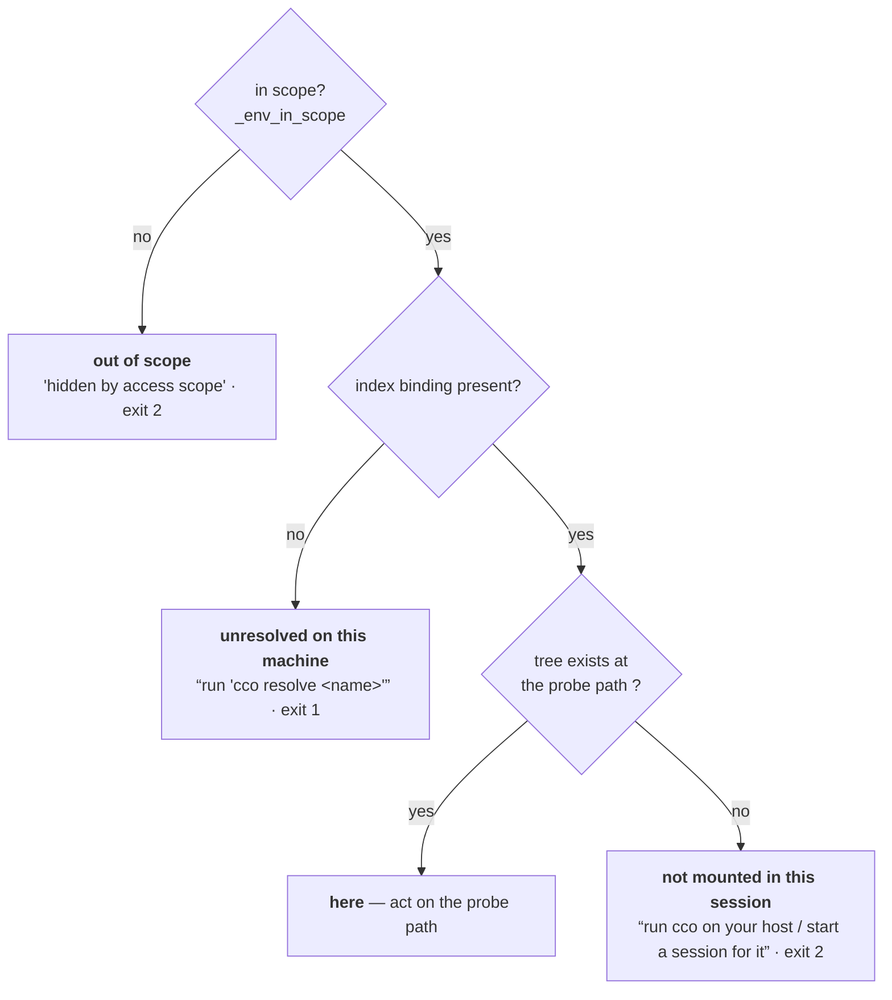

# Fix design RC-2 — host paths consumed in-container (B-DF1 class)

> **Status**: design (cycle 1, rev. 2 after adversarial review, 2026-07-19). Input:
> `../results/consolidated-review.md` (RC-2, ratified decisions D-M1/D-M2/D-M3).
> Structural template: `../fix-design/00-overview.md`.
> **Design phase only** — no implementation code lands from this document.
> Every code quote below was re-verified against the working tree at the time of writing;
> the review's line numbers had drifted in two places and are corrected here.

## 1. Root cause

The STATE index stores **host** paths. Inside a session those paths do not exist —
`cco start` bind-mounts each member at the flat WORKDIR path `<workdir>/<name>`. Any
`-d` / `-f` existence test applied to an index path *in operator mode* therefore always
fails, and the failing branch is worded as **"unresolved on this machine"**. The result
is a systematic lie: present, mounted, in-scope resources are reported absent.

`_cco_member_probe_path` (`lib/paths.sh:348-355`) already encodes the correct rule and
carries an explicit contract separating *probe* from *display*:

```bash
# lib/paths.sh:347-355  (VERIFIED)
# Usage: _cco_member_probe_path <name> <index_host_path>
_cco_member_probe_path() {
    local name="$1" host_path="$2"
    if [[ -n "$name" ]] && _cco_container_operator; then
        printf '%s\n' "${CCO_WORKDIR:-/workspace}/$name"
    else
        printf '%s\n' "$host_path"
    fi
}
```

B-DF1 applied it at **three** query-layer call sites only (`lib/cmd-project-query.sh:82,
112, 228`). The B-DF1 fix record justified leaving `lib/index.sh` alone because "its other
callers are the host-only verbs join/forget/rename". **ADR-0050 D7 makes `repo rename` /
`extra-mount rename` in-container-runnable at `edit-project`, so that premise is now false.**

### 1.1 Site A — the index-only project resolver and its in-container callers

```bash
# lib/cmd-resolve.sh:70-81  (VERIFIED)
_resolve_unit_dir_for_project() {
    local proj="$1" repos r p
    repos=$(_index_get_project_repos "$proj")
    [[ -z "$repos" ]] && return 1
    for r in $repos; do
        p=$(_index_get_path "$proj" "$r")
        if [[ -n "$p" && -f "$p/.cco/project.yml" ]]; then
            printf '%s\n' "$p"; return 0
        fi
    done
    return 1
}
```

`[[ -f "$p/.cco/project.yml" ]]` on a host path → **always** returns 1 in a session. The
sibling `_resolve_project_yml` (`lib/cmd-resolve.sh:139-150`) *is* operator-aware; the
defect is every verb that still calls the index-only one.

The in-container-reachable caller set is **closed and enumerable**: it is the
intersection of `grep -rn _resolve_unit_dir_for_project lib/` with the operator shim's
whitelist (`bin/cco:366-437`). Everything else sits behind a host-only verb
(`resolve`/`sync`/`clean`/`update`/`start`/`stop`/`chrome`/`project add|export|import`)
that the shim refuses before the body runs.

| Caller | Verb (shim gate) | Symptom in-container |
|---|---|---|
| `cmd-project-validate.sh:312` | `project validate <name>` (any read level) | `✗ Project '<n>' not found (… run 'cco resolve <n>')` |
| `cmd-project-validate.sh:289` | `project validate --all` (any read level) | `⚠ skipping '<n>' — its repo is unresolved here`, then **exit 0 having validated nothing** |
| `cmd-project-coords.sh:179` | `project coords --sync --from <n>` (any read level) | `✗ --from unit '<n>' not found (… run 'cco resolve <n>')` |
| `cmd-llms.sh:805` | `llms … --project <n>` (`edit-global`) | `⚠ Project '<n>' not found — skipping YAML update.` **and returns success** — a silent skip |
| `cmd-template.sh:295` | `template create --from <n>` (`edit-global`) | falls through the project branch to `elif [[ -d "$from" ]]` → `✗ Resource '<n>' not found.` |

Reproduced live in this session (`read-project`, project `claude-orchestrator` mounted):

```
$ cco project validate claude-orchestrator
✗ Project 'claude-orchestrator' not found (unknown, or its repo is unresolved here — run 'cco resolve claude-orchestrator').

$ cco project validate --all
⚠ skipping 'claude-orchestrator' — its repo is unresolved here (run 'cco resolve claude-orchestrator')
note: 7 projects hidden by access scope (cco_access=read-project) …
RC=0                       ← validated NOTHING, exit 0
```

The cwd form (`cco project validate` with no name) works, because `_resolve_find_unit_dir`
walks the *mounted* cwd. So the defect is exactly the by-name / `--all` axis.

Two call sites look like siblings and are **not**:

- `cmd-resolve.sh:148` — inside `_resolve_project_yml`, below `if _cco_container_operator;
  then … return $?; fi`. Host branch only.
- `cmd-resolve.sh:192` — inside `_project_foreach`, likewise below an operator branch that
  returns at `:187`. `_project_foreach` is in fact **the precedent this design follows**:
  it already enumerates `PROJECT_NAME` + `CCO_CONFIG_TARGETS` through
  `_resolve_operator_project_yml` and derives `unit_dir` from the resolved yml, handling
  both mount layouts. The class fix is to give the by-name verbs the same treatment.

`_project_foreach`'s operator branch also exposes why a `.cco` directory cannot be
`dirname`-derived: for the flat layout it emits `unit_dir="${yml%/project.yml}"` =
`/workspace`, whose `.cco` does not exist. §3.2 addresses this with a dedicated resolver.

### 1.2 Site B — `lib/cmd-repo.sh` (rename dead in-container)

Three defects, not one. Line numbers corrected against the tree:

```bash
# lib/cmd-repo.sh:52-57  (VERIFIED — the cwd-first branch; NOT in the review's site list)
        1) if [[ "$cwd_first" == true ]]; then
               new="${pos[0]}"
               old=$(_index_name_for_path "$project" "$unit") \
                   || die "No $pretty is bound to $unit in project '$project'. Pass <old> <new> explicitly."

# lib/cmd-repo.sh:74-76  (VERIFIED — the strict guard the review cites)
    # ── Strict guard: the member must be resolved on this machine ───────
    [[ -d "$oldpath" ]] \
        || die "Member '$old' is not resolved on this machine ($oldpath is missing). Run 'cco resolve' first — a rename must rewrite project.yml in the member repo (ADR-0031)."
```

- `:54` — `_index_name_for_path` matches on the **index host path**; `$unit` in-container is
  `/workspace/<repo>`. `_index_normalize_path` is pure string manipulation (verified), so the
  match can never succeed → the cwd-first form `cco repo rename <new>` is dead too.
- `:75` — the strict guard `-d "$oldpath"` on the host path → **unconditionally dead**
  (E4-01), against ADR-0050 D7 which requires the verb runnable at `edit-project`.
- `:76` — the die message interpolates `$oldpath` verbatim. `grep -c CCO_SHOW_HOST_PATHS
  lib/cmd-repo.sh` = **0** (verified): the file has *zero* host-path gating, so this and
  `:87` / `:100` / `:112` leak host paths at `show_host_paths=off` (E4-06).
- `:79-93, :110-113` — the `--move-dir` machinery. In a session the member **is a bind-mount
  root** (`/proc/self/mountinfo` confirms `/workspace/claude-orchestrator` is its own mount),
  so `mv` returns `EBUSY`; and `base=$(basename "$oldpath")` compares against the *host*
  basename while the mount basename is the name by construction. `--move-dir` can never work
  in-container (E4-08).

### 1.3 Site C — `lib/index.sh:777-785` (`_project_iter_members`)

```bash
# lib/index.sh:770-785  (VERIFIED)
# Iterate <project>'s member repos, emitting one TAB line per member:
#   "<name>\t<abspath>\t<status>"   (abspath empty when status == unresolved)
_project_iter_members() {
    local project="$1" repo_name path status
    for repo_name in $(_index_get_project_repos "$project"); do
        path=$(_index_get_path "$project" "$repo_name")
        [[ -n "$path" && -d "$path" ]] || path=""
        status=$(_project_member_status "$project" "$path")
        printf '%s\t%s\t%s\n' "$repo_name" "$path" "$status"
    done
}
```

`[[ -d "$path" ]]` on the host path → every member is `unresolved`, `path` empty, in every
container session. Consumers:

| Caller | Consequence in-container |
|---|---|
| `lib/rename.sh:142` `_rename_projectyml_current` | zero members qualify → **no `project.yml` is ever rewritten**, silently (it only `continue`s) |
| `lib/rename.sh:170` `_rename_fanout_projectyml` | same, cross-project |
| `lib/cmd-pack.sh:584` blast-radius pre-scan | `blocked` is always empty → the strict guard passes **vacuously** (E6B-04, feeds RC-3) |
| `lib/cmd-forget.sh:150`, `lib/cmd-join.sh:120` | host-only verbs — unaffected |

Membership (`_index_get_project_repos`) holds **repos only**: `_resolve_unit` collects
`member_repos` from `yml_get_repo_coords` and never from `yml_get_mount_coords`
(`cmd-resolve.sh:216-330`, verified). This bounds §1.6 below.

### 1.4 The class invariant that is missing

There is no stated rule, so each new call site re-derives (and re-breaks) it. The rule is:

> **INV-F — probe locality.** A path read from the STATE index is a **host** path. In
> container-operator mode it must never be existence-tested. Availability is decided by two
> orthogonal facts: *(i)* does the index hold a binding, and *(ii)* does a tree exist at the
> **probe** path (`_cco_member_probe_path`). Only *(i)* may conclude "unresolved on this
> machine"; only *(ii)* may conclude "not mounted in this session".
>
> **INV-F.1 — no path may be synthesized from a name alone.** An empty index path means
> *no binding*; every helper in the layer must short-circuit to "no path / unresolved"
> before deriving `<workdir>/<name>`. Otherwise an absent resource is rendered present —
> the RC-5 / INV-B inversion this document exists to remove.
>
> **INV-F.2 — the probe path is the mount target, not `<workdir>/<name>` by definition.**
> Repos always mount at `<workdir>/<name>`, but an `extra_mount` may declare an explicit
> `target:` (§1.6). Where a caller can be handed either kind, the declared target wins.
>
> **INV-F.3 — resolve project names through the operator-aware pair.** In any module
> reachable under the operator shim whitelist, a project NAME is resolved with
> `_resolve_project_yml` / `_resolve_project_cco_dir`, never with
> `_resolve_unit_dir_for_project`.

### 1.5 A second, platform-divergent defect uncovered while verifying Site B

`bin/cco:461` puts the rename verbs in `_cco_verb_touches_store`:

```bash
        repo|extra-mount) [[ "$s" == "rename" ]] && return 0 ;;       # STATE index re-key (project-scoped)
```

so the **whole verb** trampolines through the setuid helper and runs with `euid=cco-svc`
(uid 900); `config/cco-svc-helper.c` states "The real uid stays claude". But the verb must
also write the member's **agent-owned** config tree. Here that tree is
`drwx------ claude claude /workspace/claude-orchestrator/.cco` — uid 900 has no traverse
right under POSIX.

It nevertheless *works* on this machine, and `/proc/self/mountinfo` says why:

```
276 264 0:46 /…/claude-orchestrator /workspace/claude-orchestrator rw,… - fakeowner /run/host_mark/Users rw,fakeowner
```

Docker Desktop's `fakeowner` virtiofs does not enforce owner/mode for container uids. A
**native Linux bind mount has no `fakeowner`** and POSIX applies → `mktemp` inside
`_yaml_rename_list_ref` (`lib/rename.sh:42` — `tmp=$(mktemp "${file}.XXXXXX") || return 1`) fails, the function returns 1,
`_rename_projectyml_current` `continue`s, and `cmd-repo.sh:116` still prints
`✓ Renamed …` after the index was already re-keyed at `:105`. **Silent half-apply.**

This is not RC-2's own defect, but it is directly in RC-2's path: *fixing the guard without
addressing it converts today's loud (wrong) refusal into a silent (wrong) success.* §3.5
handles it fail-closed; §8 Q1 asks the maintainer to settle the durable fix.

### 1.6 A third defect: the rename verb's apply ORDER makes the probe fix self-defeating

`cmd-repo.sh` applies the index re-key **before** the `project.yml` rewrite:

```bash
# lib/cmd-repo.sh:104-109  (VERIFIED)
    # ── Apply: index re-key (project-scoped), then project.yml, then move ─
    _index_rename_path "$project" "$old" "$new"
    local -a changed=()
    local p
    while IFS= read -r p; do [[ -n "$p" ]] && changed+=("$p"); done \
        < <(_rename_projectyml_current "$project" "$section" "$old" "$new")
```

`_index_rename_path` (`lib/index.sh:715-731`) re-keys **both** the path binding and the
membership token. `_rename_projectyml_current` (`rename.sh:132-143`) then iterates
`_project_iter_members`, which reads `_index_get_project_repos` — now yielding `$new`.

On the **host** this is harmless: the probe is the identity, so `_index_get_path` still
returns the (unchanged) host path under the new key and the member resolves. In a
**container** the probe is name-derived, so it would probe `<workdir>/$new` — a path that
cannot exist, because a live bind mount cannot be renamed. Every member would classify
`unresolved`, `continue`, and **zero `project.yml` files would be rewritten**, `changed`
would be empty (suppressing even the commit/push reminder at `:123-126`), while `:116`
still printed `✓ Renamed …`.

That is precisely the §1.5 silent half-apply, **re-introduced by the fix itself** — and it
is invisible to §3.5's write probe, which runs *before* the re-key when members still
resolve and therefore passes correctly but vacuously. §3.3 fixes the order; §6.4's
`test_repo_rename_operator_rekeys_index_and_mounted_yml` is the assertion that catches it.

### 1.7 A fourth defect: `extra_mount` targets are not `<workdir>/<name>`

```yaml
# templates/project/base/project.yml:57  (VERIFIED)
#     target: /workspace/docs/api-specs       # optional container path (default /workspace/<name>)
```

```bash
# lib/local-paths.sh:242  (VERIFIED — inside _effective_extra_mounts)
        [[ -z "$target" ]] && target="/workspace/$name"
```

The default is `<workdir>/<name>`, but an explicit `target:` is honoured verbatim and may
be nested. `_cco_member_probe_path` is unconditionally name-derived, so an explicit-target
`extra_mount` probes a path that does not exist even though the mount **is** present in the
session at its declared target. `cmd-repo.sh:121-122` already prints a note acknowledging
the implicit-target case, so the distinction is known to the verb.

The blast radius is narrower than it looks, and §1.3's membership finding is why:

- `_project_iter_members` iterates repos only → **unaffected**.
- the cwd-first reverse lookup applies to `repo` only (`_rename_index_keyed repo repos
  true` vs `_rename_index_keyed extra_mount extra_mounts false`, `cmd-repo.sh:174,193`) →
  **unaffected**.
- the **strict guard** in `_rename_index_keyed` is shared by both kinds → this is the one
  place that must be target-aware (§3.3).

## 2. Findings closed and criteria restored

| Finding | How it is closed |
|---|---|
| **E2-03**, **E3-01**, **E6A-10** | `project validate <name>` resolves through the operator-aware pair (§3.2) |
| **E6B-05** | `project validate --all` validates the mounted projects instead of skipping them (§3.2) |
| **E5-05**, **E5-06** | config-editor targets resolve via `_resolve_operator_project_yml`'s `CCO_CONFIG_TARGETS` branch, which validate now reaches (§3.2) |
| **E4-01** | `repo` / `extra-mount rename` reach **and complete** their body in-container — including the `project.yml` rewrite, for implicit- **and** explicit-target mounts (§3.3, §3.5) |
| **E4-06** | all host-path rendering in `cmd-repo.sh` routes through one gated display helper (§3.4) |
| **E4-08** | `--move-dir` refuses (exit 2) in-container with a host hint; the name-only re-key proceeds (§3.3) |
| **E3-03** | the *vocabulary* half — the verbs touched here speak D-M2's three states (§3.1). The full RC-5 sweep stays cycle 2 per D-M3 |
| **E6B-04** | *partial* — the pack-rename pre-scan stops being vacuous (§3.6); the store-write half is RC-3's |
| *(new, class siblings)* | `project coords --sync --from`, `llms … --project`, `template create --from` stop mis-reporting mounted projects (§3.7) |

**Acceptance criteria restored**

- **A / F3** — "in-container resolution from `/workspace` root works … no misleading
  refusals": fully restored for the `project validate` surface, and for the three sibling
  verbs of §3.7.
- **F** — "`repo`/`extra-mount` rename gated Pc (edit-project), write the index through the
  boundary … not host-only": restored **conditionally on §8 Q1**. On `fakeowner` hosts
  (macOS Docker Desktop) it is restored outright; on native Linux the verb becomes a clean,
  loud refusal instead of a silent half-apply until Q1 is settled. Either way the false
  "not resolved on this machine" disappears and nothing half-applies.

## 3. The fix

### 3.0 Shape overview

Three **mechanism** helpers in `lib/paths.sh` (path arithmetic, no policy), four
**vocabulary** helpers in `lib/access-scope.sh` (the single source for what each state is
called and what remedy it offers — D-M2's "one shared resolver with a single remedy
string"), and one new **resolver** in `lib/cmd-resolve.sh`. Call sites then contain *no*
predicates of their own.



The host collapses this to two states by construction: the probe is the identity there, so
`not mounted` is unreachable and the host wording is unchanged (INV-A).

### 3.1 New layer — mechanism (`lib/paths.sh`) and vocabulary (`lib/access-scope.sh`)

> Design intent, not final code.

```bash
# ── lib/paths.sh — mechanism, next to _cco_member_probe_path ──────────

# _cco_member_probe_path gains an OPTIONAL third argument (INV-F.2): the member's
# DECLARED container target. Non-empty ⇒ used verbatim in operator mode; empty ⇒
# the <workdir>/<name> default. Existing 2-arg calls are unchanged, and the host
# branch ignores it entirely (INV-A). It also short-circuits on an empty
# index path (INV-F.1) so no path is ever synthesized from a name alone.
# Usage: _cco_member_probe_path <name> <index_host_path> [<declared_target>]
_cco_member_probe_path() {
    local name="$1" host_path="$2" target="${3:-}"
    [[ -n "$host_path" ]] || { printf '\n'; return 0; }
    if [[ -n "$name" ]] && _cco_container_operator; then
        printf '%s\n' "${target:-${CCO_WORKDIR:-/workspace}/$name}"
    else
        printf '%s\n' "$host_path"
    fi
}

# What to DISPLAY (INV-4 host-path hygiene) — the deliberate sibling of
# _cco_member_probe_path (what to PROBE). Single source for the predicate that is
# currently copy-pasted at cmd-project-query.sh:111 and :233. Empty in ⇒ empty out,
# so a caller's `[[ -n "$p" ]] && … || "(unresolved)"` keeps its truth table.
# Usage: _cco_display_path <name> <index_host_path> [<declared_target>]
_cco_display_path() {
    local name="$1" host_path="$2" target="${3:-}"
    [[ -n "$host_path" ]] || { printf '\n'; return 0; }
    if _cco_container_operator && [[ "${CCO_SHOW_HOST_PATHS:-true}" != "true" ]]; then
        _cco_member_probe_path "$name" "$host_path" "$target"
    else
        printf '%s\n' "$host_path"
    fi
}

# Reverse of _cco_member_probe_path: a session mount root -> the member NAME.
# Operator-only and deliberately narrow — the IMMEDIATE child of the WORKDIR only.
# Sound because its ONLY caller is the repo cwd-first branch, and repos always
# mount at <workdir>/<name> (INV-F.2's exception is extra_mounts, which have no
# cwd-first form). Usage: _cco_member_name_from_mount <dir>  (1 = not a mount root)
_cco_member_name_from_mount() {
    local d="${1%/}" wd="${CCO_WORKDIR:-/workspace}"
    _cco_container_operator || return 1
    [[ "$d" == "$wd"/* ]] || return 1
    local rest="${d#"$wd"/}"
    case "$rest" in ""|*/*) return 1 ;; esac
    printf '%s\n' "$rest"
}
```

```bash
# ── lib/access-scope.sh — vocabulary + remedy (INV-E: one place) ──────

# _env_member_state <name> <index_host_path> [<declared_target>]
#   -> here | not-mounted | unresolved
# PURE: takes what the caller already has, so it adds no dependency on index.sh.
# This function IS invariant INV-F.
_env_member_state() {
    local name="$1" host_path="$2" target="${3:-}" probe
    [[ -n "$host_path" ]] || { printf 'unresolved'; return 0; }
    probe=$(_cco_member_probe_path "$name" "$host_path" "$target")
    [[ -n "$probe" && -d "$probe" ]] && { printf 'here'; return 0; }
    if _cco_container_operator; then printf 'not-mounted'; else printf 'unresolved'; fi
}

# _env_project_state <name> -> out-of-scope | here | not-mounted | unresolved
_env_project_state() {
    local name="$1"
    _env_in_scope project "$name" || { printf 'out-of-scope'; return 0; }
    if _resolve_project_yml "$name" >/dev/null 2>&1; then printf 'here'; return 0; fi
    if _cco_container_operator; then printf 'not-mounted'; else printf 'unresolved'; fi
}

# The SINGLE remedy vocabulary. <state> must not be `here`.
# Exit codes follow D8: policy/session-shape -> 2 (refuse); missing dependency -> 1 (die).
# Usage: _env_unavailable <state> <kind> <name>
_env_unavailable() {
    local state="$1" kind="$2" name="$3"
    case "$state" in
        out-of-scope) _env_require_visible "$kind" "$name" ;;   # existing wording, exit 2
        not-mounted)
            refuse "$kind '$name' is not mounted in this session — it exists on this machine, but its files are not bound into this container. Run cco on your host, or start a session that mounts it." ;;
        *)  die "$kind '$name' is unresolved on this machine — run 'cco resolve $name' first." ;;
    esac
}

# Non-fatal sibling for degrade-and-continue callers (verbs that must keep their
# exit-0 contract: `--all` sweeps, `llms … --project`). SAME sentences, `warn`
# instead of refuse/die; returns 1 so the caller can `|| continue` / `|| return`.
# Keeping both on one vocabulary is what INV-E buys.
# Usage: _env_unavailable_warn <state> <kind> <name>
_env_unavailable_warn() { … warn "<the matching sentence>"; return 1 ; }

# Iteration counterpart (counted, flushed once). Mirrors _env_note_hidden's
# bash-3.2 indirect-variable counters; folded into the SAME flush so INV-C still
# holds (one standardized notice).
_env_note_unmounted() { … _ENV_UNM_<kind> … }
```

`_env_flush_hidden_notice` gains a second sentence, emitted only when something was noted:

```
note: 2 projects not mounted in this session — they exist on this machine but are not
      bound into this container; run cco on your host to act on them.
```

It **must not** say "run `cco resolve`" — that string is what makes today's output a lie.
The existing "hidden by access scope" sentence is untouched.

**Layering.** `bin/cco` sources `paths.sh` (`:57`) → `access-scope.sh` (`:58`) →
`index.sh` (`:60`) → `cmd-resolve.sh` (`:83`). So `access-scope.sh` may depend on
`paths.sh` only — hence `_env_member_state` takes the index path as an argument rather than
looking it up — while `index.sh` and `cmd-resolve.sh` may call upward into both.
`_env_project_state` calls `_resolve_project_yml`, defined later in load order but resolved
at call time, which is the same pattern `_env_require_visible` already uses.

### 3.2 `lib/cmd-project-validate.sh`

**Contract**: validate resolves a project the same way `project show` does, and it needs
**two** answers, not one — the manifest *and* the project's `.cco` directory.

1. Add `_resolve_project_cco_dir <name>` to `lib/cmd-resolve.sh`, the sibling of
   `_resolve_project_yml` that answers *"where is this project's `.cco` **directory**"*.
   It cannot be `dirname`-derived: in the flat operator layout `/workspace/project.yml` has
   no `.cco` parent (`_project_foreach:183` already emits `unit_dir=/workspace` there).
   Operator: scan `<workdir>/*/.cco` for the project, then `<workdir>/<name>-config` for a
   `CCO_CONFIG_TARGETS` member (layout 2 — the mount **is** the `.cco` dir). Host:
   `<unit>/.cco`. Returns **1** when no `.cco` directory is available in this context.
   `_resolve_project_yml`'s existing ordering is left alone (blast radius).
2. `_pv_validate_unit` keeps its `<yml> <cco_dir> <label> …` signature, but `cco_dir`
   becomes **legitimately empty-able**. `_pv_validate_packs` (`:177-199`) gains a guard: an
   empty `cco_dir` skips the two authored-pack checks (`:187-191`) and emits one
   informational line — *"packs: authored-pack checks skipped, this project's .cco directory
   is not available here"*. This is required: with `cco_dir` unset those two tests
   silently invert (`-d "/.cco/packs/$name"` is always false ⇒ every ADR-0022 D4 collision
   is missed **and** every authored pack is flagged sourceless).
3. Single-unit branch (`:304-318`) resolves all three values per branch, so the cwd form and
   the by-name form agree and nothing is left declared-but-unassigned:

```bash
    local unit_dir="" yml cco_dir label
    if [[ -z "$target" ]]; then
        unit_dir=$(_resolve_find_unit_dir) \
            || die "No project here — run from a repo that has .cco/project.yml, or pass a project name (or --all)."
        yml="$unit_dir/.cco/project.yml"
        cco_dir="$unit_dir/.cco"
        label=$(basename "$unit_dir")          # unchanged from today
    else
        local _st; _st=$(_env_project_state "$target")
        [[ "$_st" == here ]] || _env_unavailable "$_st" project "$target"
        yml=$(_resolve_project_yml "$target")
        cco_dir=$(_resolve_project_cco_dir "$target" 2>/dev/null) || cco_dir=""
        label="$target"                        # the project NAME, matching --all
    fi
    [[ -f "$yml" ]] || die "Project '$label' has no readable project.yml."
    _pv_validate_unit "$yml" "$cco_dir" "$label" "$reachable" "$verbose" "" || max=$?
```

   `_env_project_state` subsumes today's `_env_require_visible` call — same refusal, now from
   the single classifier. `label` is only the fallback for a `project.yml` that is missing
   `name:` (`_pv_validate_unit:240`, `'${pname:-$label}'`), so switching the by-name branch
   from `basename "$unit_dir"` to the project name is a strict improvement and is invisible
   in every normal run. The old `die "… at $unit_dir"` is reworded because `unit_dir` no
   longer exists on the by-name path — and, in operator mode, would have been a host path.

4. `--all` (`:282-302`): keep `_index_list_projects` as the enumeration source (it is
   complete and reachable through the boundary — verified live: the hidden-count notice
   already proves it enumerates 8 projects at `read-project`). Drop `unit_dir` from the
   loop's locals entirely, so the `"$unit_dir/.cco"` hazard cannot survive:

```bash
        local proj yml cco_dir first=true
        while IFS='=' read -r proj _; do
            [[ -z "$proj" ]] && continue
            if ! _env_in_scope project "$proj"; then _env_note_hidden project; continue; fi
            case "$(_env_project_state "$proj")" in
                here)        yml=$(_resolve_project_yml "$proj")
                             cco_dir=$(_resolve_project_cco_dir "$proj" 2>/dev/null) || cco_dir="" ;;
                not-mounted) _env_note_unmounted project; continue ;;
                *)           _env_unavailable_warn unresolved project "$proj"; continue ;;
            esac
            [[ -f "$yml" ]] || continue
            …
            _pv_validate_unit "$yml" "$cco_dir" "$proj" "$reachable" "$verbose" "  " || rc=$?
```

   The `unresolved` branch is now reachable **only on the host**, which is where its wording
   is true, and it speaks it through the same vocabulary as everything else.

### 3.3 `lib/cmd-repo.sh`

**Contract**: `repo`/`extra-mount rename` is a *name* operation on the current project. It
runs wherever the project's config tree is writable; the directory move is host-only.

```bash
# ── cwd-first <old> resolution (replaces :52-57; repo only) ──────────
    if _cco_container_operator; then
        old=$(_cco_member_name_from_mount "$unit") \
            || die "Run 'cco $dash rename <new>' from a mounted member directory (e.g. \$CCO_WORKDIR/<name>), or pass <old> <new>."
    else
        old=$(_index_name_for_path "$project" "$unit") || old=""
    fi
    [[ -n "$old" ]] || die "No $pretty is bound to $(_cco_display_path "" "$unit") in project '$project'. Pass <old> <new> explicitly."

# ── declared target (INV-F.2; extra_mount only) ──────────────────────
    # <unit> is the cwd repo — mounted, so its project.yml is readable here.
    local oldtarget=""
    [[ "$kind" == "extra_mount" ]] && oldtarget=$(_mount_declared_target "$unit/.cco/project.yml" "$old")

# ── strict guard (replaces :74-76) ───────────────────────────────────
    local probe _st
    probe=$(_cco_member_probe_path "$old" "$oldpath" "$oldtarget")
    _st=$(_env_member_state "$old" "$oldpath" "$oldtarget")
    [[ "$_st" == here ]] || _env_unavailable "$_st" "$pretty" "$old"

# ── directory-move decision (replaces :78-93) ────────────────────────
    if _cco_container_operator; then
        [[ "$move_dir" == true ]] && refuse \
          "'--move-dir' cannot run inside a session: '$old' is a bind-mount root here, so the move fails (EBUSY) and the host directory would be untouched. Run 'cco $dash rename --move-dir …' on your host. The name-only rename works here."
        do_move=false          # and NEVER prompt: -t 0 is true under tmux
    else
        … existing basename gate + prompt, unchanged …
    fi
```

`_mount_declared_target <project_yml> <name>` is a thin reader over the existing
`yml_get_mount_coords` parser (`lib/yaml.sh:349-368`, which already emits `target` as its
4th field) — it echoes the declared `target:` or empty. It belongs next to
`_effective_extra_mounts` in `lib/local-paths.sh`, which is the module that already owns
the `[[ -z "$target" ]] && target="/workspace/$name"` default.

**Apply order (§1.6).** The `:104-113` block is reordered so the **project.yml rewrite runs
before the index re-key**:

```bash
    # ── Apply: project.yml FIRST (members are still keyed by <old>), then index ─
    local -a changed=()
    local p
    while IFS= read -r p; do [[ -n "$p" ]] && changed+=("$p"); done \
        < <(_rename_projectyml_current "$project" "$section" "$old" "$new")
    _index_rename_path "$project" "$old" "$new"
    if [[ "$do_move" == true ]]; then … unchanged, host-only … fi
```

This is a host-visible **no-op** — on the host the probe is the identity, so members resolve
identically before and after the re-key — and it is what makes the in-container fix work at
all. It is also the better failure ordering on its own terms: the hard, distributed write
(N member trees, across the ADR-0047 privilege boundary) happens first, and the single cheap
authoritative index write commits last. No data flows the other way: `_rename_projectyml_current`
takes `$old`/`$new` as explicit arguments, and its `synced|divergent` filter keys on the
PROJECT name via `_cco_project_id`, which a repo/mount rename never touches.

Everything downstream that touched `$oldpath` for **file access** now gets the probe path;
everything that touched it for **display** goes through `_cco_display_path` (§3.4). The
`-e "$newpath"` test at `:92` and the `mv` at `:111` stay untouched — they are inside the
`do_move` branch, which is now host-exclusive.

### 3.4 Host-path hygiene in `cmd-repo.sh` (E4-06)

Every user-visible path in this file is wrapped once:

| Line | Today | After |
|---|---|---|
| `:55` | `$unit` raw | `_cco_display_path "" "$unit"` (identity in-container: `$unit` is already a container path) |
| `:76` | `$oldpath` raw | replaced by `_env_unavailable` — its `not-mounted` sentence names **no path at all** |
| `:87`, `:100`, `:112` | `$oldpath` / `$newpath` raw | unchanged text, but now reachable on the host only |

Net: zero raw host paths on any in-container code path.

The same helper also de-duplicates the inline predicate at `cmd-project-query.sh:111` and
`:233`, but the two sites are **not** interchangeable and the de-dup is only safe because of
INV-F.1:

- `:111` guards with `[[ -n "$p" ]] &&` **before** probing, and `:114` then renders
  `(unresolved)` for an empty `$p`. Its `$p` comes from `_index_get_path` while iterating the
  **declared** repos (`yml_get_repo_coords`, `:117`), so a declared-but-unbound member is a
  live case. Without INV-F.1's empty-input short-circuit, `_cco_display_path "$rn" ""` would
  return `<workdir>/$rn` and that member would render `  <name> (/workspace/<name>)` instead
  of `  <name> (unresolved)` — a new absent-reported-as-present inversion. With INV-F.1 the
  truth table is exactly preserved and the outer guard becomes redundant.
- `:233` has no such guard, and does not need one: its `$repo_path` comes from
  `_effective_repo_mounts`, which conscious-skips any entry without an absolute index path
  (`local-paths.sh:197`), so it is never empty. Its `${repo_path:-unresolved}` fallback is
  already dead code; keep it as `_disp=$(_cco_display_path …); _disp="${_disp:-unresolved}"`
  for defensive parity.

### 3.5 Fail-closed precondition (the §1.5 half-apply)

Before any mutation, assert that every owned member's config tree is actually writable **by
this process** — an identity-agnostic write probe, not a `-w` test (bash's `test -w` uses
`access(2)`/real uid, which is `claude` even when `euid` is `cco-svc`, so `-w` would report
a false yes):

```bash
# lib/rename.sh — new, used by the index-keyed and (later) global rename verbs.
# Usage: _rename_assert_writable <dir> <what>
_rename_assert_writable() {
    local dir="$1" what="$2" t
    t=$(mktemp "$dir/.cco-wtest.XXXXXX" 2>/dev/null) \
        || refuse "Cannot write $what in this session ($dir is not writable by the cco store helper). Run 'cco $what' on your host — nothing was changed."
    rm -f "$t"
}
```

Called for each `synced|divergent` member holding the reference, immediately before the
apply block — i.e. before the `project.yml` rewrite, which §3.3 has made the first mutation.
Guarantees: either the whole rename applies, or **nothing** does and the user gets an
accurate refusal. This holds regardless of how §8 Q1 is settled.

Note that this probe does **not** subsume §1.6: it runs while members are still keyed by
`<old>`, so it passes correctly whichever order the apply block uses. Only the reorder in
§3.3 closes the ordering defect, and only §6.4 detects it.

### 3.6 `lib/index.sh` — `_project_iter_members`

**Contract change** (documented in the header): column 2 becomes *the path at which this
member is inspectable in the current context*, empty when it is not inspectable here.

```bash
_project_iter_members() {
    local project="$1" repo_name idx probe status
    for repo_name in $(_index_get_project_repos "$project"); do
        idx=$(_index_get_path "$project" "$repo_name")
        probe=$(_cco_member_probe_path "$repo_name" "$idx")     # "" when idx is "" (INV-F.1)
        [[ -n "$probe" && -d "$probe" ]] || probe=""
        status=$(_project_member_status "$project" "$probe")
        printf '%s\t%s\t%s\n' "$repo_name" "$probe" "$status"
    done
}
```

Membership is repos-only (§1.3), so the two-argument probe is correct here and INV-F.2 does
not apply. INV-F.1 is what keeps a member that has a membership token but no path binding
(possible transiently around `join`/`forget`) from being resolved to a mount it does not own.

On the host `probe == idx`, so the emitted rows are byte-identical — the host-only callers
(`cmd-forget.sh:150`, `cmd-join.sh:120`) cannot regress. The `_project_member_status`
taxonomy (`unresolved|code-only|foreign|divergent|synced`) is **deliberately unchanged**: it
answers *"can I act on this member's files here?"*, and `unresolved` is operationally correct
for a not-mounted member. Only the **rendering** of that token needs the third state, and
rendering sites get it from `_env_member_state` — the callers all still have the name and the
index path. Adding a fourth token, or a fourth column, would break every
`IFS=$'\t' read -r name path status` consumer (with 4 fields, `status` absorbs the remainder).

### 3.7 The three sibling call sites (INV-F.3)

Each is a one-line resolver swap plus honest wording. They are in this cycle, not deferred,
because §4's class claim is only true if the class is actually closed.

- **`lib/cmd-project-coords.sh:179`** — `from_dir` is assigned and **never read** anywhere in
  the file (verified: `grep -n from_dir` returns exactly that one line). The call is a pure
  existence check, so it needs no directory at all:

```bash
    local _st; _st=$(_env_project_state "$from")
    [[ "$_st" == here ]] || _env_unavailable "$_st" "--from unit" "$from"
```

  `_coords_scan` already runs through the operator-aware `_project_foreach`, so with this
  one predicate corrected `--sync --from <current project>` works in-session end to end.

- **`lib/cmd-llms.sh:805`** — resolve with `_resolve_project_yml`; on failure classify and
  **keep the non-fatal degrade** (`_env_unavailable_warn … ; return`). The host outcome is
  byte-identical (host states are only `here`/`unresolved`), while in-container a mounted
  project now gets its YAML updated instead of being silently skipped with a success exit.

- **`lib/cmd-template.sh:295`** — the project branch resolves with `_resolve_project_cco_dir`
  (it wants `<unit>/.cco`, not the yml). `--from` stays polymorphic: on failure the existing
  pack-dir and literal-dir branches still run. Only the final `die "Resource '$from' not
  found."` changes — it first classifies `_env_project_state "$from"` and, when the answer is
  `out-of-scope` or `not-mounted`, calls `_env_unavailable` instead, so a real project is
  never reported as a nonexistent resource.

Out of scope, recorded for the backlog: `project coords --sync` writes `project.yml` but the
shim whitelists `project coords` unconditionally (`bin/cco:432`), so it is reachable at a
pure read level. That is a **gating** defect, not an RC-2 one; it belongs to the RC-3 /
write-path document, not here.

### 3.8 Testability enabler

`lib/cmd-resolve.sh:103-107` and `:127` hardcode `/workspace`:

```bash
    if [[ -f /workspace/project.yml ]]; then
        n=$(yml_get /workspace/project.yml name 2>/dev/null)
        [[ "$n" == "$want" ]] && { printf '%s\n' /workspace/project.yml; return 0; }
    fi
    for d in /workspace/*/; do
        …
        yml="/workspace/${name}-config/project.yml"
```

Generalize to `${CCO_WORKDIR:-/workspace}`, matching `_cco_member_probe_path:351` and
`_project_show_session_fallback` (`cmd-project-query.sh:135`). `_resolve_project_cco_dir`
(§3.2) is written against `CCO_WORKDIR` from the start. `CCO_WORKDIR` is a test-only
override — `cco start` never sets it — so production behaviour is bit-identical. Without
this, none of §6's operator-lane tests can run hermetically.

## 4. Why this shape, and what was rejected

- **Class-level (a probe/state layer) over instance-level patching.** Nine distinct sites
  across six files re-derive the same broken predicate — five index-only project resolvers
  (§1.1), three in `cmd-repo.sh` (§1.2), one in `index.sh` (§1.3) — plus two order/target
  defects (§1.6, §1.7) that only surface once the predicate is fixed. Patching instances
  guarantees a tenth. INV-F and its three corollaries give one testable rule, and §6.7 turns
  the rule into a test whose failure mode is a *new call site*, not a new symptom.
- **Rejected: make `_resolve_unit_dir_for_project` itself operator-aware** (the apparently
  obvious "single choke point"). It cannot be: its contract is to return a **unit directory**,
  and neither operator layout reliably has one. Layout 1 mounts the manifest flat at
  `/workspace/project.yml` with no `.cco` parent; layout 2 (config-editor) mounts the `.cco`
  tree itself at `/workspace/<name>-config`, so the "unit" is the `.cco` dir and its parent is
  meaningless. That is precisely why `_resolve_project_yml` exists as a separate
  operator-aware function, and why §3.2 adds `_resolve_project_cco_dir` beside it rather than
  overloading the old one. The real choke point is the **caller-side rule** INV-F.3, which
  `_project_foreach` (`cmd-resolve.sh:160-197`) already implements and which §6.7 enforces.
- **Rejected: teach `_index_get_path` to return the mount in operator mode.** Superficially
  the smallest fix, and wrong: the index host path is *still needed* in-container — for
  `_index_paths_get_bindings` reverse lookups (`cmd-project-query.sh:106-108`, whose own
  comment says "must use the host path even in-container"; ADR-0051 D5), for `cco path list`
  (`cmd-resolve.sh`, which renders index paths behind its own `show_host_paths` gate at
  `:739,753`), and for the session `path_map`. Overloading the
  accessor would silently break those and violate ADR-0043 INV-D (the index is the complete
  internal map; context adaptation is presentation).
- **Rejected: a fourth `_project_member_status` token (`not-mounted`).** Widens blast radius
  into `join`/`forget`/`pack rename` for a purely presentational distinction, and every caller
  filters with `case "$status" in synced|divergent)`, so an unhandled token degrades silently.
- **Rejected: a fourth column from `_project_iter_members`.** Breaks all six
  `read -r name path status` consumers — 5 in `lib/` (`rename.sh:142,170`, `cmd-pack.sh:584`,
  `cmd-forget.sh:150`, `cmd-join.sh:120`) plus `tests/test_index.sh:222` — because the extra
  field lands inside `status`, silently defeating every `case "$status" in synced|divergent)`.
- **Rejected: mounting other projects' trees so "not mounted" cannot happen.** Explicitly
  refused by D-M2 (widens the mount surface against ADR-0047 §1).
- **Rejected: making `--move-dir` work in-container** (e.g. copy-then-swap). The member is a
  bind-mount root; the host directory is the real resource and the host index/other projects
  reference it. Refusing with a host hint is the honest contract, and it matches ADR-0050 D4's
  own posture (the move is opt-in and deliberately conservative).
- **Rejected: keeping the strict guard and simply rewording it.** ADR-0050 D7 and criterion F
  require the verb to *run*, not to refuse more politely.
- **Rejected: scoping E4-01's closure to implicit-target extra_mounts.** It would have let
  §1.7 stand as a documented limitation instead of a fix, but the limitation is invisible to
  the user (nothing in the refusal mentions `target:`) and the fix is one optional argument
  threaded from a parser that already emits the field.
- **Rejected: reading the declared target inside `_cco_member_probe_path`.** It would need
  `yaml.sh` + a project resolver, turning a pure path-arithmetic helper in `paths.sh` (loaded
  first, `bin/cco:57`) into a policy function with two new upward dependencies. Threading the
  target from the caller — which already holds the project.yml — keeps the mechanism/vocabulary
  split intact.
- **`_cco_display_path` in `paths.sh`, vocabulary in `access-scope.sh`.** Path arithmetic is
  mechanism (no policy, host-safe, unit-testable without a session); *what a state is called
  and what it costs in exit codes* is policy and belongs to the ADR-0043 layer that already
  owns `_env_require_visible` and the hidden notice (INV-E, single source).
- **`_env_member_state` takes the index path as an argument** rather than looking it up. Keeps
  `access-scope.sh` free of a dependency on `index.sh` (which is sourced after it, `bin/cco:58`
  vs `:60`), and makes it a pure function — trivially testable.

## 5. Blast radius

| Touched | Consumers | Risk |
|---|---|---|
| `lib/paths.sh` (`_cco_member_probe_path` +1 optional arg, +2 helpers) | 3 existing 2-arg call sites in `cmd-project-query.sh` | additive arg + an empty-input short-circuit. The short-circuit is a **deliberate behaviour change**: `_cco_member_probe_path <name> ""` used to return `<workdir>/<name>`; it now returns empty. All three existing callers guard on `-d` or on `-n "$p"` and are unaffected — asserted by §6.1 |
| `lib/access-scope.sh` (+4 helpers, flush extended) | `_env_flush_hidden_notice` has **9** call sites (verified): `cmd-project-query.sh:56`, `cmd-project-validate.sh:300`, `cmd-llms.sh:308,783`, `cmd-pack.sh:134,386`, `tags.sh:440,456` (`cco list`), `cmd-project-coords.sh:60` | the extra sentence only appears when `_env_note_unmounted` was called, so all 9 stay byte-identical until a caller opts in. Tests asserting the exact notice string must be checked (`tests/test_access_scope.sh`) |
| `lib/index.sh` `_project_iter_members` | `rename.sh:142,170`, `cmd-pack.sh:584`, `cmd-forget.sh:150`, `cmd-join.sh:120`, `tests/test_index.sh:222` | **host output is byte-identical** (probe is the identity there). In-container, `forget`/`join` are host-only. `rename.sh` and `cmd-pack.sh` become *correct* where they were vacuous — that is the intended change and needs the §6.4/§6.5 tests |
| `lib/cmd-project-validate.sh` (+ `_pv_validate_packs` empty-`cco_dir` guard) | `cco project validate` only | host paths untouched (host `_env_project_state` = today's outcomes). `--all`'s exit-code aggregation (`max`) is unchanged. The by-name `label` changes from `basename(unit_dir)` to the project name — visible only when `project.yml` lacks `name:` |
| `lib/cmd-repo.sh` (guard, order, hygiene) | `cco repo rename`, `cco extra-mount rename` | host path fully preserved: the new branches are `_cco_container_operator`-gated, and the apply reorder is a host no-op (identity probe). In-container the verb goes from *always dying* to running |
| `lib/cmd-resolve.sh` (`CCO_WORKDIR`, `+_resolve_project_cco_dir`) | `_resolve_operator_*` used by `_resolve_project_yml` and `_project_foreach` | `CCO_WORKDIR` unset in production ⇒ identical. `_resolve_project_cco_dir` is new |
| `lib/local-paths.sh` (`+_mount_declared_target`) | `cmd-repo.sh` only in this cycle | new; reads a field `yml_get_mount_coords` already emits |
| `lib/cmd-project-query.sh:111,233` | `project show` | de-dup onto `_cco_display_path`; truth table preserved **only** because of INV-F.1 (see §3.4) |
| `lib/cmd-project-coords.sh:179`, `lib/cmd-llms.sh:805`, `lib/cmd-template.sh:295` | `project coords --sync`, `llms … --project`, `template create --from` | host outcomes unchanged (host states are `here`/`unresolved`, mapping onto today's two messages); in-container they stop lying |
| `lib/rename.sh` (`+_rename_assert_writable`) | called from `cmd-repo.sh` only in this cycle | new refusal path — see §6.4 |

**Regression watch**

- `tests/test_operator_shim.sh:647-653` asserts `rc -ne 2` for `repo rename` at
  `edit-project`. Once the verb can reach a `not-mounted` refusal (exit **2**), any scenario
  that gets that far flips the assertion from false-green to false-red. §6.6 rewrites it to a
  scenario that provably cannot reach a refusal, and pins which error it does reach.
- `_env_unavailable not-mounted` returns **2** where some paths return 1 today. Any caller
  branching on `$?` from validate must be re-read; `cmd-project-validate.sh` uses `max` over
  `_pv_validate_unit` returns only, which is not on this path.
- **RC-3 overlap**: `cmd-pack.sh:584`'s pre-scan becomes non-vacuous, so `pack rename` may now
  legitimately refuse in-container where it previously proceeded. That is the correct
  direction, and it is the guard RC-3 needs; coordinate the message wording with `03-*`.

**bash 3.2**

- No associative arrays: `_ENV_UNM_<kind>` counters reuse the existing `printf -v` /
  `${!var:-0}` indirect pattern from `_env_note_hidden` (`access-scope.sh:557-563`).
- `${d#"$wd"/}` (quoted-pattern removal), `${3:-}` and `case "$rest" in ""|*/*)` are 3.2-safe;
  no `[[ -v ]]`, no `declare -A`, no `mapfile`, no `${var@Q}`.
- `local -a` arrays touched under `set -u` keep the existing
  `[[ ${#arr[@]} -gt 0 ]]` guard (already present at `cmd-repo.sh:123`).
- `mktemp "$dir/.cco-wtest.XXXXXX"` is the same invocation form already used at
  `rename.sh:42`, so no new portability surface (BSD/GNU both accept a template argument).

## 6. Test plan

Every test below names the assertion that **fails on today's code**, except where it is
explicitly labelled a regression guard. The operator lane (RC-17, `01-*`) supplies the shared
harness; where a test needs something the lane must provide, it is stated. Until §3.8 lands,
none of these can be hermetic.

### 6.1 `tests/test_paths.sh`

| Test | Assertion that fails today |
|---|---|
| `test_probe_path_empty_binding_is_empty` | `_cco_member_probe_path my-repo ""` in operator mode ⇒ empty (INV-F.1). **Fails: returns `/ws/my-repo`** |
| `test_probe_path_honours_declared_target` | `_cco_member_probe_path assets /host/a /workspace/docs/assets` ⇒ `/workspace/docs/assets` (INV-F.2). **Fails: returns `/ws/assets`** |
| `test_probe_path_host_ignores_target` | non-operator, same args ⇒ `/host/a` (INV-A) |
| `test_probe_path_default_target_unchanged` | operator, 2-arg form ⇒ `/ws/my-repo` (regression guard for the 3 shipped call sites) |
| `test_display_path_operator_hides_host_path` | `_cco_display_path my-repo /Users/a/my-repo` with `CCO_SHOW_HOST_PATHS=false` ⇒ `/ws/my-repo`. **Fails: the function does not exist** |
| `test_display_path_empty_stays_empty` | `_cco_display_path my-repo ""` at `show_host_paths=false` ⇒ empty — the property `cmd-project-query.sh:111` depends on (§3.4) |
| `test_display_path_operator_shows_when_permitted` | same with `CCO_SHOW_HOST_PATHS=true` ⇒ the host path |
| `test_display_path_host_is_identity` | non-operator ⇒ host path even at `show_host_paths=false` (INV-A) |
| `test_member_name_from_mount_immediate_child` | `_cco_member_name_from_mount /ws/backend` ⇒ `backend`. **New function** |
| `test_member_name_from_mount_rejects_nested` | `/ws/backend/sub` ⇒ rc 1 (no output) |
| `test_member_name_from_mount_host_refuses` | non-operator ⇒ rc 1 |

Uses the existing `_ps_probe`-style stub pattern (`tests/test_project_show.sh:204-211`).

### 6.2 `tests/test_access_scope.sh`

| Test | Assertion that fails today |
|---|---|
| `test_member_state_not_mounted` | operator, index path `/host/x` (absent), mount absent ⇒ `not-mounted`. **Fails: no such function; today the only reachable verdict anywhere is "unresolved"** |
| `test_member_state_here_via_mount` | operator, `$WD/backend` exists ⇒ `here` |
| `test_member_state_here_via_declared_target` | operator, index `/host/x`, target `$WD/docs/specs` which exists ⇒ `here` (INV-F.2) |
| `test_member_state_unresolved_no_binding` | operator, empty index path ⇒ `unresolved` (INV-F.1 — never `not-mounted`, never `here`) |
| `test_member_state_host_two_valued` | non-operator: existing dir ⇒ `here`; missing ⇒ `unresolved`; **never** `not-mounted` |
| `test_project_state_out_of_scope` | `read-project`, name ≠ `PROJECT_NAME` ⇒ `out-of-scope` |
| `test_unmounted_notice_wording` | after `_env_note_unmounted project`, `_env_flush_hidden_notice` stderr contains `not mounted in this session` and **does not** contain `cco resolve`. **Fails today: the only message for this situation is `warn "… unresolved here (run 'cco resolve …')"`** |
| `test_unavailable_warn_matches_unavailable_wording` | `_env_unavailable_warn` and `_env_unavailable` emit the same sentence per state, differing only in stream/exit (INV-E) |
| `test_hidden_notice_unchanged` | with only `_env_note_hidden`, the notice is byte-identical to today (regression guard) |

### 6.3 `tests/test_project_validate.sh` (new operator lane)

Harness: tmp `$WD` with `$WD/project.yml` (flat) + `$WD/<repo>/.cco/project.yml`, seeded index
pointing at a **non-existent** host path, `CCO_WORKDIR=$WD`, `CCO_STORE_ELEVATED=1`.

| Test | Assertion that fails today |
|---|---|
| `test_validate_named_current_project_in_operator` | `cco project validate <current>` ⇒ rc 0, output has `share-ready`. **Fails today: rc 1, `✗ Project '<n>' not found (… run 'cco resolve <n>')`** — reproduced live in §1.1 |
| `test_validate_all_validates_mounted_project` | `--all` at `read-project` ⇒ stdout contains `[<current>]`. **Fails today: stdout empty, stderr `skipping '<n>' — its repo is unresolved here`, rc 0** |
| `test_validate_all_never_says_resolve_in_container` | `--all` output must not match `cco resolve`. **Fails today** |
| `test_validate_all_notes_unmounted_at_read_all` | `read-all`, second project in the index but unmounted ⇒ stderr has `not mounted in this session`, mounted project still validated. **Fails today: both are skipped as "unresolved here"** |
| `test_validate_named_finds_authored_pack_collision` | `$WD/<repo>/.cco/packs/p1` **and** `~/.cco/packs/p1` both present, `packs: [{name: p1}]` (no url) ⇒ output contains `collides with a same-named`. **Fails today: rc 1 before any check; and would still fail with a `cco_dir`-less `--all` fix, since `-d "/.cco/packs/p1"` is false** — this is the §3.2 step-2 assertion |
| `test_validate_all_no_false_sourceless_pack` | same fixture via `--all` ⇒ output must **not** contain `authored pack has no source` |
| `test_validate_packs_skipped_when_cco_dir_absent` | config-editor layout 2 target with no resolvable `.cco` ⇒ the informational skip line, and neither pack finding |
| `test_validate_named_out_of_scope_still_refuses` | `read-project`, other project ⇒ rc 2 (regression guard; passes today and must keep passing) |
| `test_validate_config_editor_target` | `PROJECT_NAME=config-editor`, `CCO_CONFIG_TARGETS=cave-auth`, `$WD/cave-auth-config/project.yml` ⇒ rc 0 (E5-05/E5-06). **Fails today: rc 1 "not found"** |

### 6.4 `tests/test_repo_rename.sh` (new operator lane)

Harness: `$WD/backend/.cco/project.yml` (owner-consistent, `name: shop`), index binds
`shop:backend -> /host/absent/backend`, cwd `$WD/backend`, `CCO_CCO_ACCESS=edit-project`.

| Test | Assertion that fails today |
|---|---|
| `test_repo_rename_operator_rekeys_index_and_mounted_yml` | rc 0; `_index_get_path shop api` non-empty; **and `$WD/backend/.cco/project.yml` contains `name: api`**. **Fails today: rc 1 at the strict guard.** This is also the §1.6 detector: with the guard fixed but the apply order left alone, the index assertion passes and the project.yml assertion fails |
| `test_repo_rename_operator_reports_changed_files` | same run ⇒ stdout contains the commit/push reminder naming `$WD/backend`. **Fails today; and fails on a §1.6-afflicted fix, where `changed` is empty and the reminder is suppressed** |
| `test_repo_rename_operator_cwd_first` | `cco repo rename api` (one positional) from `$WD/backend` ⇒ rc 0. **Fails today: `No repo is bound to /ws/backend in project 'shop'`** (the `:54` defect) |
| `test_repo_rename_operator_move_dir_refused` | `--move-dir` ⇒ rc 2, message matches `on your host`. **Fails today: rc 1 at the strict guard, with a message about `cco resolve`** |
| `test_repo_rename_operator_no_host_path_leak` | `CCO_SHOW_HOST_PATHS=false`; full stdout+stderr must not contain `/host/absent`. **Fails today: the `:76` die message prints it verbatim** |
| `test_repo_rename_operator_unwritable_tree_is_atomic` | `chmod 500 $WD/backend/.cco` ⇒ rc 2 **and** `_index_get_path shop backend` still returns the old binding (nothing applied). **Fails today: the guard fires first, so the atomicity property is untested; with the guard fixed and no precondition it would half-apply** — see §1.5. Skip when `id -u` = 0 |
| `test_repo_rename_operator_not_mounted_refuses` | a member bound in the index whose `<workdir>/<name>` does not exist ⇒ rc 2, message matches `not mounted in this session`, and must **not** match `cco resolve`. **Fails today: rc 1 with the `cco resolve` wording** |
| `test_extra_mount_rename_operator_implicit_target` | `extra-mount rename assets media`, mount at `$WD/assets` ⇒ rc 0 + project.yml rewritten |
| `test_extra_mount_rename_operator_explicit_target` | project.yml declares `target: $WD/docs/assets`, the mount exists **only** there ⇒ rc 0. **Fails today at the strict guard; and fails on a target-blind fix with `not mounted in this session`** — this is the §1.7 detector |
| `test_repo_rename_host_guard_unchanged` | host, genuinely missing dir ⇒ rc 1 with the existing message (regression guard) |
| `test_repo_rename_host_apply_order_unchanged` | host, resolved member ⇒ index re-keyed **and** project.yml rewritten, identical to today (regression guard for the §3.3 reorder) |

### 6.5 `tests/test_index.sh`

| Test | Assertion that fails today |
|---|---|
| `test_iter_members_operator_uses_mount` | operator, `$WD/backend/.cco/project.yml` present, index path absent ⇒ row = `backend<TAB>$WD/backend<TAB>synced`. **Fails today: `backend<TAB><empty><TAB>unresolved`** |
| `test_iter_members_operator_unbound_member_stays_unresolved` | operator, membership token `ghost` with **no** path binding, `$WD/ghost/.cco/project.yml` present on disk ⇒ row = `ghost<TAB><empty><TAB>unresolved` (INV-F.1). Guards against the fix inverting absent→present |
| `test_iter_members_host_unchanged` | host ⇒ byte-identical to today's expectation (extends `tests/test_index.sh:222`) |

### 6.6 `tests/test_operator_shim.sh` — retire the false green

`:647-653` currently asserts only `rc -ne 2` for `repo rename` at `edit-project`, which a verb
dying `rc=1` at a host-path guard satisfies (RC-17). The obvious repair — asserting on a
message — has two traps that were hit while designing this section, and the replacement is
built to avoid both:

- **The verb's first failure is cwd-dependent.** `bin/test` never `cd`s, so `_op_cco` runs
  from wherever the suite was invoked. From the repo root, `_resolve_find_unit_dir`
  (`cmd-resolve.sh:52-63`) finds `/workspace/claude-orchestrator/.cco/project.yml` and the verb
  dies at `cmd-repo.sh:68-69`, not at `:43-44`. Measured directly with the `_op_cco`
  environment (`CCO_CONTAINER_OPERATOR=1`, `CCO_CCO_ACCESS=edit-project`,
  `CCO_STORE_ELEVATED=1`, throwaway buckets, ambient session vars unset as `bin/test:22-26`
  does):

  ```
  ✗ No repo named 'old' in project 'claude-orchestrator'. …   rc=1
  ```

  An assertion on `from inside a project repo` would therefore fail today *and* pass from a
  directory with no `.cco` ancestor — a nondeterministic test. **The scenario must fix its own
  cwd.**
- **A scenario that reaches the `:75` guard cannot live in this test.** Post-fix, a bound but
  unmounted member exits **2** from `_env_unavailable`, which is exactly what the surrounding
  `rc -ne 2` gate assertion forbids — the false-red flagged in §5. The guard's own message is
  pinned in §6.4 (`test_repo_rename_operator_not_mounted_refuses`), where the lane can assert
  on it without colliding with a gate assertion.

The shim test's job is therefore narrow and deterministic: prove the gate let the verb through
into its **own** argument handling, and that it did not stop at a host-path predicate.

```bash
    # Deterministic scenario: a seeded project `alpha` whose member repo carries a
    # real .cco/project.yml, run with cwd inside it, and a <old> that is NOT bound.
    # Reaching :68-69 proves the gate passed AND the project resolved in-container.
    _op_seed_in_repo edit-project alpha repo rename old new
    [[ $OP_RC -eq 1 ]] || fail "repo rename must reach its own body at edit-project, rc=$OP_RC: $OP_OUT"
    echo "$OP_OUT" | grep -q "No repo named 'old' in project 'alpha'" \
        || fail "repo rename did not reach its own argument handling: $OP_OUT"
    echo "$OP_OUT" | grep -qi "not resolved on this machine" \
        && fail "repo rename stopped at a host-path guard: $OP_OUT"
```

`_op_seed` as shipped (`test_operator_shim.sh:47-73`) seeds only the **index** — it creates
`$tmp/repos/alpha` but writes no `.cco/project.yml`, so a run from there still dies in
`_resolve_find_unit_dir`. The operator lane (`01-*`) must therefore provide `_op_seed_in_repo`:
`_op_seed` plus a member `.cco/project.yml` (`name: <project>`) and a `cd` into it. That helper
is needed by §6.3 and §6.4 anyway.

Like the assertion it replaces, this one passes today — its value is that it pins *which*
error was reached, so no future host-path guard can masquerade as a pass. The existing
`read-all ⇒ rc 2` gate assertion is kept unchanged.

### 6.7 `tests/test_invariants.sh` — required, not optional

§4's class claim rests on this section: without it, the design closes nine instances and
guarantees a tenth. Two complementary checks, both cheap greps.

- **`test_invariant_probe_locality`** (INV-F): fail when a variable assigned from
  `_index_get_path` is `-d`/`-f`/`-e`-tested inside the same function. Deliberately coarse —
  it catches the copy-paste regression, not every form. Allowlist: `cmd-forget.sh`,
  `cmd-join.sh` (host-only verbs by shim classification).
- **`test_invariant_index_resolver_not_reachable_in_container`** (INV-F.3): fail when
  `_resolve_unit_dir_for_project` is called from any module reachable under the operator shim
  whitelist. The test is written as a **denylist**, so a new call site in a reachable module
  fails it: `cmd-project-validate.sh`, `cmd-project-coords.sh`, `cmd-project-query.sh`,
  `cmd-llms.sh`, `cmd-template.sh`, `cmd-pack.sh`, `cmd-repo.sh`, `rename.sh`, `tags.sh`,
  `cmd-config.sh`, `index.sh`, `access-scope.sh`, `paths.sh`.

`cmd-resolve.sh` is **not** allowlisted wholesale — it is the module that *defines* the broken
resolver, and allowlisting it would make the class test blind to the class's own root. It gets
a narrow, asserted exemption instead: its only two uses (`:148` inside `_resolve_project_yml`,
`:192` inside `_project_foreach`) must both sit below an `if _cco_container_operator; then …
return` branch. The test asserts that shape rather than the file name, so removing either
operator branch fails it.

## 7. Docs / ADR consequences

Per `.claude/rules/documentation-lifecycle.md`: ADRs are history (forward-annotate), design
docs are living (rewrite to truth).

- **`docs/maintainers/cli/decisions/0043-…md`** — forward-annotation: the invariant family
  gains **INV-F (probe locality)** and its corollaries F.1–F.3, and the scope model gains
  D-M2's third availability state. Do **not** rewrite §2; append a pointer to this document
  and to the living design.
- **`docs/maintainers/cli/design/design-cli-environment-awareness.md`** — *living*: rewrite
  the dual-context section to carry INV-F and its corollaries, the three-state vocabulary
  table (`out of scope` / `not mounted in this session` / `unresolved on this machine`), their
  exit codes under D8, the `probe` vs `display` helper pair, and the resolver pair
  (`_resolve_project_yml` + `_resolve_project_cco_dir`) with the explicit note that
  `_resolve_unit_dir_for_project` is host-only by contract.
- **`docs/maintainers/naming/decisions/0050-resource-rename-model.md`** — forward-annotation
  on **D7**: in-container `repo`/`extra-mount rename` is **name-only**; `--move-dir` is
  host-only (bind-mount root); the apply order is project.yml-then-index; and the
  elevated-identity constraint of §1.5 with whatever §8 Q1 decides.
- **`docs/maintainers/naming/design/design-resource-rename.md`** — *living*: add the
  in-container behaviour (probe path incl. declared `target:`, cwd-first via mount basename,
  the apply order and the atomicity precondition).
- **`docs/users/reference/cli.md` §3.13c (`:987-1010`)** — add the `--move-dir` host-only note
  and the "works inside a session (name only)" statement.
- **`docs/maintainers/configuration/agent-cco-access/decisions/0047-…md`** — forward-annotate
  **only if** §8 Q1 lands on a de-elevation primitive; otherwise nothing (the boundary itself
  is unchanged by this document).
- **Root `CLAUDE.md`** — no change required; the access paragraph already describes the layer.

**Migration / changelog (`.claude/rules/update-system.md`)**

- **No migration.** No schema change (project schema stays where it is), no key rename, no
  `*_FILE_POLICIES` entry added/removed/moved, no tracked-file relocation. Purely code-level.
- **No new `defaults/global/` content** ⇒ nothing for `cco update --sync` to discover.
- **Changelog**: one **grouped** `changelog.yml` entry for the whole cycle-1 fix set, owned by
  the docs sweep task (`00-overview` ordering: docs last), not by this document. Rationale:
  these are corrections to verbs advertised as working since #43 (ADR-0050), plus one genuinely
  user-visible restriction (`--move-dir` host-only) that users must be told about. A per-root
  entry would fragment one release note into six.

## 8. Open questions for the maintainer

1. **Elevated identity vs. agent-owned config trees (§1.5) — the only thing between this fix
   and criterion F on Linux.** `bin/cco:461` trampolines the *whole* rename verb to
   `euid=cco-svc`, but it must write `<repo>/.cco/project.yml`, which is `claude`-owned. It
   works on this machine only because Docker Desktop mounts with `fakeowner`; on a native
   Linux bind mount it will not. Three shapes:
   **(a)** de-elevate just the config-tree write — the elevated cco re-execs a narrow verb
   through a plain `bash` (no `-p`), which resets `euid` to `ruid=claude`; this is documented
   behaviour that `config/cco-svc-helper.c` already relies on, and it only ever *narrows*
   privilege. Smallest change, but adds a second crossing direction.
   **(b)** drop `repo|extra-mount rename` from `_cco_verb_touches_store` and give the index
   accessors a per-call boundary crossing — the general answer RC-3 also wants, but a real
   architectural addition ADR-0047 deliberately avoided.
   **(c)** accept it: name-only rename stays host-only on Linux, contradicting ADR-0050 D7
   and criterion F.
   **Which shape, and does it belong to this document, to `03-*` (RC-3, same primitive), or
   to an ADR-0047 forward-annotation?** With §3.5 in place, deferring is *safe* (the verb
   refuses cleanly instead of half-applying) but criterion F then passes only on `fakeowner`
   hosts, and the re-review must be run on both. Note the §3.3 apply reorder narrows the
   window either way: the fragile write now happens first, so a Linux failure aborts before
   the index is touched instead of after.
2. **Exit code for a named `not-mounted` target: 2 or 1?** I propose **2** — the resource
   exists and is correctly named; what is missing is session shape, which the agent cannot fix
   in-session, so it is a refusal with a remedy (B6), not an error. But D8 reserves 2 for
   "refused by scope / host-only", and "not mounted" is neither. Confirm, since it is
   user-visible and the shim tests assert on it.
3. **`--move-dir` in-container: refuse (exit 2) or degrade to name-only with a warning?**
   I propose refuse, so an explicit user intent is never silently downgraded. The counter-case
   is that the name-only half is the useful part and a warning would let it through.
4. **Bare `cco repo rename <new>` at the WORKDIR root** (cwd = `/workspace`, not a member
   directory). Should it resolve to the session's single repo when the project has exactly
   one, mirroring R4's `project show` fallback, or always refuse as ambiguous? §3.3 currently
   refuses in both cases; the R4 precedent argues for the single-repo convenience.
5. **Scope of §3.7.** The three sibling call sites are folded into this cycle because §4's
   class claim and §6.7's invariant test both require the class to be closed. If cycle 1 must
   stay minimal, the alternative is to keep §6.7's denylist and let it fail — recording the
   three as known-open — rather than to weaken the test. Confirm the fold-in.
