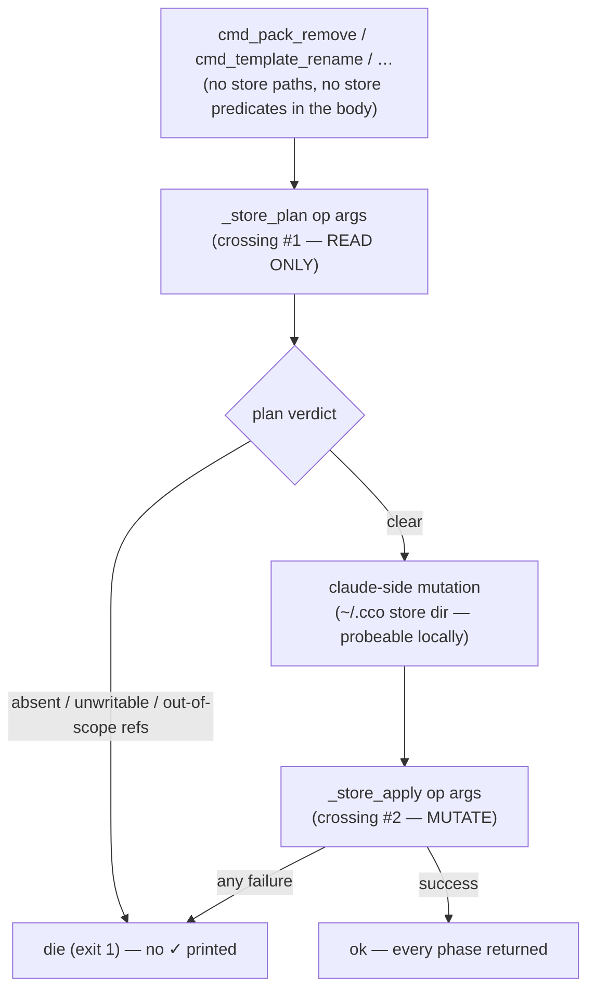
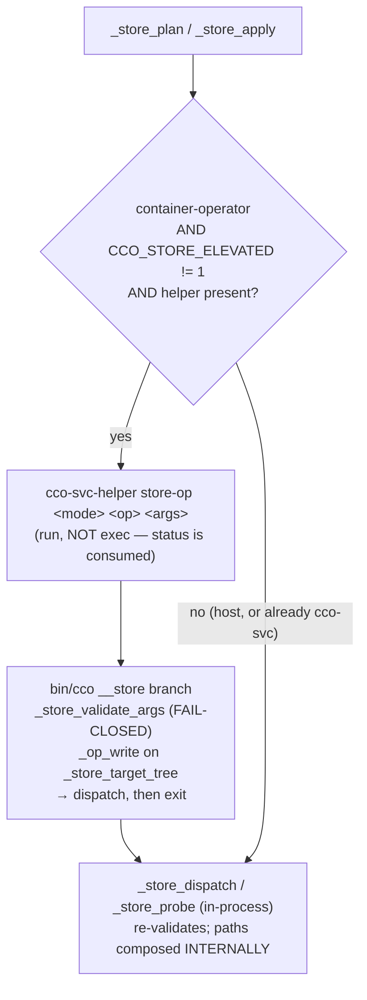

# Fix design RC-3 — direct-FS store access bypasses the ADR-0047 helper

> **Status**: Design phase (2026-07-19, rev. 2 after adversarial review), cycle 1 of the e2e-v2
> fix workstream. Input: [`../results/consolidated-review.md`](../results/consolidated-review.md)
> §3 (RC-3) and the ratified decision **D-M3** (cycle-1 scope). Structural template:
> [`../fix-design/00-overview.md`](../fix-design/00-overview.md). **No implementation code is
> written in this phase.**
>
> **Depends on**: RC-17 (container-operator test lane — the keystone that makes this verifiable)
> and a **widened** RC-2 (§3.6 of `04-host-path-class.md` must also give `_project_iter_members`
> an operator-mode *enumeration* arm, not only a probe-path swap — see §3.6 below). File-disjoint
> from RC-1/RC-4/RC-6; **not** file-disjoint from RC-2 (`lib/index.sh`), which is why §5 states an
> ordering constraint rather than assuming independence.
>
> **Title changed in rev. 2**: the root is not only the *write* path. Half the class dies at a
> **read** predicate before any write is attempted (§1.5). A design that converted only the
> writes would close nothing for five of the nine sites it claimed.

## 1. Root cause

Three mechanisms compose into one failure mode. All are verified against the current tree (line
numbers below are today's, not the review's).

### 1.1 The boundary bypass — command bodies mutate the store with raw `rm`/`mv`

ADR-0047 §2 confines the internal store (STATE index, DATA registries, CACHE internals) under
`/var/lib/cco-internal`, mode 0700, owned by `cco-svc`, on the container's real FS
(`config/entrypoint.sh:99-118`). `$HOME/.local/{state,share,cache}/cco` are symlinks *into* that
root (`entrypoint.sh:106-118`), so every bucket path the resolvers return
(`lib/paths.sh:421,433,470`) resolves through a parent the `claude` uid cannot traverse. The only
crossing is the setuid helper, reached from `bin/cco` via a **whole-verb trampoline** driven by a
whitelist:

```
bin/cco:456-468
_cco_verb_touches_store() {
    local c="$1" s="${2:-}"
    case "$c" in
        list)    return 0 ;;                                          # index + DATA tags + source
        path)    [[ "$s" == "list" ]] && return 0 ;;                  # index (host paths)
        repo|extra-mount) [[ "$s" == "rename" ]] && return 0 ;;       # STATE index re-key (project-scoped)
        tag)     case "$s" in add|remove|rm) return 0 ;; esac ;;      # DATA tags.yml write
        remote)  [[ "$s" == "list" ]] && return 0 ;;                  # DATA remotes registry
        project) case "$s" in show|validate|coords) return 0 ;; esac ;;  # index membership
        pack|template|llms) case "$s" in show|validate) return 0 ;; esac ;;  # DATA source provenance
    esac
    return 1
}
```

`pack remove`, `pack rename`, `template remove/rename`, `llms install/remove/rename`,
`remote add/remove/rename` are **absent**. They therefore run as `claude` and hit the 0700 parent:

```
lib/cmd-pack.sh:329-340
    rm -rf "$pack_dir"
    …
    rm -rf "$(_cco_data_dir)/packs/$name"
    rm -rf "$(_cco_state_dir)/packs/$name"
    _tags_forget packs "$name"

    ok "Pack '$name' removed"
```

`$pack_dir` is `~/.cco/packs/<name>` — CONFIG, a plain rw bind, so it **is** deleted. The two
following `rm -rf` calls target the confined buckets and EACCES. This is exactly the E6A-13 /
E6B-03 transcript: two `rm: cannot remove '/var/lib/cco-internal/...': Permission denied` lines,
then `✓ Pack 'e2e-probe-pack' removed`, exit 0.

### 1.2 The swallow — `set -e` is inert inside every command body

`bin/cco:2` sets `set -euo pipefail`, but every verb is dispatched inside a `||` list:

```
bin/cco:527-540
_cco_rc=0
case "$cmd" in
    …
    tag)     cmd_tag "$@"      || _cco_rc=$? ;;
    list)    cmd_list "$@"     || _cco_rc=$? ;;
…
bin/cco:583, 625   (the project / pack sub-dispatchers)
        esac || _cco_rc=$?
```

A command that is the left operand of `||` runs with `set -e` suspended, and the suspension
propagates into the called function and everything it calls. So **no unchecked failure anywhere
in any command body aborts anything**. The failing `rm` prints to stderr and execution walks
straight into `ok "Pack '$name' removed"`, exit 0.

The `||` is not a mistake — it exists so the EXIT trap (`bin/cco:5-8`) does not misreport an
intentional `die`/`return 1` as "cco exited unexpectedly". It cannot simply be removed (§4.3).

### 1.3 The read half — existence and enumeration predicates read FALSE behind the boundary

**This is the mechanism rev. 1 of this design under-weighted, and it is the larger half.**

An opaque (non-traversable) parent makes `stat(2)` fail for every descendant. Bash's `[[ -f ]]` /
`[[ -d ]]` do not distinguish EACCES from ENOENT — both are simply *false*. So a predicate written
to mean *"does this exist?"* silently changes meaning to *"is this reachable AND does it exist?"*,
and every caller that branches on it takes the "absent" arm. Three consequences, in ascending
order of damage:

| Shape | Site | In-container effect |
|---|---|---|
| `[[ -f "$f" ]] \|\| return 0` | `_tags_forget` (`lib/tags.sh:112`) | tag binding silently orphaned, `return 0` |
| `[[ ! -d "$d" ]] && die "… not found."` | `llms remove` (`lib/cmd-llms.sh:615`), `llms rename` (`:545`) | verb refuses with a **wrong reason** — an entry `cco list llms` just showed |
| `{ [[ -f "$rf" ]] && grep -q …; } \|\| die "… not found."` | `remote remove` (`lib/cmd-remote.sh:196-198`), `remote rename` (`:258-259`) | same |
| `for x in $(<index read>)` | `_index_section_get` (`lib/index.sh:144-148`) → `_index_get_project_repos` (`:676`) → `_project_iter_members` (`:777-786`) | **empty list, exit 0** — every loop over project members is vacuous |

The last row is the worst because it is *silent*: `_index_section_get` opens with
`f=$(_index_file); [[ -f "$f" ]] || return 0`, and `_index_file` is `$(_cco_state_dir)/index`
(`lib/index.sh:48-50`). Behind the boundary that is false, so the function returns **success with
no output**. Nothing prints, nothing fails; the caller's `for` loop simply has zero iterations.

Contrast `lib/tags.sh:75,85` (`_tags_set`), which was already hardened to `die`, and
`_project_foreach` (`lib/cmd-resolve.sh:160-186`), which got an explicit container-operator arm
(comment "R4") enumerating the **mounted** projects instead of reading the index. Those two are
the only places in the tree where this class was recognised and handled. They are also the
template for the fix (§3.6).

### 1.4 The composite: what `pack rename` actually does in-container (E6B-04)

```
lib/cmd-pack.sh:577-587   (strict pre-scan)
    while IFS=$'\t' read -r proj unit yml; do
        _yaml_list_has_ref "$yml" packs "$old" || continue
        affected+=("$proj")
        while IFS=$'\t' read -r mname mpath mstatus; do
            [[ "$mstatus" == unresolved ]] && blocked+=("$proj:$mname")
        done < <(_project_iter_members "$proj")
    done < <(_project_foreach)
    [[ ${#blocked[@]} -gt 0 ]] && die "Cannot rename pack '$old': unresolved member(s) …"

lib/cmd-pack.sh:598-614   (store re-key + fan-out)
    mv "$old_dir" "$new_dir" || die "Failed to move packs/$old → packs/$new."
    …
    [[ -d "$data_root/packs/$old"  ]] && mv "$data_root/packs/$old"  "$data_root/packs/$new"
    [[ -d "$state_root/packs/$old" ]] && mv "$state_root/packs/$old" "$state_root/packs/$new"
    _tags_rename packs "$old" "$new"
    …
    done < <(_rename_fanout_projectyml packs "$old" "$new")
    ok "Renamed pack '$old' → '$new'."
```

Traced honestly, statement by statement, in a `G=rw` container session:

1. **Outer loop works.** `_project_foreach` is operator-aware, so it yields the mounted
   project(s) — `PROJECT_NAME` plus any `CCO_CONFIG_TARGETS`. Projects that are *not* mounted are
   invisible here. Not a bug in itself; a scope fact, and §3.5 turns it into an explicit refusal.
2. **Inner loop is vacuous.** `_project_iter_members` begins with
   `for repo_name in $(_index_get_project_repos "$project")` → index read → EACCES → empty. Zero
   iterations, before any path is probed. `blocked` is therefore **always empty** and the strict
   pre-scan always passes.
3. `mv "$old_dir" "$new_dir"` succeeds — CONFIG is a claude-owned rw bind.
4. Both sidecar `mv`s are guarded by `[[ -d … ]]`, false under EACCES → skipped, **not even a
   stderr line**.
5. `_tags_rename` → `_tags_get` on an unreadable file → empty → `return 0` (`lib/tags.sh:126-132`).
6. `_rename_fanout_projectyml` (`lib/rename.sh:155-172`) has the same two-level structure: outer
   `_project_foreach` yields the mounted project, inner `_project_iter_members` yields nothing →
   `changed` is empty.
7. `ok "Renamed pack '$old' → '$new'."`, exit 0, no warning.

Net: the CONFIG store dir is renamed; every other store and every referencing project's `packs[]`
is left pointing at a name that no longer exists — and the verb prints `✓`. **Data-loss shaped.**

**This trace is why RC-2 alone does not close E6B-04.** RC-2's `_cco_member_probe_path`
(`lib/paths.sh:348-360`) changes *which path gets `-d`-tested* inside `_project_member_status`.
That is downstream of step 2. It cannot conjure a member list that `_index_get_project_repos`
never produced. §3.6 states the additional change required, and §5 states where it must land.

Per §6 gate 4 this was deliberately not executed with `-y` by the reviewers and must be
reproduced on a scratch project before being declared fixed.

### 1.5 Full site enumeration (the CLASS)

Direct FS access to a path derived from `_cco_data_dir` / `_cco_state_dir` / `_cco_cache_dir`
outside the primitives. The **Dies where** column is what rev. 1 lacked and is what determines
whether converting a site changes anything in-container.

| # | Site | Trees | Dies where, in-container, today | Disposition |
|---|---|---|---|---|
| 1 | `lib/cmd-pack.sh:336-338` (`pack remove`) | DATA, STATE, tags | **write** — false `✓`, exit 0 | **convert** (write + read) |
| 2 | `lib/cmd-pack.sh:603-605` + `:577-587` (`pack rename`) | DATA, STATE, tags, fan-out | **both** — vacuous pre-scan (§1.4 step 2) *and* skipped writes | **convert** (write + read + §3.6) |
| 3 | `lib/cmd-template.sh:403-405` (`template remove`) | DATA, STATE, tags | **write** — false `✓`, exit 0 | **convert** (write + read) |
| 4 | `lib/cmd-template.sh:465-467` (`template rename`) | DATA, STATE, tags | **write** — false `✓`, exit 0 | **convert** (write + read) |
| 5 | `lib/cmd-llms.sh:632` (`llms remove`) | CACHE (`LLMS_DIR=$(_cco_cache_dir)/llms`) | **read** — `die "LLMs 'x' not found."` at `:615` | **convert** (read first, else inert) |
| 6 | `lib/cmd-llms.sh:548-551` (`llms rename`) | CACHE, tags | **read** — `die` at `:545` | **convert** (read first, else inert) |
| 7 | `lib/cmd-remote.sh:271-274` (`remote rename`) | DATA registry, STATE token | **read** — `die` at `:258-259` | **convert** (read first, else inert) |
| 8 | `lib/cmd-remote.sh:230-234` (`remote remove`) | DATA registry, STATE token | **read** — `die` at `:196-198` | **convert** (read first, else inert) |
| 9 | `lib/cmd-remote.sh:164-170` (`remote add`) | DATA registry | **write** — dup-check reads false, `mkdir -p`/`>>` EACCES, false `✓` | **convert** (write + read) |
| 10 | `lib/cmd-remote.sh:16-36` (`_remote_token_set/_remote_token_remove`) | STATE token store | unreachable — gated behind 7/8's read `die` (`set-token` is host-only, `bin/cco:403`) | **convert** (folded into 7/8's ops) |
| 11 | `lib/tags.sh:109-121` (`_tags_forget`), `:126-132` (`_tags_rename`) | DATA tags | **read** — `[[ -f ]]` false → `return 0` | **convert** (become primitives) |
| 12 | `lib/index.sh` — `_index_section_get:144` and the ~14 `mktemp`+`mv` writers (`:70,79,104,137,175,196,209,223,315,358,373,399,412,425`) | STATE index | **read** — silent empty (§1.3 row 4) | **primitive layer** — see §6's exclusion set; the *callers* are fixed, not the file |
| 13 | `lib/cmd-pack.sh:839,846,1396` · `lib/cmd-template.sh:597,605-606` · `lib/cmd-llms.sh:219,711-728` · `lib/update-meta.sh:8-16` · `lib/update-hash-io.sh:25,82,215,231,265` — install/update provenance | DATA, STATE | write, swallowed | **cycle 2** — §4.6; cycle 1 gives them a fail-fast pre-flight |
| 14 | `lib/cmd-forget.sh:120-122`, `lib/cmd-project-rename.sh:83`, `lib/migrate.sh:409,898`, `lib/cmd-update.sh:381,394-396` | DATA, STATE, CACHE | n/a — host-only verbs (`bin/cco:369,434`) | **allowlist** (documented exemption in the §6 lint) |

`_meta_record_provenance` (`lib/update-meta.sh:8-16`) deserves a call-out: it ends with an
unconditional `return 0`, so it is a *third* deliberate swallow, independent of §1.2 and §1.3.

Row 12 is a deliberate re-classification. `lib/index.sh` is not a bypass site: it *is* the STATE
index primitive layer, and its writers are correct **because** every verb that reaches them is
either whole-verb elevated (`repo|extra-mount rename`, `path list`, `list`, `project show`) or
host-only (`join`, `forget`, `resolve`). Its exposure is its *readers'* assumption that a silent
empty result means "no members". That assumption is fixed at the callers (§3.6), not in the file.
It is named in the §6 exclusion set **with that reason**, so it no longer escapes by accident.

## 2. Findings closed and criteria restored

### 2.1 What closes, and under what condition

| Finding | Closes? | Condition |
|---|---|---|
| **E6A-13** (`pack remove` false `✓`) | yes | §3 alone |
| **E6B-03** (`template remove` false `✓`) | yes | §3 alone |
| **E6B-04** (`pack rename` half-applies) | yes | §3 **and** §3.6 (`_project_iter_members` operator arm, in RC-2's file) **and** §3.5 (cross-project refusal). Without all three it stays open — see §1.4. |

### 2.2 In-container value of the fix, verb by verb

Stated explicitly because rev. 1 asserted a blanket "every store-mutating verb" that the §1.5
**Dies where** column does not support:

| Verb | Today, in-container | After cycle 1 |
|---|---|---|
| `pack remove` | false `✓`, exit 0, sidecars+tag orphaned | applies wholly, or refuses with the real reason, exit 1 |
| `pack rename` | false `✓`, exit 0, refs dangling | applies wholly (mounted scope), or refuses, exit 1 |
| `template remove` / `rename` | false `✓`, exit 0 | applies wholly, or refuses, exit 1 |
| `remote add` | false `✓`, exit 0 | applies wholly, or refuses, exit 1 |
| `llms remove` / `rename` | `die "not found"` — **wrong reason**, exit 1 | applies wholly, or refuses **with the right reason** |
| `remote remove` / `rename` | `die "not found"` — **wrong reason**, exit 1 | applies wholly, or refuses **with the right reason** |

The bottom two rows are *already* "wholly refused" today. What cycle 1 changes for them is the
**reason**, and therefore whether the operator can act on it — a `not found` for an entry
`cco list llms` just displayed is an unactionable lie, and it is the same lie RC-13 reports. The
value is real, but it is a truth-in-messaging fix, not a from-broken-to-working fix, and §6 tests
it by asserting on the *message*, not only on the exit code.

### 2.3 Acceptance criteria (§8 of the handoff)

- **B — output-scoping / write path intact.** RC-3 is one of the two roots the consolidated review
  lists against criterion B (`consolidated-review.md` §2). This fix restores the clause "`cco`
  (via the setuid helper) still reads *and writes* the store, gated on `(G,Pc,Po)`" for the seven
  verbs in §2.2, and restores the 0/1/2 convention on that path (**error → 1**, never a false 0).
  It does **not** restore B for row 13 (cycle 2) — that gap is stated in §4.6, not papered over.
- **F — rename verbs (ADR-0050).** RC-3 is listed against F as "re-key silently skipped".
  `pack`/`template`/`llms`/`remote rename` become either wholly applied or wholly refused with a
  non-zero exit, where "wholly" is bounded by the session's visible scope and §3.5 refuses rather
  than silently narrowing. (F's other blocker, RC-2, is a separate design.)
- **§9 write-path check-in.** The handoff's pending "confirm the write-path (E4 rename, E6 store
  writes) on the target platform" item currently FAILS for E6 store writes; this makes it
  testable — and see the Linux caveat in §8 Q4.

**Incidentally affected but NOT claimed closed**: RC-13 / E6B-08 ("read verbs find entries that
mutation verbs report *not found*") is §1.3 row 2/3 verbatim. Cycle 1 removes the mechanism for
rows 5-8 of §1.5, which is most of RC-13's evidence — but RC-13 also covers read verbs outside
this design's file set, is deferred to cycle 2 (D-M3), and must be re-verified there rather than
declared fixed here.

## 3. The fix

### 3.1 Shape

One new module, `lib/store.sh`, is the **single source of truth** for reaching the confined store
outside the primitive layers. Three responsibilities, each in one place:

1. **Crossing the boundary** — decide whether this process can touch the store directly or must go
   through the setuid helper, and do it.
2. **Answering questions about the store honestly** — a verb never evaluates `[[ -d ]]` on a
   confined path itself; it asks for a **plan**, computed on the side of the boundary where the
   answer is knowable.
3. **Failing honestly** — every op returns non-zero on any failure, and the layer `die`s (exit 1)
   rather than letting a caller reach its `ok`.

Command bodies stop containing store paths entirely. They call named, whole-cascade ops.



and each crossing resolves the same way:



### 3.2 Why the pre-flight must itself be a crossing

Rev. 1 placed `_store_check` upstream of the crossing decision and budgeted one fork+exec per
cascade. That is incoherent, and the incoherence is not cosmetic:

- `_store_check` would run as `claude`.
- Its probe targets are `$(_cco_data_dir)/packs` etc. — `$HOME/.local/share/cco/...`, symlinks
  into the 0700 root (`entrypoint.sh:106-118`).
- Every `-d` / `-w` there is **unconditionally false** for the claude uid.

So a claude-side pre-flight has exactly two possible behaviours, both wrong: skip it in-container
(INV-S4 delivers nothing in the only environment the findings came from, and its tests become
host-only `chmod` theatre), or honour it (every store-mutating verb refuses up front in-container
— which is alternative 4.2, "goes from lies to always fails", already rejected).

**Decision: the pre-flight is a boundary crossing.** `_store_plan` runs on the elevated side and
returns a machine-readable plan; the claude side parses it and decides. `_store_probe` (the
elevated implementation) mutates nothing.

**Cost, restated honestly.** Verbs that mutate a claude-owned tree *before* the store — `pack
remove/rename`, `template remove/rename` — pay **two** crossings (plan, then apply). Verbs whose
entire mutation is one store op — `llms remove/rename`, `remote add/remove/rename` — pay **one**:
the apply is itself all-or-nothing, so there is nothing for a plan to protect, and the op's own
existence check runs elevated where it is truthful. `_store_plan` is therefore called by four
verbs, not seven.

**TOCTOU.** A second crossing opens a window between plan and apply. It is not a correctness hole:
the only writer is the same user's `cco`, the apply is status-checked end to end (INV-S3), and a
lost race produces a loud `die` naming which stores changed — never a silent half-apply. That is
strictly better than today and is the maximum reachable under ADR-0050 D5's ratified "no
cross-store transaction". §3.4 Phase 2 covers the residue.

### 3.3 Contract

**Op catalogue (cycle 1).** Ops are named cascades, never raw paths. Each is one boundary
crossing, so a cascade cannot half-cross. Every op supports two modes — `plan` (probe, emit
verdict, mutate nothing) and `apply` — dispatched from the same catalogue entry so the two can
never disagree about which paths an op touches.

| Op | Args | Trees touched | Target tree for `_op_write` | Plan called by a verb? |
|---|---|---|---|---|
| `sidecar-purge` | `<kind> <name>`, kind ∈ `packs\|templates` | `DATA/<kind>/<name>`, `STATE/<kind>/<name>`, tags entry | `global` | yes |
| `sidecar-rekey` | `<kind> <old> <new>` | same, moved | `global` | yes (+ ref census) |
| `llms-purge` | `<name>` | `CACHE/llms/<name>`, tags entry | `global` | no |
| `llms-rekey` | `<old> <new>` | same, moved | `global` | no |
| `remote-put` | `<name> <url>` | `DATA/remotes` | `global` | no |
| `remote-drop` | `<name>` | `DATA/remotes`, `STATE/remotes-token` | `global` | no |
| `remote-rekey` | `<old> <new>` | `DATA/remotes`, `STATE/remotes-token` | `global` | no |

**Plan output.** Line-oriented, tab-separated, stable, parseable under `set -u` in bash 3.2:

```
target<TAB><logical-target><TAB>present|absent
verdict<TAB><logical-target><TAB>writable|unwritable
refs<TAB><count>                       # sidecar-rekey packs only; COUNT, never names
```

`present|absent` is what lets `llms remove` and `remote remove` emit the *right* refusal: the
elevated side is the only place where "absent" is a fact rather than an artefact. `refs` is a
count, not a list, because the projects it counts live on the `Po` axis and `pack rename` only
requires `G=rw` — naming them would leak exactly what `edit-global`'s `(rw,rw,none)` withholds.
Count-only is the established `_env_note_hidden` idiom (ADR-0043), reused rather than reinvented.

**Invariants** (these are the design, not decoration):

- **INV-S1 — no argv path ever reaches the store, and validation is fail-closed on the elevated
  side.** An op takes a **kind** from a fixed whitelist and a **logical name** validated against
  `^[A-Za-z0-9][A-Za-z0-9._-]*$` with an explicit `*..*` and `*/*` rejection. `lib/store.sh`
  composes every path itself from the bucket resolvers. A generic `rm <path>` op is forbidden.
  **Placement is load-bearing**: the agent can invoke `cco-svc-helper` directly, and
  `config/cco-svc-helper.c:170-178` forwards `argv[1..]` verbatim into `bash -p /opt/cco/bin/cco
  __store …`, which reaches the elevated branch (`bin/cco:492-502`) *without passing through
  `_store_apply`*. Validation therefore runs **first in the elevated `store-op` arm** (before
  `_op_write`, so a malformed op cannot even select a target tree) **and again as the first
  statement of `_store_dispatch`/`_store_probe`** (which covers the host in-process path). The
  `_store_apply`-side call is a UX nicety only; removing it must not change security. Without
  this, `cco-svc-helper store-op apply sidecar-rekey packs ../../state/cco x` in any `G=rw`
  session — config-editor bare/`--all`, `edit-global`, `edit-all`, i.e. the exact sessions E6A/E6B
  ran in — would pass `_op_write … global` and execute an unvalidated `mv` as `cco-svc` inside the
  confined root. That is the arbitrary-path primitive §4.4 rejects, and it is the same argument
  INV-S2 already makes for gating.
- **INV-S2 — the elevated side re-gates.** The elevated `store-op` arm calls
  `_op_write <label> <target tree>` — the tree read from `_store_target_tree`, the same source the
  claude side uses — **before** dispatching. The authoritative gate is the elevated re-run keyed
  off the trusted `:ro` descriptor (`bin/cco:492-502`, ADR-0047 R2), never the forgeable outer
  env. Without INV-S2 a `read-project` agent could purge any pack's sidecars through the helper.
- **INV-S3 — no silent success.** Every `rm`/`mv`/`mktemp`/redirect inside `lib/store.sh` is
  status-checked; the op returns non-zero on the first failure. `_store_apply` turns non-zero into
  `die` (exit 1, D8: this is an *error*, not a policy refusal).
- **INV-S4 — no mutation before a truthful plan.** For the four verbs with a claude-owned
  mutation, `_store_plan` (§3.2) runs first, elevated, and any `absent`/`unwritable`/out-of-scope
  verdict `die`s before anything is touched.
- **INV-S5 — `cco-svc` never writes a claude-owned tree.** The ops touch DATA/STATE/CACHE only.
  `~/.cco/packs/<name>`, `~/.cco/templates/…` and any repo's `project.yml` are mutated by the
  **claude-side** verb body, before/after the crossing — never inside it. This is the existing
  stated contract of the classifier (`bin/cco:451-455`), now actually enforceable because
  elevation is per-op rather than per-verb.
- **INV-S6 — no store predicate is evaluated claude-side.** No code outside `lib/store.sh` may
  test the existence, readability or writability of a confined path, or branch on the emptiness of
  an index-derived list. Existence is a *fact of the plan*; emptiness of a member list is a fact of
  §3.6's enumeration. This is the invariant that closes §1.3, and §6's lint enforces it structurally
  rather than by inspection.

**Illustrative shape — design intent, not code to paste:**

```bash
# lib/store.sh — the ONLY module that reaches the ADR-0047-confined buckets
# outside the primitive layers (paths/index/tags/sync-meta).
# bash 3.2: no associative arrays (the catalogue is a `case`), no `mapfile`.

_store_valid_name() {                     # INV-S1
    case "$1" in
        ''|*..*|*/*) return 1 ;;
        [A-Za-z0-9]*) [[ "$1" =~ ^[A-Za-z0-9][A-Za-z0-9._-]*$ ]] ;;
        *) return 1 ;;
    esac
}

# _store_target_tree <op> — the (G,Pc,Po) axis the op writes. ONE source; the
# elevated gate and the claude-side UX check both read it.
_store_target_tree() {
    case "$1" in
        sidecar-purge|sidecar-rekey|llms-purge|llms-rekey|remote-*) printf 'global' ;;
        *) return 1 ;;
    esac
}

# _store_probe   <op> [args…] — elevated; emits the plan, mutates nothing.
# _store_dispatch <op> [args…] — elevated (or host in-process); mutates.
# BOTH begin with _store_validate_args (INV-S1, fail-closed).

# _store_plan  <op> [args…] — crossing #1. Echoes the plan for the caller to parse.
# _store_apply <op> [args…] — crossing #2. Status only; never used in $( … ).
_store_apply() {
    local op="$1"; shift
    _store_validate_args "$op" "$@" || die "Internal: bad store op '$op'."   # UX only
    if [[ "${CCO_STORE_ELEVATED:-}" != "1" ]] && _cco_container_operator \
       && [[ -x /usr/local/bin/cco-svc-helper ]]; then
        # RUN, never exec: unlike the whole-verb trampoline (bin/cco:513) the
        # caller must survive to finish its claude-side work and to report.
        /usr/local/bin/cco-svc-helper store-op apply "$op" "$@" \
            || die "Store update failed ($op) — the internal store was not modified."
        return 0
    fi
    _store_dispatch "$op" "$@" \
        || die "Store update failed ($op) — see the error above."
}
```

and the call site collapses to:

```bash
# lib/cmd-pack.sh — cmd_pack_remove, design intent
    _store_require_plan sidecar-purge packs "$name"   # crossing #1; dies on any blocker
    rm -rf "$pack_dir" || die "Failed to remove packs/$name."
    _store_apply sidecar-purge packs "$name"          # crossing #2
    ok "Pack '$name' removed"
```

`CCO_STORE_ELEVATED=1` is injected by the helper (`config/cco-svc-helper.c:107`), so the
recursion terminates by construction.

### 3.4 Ordering and partial failure

ADR-0050 D5 already ratified "no cross-store transaction is attempted (not achievable in bash)".
This design does not re-litigate that; it strengthens the pre-validation half of the same
decision:

1. **Phase 0 — plan, zero mutation.** Name/uniqueness validation (already present), **plus**
   `_store_plan` for the verb's store op (elevated — §3.2), **plus**, for `pack rename`, a
   writability probe of each referencing project's `project.yml` at its *probe path*
   (`_cco_member_probe_path` — RC-2's helper) over the member list §3.6 now actually produces.
   Any blocker → `die` (exit 1) with the real reason, nothing touched.
2. **Phase 1 — mutate**, in the current order: CONFIG store dir, then one `_store_apply` for the
   whole sidecar+tags cascade, then the `project.yml` fan-out.
3. **Phase 2 — residual failure.** With Phase 0 in place, the remaining window is a genuine race
   or an I/O error. Response: compensating `mv` of the CONFIG store dir back (the single cheap,
   safe reversal), then `die` naming exactly which stores did and did not change. The fan-out is
   git-delegated and user-visible; it is never auto-unwound.

`ok` is reached only when every phase returned. The `✓` becomes a truthful assertion again.

### 3.5 Cross-project scope: refuse, do not silently narrow

In a container session, other projects' repos are **not mounted** — only the current project (and
config-editor targets). `_project_foreach` correctly reports only those. So the `packs[]` fan-out
physically cannot reach an unmounted referencing project, at any access level.

Silently renaming anyway is precisely E6B-04. The design therefore extends ADR-0050's *existing*
strict pre-scan — which already refuses on an `unresolved` member with "Run `cco resolve` first" —
with a second, structurally identical arm: if the plan's `refs` count exceeds the number of
referencing projects visible in this session, `pack rename` **refuses**, exit 1, naming the count
and the host command that can complete it. Same shape, same rationale, no new concept.

Consequence, stated rather than hidden: a pack referenced by projects outside the session's mount
set is not renameable in-container. That is the honest reading of criterion F's "wholly applied or
wholly refused", and it is why §2.1 makes E6B-04's closure conditional on this clause.

### 3.6 Member enumeration must get the operator-mode treatment (widened RC-2 dependency)

`_project_iter_members` (`lib/index.sh:777-786`) needs the same container-operator arm that
`_project_foreach` (`lib/cmd-resolve.sh:160-186`) already has: in operator mode, enumerate the
project's members from the **mounted** `project.yml`'s `repos[]` rather than from
`_index_get_project_repos`, and derive each member's path from `_cco_member_probe_path`. This is a
claude-side read of a mounted, claude-readable file — **no crossing required**, and no elevated
read op has to be invented for it.

RC-2's §3.6 as currently written keeps `for repo_name in $(_index_get_project_repos "$project")`
and changes only the probe path. That is necessary but not sufficient: it fixes column 2 of rows
that are never emitted. The two changes are in the same function and must land together.

**Ownership**: the change belongs in RC-2's file and in RC-2's contract (it is the same
index-host-path-vs-mount class). It is stated here because RC-3's E6B-04 closure depends on it and
a dependency that is not written down is not a dependency. §5 records the resulting ordering
constraint; §6 records the test that fails without it.

### 3.7 Wiring: `store-op` stays inside the boundary

`store-op` is registered in **two** places, and deliberately not in a third:

1. `_cco_operator_shim`'s `case "$cmd"` — as a known verb, so INV-S1's validation and INV-S2's
   `_op_write` gate run. Outside the elevated re-entry (`CCO_STORE_ELEVATED != 1`) the arm
   refuses: `store-op` is an internal crossing target, not an operator verb.
2. The `__store` branch at `bin/cco:492-502`, which already peels the marker verb and calls the
   shim. It gains a local dispatch for `store-op` that **exits** rather than falling through.

It is **not** registered in the top-level `case "$cmd"` dispatcher (`bin/cco:527+`). Rev. 1 said
"and in the main dispatcher"; that was a regression. On the host `_cco_operator_shim` is never
invoked — `bin/cco:515-525` takes the `else` branch straight to `_cco_first_run` — so a top-level
`store-op` arm would make `cco store-op apply sidecar-purge packs <name>` a real, ungated,
undocumented **public host verb**: absent from `usage()`, absent from `cco help`, absent from the
CLI-surface matrix, and in violation of
`docs/maintainers/cli/design/design-cli-environment-awareness.md`'s "every verb must be
environment-aware". Local dispatch inside the `__store` branch is both simpler and strictly
contained; the host reaches `_store_dispatch` in-process through `_store_apply`, never through a
verb.

### 3.8 What does **not** change

`_cco_verb_touches_store` keeps whole-verb elevation for the **pure read** verbs (`list`,
`path list`, `project show|validate|coords`, `pack|template|llms show|validate`, `remote list`)
and for `tag add|remove` — those touch nothing claude-owned, so running the entire verb as
`cco-svc` is correct and cheaper. The classifier's comment gains a companion sentence naming the
mixed-verb rule. `lib/index.sh` and `lib/sync-meta.sh` keep their direct bucket access: they are
primitive layers reached only by elevated or host-only verbs (§1.5 row 12).

## 4. Why this shape, and not the alternatives

**4.1 Add the mutating verbs to `_cco_verb_touches_store`** (the one-line fix). **Rejected.**
Whole-verb elevation makes `cco-svc` execute `rm -rf ~/.cco/packs/<name>` and, for `pack rename`,
rewrite mounted repos' `project.yml`. That violates the classifier's own stated contract
(`bin/cco:451-455`, "so cco-svc never writes a claude-owned tree") and works only by accident of
macOS Docker Desktop `fakeowner`, where DAC on bind-mount content is not enforced (ADR-0047 §8
Test A). On Linux it either EACCESes or leaves `cco-svc`-owned files inside a claude-owned tree
that the agent can then no longer edit. ADR-0047 §3's implementation note already flags the Linux
write path as open; this alternative would multiply the exposure instead of containing it. It also
cannot work mechanically for `pack rename`: the trampoline `exec`s (`bin/cco:513`), so there is no
caller left to run the claude-side half.

**4.2 `|| die` at each call site.** **Rejected.** Copy-paste of a predicate across call sites
(explicitly out of bounds), no protection for the next site, and it fixes only §1.2 — the verb
still cannot cross the boundary, so `cco pack remove` would go from "lies" to "always fails
in-container". Honest, but non-functional. It also does nothing at all for §1.3, where there is no
failing command to `||` onto: the read predicate *succeeds*, it just answers the wrong question.

**4.3 Remove the `|| _cco_rc=$?` dispatcher wrapper to restore `set -e`.** **Rejected.** The
wrapper is load-bearing: it keeps the EXIT trap (`bin/cco:5-8`) from reporting every intentional
`die`/`return 1` as "cco exited unexpectedly". Removing it converts every deliberate non-zero
return in the CLI into a crash message. Blast radius = the entire surface, for a benefit the
primitive layer delivers locally. Same §1.3 objection as 4.2.

**4.4 A generic `__store rm|mv <path>` primitive.** **Rejected — privilege escalation.** The
helper is reachable directly by the agent; a path-taking op running as `cco-svc` is an
arbitrary-write primitive against the very tree the boundary exists to protect. Hence INV-S1 —
and hence INV-S1's *placement* clause, since an op catalogue whose validation lives only on the
claude side is this alternative wearing a costume.

**4.5 Relax the boundary (group-write, or 0750) so `claude` can write the sidecars.**
**Rejected.** That reopens S1/S1b, i.e. criterion **B — S1**, the one criterion every session
currently passes.

**4.6 Convert the install/update provenance writers in cycle 1 (§1.5 row 13).** **Rejected for
cycle 1, deliberately.** They are the same class, but the conversion reaches into the update
engine (`update-meta.sh`, `update-hash-io.sh`, `_record_tree_as_base` copying whole trees into
STATE) — roughly triple the surface, none of it evidenced by a finding, and D-M3 scopes cycle 1 to
"only the roots that break acceptance criteria". Cycle 1 instead gives those verbs a
**`_store_plan` pre-flight at verb entry**, so `cco pack install` in a session that cannot write
DATA/STATE refuses up front with the real reason instead of installing the pack and silently
losing its provenance. Full conversion is tracked for cycle 2 and is §8 Q1.

**4.7 A write-ahead journal / two-phase commit.** **Rejected.** The journal would itself have to
live behind the boundary (chicken-and-egg with the very failure it guards), and ADR-0050 D5
already ratified "no cross-store transaction is attempted". A truthful plan (INV-S4) plus a
single-step compensating undo is the maximum compatible with the settled decision.

**4.8 A single crossing, with the plan folded into the apply.** **Rejected.** It would mean the
store op decides for itself whether to proceed and then reports — which is fine for the store, but
the claude-owned mutation (`rm -rf ~/.cco/packs/<name>`) happens *outside* that op and must be
ordered against it. Folding them means either mutating CONFIG before knowing the store verdict
(today's bug) or moving the CONFIG mutation inside the elevated op (INV-S5 violation, alternative
4.1). Two crossings is the price of keeping the claude-owned half claude-side.

**4.9 An elevated read op that returns other projects' member paths, so the in-container fan-out
can reach them.** **Rejected.** Those repos are not mounted, so their `project.yml` cannot be
rewritten in-container no matter what the index says; the op would return paths that only serve to
be printed — an INV-4 host-path leak on the `Po` axis in a verb that requires only `G=rw`. §3.5's
count-only census plus a refusal delivers the correctness without the leak.

## 5. Blast radius

**Callers/consumers touched**

- `lib/cmd-pack.sh` — `cmd_pack_remove`, `cmd_pack_rename` (incl. the `:577-587` pre-scan).
- `lib/cmd-template.sh` — `cmd_template_remove`, `cmd_template_rename`.
- `lib/cmd-llms.sh` — `_llms_remove`, `_llms_rename`, **including the `:545` / `:615` existence
  checks**, which move behind the plan (INV-S6). Converting the writes alone would leave both
  verbs dead at the read (§1.5 rows 5-6).
- `lib/cmd-remote.sh` — `_cmd_remote_add`, `_cmd_remote_remove`, `_cmd_remote_rename`, **including
  the `:196-198` / `:258-259` existence checks**, plus the two token helpers `_remote_token_set` /
  `_remote_token_remove` (called only from those).
- `lib/tags.sh` — `_tags_forget` / `_tags_rename` become store primitives and gain a failure
  return. **Other callers must be audited**: `lib/cmd-forget.sh` (host-only) and
  `lib/cmd-project-rename.sh` (host-only) both call them; on the host `_store_apply` runs
  in-process, so behaviour is unchanged except that a real I/O failure now `die`s instead of being
  ignored. That is the intended change, but it is a behaviour change on the host path and is the
  main regression risk.
- `lib/index.sh` — `_project_iter_members` gains the operator-mode enumeration arm (§3.6).
  **This file is RC-2's**; see the ordering constraint below.
- `bin/cco` — `store-op` in `_cco_operator_shim` (gated per INV-S1/INV-S2) and a local dispatch in
  the `__store` branch (§3.7). **Not** in the top-level dispatcher.
- `lib/store.sh` — new; sourced from `bin/cco` after `paths.sh` and before `tags.sh`
  (`_store_dispatch` uses the bucket resolvers; `tags.sh` will call into it).

**Ordering constraint (new in rev. 2).** RC-3 and RC-2 both edit `lib/index.sh`
(`_project_iter_members`). They are therefore *not* file-disjoint. Either RC-2 lands first with
§3.6 folded into its §3.6, or RC-3 owns the function outright and RC-2 rebases onto it. The
former is preferred (it keeps the whole probe-path class in one design); the choice must be made
before either is implemented, not discovered at merge.

**What could regress**

1. **Host remove/rename parity.** Every host invocation now routes through `_store_dispatch`. The
   dispatch body must be a faithful move of the existing statements, not a rewrite. Net for the
   host: identical effects, plus `die` on failures that were previously ignored.
2. **`cco forget --purge` / `cco project rename`** — via the `_tags_*` change above.
3. **Over-refusal.** A too-strict plan could refuse a verb that would have succeeded (e.g. a
   resource that legitimately never had a sidecar). The probe must test the **parent's**
   writability and report the target as `absent`, which the caller treats as a valid no-op — the
   current `[[ -d … ]] &&` guards encode exactly that no-op semantics and must be preserved
   *inside* the primitive, where the predicate is truthful.
4. **Under-refusal on `pack rename`.** §3.5's refusal keys off a count comparison. If the census
   and `_project_foreach` disagree about what "a referencing project" means, the verb either
   over-refuses (annoying) or under-refuses (E6B-04 again). Both sides must derive "references
   `<old>` in `packs[]`" from `_yaml_list_has_ref`, not from two independent readings.
5. **Double gating.** `_op_write` already gates `pack remove` at the outer (claude) shim
   (`bin/cco:425`). INV-S2 gates again in the elevated re-run. A mismatch between the two labels
   would produce a confusing double message; both must read from `_store_target_tree`.
6. **Cost.** Two `fork+exec` + bash starts for `pack|template remove|rename`; one for
   `llms|remote` mutations (§3.2). Not per file — that is why ops are whole cascades. On the host,
   zero: `_cco_container_operator` is false and both helpers run in-process.

**bash 3.2 notes**

- No associative arrays: the op catalogue and the tree map are `case` statements.
- No `mapfile`/`readarray`; no `${var^^}`.
- Under `set -u`, every op-arg array must be guarded — `[[ ${#args[@]} -gt 0 ]]` or
  `${args[@]+"${args[@]}"}` — including the empty-arg case of a zero-argument op.
- `die` inside `$( … )` exits only the subshell (`lib/paths.sh:365-366`). **Contract: no
  `_store_apply` call may appear inside a command substitution** — it emits status, not stdout.
  `_store_plan` is the deliberate exception: it *is* consumed via `$( … )` / a process
  substitution, so it must **never `die`** — it returns non-zero and lets the caller
  (`_store_require_plan`, which runs outside any substitution) do the dying.
- `local x; x=$(…)` split assignment where the status matters (`local x=$(…)` masks it).

## 6. Test plan

### 6.1 Simulating the boundary hermetically — two distinct modes

The hermetic simulation is `chmod` on a bucket ancestor: DAC applies to the owner too, so a
non-root test process gets the same errno the `claude` uid gets at the 0700 root. Each such test
must `return 0` early when `id -u` is 0 (a root test runner cannot be confined).

Rev. 1 said "`chmod` on the bucket parent" and used `555` throughout. Those are **two different
failures** and conflating them produced a test that is green before and after. Pin them:

| Mode | Simulation | Models | Existence predicates read | Writes |
|---|---|---|---|---|
| **opaque** | `chmod 000` on the bucket parent (non-traversable) | the ADR-0047 boundary as shipped (§1.3) | **false** | fail |
| **read-only** | `chmod 555` on the bucket parent (traversable, non-writable) | the Linux bind-mount ownership case (§8 Q4) | **true** | fail |

Every test below names its mode and its **observed** pre-fix rc. Where the observed rc was
measured rather than reasoned, it is marked *(measured)*.

Worked example, because it is the one rev. 1 got wrong. `_tags_forget` under **read-only** (555):
`[[ -f "$f" ]]` is *true* (the dir is traversable), so execution reaches
`tmpf=$(mktemp "${f}.XXXXXX")`, which fails in a non-writable dir leaving `tmpf` empty; the
`awk … > "$tmpf"` redirect to an empty target then fails, the `&&` chain at `lib/tags.sh:120`
short-circuits, and the function **already returns 1 today**. Only under **opaque** (000) does
`[[ -f ]]` read false and the function `return 0`. Measured:

```
MODE 555 (read-only parent) rc=1     ← green before AND after; proves nothing
MODE 000 (opaque parent)    rc=0     ← the actual defect
```

### 6.2 New file — `tests/test_store_writes.sh`

| Test | Mode | Assertion that fails today |
|---|---|---|
| `test_store_pack_remove_fails_loud_when_data_unwritable` | read-only | `cco pack remove p -y` must exit non-zero. **Today: exit 0.** |
| `test_store_pack_remove_prints_no_success_tick_on_failure` | read-only | stdout+stderr must not contain `Pack 'p' removed`. **Today: it does.** |
| `test_store_pack_remove_plan_leaves_config_intact` | opaque | with the sidecar parent opaque, `~/.cco/packs/p` must still exist (INV-S4 aborted before Phase 1). **Today: the pack dir is already deleted, rc=0.** |
| `test_store_pack_rename_plan_blocks_before_store_mv` | read-only | rc≠0, `packs/<old>` present, `packs/<new>` absent. **Today: rc=0, old gone, new present, sidecars orphaned.** |
| `test_store_pack_rename_all_or_nothing_on_sidecars` | none (normal perms) | on success, `DATA/packs/<new>` and `STATE/packs/<new>` both exist and the `<old>` keys are gone. *Passes today on the host — parity lock, marked as such.* |
| `test_store_template_remove_fails_loud_when_state_unwritable` | read-only | rc≠0, no `Template 'x' removed`. **Today: exit 0 + tick.** |
| `test_store_template_rename_plan_blocks` | read-only | as pack rename. **Today: rc=0, half-applied.** |
| `test_store_llms_remove_fails_loud_when_cache_opaque` | opaque | rc≠0 **with a message naming the store**, not `LLMs 'x' not found`. **Today: rc=1 with the wrong reason** (`lib/cmd-llms.sh:615`) — asserts on the message, so it fails today. |
| `test_store_remote_remove_reports_store_not_message_not_found` | opaque | as above against `lib/cmd-remote.sh:196-198`. **Today: rc=1, `Remote 'x' not found`.** |
| `test_store_remote_rename_fails_loud_when_data_unwritable` | read-only | rc≠0, no `Renamed remote`. **Today: exit 0 + tick** (the `:258-259` read passes under 555). |
| `test_store_remote_add_fails_loud_when_registry_unwritable` | read-only | rc≠0, no `Added remote`. **Today: exit 0 + tick.** |
| `test_store_tags_forget_reports_failure` | **opaque** | `_tags_forget` on an unreachable registry must return non-zero. **Today: `[[ -f ]]` false → `return 0`** *(measured: rc=0 at 000, rc=1 at 555 — hence the mode pin)*. |
| `test_store_op_rejects_traversal_and_bad_kind` | none | `sidecar-purge packs '../evil'` and `… badkind x` must both be refused without touching the FS (INV-S1). *New surface — declared as a guard, not a bug-catcher.* |

### 6.3 New — enumeration (the §1.3 row 4 / §3.6 defect)

Runs in the RC-17 container-operator lane, or hermetically by pointing the STATE bucket at an
opaque parent while `/workspace/<repo>` exists.

| Test | Assertion that fails today |
|---|---|
| `test_store_iter_members_nonempty_when_index_unreadable` | with STATE opaque and the project mounted, `_project_iter_members "$PROJECT_NAME"` must emit one row per `repos[]` entry. **Today: zero rows, rc=0.** This is the test that fails if §3.6 is descoped to RC-2's probe-path-only change. |
| `test_store_pack_rename_prescan_sees_members_in_container` | the `cmd-pack.sh:577-587` pre-scan must classify members. **Today: `blocked` is unconditionally empty.** |
| `test_store_pack_rename_refuses_on_unmounted_refs` | plan `refs` count > visible referencing projects → rc≠0, nothing mutated, message names the count and the host command (§3.5). **Today: rc=0, refs left dangling.** |

### 6.4 Extend — `tests/test_privilege_boundary.sh`

| Test | Assertion that fails today |
|---|---|
| `test_boundary_storeop_is_write_gated` | drive `_cco_operator_shim store-op apply sidecar-purge packs x` at `CCO_ACCESS_TRIPLE=ro,ro,none` → must **refuse, exit 2** (INV-S2). **Today: `store-op` is an unknown verb → exit 1 via `die`,** so the exit-code assertion fails. |
| `test_boundary_storeop_validates_before_gate` | `store-op apply sidecar-rekey packs ../../state/cco x` at `CCO_ACCESS_TRIPLE=rw,rw,rw` (i.e. the gate would pass) must still be **refused**, and no FS access must occur. This is INV-S1's placement clause: it fails if validation lives only in `_store_apply`. **Today: verb unknown → the assertion is unreachable; post-fix it is the security lock.** |
| `test_boundary_storeop_absent_from_host_dispatcher` | on a simulated host (`_cco_container_operator` false), `cco store-op …` must report an **unknown command** (§3.7). Guards the rev. 1 regression. |
| `test_boundary_mixed_verbs_do_not_whole_verb_elevate` | `_cco_verb_touches_store pack remove` / `template rename` / `remote add` must all be **false**. Passes today; it is the lock that prevents alternative 4.1 from being reintroduced — marked as a lock, not a bug-catcher. |

### 6.5 Extend — `tests/test_invariants.sh` (the CLASS guard)

Rev. 1 specified a grep intersecting an FS-mutating token with a bucket-resolver token. **That
mechanism does not work, and the claim "~14 non-allowlisted hits" was asserted rather than
measured.** Run against today's tree it produces **9 hits, of which only 4 are class members**:

```
lib/cmd-pack.sh:336,337        ← real
lib/cmd-template.sh:403,404    ← real
lib/migrate.sh:60,61,62        ← noise: `_cco_data_dir >/dev/null` resolver warm-ups
lib/migrate.sh:127             ← noise: a comment
lib/utils.sh:292               ← noise: a `2>/dev/null`
```

and it **misses 7 of the 11 sites §1.5 enumerates**, because every one of them resolves the bucket
into a local variable first: `lib/cmd-pack.sh:603-604` and `lib/cmd-template.sh:465-466`
(`$data_root`/`$state_root`), all of `lib/cmd-remote.sh` (`$rf`/`$tf`), `lib/cmd-llms.sh:548,632`
(`$old_dir`/`$llms_dir`), `lib/tags.sh:114-120` (`$f`). A guard blind to the majority of its class
is worse than none: it certifies.

**Mechanism, replaced.** `test_invariant_no_direct_store_access_outside_primitives` is an awk pass
with **assignment provenance**, run per file:

1. Record every assignment whose RHS contains a bucket resolver or a bucket-derived variable
   (`x=$(_cco_data_dir)`, `x="$(_cco_state_dir)/packs"`, `y="$x/$name"`) — transitively, within
   the file.
2. Flag any FS-mutating statement (`rm`, `mv`, `mkdir -p`, `>`/`>>` with a non-`/dev/null`,
   non-fd target, `mktemp` with a template) **or** any existence predicate (`[[ -f/-d/-e/-r/-w ]]`)
   whose target expands one of those variables or calls a resolver directly. The predicate half is
   what enforces INV-S6; a mutation-only lint cannot see §1.3 at all.
3. Exclude, **each with its stated reason**, not by accident of matching:
   - `lib/store.sh` — the primitive itself;
   - `lib/paths.sh` — defines the resolvers;
   - `lib/index.sh`, `lib/sync-meta.sh` — STATE primitive layers, reached only by whole-verb-
     elevated or host-only verbs (§1.5 row 12). Rev. 1 omitted these; under the strengthened
     mechanism they would fail post-fix, which is how their omission was found;
   - `lib/tags.sh` — post-conversion it delegates to `lib/store.sh`; the exclusion is removed if
     that delegation is complete, and the lint is the check;
   - a commented allowlist of §1.5 row 14 (host-only) and row 13 (cycle-2 provenance, each with
     its tracking reference).

**Baseline is measured, not asserted.** Implementation records the strengthened lint's hit set on
the pre-fix tree in the test file's header comment; acceptance is *post-fix hit set == the
exclusion set + allowlist*, with the diff printed on failure. The naive form's 9/4 split above is
recorded as the evidence that the mechanism, not the token list, was the problem.

### 6.6 Regression net and gates

**No new tests, must stay green**: `tests/test_pack_cli.sh`, `tests/test_pack_template_rename.sh`,
`tests/test_remote_rename.sh`, `tests/test_remote.sh`, `tests/test_rename.sh`, `tests/test_llms.sh`,
`tests/test_forget.sh`, `tests/test_project_rename.sh`, `tests/test_index.sh` (its
`_project_iter_members` case at `:222` pins the host output shape §3.6 must not change),
`tests/test_tags*`, `tests/test_list.sh`.

**Container-operator lane (RC-17)**: two scenarios in a real session at `edit-global` —
(i) `cco pack remove <scratch-pack> -y` must exit 1 leaving `~/.cco/packs/<name>` in place, or
exit 0 with all four stores consistent; (ii) `cco llms remove <entry>` must not print
`not found` for an entry `cco list llms` shows. The hermetic tests are the fallback that works
without the lane; the lane is what proves the *helper crossing* actually succeeds and that the
`refs` census is truthful.

**Manual gate (not a unit test)** — consolidated review §6.4: reproduce **E6B-04** on a scratch
project with `-y` before declaring RC-3 fixed, and re-run it after. Baseline expectation before
the fix: `✓`, exit 0, two projects' `packs[]` dangling.

**Suite baseline**: 1311/9 (the 9 = pre-existing FI-19 boundary artifacts) plus the new file.

## 7. Docs / ADR consequences

Per `.claude/rules/documentation-lifecycle.md`: ADRs are history → **forward-annotate**, never
rewrite. Living docs → rewrite to truth.

- **ADR-0047 §2 + §3 (forward annotation).** §2 specifies "only its internal-store **primitives**
  re-exec through the setuid helper"; the shipped Phase II implemented **whole-verb** elevation
  (`_cco_verb_touches_store`). Annotate: cycle 1 introduces the primitive granularity §2 actually
  specified, kept alongside whole-verb elevation for pure reads, and records why mixed verbs may
  not be whole-verb elevated (INV-S5). Add the consequence the original did not state: an opaque
  boundary changes the *meaning* of every existence predicate on a confined path (§1.3), so
  confinement is a read-path decision as much as a write-path one — INV-S6. §3's "Linux DAC
  write-path is an open follow-up" gains a pointer to §8 Q4.
- **ADR-0050 D5 (forward annotation).** "Applied together after full pre-validation" is
  strengthened: pre-validation now includes **write capability and existence of every target
  tree, established on the privileged side of the boundary**, not only name validity/uniqueness.
  D7's gating table is unchanged, but add the note that passing `_op_write` is not the same as
  being physically able to write. Also record §3.5: the strict pre-scan's "unresolved member"
  refusal gains a sibling arm for referencing projects outside the session's mount set.
- **`docs/maintainers/configuration/agent-cco-access/design.md` §5 (living).** Add both
  invariants: *no code outside the primitive layers mutates the ADR-0047-confined buckets*, and
  *no code outside them evaluates a predicate over one* — with the allowlist rationale.
- **`docs/maintainers/environment/design/design-docker.md` §1.2.3 (living).** Extend the boundary
  description with the two crossing modes (whole-verb for reads, per-op plan+apply for mixed
  writes).
- **`docs/maintainers/cli/design/design-cli-environment-awareness.md` (living).** Record that
  `store-op` is an internal crossing target, deliberately not a verb, and therefore correctly
  absent from the CLI-surface matrix (§3.7).
- **`CLAUDE.md` → Key Files (living).** Add `lib/store.sh` with a one-line responsibility.
- **`changelog.yml`** — one entry. Recommended: **fold into a single cycle-1 entry** with the
  other roots, matching the v1 workstream's "docs last, one sweep" convention (§8 Q5). The
  user-visible content is: store-mutating verbs now fail with exit 1 instead of reporting success
  when the internal store cannot be written, and report the real reason instead of a spurious
  "not found".
- **Migration: NONE.** No schema change, no file layout change, no new persisted state, no
  `*_FILE_POLICIES` change. Per `.claude/rules/update-system.md` this is code-only.
- **Rebuild gate.** Store-touching verbs exec the **image-baked** `/opt/cco/bin/cco`
  (`config/cco-svc-helper.c:46,174`), so none of this is observable in-session until `cco build` —
  consolidated review §6 gate 2.

## 8. Open questions for the maintainer

1. **Cycle-1 scope of the class (§1.5 row 13).** Convert only the destructive/re-key ops, or also
   the install/update provenance writers (`pack|template install|update|import|internalize`,
   `llms install|update`, `_record_tree_as_base`, `_meta_record_provenance`)? The design
   recommends deferring them to cycle 2 with a fail-fast plan in cycle 1, but that leaves a verb
   (`pack install`) that *appears to work* today at `G=rw` becoming a clean refusal in-container
   until cycle 2. Accept that trade, or pull the conversion forward?
2. **RC-2 / RC-3 ordering (§3.6, §5).** `_project_iter_members` is edited by both. Fold §3.6 into
   RC-2 and land RC-2 first (preferred — keeps the probe-path class in one design), or have RC-3
   own the function and rebase RC-2? This must be decided before implementation starts.
3. **`repo` / `extra-mount rename`.** They are whole-verb elevated today (`bin/cco:461`) and
   therefore have `cco-svc` rewrite a mounted repo's `project.yml` and `mv` a real working tree
   (`lib/cmd-repo.sh:105-115`) — the same INV-S5 violation in the opposite direction
   (over-elevation, not bypass). Migrating them onto the primitive layer is the coherent end
   state, but `cmd-repo.sh` is also RC-2's file. Cycle 1 (coordinated with RC-2) or cycle 2?
4. **`pack rename` in-container becomes conditionally unavailable (§3.5).** A pack referenced by
   projects outside the session's mount set will refuse, always, with a pointer to the host
   command. That is the honest reading of criterion F, but it is a real UX narrowing for the most
   common config-editor task. Accept, or prefer a `--force`-style escape that renames the visible
   scope and prints the outstanding count? (The design does not offer the escape, because a
   partial rename is the E6B-04 shape.)
5. **Compensating undo (§3.4 Phase 2).** On a residual mid-flight failure in `pack rename`,
   auto-roll-back the CONFIG store-dir `mv`, or leave it and print the exact manual repair? Auto
   is friendlier; it adds a second thing that can fail while already in a failure path.
6. **Linux write-path (handoff §9, ADR-0047 §3).** This design assumes `cco-svc` can *write* the
   bind-mounted DATA/STATE content. On macOS Docker Desktop `fakeowner` makes that true
   (dogfood-confirmed). On Linux the bind-mount content carries real host ownership (the host
   user's uid), which is neither `cco-svc` (900) nor necessarily `claude` — so the crossing may
   succeed and the write still EACCES. That is precisely the §6.1 **read-only** mode, which is why
   it is now a first-class test mode rather than an incidental `chmod` choice. Settling it needs
   an ownership decision (chown the bucket content host-side at `cco start`, or a `cco-svc`
   supplementary-group grant) that is outside RC-3. **Should cycle 1 gate on that check-in, or
   ship macOS-verified with a forward-annotated caveat?**
7. **Changelog granularity** — one entry for the whole cycle-1 fix set, or one per root?

I do **not** believe this fix requires changing any of the ten settled decisions (ADR-0042 / 0043 /
0044 / 0046 / 0047 / 0048 / 0049 / 0050 / 0051). It implements ADR-0047 §2 as written, extends its
confinement reasoning to the read path (INV-S6 — an unstated consequence of the original, not a
revision of it), and strengthens ADR-0050 D5's pre-validation clause without weakening its "no
cross-store transaction" ratification. Q6 is the one item that could surface a genuine ADR-0047 §3
revision, and it is flagged rather than assumed.
