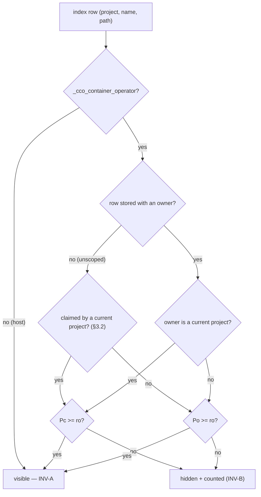

# Fix design RC-4 — owner-less index pins exempt from scoping

> **Status**: Design phase (2026-07-19), cycle 1 of the e2e v2 fix workstream.
> Input: [`../results/consolidated-review.md`](../results/consolidated-review.md) RC-4
> (findings E1-09, E2-02, E3-07, E4-03, E5-03) and decision **D-M3** (cycle-1 scope).
> Structural template: [`../fix-design/00-overview.md`](../fix-design/00-overview.md).
> **No implementation code is written in this phase** — the snippets below are marked
> design intent and exist to fix the contract, not to be pasted.
> **Gated on one maintainer ratification** — the visibility *axis* (§4 A7 / §8 Q1) is a
> model statement, not a taxonomy detail. Do not implement before it is settled.

Cycle-1 siblings: RC-1/RC-6 (mount generation), RC-2 (host-path class), RC-3 (store
writes), RC-17 (container-operator test lane). RC-4 is file-disjoint from all of them
(`lib/access-scope.sh` + `lib/cmd-resolve.sh`). It is *mostly* verifiable in the hermetic
suite; one assertion needs a seam that does not exist today (§6.5).

---

## 1. Root cause

`cco path list` renders the machine-local STATE index (logical name → host path). Every
row carries an owning project except those in the `unscoped:` bucket, which is
project-less by construction (`lib/index.sh:19`, ADR-0051 D2).

The verb **is** wired to the scope layer — it derives a scope flag and emits the
count-only notice — but the row filter carries an extra conjunct that exempts
owner-less rows. Verified against the current tree:

`lib/cmd-resolve.sh:736-740` — ad-hoc derivation of the scope decision:

```bash
            local _scope_paths=false _hide_hostpaths=false
            if _cco_container_operator; then
                [[ "$(_cco_axis_rank "$(_env_axis Po)")" -lt 1 ]] && _scope_paths=true
                [[ "${CCO_SHOW_HOST_PATHS:-true}" != "true" ]] && _hide_hostpaths=true
            fi
```

`lib/cmd-resolve.sh:745-752` — the row loop and the defective filter:

```bash
            while IFS=$'\t' read -r proj name path; do
                [[ -z "$name" ]] && continue
                [[ "$proj" == "__unscoped__" ]] && proj=""
                # Per-project label so homonyms across projects stay distinct.
                if [[ -n "$proj" ]]; then label="[$proj] $name"; else label="$name"; fi
                if [[ "$_scope_paths" == true && -n "$proj" ]]; then
                    if ! _env_is_current_project "$proj"; then hidden=$((hidden + 1)); continue; fi
                fi
```

The `&& -n "$proj"` on `:750` is the hole. It is **deliberate**, documented in the
comment at `lib/cmd-resolve.sh:730-731`:

```bash
            # _env_is_current_project (PROJECT_NAME ∪ CCO_CONFIG_TARGETS). Unscoped
            # (project-less) pins have no owner → never scoped-hidden. Host paths
```

Two distinct defects sit in that block:

**(a) The visibility rule is fail-open on the unattributable case.** An owner-less row
is precisely the row whose `Po` attribution cannot be vouched for, and it is the one
row exempted from the `Po` gate. Live evidence at `edit-project`, `Po=none` (E4-03):
seven unbracketed rows print full host paths — `ThirdPartWorks/StaiSicuro-Juri/{docs,mock,assets}`,
`Projects/Sweat/reference`, `/Users/…/Desktop/Agentic_Design_Patterns-main`,
`/Users/…/Formazione/University/slides-reference` — while the notice truthfully says
`13 path entries hidden`. Reproduced at three access levels and three projects
(E2-02 read-project/cave-auth, E4-03 edit-project/claude-orchestrator, E5-03
config-editor project mode). E3-07 supplies the cross-level proof: the `read-all`
output is byte-identical to `read-project` for these rows — the verb never consults
the layer for them, so at `read-all` the output is *accidentally* correct.

E1-09 adds the flag-off vantage: at `show_host_paths=off` the seven **logical names**
still print. `lib/cmd-resolve.sh:756-759` correctly renders names only, so **S1b is
not reopened through this verb** — but the names themselves (`project-docs`, `mock`,
`assets`, `reference`, `agentic-design-patterns`, …) are other-project identity data
that `Po=none` should not disclose. The defect is purely on the Po/ownership axis.

**(b) The decision is re-derived ad hoc, violating INV-E.** `_scope_paths` reimplements
"does this session see other projects?" (`_env_axis Po` rank ≥ 1) and the row filter
reimplements the Pc-vs-Po ownership choice with a bare `_env_is_current_project` call —
logic the shared layer already owns. ADR-0043 §4 explicitly lists `cco path list` among
the verbs that **MUST** call `_env_in_scope`; it does not. That is why the exemption
could be introduced at all: the rule lives in a call site instead of in the layer.

The same Pc-vs-Po comparison is copy-pasted **four** times today — `lib/access-scope.sh`
`project)` branch (`:526-529`), the owner-tagged `*)` branch (`:544-549`), and the two
lines above. One predicate, four spellings, one of which drifted. That is the class.

### 1.1 The un-owned bucket is not the same as un-used

A naive reading — "owner-less row ⇒ nobody's ⇒ ride `Po`" — is **wrong**, and getting it
wrong turns this confidentiality fix into a false positive of the same magnitude. The
`unscoped:` bucket is a **live resolution fallback for every project**:

`lib/index.sh:517-523` — the resolver every mount goes through:

```bash
_index_get_path() {
    if [[ "$(_index_version)" -ge 2 ]]; then
        local v; v=$(_index_pp_get "$1" "$2")
        [[ -n "$v" ]] && { printf '%s\n' "$v"; return 0; }
        _index_section_get unscoped "$2"      # ← the fallback
    else
        _index_section_get paths "$2"
    fi
}
```

and it is precisely the resolver `cco start` mount generation uses:
`lib/local-paths.sh:192` (`_effective_repo_mounts`), `:238`/`:271`
(`_effective_extra_mounts` / `_declared_unresolved_extra_mounts`, both behind
`_mount_override_get "$name" || _index_get_path "$proj" "$name"`), `:450`/`:469`
(`_project_effective_paths`, the display/proxy source).

So an **owner-less pin can be the live binding for a repo or extra_mount of the CURRENT
project**, mounted at `/workspace/<name>`, whose host path the agent already holds in
`CCO_SESSION_CONTEXT`'s `path_map` when `show_host_paths` is on. Hiding that row at
`read-project`/`edit-project` would report an in-scope, physically-present, already-
disclosed resource as out-of-scope — a false positive, and the same INV-B inversion as
RC-5 (this design's sibling root).

This is not hypothetical. It is **FI-23**, and FI-23 is the *mechanism*, not just the
volume explanation. The v1→v2 migration (`lib/index.sh:97-137`) computes its `consumed`
set purely from the `projects:` membership list:

```bash
        while IFS='=' read -r proj mem; do
            for m in $mem; do
                …
                consumed="${consumed}${m} "
```

and that list is written only by `_index_set_project_repos`, fed exclusively from
`yml_get_repo_coords` (`cmd-resolve.sh:330` and `:537`, `cmd-init.sh:391`,
`cmd-join.sh:169`, `migrate.sh:1050`). **Extra_mounts are never members.** Therefore on
any v1-migrated machine *every* legacy extra_mount — **including the current project's
own** — lands in `unscoped:`. §3.1's rule must distinguish "un-owned as stored" from
"un-owned after resolution", and §5.5 shows why the residue cannot simply be cleaned first.

**Not the root cause**: FI-23 itself stays triaged out (consolidated §7). This design does
not clean it; it makes `path list` correct in its presence (§5.5).

---

## 2. What it closes

| Finding | Session | Claim closed |
|---|---|---|
| **E1-09** | E1, read-project, `show_host_paths=off` | 7 owner-less **logical names** enumerable at `Po=none` |
| **E2-02** | E2, read-project, rich | owner-less rows disclose other projects' host paths through a sanctioned read verb |
| **E3-07** | E3, read-all | `path list` output byte-identical across levels → verb never consults the layer for these rows |
| **E4-03** | E4, edit-project | same leak at a second level + a second project; `-n "$proj"` named as the hole |
| **E5-03** | E5, config-editor project mode `(ro,rw,none)` | same leak with `CCO_CONFIG_TARGETS` ownership in play |

**Acceptance criteria (handoff §8) restored:**

- **B — "output-scoping is intact as defense-in-depth (no false negatives that would
  leak, no false positives that hide in-scope resources)"** — *both* halves. The false
  negative is removed by the `Po` rule (§3.1); the false positive that a naive version
  would introduce is removed by the **claim check** (§3.2). The resulting disclosure
  invariant is stated and testable:

  > **DISC** — in a container session, `cco path list` discloses a host path only for a
  > binding that the session's own manifest declares (mounted, or declared-and-skipped),
  > or that its access level entitles it to see anyway (`Pc`/`Po ≥ ro`). Its disclosure
  > set is a **subset** of the mount + `path_map` surface the session already has.

- **B — S1b**: unchanged. E1-09/E4-03 confirmed `lib/cmd-resolve.sh:737-739,756-759`
  already honour `show_host_paths=off`. This fix does not touch that gate; it removes
  rows *before* it, so flag-off output strictly shrinks.
- **C — hidden ≠ absent (INV-B)**: newly-hidden rows are counted in the existing
  count-only notice rather than silently dropped.
- **G — no regressions**: `read-all`/`edit-all`/host output is unchanged (§5.2).

Not claimed: RC-16/E4-02 (a binding attributed to the *wrong* project) is a different
mechanism — a mis-owned row, not an un-owned one — and stays in cycle 2.

---

## 3. The fix

### 3.1 The rule

> **An index binding's visibility follows its *effective* owner. Effective ownership is
> resolved the way the mount generator resolves it, not the way the file stores it. An
> owner that is still unattributable after resolution is treated as an *other* project:
> it rides `Po`, never `Pc`.**

Three-way, exhaustive, fail-closed on the unknown case:

| Effective owner of the row | Visible iff | Rationale |
|---|---|---|
| a **current** project (`PROJECT_NAME` ∪ `CCO_CONFIG_TARGETS`) — stored, **or claimed** per §3.2 | `Pc ≥ ro` | INV-2; the session owns it and is already mounting it |
| **another** project | `Po ≥ ro` | ADR-0046 §7 other-project visibility |
| **absent / unattributable after resolution** | `Po ≥ ro` | cannot be vouched for by `Pc`; conservatively **classified as** other-project (§4 A7) |

Two things the third row is *not*. It is **not "always hidden"** — hiding owner-less rows
at `read-all` would be the other false positive, and the regression E3-07 explicitly warns
against ("Fixing it must not regress read-all, where all rows are legitimately in scope").
And it is **not a claim that the row is worthless** — it is a *classification* decision
(§4 A7), which is exactly why §8 Q1 asks the maintainer to ratify the axis.



### 3.2 The claim check — ownership after resolution

An unscoped row `(name N, path P)` is **claimed** by a current project `C` when both hold:

1. **`C` declares `N`** — `N` appears in `C`'s `repos:` or `mounts:` in `C`'s *mounted*
   manifest; and
2. **the fallback is live for `C`** — `_index_pp_get "$C" "$N"` is empty, so
   `_index_get_path "$C" "$N"` would in fact reach the unscoped bucket.

Both conjuncts are load-bearing. Dropping (1) makes *every* unscoped row claimed by
elimination (an unscoped name is by construction usually absent from the current
project's own block) — that is the status quo ante and re-opens RC-4 in full. Dropping
(2) would show a row the project shadows with its own binding, which is not what it
resolves.

`C` ranges over `PROJECT_NAME ∪ CCO_CONFIG_TARGETS` — the same set
`_env_is_current_project` uses — so a config-editor target claims its own mounts.

Both signals are reachable in-container **under** the ADR-0047 boundary and without new
mounts:

- the manifest via `_resolve_operator_project_yml` (`lib/cmd-resolve.sh:118-130`), which
  already handles both layouts — `/workspace/project.yml` for a normal session,
  `/workspace/<target>-config/project.yml` for a config-editor target — then
  `yml_get_repo_coords` + `yml_get_mount_coords`;
- the shadow test via `_index_pp_get`, an index read `cmd_path list` already performs
  (it calls `_index_pp_dump_all` in the same loop).

**Design intent** — the claim map is computed **once**, before the row loop, never per row.
It maps a claimed *name* to its claiming project, newline-delimited `name<TAB>project`
(the same shape `_mount_override_get` already uses, `lib/local-paths.sh:211-218`, so the
lookup helper is a known pattern rather than a new one):

```bash
            # Claimed-by-current names: an unscoped pin that a CURRENT project's own
            # manifest declares AND that the project does not shadow with its own
            # binding IS that project's live mount source (_index_get_path's unscoped
            # fallback, lib/index.sh:521-523) — it is Pc, not "un-owned". FI-23 puts
            # every legacy extra_mount here, including the session's own.
            local _claimed=""            # "name<TAB>project" lines
            # for C in PROJECT_NAME ∪ CCO_CONFIG_TARGETS:
            #   yml=$(_resolve_operator_project_yml "$C") || continue
            #   for N in repo_coords(yml) ∪ mount_coords(yml):
            #     [[ -z "$(_index_pp_get "$C" "$N")" ]] \
            #       && _claimed="${_claimed}${N}"$'\t'"${C}"$'\n'
```

The claiming project is carried (rather than a bare name set) only so the *first* claimer
is deterministic when two config-editor targets declare the same name. Any claimer yields
the same verdict — every claimer is a current project, so all ride `Pc` — so the choice is
about determinism, not policy.

Note what the claim check is **not**: it is not policy migrating back into the call site
(the mistake §1(b) diagnoses). The call site answers a **data** question — *who owns this
row* — which is index- and manifest-shaped and belongs to the index-aware caller. The
layer answers the **policy** question — *is that owner in scope*. INV-E is about the
second, and it is satisfied: `_env_owner_in_scope` remains the only place the
ownership→visibility decision is spelled.

**Why this cannot widen the leak.** If a current project `C` declares `N` and resolves it
through the unscoped bucket, then `N` is mounted into `C`'s session at `/workspace/N`, is
listed in `C`'s `CCO_SESSION_CONTEXT` (repos/extra_mounts, plus `path_map` when
`show_host_paths` is on), and its host path is already in `/proc/self/mountinfo`. Showing
the row discloses nothing new — which is exactly invariant **DISC** (§2). Where that
resolution is itself wrong (another project's legacy `docs` becoming `C`'s de-facto
default) the defect is **FI-23's**, in mount generation; `path list` reporting it
truthfully is the correct behaviour, and arguably the fastest way FI-23 gets noticed.

### 3.3 Where the policy lives — one predicate in the layer

**`lib/access-scope.sh`** gains `_env_owner_in_scope <owner>`: the single source for the
ownership→visibility decision, replacing all four spellings. Design intent:

```bash
# _env_owner_in_scope <owner> → 0 visible / 1 hidden. The SINGLE ownership→visibility
# rule (ADR-0046 §7): a CURRENT owner rides Pc, ANY other owner rides Po, and an
# EMPTY/unattributable owner is conservatively CLASSIFIED as `other` — it can never be
# vouched for by Pc, but it is legitimately visible once the session may see other
# projects at all (Po ≥ ro). Callers resolve effective ownership BEFORE calling (the
# unscoped-bucket claim check, cmd-resolve.sh); this decides policy, not attribution.
# Caller must already have passed the INV-A host check.
_env_owner_in_scope() {
    local owner="$1" g pc po
    read -r g pc po <<< "$(_env_triple)"
    if [[ -n "$owner" ]] && _env_is_current_project "$owner"; then
        [[ "$(_cco_axis_rank "$pc")" -ge 1 ]] && return 0
    fi
    [[ "$(_cco_axis_rank "$po")" -ge 1 ]] && return 0
    return 1
}
```

Three call sites converge on it:

1. **`_env_in_scope` `project)` branch** → `_env_owner_in_scope "$name"`.
   *Behaviour-preserving*: today's branch is that predicate inlined, and even for an
   empty `$name` both spellings fall through to the `Po` test (`_env_is_current_project ""`
   already returns 1 — `lib/access-scope.sh:476`).
2. **`_env_in_scope` `*)` owner-tagged fallback** → keeps its `[[ -n "$owner" ]]` guard,
   then delegates. *Behaviour-preserving*: a genuinely **unknown kind with no owner**
   stays default-deny. This is the deliberate line between "close the class" and "widen
   blast radius silently" — the new permissiveness is opted into by naming a kind, never
   inherited by a future kind that forgets to.
3. **New `path)` branch** → `_env_owner_in_scope "$owner"` **without** the non-empty
   guard. This one line *is* the reversal, and it is explicit and greppable.

Plus `_env_scope_class`: add `path` to the `project` class. It already lands there via
the default-deny fallback, but the taxonomy is a documented single source (ADR-0043 §1)
and should state it rather than rely on a default.

### 3.4 The call site — delete the local policy, resolve the owner

**`lib/cmd-resolve.sh`** `cmd_path` `list)`:

- delete `_scope_paths` and its derivation (`:736-740` keeps only the
  `_hide_hostpaths` line);
- compute the `_claimed` map once (§3.2), operator-only;
- replace the `:750-752` filter with one layer call over the **effective** owner. Design
  intent:

```bash
                # Effective owner: the stored one, or — for an unscoped row a CURRENT
                # project actually resolves through (§3.2) — that project. Visibility
                # then follows the owner via the shared layer (ADR-0043 §4, INV-E):
                # current → Pc, other → Po, still-unattributable → Po (fail-closed).
                # INV-A is handled inside; no local operator/axis re-derivation.
                local _owner="$proj"
                # _claim_lookup: first "$name<TAB>P" line in $_claimed → P, else empty.
                [[ -z "$_owner" ]] && _owner=$(_claim_lookup "$name" "$_claimed")
                if ! _env_in_scope path "$name" "$_owner"; then
                    hidden=$((hidden + 1)); continue
                fi
```

Everything downstream is untouched: the `show_host_paths` gate (`:756-759`), the
`⚠ malformed` flag, the empty-index message, and the notice. The label is **not**
changed: a claimed row still prints bare (`name`, not `[proj] name`) — it *is* stored
un-owned, and the bracket means "stored under this project". Re-labelling it would
misreport the index. §7.3 adds one sentence to the CLI reference so the bare form is not
read as "belongs to nothing".

### 3.5 The notice — reused, and one MUST deliberately unmet

The existing dedicated notice at `lib/cmd-resolve.sh:778-784` stays, and its `hidden`
counter now includes unclaimed owner-less rows automatically (they take the same
`continue`). Its wording remains correct: every hidden row — other-project or
unattributable — now needs `Po ≥ ro`, and the string already says *"start a read-all
session or run cco on your host to see everything"*.

**Why not route through `_env_note_hidden`/`_env_flush_hidden_notice`?** Because that
notice hardcodes a per-kind widening hint — *"start a read-global session (read-all to
also see other projects)"* (`lib/access-scope.sh:584`) — which is **wrong for path
rows**: under the ratified axis, `read-global` never reveals one. Unifying would require
parameterising the widening hint per kind, a refactor with a blast radius across all five
wired listers. That is a cycle-2 candidate (§8 Q2), not smuggled into a confidentiality fix.

**Recorded deviation.** ADR-0043 §4 mandates **three** things of a wired read verb — *call
`_env_in_scope` while iterating, `_env_note_hidden` on skip, `_env_flush_hidden_notice` at
the end*. This fix satisfies the **first** clause and deliberately leaves the other two
unmet, substituting the verb's own equivalent counter + notice. That is a **known
deviation**, not an oversight; it is stated as such in the §7.1 annotation and carried in
§8 Q2 until the hint refactor lands. Nothing in this design may be described as "making
ADR-0043 §4 true".

---

## 4. Alternatives rejected

| # | Alternative | Why rejected |
|---|---|---|
| **A1** | **Drop `&& -n "$proj"` only** (one-token patch) | Fixes the symptom, leaves the ad-hoc `_scope_paths` derivation and the 4-way duplicated predicate — the *class* — untouched, and leaves ADR-0043 §4 still unsatisfied. Worse, **it is the false positive of §1.1**: with no claim check it hides the current project's own FI-23-migrated mounts. It also over-hides by luck rather than by rule — with `_scope_paths` gated on `Po<ro`, dropping the conjunct happens to give the right read-all answer. Nothing prevents the next drift. |
| **A2** | **Hide owner-less rows unconditionally** (pure default-deny) | A false positive at `read-all`/`edit-all`/config-editor `--all`, where nothing *can* legitimately be hidden. Directly regresses E3-07's stated constraint and criterion B. Would also make an owner-less pin permanently invisible to its own operator. |
| **A3** | **Loosen `_env_in_scope`'s `*)` fallback** to treat empty owner as `Po` | Cheaper (no new kind) but widens the fallback for *every* future kind that forgets to register — the exact "widening blast radius silently" the design constraints forbid. The `*)` branch is a default-deny net; it must stay one. |
| **A4** | **Fix at the index layer** — have `_index_pp_dump_all` attribute unscoped rows to a synthetic owner, or filter them out | Violates INV-D (the index stays the complete internal map; scoping is presentation-only) and would break resolution: `_index_get_path` (`lib/index.sh:519-523`) *depends* on the unscoped bucket as a fallback. Confidentiality is enforced by the ADR-0047 boundary, not by mutating the map. |
| **A5** | **Clean the residue instead** (fix FI-23, so no owner-less rows exist) | Data hygiene is not a scoping rule. FI-23 is triaged out (consolidated §7), an unscoped pin is a *supported* `cco path set` outcome (`lib/cmd-resolve.sh:706`), and a fix that only works when the index is tidy is not a fix. §5.5 shows the fix — **with** the §3.2 claim check — is genuinely residue-independent; without it, A5's own objection would apply to this design, inverted. |
| **A6** | **Also unify the notice into `_env_flush_hidden_notice`** | Correct direction, wrong cycle — see §3.5. It changes the wording contract of five other verbs' notices; doing it inside a confidentiality fix couples an assertable security change to a cosmetic one. Tracked as a deviation, not silence. |
| **A7** | **Ride the `G` axis instead of `Po`** — "a machine-level, project-less pin is global-shaped, so unattributable ⇒ `G ≥ ro`" | **The real competing model** — see below. Rejected, but it is the maintainer's call (§8 Q1). |

### 4.1 A7 in full — the axis is the decision

A1–A6 all argue about *where* the rule lives or whether to hide unconditionally. A7 is the
only alternative about **which axis** an unattributable row rides, and it is the one that
actually decides outcomes. It closes E1-09, E2-02, E3-07 and E4-03 **identically** — both
`read-project` `(none,ro,none)` and `edit-project` `(none,rw,none)` have `G=none`
(`lib/access-scope.sh:90,93`). The two rules differ in exactly three places:

| Session | `Po` rule (chosen) | `G` rule (A7) |
|---|---|---|
| `read-global` `(ro,ro,none)` / `edit-global` `(rw,rw,none)` | hidden | **visible** |
| config-editor project mode `(ro,rw,none)` — **E5-03** | hidden → **closes** | **visible → E5-03 does NOT close** |
| case 6 `(none,rw,rw)` "edit every project, not the store" | **visible** | hidden |

Three reasons to reject A7, in decreasing weight:

1. **A7 breaks the ADR-0043 §1 "SOLE difference" invariant; the `Po` rule preserves it.**
   The layer header and the shipped managed rule both state: *"read-global ≠ read-all: the
   SOLE difference is other-project visibility"* (`lib/access-scope.sh:21-22`). The
   objection that riding `Po` "silently narrows" that decision reads the invariant
   backwards. After the §3.2 claim check, an unattributable row is by construction **not**
   the current session's — so its live population is other-project data (FI-23 residue:
   the E1/E2/E4 evidence rows are literally other projects' mount paths). Under A7 a
   `read-global` session would print other projects' logical names and host paths —
   *violating* the sole-difference invariant in the permissive direction, which is the
   expensive direction. Under the `Po` rule the invariant stays true **by construction**:
   the rule *is* the statement "unattributable ⇒ classified as other-project", and
   `read-global`-vs-`read-all` continues to differ only in other-project visibility.
2. **A7 is incoherent at case 6.** `(none,rw,rw)` is the granular intent "edit every
   project but not the store". Under A7 such a session sees every project's own bindings
   (`Po=rw`) yet hides the residue *of those same projects* (`G=none`) — hiding a strict
   subset of what it is already entitled to. The `Po` rule has no such discontinuity.
3. **Fail-closed picks the stricter axis under genuine ambiguity.** The row cannot
   distinguish "other project's residue" (a) from "operator's own project-less pin" (b).
   Mis-handling (a) is a confidentiality leak; mis-handling (b) is a convenience loss on a
   pin no agent can create in-session (`path set` is host-refused — confirmed live in
   E2-02) and that the INV-B notice tells the agent how to reach. `Po ≤ Pc` holds by
   invariant and `Po ≤ G` for every preset, so `Po` is the stricter choice everywhere the
   two differ except case 6, where reason 2 already settles it.

**Cost accepted, explicitly**: a `read-global`/`edit-global` session never sees an
operator's genuine project-less pin, even though `G=ro|rw`. That is the price of
classifying the unattributable as other-project, and it is why §8 Q1 asks for ratification
rather than assuming one.

---

## 5. Blast radius

### 5.1 Touched surface

| File | Change | Kind |
|---|---|---|
| `lib/access-scope.sh` | new `_env_owner_in_scope`; `project)` + `*)` rewired to it; new `path)` branch; `path` added to `_env_scope_class` | 1 new behaviour + 2 provably-equivalent refactors |
| `lib/cmd-resolve.sh` | `cmd_path list)`: drop `_scope_paths`, build the claim set (§3.2), call `_env_in_scope path` | behaviour |

No other consumer. `_env_in_scope` has **10** call sites (`cmd-project-query.sh:30`,
`cmd-project-validate.sh:288`, `cmd-project-coords.sh:51`, `cmd-pack.sh:116,381`,
`cmd-llms.sh:263,299,756,771`, `tags.sh:411`) — **none** passes `path` as a kind, and
none passes a kind that reaches the `*)` branch: nine pass a literal
`project|pack|llms`, and `tags.sh:411` passes `$rk` drawn from the unified-index kind
stream (`project|pack|llms|template|remote`, with `builtin` short-circuited above it
and empty `$rk` skipped at `:401`). So the refactor of `project)`/`*)` is
observationally inert for every existing caller — and that inertness is pinned by
existing coverage, not by inspection alone (§6.4).

### 5.2 What could regress, and why it does not

- **`read-all` / `edit-all` / config-editor `--all` (`Po=ro|rw`)** — every row, owned,
  claimed or neither, satisfies `Po ≥ ro` → identical output, no notice. This is the
  E3-07 constraint, and it is pinned by a test (§6.2).
- **Host (`INV-A`)** — `_env_in_scope` returns 0 before touching the triple, and the claim
  set is computed operator-only. The `_scope_paths` guard it replaces was likewise
  operator-only. No host behaviour change, and no manifest read on the host.
- **The current project's own FI-23-migrated mounts** — claimed (§3.2) → `Pc` → **still
  visible** at `read-project`/`edit-project`. This is the regression A1 would have
  shipped; it is pinned by a test (§6.3).
- **Resolution / mounting** — untouched. INV-D holds: `_index_get_path`'s unscoped
  fallback and `cco start` mount generation never consult the display filter. A repo
  mounted via an unscoped pin still mounts; the fix only decides whether its *row* prints.
- **`malformed` counter** — increments only for rows that survive the filter, so a
  newly-hidden malformed row is no longer advertised. Correct and desirable: the count
  would otherwise be a weak oracle on the hidden set, and the agent cannot remediate
  another project's binding anyway. (A *claimed* malformed row stays visible and stays
  counted — it is the session's own broken binding, which it should see.)
- **Empty-index message** — `[[ $count -eq 0 && $hidden -eq 0 ]]` (`:773`) already
  distinguishes "empty" from "all hidden"; a session where every row is now hidden gets
  the notice, not a false "the path index is empty".
- **Project-less sessions** (config-editor global mode, `(rw,none,none)`) — `Pc=none`,
  `Po=none`, and no manifest to claim with → *all* rows hidden + notice. Correct per
  ADR-0046 §7 and ADR-0048: such a session has no project referent. Newly-hidden vs
  today, and honest. Unverified live (§8 Q4).
- **Operator's genuine project-less pin** — invisible below `read-all` at any `G`. The
  accepted cost of A7's rejection (§4.1); no agent can create one in-session, and the
  notice states the widening.

### 5.3 bash 3.2 notes

- `_env_owner_in_scope` uses only `local`, `read -r … <<<`, `[[ ]]` and `printf` — the
  same constructs already in `lib/access-scope.sh` (`_env_axis:417`, `_env_read_scope:429`).
  No associative arrays, no `local -n`, no `${var@Q}`.
- The claim map is a **newline-delimited string**, not an array — no `set -u` empty-array
  guard needed. Its lookup must iterate with `while IFS=$'\t' read` over a here-string
  (the `_mount_override_get` pattern, `lib/local-paths.sh:211-218`), never `for x in
  $_claimed`, which would word-split and glob-expand a name like `*`.
- **stdin discipline**: `_env_in_scope` is called inside a `while IFS=$'\t' read` loop fed
  by a process substitution. Neither it nor `_env_owner_in_scope`/`_env_triple`/
  `_env_is_current_project` reads stdin, so the row stream is not consumed. The claim-set
  builder has its own `while read` loops over `yml_get_*_coords` — these **must** be built
  *before* the row loop (as specified in §3.4), never inside it, or they will eat the row
  stream. This is the one genuinely new stdin hazard the design introduces; it is called
  out here and pinned by the multi-row assertions in §6.2.
- **Cost**: `_env_in_scope` forks a command substitution per row (`$(_env_triple)`), where
  the old code hoisted `_env_axis Po` once. The claim set adds one manifest parse per
  *current* project (typically one, at most `|CCO_CONFIG_TARGETS|+1`), hoisted out of the
  loop. For an index of tens of rows this is negligible and buys INV-E; do not
  micro-optimise by re-hoisting *policy* into the call site — that is how this defect was
  born.

### 5.4 Ordering constraint with the cycle-1 siblings

RC-6 (config-editor target repos never mounted) changes which project name mount
generation resolves under. The claim check reads the same manifests but derives its
project set from `PROJECT_NAME ∪ CCO_CONFIG_TARGETS` via `_resolve_operator_project_yml`,
which is already target-aware (layout 2) — so RC-4 is correct before or after RC-6, and
RC-6's fix can only *increase* the set of correctly-claimed rows. No ordering dependency;
noted so the re-review does not read a changed E5 row count as an RC-4 regression.

### 5.5 Independence from FI-23 — the honest version

The earlier draft of this section asserted that cleaning FI-23 would leave
`read-project`/`edit-project` output "identical either way". That is **false**, and the
cleanup behaviour it assumed is also not what the code does. Verified:

- **`cco resolve` does not clean live residue.** `_resolve_entry_index`
  (`lib/local-paths.sh:373-379`) starts with
  `existing=$(_index_get_path "$proj" "$name")` — which *includes* the unscoped fallback —
  and returns early when the path exists. A legacy extra_mount resolving fine through
  `unscoped:` is therefore never re-homed. (The FI-23 backlog note's "self-healing —
  `cco resolve` re-binds per project" is inaccurate on this point and should be corrected
  when FI-23 is picked up.)
- **`cco resolve --scan` re-homes host repos only, and duplicates rather than moves.**
  Pass 1 binds the repo dir hosting each `project.yml` (`lib/cmd-resolve.sh:545-551`); its
  conflict guard `_index_pp_conflicts` uses `_index_pp_get` (**no** unscoped fallback), so
  an unscoped-bound host repo is seen as unbound and a `project_paths` entry is written —
  while the `unscoped:` row stays. Pass 2 (`:561-573`) iterates
  `_index_get_project_repos` (repos only) and skips any name where `_index_get_path`
  already answers — which the unscoped fallback satisfies. **Extra_mounts are re-homed by
  neither pass.**

So the residue mostly persists, and where cleanup does act it *adds* a row. The correct
independence claim is therefore about **resources, not rows** — and it holds only because
of the §3.2 claim check:

| | residue persists | host repo re-homed by `--scan` |
|---|---|---|
| the resource | visible, bare label `name` (claimed → `Pc`) | visible, bracketed `[proj] name` (stored → `Pc`) |
| the now-redundant unscoped duplicate | n/a | shadowed (`_index_pp_get` hits) → unclaimed → hidden + counted |

**The set of resources the agent can see is identical either way; only the label changes,
plus one extra hidden-count for the duplicate.** That is the property A5 demands — a fix
that works whether or not the index is tidy — and it is exactly what a claim-check-less
version (A1) would not have. The fix neither depends on FI-23's cleanup nor is invalidated
by it, and it does not pre-empt FI-23's own (deferred) decision.

---

## 6. Test plan

Every assertion below is stated with its **status on today's code**, so a test that
already passes is not mistaken for a discriminator.

### 6.1 Fixture gap (why today's tests pass)

`tests/test_operator_shim.sh:47-73` (`_op_seed`) seeds **only owned** bindings —
`_index_set_path alpha alpha …` and `_index_set_path beta beta …`. It never calls
`_index_set_unscoped`. The three existing `path list` tests (`:553-591`) therefore
exercise only the owned path, which already works, and pass identically before and
after the fix. **The fixture, not the assertions, is the reason RC-4 shipped green.**

**Change**: `_op_seed` additionally seeds one owner-less pin,
`_index_set_unscoped orphan "$tmp/repos/orphan"`. Unconditional (not behind an opt-in
var) so the *existing* tests become representative of the real index shape. Verified
compatible: `test_operator_path_list_full_at_read_all` asserts no notice at read-all —
still true; `test_operator_path_list_scoped_at_read_project` asserts `OP_OUT != *"beta"*`
— the literal `orphan` collides with nothing.

Note `_op_seed` plants **no** `/workspace/project.yml` for its fake project `alpha`, and
`_resolve_operator_current_yml` (`lib/cmd-resolve.sh:100-115`) hardcodes `/workspace`. In
the shim lane the claim set is therefore always empty — deterministic on the host (no
`/workspace`) and in-container alike (`/workspace/project.yml` names
`claude-orchestrator`, never `alpha`). That makes §6.2 a clean test of the **unclaimed**
half and leaves the **claimed** half to §6.3/§6.5.

### 6.2 `tests/test_operator_shim.sh` — the defect, end to end (unclaimed rows)

| Test | Assertion | Today |
|---|---|---|
| `test_operator_path_list_hides_owner_less_below_read_all` | `_op_seed read-project alpha path list` → `"$OP_OUT" != *"orphan"*` | **FAILS** — the row prints unbracketed (E2-02) |
| ″ | `"$OP_OUT" == *"hidden by access scope"*` and the notice points to `read-all` | passes (guard: INV-B still fires, hint unchanged) |
| ″ | `"$OP_OUT" == *"alpha"*` in the same run | passes — **stdin guard** (§5.3): the claim-set loops must not consume the row stream, so a *later* owned row must survive |
| `test_operator_path_list_owner_less_hidden_at_edit_project` | `_op_seed edit-project alpha path list` → `"$OP_OUT" != *"orphan"*` | **FAILS** — E4-03, `Po=none` at an edit level |
| `test_operator_path_list_owner_less_hidden_at_read_global` | `_op_seed read-global alpha path list` → `"$OP_OUT" != *"orphan"*` | **FAILS** — the **A7 axis pin**: this is the one shim assertion a `G`-axis implementation would not satisfy |
| `test_operator_path_list_owner_less_hidden_for_config_editor_target` | `OP_TARGETS=alpha _op_seed edit-project config-editor path list` → `"$OP_OUT" == *"alpha"*` **and** `"$OP_OUT" != *"orphan"*` | first passes (target = current, Pc) · second **FAILS** — E5-03 |
| `test_operator_path_list_owner_less_masked_at_shp_off` | `OP_SHP=false _op_seed read-project alpha path list` → `"$OP_OUT" != *"orphan"*` | **FAILS** — E1-09: at flag-off the logical *name* still leaks |
| `test_operator_path_list_owner_less_visible_at_read_all` | `_op_seed read-all alpha path list` → `"$OP_OUT" == *"orphan"*` and no notice | passes — **no-regression guard** for E3-07 / criterion B's false-positive clause; the assertion that fails if someone implements A2 |

### 6.3 `tests/test_access_scope.sh` — the layer contract

| Test | Assertion | Today |
|---|---|---|
| `test_as_path_kind_owner_attribution` | `_as_triple "ro ro ro"` → `_env_in_scope path orphan ""` **visible** | **FAILS** — unknown kind hits `*)`, empty owner → `return 1` |
| ″ | `_as_triple "none ro none"`, `PROJECT_NAME=alpha` → `_env_in_scope path orphan ""` hidden; `… path r alpha` visible; `… path r beta` hidden | passes (guards — they pin that the fix does not invert the owned cases) |
| `test_as_path_unattributable_rides_po_not_g` | **empty owner** across triples: `(ro,ro,none)` read-global → hidden · `(rw,rw,none)` edit-global → hidden · `(none,rw,rw)` case 6 → **visible** · `(ro,ro,ro)` → visible | case 6 and `(ro,ro,ro)` **FAIL** — the **A7 axis pin at the layer**. A `G`-axis implementation inverts all four |
| `test_as_owner_in_scope_is_single_source` | `_env_owner_in_scope ""` ≡ (`Po ≥ ro`) **and** `_env_in_scope path X ""` ≡ `_env_owner_in_scope ""` across `(none,ro,none)`, `(ro,ro,none)`, `(none,rw,rw)`, `(ro,ro,ro)` | **FAILS** on the `(none,rw,rw)` and `(ro,ro,ro)` legs — the equivalence is asserted on the **empty**-owner leg precisely because the non-empty leg is *already* identical today (`project)` and `*)` run the same Pc-else-Po logic, `lib/access-scope.sh:526-529` vs `:544-549`), so a non-empty equivalence would pass the moment the helper is *defined*, even if never wired. This form fails until `path)` actually delegates |
| `test_as_scope_class_taxonomy` (extend) | `_env_scope_class path` == `project` | passes (default) — documentation pin only, flagged as such |
| `test_as_unknown_kind_stays_default_deny` | `_env_in_scope bogus x ""` hidden at `(ro,ro,ro)` | passes — **guard against A3**: proves the `*)` net was not loosened, and that `path)`'s new permissiveness was not inherited by unregistered kinds |

### 6.4 What the `project)`/`*)` refactor already rests on

§5.1's "provably-equivalent" claim is not inspection-only. Existing coverage pins it:
`tests/test_access_scope.sh:64-65` (project alpha/beta at read-project), `:107-111`
(read-global vs read-all, the sole-difference pin), `:122-136` (config-editor targets,
including kind `tag` with owners alpha/beta under `CCO_CONFIG_TARGETS` — the `*)` branch),
`:291-293` (case 6 axis independence). Any behaviour change in either branch breaks one of
these.

### 6.5 The claimed-row assertion needs a seam

The one thing §6.2/§6.3 cannot cover is the §3.2 **positive** case — an unscoped row that
the current project's manifest claims must stay **visible** at `read-project`. It depends
on a mounted manifest at a hardcoded `/workspace` path, which the hermetic suite cannot
plant. Three ways to close it, in preference order:

1. **Unit-test the claim helper directly** (preferred, keeps RC-4 hermetic): factor the
   claim-set builder to take a manifest path (or an injectable resolver) rather than
   calling `_resolve_operator_project_yml` internally, and assert in
   `tests/test_access_scope.sh` (or a new `test_path_claim.sh`) that a name declared under
   `mounts:` with no `project_paths` entry is claimed, that a shadowed name is not, and
   that an undeclared name is not. The seam is small and is the natural shape anyway
   (§3.2's builder already takes the project set as input).
2. **Parameterise the workspace root** — honour `CCO_WORKSPACE_ROOT` (default `/workspace`)
   in `_resolve_operator_current_yml`. Broader value for the whole operator lane, broader
   blast radius; a cycle-2 candidate, not a prerequisite here.
3. **The RC-17 container-operator lane**, if it lands with a real session fixture.

Until (1) lands, the claimed-row behaviour is verified **only** by the live re-run (§6.6)
on a project that has extra_mounts — E5 (`cave-auth`) or a `StaiSicuro-Juri` session.
**`claude-orchestrator` will not exercise it**: its `project.yml` declares no `mounts:`,
which is exactly why E4-03's seven rows were all other-project residue and the false
positive stayed latent through the whole e2e run. Say so in the re-review brief, or the
"no change at E4" result will be misread as coverage.

### 6.6 Suite / lane

- Baseline is **1311/9** (consolidated §6.1); RC-4 adds ~9 tests and must not move the 9.
- RC-4 needs no container-operator lane for the *scoping* assertions: `path list` is index
  + env only — no mounts, no host-path resolution, no privileged write, and `_op_seed`
  reproduces operator mode faithfully (`CCO_CONTAINER_OPERATOR=1`, real `_index_*`
  writers). It is **not** the full oracle any more, though: §6.5 is the gap, so the
  consolidated §5 edge `T → P` is advisory-plus-one-caveat for this root rather than
  cleanly advisory.
- `cco build` is still required before the E1/E2/E3 re-run (consolidated §6.2): store
  verbs trampoline into the image-baked `cco`, so the fix is invisible in-session until
  the image is rebuilt.
- Targeted re-review: **E1 (flag-off), E2, E3, E4, E5** re-run `cco path list` and diff
  against the recorded outputs. Expected: the unbracketed *unclaimed* rows gone at
  E1/E2/E4/E5, count folded into the notice; **E3 (`read-all`) byte-identical to its
  cycle-0 output** — that identity is the no-regression oracle; and in a session whose
  project declares `mounts:`, its **own** bare rows still present (the §3.2 oracle).

---

## 7. Docs / ADR consequences

Per `.claude/rules/documentation-lifecycle.md`: ADRs are history → forward-annotate;
living docs → rewrite to truth.

**7.1 ADR-0043 — forward annotation (history, do not rewrite).** Two precisions worth
recording. First, the reversed decision is documented **only in the code comment**
(`lib/cmd-resolve.sh:730-731`); ADR-0043 §1's taxonomy table has no row for index
bindings, so it never stated a rule for the unattributable case — the annotation
**completes** §1. Second, §4's three-clause mandate is **partly** met and the annotation
must say so; claiming otherwise would write a false statement into an immutable record.
Draft, to sit under the §1 table beside the existing ADR-0046 annotation:

> **Completed in part (2026-07-19) by the e2e v2 fix workstream (RC-4).** The taxonomy
> above covers the five *resource kinds*; it said nothing about the **path index**, whose
> rows are `(owner-project, name, host-path)` bindings rather than kind instances. `cco
> path list` consequently carried its own inline rule and exempted **owner-less**
> (`unscoped:`, ADR-0051 D2) rows from scoping entirely — a false negative that disclosed
> other projects' names and host paths at `Po=none` (findings E1-09, E2-02, E3-07, E4-03,
> E5-03). The taxonomy now includes a **`path` kind, `project` class**, whose visibility
> follows the row's **effective** owner through the single layer predicate: a **current**
> owner rides `Pc`, **any other** owner rides `Po`, and an **absent/unattributable** owner
> is conservatively *classified as* other — it rides `Po` too, never `Pc`. Effective
> ownership is resolved as the mount generator resolves it: an unscoped row that a current
> project's own manifest declares and does not shadow is that project's live binding
> (`_index_get_path`'s unscoped fallback) and stays `Pc`-visible, so the fix hides no
> resource the session is already mounting. Fail-closed below `read-all`, unchanged at
> `read-all`/`edit-all` and on the host (INV-A), and counted in the count-only notice
> (INV-B).
>
> **Known deviation from §4.** §4 requires a wired read verb to call `_env_in_scope`,
> `_env_note_hidden` on skip, and `_env_flush_hidden_notice` at the end. RC-4 satisfies the
> **first** clause only: `cco path list` keeps its own hidden counter and notice, because
> the shared notice hardcodes a `read-global`-first widening hint that is wrong for path
> rows (`read-global` never reveals one under this rule). Folding `path` into the shared
> counters requires parameterising the widening hint per kind across all five wired
> listers; that refactor is deferred, and until it lands the §4 notice clauses remain
> deliberately unmet for this verb.

**7.2 ADR-0051 — forward annotation** on the `unscoped:` bucket (`:136`): its
**resolution** semantics are unchanged (INV-D — still a live fallback in
`_index_get_path`); its **display visibility** in `cco path list` now rides `Po`, *except*
where a current project actually resolves through it, in which case it is displayed as
that project's binding (`Pc`) while remaining stored project-less. Note that this makes
`path list` the first consumer to depend on the fallback being observable, which is
relevant if FI-23 is ever fixed by narrowing it.

**7.3 Living docs** (rewrite at the phase that makes it true):

- `docs/users/reference/cli.md:1171` — the `cco path list` paragraph describes the
  `[project]` labelling and the malformed flag; add that in a container session rows are
  scoped by owner, that un-owned rows need `read-all`, and that a **bare** (unbracketed)
  row may still be one of *this* project's own bindings resolved through the project-less
  bucket — the bracket means "stored under a project", not "in use by one".
- `defaults/managed/.claude/rules/cco-config-interaction.md:21` already lists
  `cco path list` among the output-scoped read verbs — **no edit needed**; the fix makes
  the existing sentence true. (Note it explicitly so the cycle-1 doc sweep does not
  "fix" a line that is already correct — this rule is baked into the image and any edit
  costs a `cco build`.)
- `docs/maintainers/cli/design/design-cli-environment-awareness.md` — if its verb
  inventory tabulates output-scoping status per verb, flip `path list` to wired, with the
  §7.1 notice deviation noted rather than a bare ✅.
- The `lib/access-scope.sh` header comment (`:17-22`) enumerates the scope classes;
  add `path` to the `project` class line, and keep the "SOLE difference" sentence — §4.1
  reason 1 is the argument that it stays true.
- `docs/maintainers/roadmap-backlog.md` FI-23 — correct the "self-healing (`cco resolve`
  re-binds per project)" claim per §5.5; it is not what `_resolve_entry_index` does. A
  one-line correction, not a re-triage.

**7.4 Migration: NONE.** No on-disk format changes. INV-D is preserved: the index
schema (`project_paths:` v2 + `unscoped:`) and every writer are untouched, so no
`migrations/{global,project,pack,template}/` script and no `schema_version` bump.

**7.5 Changelog: one entry**, per `.claude/rules/update-system.md`. It is a
user-visible behaviour change to a shipped CLI verb, not a new field, so it belongs in
the cycle-1 sweep entry rather than its own. Draft body: *"In a container session
`cco path list` now scopes **every** row by its owning project. Bindings stored under no
project (the `unscoped:` bucket) were previously always shown — including their host paths
— regardless of access level. They now require a `read-all` session, like any other
project you do not own, and are counted in the existing hidden notice — unless the current
project actually resolves one of them (a name it declares and does not otherwise bind), in
which case it stays visible, because it is one of this session's own mounts. Nothing
changes on the host, at `read-all`/`edit-all`, or for path *resolution* — only what the
verb displays. Requires `cco build`."*

---

## 8. Open questions for the maintainer

1. **Ratify the axis — this is the decision, and it is yours.** §3.1's third row makes an
   unattributable binding ride **`Po`**, not `G`. That is a *model* statement ("un-owned
   index data is classified as other-project data"), not a taxonomy completion, and it is
   what decides `read-global`/`edit-global` and **E5-03** (config-editor project mode
   `(ro,rw,none)`): under `Po` E5-03 closes, under `G` it does not. §4.1 argues `Po` on
   three grounds — it keeps ADR-0043 §1's "SOLE difference" invariant true by construction
   (a `G` rule would leak other-project paths into `read-global`), it avoids A7's case-6
   incoherence, and it is the stricter axis under genuine ambiguity. The accepted cost is
   that a `read-global` session never sees an operator's genuine project-less pin.
   **Two sub-questions**: (a) is `Po` ratified? (b) if yes, does "un-owned data is
   classified as other-project" warrant its **own short ADR** rather than the §7.1
   annotation to ADR-0043? I lean *annotation* — it applies ADR-0046 §7's per-axis rules
   unchanged and adds a taxonomy row — but a model statement that decides a level's
   visibility is arguably ADR-shaped, and I should not settle that unilaterally.
   **Implementation is blocked on (a).**

2. **Notice unification — cycle 2, or accepted indefinitely?** §3.5 keeps `path list`'s
   dedicated notice because the shared one hardcodes a `read-global`-first widening hint
   that is wrong for path rows, and §7.1 records that as a **known deviation** from
   ADR-0043 §4 (1 of 3 clauses met). The clean fix parameterises the hint per kind in
   `_env_flush_hidden_notice` and folds `path` into the shared counters — touching five
   listers' stderr wording. Cycle-2 item, or is per-verb notice divergence acceptable
   permanently? (If permanently, §7.1's deviation paragraph should say "accepted", not
   "deferred".)

3. **The claim-check seam (§6.5).** The §3.2 positive case is not reachable from the
   hermetic shim fixture. Option 1 (factor the claim-set builder to take a manifest path
   and unit-test it) keeps RC-4 self-verifying for ~20 extra lines of test; option 2
   (`CCO_WORKSPACE_ROOT`) is more useful long-term but is its own change; option 3 waits
   on RC-17. Which? Without one of them, the anti-false-positive half of criterion B is
   verified only by a live E5/`StaiSicuro-Juri` re-run.

4. **`_op_seed` fixture change — unconditional or opt-in?** §6.1 proposes seeding the
   owner-less pin unconditionally, which strengthens three existing tests but changes a
   shared fixture used by ~40 operator-shim tests. I verified no existing assertion
   breaks, but if you prefer fixture stability I can gate it behind an `OP_ORPHAN` var
   at the cost of the existing tests staying unrepresentative.

5. **Project-less sessions (config-editor global mode) now see an empty `path list`.**
   §5.2 argues that is honest (`Pc=none, Po=none`, no manifest to claim with → no project
   referent). E6A did not report on this verb, so it is unverified live. Confirm you want
   the honest-empty output + notice rather than a special case for the authoring tool.
</content>
</invoke>
