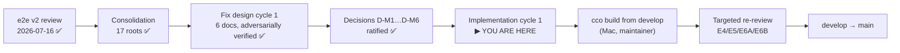

# Implementation Handoff — e2e v2 fix workstream (cycle 1)

> **Status**: design phase COMPLETE and ratified (2026-07-19). Implementation NOT started.
> This handoff exists so a fresh session can prepare and execute the implementation workflow
> without re-deriving anything.
>
> **Branch**: `fix/config-access/e2e-v2-cycle1` (from `develop`, 3 commits, docs only).
> **Suite baseline**: **1311 passed / 9 failed** in-container — the 9 are the pre-existing
> FI-19 boundary artifacts, NOT regressions. Any implementation must hold this line.
> **Runner**: `./bin/test` (`--file <name>` for one file). Running `bash tests/<file>.sh`
> directly is a **FALSE GREEN** — test files are function libraries sourced by `bin/test`.

## 0. Where you are — ▶ implementation workflow RUNNING (cycle 1)

> **Update 2026-07-19**: §6 steps 1–3 are DONE. State confirmed (4 docs-only commits,
> `2950993`→`b97e659`), baseline re-measured in-container at **1311/9**, and the remaining
> open questions were put to the maintainer and ratified as **D-M7…D-M10** (§2). The
> implementation workflow is built along §3's stages. Everything below is unchanged.

The e2e v2 acceptance review ran 2026-07-16 (7 sessions). It has been consolidated
(verdict **NOT ACCEPTED**, 17 root causes), the six release-blocking roots have ADR-grounded
fix designs that survived adversarial review, and all six maintainer decisions are ratified.
Nothing has been implemented. The next action is to build and run the implementation workflow.

## 1. Read these first (canonical, in this order)

1. [`../results/consolidated-review.md`](../results/consolidated-review.md) — the acceptance
   verdict per §8 criterion, the 17-root map, and **all six ratified decisions D-M1…D-M6**.
2. [`00-overview.md`](00-overview.md) — the cycle-1 index: cross-cutting conventions (the
   three-state vocabulary, the 0/1/2 exit-code convention), the ordering with its seams, the
   verification gates, and the 16 open questions (§9 — the three blocking ones are RESOLVED).
3. The six design docs, each self-contained (root cause with verified `file:line`, findings
   closed, the fix, rejected alternatives, blast radius, test plan, doc consequences):
   - [`01-test-lane.md`](01-test-lane.md) — RC-17, the keystone
   - [`02-mount-generation.md`](02-mount-generation.md) — RC-1
   - [`03-config-editor-repos.md`](03-config-editor-repos.md) — RC-6
   - [`04-host-path-class.md`](04-host-path-class.md) — RC-2
   - [`05-store-write-path.md`](05-store-write-path.md) — RC-3
   - [`06-path-list-scoping.md`](06-path-list-scoping.md) — RC-4
4. [`../handoff.md`](../handoff.md) — the review that produced the findings; §8 is the oracle
   the re-review will re-run against.
5. The raw session reports at `/review/E*.md` (host `~/cco-e2e-review-v2`) — only if a
   design's evidence needs checking against the original observation.

**ADRs the implementation must conform to** (settled — formalize, do not re-litigate):
ADR-0042 (interaction model), ADR-0043 (output scoping, INV-A..E), ADR-0044 (built-in
presets), ADR-0046 (the `(G,Pc,Po)` model), **ADR-0047** (the privilege boundary), ADR-0048
(config-editor min-privilege), **ADR-0049** (concordant `claude_access`; §5 the functional
floor, §7 nested-config governance), ADR-0050 (rename verbs), ADR-0051 (per-project name
scoping).

## 2. Ratified decisions — binding, do not reopen

| # | Decision |
|---|---|
| **D-M1** | RC-1 fix shape: `-mindepth 1` **and** a triple-aware extra_mount branch. `config_access_policy` stays the explicit per-mount override; the strict `ro` default is unchanged for **user** extra_mounts. |
| **D-M2** | The third availability state is **vocabulary + honest docs, no additional mounts**: "not mounted in this session" ≠ "unresolved on this machine" ≠ "out of scope", behind one shared resolver and one remedy string. `read-all` keeps its meaning (name/index visibility, not config access). |
| **D-M3** | Cycle 1 = only the roots that break acceptance criteria: RC-1, RC-2, RC-3, RC-4, RC-6, RC-17. RC-5's full sweep and RC-7…RC-16 defer to cycle 2. |
| **D-M4** | **De-elevate only the config-tree write.** `repo`/`extra-mount rename` stays trampolined for its STATE-index work; the `<repo>/.cco/project.yml` rewrite drops back to ruid=`claude` via a plain `bash`. Privilege is only ever narrowed. Rejected: per-call boundary crossing in the index accessors (that is an ADR-0047 revision, not a cycle-1 change) and host-only (contradicts ADR-0050 D7). |
| **D-M5** | The **role-keyed axis** is the intended reading of D-M1: `store` (`~/.cco`) → `.claude` follows **Cg**, content follows **G**; `project-config` (`<repo>/.cco`) → `.claude` follows **Cp**, content follows **Pc**. D-M1's original "`_committed_ro`/`_b1_ro`" wording was imprecise — `Cr` is pinned `ro` by ADR-0049, so a literal reading would have left E6A-12/E6B-02 alive. |
| **D-M6** | Cycle 1 does **not** gate on the Linux write-path check-in, **provided** the D-M4 shape is POSIX-correct by construction — correct where bind mounts enforce real ownership, never relying on Docker Desktop's `fakeowner`. The check-in stays a separate gate before `develop → main`. |
| **D-M7** | **Cycle 1 only** — cycle 2 is not folded in (settles §4 below). The incremental gate is kept; two build/review rounds accepted. |
| **D-M8** | Scope enlargers: **Q-13 (supersede `_op_cco`/`_op_seed`), Q-11 (rename verbs onto the primitive layer), Q-14 (`chmod 000` seam, `id -u` self-check)** are IN. **Q-10 (provenance writers) is OUT** → `pack install` becomes a clean in-container refusal until cycle 2. |
| **D-M9** | The user-visible proposals (Q-4…Q-9) are adopted **en bloc**: exit 2 for a named unmounted target; `--move-dir` refused exit 2 with a host hint; bare `repo rename <new>` at WORKDIR root always refused; duplicate repo NAME → mount first + announce second; duplicate authoring path accepted; project-less config-editor gets the honest empty `path list`. |
| **D-M10** | Minor questions as recommended: Q-12 and Q-15 defer to cycle 2; Q-16 seeds unconditionally; **one grouped changelog entry, id 46**; ADR-0043 forward annotation instead of a new ADR; notice unification deferred; T3 lands with the lane and RC-2 tightens its string. ⚠ **The Q-12 clause is superseded by D-M11.** |
| **D-M11** | **Q-12 is IN cycle 1, as a forced consequence of D-M1** (not a scope enlargement). RC-1 + the verifier (test T15) showed D-M1's self-clamp removal is the only `Pc=ro` enforcement on the config-editor target mount, so deferring Q-12 ships a reachable privilege escalation (`--cco-access global=rw,current=ro,others=none` → current project `.cco` writable while `Pc=ro`). `02-mount-generation.md` §3.5 is **ratified**; the target mount root's `readonly:` now follows `Pc`. Bare-reverting §3.5 is rejected (would ship the escalation). Ratified 2026-07-19. |

## 3. How much of this can actually run in parallel

Honest answer: **one 2-wide window**. The dependency graph is real, not conservatism.

| Stage | Content | Parallel? | Why |
|---|---|---|---|
| **A** | RC-17 | No — first | Keystone. Until the container-operator lane exists, the other five fixes cannot be verified, and the false-green class that produced this review stays open. |
| **B** | RC-1 → RC-6 | No — strictly sequential | Same subsystem and largely the same lines of `lib/cmd-start.sh` + `lib/local-paths.sh`. RC-1 widens the `_effective_extra_mounts` TSV contract to 5 fields; RC-6 adds `_mount_source_for` + the repo-side session override. Interleaving guarantees a conflict in the mount generator. |
| **C** | RC-2 | No — must land before D | Owns the shared surfaces: the operator arm of `_project_iter_members` (`lib/index.sh`) and the state/remedy helpers in `lib/access-scope.sh`. Both RC-3 and RC-4 build on them. |
| **D** | RC-3 ∥ RC-4 | **Yes — the one real window** | After RC-2 lands they are file-disjoint: RC-3 works in `cmd-pack.sh`/`cmd-template.sh`/`cmd-llms.sh`/`cmd-remote.sh`; RC-4 in `cmd-resolve.sh` plus a disjoint region of `access-scope.sh` that RC-2 has already settled. |
| **E** | docs/ADR sweep, changelog, roadmap | No — last | The v1 workstream's convention: docs after behaviour settles. One grouped changelog entry (see `00-overview.md` §5.4). |

So a workflow buys **orchestration and per-step verification**, not a 6-wide fan-out. That is
still worth it — each step gets an independent adversarial check that its tests fail on
reverted code — but do not design it expecting six agents at once.

**Worktree isolation**: only justified for stage D (two agents, genuinely disjoint files).
Stages A/B/C are sequential and should run in the working tree with ordinary commits.

## 4. Cycle 2 — ✅ SETTLED (D-M7): not folded in

> **Decided 2026-07-19**, before the implementation workflow was built: **cycle 1 ships alone.**
> The incremental gate is worth more than the saved build round — a re-review failure must stay
> attributable to a specific fix. The reasoning that produced the decision is kept below.

### The question as posed

There are **no design docs for cycle 2** (RC-5's full sweep, RC-7…RC-16). A workflow that
"implements all cycles" would have to design them first.

More importantly, the method agreed with the maintainer is **incremental cycles
review → fix → re-review**, which deliberately puts a gate between cycles. Folding cycle 2 in
before any re-review collapses that gate: the re-review would then validate a much larger
delta, and attributing a failure to a specific fix gets harder — which is the exact problem
incremental cycles were chosen to avoid.

The counter-argument, which is legitimate: the re-review needs `cco build` on the Mac either
way, so cycle 1 + cycle 2 before **one** build costs one build/review round instead of two.

**Do not decide this alone.** Present both, with the observation that cycle 2 is mostly
message-, doc- and rendering-level (lower blast radius than cycle 1's mount/boundary work),
which makes folding it in less risky than the general argument suggests.

*Presented and decided: **cycle 1 only** (D-M7). A third option — folding in only the RC-5
sweep, since D-M2 is already ratified — was also offered and declined, so exactly one
vocabulary sweep remains for cycle 2.*

## 5. Cross-cutting rules for implementation

- **Branch**: stay on `fix/config-access/e2e-v2-cycle1`. Never commit to `develop` or `main`
  (project `git-workflow.md`). Merge to `develop` only when cycle 1 is green.
- **Commits**: atomic, one logical unit each, conventional-commit prefixes, working state at
  every commit. Follow the per-doc commit split each design proposes.
- **Suite**: `./bin/test` after every step. Baseline **1311/9**; the 9 FI-19 artifacts are the
  only acceptable failures. Net-new failures block the step.
- **Tests must fail on reverted code.** This is the whole point of RC-17. For every test
  added, verify it fails before the fix — `test_operator_shim.sh:650` asserting `rc != 2` and
  passing on a dead verb is the failure mode that let this class ship.
- **bash 3.2** (macOS default): no associative arrays, guard empty arrays under `set -u`.
- **TAB records**: never `IFS=$'\t' read` for records that can carry an empty field — tab is
  IFS whitespace, so `read` collapses runs and drops empty middle fields. Use `_peel_tab`
  (`lib/utils.sh:96-110`, which documents exactly this hazard).
- **Host path must keep working.** These verbs run on the host too; a container-only fix that
  corrupts host behaviour is a regression, not a fix.
- **Migration/changelog**: cycle 1 is expected code-only (no schema change), but each design
  states its own position — honour it. See `.claude/rules/update-system.md`.
- **Docs**: English. Mermaid for diagrams, never ASCII art. Living docs get rewritten to
  truth; ADRs get forward-annotated, never rewritten (`.claude/rules/documentation-lifecycle.md`).

## 6. Suggested first action in the new session

1. Confirm state: `git status`, `git log --oneline develop..HEAD` (expect the 3 docs commits),
   and a baseline `./bin/test` run (expect 1311/9).
2. Read §1's items 1–2 plus `01-test-lane.md` (RC-17 is what you build first).
3. Settle the cycle-2 question in §4 with the maintainer **before** building the workflow, so
   the workflow's shape is decided once.
4. Build the implementation workflow along §3's stages — sequential A→B→C, the one parallel
   window at D, docs at E — with each stage followed by an adversarial verification agent
   whose specific job is to confirm the step's tests fail on reverted code and that the suite
   baseline holds.
5. Implement. Commit per logical unit. Do not advance a stage whose verification failed.

## 7. Out of session reach — the maintainer's list

These cannot be done from inside a container session and gate the release, not the
implementation:

- **`cco build` from `develop`** after cycle 1 merges. Every one of these fixes is invisible
  in-session until the image is rebuilt: store-touching verbs trampoline into the image-baked
  cco, so a live session keeps running the old code.
- **Targeted re-review**: E5/E6A/E6B for criteria D and E, E4 for F. E1–E3 only for RC-4.
- **E6B-04 scratch reproduction** — the `pack rename` half-apply was inferred from a
  non-firing guard plus code order; the reviewers deliberately never ran it with `-y`. It must
  be reproduced on a scratch project before being declared fixed, and it is 🔴 data-loss if
  confirmed.
- **Linux write-path check-in** (D-M6) before `develop → main`.
- **`git push`** — both branches, from the Mac, per the established working style.

## 8. Deliberately out of scope

- **FI-21 / FI-22 / FI-23** — triaged out before the run (index-model items, must be scoped
  together). The reviewers correctly did not re-report them; neither should the fix.
- **Docs-coherence track** — the maintainer's `to-verify-guides-docs.md` / `tmp` notes at the
  repo root (untracked) flag README/guide inconsistencies. Separate track per handoff §9.
