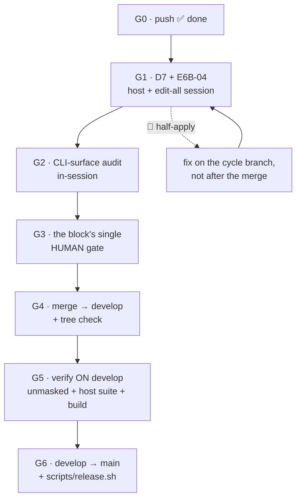

# Gates to release — operational runbook (cycle-1.2 → merge → release)

> **Operational.** This is the file to keep open at the terminal. It is the **single home** for the
> remaining gates: §8 of [`00-plan.md`](00-plan.md) points here instead of restating them, and evidence
> still goes into that plan's **§7 acceptance log**.
> **Point-in-time** — it dies with this release. Two parts generalise (**G4**'s merge tree-check and
> **G5/G6**'s release sequence) and are flagged inline as candidates for a long-living runbook under
> `engineering/guides/`; nothing here should be treated as a standing procedure until it is moved there.

**Sequence decided by the maintainer, 2026-07-30**: G1 **before** the merge, and **G2 sequential after
G1** — not parallel — so the audit is written knowing G1's outcome. Rationale for the pre-merge
placement is in G1; the *"verify the exact release state on `develop`"* concern the maintainer raised is
answered by **G4 + G5** together, and the reason it does not require re-ordering the gates is the
topology fact recorded in G4.



---

## 0. Three standing facts, before any command

1. **Where a gate runs is a classification, not a habit.** *Host-only* = the container has no push
   credential and `cco start|build|forget|resolve` are host-only verbs. *Split* = the privileged step is
   host-side but the **observations** belong inside a live session (S3's probe was mislabelled host-only
   and lost a full round to it). *In-session* = needs no host step at all (G2).
2. **The mask.** The uncommitted `access: {claude: all}` block in `.cco/project.yml` makes every
   `.claude` tree `rw`. Every suite figure in this cycle was measured **with it ON**; unmasked adds two
   known failures (`test_update_new_file_added`, `test_update_dry_run`, which write into a tracked-and-`:ro`
   `defaults/global/.claude/rules/`). **Any figure must state whether the block was in place** — this cycle
   has been wrong about it four times.
3. **Provenance with a dirty tree is misleading, not wrong.** `/opt/cco/BUILD` records a git *ref*;
   docker builds the working *tree*. When the tree is dirty, check the artefact:
   `strings /usr/local/bin/cco-svc-helper | grep CCO_STORE_TOTALS`, `diff -rq /opt/cco/lib lib`.

---

## G0 — Push ✅ **done 2026-07-30**

`git push origin develop fix/release/cycle-1.2`. Both refs now track origin with no *ahead* marker.

---

## G1 — S6's host half + D7's residual ✅ **PASSED 2026-07-31**

> Evidence in [`00-plan.md`](00-plan.md) §7 (*G1 — E6B-04 and D7*). E6B-04's fan-out re-keyed **both**
> referring projects with no `failed` tag; D7's view composed for a pack-less project with both floor
> entries writable — observed at `claude_access: none`, harder than the specified default.
> ✅ **Residual cleanup DONE 2026-07-31** (confirmed by the maintainer): `/tmp/cco-scratch`,
> `~/.cco/packs/scratch-pack*`, `cco forget proj-a` / `proj-b`, and the four stale remotes of G1.1
> (`probe-2`, `x`, `probe-3`, `probe-3b`). Nothing from this gate is left on the host.

**Why before the merge**, in order of force:

- **It is in the acceptance oracle.** Criterion **F** requires *"no half-apply (§7)"*, and
  [`handoff-v3.md`](../handoff-v3.md) §7 calls E6B-04 a **named gate** — *"a fix for an unreproduced
  defect is unverified"*. The merge into `develop` is where *"cycle-1.2 accepted"* gets recorded, and
  **D-V31-4** forbids inferring a release exception instead of writing it down.
- **The cycle branch modifies the verb under test.** `git diff develop..fix/release/cycle-1.2 --
  lib/cmd-pack.sh` has hunks **inside `cmd_pack_rename`** — the usage text and the fail-closed pre-flight
  refusal (`Run 'cco resolve' on your host'`, ADR-0056 D2), which is the `blocked[]` branch E6B-04
  exercises. A 🔴 therefore belongs on **this branch**: one merge, instead of a second fix branch plus a
  lane row re-opened after being marked closed.
- **The hard boundary is the release, not the merge.** The cascade fix under test (`1173f6b`, store
  cascades routed through `lib/store.sh`) is **already on `develop`** and **not on `main`**, so
  `develop → main` + npm is the point of no return. Running E6B-04 after the merge is defensible *only*
  if the acceptance record says **"accepted pending E6B-04"** rather than "accepted".

### G1.1 Cleanup first — or the fan-out is ambiguous to read

```bash
# stale remotes from earlier rounds
cco remote remove probe-2 && cco remote remove x && cco remote remove probe-3 && cco remote remove probe-3b
# stale scratch subjects
rm -rf /tmp/cco-scratch ; rm -rf ~/.cco/packs/scratch-pack*
cco forget scratch-a ; cco forget scratch-b
```

### G1.2 Build the scratch subject — and take D7 for free inside it

The **shape** matters more than the commands: **two** projects referencing **one** pack, so the
cross-project reference fan-out is actually exercised. A single-project setup passes a half-apply
undetected. `cco init` is interactive and the pack reference is a manual YAML edit, so adapt as needed.

```bash
mkdir -p /tmp/cco-scratch/proj-a /tmp/cco-scratch/proj-b
( cd /tmp/cco-scratch/proj-a && git init -q && cco init )   # name it scratch-a
( cd /tmp/cco-scratch/proj-b && git init -q && cco init )   # name it scratch-b
```

💡 **STOP HERE and run D7** — `scratch-a` references no pack in exactly this window, which is D7's
subject, so one scratch setup serves both gates. Full rationale in G1.4.

```bash
cco pack create scratch-pack
# add `scratch-pack` to the packs: list of BOTH projects' .cco/project.yml, then:
cco resolve scratch-a && cco resolve scratch-b
cco list packs                                             # confirm scratch-pack is registered
```

### G1.3 E6B-04 — the pack-rename fan-out, **never executed in any round**

> ⚠ **Run this on the HOST, not in a session** — against [`handoff-v3.md`](../handoff-v3.md) §7
> step 2, which prescribes *"in an `edit-all` container session"*.
>
> **Correction, 2026-07-31.** An earlier version of this note claimed the container arm was
> *structurally unreachable*. **It is not**, and the claim was wrong for a specific reason worth
> keeping: it enumerated the config-editor *modes* and missed that **`--repo <name>` composes with
> `--all`** — the collector's `--repo` loop runs after the mode chain, unconditionally
> (`cmd-start.sh:1128-1135`), so `--all --repo proj-a --repo proj-b` keeps `config_editor_mode=all`
> (G=rw) **and** binds both repos. Both guards then pass: the members probe as mounted, and the
> unmounted-project census is 0 because every project is a config target.
>
> **It still must not be used for this gate**, for a sharper reason. `cmd-start.sh:1898` forces the
> repo-path `.cco` overlay **`:ro` for the config-editor built-in regardless of `Pc`** (RC-6 §3.7,
> Change 5 — the built-in mounts repos to READ code; every writable config path is a dedicated
> `<name>-config` mount). The fan-out rewrites `<workdir>/<name>/.cco/project.yml`
> (`rename.sh:316-318`), i.e. exactly that read-only path. So the run would: pass both guards → move
> the store → **fail every rewrite** → report the documented partial state (`ok` then `die` at exit 1,
> S2b: *"…but packs[] could not be rewritten in N repo(s)"*).
>
> That output is, at a glance, **indistinguishable from the half-apply E6B-04 exists to detect** — and
> it would be caused by the mount policy, not by the cascade. A gate that cannot tell its own subject
> from its fixture is worse than an unrun gate. On the host the probe is the identity, the members
> resolve, the census is 0 by construction, and the cascade under test (`lib/store.sh`) is the same
> code. **What changes is only where it runs.**
>
> 📋 Whether config-editor should offer a repo-mounting broad mode at all (`--all-repos`, or resolving
> the fan-out through the `<name>-config` mount) is a **design question, logged as FI-42** — it is not
> a missing flag, it is two coupled decisions. Do not answer it inside this gate.
>
> 📋 The refusal that exposed this is **FI-41** — a session reporting *not-mounted* as *unresolved*
> with a remedy that cannot work. ✅ **Fixed 2026-07-30** (`1814ba3`, changelog 60) on the maintainer's
> approval: the consumer asks the availability owner, so the sentence and the exit code (2, a session
> shape) come from one place, and INV-AVAIL gained a fourth arm for the gap it proved.
> ⚠ **That changes what the refusal SAYS, not whether it refuses.** A session that does not bind a
> referring project's repos still cannot run this rename — so the four bullets above stand and E6B-04
> is still a host gate. Do not re-try it in a session expecting the fix to have opened the door.

On the host, from the repo:

```bash
cco pack rename scratch-pack scratch-pack-renamed -y
```

Verify **all three** post-conditions. Either every one of them, **or** none of them plus a non-zero exit
naming the reason. Anything in between is the half-apply, and it is **blocking 🔴 data-loss**:

| # | Post-condition | Where to look |
|---|---|---|
| 1 | the store directory moved | `~/.cco/packs/scratch-pack-renamed` exists, `scratch-pack` gone |
| 2 | **every** referring `project.yml` re-keyed | **including `scratch-b`'s** — this is the fan-out, and the whole point |
| 3 | DATA provenance + tags registries re-keyed | `cco list packs`, `cco pack show scratch-pack-renamed` |

Then clean up: `rm -rf /tmp/cco-scratch`, `rm -rf ~/.cco/packs/scratch-pack*`, and
`cco forget <name>` for each scratch project — **using the names you actually gave them**. `cco init`
defaults to the directory name, so `/tmp/cco-scratch/proj-a` becomes `proj-a`, not `scratch-a`. Read the
real names off `cco list projects` (or `cco whoami` → `editing target`) rather than off this page.

#### ⚠ If the rename refuses with an unmounted-project census

Observed 2026-07-30 at `edit-all`:

> ✗ Cannot rename pack '…' in this session: **1 project(s)** on this machine are not mounted here, so a
> packs[] reference they may carry cannot be updated (it would drift). Run 'cco pack rename …' on your
> host, or start a session that mounts them.

**This is a pass, not a failure** — and worth recording in §7 as such: the fail-closed pre-flight
(`lib/cmd-pack.sh:628-631` ← `_store_unmounted_project_count`, `lib/store.sh:185-194`) refused **before
touching any store**, which is RC-3 §3.4 Phase 0 behaving exactly as designed. It is deliberately
**conservative**: it counts every index project absent from `PROJECT_NAME`+`CCO_CONFIG_TARGETS`
*regardless* of whether it references the pack, because in-container `_project_foreach` only reaches
mounted projects' `project.yml` — whether an unmounted one carries the reference is **unknowable from
inside**. Narrowing the census would reintroduce silent drift.

**Diagnose it — the message gives a count, not a name** (logged as **FI-40**; naming is safe at read
scope `all` and the message does not yet do it). On the host:

```bash
cco list projects          # every project on this machine
cco whoami                 # in the session: the `editing target` list = what IS mounted
```

The name in the first list and not the second is the census subject. Then:

```bash
cco project show <name>    # is its path still there? is it resolved?
```

- **stale** (path gone — e.g. scratch residue from an earlier round, which is why G1.1 clears it
  *first*): `cco forget <name>`, re-launch the `--all` session, and the census drops to 0. **Prefer this
  route when it applies** — it keeps E6B-04 on the container arm the gate prescribes.
- **real but not on this machine** (its repo was never cloned here): do **not** `forget` it and do not
  `resolve` it just to unblock a probe. Run the rename **on the host** instead: there
  `_cco_container_operator` is false, the census is 0 by construction, and the fan-out reaches every
  `project.yml`. The cascade under test (`lib/store.sh`) is the same code either way — what changes is
  only where it runs, and the three post-conditions above are verifiable identically.

### G1.4 D7 — the framework view composed with **no packs at all**

**What the arm is.** ADR-0054 D2 built the CACHE `.claude` view *only* when a session injects pack/llms
children. ADR-0055 D3 adds the framework-owned floor entries (`settings.local.json`, `workflows/`) as
children of the same parent, so **D7 generalises the trigger** to *any* framework-owned child: the view
is composed for **every** `Cp=ro` session, packs or not.

**Why no probe has seen it.** Both of S1's probes ran on `claude-orchestrator`, which adopts
`core-dev-framework` — the *old* trigger fired, so the composition observed proved nothing about the new
half. Only two unit tests cover it: `tests/test_start_claude_view.sh:226` and `:242`.

**Procedure.** A **default** session on a project whose `project.yml` lists **no** pack. Do **not** pass
`--claude-access all`, and use a project with no `access:` override — otherwise the mask decides the
outcome instead of the code.

```bash
# inside the session
ls -la /workspace/.claude                        # the composed view, not the repo's .cco/claude bound raw
grep ' /workspace/.claude' /proc/self/mountinfo  # the view mount + its floor children
touch /workspace/.claude/settings.local.json && echo ok
mkdir -p /workspace/.claude/workflows && touch /workspace/.claude/workflows/.probe && echo ok
rm -f /workspace/.claude/workflows/.probe
```

Expected: the view **is** composed, and both floor entries are writable while the rest of the tree stays
`:ro`. A session landing on a raw `:ro` `.claude` with no view is the defect.

**Record both results in [`00-plan.md`](00-plan.md) §7** — command and output, not a verdict alone.

---

## G2 — CLI-surface documentation audit (in-session)

> ▶ **UNBLOCKED 2026-07-31 — the deferral is lifted.** It was deferred behind the
> config-mount-topology analysis (roadmap step **2b**) because auditing a surface that may move is work
> done twice. **Step 2b is now closed**: the maintainer decided the topology does **not** change in this
> release (whole block → cycle-2), so **the surface the audit documents is the shipped one**. Audit
> today's behaviour, and do not pre-document anything from the analysis.
>
> 📝 **Two items the analysis already handed this audit** (do not re-derive):
> 1. `cco start --help` (`lib/cmd-start.sh:2586-2590`) still describes the **pre-ADR-0044** world —
>    *"By default it mounts your ~/.cco store + EVERY resolvable project's .cco/"* and *"`--all` … an
>    explicit alias of the broad default"*. Both false since ADR-0044 §3 / ADR-0048 §1: config-editor's
>    default is **min-privilege by mode**. Objective drift → correct in place.
> 2. The [ADR-0046 §6 ratification](../../decisions/0046-unified-cco-access-model.md) landed on
>    2026-07-31 — a **normal** `edit-project` session spans every member repo's `.cco` at `Pc`. Any doc
>    row still stating the narrow default is drift.

Roadmap **step 3**, deliberately before the merge: *a release whose CLI reference misstates where a verb
runs ships the same defect class this cycle was about.* Sequential after G1 by the maintainer's decision,
so that if G1 changes a verb's contract the audit sees the final shape.

Scope: every verb declares correctly **which access levels it runs at** and **host vs container**. Two
surfaces moved in this cycle and the last full audit ([2026-07-02](../../../../cli/reviews/2026-07-02-cli-surface-awareness-review.md))
predates both — `remote remove|rename` became host-only, and config-editor's `extra_mounts` contract was
ratified. Subjects, canonical first:

1. [`cli/reference/cli-surface-matrix.md`](../../../../cli/reference/cli-surface-matrix.md) — **check this
   first**: a wrong row here is inherited by every downstream doc.
2. [`docs/users/reference/cli.md`](../../../../../users/reference/cli.md) and the user guides.
3. [`e2e-review/analysis/A1-command-scope-matrix.md`](../analysis/A1-command-scope-matrix.md).
4. [`cli/design/design-cli-environment-awareness.md`](../../../../cli/design/design-cli-environment-awareness.md).

Autonomy is `review-docs`-class: **objective** drift (a row contradicting the code) is corrected in
place; anything touching a decision never made stops for the human gate. One open item is already
queued — the severed-index refusal names the internal `/var/lib/cco-internal/…` path while its remedy is
host-side and `show_host_paths` is on, so the reader cannot act on the path they were handed
(§7, S3's entry). **User-facing wording is a human gate, not a sweep.**

---

## G3 — The block's single human gate ✅ **PASSED 2026-07-31 — `ACCEPTED with follow-ups`**

> ✅ **Taken and passed by the maintainer on 2026-07-31.** The verdict, the table of follow-ups and what
> was on the table are written into the plan's **§7 acceptance log** — that is the record, this section
> is now the historical checklist of what the gate covered. **G1's residual host cleanup is also done**
> (scratch projects, `scratch-pack*`, the four stale remotes).
>
> **Follow-ups carried out of the cycle**: [FI-42](../../../../roadmap-backlog.md) (→ the **release
> known-issue**, G6 step 5) · [FI-43](../../../../roadmap-backlog.md) ·
> [FI-40](../../../../roadmap-backlog.md) — all three deferred to **cycle-2** by the step-2b decision.
> ADR-0046 §6 was **ratified in place**, not deferred. Lanes L1/L2/L4/L5 move from *landed* to
> **accepted** in the roadmap; L3 already was.

The maintainer relaxed the per-phase gates for S3→S4→S5 to **one gate at the end**. This is it. What was
on the table:

- [ ] **§7 acceptance log**, four rows: S1 (both arms) · **S3 (both arms)** · **S4 (round 3)** · S5's ruling
      that closes L4/L5 in-session.
- [ ] **Suite 1617/7 of 1624, mask ON** (was 1614/7 of 1621 before FI-41's in-cycle fix `1814ba3` added
      the 4th INV-AVAIL arm + two regressions) — and the 7 identified **name for name** as the host-only
      set, not by count. *A count is not a fingerprint*: the 10-vs-7 episode began exactly there.
- [ ] **G1's two results** (E6B-04, D7) — including that E6B-04's third post-condition is recorded
      **vacuous** (a locally created pack carries no provenance/tags/fingerprint to re-key).
- [ ] **Step 2b's decision is TAKEN, not open** (2026-07-31): the mount topology does not change in this
      release; **FI-40, FI-42 and FI-43 are deferred to cycle-2**, each with its reason written into
      [`roadmap-backlog.md`](../../../../roadmap-backlog.md). ADR-0046 §6 was ratified in place. **Do not
      re-litigate** — what this gate still owes is the *release known-issue* below.
- [ ] **G2's findings**, split into *corrected in place* vs *needs your decision*.
- [ ] The **seven ratified deviations** in ADR-0056's *"Implementation annotations"* — already decided,
      **not** to be re-litigated.
- [ ] The decision, **written**: `ACCEPTED` / `ACCEPTED with follow-ups` / `NOT ACCEPTED`, into §7 and the
      roadmap's L1–L5 rows. If accepted with an exception, **the exception is written down** (D-V31-4).

---

## G4 — Merge → `develop`, then verify the merge did nothing extra

> ⚙ **Generalises** — candidate for a long-living release runbook.

Per [`.cco/claude/rules/git-workflow.md`](../../../../../../.cco/claude/rules/git-workflow.md). **FI-20**
(merges touching `.cco` are host-only) does **not** apply here: `git diff --name-status develop
fix/release/cycle-1.2 -- .cco/` is empty. Check that diff before assuming any merge is host-only.

**The topology fact that answers "will the merge change the results?" — measured 2026-07-30:**

```
merge-base(develop, cycle-1.2) = 14779d4
tree(develop)  == tree(14779d4) == 34803cd…   → develop contributes ZERO changes
merge-base(main, develop)      = 740f201
tree(main)     == tree(740f201) == 99e5648…   → main contributes ZERO changes
```

Both merges are therefore **content fast-forwards**: three-way merging with a base whose tree equals
*ours* yields *theirs* exactly. So the tree verified on the branch **is** the tree that reaches `develop`,
and then `main` — the concern is real in general and **void for these two merges specifically**. It stops
being void the moment anyone commits to `develop` or `main` directly, which the git rules forbid anyway.

**What topology cannot promise is that the merge was performed correctly** — `-X ours`, a hand-resolved
conflict, or a stray edit would all produce a different tree. So verify it, per merge, in one command:

```bash
git rev-parse fix/release/cycle-1.2^{tree}   # source
git rev-parse develop^{tree}                 # after the merge — MUST be identical
```

Different hashes ⇒ the merge introduced content nobody wrote. **Stop and look**, do not push.

---

## G5 — Verify **on `develop`**: the exact release state

> ⚙ **Generalises** — candidate for a long-living release runbook.

G4 proves the *tree* is the same. This gate covers what a tree identity cannot:

- [ ] **In-container suite, mask OFF.** Every figure in this cycle is masked. Stash the
      `access: {claude: all}` block, run the suite, and record the honest number — expect the two known
      unmasked failures on top of the host-only 7.
- [ ] **Host suite on macOS (bash 3.2 + BSD userland).** Never run on this tree, and it has its own
      failure families the container cannot see. This is the single largest unknown left in the release.
- [ ] **`cco build` from `develop`** + `cco whoami` provenance, then a smoke dogfood: start a real
      session, `cco list`, `cco path list`, `cco project show`.
- [ ] **npm-pack hygiene** — `scripts/release.sh` runs it as a pre-flight; running it early costs nothing.

A failure here is a fix on a branch off `develop`, never a commit on `develop`.

---

## G6 — `develop → main` + release

> ⚙ **Generalises** — candidate for a long-living release runbook.

1. Merge `develop → main` (content fast-forward per G4; verify the tree hash the same way).
2. `scripts/release.sh <x.y.z>` from `main` — bumps `package.json` (the single source of truth), runs the
   local pre-flight gate, commits, tags, pushes. `--full-tests` runs the whole suite locally; the default
   is the fast read-only publish gate because **CI re-runs the full suite + the read-only `FRAMEWORK_ROOT`
   gate + hygiene on the tag** before `npm publish --access public` via OIDC (no stored token).
3. The version number is the **maintainer's call** — `package.json` is at `0.5.2`.
4. State the **verified platform** in the release notes: macOS verified; Linux partially supported with the
   internal-store reachability caveat (README already says this consistently in both places since `9599111`).
5. **Carry the FI-42 known-issue into the release notes** (decided with step 2b, 2026-07-31). Suggested
   wording, already reduced to what a user can act on:

   > **Known issue** — in a `cco start config-editor --all` session that *also* binds repos with
   > `--repo`, `cco pack rename` moves the pack in the store and then fails to re-key the referring
   > `project.yml` files, because the built-in mounts a repo's committed `.cco` read-only. It exits **1**
   > and **lists the paths it could not rewrite** — nothing is changed silently. Re-run the rename on
   > your **host** to complete it. Every other route is unaffected: a normal session succeeds, and the
   > other config-editor modes refuse before changing anything.

   ⚠ Two things this wording protects, both learned the hard way: it names the **one** invocation instead
   of implying `pack rename` is broken, and it says the failure is **declared**, so a user meeting it does
   not assume silent corruption. Tracked as [FI-42](../../../../roadmap-backlog.md) → cycle-2.

⚠ CI on the tag is the **last** net, and it fires on `main` — i.e. publicly. G5 exists so that net never
has to catch anything.
