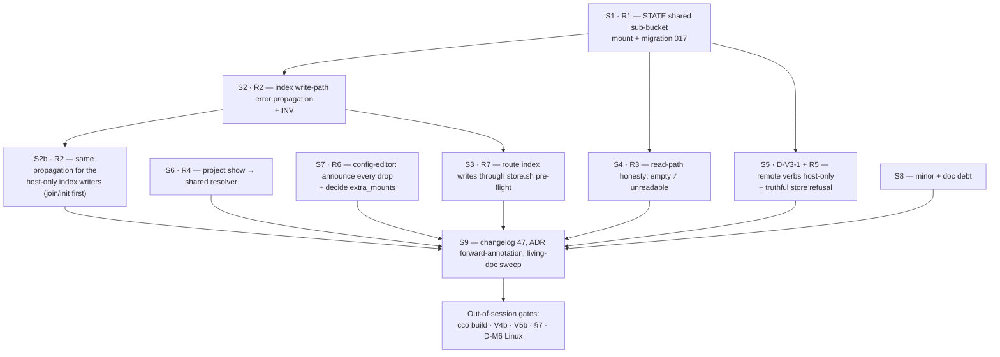

# Cycle-1.1 — fix plan & implementation handoff

> **Input**: [`../results/consolidated-review-v3.md`](../results/consolidated-review-v3.md) — the v3
> verdict (**NOT ACCEPTED**), its seven roots **R1…R7**, and the ratified decision **D-V3-1**.
> **Gate**: closing R1–R7 unblocks `develop → main`.
> **Branch**: `fix/config-access/e2e-v3-cycle1.1` (from `develop` @ `f894245`).
> **Status**: plan written 2026-07-20. **S1 · S2 · S3 landed** (2026-07-20/21), suite **1417/9** —
> the 9 are the pre-existing host-only artifacts, unchanged set. Next: **S4**.
> Resume pointer: [`RESUME-HANDOFF-s4.md`](RESUME-HANDOFF-s4.md).

Cycle 1 fixed the *model*. Cycle 1.1 fixes what only a live container could reveal: **one
mount-composition defect** (R1) that three sessions hit through three verb families, plus **six
honesty-of-failure defects** clustered around it. No cycle-1 design decision is reversed. The
scope is deliberately closed-ended — everything the v3 run classified as cycle-2 stays cycle-2.

---

## 1. Stage map

Stages are ordered by dependency, not by severity. **S1 is the only one that unblocks the 🔴s**;
S2–S4 must land with it because each would independently survive a perfect mount fix and re-hide the
next failure of the same class.



| Stage | Root | Closes | Blocking? | Status |
|---|---|---|---|---|
| **S1** | R1 | V3-01, V5-01, V2-F01 | 🔴 yes | ✅ `517014b` |
| **S2** | R2 | V3-01 (honesty half) | 🔴 yes | ✅ `4aefc2f` |
| **S2b** | R2 | the same class in the host-only writers (not a v3 finding — found while landing S2) | 🟠 | ⏳ designed, §3b |
| **S3** | R7 | V3-02 | 🟠 | ✅ `582347d` |
| **S4** | R3 | V2-F02, V2-F03 | 🟠 | ⏳ next |
| **S5** | D-V3-1, R5 | V5-02, V5-03 | 🟠 | ⏳ |
| **S6** | R4 | V2-F04 ≡ V4-F-V4-02 ≡ V5-04, V1-F1 | 🟠 | ⏳ |
| **S7** | R6 | V4-F-V4-01, V5-05 | 🟠 | ⏳ |
| **S8** | — | V3-03, V4-F-V4-03, V4-F-V4-04, V1-F3, V1-F2, V3-P | 🟡 | ⏳ (V3-P done in S2) |
| **S9** | — | release hygiene | — | ⏳ |

**What landed, in one line each.** **S1** — STATE crosses via a `state/cco/shared/` directory bind
instead of file binds; migration `017`; `INV-STATE` pins the allow-list and the shape; also fixed a
real orphan-scan bug the move surfaced (`cco config validate` scanned the old sidecar paths).
**S2** — `_index_mktemp` fails loudly, `_index_rename_path` and `cmd-repo.sh` propagate, `INV-IDX`
lints bare writes, `T-R2` guards the behaviour; V3-P's restart note shipped here. **S3** —
`_rename_assert_index_writable` probes the second store at its own (elevated) identity, so the
rename refuses *before* Phase 1. Every guard was adversarially revert-checked against pre-fix code.

---

## 2. S1 — the STATE shared sub-bucket (**the blocking stage**)

### 2.1 The constraint that rules out the obvious fix

`lib/cmd-start.sh:1592-1600` states the invariant: *"Secrets stay OFF the container: the 0600 STATE
remotes-token, transcripts and memory are never mounted (only the STATE index file crosses)."*
Binding `state/cco` whole — the fix V3 and V5 both proposed — would mount `remotes-token`,
`projects/<id>/session/memory` and `claude-state` into **every** session at **every** access level.
Not applicable as stated.

### 2.2 Options considered

| Option | Shape | Verdict |
|---|---|---|
| **(i)** in-place rewrite | drop `mktemp`+`mv`; write via `cat > "$f"` so no sibling and no parent is needed | **rejected** — loses write atomicity on the authoritative index; a crash mid-write truncates it. Changes host behaviour too, or forks the code path by environment |
| **(ii)** bind `state/cco` + mask secrets | reuse `_emit_secret_overlays` (dogfood-verified on `secrets.env`) | **rejected** — flips the boundary from **allow-list** (only the index crosses; fail-safe) to **deny-list** (everything crosses except what someone remembered to mask; fail-open). Any file added under STATE later leaks by default. Unacceptable on a boundary whose ADR is explicitly fail-closed |
| **(iii)** chown the per-bucket parent | `entrypoint.sh` pre-creates + chowns `state/cco` to `cco-svc` | **insufficient alone** — V3 root cause A′: `mv "$tmpf" "$f"` where `$f` **is** a mountpoint returns **EBUSY** on Linux. Fixes `mktemp`, not the commit |
| **(iv)** shared sub-bucket | move `index` + the `packs/`/`templates/` sidecars under `state/cco/shared/`; bind that one **directory** | **✅ chosen** |

### 2.3 Chosen design

Introduce `$(_cco_state_dir)/shared/` as the **only** STATE member that crosses the boundary:

```
state/cco/
├── shared/              ← NEW. the single STATE bind, rw, directory-shaped
│   ├── index
│   ├── packs/<name>/update/{meta,base}
│   └── templates/<name>/update/{meta,base}
├── remotes-token        ← never crosses (0600)
├── projects/<id>/…      ← never crosses (transcripts, memory)
├── running/             ← unchanged: separate :ro directory bind (ADR-0045)
└── global/update/…      ← never crosses (no need)
```

Properties: the **allow-list is preserved** (a new STATE file is unmounted by default — fail-safe);
all four buckets become structurally uniform (directory binds); the atomic `mktemp`+`mv` pattern in
`lib/index.sh` needs **no change**; and `mv` no longer targets a mountpoint, so EBUSY is gone.

### 2.4 Work items

1. **`lib/paths.sh`** — add `_cco_state_shared_dir()`; re-point `_cco_index_file` and the pack /
   template `update/{meta,base}` accessors (`:232-262`) at it. Leave `:53` (`remotes-token`),
   `:203-209` (session) and `:153-157` (global update) where they are.
2. **`lib/cmd-start.sh:1643-1656`** — replace the `${state_root}/index` **file** bind with a
   **directory** bind of `${state_root}/shared` → `/var/lib/cco-internal/state/cco/shared`, rw.
   Update the block comment at `:1592-1600` to state the new allow-list precisely.
3. **`config/entrypoint.sh`** — pre-create `/var/lib/cco-internal/state/cco` owned by `cco-svc`, so
   Docker never materialises a `root:root` intermediate again. This is the general defence the root
   `CLAUDE.md` / `design-docker.md` §1.2.2 already prescribes and that was never applied per-bucket.
4. **`migrations/global/017_state_shared_subbucket.sh`** — move `index` and the two sidecar trees
   into `shared/`. **Must be idempotent** (a machine already migrated is a no-op) and must tolerate a
   missing source. Bump the global schema version.
5. **`lib/store.sh:137,140`** — `_store_op_buckets` returns the *shared* dir for `sidecar-purge` /
   `sidecar-rekey`. The `remote-*` entries are removed entirely by **S5**.

> **Do not** widen the bind to `state/cco`. If a future op needs a new STATE file in-container, the
> correct move is to place that file under `shared/`, not to widen the mount. Worth an INV in
> `tests/test_invariants.sh`: *no `_compose_vol` may bind a STATE path other than `shared/` and
> `running/`.*

### 2.5 Verification (S1 is not self-verifying from a hermetic test)

The hermetic lane **cannot** observe mount-time failures — that blind spot is what let R1 ship green
(`00-overview.md` §8), and R1 will recur the next time a bucket is bound as a file. Add both:

- **Hermetic**: the INV above (static: which STATE paths may be bound).
- **Container-lane precondition**: at `cco start`, or as a lane check, assert **the STATE shared
  bucket parent is writable at the elevated identity** — a real `mktemp`, not `test -w` (whose
  `access(2)` checks the *real* uid, a false yes under elevation; `rename.sh:174` already documents
  this trap).

---

## 3. S2 — index write-path error propagation

Three suppressions stack (`consolidated-review-v3.md` §4/R2). All three need closing; fixing only
one leaves the failure silent.

1. `lib/index.sh:715-731` `_index_rename_path` — propagate status from `_index_pp_set`,
   `_index_pp_remove` and `_index_set_project_repos`; return non-zero on any failure.
2. `lib/cmd-repo.sh:157` — `_index_rename_path … || die "…"`, and gate the `ok "Renamed …"` at `:165`
   on success. Model the wording on `lib/tags.sh:75`, which already does the honest thing.
3. **The general hazard** — `bin/cco:657-658` puts the whole command body in a `||` context, which
   **disables `errexit` for the entire call tree**. This is not repairable at the dispatcher without
   losing the rc capture, so **explicit `||` propagation is the only reliable mechanism** in every
   verb reached that way. Record it as an invariant with a lint, in the same spirit as the
   `lib/store.sh` CLASS lint: *inside a `cmd_*` body reached via `|| _cco_rc=$?`, a store/index write
   must be `||`-checked.*

Audit the other `_index_*` writers (`lib/index.sh:70,104,175,209,315,373,412`) for the same
unchecked-status shape while here — V3 found the rename path, but nothing suggests it is unique.

---

## 3b. S2b — the same propagation for the host-only index writers

**Not a v3 finding.** It surfaced while landing S2: once `INV-IDX` existed, running it
unscoped showed ~15 bare index writes across seven host-only modules — `cmd-init.sh:390-391`,
`cmd-join.sh:169-170`, `cmd-resolve.sh` (5 sites), `cmd-forget.sh:203`,
`cmd-project-export-import.sh:216-217`, `cmd-project-add.sh:210`, `local-paths.sh:500`,
`migrate.sh:1045`. Every one is the V3-01 shape: write the index, then announce success
unconditionally.

**Why it was scoped out of S2, and why that was half right.** The *probability* is genuinely
lower on the host — the bucket parent is normally writable, so the failure needs an anomaly:
a STATE tree left root-owned by an earlier `sudo cco …` (the realistic one — it is a common
instinct after a permission error), `ENOSPC`, a quota, or a home on a mount gone read-only.
`_cco_ensure_dir` (`paths.sh:429`) does not protect: it creates a missing directory but
passes straight through an existing unwritable one, and its status is unchecked anyway.

But probability is the wrong sole criterion. The right one is probability × **consequence** ×
detectability, and on two of these verbs the consequence is *higher* than the container bug
while detectability is equally nil:

| Verb | What the user is told | What is actually true | What they hit later |
|---|---|---|---|
| `cco init` | `✓ Scaffolded …` **+ "registered it in the index (1 repo)"** — a sentence asserting the very write that failed | `project.yml` written, index empty | `cco start <name>` → *"is not resolvable yet — run 'cco resolve --scan'"*, i.e. the tool contradicts itself one command later |
| `cco join` | `✓ Joined '<p>' as member '<r>'` + the commit/push reminder | `project.yml` re-keyed in **every** synced member repo, index unbound | the user **commits and pushes** a config declaring a member no index binds — the blast radius leaves the machine and reaches teammates on pull |

`join` is the reason this cannot stay a comment: v3's V3-01 damaged one session; this
damages a versioned, distributed artifact.

**Why it is still its own stage rather than part of S2.** Seven modules, and each site needs
a real behavioural decision, not a mechanical `|| return 1`: a verb that used to complete now
dies, and — exactly as in `cmd-repo.sh` — the message has to say *which* store already
changed, because the first write (`project.yml`, potentially across several repos) has
already landed. That is a stage with tests, not a footnote.

### ⚠ Re-scoped 2026-07-21 after a codebase-wide audit — read that first

Per the `roadmap-backlog.md` convention (re-derive an item's real boundary before designing it),
S2b was audited across the whole `lib/` tree before implementation. The boundary is **larger and a
different shape** than "add `||` to 15 call sites". Full report:
[`../../../../engineering/analysis/false-success-class-audit.md`](../../../../engineering/analysis/false-success-class-audit.md).

**The finding that changes the fix shape: several primitives cannot report failure at all**, so a
check at the call site is inert. Three verified by direct reading:

- `_remote_token_set` (`cmd-remote.sh:16-27`) — last statement is `if ! chmod …; then warn; fi`,
  which yields 0 on both paths, so the function **always returns 0**. This voids the correctly
  written `store.sh:370` `… || return 1`.
- `_remote_token_remove` (`cmd-remote.sh:30-37`) — bare `mv`, then an explicit `return 0`. Voids the
  correctly written `cmd-remote.sh:295` `if ! _remote_token_remove`.
- `_yaml_rename_list_ref` (`rename.sh:66-72`) — `mv "$tmp" "$file"` then unconditional `return 0`.
  Voids `rename.sh:230`'s `if _rename_yaml_write_owned …; then` for the `mv` case.

So S2b is **two-layered, and the order matters**: (1) make the primitive capable of failing, (2)
then add/verify the call-site check. Doing (2) first yields an audit that reads as closed while the
defect persists — which is the state those three call sites are in today.

**Honest limit on what S1–S3 shipped.** They closed the **index** half of `repo rename`. The
**project.yml** half retains a narrower form of the same defect through `_yaml_rename_list_ref`.
S3's pre-flight mitigates the dominant cause (an unwritable tree) but probes only the **cwd unit's**
`.cco`, so a multi-repo fan-out where a *different* member is unwritable, or an `ENOSPC` mid-write,
still reports that repo as rewritten. Closing this is part of S2b, not a separate discovery.

**Work items**, priority order:

1. **Primitives first** — `_yaml_rename_list_ref` (inside the rename boundary S1–S3 just touched),
   then `_remote_token_set` / `_remote_token_remove` (**S5 depends on these**: D-V3-1 makes
   `remote remove|rename` host-only, but `store.sh:370`'s guard is inert on the **host** too, so
   the token primitive must be fixed regardless).
2. **`cmd-join.sh`** and **`cmd-init.sh`** — the two `_index_*` sites whose consequence escapes the
   machine. Same shape as `cmd-repo.sh`: check, `die` naming the store that changed and the recovery.
3. The remaining `_index_*` modules (`cmd-resolve.sh` ×5, `cmd-forget.sh`,
   `cmd-project-export-import.sh`, `cmd-project-add.sh`, `local-paths.sh`, `migrate.sh`).
4. **Widen `INV-IDX`'s `scoped` list as each module is closed**, so the lint tracks the work instead
   of documenting a permanent exemption. When it covers all seven, drop the "host-only writers are
   out of scope" paragraph from the invariant's header. Consider a sibling lint for the primitive
   shape itself — *a mutation helper whose tail statement cannot return non-zero*.
5. A behavioural guard per high-value verb, modelled on `T-R2`
   (`test_repo_rename_operator_unwritable_index_fails_loud`): unwritable target → non-zero, no
   success tick, message names the store, store provably untouched.

**Out of S2b's scope**, tracked as **FI-24**: the update engine (A1–A6 — no file-mutating call in
`update*.sh` has its status checked), `pack`/`template publish` (B1–B3, incl. the bare `git commit`
whose `|| die` on `push` is structurally unreachable), and the local-destructive set. Those are a
separate workstream; cycle 1.1 must not grow into them.

## 4. S3 — route index writes through the RC-3 pre-flight

`grep -n 'store-op' lib/index.sh` → **no hits**: the index writers bypass `lib/store.sh` entirely, so
D-M8's **Q-11** is half-landed (the verb trampolines; its index writes do not). Consequence: the
fail-closed probe `_rename_assert_writable "$unit/.cco"` (`lib/rename.sh:174`, from
`cmd-repo.sh:143`) guards the **config** tree — which is writable — and never probes the tree that
fails.

Two acceptable shapes; **prefer (a)**:

- **(a)** extend `_rename_assert_writable` to probe **both** trees — the config tree *and* the STATE
  shared bucket — at the same identity, before Phase 1. Cheap, local, no re-plumbing.
- **(b)** complete Q-11: route `_index_rename_path` through a `store-op` plan/apply crossing so it
  inherits `_store_plan`'s probe (`store.sh:188`) for free. Cleaner, larger, and it changes the
  index write path — which S1 and S2 are already touching.

> **✅ LANDED as (a)** (`582347d`) — `_rename_assert_index_writable` in `lib/rename.sh`, called
> alongside its sibling from `cmd-repo.sh`. **(b) / Q-11 remains open** and is deliberately not
> residue: it buys the same guarantee for a much larger change to a write path S1+S2 had just
> rewritten, and chaining them would have made the revert-checks impossible to attribute.
>
> ⚠ **The identity is INVERTED between the two probes, and this is the part to not "simplify" later.**
> The project.yml write is de-elevated to ruid=claude (D-M4) → its probe goes through
> `_rename_deelevated`. The index write is **not** — the verb trampolines wholly and `lib/index.sh`
> writes at euid=cco-svc → its probe uses a plain `mktemp` at the current identity. De-elevating the
> index probe would test `claude` against a `cco-svc`-owned bucket and refuse **every** legitimate
> rename; elevating the config probe would pass on a tree the real write cannot touch.
>
> **Layering with S2** (pinned by `T-R2` assertion (e)): S3 makes the failure *not happen* — the
> refusal lands before Phase 1, so both stores are untouched. S2 makes it *loud and recoverable* if
> the probe ever passes and the write still fails (a race, or a condition the probe cannot see).
> Both paths stay; neither is redundant.

Whichever lands, note **V3-02's second half**: on macOS `fakeowner` ignores modes for container uids,
so the refusal branch is **unfalsifiable there** (`chmod 500 .cco && mktemp .cco/.x.XXXXXX`
succeeded). Criterion F cannot be signed off from a macOS run — see §10.

---

## 5. S4 — read-path honesty: empty ≠ unreadable

`lib/cmd-resolve.sh:869` gates the "empty" message on `count -eq 0 && hidden -eq 0`, a correct
discriminator for *empty-vs-all-hidden* but with **no third arm for "the read failed"**. A zero-byte,
permission-denied or stranded index all render as success.

1. Add the third arm: an unreadable/unparseable index is an **error, exit 1, with the real reason**
   (`00-overview.md` §5.2). Never rc=0.
2. **Remove the retired vocabulary.** That line still emits `run 'cco resolve'` — the exact string
   RC-2 claims to have retired, from a path cycle 1 never audited. Route through
   `_env_unavailable_sentence` (`access-scope.sh:736`) or an equivalent shared string.
3. `cco list projects` degrades even more quietly (a bare header, no message). Same treatment.
4. **V2-F03** — surface the staleness rather than only failing honestly on read. A cheap `stat`-based
   liveness check at verb entry, or a line in `cco whoami`, converts a silent wrong answer into a
   loud one. S1 removes the *cause*, but a file-shaped bind may return elsewhere; this is the
   detector.

---

## 6. S5 — D-V3-1: remote verbs host-only, and a truthful store refusal

### 6.1 The decision (ratified in the consolidated review §3)

`cco remote remove` and `cco remote rename` are **host-only in-container**, refused **exit 2** with
the existing host hint. `cco remote add` stays functional.

Rationale in brief — full argument in the review: `bin/cco:404` already refuses `remote
set-token|remove-token` for *"secrets stay off the container"*, and these two verbs mutate the **same
token store** (`store.sh:347`, `:361-364`); and because the token never mounts, `remote_get_token`
cannot distinguish *"no token"* from *"token invisible"*, so both ops — written as conditional no-ops
on exactly that test — would **pass silently**, with `remote-rekey` orphaning the token and stripping
the renamed remote's auth without a diagnostic.

### 6.2 Work items

1. **`bin/cco:404`** — extend the existing refusal to `remote remove|rename`. Keep the wording family
   (*"secrets stay off the container"*) and exit **2**, not 1.
2. **`lib/store.sh:137,140`** — drop `remote-drop` / `remote-rekey` from the STATE bucket list; they
   no longer run in-container. Their host path is unchanged.
3. **V5-03** — the dup-check in `cmd-remote.sh` currently says *"Remove it first with `cco remote
   remove <name>`"*, a command that is now explicitly host-only. Make it name the **host** remedy.
4. **R5 / V5-02** — `lib/store.sh:243-245` must distinguish two conditions that today share one false
   string (*"the store is not writable in this session"*, which is demonstrably false at `edit-all`):
   - **scope refusal** — the session's triple does not grant `G=rw` → exit **2**, name the axis.
   - **not bound in this container** — the bucket is not mounted → D-M2's *"not mounted in this
     session"* vocabulary + a host remedy. This is the state `project validate` already speaks
     correctly; reuse that string, do not write a fourth spelling.

---

## 7. S6 — one predicate, one spelling

`lib/cmd-project-query.sh:192` hardcodes a scope-widening remedy and bypasses the shared resolver.
`lib/access-scope.sh:736` (`_env_unavailable_sentence`) is already correct at **every** level,
including `edit-all` where no widening exists.

- Replace the hardcoded branch with the shared sentence. This closes **V2-F04 ≡ V4-F-V4-02 ≡ V5-04**
  in one edit — three sessions, three vantages, one call site.
- **V1-F1** (adjacent, same area): bare `cco project validate` at `/workspace` does not resolve the
  session's project, while `cco project show` does (it has the R4 WORKDIR-root fallback). `/workspace`
  is the agent's default cwd, so two sibling introspection verbs disagree about whether the session
  has a project. Give `validate` the same fallback.
- Add an invariant/lint: **no verb may spell an availability state locally** — the three states come
  from `access-scope.sh` or nowhere. This is the class RC-4 was created to eliminate (*"one predicate,
  four spellings, one of which drifted"*), and it has now recurred twice.

---

## 8. S7 — config-editor announces every drop

1. **V5-05** — `lib/cmd-start.sh:776-780`, the `--all` branch: `[[ -d "$path/.cco" ]] || continue` is
   a bare `continue`. Route it through `_ce_skip_note` (`:585-598`), which the sibling repo path
   already uses and which speaks the right vocabulary. One index-known project was dropped from 8
   with no announcement on any in-container surface.
2. **V4-F-V4-01** — `_start_collect_config_editor_targets` (`:759-800`) never consults the target's
   `extra_mounts:`. This needs a **decision before code**:
   - **(a)** mount them, like the target's repos (RC-6's shape), or
   - **(b)** decide config-editor never mounts a target's extra_mounts, and **announce** them as
     not-mounted via `_ce_skip_note`.

   **Recommendation: (b).** config-editor exists to author *config*; a target's extra_mounts are
   reference material for a working session, not authoring surface, and mounting them widens the
   built-in's blast radius for no authoring gain. What is not acceptable is the current state —
   neither delivered nor decided, while `cco path list` prints both bindings as live host paths and
   implies they are reachable. Record the decision in `03-config-editor-repos.md` §3.9 (whose
   drop-case table does not currently enumerate this class).

---

## 9. S8 — minor findings and doc debt

| Item | Action |
|---|---|
| **V4-F-V4-04** | `00-overview.md` §9 **D-M9/Q-8** ("the duplicate authoring path is accepted") contradicts the implemented and separately ratified `03-*` §3.7. The implementation is correct and strictly safer; the **record** is stale. Add *"Superseded by `03-config-editor-repos.md` §3.7"*, following the precedent D-M11 already set |
| **V3-03** | The Q-6 ambiguity refusal is unreachable at the WORKDIR root — `_resolve_find_unit_dir` fails first at `cmd-repo.sh:49`. Safety holds (no single-repo fallback); only the reachability of the *designed* message is wrong. Either move the guard or record that Q-6 is satisfied by an earlier one |
| **V4-F-V4-03** | `cco list projects` notice leads with `read-global`, which reveals none of what it hid. One-line ordering fix; **cycle-2 (Q-C3)** unless it is free to take here |
| **V1-F3 ≡ V5-8** | No build provenance in-container, so no session can fill the §4 template's *"Image built from"* field — the field that exists **because** v2's cycle-0 built from the wrong branch. Bake `/opt/cco/BUILD` with branch + short sha, making launch rule 0 self-verifying |
| **V1-F2** | PROPOSAL — `cco project show` has no extra_mounts section (as-specified per `cli.md:930-941`), which makes `path list` the only in-container surface enumerating them **by logical name** — the key for `cco path` / `extra-mount rename`. Worth adding; not a bug |
| **V3-P** | PROPOSAL — becomes user-visible **the moment S1/S2 land**: a *successful* repo rename leaves the session's bind at the old path while both stores say the new name, so the member classifies `not-mounted` for the rest of the session. `cmd-repo.sh:168` prints a path-change note for `extra_mount` only; the **repo** case needs it more. Ship this **with S2**, not after |

---

## 10. Out-of-session gates (host, in order)

Cycle-1.1 is not acceptable on a green suite alone — three of these were never executed at all.

1. **`cco remote remove v5probe`** — V5 residue on the maintainer's machine (§8 of the review). Do
   this first; it is unrelated to the fix but the store is currently grown by one entry.
2. **`cco build` from the cycle-1.1 tip**, then re-run the affected sessions.
3. **V4b — the D-M11 escalation test** (`--cco-access global=rw,current=ro,others=none` ⇒ target
   `.cco` **ro**). ~5 minutes, and it is the **highest-value remaining run**: every other v3 probe
   fails *safe* if the fix is wrong; this one fails **open**.
4. **V5b — bare global** `(rw,none,none)`: honest-empty `path list` + notice, and the ADR-0048
   inert-no-target guard.
5. **§7 / E6B-04** — the pack-rename fan-out atomicity gate, **still never executed**. Now unblocked
   by S1. Use the substrate V5 identified: `cave-core` is referenced by two mounted projects, which
   is exactly §7's fan-out shape — no scratch projects needed.
6. **D-M6 Linux write-path check-in** — now a **hard gate**, not a follow-up: `fakeowner` makes the
   fail-closed pre-validation unfalsifiable on macOS (V3-02), so criterion F cannot be signed off
   from a macOS run.

Re-run V3 (rename completion) and V5 (store ops) after the build; V1/V2/V4 need no re-run — their
results are independent of R1 and were verified clean against the host oracle.

---

## 11. Release hygiene (S9)

- **`changelog.yml`** — next id **47**. Cycle 1 grouped its entry as id 46 (D-M10/Q-C2); follow that
  shape for 1.1.
- **Migration** — `migrations/global/017_state_shared_subbucket.sh` (next sequential id; current max
  is 016). Idempotent, tolerant of a missing source, bumps the global schema version. Per
  `.claude/rules/update-system.md` this is a **breaking/structural** change: base template and
  non-base native templates need review too.
- **ADR forward-annotation** (append-only, per `documentation-lifecycle.md`): **ADR-0047** gains the
  STATE allow-list refinement (S1) and **D-V3-1** (S5); **ADR-0045** is unaffected (`running/` keeps
  its own `:ro` directory bind).
- **Living docs** — `design-docker.md` §1.2.2 (the bucket-ownership invariant this defect is the
  first real instance of), `02-mount-generation.md`, `05-store-write-path.md`,
  `03-config-editor-repos.md` §3.9 (S7's decision), `cli.md` (remote verbs now host-only).
- **Git** — atomic commits per stage on `fix/config-access/e2e-v3-cycle1.1`; merge to `develop` only
  after the §10 gates. `develop → main` stays gated on a v3.1 acceptance pass.

---

## 12. Next-session handoff

**Read first**, in order: [`../results/consolidated-review-v3.md`](../results/consolidated-review-v3.md)
(the verdict and the R1…R7 root map) → this plan → `00-overview.md` §5 (the cross-cutting
conventions: three availability states, 0/1/2 exit codes) and §9 (the D-M table) → the design doc
for the stage you are on.

**Start with S1**, and read §2.1 before touching `cmd-start.sh:1643` — the obvious one-line fix that
two v3 sessions recommended is the one thing not to do. **S2 must land with S1**: without it the next
write failure in that path is silent again, and a *successful* rename immediately surfaces V3-P, so
ship that note in the same stage.

**Do not re-litigate**: RC-4 (confirmed on both halves across three projects), RC-1's D-M5 arms, RC-6
repos, the ADR-0047 boundary, criterion E, and `lib/store.sh`'s fail-closed contract. V5's note 2 is
the standing triage rule — *"fix the mount + fix the message, not reconsider RC-3."*

**Out of scope**: everything `handoff-v3.md` §9 defers — the RC-5 vocabulary sweep, RC-7…RC-16,
Q-10 provenance writers, FI-21/22/23, E4-02/RC-16 mis-ownership. Two v3 findings sit adjacent to
cycle-2 items and are pulled **in** deliberately, on the D-M2 rule-3 ground that cycle 1 must not
emit text contradicting the ratified vocabulary: **S6** (`project show`, adjacent to the RC-5 sweep)
and **S8**'s Q-C3 line if free.
</content>
</invoke>
