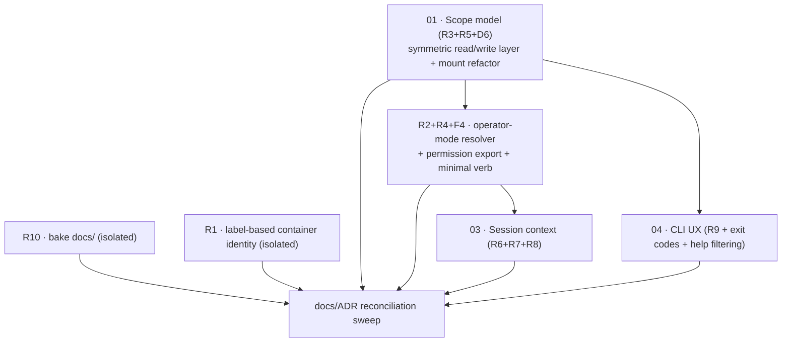

# Fix Design — Agent ↔ cco Access e2e Review

> **Status**: Design phase (2026-07-03). Grounded in the consolidated root-cause
> analysis (`/review/rootcause/CONSOLIDATION.md` + the seven `RC-*.md` reports)
> over the eight e2e sessions (`/review/S*.md`). All maintainer decisions ratified
> (see §2). No implementation code is written in this phase — these are
> design-intent documents the implementer builds from.

This is the index for the fix workstream. Each cluster has its own design doc;
this file carries the shared context: ratified decisions, the consolidated root
map, cross-cutting conventions, the doc/ADR reconciliations every cluster feeds,
and the build ordering.

## 1. Reference reading

- `../handoff.md` — the review that produced the findings (§7.3 mandates this fix design).
- `/review/rootcause/CONSOLIDATION.md` — the 9-root synthesis (host mount; not in-repo).
- `../design.md` — the three-level access model (A/B/C), INV-1..4.
- `../decisions/0042-agent-cco-interaction-model.md` — the model + ratified decisions.
- `../../../cli/decisions/0043-unified-cli-environment-access-scope.md` — output-scoping layer, scope taxonomy, INV-A..E.
- `../../decentralized-config/decisions/0036-session-config-capability-model.md` — the capability knobs.
- `../../../cli/design/design-cli-environment-awareness.md` — the surface-wide dual-context principle.

## 2. Ratified decisions (maintainer, 2026-07-03)

| # | Decision | Ratified outcome |
|---|---|---|
| **Scope model** | Read/write symmetry on the `{project, global, all}` axis | **Adopt full symmetry.** `edit-project` reads at project scope, `edit-global` at global, `edit-all` at all — mirroring the already-symmetric write side. `read-global ≠ read-all` (other-projects gated to `-all`). Supersedes the flat 2-tier read impl. Reshapes R3+R5+D6 → one scope layer. See `01-scope-model.md`. |
| **R6** | `none` contract | **Guard.** Early explicit refusal of any `cco` invocation in-container when operator env is absent, with a clear "cco_access=none" message, + a Level-A "cco unavailable" line. `none` = deliberate least-privilege floor (not context/image saving); `cco docs` is refused too — docs need `read-project` (the default). |
| **R7** | Declared-but-unresolved | **Marker + provenance.** Level-A renders declared-but-unresolved resources, distinguishing auto-skip (unresolved path) from user-opted skip (subject to `cco start` capturing the choice; else degrade to marker-only). |
| **R2/F4** | Permission-state introspection | **Export + minimal verb.** The fix exports `CCO_CLAUDE_ACCESS`/`CCO_SHOW_HOST_PATHS` and adds a minimal session-introspection capability. **Verb name/shape (`whoami` vs `session`; reserve `cco status` for global cco state) is deferred to the CLI-UX review** (post-fix). |
| **D5** | ADR-0036 D4 wording | Tighten to "masked in every *mounted* config tree" (mount-scoped; code is already safe). |
| **D7** | In-container help | **Filtered by default in-container.** `cco help`/`cco --help` in-container shows only verbs runnable at the current scope; host-only + above-level hidden, with a warn ("N host-only hidden — `cco --help --host` for all"). `cco --help --host` shows all flagged. Per-command `<cmd> --help` always available. Host help unchanged. |
| **D8** | Exit-code convention | Adopt & document: `0` = success or graceful degrade; `2` = refused by scope / host-only; `1` = error. Applied across the shim/CLI. |
| **D9** | config-editor `--project` semantics | **No PROJECT_NAME overload.** `PROJECT_NAME` always = the started project (`config-editor`). `--project <name>` is an editing-access scope carried by an additional config-editor-only env (`CCO_CONFIG_TARGETS`). The agent is instructed to introspect/validate the *target*, not `PROJECT_NAME`. |
| **D10** | "Used by" at read-project | For the current project compute from the mounted tree / membership env; for other (unmounted) projects show "unavailable at this scope", never a false "(none)". |

## 3. Consolidated root map (9 roots)

| Root | Origin | Cluster doc |
|---|---|---|
| **R3** read `list <kind>` dispatcher bypasses scope layer | IMPL | `01-scope-model.md` |
| **R5** write-scope taxonomy under-specified + scope-blind gate | part-DESIGN + IMPL | `01-scope-model.md` |
| **D6** read symmetry (edit-* read at matching scope; read-global≠read-all) | DESIGN | `01-scope-model.md` |
| **R1** container identity via wrong mechanism (`cc-<name>` vs `run` naming) | IMPL | `02-session-identity.md` |
| **R2** in-container resolver ignores PROJECT_NAME + no preset registry | IMPL | `02-session-identity.md` |
| **R4** "Used by" membership (⊂ R2 — same resolver) | IMPL | `02-session-identity.md` |
| **F4** permission-state export + minimal verb | IMPL (deferred knob) | `02-session-identity.md` |
| **R6** `none` has no explicit contract | DESIGN gap + IMPL | `03-session-context.md` |
| **R7** declared-but-unresolved concept missing in Level-A | DESIGN gap + IMPL | `03-session-context.md` |
| **R8** in-container discovery hook competes with Level-A | IMPL | `03-session-context.md` |
| **R9** shim refusal-case taxonomy not modeled (+ help filtering, exit codes) | IMPL (+micro-design) | `04-cli-ux.md` |
| **R10** `docs/` not baked into the image | IMPL (pure) | `04-cli-ux.md` |

De-escalated (verified NOT bugs): Level-A llms S2/S3 discrepancy (INV-1 holds — test artifact); secret leak at `none` (repo `.cco` masked unconditionally). New discoveries folded in: `cco stop` fully broken (R1); `cco pack list` executes instead of redirecting (R3/R9).

## 4. Cross-cutting conventions (defined once, consumed by every cluster)

### 4.1 Exit-code convention (D8)
- `0` — success **or** graceful degrade (scope-filtered output, "not here at this scope").
- `2` — refused by policy (needs a wider `cco_access`, or host-only).
- `1` — actual error (missing file, parse error, unresolved dependency).

Every `die`/refusal path in the shim and the CLI verbs is audited against this. It
is also documented in the forthcoming maintainer CLI reference (§6).

### 4.2 In-container help filtering (D7)
`cco help` / `cco --help`:
- **Host**: unchanged, complete, no host-only annotations.
- **In-container (default)**: filtered to verbs runnable at the current `cco_access`; host-only and above-level verbs omitted; a one-line warn states how many are hidden and how to see them.
- **In-container `--host`**: full list, host-only verbs flagged `(host only — run on your host)`.
- **`<cmd> --help`**: always available (informational), including for host-only verbs (prints usage flagged), never refused.

## 5. Required ADR / doc reconciliations (design-intent → written in implementation)

These are consequences of the ratified scope model and conventions. Listed here so
no cluster forgets them; the actual edits happen during implementation.

- **ADR-0043** — rewrite the scope-taxonomy table: add `edit-*` columns and split `read-global` vs `read-all` (currently one "all" column). Encode the symmetric `{project, global, all}` read axis.
- **ADR-0042** — clarify the "mirror/symmetric" language to state the read tier equals the write tier's scope, and that `read-global ≠ read-all` differ only in other-project visibility.
- **ADR-0036 D4** — tighten secret-masking wording to "every *mounted* config tree" (D5).
- **CLAUDE.md**, `lib/access-scope.sh` header comment, managed `cco-config-interaction.md` — replace "edit-* read everything" with "each level reads at its matching scope".
- **Managed rule** — add the config-editor `--project`/`CCO_CONFIG_TARGETS` guidance (D9) and the `none` unavailability contract (R6).

## 6. Post-fix roadmap items (annotate in `docs/maintainers/roadmap.md`, with approval)
- **Internal maintainer CLI reference**: matrix `command × {host, in-container} × cco_access`, plus command/subcommand classification by scope & utility. Seeded by the R5 write-scope table, the R9 refusal taxonomy, the D8 exit-code convention, and `design-cli-environment-awareness.md`.
- **Post-fix UX/CLI-completeness review**: intuitive verbs, naming (folds in the R2/F4 verb-name decision), comprehensibility.

## 7. Workstream ordering & dependencies

- **First (isolated, no deps)**: R10 (docs bake), R1 (label detection).
- **Keystone**: the scope model (`01`) — the shared scope layer everything else reads against; unblocks the correct read behavior for R3 and the write gate for R5.
- **Then**: R2 resolver (feeds R4 "Used by", presets, config-editor targets, and the permission verb).
- **Then**: the session-context cluster (`03`) and the CLI-UX cluster (`04`).
- **Last**: a single doc/ADR reconciliation sweep (§5), once behavior is settled.

## 8. Open verification items (resolved during design)
- **DATA registry RW at edit levels** (R5): confirmed — `_op_rw=""` (rw) for DATA/CACHE at `edit-global|edit-all`, ro otherwise (`lib/cmd-start.sh:1024-1069`). The write gate must match.
- **Mount narrowing scope** (scope model): confirmed — only `read-project` narrows CONFIG today; `edit-project` currently mounts the whole store ro. The symmetric fix must narrow `edit-project`'s read mounts too. See `01-scope-model.md` §4.
- **User-opted-skip provenance** (R7): pending — depends on whether `cco start` records the skip choice; if not trivially available, degrade to marker-only. See `03-session-context.md`.
