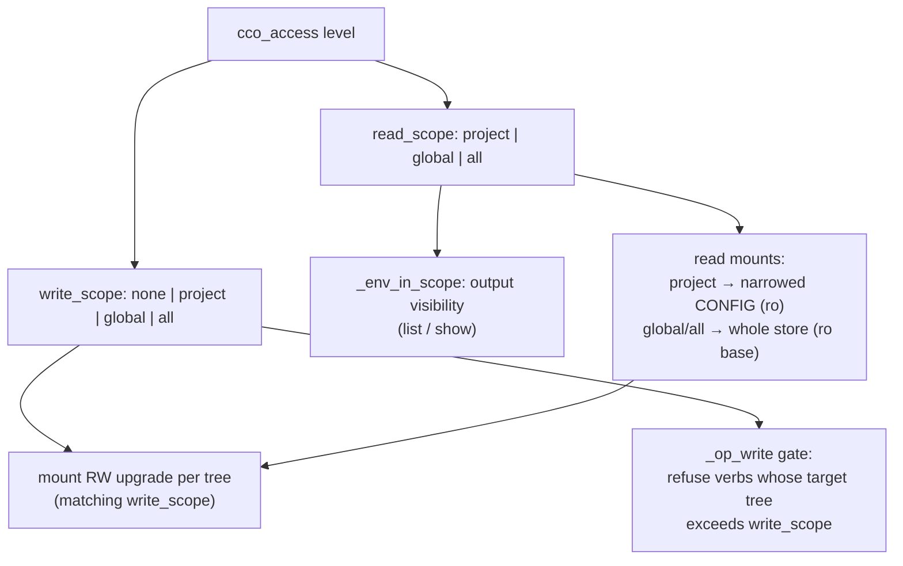

# 01 — Symmetric Scope Model (R3 + R5 + D6)

> **Keystone design.** Unifies the read-output scoping (R3), the write-verb gating
> (R5), and the symmetric read/write model (D6) under one scope layer. Everything
> else in the fix workstream reads against the taxonomy defined here.

## 1. Problem

`cco_access` has seven levels — `none · read-project · read-global · read-all ·
edit-project · edit-global · edit-all` — but the implementation collapses them
into far fewer distinct behaviors on the **read** side, while the **write** side
is already scope-symmetric. The two halves disagree.

**Write side — already symmetric** (`lib/cmd-start.sh`):
- `<repo>/.cco` (project config) is RW at `edit-project` / `edit-all` (`:964`), RO otherwise — `edit-global` does *not* edit project config.
- `~/.cco` global store + DATA registry + CACHE are RW at `edit-global` / `edit-all` (`_op_rw=""`, `:1024-1069`), RO otherwise.
- Net: `edit-project → project`, `edit-global → global`, `edit-all → both`. Correct and symmetric.

**Read side — flat** (`lib/access-scope.sh`):
- `_env_read_rank` (`:61-67`): `read-project→1`, `read-global→2`, `read-all|edit-*→3`.
- `_env_in_scope` (`:100-118`): `rank>=2 → everything visible`.
- Net: `read-global == read-all == edit-project == edit-global == edit-all` for read output. Only `read-project` actually scopes.
- The CONFIG *mount* echoes this: only `read-project` narrows (`:1028`); `edit-project` mounts the **whole** `~/.cco` store RO (`:1043`) — it reads globally.

**Consequence**: four of the seven levels are read-indistinguishable; `edit-project`
reads the whole global store instead of its project scope; `read-global` and
`read-all` are identical. ADR-0043's taxonomy table (`:53-59`) ratified this by
grouping `read-global / read-all` in one "all" column and omitting `edit-*` — so
the code is faithful to the ADR, but the ADR under-specifies the model the write
side already implements.

## 2. Target model — read/write symmetric on `{project, global, all}`

Two derived scopes per level:

| Level | `read_scope` | `write_scope` |
|---|---|---|
| `none` | none (cco refused) | none |
| `read-project` | project | none |
| `read-global` | global | none |
| `read-all` | all | none |
| `edit-project` | project | project |
| `edit-global` | global | global |
| `edit-all` | all | all |

**Read visibility by `read_scope`** (the only difference `global` vs `all` is the
`project` kind — other projects; packs/llms/templates/remotes are global-store
resources, fully visible at `global`):

| Kind | `project` | `global` | `all` |
|---|---|---|---|
| project (other) | current only | current only | **all** |
| pack | referenced only | all | all |
| llms | referenced only | all | all |
| template | hidden | all | all |
| remote | hidden | all | all |

**Write authority by `write_scope`**:

| Tree | project | global | all |
|---|---|---|---|
| `<repo>/.cco` (project config) | RW | RO | RW |
| `~/.cco` store (packs, templates, global config) | RO | RW | RW |
| DATA registry (tags, remotes, source) | RO | RW | RW |
| CACHE (llms) | RO | RW | RW |
| other projects' `.cco` | — | — | RW (config-editor) |

`config-editor` = `edit-all` (broad); `tutorial` = `read-project`.



## 3. Design — scope layer (`lib/access-scope.sh`)

### 3.1 `_env_read_scope()` replaces `_env_read_rank()`
Map the level to `project|global|all|none` (a named scope, not an opaque rank).
`edit-*` no longer maps to "all" — each maps to its matching scope. Keep a thin
`_env_read_rank` shim (project=1, global=2, all=3) if any caller still needs an
ordinal comparison, but derive it from `_env_read_scope`.

### 3.2 `_env_in_scope(kind, name[, owner])`
Rewrite around `read_scope` per the visibility table:

```
scope := _env_read_scope
host (not operator)            → visible            # INV-A unchanged
scope == all                   → visible
scope == none                  → hidden             # (cco is refused before here anyway)
scope == global:
    kind == project            → visible iff name == current_project
    else                       → visible            # packs/llms/templates/remotes all global
scope == project:
    kind == project            → visible iff name == current_project
    kind == pack               → visible iff name ∈ CCO_PROJECT_PACKS
    kind == llms               → visible iff name ∈ CCO_PROJECT_LLMS
    kind ∈ {template, remote}  → hidden
    else (owner-tagged)        → visible iff owner == current_project
```

The hidden-notice machinery (`_env_note_hidden` / `_env_flush_hidden_notice` /
`_env_require_visible`) is unchanged — it already reports count-only per kind.

### 3.3 Global-class verb gating (shim `_op_read`)
`template …` / `remote list` currently need `read-global+`. Under the model they
need `read_scope ∈ {global, all}` — i.e. the same, but derived from
`_env_read_scope` so the source of truth is single (INV-E).

## 4. Design — mount generation (`lib/cmd-start.sh`)

Split the conflated `if edit-global|edit-all` policy into two orthogonal axes.

### 4.1 Read mounts — driven by `read_scope`
- `read_scope == project` (⇐ `read-project` **and** `edit-project`): narrowed CONFIG — referenced personal-store packs only, ro. **This is the key change**: `edit-project` now narrows too, instead of mounting the whole store (`:1043`).
- `read_scope == global` (⇐ `read-global`, `edit-global`): whole `~/.cco` store mounted, ro base.
- `read_scope == all` (⇐ `read-all`, `edit-all`): whole store; other projects' `.cco` mounted only in the `config-editor` broad preset (normal sessions never mount other projects' configs — so `global` vs `all` differs there only in index/name visibility, §6).

### 4.2 Write RW — driven by `write_scope`, per tree
Applied on top of the read mount, upgrading specific trees to RW:
- `write_scope == project` → `<repo>/.cco` RW (unchanged from `:964`).
- `write_scope == global` → `~/.cco` store + DATA + CACHE RW.
- `write_scope == all` → both of the above (+ other projects' `.cco` in config-editor).

The `<repo>/.cco` structural overlay (Axis A, `:964`) and the operator-bucket RW
(`_op_rw`, `:1025`) both re-key off `write_scope` instead of the hard-coded level
lists, so the two stay consistent.

## 5. Design — write gate (R5, shim `_op_write` in `bin/cco`)

Today `_op_write` (`:233-238`) authorizes any write iff `can_write` (level ∈
`edit-*`), ignoring the target. Make it scope-aware: classify each write verb's
**target tree** → required `write_scope`, refuse cleanly (exit `2`, D8) at the gate
*before* the RO filesystem.

| Verb (class) | Target tree | Requires `write_scope` |
|---|---|---|
| `project.yml` / `<repo>/.cco` edits (direct file edit) | project config | project (edit-project+) |
| `pack create/remove/…`, `template create/remove/…` | `~/.cco` store | global (edit-global+) |
| `tag add/remove`, `remote add/remove` | DATA registry | global (edit-global+) |
| `llms install/remove/update/…` | CACHE | global (edit-global+) |
| `config save` | `~/.cco` store | global (edit-global+) — already enforced (`cmd-config.sh:94`) |
| cross-project write (target ≠ current project) | other project | all (edit-all) |

`config save`'s existing check is the template; the sibling verbs adopt the same
classification. Cross-project targets (e.g. `cco tag add <other-project>`) require
`edit-all` (write_scope=all) — falling out of the same axis, not a bolt-on guard.

**Defense in depth** (secondary): the lib write functions (`cmd-pack.sh:57/62`,
`cmd-template.sh`, `tags.sh:71/81`, `cmd-remote.sh:166/170`) still run their
success `echo` unconditionally after a failed `mktemp`/`mkdir`/`cp`. Add an rc
check so a write that somehow reaches a RO tree fails loudly (exit `1`) instead of
false-succeeding. The gate makes this unreachable in normal flow, but the
belt-and-braces closes S5-01 at the source too.

`cco llms install` (S5-04) additionally: default the derived name (no interactive
prompt in a non-interactive agent session) and pre-check writability.

## 6. Edge cases & clarifications

- **`global` vs `all` in a normal session**: other projects' `.cco` are never mounted outside `config-editor`, so `all` adds, in practice, only *other-project name/index visibility* (`cco list projects`, `cco path list`). `read-all`/`edit-all` are therefore mostly a config-editor concern; a normal session rarely needs `-all`. Documented so the distinction is not mistaken for dead code.
- **config-editor (`edit-all`)**: read_scope=all, write_scope=all → sees and edits every mounted project's `.cco`. The `--project` narrowing (D9) restricts *which* projects mount, not the scope math. Introspection uses `CCO_CONFIG_TARGETS` (see `02-session-identity.md`).
- **presets not in the index**: `read_scope`/`write_scope` derive purely from the level, independent of index membership — so tutorial/config-editor resolve their scope correctly even though they are absent from the STATE index (the index gap is R2's concern, not the scope layer's).
- **`none`**: `read_scope == none` and cco is refused wholesale (R6) — `_env_in_scope` is never reached in-session.
- **membership signals**: `CCO_PROJECT_PACKS` / `CCO_PROJECT_LLMS` (exported by `cco start`) remain the project-scope membership source; unchanged.

## 7. Interaction with R3 (read `list <kind>` dispatcher)

Under the flat model, `edit-project` read "everything", which *masked* the
dispatcher bug (S5 seeds F2a/F2b "not reproduced at edit-project"). Making
`edit-project` read-scoped **un-masks** it — so R3 must be fixed as part of this
keystone, not separately:

- Route the bare `cco list <kind>` path through the scope layer, exactly as the aggregate `cco list` does (`_env_in_scope` per row + `_env_flush_hidden_notice`). Each per-kind list (`cmd_pack_list`, `cmd_template_list`, `cmd_llms_list`, `_cmd_remote_list`) gets the same `_env_in_scope` guard `cmd_project_list` already has (`cmd-project-query.sh:30`).
- `cco list pack`'s `check_global` (`cmd-pack.sh:92`) must **degrade** in operator mode — at `read_scope=project` the narrowed mount legitimately lacks the global store, so the verb shows the referenced packs + hidden-notice, never the host-only "run cco init" error (exit `2` if truly nothing in scope, not exit `1`).
- Fixes the S6-03/R9 sibling where `cco pack list` currently *executes* instead of redirecting — the dispatcher is the single wiring point.

One scope layer now serves the aggregate `cco list`, every per-kind `cco list
<kind>`, and every `<kind> show`, at every level (INV-E).

## 8. Alternatives considered

- **Keep the flat 2-tier read model** (status quo). Rejected: makes four of seven levels read-identical (`read-global`/`read-all`/`edit-*`), contradicts the already-symmetric write side, and leaves `edit-project` reading the whole global store — the exact incoherence the review surfaced. The level names would over-promise a gradation the behavior doesn't deliver.
- **Make writes flat to match the flat reads** (invert the symmetry). Rejected: the write side is the *correct* half (least-privilege edit-project must not write global config); flattening it would be a security regression.
- **Three read tiers but merge `edit-project` into `global`** (edit-project reads global, writes project). Rejected: breaks symmetry and least-privilege — an edit-project agent should not read the whole global store; it mirrors read-project.

## 9. Doc/ADR reconciliation (this cluster's share of §5 in the overview)
- ADR-0043 taxonomy table: add `edit-*` columns; split `read-global` vs `read-all`; state the sole `global`/`all` difference is other-project visibility.
- ADR-0042: clarify "mirror/symmetric" = read tier equals write tier's scope.
- `lib/access-scope.sh` header comment, `CLAUDE.md`, managed `cco-config-interaction.md`: replace "edit-* read everything" with "each level reads at its matching scope (`project`/`global`/`all`)".
