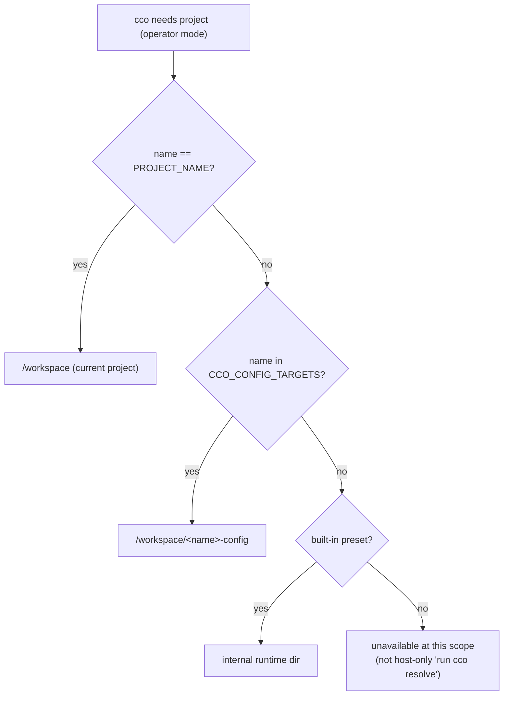

# 02 — Session Identity & Introspection (R1 + R2 + R4 + F4)

> In-container the CLI does not know **which container it runs as** (R1), **which
> project it is** (R2, R4), or **what access it has** (F4). All three are
> "the session can't introspect itself" — distinct mechanisms, adjacent fixes.

## R1 — Container identity via labels (not `cc-<name>` names)

**Cause.** `cco start` launches with `docker compose run --rm` (`cmd-start.sh:1389`),
which **ignores** the compose `container_name: cc-${project}` (`:839`) and assigns
`<project>-claude-run-<hash>`. Every detection greps `^cc-<name>$` → never matches.
The compose already declares `labels: cco.project: "${project}"` (`:841`) — present
but unused. Verified live: the running container is `claude-orchestrator-claude-run-…`.

**Blast radius (one root, 5 sites — all fail):**

| Site | File:Line | Consequence |
|---|---|---|
| `cco list projects` status | `cmd-project-query.sh:50` | always "stopped" (the maintainer's finding) |
| `cco project show` status | `cmd-project-query.sh:230` | always "stopped" |
| duplicate-session guard | `cmd-start.sh:474` | never fires → concurrent dupes of one project |
| `cco stop <project>` | `cmd-stop.sh:41` | never matches → session orphaned |
| `cco stop` (all) | `cmd-stop.sh:53` (`--filter name=cc-`) | matches nothing → stops nothing |

**Design.** `run --rm` is the intended launch (design-docker.md §5.1) — do **not**
switch to `up -d`. Detect via the existing label:

```
docker ps --filter "label=cco.project=<name>" --format '{{.ID}}' | grep -q .   # running?
docker ps --filter "label=cco.project=<name>" -q                                # stop target
```

Replace the five `cc-<name>`-name greps with label filters. The compose template
and the `cc-<project>` **network** name (`:495`, independent of container name)
are unchanged. Add a compose-generation invariant note: the `cco.project` label is
the session-identity contract; `container_name` is cosmetic under `run`.

**Edge cases.** Label filter matches only *this* project's session (labels are
exact); a stale exited container won't match `docker ps` (running only) — correct
for status. `cco stop` should target running containers by label and `docker stop`
them (the `--rm` removes on exit).

## R2 — In-container project/preset resolution (+ R4)

**Cause.** `_resolve_unit_dir_for_project` (`cmd-resolve.sh:65-77`) is index-only:
it reads `_index_get_path` (a **host** path) and checks `-f "$p/.cco/project.yml"`.
In-container those host paths don't exist → returns 1 → "not found, run cco resolve"
(a host-only hint). It never consults `PROJECT_NAME`, the mounted `/workspace`
trees, or the config-editor targets, and built-in presets are absent from the index
entirely. Design (ADR-0042 Context, ADR-0043 §2) says in-container resolution
*should* succeed.

**R4 "Used by" is the same bug.** `_project_foreach` (`cmd-resolve.sh:87-97`)
resolves every project's `project.yml` through the same host-path resolver → all
`continue`d in-container → `cco pack show`/`cco list llms` "Used by: (none)". The
YAML parser and `grep -qxF` are correct — they never receive input. Fixing the
resolver fixes the membership scan.

**Design — an operator-mode resolver.** Add a container-aware resolution layer that
`_resolve_unit_dir_for_project` and `_project_foreach` use when
`_cco_container_operator` is true, resolving a project **name** to its **mounted
container path** in this order:

1. `name == PROJECT_NAME` → the current project, mounted under `/workspace` (the repo + its committed `.cco`). Self-introspection succeeds from any cwd, including `/workspace` root.
2. `name ∈ CCO_CONFIG_TARGETS` (config-editor, D9) → its mounted `.cco` tree (`/workspace/<name>-config`).
3. `name` is a built-in preset (tutorial/config-editor) → the internal runtime dir (`_cco_internal_runtime_dir`), so presets resolve their own config.
4. Otherwise → **not resolvable in-session** (its `.cco` is not mounted): return a distinct "unavailable at this scope" status, **not** the host-only "run cco resolve" hint.

`_project_foreach` in operator mode then enumerates only the *mounted* projects
(current project in a normal session; all `CCO_CONFIG_TARGETS` in config-editor;
all mounted `.cco` in the `edit-all` broad preset). The membership scan therefore
answers correctly for mounted projects and reports "unavailable at this scope" for
the rest (D10) — never a false "(none)".

**config-editor `--project` (D9).** `PROJECT_NAME` stays `config-editor` (never
overloaded). `cco start --project <name>` exports `CCO_CONFIG_TARGETS=<name>[,…]`.
The resolver (step 2) and the membership scan key off it; the managed rule +
Level-A instruct the config-editor agent to introspect/validate the **target**, not
`PROJECT_NAME`.

**Bare `project show`/`coords`/`validate` (F3 residue).** With the resolver
container-aware: `cco project show <current-name>` resolves via step 1; from
`/workspace` root it resolves via `PROJECT_NAME`; `cco project coords` must also
**accept a name argument** (today cwd-only). Bare-namespace refusals (`'cco project '`)
are handled in `04-cli-ux.md` (R9).



## F4 — Permission-state export + minimal introspection verb

**Cause.** Only `CCO_CCO_ACCESS` is exported (`cmd-start.sh:894`);
`claude_access`/`show_host_paths` are computed (`:243`/`:258`) but not exported
(ADR-0043 deferred them "until a verb needs them"). No verb reports the session's
own state; unknown verbs like `cco whoami` are refused as "host-only" (R9).

**Design.**
- Export `CCO_CLAUDE_ACCESS` and `CCO_SHOW_HOST_PATHS` alongside `CCO_CCO_ACCESS` (the deferral's trigger — "a verb now needs them" — has arrived).
- Add a **minimal, read-safe, always-available** session-introspection verb reporting: `cco_access`, `claude_access`, `show_host_paths`, current project (`PROJECT_NAME`) + config targets, and which config trees are RW vs RO (from `write_scope`, `01-scope-model.md`). Available at every read level, refused only at `none` (where cco is refused wholesale).
- **Verb name/shape deferred to the CLI-UX review** (ratified): `whoami` vs `session`, and whether to reserve `cco status` for global cco state, are UX-review calls. This fix ships the *capability* under a working name; the review finalizes naming. Adding the known verb to the shim's valid-verb set also removes the "unknown ≡ host-only" misfire for it (R9).

**Interaction.** The introspection verb consumes R2's resolver (to name the current
project + its mounted trees) and the `01` scope layer (to report RW/RO). Build it
after both.

## Consolidated fix loci
| Root | Primary loci |
|---|---|
| R1 | `cmd-project-query.sh:50,230` · `cmd-start.sh:474` · `cmd-stop.sh:41,53` (label filters) |
| R2/R4 | `cmd-resolve.sh:65-97` (operator-mode resolver + `_project_foreach`) · `cmd-start.sh` (`CCO_CONFIG_TARGETS` export) · `bin/cco` (`project coords` accepts name) |
| F4 | `cmd-start.sh:243/258/894` (export) · `bin/cco` (new verb + valid-verb set) |
